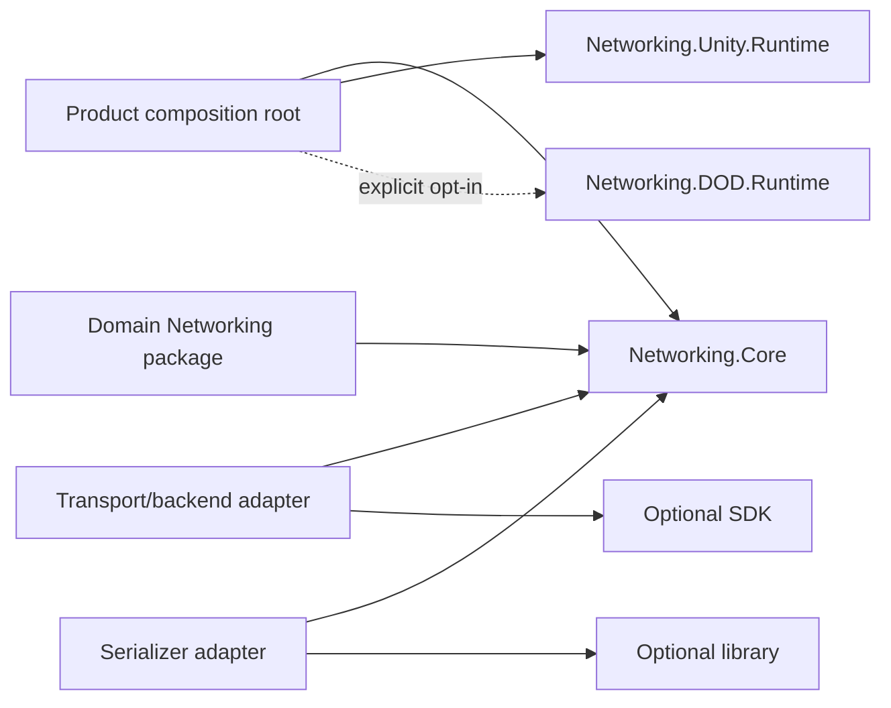

# CycloneGames.Networking

[English | 简体中文](README.md)

CycloneGames.Networking 是一个 transport-neutral 底层模块，提供版本化 message protocol、transport integration、有界内存所有权、replication planning、确定性模拟协调、session recovery、security policy 和 diagnostics。纯 C# 契约位于 Core；Unity 行为、Editor 工具、serializer 和第三方 SDK bridge 位于独立 assembly。Topology、authority、authentication、key management、matchmaking、backend deployment、schema rollout 和 content compatibility 由产品负责。

## 目录

- [概述](#概述)
- [架构](#架构)
- [快速上手](#快速上手)
- [核心概念](#核心概念)
- [使用指南](#使用指南)
- [进阶主题](#进阶主题)
- [常见场景](#常见场景)
- [性能与内存](#性能与内存)
- [故障排查](#故障排查)

## 概述

本模块提供 transport、connection、runtime-context、serializer 和 canonical message-endpoint 契约。Protocol 注册仅通过 manifest 完成，具有显式 ID range、contract identity、payload budget、channel、version window 和 fingerprint。有界 buffer、queue、rate-limit state、sequence window、reconnection reservation 和 simulation history 由产品 composition root 或相应 subsystem 显式持有。Replication、interest、prediction、lockstep、rollback、session 和 host-handoff primitive 是供产品显式组合的基础能力。Unity runtime bridge、LAN host permission 指引、Editor diagnostics 以及可选 backend/serializer integration 共同构成完整 package。

本模块不包含 RPC framework、通用 Service Locator 或自动 state-variable replication。Request、response、command 和 notification 语义由产品自有的版本化 message 表达。Composition 必须显式且由 instance 持有。

### 主要特性

- Transport、connection、runtime-context、serializer 和 canonical message-endpoint 契约。
- 仅通过 manifest 的 protocol 注册，具有显式 ID range、contract identity、payload budget、channel、version window 和 fingerprint。
- 有界 buffer、queue、rate-limit state、sequence window、reconnection reservation 和 simulation history。
- Replication、interest、prediction、lockstep、rollback、session 和 host-handoff primitive。
- Unity runtime bridge、LAN host permission 指引、Editor diagnostics 和可选 backend/serializer integration。

## 架构

本包位于 `Assets/ThirdParty/CycloneGames`，属于 asset-style package；其中的 `package.json` 不会安装依赖。`Packages/manifest.json`、`packages-lock.json`、asmdef reference/condition、platform setting 和 Unity 实际编译结果共同决定激活状态。

| Assembly | 职责 | 激活条件 |
| --- | --- | --- |
| `CycloneGames.Networking.Core` | 纯 C# 契约与实现；`noEngineReferences: true`。 | 自动引用；依赖 `CycloneGames.DeterministicMath.Core` 和 `CycloneGames.Hash.Core`。 |
| `CycloneGames.Networking.Unity.Runtime` | Unity bridge、基础 JSON serializer、prediction、interest、compression 和 diagnostics。 | 自动引用；依赖 Core。 |
| `CycloneGames.Networking.Platform.Permissions` | Unity-facing LAN host permission 契约和平台实现。 | 自动引用；依赖 UniTask。 |
| `CycloneGames.Networking.Editor` | Bootstrap preset/diagnostics 和 LAN host permission window。 | 仅 Editor。 |
| `CycloneGames.Networking.DOD.Runtime` | 基于 NativeContainer 的 interest manager；不调度 Job，也不使用 Burst。 | 显式 asmdef reference；依赖 `Unity.Collections` 和 `Unity.Mathematics`。 |
| `CycloneGames.Networking.Tests.Editor` | EditMode 测试。 | 仅 Test Runner；显式 asmdef reference。 |
| `CycloneGames.Networking.Serializer.NewtonsoftJson` | Newtonsoft JSON adapter。 | 显式 asmdef reference；依赖 `com.unity.nuget.newtonsoft-json`。 |
| `CycloneGames.Networking.Serializer.MessagePack` | MessagePack adapter。 | 显式 asmdef reference；依赖 `com.github.messagepack-csharp`。 |
| `CycloneGames.Networking.Adapter.Mirror` | Mirror transport bridge。 | 显式 asmdef reference；依赖 `com.mirror-networking.mirror`。 |
| `CycloneGames.Networking.Adapter.Mirage` | Mirage transport bridge。 | 显式 asmdef reference；依赖 `com.miragenet.mirage`。 |
| `CycloneGames.Networking.Adapter.Nakama` | Nakama client/backend bridge。 | 显式 asmdef reference；依赖 `com.heroiclabs.nakama-unity`。 |

可选 assembly 只有在目标平台匹配、全部 assembly reference 可解析、`versionDefines` 已生成 capability symbol 且 `defineConstraints` 成立时，才具备编译条件。`autoReferenced: false` 不会关闭 assembly 编译；它表示 consumer 必须显式添加 asmdef reference 才能使用该 assembly 的 API。不要在 PlayerSettings 中重复定义自动生成的 capability symbol。

Core、Unity Runtime、Permissions、Editor、Tests、DOD、NewtonsoftJson 与各领域 Networking package 使用直接 assembly reference。Mirror、Mirage、Nakama 与 MessagePack adapter 只在 Unity Package Manager 能解析其声明的 package 和版本约束时参与编译。未安装可选依赖的 consumer 不应引用或使用对应 adapter assembly。

### 所有权


```mermaid
flowchart LR
    Product[Product composition root] --> Core[Networking.Core]
    Product --> Unity[Networking.Unity.Runtime]
    Product -. explicit opt-in .-> DOD[Networking.DOD.Runtime]
    Adapter[Transport/backend adapter] --> Core
    Adapter --> SDK[Optional SDK]
    Serializer[Serializer adapter] --> Core
    Serializer --> Library[Optional library]
    Family[Domain Networking package] --> Core
```

- Core 不引用 Unity、backend SDK、可选 serializer library 或 domain Networking package。
- Adapter 只转换 lifecycle、identity、channel 和 byte delivery，不决定产品 authority 或 gameplay policy。
- 每个 adapter instance 持有自身 runtime context、connection wrapper、callback binding、有界可变状态和 shutdown；composition 中不存在 static adapter accessor。
- `NetworkRuntimeContext` 通过显式构造创建，在 `Build()` 前接收 service，之后被冻结。它是 instance-scoped composition object，不是全局查询点。
- Domain package 在 Module range 中拥有互不重叠的范围。游戏专用 contract 使用产品自有的 User-range manifest。

## 快速上手

1. 根据产品需求选择 topology 和 backend，只安装并锁定实际使用的 SDK。
2. 为 Core、Unity Runtime 和所选可选 assembly 添加显式 asmdef reference。
3. 在产品 composition root 中将所选 adapter 构造为产品的 `INetworkMessageEndpoint`。
4. 使用协议所属模块的 codec 将领域消息编码为 canonical bytes，注册非泛型 `NetworkMessageHandler`，并持有其 `NetworkMessageHandlerLease` 直到 shutdown。回调 span 仅在 handler 执行期间有效。
5. 在接收流量前构建全部 protocol manifest，并通过 `INetworkMessageCatalog.TryRegisterProtocolManifest` 注册。
6. 配置 message policy、可选 rate limiting、sequence protection、signing、payload/wire-byte budget、日志脱敏和 shutdown ownership。
7. 对每个发布平台运行 bootstrap diagnostics、聚焦测试、目标 Player build 和 backend interoperability test。

`INetworkMessageEndpoint` 不选择 serializer，也不发现 message type。`GetMaxPayloadSize` 综合 protocol descriptor、adapter 配置预算、channel 支持和 backend packet limit。重复注册 handler 会立即失败；默认 handler registry 最多持有 1,024 个 live registration；释放过期或复制的 lease 不会移除更新一代注册。

### 定义产品 Protocol

`ContractId` 是稳定的 printable-ASCII wire identity。`SchemaHash` 是该精确字符串的、签入源码的 FNV-1a64 值。两者都不能来自 CLR type name、reflection、`GetHashCode`、初始化顺序或 Unity object identity。

```csharp
using System;
using CycloneGames.Networking;

private const ushort MoveCommandId = NetworkConstants.UserMsgIdMin;
private const string MoveCommandContract = "MyGame.MoveCommand:v1";
private const ulong MoveCommandSchema = 0xAEF19F1ABB555DB0UL;

var manifest = new NetworkProtocolManifestBuilder(
    "MyGame",
    MoveCommandId,
    (ushort)(MoveCommandId + 31))
{
    ProtocolId = "com.mycompany.mygame.networking",
    CurrentVersion = 1,
    MinimumSupportedVersion = 1
}
.AddMessage(
    MoveCommandContract,
    MoveCommandId,
    MoveCommandSchema,
    NetworkChannel.UnreliableSequenced,
    maxPayloadSize: 96)
.Build();

if (!catalog.TryRegisterProtocolManifest(manifest))
    throw new InvalidOperationException("Protocol manifest conflicts with the active catalog.");
```

必须在 protocol test 中冻结 canonical string 及其 literal hash。字段、encoding、unit、quantization、authority 或语义发生不兼容变化时，必须使用新的 contract identity，并协调全部 endpoint rollout。

## 核心概念

### Manifest-only Catalog

全局 message space 分为三个 range：

| Range | ID | Owner |
| --- | ---: | --- |
| System | `0-999` | Framework-level transport 与 control contract。 |
| Module | `1000-29999` | 显式 CycloneGames/domain package manifest。 |
| User | `30000-65535` | 产品自有 manifest。 |

`NetworkMessageDescriptor` 只包含稳定 wire fact：`MessageId`、`ContractId`、`Owner`、`SchemaHash`、`DefaultChannel` 和 `MaxPayloadSize`，不保存 runtime type name。

`NetworkMessageCatalog` 只接收完整的 `NetworkProtocolManifest`。注册会在修改前验证 manifest，拒绝 range overlap 或 ID conflict，并在同一个 lock 内提交 range 和全部 descriptor。重复注册相同 protocol definition 是幂等操作。`MessageCount`、`ManifestCount`、`TryGet`、`TryGetRegisteredRange` 和 `ProtocolFingerprint` 用于读取最终 catalog state。

Manifest 与 catalog fingerprint 只基于稳定 contract fact 计算。Version window 与 free-form metadata 单独协商或报告。Fingerprint 一致只能证明 schema agreement，不能证明 peer identity。

### 固定 Frame

`NetworkFrameCodec` 定义 22-byte little-endian header，后接 payload byte。Parser 会拒绝非法 segment、错误 magic、不支持的 version、异常 header length、非法 flag/channel、非零 reserved byte、负数/truncated/trailing payload，以及在请求校验时出现的 checksum mismatch。

FNV-1a checksum 只检测偶发损坏和 parser 分歧，不是 MAC。必须先校验 frame 与 descriptor payload budget，再执行 deserialize。Serializer setting、compression rule、quantization range 和 baseline 都是版本化 protocol state。

## 使用指南

### Runtime 基础能力

- Replication planner、spatial index、state cache、send budget 和 packet builder 都是 primitive；产品仍是 relevance 与 overload policy 的唯一 authority。
- Unity interest manager 提供 grid、group、team visibility 和 composite 选择。DOD assembly 提供两个必须显式 dispose 的 NativeContainer-backed alternative：`NativeGridInterestManager` 和 `NativeTeamVisibilityInterestManager`。它不是 ECS，不调度 Job，也不使用 Burst。
- Prediction、interpolation、lag compensation、lockstep、rollback、reconnection、session directory、matchmaking coordination 和 host handoff 是彼此独立的能力。
- `QuantizedVector3`、`QuantizedQuaternion` 与 `DeltaCompressor` 使用显式 little-endian encoding 和固定 quantization configuration。Quantization 与 delta baseline 属于 protocol manifest 和 endpoint rollout。
- `ActorRouteTable` 是进程内 helper，不是 distributed router。它应拥有唯一 owner 和外部 capacity policy。
- `LocalLoopTransport` 用于可重复的进程内开发，不模拟 latency、loss、NAT、encryption、多 client load 或 release transport behavior。

### 可选 Transport 与 Backend Adapter

| Adapter | 边界 | 契约限制 |
| --- | --- | --- |
| Mirror | Client/server/host Unity bridge。 | 所有 Mirror SDK 访问、lifecycle、send、broadcast、disconnect 和 callback 都留在 Unity main owner thread；不存在跨线程发送队列。报告的 payload ceiling 取配置上限与 `NetworkMessages.MaxContentSize` 扣除最坏情况 `ArraySegment<byte>` 前缀及 Cyclone header 后容量的较小值；transport 缺失或无法查询时报告零。 |
| Mirage | Client/server Unity bridge。 | 所有 Mirage SDK 访问都留在 Unity main owner thread。Server send、broadcast 和 disconnect 只接受已认证 remote-client route；host-local 与 client-to-authority route 使用不同的内部角色。报告的 payload ceiling 取配置上限与已分配 `SocketFactory` 容量扣除 Mirage message ID、packed length 和 Cyclone header 后容量的较小值；缺失 factory 时报告零。 |
| Nakama | Client-side auth、socket、realtime match、presence 和 matchmaking bridge。 | 只支持 reliable match-state channel。注入的 `ISocket` callback 与 task continuation 必须留在 Unity main owner thread；违反契约时立即失败且不排队。Pending send 和 live connection route 均有界。`SendToServer` 只支持 authoritative match；不支持 server-to-client 与 server-broadcast endpoint route；presence 来源的 state 按 peer-to-peer 分发。 |

Mirror 与 Mirage 为每条 live directional route 分配一个 managed connection wrapper，并在 packet dispatch、error reporting、statistics 和 lifecycle callback 中复用。Disconnect、backend object 替换、server/client stop 或 adapter 销毁时，owner 会使 wrapper 失效、从 cache 移除并释放其 backend reference。Mirage host mode 会刻意保留独立的 authority 与 host-local wrapper，因为两条 route 的发送权限不同。该设计消除了 adapter dispatch 中每包一次的 struct 到 `INetConnection` 装箱。Nakama 同样为每条 authority 或 peer route 缓存一个有界 wrapper；match 替换、presence 离开、stop 或销毁时，会先移除 route 再通知，并清除 adapter、presence 与 target reference。失效 wrapper 只保留稳定的纯值诊断信息，并拒绝 routing 或 mutation。这些结论仅描述 adapter 内部的 allocation 与 lifetime 属性，不代表端到端零分配，因为 SDK serialization、transport、delegate 和产品 handler 仍可能产生分配。产品必须使用实际采用的 SDK 版本编译并测试对应 adapter，再依赖其运行时行为。

Adapter 使用显式 instance reference，并通过 `INetworkMessageEndpoint` 接收 canonical bytes；adapter 不选择 serializer。不支持的 channel、capability、未注册的非 system message ID 或 operation 会显式失败。产品代码必须按具体 API 处理 `NetworkSendStatus`/boolean failure 和 backend exception。

`NakamaNetAdapter.TrySendMatchState` 是 backend service primitive，不是 `INetworkMessageEndpoint` authority route。直接使用时遵循 Nakama target-presence 语义，authorization 与 recipient policy 由产品负责。Nakama integration 暴露的 SDK reference 仍受同一个 Unity main-owner-thread 契约约束。

发布前必须验证已安装 SDK version、native/browser transport、callback thread、suspend/resume、shutdown、reconnect、encryption、packet limit、stripping/code generation 和 backend outage behavior。Adapter capability flag 只是契约声明，不是平台证据。

### Serializer 选择

| Serializer | Assembly 与激活条件 | 性能与安全 |
| --- | --- | --- |
| `UnityJsonSerializerAdapter` | 包含在 Unity Runtime 中，作为显式 codec building block。 | 会产生 managed string/UTF-8 工作，不是 zero-GC 热路径格式，并受 `JsonUtility` 限制。 |
| `NewtonsoftJsonSerializerAdapter` | 显式 opt-in assembly；依赖 `com.unity.nuget.newtonsoft-json`。 | 会产生 managed string；默认关闭 type-name handling。Polymorphism 必须使用显式 allow-list binder。 |
| `MessagePackSerializerAdapter` | 显式 opt-in assembly；依赖 `com.github.messagepack-csharp`。 | 使用 pooled/thread-local scratch storage，但必须验证 formatter registration、AOT 和 stripping。 |

Serializer choice 属于每个版本化 domain protocol 或产品 codec，并在调用 canonical byte endpoint 前完成。不存在 ambient registration，也不会根据已安装 package 自动选择。Serializer type、option、generated formatter、compression 和 message schema 都是必须在 peer 间一致的 protocol fact。

### Editor 工作流

通过 `Assets/Create/CycloneGames/Networking/Bootstrap Preset` 创建配置。其自定义 Inspector 会分组 validation setting，使用 `SerializedObject`/`SerializedProperty`，支持 multi-object 字段编辑，并在不能保证安全的 multi-object 结果时限制 action button。

- `Tools/CycloneGames/Networking/Bootstrap Diagnostics` 按配置检查当前已打开 scene 的 bootstrap rule。
- `Tools/CycloneGames/Networking/Run Bootstrap Check` 将当前检查结果写入 Console。
- `Tools/CycloneGames/Networking/LAN Host Permission` 显示 host 指引、本机 IPv4 candidate 和 Windows firewall 状态/操作。
- 可选 adapter Inspector 只在对应 SDK integration assembly 激活后出现。

Diagnostics 只在用户请求时运行，不会在每次 repaint 中扫描 scene。它不能验证未打开的 build scene、Player execution、backend connectivity 或平台认证。依赖 authoring workflow 前，应在当前 Unity version 验证 Undo/Redo、Prefab Override、multi-object editing、domain reload、layout 和 asset safety。

## 进阶主题

### 安全边界

所有 frame、payload、sequence、token、backend response 和 address 都是不可信输入。

- 在分配或 deserialize 前解析固定 framing，并校验精确长度。
- 注册 per-message payload 与 direction policy；authority 要求时必须启用 authentication、encryption 或 signature。
- `NetworkSecurityPipelineOptions.RateLimiter` 可为 null：配置实例时启用有界 wire-byte 计费；`null` 表示 pipeline 不执行 rate limit。每次 validation call 必须显式提供实际 charge。
- `NetworkSecurityPipelineOptions.ReplayGuard` 是直接的有界 sequence-state owner。断开 peer 时移除其 state，shutdown 时清理。
- `HmacSha256NetworkMessageSigner` 精确认证稳定的 22-byte wire header 与 payload。Key material 至少 32 bytes；同一个 HMAC instance 的访问会串行化；连续 scratch storage 从 pool 租借并在归还时清理；transport-local connection/player identity 不参与签名。
- 必须为 session/peer 派生独立 key，在本包之外安全保存，显式 rotation，并 dispose signer。Frame checksum 永远不能代替 signature。
- 默认 message policy 是 permissive，默认 signer 关闭。发布 composition 必须为敏感 message 替换默认设置。
- 日志和 diagnostics 必须脱敏 key、token、payload、account identifier 与 remote error body。
- Process result enum 将 0 保留给 `Invalid` 或 `Unknown`；compatible、accepted、valid、launched 和 authenticated outcome 都是显式非零值。因此，默认初始化的 result struct 会 fail closed。

本包不实现 transport encryption、certificate validation、identity proof、key storage 或 key exchange。应使用经过目标平台验证的 TLS/DTLS/WSS 或 platform/backend security boundary，并测试真实 failure mode。

### Contract 与发布规则

- Protocol compatibility 由显式 manifest、contract identity、fingerprint 和 version window 决定，不依赖 CLR type name。
- 全部通信 endpoint 必须使用互相支持的 manifest window。Fingerprint 或 version 不匹配时应拒绝连接，不能为了继续通信而压制错误。
- Serializer setting、numeric unit、quantization、compression、channel semantic、authority 和 maximum payload 都属于 protocol fact。
- Core 必须保持 genre-neutral。类型专用行为位于可选 domain package，不能反向改变依赖方向。
- Client、server 和 service 的回滚必须协调，使其回到同一套兼容 protocol。Source rollback 不会撤销 firewall rule 或 remote backend state。

## 常见场景

### 确定性 lockstep 模拟

Lockstep simulation 传输定点输入，按 protocol manifest 校验，并在每个 peer 以相同 tick 顺序应用：

```csharp
public void SendMoveCommand(FPVector2 input, int tick)
{
    Span<byte> payload = stackalloc byte[MoveCommandPayload.Size];
    MoveCommandPayload.Write(input, tick, payload);
    endpoint.Send(MoveCommandId, payload, NetworkChannel.UnreliableSequenced);
}

public void ReceiveMoveCommand(ReadOnlySpan<byte> payload)
{
    MoveCommandPayload.Read(payload, out FPVector2 input, out int tick);
    simulation.EnqueueInput(tick, input);
}
```

### 主机移交与 Session 恢复

Session recovery flow 在 host migration 期间保持连接状态：

```csharp
public async Task MigrateHostConnectionAsync(
    NetworkSessionSnapshot snapshot,
    INetworkMessageEndpoint newEndpoint,
    CancellationToken ct)
{
    sessionCoordinator.CaptureReconnectionState(snapshot);
    await sessionCoordinator.HandoffAsync(newEndpoint, snapshot.AuthorityToken, ct);
    replicationPlanner.ResumeFromCheckpoint(snapshot.ReplicationSequence);
}
```

### 带 Rate Limit 的安全 Pipeline

安全敏感 endpoint 在处理前应用 rate limiting、replay protection 和 message signing：

```csharp
var pipeline = new NetworkSecurityPipeline(
    new NetworkSecurityPipelineOptions
    {
        RateLimiter = sessionRateLimiter,
        ReplayGuard = sessionReplayGuard,
        Signer = sessionSigner,
    });

if (!pipeline.ValidateIncoming(connectionId, messageId, frameHeader, payload, out var error))
{
    LogSecurityEvent(connectionId, error);
    return;
}
```

## 性能与内存

| 能力 | Owner 与生命周期 | 并发规则 | 容量与失败行为 |
| --- | --- | --- | --- |
| `NetworkBufferPool` | 进程级 pool；每次 `Get` 返回一个只能正确 dispose 一次的 lease。 | Pool bookkeeping 已同步；buffer content 仍为 single-owner。 | Retention 有界且可配置。Stale/default/double return 显式失败；清理敏感 byte 会增加 CPU 成本。 |
| `NetworkBuffer` | 带 generation check 的 `readonly struct` lease；复制值共享同一个 token。 | 禁止并发读写同一个 lease。 | Dispose 任意副本会使全部副本失效；borrowed span/segment 与 lease 同寿命。 |
| `NetworkMessageCatalog` | Composition root 在冷启动阶段注册 manifest。 | Catalog mutation/query 使用 lock；禁止每 tick 注册。 | Conflict 返回 `false`，且不会部分发布。 |
| `LocalLoopTransport` | 一组进程内开发 server/client；caller 负责 stop/dispose。 | Main-thread polling。 | 单 peer、reliable channel、有界 queue 和有界 dispatch；release build 不可用。 |
| `RateLimiter` | 一个 session/security owner；断开连接时移除 peer，并清理 idle state。 | Concurrent connection table 加 per-bucket synchronization。 | Tracked connection 和 token budget 有界；非法时间或容量耗尽时 fail closed。 |
| `NetworkReplayGuard` | 一个 session/security owner；shutdown 时清理。 | Concurrent connection table，加锁的 per-message window。 | Peer/stream 有界且使用 64-sequence window；duplicate、stale、invalid 或 over-capacity 输入会被拒绝。 |
| `NetworkProfiler` | Diagnostics owner；session boundary 重置。 | Counter/statistics 已同步。 | Tracked message ID 有上限；稳定副本查询属于会分配的冷路径。 |
| `NativeGridInterestManager` / `NativeTeamVisibilityInterestManager` | 显式 single owner；caller 必须 `Dispose`。 | Mutation 与 query 在 caller 指定的 owner thread 执行；这些类型不调度 Job。 | 超出配置容量时 persistent native storage 会增长；必须用真实分布和 memory ceiling 做 benchmark。 |

`NetworkTickId` 使用 signed `long` 保存 tick，负值非法。`NetworkTickRate`、network time、server-time estimate、rate limiting、reconnection 和 security validation 使用 `double` 秒。它们必须接收同一个有限的 monotonic time source。这能避免过短 wrap horizon 并减轻长时间运行的精度损失，但不能单独保证 deterministic simulation。

通过 `INetReader`/`INetWriter` 的 interface call、JSON conversion、collection growth、diagnostics snapshot 和 backend SDK call 都可能分配。应预设有界 storage 容量，并对游戏实际使用的 serializer、payload、transport、platform、backend 和 entity distribution 做 profile。

### 持久化

- Core、Unity Runtime、pool、catalog、profiler 和 session/simulation helper 不会自动写文件或 Unity preference store。
- `NetworkBootstrapPreset` 是用户在显式 project path 创建的 `ScriptableObject`；是否纳入版本控制由项目决定。
- Runtime cache 与 queue 是可重建的内存状态，owner 必须在 session teardown 或 shutdown 时清理。
- 经过用户明确批准的 Windows LAN host 操作可以在项目外创建或替换 Windows Defender Firewall rule。回滚时需通过 Windows 设置或管理员工具移除 OS rule。
- 可选 backend call 可能创建远程 session、match、ticket、account 或其他 service state。Retention、audit、deletion 和 schema evolution 仍由 backend/产品负责。

### 平台兼容性

| 目标 | 运行时边界 | 发布所需验证 |
| --- | --- | --- |
| Windows | Core 与 OS 无关；Unity 和 firewall helper 隔离平台行为。 | Standalone/IL2CPP build、UAC/firewall flow、backend interoperability、load、恶意输入和 soak。 |
| Linux / Dedicated Server | Core 支持非 Unity composition；adapter 独立激活。 | Headless Player/process lifecycle、container/socket behavior、backend SDK、load 和 shutdown。 |
| macOS | Core 没有 OS-specific dependency。 | Editor/Player build、signing、firewall/network behavior、backend 和 soak。 |
| iOS | Core 可移植；LAN permission layer 会报告所需配置。 | Xcode/IL2CPP、entitlement/privacy prompt、backgrounding、memory pressure、backend 和 reconnect。 |
| Android | Core 可移植；permission helper 只提供指引。 | Gradle/IL2CPP、Wi-Fi/mobile transition、backgrounding、memory pressure、backend 和 reconnect。 |
| WebGL | 不支持 LAN hosting；必须使用 browser-compatible adapter。 | WebGL build、browser websocket behavior、single-thread fallback、memory growth、reconnect 和 backend。 |
| 未来主机平台 | Core 避免 OS-specific contract；vendor boundary 需要 adapter。 | Vendor toolchain、SDK/network policy、suspend/resume、memory、certification 和平台 security。 |

平台支持取决于所选 transport、backend、serializer、build backend 和目标 Player。每个发布配置都必须验证 Player/IL2CPP 行为、长期稳定性、allocation、determinism、security 和硬件档位预算。

## 故障排查

| 现象 | 可能原因 | 解决方法 |
| --- | --- | --- |
| Protocol manifest 注册失败 | ID range 重叠或 descriptor 冲突 | 验证 range 边界和 contract identity；每个 ID 与 contract pair 在全部 manifest 中必须唯一 |
| Handler 注册报告重复 | 同一 message ID 注册两次 | 注册同一 ID 的新 handler 前，先取消注册并释放旧的 handler 与 lease |
| `NetworkBuffer` span 在 dispose 后无效 | Lease 在 span 消费前被 dispose | 在 dispose 或移交 lease 所有权前先复制所需字节 |
| Frame parsing 拒绝看似合法的 payload | 错误的 magic、version 或 checksum | 验证两端 codec 配置一致；检查 byte-order 或 alignment 问题 |
| 主机迁移期间 backend 连接中断 | 迁移前未捕获 reconnection state | 在开始 handoff 前捕获所有 pending send、sequence window 和 replication state |
| 密钥 rotation 后 signing 验证失败 | Signer 未对新 session 更换 key | 派生新 session key、创建新的 signer instance，并确认 key exchange 在两端完成 |
| Rate limiter 拦截合法流量 | Token budget 耗尽或 peer 未正确注册 | 检查 per-connection token 补充速率和 connection 注册顺序；移除过期的 peer |
| `LocalLoopTransport` 在 release build 不可用 | 设计如此 | local loop 仅限开发使用；发布前必须使用真实 transport adapter 测试 |
| IL2CPP build 因 adapter assembly 失败 | 缺失 SDK package 或版本不匹配 | 安装精确支持的 SDK version；验证 `versionDefines` 和 `defineConstraints` 通过 |
| Editor diagnostic 显示误报 | Diagnostic 在不完整的 bootstrap 配置上运行 | 运行 diagnostics 前确保所有必需 bootstrap preset 已赋值且 scene 已加载 |

## 验证

每个发布配置都应执行以下验证：

1. 强制 Unity script refresh/reimport，并确认全部 active assembly 编译通过。
2. 运行 `CycloneGames.Networking.Tests.Editor` 和已激活 serializer 的测试 assembly。
3. 运行所有 manifest 或 adapter 引用 Core 的仓库内 domain Networking package 测试。
4. 只有安装精确支持的 dependency 后，才编译可选 Mirror、Mirage、Nakama 与 MessagePack assembly；同时验证依赖存在和缺失两种状态。
5. 对每个发布配置运行目标 Player/IL2CPP build、stripping check、backend interoperability、suspend/resume、shutdown、packet-loss/fuzz test 和长时间 load。
6. 使用代表性 workload 测量 allocation、throughput、latency、scale、memory ceiling 和 NativeContainer performance。
7. 手工验证 Inspector Undo/Redo、Prefab Override、multi-object editing、domain reload 和 asset safety。

## 相关包

- `CycloneGames.GameplayAbilities` — 拥有 gameplay state、显式 authority/replica role 与权威 `TryExecuteAuthorityAbility` 边界；它不拥有 transport bridge。
- `CycloneGames.GameplayAbilities.Networking` — 面向非预测、authority-owned `AuthorityOnly` activation 的 fixed-wire protocol、codec、structural validator 与 result mapper。它是 protocol integration，不是 transport endpoint；产品 endpoint 负责 authentication、ownership、replay/rate policy、有界 pending state、authority-ID mapping 与 owner-thread marshaling。
- `CycloneGames.GameplayFramework.Networking`
- `CycloneGames.BehaviorTree.Networking`
- `CycloneGames.AIPerception.Networking`
- `CycloneGames.RPGFoundation.Interaction.Networking`
- `CycloneGames.RPGFoundation.Movement.Networking`
- `CycloneGames.RPGFoundation.Projectile.Networking`
