# CycloneGames.Networking

[English](./README.md) | 简体中文

一个为 Unity 设计的**生产级网络抽象层**，支持状态同步、帧同步（Lockstep）、回滚（Rollback）、客户端预测等多种网络同步模式。具备**低分配运行时性能**、**适配器感知的线程安全**与**跨平台兼容**特性。

## 特性

- **多种同步模式**：状态同步、帧同步、GGPO 风格回滚 — 按需选择
- **灵活序列化**：可插拔序列化器（Json、MessagePack、ProtoBuf、FlatBuffers）
- **清晰抽象层**：传输无关接口（`INetTransport`、`INetworkManager`、`INetConnection`）
- **客户端预测**：完整的预测 → 授权 → 回滚纠正流水线
- **确定性模拟**：Q32.32 定点数学、确定性随机数、可插拔不同步检测（`IStateHasher`）
- **复制基础设施**：基于 policy 的 interest evaluation、spatial AOI index、per-connection state cache、snapshot packet writer、adaptive send budget 与确定性 load simulation
- **可选玩法集成**：GameplayAbilities、GameplayTags、GameplayFramework 和 RPGFoundation 的网络桥接位于独立包
- **会话韧性**：backend-neutral 房间目录、匹配计划、重连保留、主机迁移与 authority transfer plan
- **项目级扩展**：Runtime profile、node capability descriptor 和 protocol manifest 让项目特定数字留在项目代码中，不需要修改 Cyclone core
- **生产硬化**：基于 scenario 的 readiness matrix，用于校验容量、协议、节点能力和故障注入覆盖
- **安全**：令牌桶限流、消息校验
- **诊断工具**：网络性能分析器、网络条件模拟器（LAN/4G/卫星预设）
- **线程安全**：Mirror 适配器内置跨线程发送队列（`ArrayPool`）；其他适配器默认主线程发送

---

## 目录

- [CycloneGames.Networking](#cyclonegamesnetworking)
  - [特性](#特性)
  - [目录](#目录)
  - [架构概览](#架构概览)
    - [设计原则](#设计原则)
  - [快速开始](#快速开始)
    - [前置条件](#前置条件)
    - [最小示例：发送和接收消息](#最小示例发送和接收消息)
    - [最小示例：使用 Mirror 适配器](#最小示例使用-mirror-适配器)
  - [模块详解](#模块详解)
    - [1. 核心抽象层 (Core)](#1-核心抽象层-core)
      - [关键枚举](#关键枚举)
    - [2. 缓冲区系统 (Buffers)](#2-缓冲区系统-buffers)
    - [3. 服务注册 (Services)](#3-服务注册-services)
    - [4. 序列化系统 (Serialization)](#4-序列化系统-serialization)
    - [5. 网络模拟时钟 (Simulation)](#5-网络模拟时钟-simulation)
    - [6. 客户端预测 (Prediction)](#6-客户端预测-prediction)
      - [快照插值](#快照插值)
      - [滞后补偿](#滞后补偿)
    - [7. 复制基础设施 (Replication Infrastructure)](#7-复制基础设施-replication-infrastructure)
    - [8. 状态同步变量 (StateSync)](#8-状态同步变量-statesync)
    - [9. 远程过程调用 (RPC)](#9-远程过程调用-rpc)
    - [10. 帧同步与确定性模拟 (Lockstep)](#10-帧同步与确定性模拟-lockstep)
      - [帧同步最小示例](#帧同步最小示例)
      - [定点数学](#定点数学)
      - [GGPO 风格回滚](#ggpo-风格回滚)
    - [11. 安全模块 (Security)](#11-安全模块-security)
    - [12. 会话与重连 (Session)](#12-会话与重连-session)
    - [13. 回放系统 (Replay)](#13-回放系统-replay)
    - [14. 网络生成管理 (Spawning)](#14-网络生成管理-spawning)
    - [15. 场景管理 (Scene)](#15-场景管理-scene)
    - [16. 数据压缩 (Compression)](#16-数据压缩-compression)
    - [17. 诊断工具 (Diagnostics)](#17-诊断工具-diagnostics)
    - [18. Gameplay Abilities 集成 (GAS)](#18-gameplay-abilities-集成-gas)
      - [消息 ID 分配](#消息-id-分配)
    - [19. 身份验证 (Authentication)](#19-身份验证-authentication)
    - [20. 平台配置 (Platform)](#20-平台配置-platform)
    - [21. 传输适配器 (Adapters)](#21-传输适配器-adapters)
    - [22. 项目级扩展 (Project Extensibility)](#22-项目级扩展-project-extensibility)
    - [23. 生产硬化矩阵 (Production Hardening Matrix)](#23-生产硬化矩阵-production-hardening-matrix)
  - [游戏类型适配指南](#游戏类型适配指南)
  - [进阶教程](#进阶教程)
    - [教程 1：从零搭建 FPS 网络同步](#教程-1从零搭建-fps-网络同步)
    - [教程 2：实现 RTS 帧同步](#教程-2实现-rts-帧同步)
    - [教程 3：使用 Replication Infrastructure 实现团队可见性](#教程-3使用-replication-infrastructure-实现团队可见性)
  - [API 速查表](#api-速查表)
    - [核心](#核心)
    - [序列化](#序列化)
    - [同步](#同步)
    - [帧同步](#帧同步)
    - [复制基础设施](#复制基础设施)
    - [会话韧性](#会话韧性)
    - [项目级扩展](#项目级扩展)
    - [生产硬化](#生产硬化)
    - [GAS 集成（`CycloneGames.GameplayAbilities.Networking`）](#gas-集成cyclonegamesgameplayabilitiesnetworking)
  - [当前适配器与协议说明](#当前适配器与协议说明)
  - [目录结构](#目录结构)
  - [许可证](#许可证)

---

## 架构概览

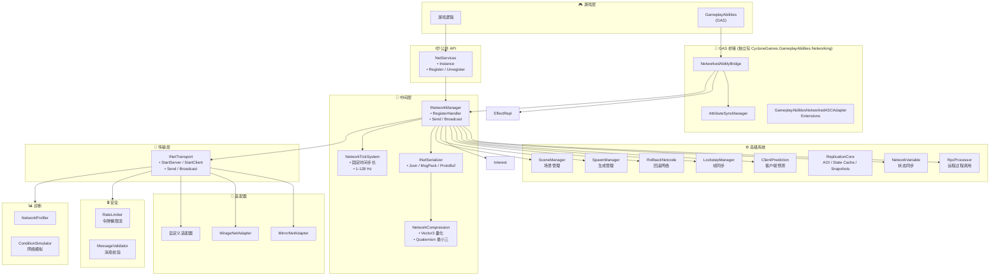
```mermaid
flowchart TB
    subgraph GameLayer["🎮 游戏层"]
        GameLogic["游戏逻辑"]
        GAS["GameplayAbilities</br>(GAS)"]
    end

    subgraph API["📦 公共 API"]
        NetServices["NetServices</br>• Instance</br>• Register / Unregister"]
    end

    subgraph HighLevel["⚙️ 高级系统"]
        RPC["RpcProcessor</br>远程过程调用"]
        StateSync["NetworkVariable</br>状态同步"]
        Prediction["ClientPrediction</br>客户端预测"]
        Lockstep["LockstepManager</br>帧同步"]
        Rollback["RollbackNetcode</br>回滚网络"]
        Replication["ReplicationCore</br>AOI / State Cache / Snapshots"]
        Spawn["SpawnManager</br>生成管理"]
        Scene["SceneManager</br>场景管理"]
    end

    subgraph Bridge["🔗 GAS 桥接 (独立包 CycloneGames.GameplayAbilities.Networking)"]
        AbilityBridge["NetworkedAbilityBridge"]
        AttrSync["AttributeSyncManager"]
        GasAdapter["GameplayAbilitiesNetworkedASCAdapter\nExtensions"]
    end

    subgraph Mid["📡 中间层"]
        INetworkManager["INetworkManager</br>• RegisterHandler</br>• Send / Broadcast"]
        TickSystem["NetworkTickSystem</br>• 固定时间步长</br>• 1-128 Hz"]
        Serializer["INetSerializer</br>• Json / MsgPack / ProtoBuf"]
        Compression["NetworkCompression</br>• Vector3 量化</br>• Quaternion 最小三"]
    end

    subgraph Low["🔌 传输层"]
        INetTransport["INetTransport</br>• StartServer / StartClient</br>• Send / Broadcast"]
    end

    subgraph Adapters["🔄 适配器"]
        Mirror["MirrorNetAdapter"]
        Mirage["MirageNetAdapter"]
        Custom["自定义适配器"]
    end

    subgraph Security["🔒 安全"]
        RateLimiter["RateLimiter</br>令牌桶限流"]
        Validator["MessageValidator</br>消息校验"]
    end

    subgraph Diagnostics["📊 诊断"]
        Profiler["NetworkProfiler"]
        CondSim["ConditionSimulator</br>网络模拟"]
    end

    GameLogic --> NetServices
    GAS --> AbilityBridge
    AbilityBridge --> AttrSync
    AbilityBridge --> EffectRepl
    AbilityBridge --> INetworkManager
    NetServices --> INetworkManager
    INetworkManager --> RPC
    INetworkManager --> StateSync
    INetworkManager --> Prediction
    INetworkManager --> Lockstep
    INetworkManager --> Rollback
    INetworkManager --> Interest
    INetworkManager --> Spawn
    INetworkManager --> Scene
    INetworkManager --> Serializer
    INetworkManager --> TickSystem
    Serializer --> Compression
    INetworkManager --> INetTransport
    INetTransport --> Mirror
    INetTransport --> Mirage
    INetTransport --> Custom
    INetTransport --> Security
    INetTransport --> Diagnostics
```

### 设计原则

| 原则           | 说明                                                                                                |
| -------------- | --------------------------------------------------------------------------------------------------- |
| **接口驱动**   | 所有子系统通过接口定义（`INetTransport`、`INetSerializer`、`IInterestManager` 等）                  |
| **零 GC 稳态** | `ArrayPool`、`ConcurrentQueue` 对象池、环形缓冲区，运行时零分配                                     |
| **模块化**     | 序列化器、传输层、兴趣管理均可插拔替换                                                              |
| **确定性支持** | Q32.32 定点数学、帧同步、回滚，适用于竞技游戏                                                       |
| **可插拔哈希** | `IStateHasher` struct 泛型约束，零成本哈希算法注入                                                  |
| **线程安全**   | Mirror 适配器提供跨线程发送队列（`ConcurrentQueue`）与 `Interlocked` 统计；其他适配器默认主线程发送 |
| **条件编译**   | Adapter 程序集使用由包驱动的私有符号，例如 `CYCLONE_NETWORKING_HAS_MIRROR`                          |

---

## 快速开始

### 前置条件

- Unity 2022.3+
- 安装一个传输层实现（如 [Mirror](https://github.com/MirrorNetworking/Mirror)）

### 最小示例：发送和接收消息

```csharp
using CycloneGames.Networking;
using CycloneGames.Networking.Services;
using UnityEngine;

// ① 定义消息结构体（值类型，零 GC）
public struct ChatMsg
{
    public int SenderId;
    public int MessageType;
}

// ② 发送端
public class ChatSender : MonoBehaviour
{
    private const ushort MSG_CHAT = 1001;

    void Update()
    {
        if (Input.GetKeyDown(KeyCode.Return))
        {
            NetServices.Instance.SendToServer(MSG_CHAT, new ChatMsg
            {
                SenderId = 1,
                MessageType = 0
            });
        }
    }
}

// ③ 接收端
public class ChatReceiver : MonoBehaviour
{
    private const ushort MSG_CHAT = 1001;

    void Start()
    {
        NetServices.Instance.RegisterHandler<ChatMsg>(MSG_CHAT, OnChat);
    }

    void OnChat(INetConnection conn, ChatMsg msg)
    {
        Debug.Log($"收到来自玩家 {msg.SenderId} 的消息");
    }

    void OnDestroy()
    {
        NetServices.Instance.UnregisterHandler(MSG_CHAT);
    }
}
```

### 最小示例：使用 Mirror 适配器

```csharp
// 在场景中创建 GameObject，添加 MirrorNetAdapter 组件
// MirrorNetAdapter 会在 Awake 时自动注册到 NetServices

// 之后在任何地方通过 NetServices.Instance 访问网络管理器
var net = NetServices.Instance;
bool isAvailable = NetServices.IsAvailable; // 检查是否已注册
```

---

## 模块详解

### 1. 核心抽象层 (Core)

**路径**: `Runtime/Scripts/Core/`

核心层定义了网络框架的基础接口和类型，是所有上层模块的基石。

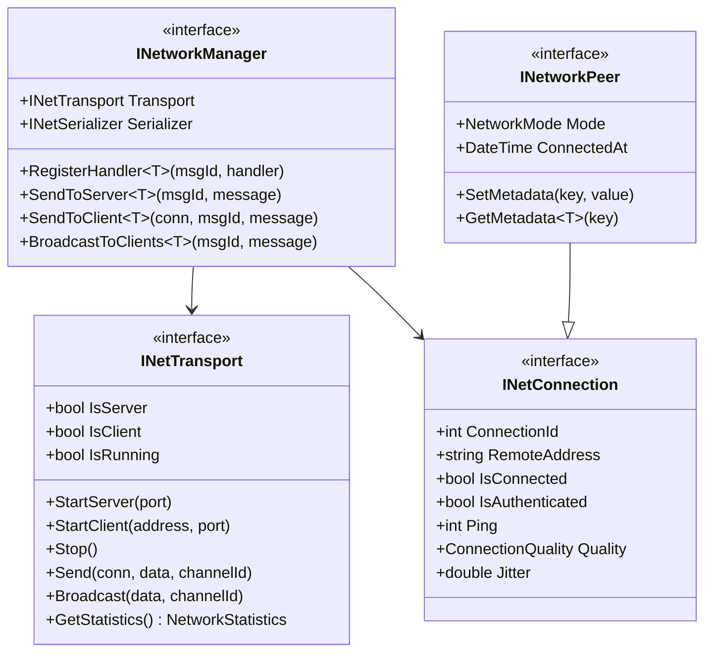
```mermaid
classDiagram
    class INetTransport {
        <<interface>>
        +bool IsServer
        +bool IsClient
        +bool IsRunning
        +StartServer(port)
        +StartClient(address, port)
        +Stop()
        +Send(conn, data, channelId)
        +Broadcast(data, channelId)
        +GetStatistics() NetworkStatistics
    }

    class INetworkManager {
        <<interface>>
        +INetTransport Transport
        +INetSerializer Serializer
        +RegisterHandler~T~(msgId, handler)
        +SendToServer~T~(msgId, message)
        +SendToClient~T~(conn, msgId, message)
        +BroadcastToClients~T~(msgId, message)
    }

    class INetConnection {
        <<interface>>
        +int ConnectionId
        +string RemoteAddress
        +bool IsConnected
        +bool IsAuthenticated
        +int Ping
        +ConnectionQuality Quality
        +double Jitter
    }

    class INetworkPeer {
        <<interface>>
        +NetworkMode Mode
        +DateTime ConnectedAt
        +SetMetadata(key, value)
        +GetMetadata~T~(key)
    }

    INetworkPeer --|> INetConnection
    INetworkManager --> INetTransport
    INetworkManager --> INetConnection
```

#### 关键枚举

| 枚举                | 值                                                                  | 说明         |
| ------------------- | ------------------------------------------------------------------- | ------------ |
| `NetworkMode`       | Offline, Client, Server, Host, ListenServer, DedicatedServer, Relay | 网络运行模式 |
| `NetworkChannel`    | Reliable, Unreliable, ReliableUnordered, UnreliableSequenced        | 传输通道类型 |
| `ConnectionQuality` | Excellent, Good, Fair, Poor, Disconnected                           | 连接质量等级 |
| `TransportError`    | None, DnsResolve, Refused, Timeout, Congestion, ...                 | 传输错误类型 |

---

### 2. 缓冲区系统 (Buffers)

**路径**: `Runtime/Scripts/Buffers/`

线程安全的零分配缓冲区池，用于网络消息的序列化与反序列化。

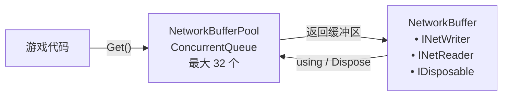
```mermaid
flowchart LR
    Code["游戏代码"] -->|"Get()"| Pool["NetworkBufferPool</br>ConcurrentQueue</br>最大 32 个"]
    Pool -->|"返回缓冲区"| Buffer["NetworkBuffer</br>• INetWriter</br>• INetReader</br>• IDisposable"]
    Buffer -->|"using / Dispose"| Pool
```

```csharp
// 零分配缓冲区使用
using (var buffer = NetworkBufferPool.Get())
{
    buffer.WriteInt(playerId);
    buffer.WriteFloat(health);
    buffer.WriteBlittable(position); // 仅限 unmanaged 类型

    var segment = buffer.ToArraySegment();
    transport.Send(conn, segment, channelId);
}
// Dispose 时自动归还到池
```

---

### 3. 服务注册 (Services)

**路径**: `Runtime/Scripts/Services/`

静态服务定位器，提供全局 `INetworkManager` 访问点。

```csharp
// 注册（通常在适配器 Awake 中自动完成）
NetServices.Register(myNetworkManager);

// 全局访问
var net = NetServices.Instance;

// 安全检查
if (NetServices.IsAvailable)
{
    net.SendToServer(msgId, data);
}

// 注销
NetServices.Unregister(myNetworkManager);
```

---

### 4. 序列化系统 (Serialization)

**路径**: `Runtime/Scripts/Serialization/` + `Runtime/Scripts/Serializers/`

可插拔的序列化系统，通过条件编译按需启用。

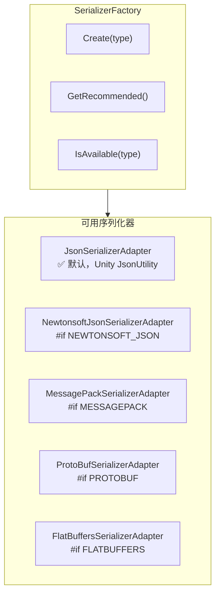
```mermaid
flowchart TB
    subgraph Factory["SerializerFactory"]
        Create["Create(type)"]
        GetRec["GetRecommended()"]
        IsAvail["IsAvailable(type)"]
    end

    subgraph Serializers["可用序列化器"]
        Json["JsonSerializerAdapter</br>✅ 默认，Unity JsonUtility"]
        Newtonsoft["NewtonsoftJsonSerializerAdapter</br>#if NEWTONSOFT_JSON"]
        MsgPack["MessagePackSerializerAdapter</br>#if MESSAGEPACK"]
        ProtoBuf["ProtoBufSerializerAdapter</br>#if PROTOBUF"]
        FlatBuf["FlatBuffersSerializerAdapter</br>#if FLATBUFFERS"]
    end

    Factory --> Serializers
```

| 序列化器        | 编译符号          | 格式   | 推荐场景         |
| --------------- | ----------------- | ------ | ---------------- |
| Json (Unity)    | 无（默认）        | 文本   | 开发调试         |
| Newtonsoft Json | `NEWTONSOFT_JSON` | 文本   | 复杂数据结构     |
| MessagePack     | `MESSAGEPACK`     | 二进制 | **生产环境推荐** |
| ProtoBuf        | `PROTOBUF`        | 二进制 | Schema 驱动开发  |
| FlatBuffers     | `FLATBUFFERS`     | 二进制 | 超高性能零拷贝   |

```csharp
// 获取推荐序列化器（优先级：MessagePack > Newtonsoft > Json）
var serializer = SerializerFactory.GetRecommended();

// 手动指定
if (SerializerFactory.IsAvailable(SerializerType.MessagePack))
{
    serializer = SerializerFactory.Create(SerializerType.MessagePack);
}
```

---

### 5. 网络模拟时钟 (Simulation)

**路径**: `Runtime/Scripts/Simulation/`

确定性固定时间步长的帧驱动系统，是预测、帧同步、回滚的基础。

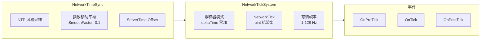
```mermaid
flowchart LR
    subgraph TickSystem["NetworkTickSystem"]
        Accumulator["累积器模式</br>deltaTime 累加"]
        Tick["NetworkTick</br>uint 抗溢出"]
        Rate["可调帧率</br>1-128 Hz"]
    end

    subgraph Events["事件"]
        PreTick["OnPreTick"]
        OnTick["OnTick"]
        PostTick["OnPostTick"]
    end

    subgraph TimeSync["NetworkTimeSync"]
        NTP["NTP 风格采样"]
        EMA["指数移动平均</br>SmoothFactor=0.1"]
        Offset["ServerTime Offset"]
    end

    TickSystem --> Events
    TimeSync --> TickSystem
```

```csharp
// 创建帧系统（30 Hz）
var tickSystem = new NetworkTickSystem(30);

// 注册帧回调
tickSystem.OnTick += tick =>
{
    // 每帧固定逻辑（物理、输入处理等）
    SimulateGameplay(tick);
};

// 在 Update 中驱动
void Update()
{
    tickSystem.Update(Time.deltaTime);
    // 自动限制每帧最多 5 次 Tick（防止死亡螺旋）
}

// 时间同步
var timeSync = new NetworkTimeSync();
timeSync.ProcessTimeSample(clientSendTime, serverTime, clientReceiveTime);
double serverNow = timeSync.LocalToServerTime(Time.timeAsDouble);
```

---

### 6. 客户端预测 (Prediction)

**路径**: `Runtime/Scripts/Prediction/`

实现了完整的**客户端预测 + 服务器授权 + 回滚纠正**流程。

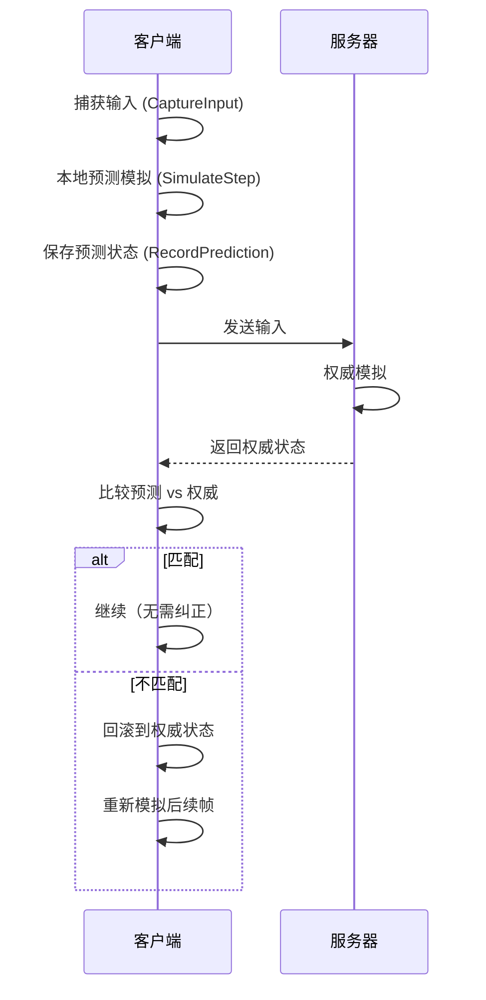
```mermaid
sequenceDiagram
    participant Client as 客户端
    participant Server as 服务器

    Client->>Client: 捕获输入 (CaptureInput)
    Client->>Client: 本地预测模拟 (SimulateStep)
    Client->>Client: 保存预测状态 (RecordPrediction)
    Client->>Server: 发送输入
    Server->>Server: 权威模拟
    Server-->>Client: 返回权威状态
    Client->>Client: 比较预测 vs 权威
    alt 匹配
        Client->>Client: 继续（无需纠正）
    else 不匹配
        Client->>Client: 回滚到权威状态
        Client->>Client: 重新模拟后续帧
    end
```

```csharp
// ① 实现 IPredictable 接口
public class PlayerMovement : IPredictable<MoveInput, PlayerState>
{
    public MoveInput CaptureInput()
        => new MoveInput { Horizontal = Input.GetAxis("Horizontal") };

    public PlayerState CaptureState()
        => new PlayerState { X = transform.position.x };

    public void ApplyState(in PlayerState state)
        => transform.position = new Vector3(state.X, 0, 0);

    public void SimulateStep(in MoveInput input, float deltaTime)
        => transform.position += Vector3.right * input.Horizontal * deltaTime;

    public bool StatesMatch(in PlayerState a, in PlayerState b)
        => Mathf.Abs(a.X - b.X) < 0.01f;
}

// ② 使用预测系统
var prediction = new ClientPredictionSystem<MoveInput, PlayerState>(player, capacity: 128);

// 每帧：记录预测
prediction.RecordPrediction(currentTick, deltaTime);

// 收到服务器状态时：自动比较并回滚
prediction.ProcessServerState(serverTick, serverState); // 不匹配则自动回滚
```

#### 快照插值

远程实体的平滑显示，避免抖动：

```csharp
var interpolation = new SnapshotInterpolation<TransformSnapshot>(
    TransformSnapshot.Lerp,
    TransformSnapshot.GetTimestamp
);

// 添加服务器快照
interpolation.AddSnapshot(new TransformSnapshot
{
    Timestamp = serverTime,
    Position = pos,
    Rotation = rot
});

// 每帧更新
var result = interpolation.Update(currentTime);
transform.position = result.Position;
transform.rotation = result.Rotation;
```

#### 滞后补偿

服务器端回退历史记录进行命中判定：

```csharp
var lagComp = new LagCompensationBuffer(capacity: 128);

// 每帧记录
lagComp.Record(tick, position, rotation, colliderBounds);

// 命中检测（回退到目标帧）
if (lagComp.HitTest(clientTick, shootRay, maxDist, out float hitDist))
{
    // 确认命中
}
```

---

### 7. 复制基础设施 (Replication Infrastructure)

**路径**: `Core/Replication/`

从纯 C# 快照构建每个连接的复制工作。玩法系统提供 observer/object 数据，核心层负责 interest 与 send budget，发送层再写出确定性的 snapshot packet。这里是 MMO AOI、MOBA 团队可见性、射击游戏 owner prediction、沙盒 chunk replication、replay capture 和 dedicated server simulation 的通用基础。

复制层刻意保持 backend-neutral。它不依赖 Mirror、Mirage、Nakama、Unity `GameObject`、`MonoBehaviour`、`ScriptableObject`、PlayerSettings 宏，也不绑定任何 DI 容器。项目可以直接构造这些服务，也可以注册到自己的 DI 容器，或在服务器 composition root 中包一层游戏专用 facade。

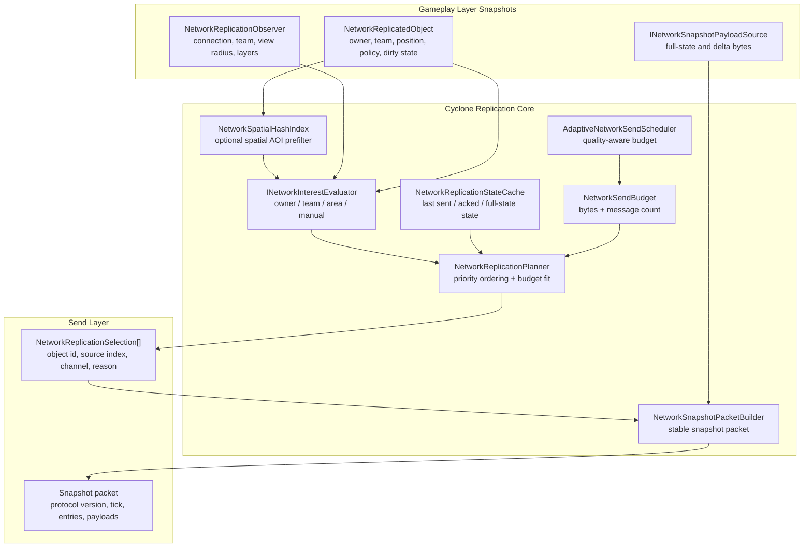
```mermaid
flowchart TB
    subgraph Inputs["Gameplay Layer Snapshots"]
        Observer["NetworkReplicationObserver</br>connection, team, view radius, layers"]
        Object["NetworkReplicatedObject</br>owner, team, position, policy, dirty state"]
        Payloads["INetworkSnapshotPayloadSource</br>full-state and delta bytes"]
    end

    subgraph Replication["Cyclone Replication Core"]
        Spatial["NetworkSpatialHashIndex</br>optional spatial AOI prefilter"]
        State["NetworkReplicationStateCache</br>last sent / acked / full-state state"]
        Evaluator["INetworkInterestEvaluator</br>owner / team / area / manual"]
        Planner["NetworkReplicationPlanner</br>priority ordering + budget fit"]
        Scheduler["AdaptiveNetworkSendScheduler</br>quality-aware budget"]
        Budget["NetworkSendBudget</br>bytes + message count"]
        Packet["NetworkSnapshotPacketBuilder</br>stable snapshot packet"]
    end

    subgraph Output["Send Layer"]
        Selection["NetworkReplicationSelection[]</br>object id, source index, channel, reason"]
        Snapshot["Snapshot packet</br>protocol version, tick, entries, payloads"]
    end

    Object --> Spatial
    Spatial --> Evaluator
    Observer --> Evaluator
    Object --> Evaluator
    Evaluator --> Planner
    State --> Planner
    Scheduler --> Budget
    Budget --> Planner
    Planner --> Selection
    Selection --> Packet
    Payloads --> Packet
    Packet --> Snapshot
```

#### 规划与 Interest

`NetworkReplicationPlanner` 是确定性的选择器。它接收一个 observer、一段 `NetworkReplicatedObject` 快照、server tick、可变 `NetworkSendBudget` 和调用方持有的输出 span。它会通过 `INetworkInterestEvaluator` 过滤对象，按 score 排序，并只写入能放进 byte/message budget 的条目。

```csharp
using CycloneGames.Networking.Replication;

var observer = new NetworkReplicationObserver(
    connectionId: 10,
    playerId: 1001,
    teamId: 2,
    position: playerPosition,
    viewRadius: 80f);

var objects = new[]
{
    new NetworkReplicatedObject(
        objectId: 5001,
        policy: NetworkReplicationPolicy.OwnerOrArea(80f),
        position: actorPosition,
        ownerConnectionId: 10,
        isDirty: true,
        estimatedPayloadBytes: 96)
};

var planner = new NetworkReplicationPlanner();
var budget = new NetworkSendBudget(maxBytes: 4096, maxMessages: 64);
var selections = new NetworkReplicationSelection[128];

int count = planner.BuildPlan(observer, objects, serverTick, ref budget, selections);
for (int i = 0; i < count; i++)
{
    NetworkReplicationSelection selection = selections[i];
    // 使用 selection.SourceIndex 取回源对象并写入 payload。
}
```

常见可见性规则通过 `NetworkReplicationPolicy` 表达：

| Policy | 适用场景 |
| --- | --- |
| `OwnerOnly` | 玩家私有背包、本地预测状态、只发给 owner 的授权纠正 |
| `OwnerOrArea(radius)` | 射击游戏角色、投射物、载具、可交互物 |
| `Team(radius)` | MOBA 或团队射击中的队友、共享小队信息 |
| `Area(radius)` | MMO actor、沙盒 chunk、公共世界物体 |
| `Manual` | 任务阶段、隐身/揭示系统、streaming volume、自定义 shard 规则 |

大型世界应在规划前使用 `NetworkSpatialHashIndex` 做预过滤。它支持 XZ、XY、XYZ cell 模式、layer mask、按 object id 更新/移除，以及调用方持有的查询缓冲区。索引已经建立后，Query 本身不产生堆分配。

```csharp
var index = new NetworkSpatialHashIndex(cellSize: 32f);
for (int i = 0; i < objects.Length; i++)
{
    NetworkReplicatedObject obj = objects[i];
    index.Upsert(obj.ObjectId, i, obj.Position, obj.InterestLayerMask);
}

Span<NetworkSpatialQueryResult> nearby = stackalloc NetworkSpatialQueryResult[256];
int nearbyCount = index.Query(
    observer.Position,
    observer.ViewRadius,
    observer.InterestLayerMask,
    nearby);
```

#### 状态缓存与快照包

`NetworkReplicationStateCache` 存储每个 connection/object 的复制状态：last sent tick、last full-state tick、last acked tick、last payload hash、payload size、sequence，以及是否必须发送 full state。这样复制层可以区分重连玩家、新进入视野对象，以及只需要 delta 的稳定对象。

```csharp
var stateCache = new NetworkReplicationStateCache(capacity: 65536);
NetworkReplicatedObject source = objects[sourceIndex];
NetworkReplicatedObject perConnectionObject = stateCache.ApplyState(
    observer.ConnectionId,
    source);

stateCache.MarkSent(
    observer.ConnectionId,
    source.ObjectId,
    serverTick,
    fullState: perConnectionObject.RequiresFullState,
    payloadBytes: 96,
    payloadHash: payloadHash,
    sequence: sequence);
```

`NetworkSnapshotPacketBuilder` 写出稳定的 snapshot packet 格式。Builder 不知道玩法如何序列化，而是通过 `INetworkSnapshotPayloadSource` 获取 full-state 或 delta payload 的 size、hash 和 bytes。GameplayAbilities、GameplayTags、GameplayFramework、RPGFoundation 或第三方玩法包因此可以独立于传输层与写包器。

```csharp
var packetBuilder = new NetworkSnapshotPacketBuilder();
NetworkSnapshotWriteResult result = packetBuilder.WriteSnapshot(
    selections.AsSpan(0, count),
    serverTick,
    payloadSource,
    writer);
```

Snapshot packet 以 protocol version byte、server tick 和 entry count 开头，随后每个对象条目包含 object id、full/delta flags、channel、payload length 和 payload bytes。返回值会报告对象数量、full/delta 数量、写入字节数和 aggregate payload hash，便于诊断与 replay validation。

#### 自适应调度与负载模拟

`AdaptiveNetworkSendScheduler` 实现 `IAdaptiveSendRate`，会把 connection quality 和 transport statistics 转成 target send interval 与 `NetworkSendBudget`。差链路会获得更小预算和更长间隔。断线连接得到 zero byte/message budget，上层复制逻辑不会继续为无效连接排包。

```csharp
var scheduler = new AdaptiveNetworkSendScheduler();
scheduler.Update(connectionId, transportStats, quality, deltaTime);

NetworkSendBudget budget = scheduler.CreateSendBudget(connectionId);
int count = planner.BuildPlan(observer, objects, serverTick, ref budget, selections);
```

`NetworkReplicationLoadSimulator` 是确定性的设计期压测工具。它不能替代真实服务器 soak test，但适合检查 object count、connection count、view radius、dirty ratio 和 world size 变化时 planner budget 的行为。

```csharp
var simulator = new NetworkReplicationLoadSimulator();
var result = simulator.Run(new NetworkReplicationLoadSimulationOptions(
    connectionCount: 1000,
    objectCount: 20000,
    tickCount: 120,
    worldSize: 4000f,
    viewRadius: 120f,
    dirtyRatio: 0.35f,
    budgetBytes: 4096,
    budgetMessages: 64,
    resultCapacity: 256,
    seed: 42u));
```

#### 性能与平台说明

- Runtime 热路径通过调用方持有的数组/span 完成 planning、spatial query result 和 snapshot writing。请按 worker、room、shard 或 replication lane 预分配这些缓冲区。
- `NetworkSpatialHashIndex` 在创建新 cell 时会分配。应把它作为服务器世界索引的一部分维护，不要在每个 connection planning 调用中临时创建。
- `NetworkReplicationStateCache` 使用 managed dictionary，适用于 Unity、headless .NET server 和测试。大型 MMO shard 应按 replication world、zone 或 shard 拥有独立 cache，并在 disconnect/despawn 时主动清理 connection/object 状态。
- `NetworkSnapshotPacketBuilder` 与具体 serializer 解耦。Payload source 应复用现有 serializer 或玩法包 serializer，并避免在高频 snapshot 路径创建临时数组。
- 核心层使用 `NetworkVector3`、确定性 id 与 primitive data，所选 transport/backend 支持目标平台时，可用于 Windows、Linux、macOS、iOS、Android、WebGL 和主机平台。
- 本模块不写文件，不保存 PlayerSettings 宏，也不会创建隐藏全局偏好。Load simulation 是纯内存验证工具。

---

### 8. 状态同步变量 (StateSync)

**路径**: `Runtime/Scripts/StateSync/`

自动追踪变量脏标记并同步变更。

```csharp
// 值类型变量（零 GC，T : unmanaged, IEquatable<T>）
var health = new NetworkVariable<int>(100);
var position = new NetworkVariable<float>(0f);

// 修改时自动标脏
health.Value = 80; // 触发 OnChanged 事件

// 监听变更
health.OnChanged += (oldVal, newVal) =>
{
    Debug.Log($"血量变化: {oldVal} → {newVal}");
};

// 引用类型变量
var playerName = new NetworkVariableManaged<string>("Player1", serializer);

// 变量集合管理（最多 64 个变量）
var varSet = new NetworkVariableSet();
varSet.Register(health);
varSet.Register(position);

// 序列化脏数据（仅发送变更）
if (varSet.IsAnyDirty)
{
    varSet.WriteDirty(writer);
    varSet.ClearAllDirty();
}
```

---

### 9. 远程过程调用 (RPC)

**路径**: `Runtime/Scripts/Rpc/`

基于特性标注的 RPC 系统。

```csharp
// 定义 RPC 目标
public enum RpcTarget
{
    Server,          // 客户端 → 服务器
    Owner,           // 服务器 → 拥有者客户端
    AllClients,      // 服务器 → 所有客户端
    Observers,       // 服务器 → 观察者
    AllExceptOwner,  // 服务器 → 除拥有者外
    AllExceptSender  // 排除发送者
}

// 使用特性标注
[ServerRpc(requiresOwnership: true)]
void CmdAttack(int targetId) { /* 在服务器执行 */ }

[ClientRpc(target: RpcTarget.AllClients)]
void RpcDamaged(int damage) { /* 在所有客户端执行 */ }

// 使用 RpcProcessor
var rpc = new RpcProcessor(networkManager);
rpc.Register<DamageMsg>(1, OnDamageReceived);
rpc.Send(1, new DamageMsg { TargetId = 5, Amount = 20 }, RpcTarget.AllClients);
```

---

### 10. 帧同步与确定性模拟 (Lockstep)

**路径**: `Runtime/Scripts/Lockstep/`

完整的确定性帧同步与 GGPO 风格回滚实现。

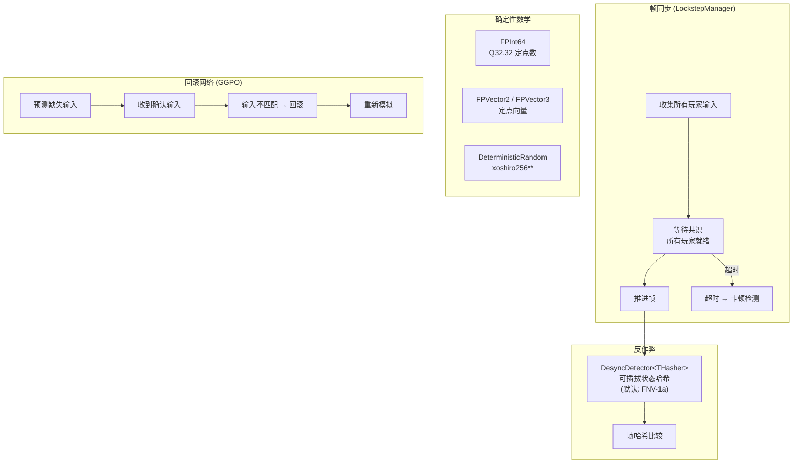
```mermaid
flowchart TB
    subgraph Lockstep["帧同步 (LockstepManager)"]
        Input["收集所有玩家输入"]
        Wait["等待共识</br>所有玩家就绪"]
        Advance["推进帧"]
        Stall["超时 → 卡顿检测"]
    end

    subgraph Deterministic["确定性数学"]
        FP["FPInt64</br>Q32.32 定点数"]
        Vec["FPVector2 / FPVector3</br>定点向量"]
        Rand["DeterministicRandom</br>xoshiro256**"]
    end

    subgraph Desync["反作弊"]
        Hash["DesyncDetector&lt;THasher&gt;</br>可插拔状态哈希</br>(默认: FNV-1a)"]
        Compare["帧哈希比较"]
    end

    subgraph Rollback["回滚网络 (GGPO)"]
        Predict["预测缺失输入"]
        Confirm["收到确认输入"]
        RB["输入不匹配 → 回滚"]
        Resim["重新模拟"]
    end

    Input --> Wait --> Advance
    Wait -->|"超时"| Stall
    Advance --> Hash --> Compare
    Predict --> Confirm --> RB --> Resim
```

#### 帧同步最小示例

```csharp
// 定义输入
public struct GameInput
{
    public byte MoveX;
    public byte MoveY;
    public bool Fire;
}

// 创建帧同步管理器
var lockstep = new LockstepManager<GameInput>(
    peerCount: 2,
    localPeerId: 0,
    inputDelay: 2
);

// 事件监听
lockstep.OnSimulateFrame += (frame, inputs) =>
{
    // 确定性模拟：所有客户端使用相同输入
    foreach (var (peerId, input) in inputs)
    {
        SimulatePlayer(peerId, input);
    }
};

lockstep.OnDesyncDetected += frame =>
    Debug.LogError($"帧 {frame} 检测到不同步！");

// 每帧
void FixedUpdate()
{
    lockstep.SubmitLocalInput(CaptureInput());
    lockstep.Tick(); // 所有输入就绪后推进帧
}

// 收到远程输入
void OnRemoteInput(int peerId, int frame, GameInput input)
{
    lockstep.ReceiveRemoteInput(peerId, frame, input);
}
```

#### 定点数学

确保跨平台计算一致性（浮点数在不同 CPU 架构下有微小差异）：

```csharp
// Q32.32 定点数
FPInt64 a = FPInt64.FromFloat(3.14f);
FPInt64 b = FPInt64.FromInt(2);
FPInt64 c = a * b;          // 精确乘法
float result = c.ToFloat(); // 转回浮点

// 定点向量
var v1 = new FPVector3(FPInt64.FromFloat(1f), FPInt64.Zero, FPInt64.Zero);
var v2 = new FPVector3(FPInt64.Zero, FPInt64.FromFloat(1f), FPInt64.Zero);
FPInt64 distance = FPVector3.Distance(v1, v2);

// 确定性随机数（所有客户端种子相同 → 结果相同）
var rng = new DeterministicRandom(seed: 12345);
int roll = rng.NextInt(1, 7); // 1-6 骰子
```

#### GGPO 风格回滚

```csharp
// 实现回滚接口
public class MySimulation : IRollbackSimulation<GameInput, GameState>
{
    public GameInput PredictInput(int frame) => default; // 预测：重复上一帧输入
    public GameState SaveState() => currentState;
    public void LoadState(in GameState state) => currentState = state;
    public void Simulate(in GameInput input) => /* 模拟一帧 */;
    public void OnRollback(int fromFrame, int toFrame) => Debug.Log("回滚！");
}

var rollback = new RollbackNetcode<GameInput, GameState>(
    simulation, maxRollbackFrames: 8
);

// 本地推进
rollback.AdvanceFrame(localInput);

// 收到服务器确认的输入
rollback.ReceiveConfirmedInput(frame, confirmedInput);
// 如果与预测不同 → 自动回滚 + 重新模拟
```

---

### 11. 安全模块 (Security)

**路径**: `Runtime/Scripts/Security/`

```csharp
// 令牌桶限流器
var limiter = new RateLimiter(
    maxMessagesPerSecond: 60,
    maxBytesPerSecond: 32768,
    burstLimit: 10
);

if (!limiter.TryConsume(connectionId, messageSize))
{
    // 超过限流 → 丢弃或断开
    return;
}

// 消息校验器
var validator = new MessageValidator(
    maxPayloadSize: 1024,
    maxMessageId: 9999
);

var result = validator.Validate(msgId, payloadSize);
if (result != ValidationResult.Valid)
{
    Debug.LogWarning($"非法消息: {result}");
}
```

---

### 12. 会话韧性 (Session Resilience)

**路径**: `Core/Session/`

提供 backend-neutral 的房间发现、匹配计划、重连保留和主机迁移协调。Steam Lobby、LAN discovery、Nakama match、自建 master server、relay room 和 dedicated server fleet 都应把结果转换成同一套核心 descriptor，而不是把后端 SDK 类型泄漏到玩法代码里。

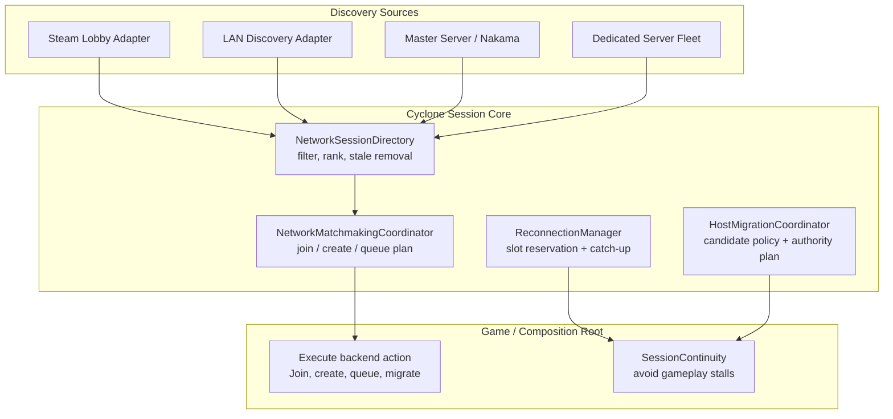
```mermaid
flowchart TB
    subgraph Sources["Discovery Sources"]
        Steam["Steam Lobby Adapter"]
        Lan["LAN Discovery Adapter"]
        Backend["Master Server / Nakama"]
        Fleet["Dedicated Server Fleet"]
    end

    subgraph CoreSession["Cyclone Session Core"]
        Directory["NetworkSessionDirectory</br>filter, rank, stale removal"]
        MatchPlan["NetworkMatchmakingCoordinator</br>join / create / queue plan"]
        Reconnect["ReconnectionManager</br>slot reservation + catch-up"]
        Migration["HostMigrationCoordinator</br>candidate policy + authority plan"]
    end

    subgraph Game["Game / Composition Root"]
        Execute["Execute backend action</br>Join, create, queue, migrate"]
        Continue["SessionContinuity</br>avoid gameplay stalls"]
    end

    Steam --> Directory
    Lan --> Directory
    Backend --> Directory
    Fleet --> Directory
    Directory --> MatchPlan
    MatchPlan --> Execute
    Reconnect --> Continue
    Migration --> Continue
```

#### 房间搜索与匹配

`NetworkSessionDirectory` 存储 backend-neutral 的 `NetworkSessionDescriptor`。来自 Steam、LAN、relay、backend matchmaking 或 dedicated server fleet 的房间，都可以使用同一套过滤规则进行筛选与排序：game mode、map、region、build id、容量、ping、私密状态、连接方式、是否支持 host migration、是否支持 reconnection、skill band，以及 mod hash、ruleset hash 等自定义属性。

```csharp
var directory = new NetworkSessionDirectory();
directory.Upsert(new NetworkSessionDescriptor(
    sessionId: "steam-lobby-123",
    name: "Night Run",
    gameMode: "roguelike",
    currentPlayers: 3,
    maxPlayers: 8,
    map: "graveyard",
    region: "asia",
    buildId: "live-2026-06",
    pingMs: 42,
    supportsHostMigration: true,
    supportsReconnection: true,
    connectivity: NetworkSessionConnectivity.PlatformLobby | NetworkSessionConnectivity.Relay,
    source: NetworkSessionDiscoverySource.Platform));

var criteria = new NetworkSessionSearchCriteria
{
    GameMode = "roguelike",
    Region = "asia",
    BuildId = "live-2026-06",
    MinOpenSlots = 1,
    RequireHostMigration = true,
    RequireReconnection = true
};

var results = new List<NetworkSessionDescriptor>(32);
int count = directory.Search(criteria, results);
```

`NetworkMatchmakingCoordinator` 不直接调用任何后端。它只返回计划：加入最合适的房间、创建新房间、进入匹配队列，或不做操作。Steam、LAN、Nakama 或自建服务都可以在自己的 adapter 中执行这个计划。

```csharp
var matchmaking = new NetworkMatchmakingCoordinator();
NetworkMatchmakingPlan plan = matchmaking.BuildPlan(
    directory,
    criteria,
    NetworkMatchmakingOptions.Default);

switch (plan.Action)
{
    case NetworkMatchmakingPlanAction.JoinSession:
        // Adapter joins plan.SelectedSession.
        break;
    case NetworkMatchmakingPlanAction.CreateSession:
        // Adapter creates a room using the same criteria.
        break;
    case NetworkMatchmakingPlanAction.EnterQueue:
        // Adapter enters backend matchmaking.
        break;
}
```

#### 重连与主机迁移

`ReconnectionManager` 会在有限时间内为掉线玩家保留席位，校验 reconnect token，并可通过 `IStateCatchUp` 在玩家回到玩法前追赶状态。普通客户端掉线因此不会冻结整个 session。

```csharp
var reconnect = new ReconnectionManager(myStateCatchUpImpl);
reconnect.ReconnectWindow = 300f; // 5 分钟内可重连

reconnect.OnClientReconnected += (originalConnectionId, newConnection) =>
    Debug.Log($"玩家重连成功，原连接={originalConnectionId}，新连接={newConnection.ConnectionId}");

reconnect.OnReconnectWindowExpired += originalConnectionId =>
    Debug.Log($"连接 {originalConnectionId} 的重连窗口过期");
```

`HostMigrationCoordinator` 是 listen-server、P2P、relay-coordinated 或 server-node authority transfer 的通用主机容错层。它追踪候选者并输出 `NetworkAuthorityTransferPlan`，而不直接执行某个后端的 SDK 操作。

```csharp
var migration = new HostMigrationCoordinator("room-123");
migration.UpsertParticipant(new NetworkHostParticipant(
    connectionId: 1,
    playerId: 1001,
    isConnected: false,
    canHost: true,
    authorityRank: 100));
migration.UpsertParticipant(new NetworkHostParticipant(
    connectionId: 2,
    playerId: 1002,
    isConnected: true,
    canHost: true,
    authorityRank: 50,
    kind: NetworkHostCandidateKind.PlayerListenServer,
    pingMs: 24,
    lastConfirmedTick: new NetworkTickId(1200)));

migration.SetCurrentHost(1, 1001);
if (migration.TryBeginMigration(
        HostMigrationReason.HostDisconnected,
        new NetworkTickId(1201),
        out NetworkAuthorityTransferPlan transfer))
{
    // Transfer session owner, simulation authority, spawn authority,
    // object authority, scene authority, match state, and RNG authority.
}
```

默认候选策略刻意保持通用：先比较 authority rank，再比较 host kind、last confirmed tick、capacity/hardware score、packet loss、ping、join time 和 connection id。小型 Steam 合作游戏可以使用玩家 listen-server 候选；100 人房间可以优先 relay 或 server 候选；同区域 10000 人世界应使用 dedicated server 或 shard candidate，而不是 client-host migration。

接口与核心服务：`ILobbyManager`、`IMatchmaker`、`IHostMigration`、`IReconnectionManager`、`NetworkSessionDirectory`、`NetworkMatchmakingCoordinator`、`HostMigrationCoordinator`、`IHostCandidatePolicy`。

---

### 13. 回放系统 (Replay)

**路径**: `Runtime/Scripts/Replay/`

```csharp
// 录像
var recorder = new ReplayRecorder(keyframeInterval: 300); // 每 300 帧一个关键帧
recorder.StartRecording();
recorder.RecordFrame(tick, inputData);
recorder.RecordKeyframe(tick, fullState); // 定期记录完整状态
recorder.StopRecording();

// 回放
var player = new ReplayPlayer(recorder.GetAllFrames());
player.Play();
player.SetSpeed(2.0f); // 2 倍速
player.Seek(targetTick); // 跳转到指定帧
player.Pause();

// 观战（带延迟）
var spectator = new SpectatorManager(delayTicks: 90); // 3 秒延迟 @30Hz
```

---

### 14. 网络生成管理 (Spawning)

**路径**: `Runtime/Scripts/Spawning/`

```csharp
var spawnManager = new NetworkSpawnManager(networkManager);

// 生成网络对象
spawnManager.Spawn(prefabId: 1, position, rotation, ownerConnectionId);

// 监听事件
spawnManager.OnSpawned += obj =>
    Debug.Log($"生成: NetworkId={obj.NetworkId}, PrefabId={obj.PrefabId}");

spawnManager.OnDespawned += networkId =>
    Debug.Log($"销毁: {networkId}");

// 转移所有权
spawnManager.TransferOwnership(networkId, newOwnerConnectionId);
```

---

### 15. 场景管理 (Scene)

**路径**: `Runtime/Scripts/Scene/`

```csharp
var sceneManager = new NetworkSceneManager(networkManager);

// 所有客户端加载场景
sceneManager.ServerLoadScene("BattleArena");

// 附加场景（副本）
sceneManager.ServerLoadScene("Dungeon_01", additive: true);

// 仅对指定连接加载（实例化副本）
sceneManager.ServerLoadSceneForConnections(
    "PrivateDungeon",
    new[] { conn1, conn2 }
);

// 事件
sceneManager.OnSceneLoaded += sceneName =>
    Debug.Log($"场景已加载: {sceneName}");
```

---

### 16. 数据压缩 (Compression)

**路径**: `Runtime/Scripts/Compression/`

```csharp
// Vector3 量化压缩（ZigZag + 可变长整数编码）
var qv = QuantizedVector3.FromVector3(transform.position, precision: 100);
// precision=100 → 精度 0.01 单位
qv.WriteTo(writer);

// 读取
var qv2 = QuantizedVector3.ReadFrom(reader);
Vector3 pos = qv2.ToVector3(precision: 100);

// Quaternion 最小三压缩（4 字节，每分量 10 位）
var qq = QuantizedQuaternion.FromQuaternion(transform.rotation);
// 仅传输最大分量索引（2位）+ 三个较小分量（各 10 位）= 32 位 = 4 字节
```

---

### 17. 诊断工具 (Diagnostics)

**路径**: `Runtime/Scripts/Diagnostics/`

```csharp
// 网络性能分析
var profiler = new NetworkProfiler();
profiler.RecordSend(msgId, byteCount);
profiler.RecordReceive(msgId, byteCount);
profiler.Update(deltaTime);

var snapshot = profiler.TakeSnapshot();
Debug.Log($"上行: {snapshot.BytesSentPerSecond} B/s");
Debug.Log($"下行: {snapshot.BytesReceivedPerSecond} B/s");
Debug.Log($"发包: {snapshot.PacketsSentPerSecond}/s");

// 按消息类型统计
var stats = profiler.GetMessageStats(msgId);
Debug.Log($"消息 {msgId}: 发送 {stats.SendCount} 次, {stats.SendBytes} 字节");

// 网络条件模拟器（测试用）
var simulator = new NetworkConditionSimulator(realTransport);
simulator.ApplyPreset(NetworkConditionSimulator.Preset.Mobile4G);
// 预设: LAN, Broadband, WiFi, Mobile4G, Mobile3G, Satellite, Terrible

// 自定义
simulator.LatencyMs = 150;
simulator.JitterMs = 30;
simulator.PacketLossPercent = 5f;
simulator.Enabled = true;
```

---

### 18. Gameplay Abilities 集成 (GAS)

**路径**: 📦 **独立包** — `CycloneGames.GameplayAbilities.Networking`（与核心包平级目录）  
**Asmdef**: `CycloneGames.GameplayAbilities.Networking.Core` / `CycloneGames.GameplayAbilities.Networking.Unity.Runtime`  
**引用**: `CycloneGames.Networking.Core`  
**命名空间**: `CycloneGames.GameplayAbilities.Networking`

> **包结构说明**：本模块分为两层。
>
> - `CycloneGames.GameplayAbilities.Networking.Core` — 协议与 bridge 层：消息 ID、`IAbilityNetAdapter`、`NetworkedAbilityBridge`、序列化器、状态 checksum 和安全策略。
> - `CycloneGames.GameplayAbilities.Networking.Unity.Runtime` — `CycloneGames.GameplayAbilities` 的主线集成层：ASC 适配器、细粒度 effect delta 复制、full-state 快照接线与安全辅助。

与 `CycloneGames.GameplayAbilities` 模块的深度集成，支持技能激活、效果复制、属性同步。

> 当前包说明：GAS networking 位于 `CycloneGames.GameplayAbilities.Networking`。纯协议用法引用 Core 程序集；接入 `AbilitySystemComponent` 时引用 Unity.Runtime 程序集。

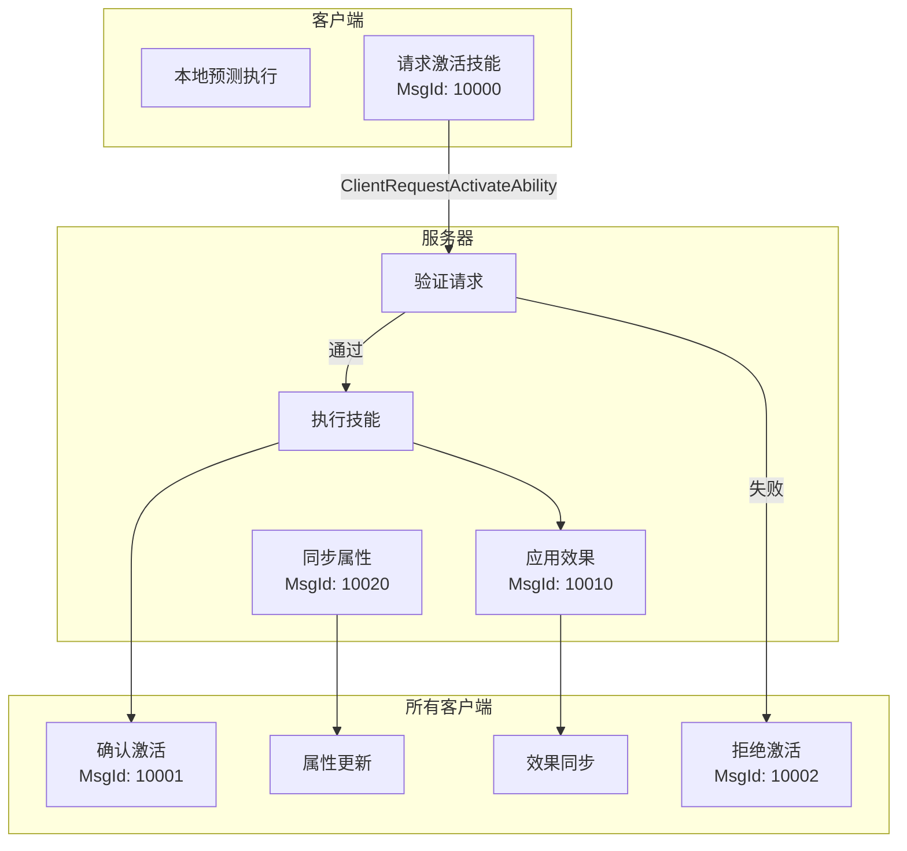
```mermaid
flowchart TB
    subgraph Client["客户端"]
        PredictLocal["本地预测执行"]
        RequestAbility["请求激活技能</br>MsgId: 10000"]
    end

    subgraph Server["服务器"]
        Validate["验证请求"]
        Execute["执行技能"]
        ApplyEffect["应用效果</br>MsgId: 10010"]
        SyncAttr["同步属性</br>MsgId: 10020"]
    end

    subgraph Clients["所有客户端"]
        Confirm["确认激活</br>MsgId: 10001"]
        Reject["拒绝激活</br>MsgId: 10002"]
        EffectSync["效果同步"]
        AttrUpdate["属性更新"]
    end

    RequestAbility -->|"ClientRequestActivateAbility"| Validate
    Validate -->|"通过"| Execute
    Validate -->|"失败"| Reject
    Execute --> Confirm
    Execute --> ApplyEffect
    ApplyEffect --> EffectSync
    SyncAttr --> AttrUpdate
```

```csharp
using CycloneGames.GameplayAbilities.Networking; // 📦 需引用 GAS 协议包
using CycloneGames.GameplayAbilities.Networking.Unity.Runtime; // 📦 GameplayAbilities 主线集成包

// 创建桥接
var bridge = new NetworkedAbilityBridge(networkManager);

// 注册 ASC（AbilitySystemComponent）并创建主线适配器
var adapter = bridge.RegisterGameplayAbilitiesASC(myAsc, networkId, ownerConnectionId, idRegistry);

// 可选：自定义完整状态请求鉴权（默认仅所有者可请求）
bridge.FullStateRequestAuthorizer = (sender, targetId) => sender.ConnectionId == ownerConnectionId;

// 生产环境推荐策略：仅所有者或当前观察者可请求完整状态
bridge.FullStateRequestAuthorizer = (sender, targetId) =>
{
    if (TryGetAscOwnerConnectionId(targetId, out int ascOwnerId) && sender.ConnectionId == ascOwnerId)
        return true;

    var observers = GetObservers(targetId);
    if (observers == null) return false;

    for (int i = 0; i < observers.Count; i++)
    {
        if (observers[i].ConnectionId == sender.ConnectionId)
            return true;
    }

    return false;
};

// 客户端请求激活技能
bridge.ClientRequestActivateAbility(
    abilityIndex: 1001,
    predictionKey: nextPredictionKey++,
    targetPos: targetPos,
    direction: direction,
    targetNetworkId: targetId,
);

// 属性同步管理器
var attrSync = new AttributeSyncManager(bridge);
attrSync.RegisterPublicAttribute(healthAttrId);
attrSync.RegisterPublicAttribute(maxHealthAttrId);
attrSync.MarkDirty(networkId, healthAttrId, baseValue: 100f, currentValue: 75f);
attrSync.FlushDirty(getOwnerConnectionId: GetOwnerConnectionId, getObservers: GetObservers, getConnectionById: GetConnectionById); // 发送脏属性

// 主线 GAS 增量复制
bridge.ReplicatePendingState(adapter, GetObservers);

// 断线重连或晚加入
bridge.SendGameplayAbilitiesFullState(adapter, clientConnection);
```

生产环境常用加固建议：

1. 对完整状态请求按连接限频（例如每 2-5 秒最多 1 次）。
2. 对拒绝请求做安全审计日志（记录 sender、targetId、原因）。
3. 对观察者返回脱敏快照（隐藏私有属性/私有效果）。

```csharp
var fullStateLimiter = new TokenBucketRateLimiter(capacity: 2, refillPerSecond: 0.5f);

bridge.FullStateRequestAuthorizer = (sender, targetId) =>
{
    if (!fullStateLimiter.TryConsume(sender.ConnectionId, 1))
    {
        AuditSecurity("GAS.FullState.RateLimited", sender.ConnectionId, targetId);
        return false;
    }

    bool isOwner = TryGetAscOwnerConnectionId(targetId, out int ownerId) && sender.ConnectionId == ownerId;
    bool isObserver = IsObserver(sender.ConnectionId, targetId);
    bool allowed = isOwner || isObserver;

    if (!allowed)
        AuditSecurity("GAS.FullState.Unauthorized", sender.ConnectionId, targetId);

    return allowed;
};

// 在 ASC 实现中：owner 返回全量快照，observer 返回脱敏快照。
```

#### 消息 ID 分配

| 范围    | 用途                   |
| ------- | ---------------------- |
| 10000       | 技能激活请求              |
| 10001       | 技能激活确认              |
| 10002       | 技能激活拒绝              |
| 10003       | 技能结束                  |
| 10004       | 技能取消                  |
| 10010-10013 | 效果应用/移除/堆叠变更/更新 |
| 10020       | 属性更新                  |
| 10040-10041 | 完整状态快照              |

---

### 19. 身份验证 (Authentication)

**路径**: `Runtime/Scripts/Authentication/`

```csharp
public class MyAuthenticator : INetAuthenticator
{
    public void OnClientAuthenticate(INetConnection conn, ReadOnlySpan<byte> authData)
    {
        // 验证 token
        if (ValidateToken(authData))
            AcceptClient(conn);
        else
            RejectClient(conn, "Invalid token");
    }

    public void OnServerAuthenticate(INetConnection conn, ReadOnlySpan<byte> authData)
    {
        // 服务器端验证逻辑
    }
}
```

---

### 20. 平台配置 (Platform)

**路径**: `Runtime/Scripts/Platform/`

根据目标平台自动调整网络参数。

```csharp
// 自动获取当前平台配置
var config = NetworkPlatformConfig.GetForCurrentPlatform();
Debug.Log($"MTU: {config.MaxMTU}");
Debug.Log($"最大连接数: {config.MaxConnections}");
Debug.Log($"需要加密: {config.RequireEncryption}");

// 手动选择平台
var mobileConfig = NetworkPlatformConfig.Android();
var consoleConfig = NetworkPlatformConfig.PlayStation();
var webConfig = NetworkPlatformConfig.WebGL(); // WebSocket only
```

| 平台    | MTU  | 最大连接 | IPv6 | WebSocket | 加密 |
| ------- | ---- | -------- | ---- | --------- | ---- |
| Windows | 1200 | 200      | ✅   | ❌        | ❌   |
| WebGL   | 1200 | 1        | ❌   | ✅        | ❌   |
| iOS     | 1200 | 8        | ✅   | ❌        | ❌   |
| Android | 1200 | 8        | ✅   | ❌        | ❌   |
| PS4/PS5 | 1200 | 100      | ✅   | ❌        | ✅   |
| Xbox    | 1200 | 100      | ✅   | ❌        | ✅   |
| Switch  | 1200 | 16       | ✅   | ❌        | ❌   |

---

### 21. 传输适配器 (Adapters)

**路径**: `Runtime/Scripts/Adapters/`

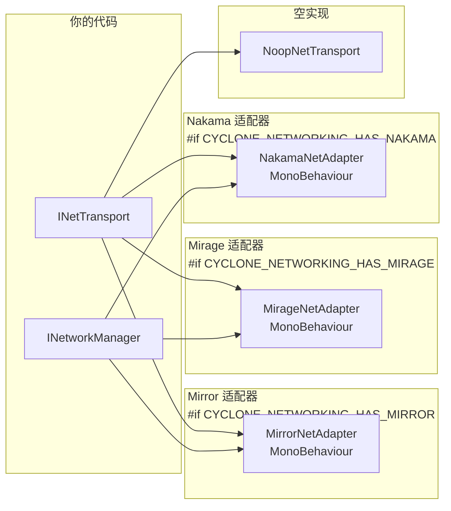
```mermaid
flowchart LR
    subgraph YourCode["你的代码"]
        INetTransport2["INetTransport"]
        INetworkManager2["INetworkManager"]
    end

    subgraph MirrorAdapter["Mirror 适配器</br>#if CYCLONE_NETWORKING_HAS_MIRROR"]
        MirrorNet["MirrorNetAdapter</br>MonoBehaviour"]
    end

    subgraph MirageAdapter["Mirage 适配器</br>#if CYCLONE_NETWORKING_HAS_MIRAGE"]
        MirageNet["MirageNetAdapter</br>MonoBehaviour"]
    end

    subgraph NakamaAdapter["Nakama 适配器</br>#if CYCLONE_NETWORKING_HAS_NAKAMA"]
        NakamaNet["NakamaNetAdapter</br>MonoBehaviour"]
    end

    subgraph NoopAdapter["空实现"]
        Noop["NoopNetTransport"]
    end

    INetTransport2 --> MirrorNet
    INetTransport2 --> MirageNet
    INetTransport2 --> NakamaNet
    INetTransport2 --> Noop
    INetworkManager2 --> MirrorNet
    INetworkManager2 --> MirageNet
    INetworkManager2 --> NakamaNet
```

| 适配器             | 编译符号                              | 包资源                       | 说明                                      |
| ------------------ | ------------------------------------- | ---------------------------- | ----------------------------------------- |
| `MirrorNetAdapter` | `CYCLONE_NETWORKING_HAS_MIRROR`       | `com.mirror-networking.mirror` | Mirror 传输层 + 管理器适配器             |
| `MirageNetAdapter` | `CYCLONE_NETWORKING_HAS_MIRAGE`       | `com.miragenet.mirage`       | Mirage 传输层 + 管理器适配器              |
| `NakamaNetAdapter` | `CYCLONE_NETWORKING_HAS_NAKAMA`       | `com.heroiclabs.nakama-unity` | Nakama 会话、匹配和 socket 适配器          |
| `NoopNetTransport` | _（始终）_                            | _（无）_                     | 空实现，用于测试                          |

Unity `versionDefines` 只会根据 Unity Package Manager 已解析的包启用符号。仅把 package 文件夹放在仓库根目录旁边不会启用这些符号；需要通过 `UnityStarter/Packages/manifest.json` 引用、放入 `UnityStarter/Packages/` 作为 embedded package，或以其他 Unity package 方式导入。

Mirror 和 Mirage 适配器均同时实现 `INetTransport` 和 `INetworkManager`，并在 `Awake` 时自动向 `NetServices` 注册。Nakama 适配器为 Nakama 支持的客户端会话和 match state 暴露相同的 CycloneGames runtime contract。

---

### 22. 项目级扩展 (Project Extensibility)

**路径**: `Core/Profile/`

该模块是项目侧扩展网络底层的主要入口，用于避免把项目特定数字和协议所有权硬编码进 Cyclone core。内置常量和枚举仍然适合作为默认值、稳定状态码和便利预设；真正的产品规模、后端能力和项目消息范围应放在项目自己的 profile、capability descriptor 和 manifest 中。

`NetworkRuntimeProfile` 集中表达产品调优值，例如连接数、tick/send rate、payload size、buffer size、房间搜索数量、重连窗口和主机迁移窗口。它也支持项目自定义的 int、float 和 string setting，用于承载 Cyclone 无法预判的业务参数。

```csharp
NetworkRuntimeProfile profile = NetworkRuntimeProfiles.CreateDefaultBuilder()
    .SetInt("project.max_zone_players", 10000)
    .SetFloat("project.snapshot_jitter_buffer_seconds", 0.15f)
    .SetString("project.deployment", "regional-shard")
    .Build();

runtimeContextBuilder.AddRuntimeProfile(profile);
```

`NetworkNodeCapabilities` 描述 client host、relay、shard、gateway 或 dedicated server node 实际具备的能力。Capability id 是 string-backed，因此项目可以增加 Steam、LAN、主机平台网络、云服务器、分片、持久化、反作弊或 modding 相关能力，而不需要修改 Cyclone enum。

```csharp
NetworkCapabilityId zoneLease = new NetworkCapabilityId("project.zone_lease");

NetworkNodeCapabilities node = new NetworkNodeCapabilitiesBuilder
{
    NodeId = "us-east-zone-17",
    Region = "us-east",
    Platform = "linux-headless",
    MaxConnections = 10000,
    MaxPayloadBytes = 1200,
    CpuScore = 92,
    MemoryScore = 88,
}
.Add(NetworkCapabilityIds.DedicatedServer, level: 2, score: 40d)
.Add(NetworkCapabilityIds.Sharding, level: 3, score: 50d)
.Add(zoneLease, level: 1, score: 20d)
.Build();

NetworkCapabilityQuery query = new NetworkCapabilityQuery
{
    Region = "us-east",
    MinimumConnections = 5000,
}
.Require(NetworkCapabilityIds.DedicatedServer)
.Prefer(zoneLease);

bool canHost = NetworkNodeCapabilityMatcher.Matches(node, query);
```

`NetworkProtocolManifest` 让 package 或游戏项目在一个地方声明 message range、protocol version、message descriptor、schema metadata 和 catalog registration。Cyclone-owned module 应注册 module range；项目玩法协议应使用 user range，并放在项目自己的 assembly 中。

```csharp
NetworkProtocolManifest manifest = new NetworkProtocolManifestBuilder(
        owner: "Project.Gameplay",
        minMessageId: 30000,
        maxMessageId: 30999,
        kind: NetworkMessageKind.User)
    .AddMessage<PlayerInputMessage>(30000, NetworkChannel.UnreliableSequenced, maxPayloadSize: 96)
    .AddMessage<InventoryCommandMessage>(30001, NetworkChannel.Reliable, maxPayloadSize: 512)
    .SetMetadata("schema", "project-gameplay-v3")
    .Build();

catalog.RegisterProtocolManifest(manifest);
```

设计准则：

- 将 enum 视为稳定状态码、结果码或便利预设。开放式项目分类应使用 `NetworkCapabilityId`、label、profile setting 和 protocol manifest。
- 将 `NetworkConstants` 中的数字视为框架默认值，而不是产品上限。产品级规模限制应放入项目 profile 和部署 descriptor。
- 项目协议保留在项目自己的 manifest 中。Cyclone package manifest 只描述 Cyclone-owned message。
- 对于超大型游戏，应在 node、shard、zone、fleet 和 gateway 层级建模容量，而不是单纯提高一个全局 `MaxConnections`。

持久化行为：这些 core model 本身不写文件或资产。项目可以通过自己的 `ScriptableObject`、JSON、YAML、remote config 或部署流水线 adapter 序列化 profile、capability 和 manifest，并在 composition 阶段构建这些纯 C# 对象。

---

### 23. 生产硬化矩阵 (Production Hardening Matrix)

**路径**: `Core/Hardening/`

生产硬化矩阵把“商业项目上线前必须证明什么”变成显式、可扩展、可测试的契约。它不替代真实压测、长时间 soak test、平台认证、安全审计或后端部署验证；它的作用是让每个项目用同一套入口声明要验证的目标，并在 runtime profile、node capability、protocol manifest 或 fault injection plan 不完整时提前失败。

评估器消费四类通用输入：

- `NetworkRuntimeProfile`：产品规模、tick/send rate、payload 和 session 时序目标。
- `NetworkNodeCapabilities`：client host、relay、shard、gateway 或 dedicated server 的真实能力。
- `NetworkProtocolManifest`：协议所有权、message range、版本和 payload budget。
- `NetworkFailureInjectionPlan`：latency、packet loss、断线、reconnect storm、backend outage、mobile suspend、WebGL throttling、protocol mismatch，以及项目自定义故障的计划覆盖。

```csharp
NetworkProductionReadinessScenario scenario = NetworkProductionReadinessScenarios
    .CreateMassiveShardBuilder()
    .Build();

NetworkFailureInjectionPlan faults = new NetworkFailureInjectionPlanBuilder
{
    PlanId = "massive-zone-faults"
}
    .AddFault(NetworkFaultIds.BandwidthCap, durationSeconds: 30d)
    .AddFault(NetworkFaultIds.ReconnectStorm, durationSeconds: 30d)
    .AddFault(NetworkFaultIds.BackendUnavailable, durationSeconds: 30d)
    .Build();

var input = new NetworkProductionReadinessInput
{
    RuntimeProfile = profile,
    NodeCapabilities = nodeCapabilities
}
    .AddProtocolManifest(projectGameplayManifest)
    .AddFailurePlan(faults);

NetworkProductionReadinessReport report = NetworkProductionReadinessEvaluator.Evaluate(scenario, input);
if (!report.Passed)
{
    // Print issues in CI, editor diagnostics, or deployment validation tooling.
}
```

内置 scenario builder 是通用模板，不是游戏品类锁定：

| Builder | 用途 |
| --- | --- |
| `CreateSmallSessionBuilder()` | LAN、platform lobby、relay、listen-server 或小规模 peer session 验证 |
| `CreateAuthoritativeArenaBuilder()` | 带 prediction、rollback、reconnect 和 protocol check 的服务器权威 action session |
| `CreateLargeAreaBuilder()` | 面向 AOI、send budget、reconnect storm 和 backend limit 的大区域验证 |
| `CreateMassiveShardBuilder()` | 面向超大世界的 shard、zone、fleet 和 gateway 验证 |
| `CreateWebMobileBuilder()` | WebGL/mobile suspend、throttling、reconnect 和 relay 相关验证 |

项目可以新增自己的 scenario id、requirement id、capability id 和 fault id，不需要修改 Cyclone：

```csharp
var cloudSaveFleet = new NetworkCapabilityId("project.cloud.save_fleet");
var regionFailover = new NetworkFaultId("project.region_failover");

NetworkProductionReadinessScenario customScenario = new NetworkProductionReadinessScenarioBuilder
{
    ScenarioId = new NetworkHardeningScenarioId("project.live_ops"),
    MinimumProfileConnections = 5000,
    MinimumNodeConnections = 5000,
    RequireProtocolManifest = true,
    MinimumProtocolManifestCount = 1
}
    .RequireCapability(cloudSaveFleet, minimumLevel: 2)
    .RequireFault(regionFailover, minimumDurationSeconds: 60d)
    .Build();
```

持久化行为：hardening scenario、report 和 fault plan 都是纯 C# runtime object，本身不写文件。项目可以通过自己的资产、JSON/YAML 文件、CI metadata、live-service deployment descriptor 或外部测试报告 importer 持久化它们。

最小验证建议：

- 对每个项目级 networking profile，在 EditMode test 或 CI 中运行 hardening evaluator。
- 将真实压测和平台测试覆盖回填到 `NetworkFailureInjectionPlan` metadata，不要把内置 plan 本身当作已经完成证明。
- 对 `Required` 或 `Critical` issue 失败构建；`Warning` issue 只有在项目明确签字后才允许放行。
- 如果产品同时支持小房间、服务器权威、大区域、超大分片和 Web/mobile 等多种网络模式，应维护多个独立 scenario。

---

## 游戏类型适配指南

根据你的游戏类型选择合适的模块组合：

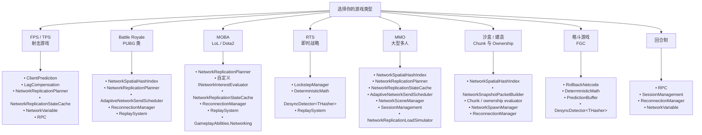
```mermaid
flowchart TB
    Start["选择你的游戏类型"] --> FPS
    Start --> BattleRoyale
    Start --> MOBA
    Start --> RTS
    Start --> MMO
    Start --> Sandbox
    Start --> Fighting
    Start --> TurnBased

    FPS["FPS / TPS</br>射击游戏"]
    BattleRoyale["Battle Royale</br>PUBG 类"]
    MOBA["MOBA</br>LoL / Dota2"]
    RTS["RTS</br>即时战略"]
    MMO["MMO</br>大型多人"]
    Sandbox["沙盒 / 建造</br>Chunk 与 Ownership"]
    Fighting["格斗游戏</br>FGC"]
    TurnBased["回合制"]

    FPS --> FPS_Modules["• ClientPrediction</br>• LagCompensation</br>• NetworkReplicationPlanner</br>• NetworkReplicationStateCache</br>• NetworkVariable</br>• RPC"]

    BattleRoyale --> BR_Modules["• NetworkSpatialHashIndex</br>• NetworkReplicationPlanner</br>• AdaptiveNetworkSendScheduler</br>• ReconnectionManager</br>• ReplaySystem"]

    MOBA --> MOBA_Modules["• NetworkReplicationPlanner</br>• 自定义 INetworkInterestEvaluator</br>• NetworkReplicationStateCache</br>• ReconnectionManager</br>• ReplaySystem</br>• GameplayAbilities.Networking"]

    RTS --> RTS_Modules["• LockstepManager</br>• DeterministicMath</br>• DesyncDetector&lt;THasher&gt;</br>• ReplaySystem"]

    MMO --> MMO_Modules["• NetworkSpatialHashIndex</br>• NetworkReplicationPlanner</br>• NetworkReplicationStateCache</br>• AdaptiveNetworkSendScheduler</br>• NetworkSceneManager</br>• SessionManagement</br>• NetworkReplicationLoadSimulator"]

    Sandbox --> Sandbox_Modules["• NetworkSpatialHashIndex</br>• NetworkSnapshotPacketBuilder</br>• Chunk / ownership evaluator</br>• NetworkSpawnManager</br>• ReconnectionManager"]

    Fighting --> Fighting_Modules["• RollbackNetcode</br>• DeterministicMath</br>• PredictionBuffer</br>• DesyncDetector&lt;THasher&gt;"]

    TurnBased --> Turn_Modules["• RPC</br>• SessionManagement</br>• ReconnectionManager</br>• NetworkVariable"]
```

| 游戏类型              | 同步模式 | 核心模块                                                        | 延迟策略                |
| --------------------- | -------- | --------------------------------------------------------------- | ----------------------- |
| FPS/TPS               | 状态同步 | ClientPrediction + LagCompensation + Planner + StateCache       | 客户端预测 + 服务器回退 |
| Battle Royale         | 状态同步 | SpatialHashIndex + Planner + AdaptiveScheduler + Replay         | AOI 裁剪 + 突发预算控制 |
| MOBA (LoL)            | 状态同步 | Planner + 自定义 evaluator + StateCache + GameplayAbilities bridge | 服务器权威 + 团队/视野规则 |
| RTS (Red Alert)       | 帧同步   | Lockstep + FPInt64 + DesyncDetector\<THasher\>                  | 确定性模拟              |
| MMO                   | 状态同步 | SpatialHashIndex + Planner + StateCache + AdaptiveScheduler + Scene | AOI 裁剪、发送预算、分片 |
| 沙盒 / 建造           | 状态同步 | SpatialHashIndex + SnapshotPacketBuilder + chunk evaluator + Spawn | Chunk 级 delta + ownership |
| 格斗 (Street Fighter) | 回滚     | RollbackNetcode + FPInt64                                       | GGPO 回滚重放           |
| 回合制                | 请求响应 | RPC + Session                                                   | 无需实时同步            |

---

## 进阶教程

### 教程 1：从零搭建 FPS 网络同步

**目标**: 实现玩家移动的客户端预测和服务器授权。

```csharp
// === 步骤 1: 定义数据结构 ===
public struct FpsInput : IEquatable<FpsInput>
{
    public float MoveX, MoveZ;
    public float LookYaw;
    public bool Fire;

    public bool Equals(FpsInput other) =>
        MoveX == other.MoveX && MoveZ == other.MoveZ &&
        LookYaw == other.LookYaw && Fire == other.Fire;
}

public struct FpsState : IEquatable<FpsState>
{
    public float X, Y, Z;
    public float Yaw;

    public bool Equals(FpsState other) =>
        Math.Abs(X - other.X) < 0.01f &&
        Math.Abs(Z - other.Z) < 0.01f;
}

// === 步骤 2: 实现 IPredictable ===
public class FpsPlayer : MonoBehaviour, IPredictable<FpsInput, FpsState>
{
    public float Speed = 5f;

    public FpsInput CaptureInput() => new FpsInput
    {
        MoveX = Input.GetAxis("Horizontal"),
        MoveZ = Input.GetAxis("Vertical"),
        LookYaw = Input.GetAxis("Mouse X"),
        Fire = Input.GetMouseButton(0)
    };

    public FpsState CaptureState() => new FpsState
    {
        X = transform.position.x,
        Y = transform.position.y,
        Z = transform.position.z,
        Yaw = transform.eulerAngles.y
    };

    public void ApplyState(in FpsState state) =>
        transform.position = new Vector3(state.X, state.Y, state.Z);

    public void SimulateStep(in FpsInput input, float deltaTime)
    {
        var move = new Vector3(input.MoveX, 0, input.MoveZ) * Speed * deltaTime;
        transform.position += move;
    }

    public bool StatesMatch(in FpsState a, in FpsState b) => a.Equals(b);
}

// === 步骤 3: 组装系统 ===
public class FpsNetworkController : MonoBehaviour
{
    private ClientPredictionSystem<FpsInput, FpsState> _prediction;
    private NetworkTickSystem _tickSystem;
    private FpsPlayer _player;

    void Start()
    {
        _player = GetComponent<FpsPlayer>();
        _tickSystem = new NetworkTickSystem(60); // 60Hz
        _prediction = new ClientPredictionSystem<FpsInput, FpsState>(_player);

        _tickSystem.OnTick += OnTick;

        NetServices.Instance.RegisterHandler<FpsState>(2001, OnServerState);
    }

    void OnTick(NetworkTick tick)
    {
        _prediction.RecordPrediction(tick, _tickSystem.TickInterval);

        // 发送输入到服务器
        NetServices.Instance.SendToServer(2000, _player.CaptureInput());
    }

    void OnServerState(INetConnection conn, FpsState state)
    {
        // 自动回滚 + 重新模拟
        _prediction.ProcessServerState(_tickSystem.CurrentTick, state);
    }

    void Update() => _tickSystem.Update(Time.deltaTime);
}
```

### 教程 2：实现 RTS 帧同步

**目标**: 多玩家确定性帧同步，适用于 RTS 类游戏。

```csharp
// === 步骤 1: 定义确定性输入 ===
public struct RtsInput
{
    public int SelectedUnitId;
    public int TargetX; // 使用整数坐标
    public int TargetY;
    public byte CommandType; // Move=0, Attack=1, Build=2
}

// === 步骤 2: 确定性模拟 ===
public class RtsSimulation
{
    // 使用定点数避免浮点不确定性
    private Dictionary<int, FPVector3> _unitPositions = new();

    public void Simulate(int frame, Dictionary<int, RtsInput> inputs)
    {
        foreach (var (peerId, input) in inputs)
        {
            if (input.CommandType == 0) // Move
            {
                var target = new FPVector3(
                    FPInt64.FromInt(input.TargetX),
                    FPInt64.Zero,
                    FPInt64.FromInt(input.TargetY)
                );

                var current = _unitPositions[input.SelectedUnitId];
                var dir = FPVector3.Normalize(target - current);
                var speed = FPInt64.FromFloat(5f);
                var tickDelta = FPInt64.FromFloat(1f / 30f);

                _unitPositions[input.SelectedUnitId] =
                    current + dir * speed * tickDelta;
            }
        }
    }
}

// === 步骤 3: 组装帧同步 ===
public class RtsNetworkController : MonoBehaviour
{
    private LockstepManager<RtsInput> _lockstep;
    private DesyncDetector _desyncDetector;
    private RtsSimulation _simulation;

    void Start()
    {
        _simulation = new RtsSimulation();
        _desyncDetector = new DesyncDetector();

        _lockstep = new LockstepManager<RtsInput>(
            peerCount: 4, localPeerId: myPeerId, inputDelay: 3
        );

        _lockstep.OnSimulateFrame += (frame, inputs) =>
        {
            _simulation.Simulate(frame, inputs);

            // 计算状态哈希（反作弊）
            _desyncDetector.BeginFrame(frame);
            foreach (var unit in allUnits)
            {
                _desyncDetector.HashFPVector3(unit.Position);
            }
        };

        _lockstep.OnDesyncDetected += frame =>
            Debug.LogError($"不同步！帧 {frame}");
    }

    void FixedUpdate()
    {
        _lockstep.SubmitLocalInput(GetPlayerInput());
        _lockstep.Tick();
    }
}
```

### 教程 3：使用 Replication Infrastructure 实现团队可见性

**目标**: 用纯 C# replication snapshot 构建每个连接的可见对象列表。

```csharp
using CycloneGames.Networking.Replication;

public class TeamVisionController : MonoBehaviour
{
    private readonly NetworkReplicationPlanner _planner = new NetworkReplicationPlanner();
    private readonly NetworkReplicationSelection[] _results = new NetworkReplicationSelection[256];

    int BuildPlanForConnection(PlayerConnection player, NetworkReplicatedObject[] objects, int serverTick)
    {
        var observer = new NetworkReplicationObserver(
            player.ConnectionId,
            player.PlayerId,
            player.TeamId,
            player.Position,
            viewRadius: 60f);
        var budget = new NetworkSendBudget(maxBytes: 4096, maxMessages: 64);

        return _planner.BuildPlan(observer, objects, serverTick, ref budget, _results);
    }
}
```

---

## API 速查表

### 核心

| 类/接口           | 说明           | 关键方法                                                         |
| ----------------- | -------------- | ---------------------------------------------------------------- |
| `NetServices`     | 全局服务定位器 | `Instance`, `Register`, `IsAvailable`                            |
| `INetTransport`   | 传输层接口     | `StartServer`, `Send`, `Broadcast`, `GetStatistics`              |
| `INetworkManager` | 高级网络接口   | `RegisterHandler<T>`, `SendToServer<T>`, `BroadcastToClients<T>` |
| `INetConnection`  | 连接抽象       | `ConnectionId`, `Ping`, `Quality`, `IsAuthenticated`             |

### 序列化

| 类                             | 说明                        |
| ------------------------------ | --------------------------- |
| `SerializerFactory`            | 创建序列化器实例            |
| `JsonSerializerAdapter`        | Unity JsonUtility（默认）   |
| `MessagePackSerializerAdapter` | MessagePack（推荐生产环境） |
| `ProtoBufSerializerAdapter`    | Protocol Buffers            |

### 同步

| 类                            | 说明         | 关键方法                                 |
| ----------------------------- | ------------ | ---------------------------------------- |
| `NetworkTickSystem`           | 固定帧驱动   | `Update(dt)`, `OnTick`, `TickRate`       |
| `ClientPredictionSystem<I,S>` | 客户端预测   | `RecordPrediction`, `ProcessServerState` |
| `NetworkVariable<T>`          | 自动同步变量 | `Value`, `OnChanged`, `IsDirty`          |
| `RpcProcessor`                | RPC 处理器   | `Register<T>`, `Send<T>`                 |

### 帧同步

| 类                        | 说明                     | 关键方法                                      |
| ------------------------- | ------------------------ | --------------------------------------------- |
| `LockstepManager<T>`      | 帧同步管理器             | `SubmitLocalInput`, `Tick`, `OnSimulateFrame` |
| `RollbackNetcode<I,S>`    | GGPO 回滚                | `AdvanceFrame`, `ReceiveConfirmedInput`       |
| `FPInt64`                 | Q32.32 定点数            | `FromFloat`, `ToFloat`, `Sqrt`                |
| `DesyncDetector<THasher>` | 不同步检测（可插拔哈希） | `BeginFrame`, `HashFPVector3`, `EndFrame`     |
| `DesyncDetector`          | 默认别名（FNV-1a）       | `new DesyncDetector()`                        |
| `IStateHasher`            | 哈希算法接口             | `Reset`, `HashInt`, `HashLong`, `GetDigest`   |
| `Fnv1aHasher`             | FNV-1a 64-bit（默认）    | 内置，零分配                                  |

### 复制基础设施

| 类/接口                           | 适用场景                                      |
| --------------------------------- | --------------------------------------------- |
| `NetworkReplicationPolicy`        | 声明 owner/team/area/manual 可见性             |
| `NetworkReplicationObserver`      | 每个连接的可见性和预算输入                    |
| `NetworkReplicatedObject`         | 每个对象的 replication snapshot               |
| `INetworkInterestEvaluator`       | 自定义 AOI、房间、队伍、隐身、揭示规则        |
| `DefaultNetworkInterestEvaluator` | owner/team/area/layer/auth 基线规则            |
| `NetworkSendBudget`               | 每连接 byte 和 message 限制                   |
| `NetworkReplicationPlanner`       | 按优先级选择复制对象                          |
| `NetworkReplicationStateCache`    | 每连接 last sent/acked/full-state 状态         |
| `NetworkSpatialHashIndex`         | 建好索引后的无分配 spatial AOI 查询            |
| `NetworkSnapshotPacketBuilder`    | 稳定 full-state 与 delta snapshot packet writer |
| `INetworkSnapshotPayloadSource`   | 玩法侧 payload size/hash/write 契约            |
| `AdaptiveNetworkSendScheduler`    | 根据链路质量控制 send interval 和 budget       |
| `NetworkReplicationLoadSimulator` | 确定性的 planner 负载模拟                      |

### 会话韧性

| 类/接口                           | 适用场景                                      |
| --------------------------------- | --------------------------------------------- |
| `NetworkSessionDirectory`         | backend-neutral 房间搜索、过滤、排序           |
| `NetworkSessionDescriptor`        | Steam/LAN/backend/dedicated room metadata      |
| `NetworkSessionSearchCriteria`    | game mode、map、region、build、容量、ping、能力过滤 |
| `NetworkMatchmakingCoordinator`   | 生成 join/create/queue 计划                    |
| `ReconnectionManager`             | 席位保留、reconnect token 校验、状态追赶       |
| `HostMigrationCoordinator`        | host failover、候选选择、迁移状态              |
| `IHostCandidatePolicy`            | 自定义 authority、hardware、shard、relay 或平台 host 选择 |
| `NetworkAuthorityTransferPlan`    | session/simulation/spawn/object/scene/match/RNG authority 转移 |

### 项目级扩展

| 类/接口                                    | 适用场景                                      |
| ----------------------------------------- | --------------------------------------------- |
| `NetworkRuntimeProfile`                   | 项目拥有的 runtime 和调优 profile              |
| `NetworkRuntimeProfileRegistry`           | 不依赖全局项目设置的 profile lookup            |
| `NetworkNodeCapabilities`                 | backend、client host、shard、relay 或 dedicated node descriptor |
| `NetworkCapabilityId`                     | 项目自定义的可扩展 capability id               |
| `NetworkCapabilityQuery`                  | required/preferred capability matching         |
| `NetworkProtocolManifest`                 | 带版本的 protocol、range 和 message manifest   |
| `NetworkProtocolManifestCatalogExtensions` | 将 manifest 注册到 `INetworkMessageCatalog`   |

### 生产硬化

| 类/接口                                  | 适用场景                                      |
| ---------------------------------------- | --------------------------------------------- |
| `NetworkProductionReadinessScenario`     | scenario 拥有的生产 readiness contract        |
| `NetworkProductionReadinessScenarios`    | small-session、arena、large-area、massive-shard 和 web/mobile 通用模板 |
| `NetworkProductionReadinessInput`        | profile、node、manifest 和 fault plan 的评估输入 |
| `NetworkProductionReadinessEvaluator`    | 确定性的 readiness assessment                 |
| `NetworkProductionReadinessReport`       | blocking/warning issue report                 |
| `NetworkFailureInjectionPlan`            | 面向 CI、Editor diagnostics 或外部压测的 fault coverage plan |
| `NetworkFaultId`                         | 项目自定义的可扩展 fault id                   |

### GAS 集成（`CycloneGames.GameplayAbilities.Networking`）

- `NetworkedAbilityBridge`：与具体传输层无关的 GAS 协议桥。
- `AttributeSyncManager`：通用属性脏追踪与同步。
- `GameplayAbilitiesNetworkedASCAdapter`：GameplayAbilities 的全量快照与细粒度 effect delta 集成。
- `GasBridgeGameplayAbilitiesExtensions`：一行完成 ASC 注册、delta 复制与 full-state 下发。

---

## 当前适配器与协议说明

本节对应当前 Cyclone networking 层，建议新项目优先阅读这里，再回到前面的模块教程逐项深入。

### Runtime Context

使用 `INetworkRuntimeContext` 描述当前启用的后端。内置 runtime id 是可读 ASCII code，并存储在 `NetworkRuntimeId` 中：

```csharp
NetworkRuntimeIds.Mirror  // "Mirror"
NetworkRuntimeIds.Mirage  // "Mirage"
NetworkRuntimeIds.Nakama  // "Nakama"
```

自定义后端应使用 `NetworkRuntimeId.FromAsciiCode("MyNet")`，长度最多 8 个可打印 ASCII 字符。后端能力通过 `NetworkBackendFeatures` 声明，例如 `RealtimeTransport`、`AuthSession`、`Matchmaker`、`BackendRpc`、`Presence`、`Relay` 和 `AuthoritativeServer`。

### Wire Frame

当 adapter 需要与底层 SDK 无关的消息信封时，Cyclone 使用稳定 wire frame。一个 frame 是固定 Cyclone header 加序列化 payload。当前 header 为 22 bytes：

| Offset | Size | 字段 | 说明 |
| ---: | ---: | --- | --- |
| 0 | 2 | Magic | ASCII bytes `C` 和 `N`，按 little-endian `ushort` 读取。 |
| 2 | 1 | Version | 当前协议版本。 |
| 3 | 1 | HeaderLength | Header 字节数。 |
| 4 | 2 | Flags | `NetworkMessageFlags`。 |
| 6 | 2 | MessageId | Cyclone 类型化消息 id。 |
| 8 | 1 | Channel | `NetworkChannel` 值。 |
| 9 | 1 | Reserved | 保留字段。 |
| 10 | 4 | Sequence | 消息或 frame 序号。 |
| 14 | 4 | PayloadLength | 序列化 payload 字节长度。 |
| 18 | 4 | Checksum | 对路由元数据和 payload 计算的 FNV-1a checksum。 |

`NetworkFrameCodec` 可以无堆分配地读取、写入和校验 frame。checksum 不是密码学完整性校验：它用于发现意外损坏和解析不匹配，不能替代 TLS、DTLS、HMAC、签名或后端认证。

Mirror 和 Mirage adapter 使用 `CycloneWireFrameMessage`。它的 `Frame` 字段包含完整 Cyclone frame，包括 header 和 payload。如果只需要 payload，使用 `NetworkFrameCodec.TryReadPayload`。

### 协议版本

`NetworkWireProtocol.CurrentVersion` 当前为 `1`。这是第一版稳定 Cyclone wire-frame 契约，不是 legacy 兼容分支。因为项目还没有发布旧协议，当前设计中没有 `LegacyRaw` 或旧 raw-message 路径。

### 后端兼容

Mirror 和 Mirage 是 Unity-hosted networking 的实时传输 adapter。Nakama 现在通过 `Unity.Runtime/Adapters/Nakama` 提供 client-side socket adapter 和 backend service facade。

`NakamaNetAdapter` 实现 `INetTransport`、`INetworkManager`、`INetworkRuntimeContextProvider`、`INetworkSessionService`、`INetworkMatchStateService`、`INetworkMatchmakerService`、`INetworkBackendRpcService` 和 `INetworkPresenceService`。它会把 Cyclone wire frame 通过 Nakama match state 发送出去，并用可配置 op code 区分 Cyclone gameplay frame；接收侧仍走 `NetworkFrameCodec` 校验路径。

重要使用说明：

- `StartClient(matchId)` 会连接 socket，并可按配置加入 relayed match。
- `StartServer()` 有意不支持。权威逻辑应放在 Nakama server module 或 dedicated server adapter 中。
- `SendToServer`、`BroadcastToClients` 和 `Broadcast` 会映射为 Nakama match state 发送。
- 当目标连接是由 `IUserPresence` 支撑的 `NakamaNetConnection` 时，`SendToClient` 可以定向发送。
- Adapter 通过 Cyclone service interfaces 暴露 Nakama session、match state、matchmaker、RPC 和 presence，因此 Gameplay 代码不需要依赖 Nakama SDK 类型。
- Adapter 程序集是可选程序集，仅在安装 `com.heroiclabs.nakama-unity` 时编译。

Best HTTP 适合 HTTP、REST、RPC 和 download；除非游戏明确采用 request/response 网络模型，否则不应作为默认实时 Gameplay 传输。

### Editor 诊断

通过 `Create > CycloneGames > Networking > Bootstrap Preset` 创建 preset，通过 `Tools > CycloneGames > Networking > Bootstrap Diagnostics` 打开检查器。诊断会检查缺少 transport、缺少或重复 manager、runtime context 接线、可选 SDK 包和所需后端能力。

## 目录结构

```text
Core/
├── Core/                 # 核心接口与 runtime context
├── Profile/              # Runtime profile、node capability、protocol manifest
├── Hardening/            # 生产 readiness scenario、fault plan、evaluator
├── Buffers/              # 缓冲区与对象池
├── Serialization/        # 序列化接口与工厂
├── Replication/          # Interest、spatial AOI、state cache、snapshot packets、send budgets、load simulation
├── StateSync/            # NetworkVariable 状态同步
├── Rpc/                  # RPC 属性与处理器
├── Routing/              # 分布式部署 actor route table
├── Lockstep/             # 帧同步、回滚、IStateHasher
├── Security/             # 限流器、消息校验
├── Session/              # 房间目录、匹配计划、重连、主机迁移
├── Replay/               # 录像与回放
├── Spawning/             # 网络对象生成
├── Scene/                # 网络场景管理
├── Authentication/       # 身份验证
├── Platform/             # 平台特定配置
├── Adapters/             # Mirror/Mirage/Nakama 适配器
└── Stubs/                # 空实现（测试用）

可选集成包:
├── CycloneGames.GameplayAbilities.Networking/
├── CycloneGames.GameplayFramework.Networking/
├── CycloneGames.GameplayTags.Networking/
└── CycloneGames.RPGFoundation.Interaction.Networking/
```

---

## 许可证

本项目遵循项目根目录 LICENSE 文件中的许可证。
