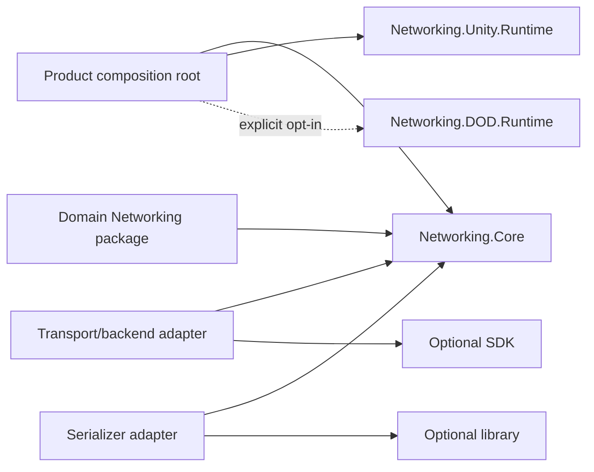

# CycloneGames.Networking

[English | 简体中文](README.SCH.md)

CycloneGames.Networking is a transport-neutral foundation for versioned message protocols, transport integration, bounded memory ownership, replication planning, deterministic-simulation coordination, session recovery, security policy, and diagnostics. Pure C# contracts stay in Core; Unity behavior, Editor tooling, serializers, and third-party SDK bridges stay in separate assemblies. Topology, authority, authentication, key management, matchmaking, backend deployment, schema rollout, and content compatibility remain product-owned.

## Table of Contents

- [Overview](#overview)
- [Architecture](#architecture)
- [Quick Start](#quick-start)
- [Core Concepts](#core-concepts)
- [Usage Guide](#usage-guide)
- [Advanced Topics](#advanced-topics)
- [Common Scenarios](#common-scenarios)
- [Performance and Memory](#performance-and-memory)
- [Troubleshooting](#troubleshooting)

## Overview

The module provides transport, connection, runtime-context, serializer, and canonical message-endpoint contracts. Protocol registration is manifest-only, with explicit ID ranges, contract identities, payload budgets, channels, version windows, and fingerprints. Bounded buffers, queues, rate-limit state, sequence windows, reconnection reservations, and simulation histories are owned explicitly by the product composition root or its subsystems. Replication, interest, prediction, lockstep, rollback, session, and host-handoff primitives are building blocks for explicit product composition. Unity runtime bridges, LAN-host permission guidance, Editor diagnostics, and optional backend/serializer integrations complete the package.

The module does not include an RPC framework, a generic Service Locator, or automatic state-variable replication. Request, response, command, and notification semantics are product-owned versioned messages. Composition is explicit and instance-owned.

### Key Features

- Transport, connection, runtime-context, serializer, and canonical message-endpoint contracts.
- Manifest-only protocol registration with explicit ID ranges, contract identities, payload budgets, channels, version windows, and fingerprints.
- Bounded buffers, queues, rate-limit state, sequence windows, reconnection reservations, and simulation histories.
- Replication, interest, prediction, lockstep, rollback, session, and host-handoff primitives.
- Unity runtime bridges, LAN-host permission guidance, Editor diagnostics, and optional backend/serializer integrations.

## Architecture

This asset-style package lives below `Assets/ThirdParty/CycloneGames`; its `package.json` does not install dependencies. `Packages/manifest.json`, `packages-lock.json`, asmdef references and conditions, platform settings, and Unity's actual compilation result determine activation.

| Assembly | Role | Activation requirement |
| --- | --- | --- |
| `CycloneGames.Networking.Core` | Pure C# contracts and implementations; `noEngineReferences: true`. | Auto-referenced; requires `CycloneGames.DeterministicMath.Core` and `CycloneGames.Hash.Core`. |
| `CycloneGames.Networking.Unity.Runtime` | Unity bridges, baseline JSON serializer, prediction, interest, compression, and diagnostics. | Auto-referenced; requires Core. |
| `CycloneGames.Networking.Platform.Permissions` | Unity-facing LAN-host permission contract and platform implementations. | Auto-referenced; requires UniTask. |
| `CycloneGames.Networking.Editor` | Bootstrap preset/diagnostics and LAN-host permission window. | Editor only. |
| `CycloneGames.Networking.DOD.Runtime` | NativeContainer-backed interest managers; it does not schedule Jobs or use Burst. | Explicit asmdef reference; requires `Unity.Collections` and `Unity.Mathematics`. |
| `CycloneGames.Networking.Tests.Editor` | EditMode tests. | Test Runner only; explicit asmdef reference. |
| `CycloneGames.Networking.Serializer.NewtonsoftJson` | Newtonsoft JSON adapter. | Explicit asmdef reference; requires `com.unity.nuget.newtonsoft-json`. |
| `CycloneGames.Networking.Serializer.MessagePack` | MessagePack adapter. | Explicit asmdef reference; requires `com.github.messagepack-csharp`. |
| `CycloneGames.Networking.Adapter.Mirror` | Mirror transport bridge. | Explicit asmdef reference; requires `com.mirror-networking.mirror`. |
| `CycloneGames.Networking.Adapter.Mirage` | Mirage transport bridge. | Explicit asmdef reference; requires `com.miragenet.mirage`. |
| `CycloneGames.Networking.Adapter.Nakama` | Nakama client/backend bridge. | Explicit asmdef reference; requires `com.heroiclabs.nakama-unity`. |

An optional assembly is eligible to compile when its target platform matches, every assembly reference resolves, its `versionDefines` capability symbols are generated, and its `defineConstraints` pass. `autoReferenced: false` does not disable assembly compilation; it means a consumer must add an explicit asmdef reference before using that assembly's API. Do not duplicate generated capability symbols in PlayerSettings.

Core, Unity Runtime, Permissions, Editor, Tests, DOD, NewtonsoftJson, and the domain Networking packages use direct assembly references. Mirror, Mirage, Nakama, and MessagePack adapters compile only when Unity Package Manager resolves their declared packages and version constraints. A consumer that does not install an optional dependency does not reference or use its adapter assembly.

### Ownership


```mermaid
flowchart LR
    Product[Product composition root] --> Core[Networking.Core]
    Product --> Unity[Networking.Unity.Runtime]
    Product -. explicit opt-in .-> DOD[Networking.DOD.Runtime]
    Adapter[Transport/backend adapter] --> Core
    Adapter --> SDK[Optional SDK]
    Serializer[Serializer adapter] --> Core
    Serializer --> Library[Optional library]
    Family[Domain Networking package] --> Core
```

- Core never references Unity, a backend SDK, an optional serializer library, or a domain Networking package.
- Adapters translate lifecycle, identity, channels, and byte delivery. They do not decide product authority or gameplay policy.
- Each adapter instance owns its runtime context, connection wrappers, callback bindings, bounded mutable state, and shutdown. No static adapter accessor participates in composition.
- `NetworkRuntimeContext` is created explicitly, accepts services before `Build()`, then freezes. It is an instance-scoped composition object, not a global lookup point.
- Domain packages own non-overlapping ranges inside the Module range. Game-specific contracts use a product-owned User-range manifest.

## Quick Start

1. Choose topology and backend from product requirements, then install and lock only the selected SDK.
2. Add explicit asmdef references to Core, Unity Runtime, and the selected optional assemblies.
3. Construct the selected adapter as the product's `INetworkMessageEndpoint` in the composition root.
4. Encode domain messages into canonical bytes with the owning protocol codec, register a non-generic `NetworkMessageHandler`, and retain its `NetworkMessageHandlerLease` until shutdown. The callback span is valid only while the handler is running.
5. Build every protocol manifest and register it through `INetworkMessageCatalog.TryRegisterProtocolManifest` before accepting traffic.
6. Configure message policies, optional rate limiting, sequence protection, signing, payload/wire-byte budgets, logging redaction, and shutdown ownership.
7. Run bootstrap diagnostics, focused tests, target Player builds, and backend interoperability tests for every shipping platform.

`INetworkMessageEndpoint` never selects a serializer or discovers message types. `GetMaxPayloadSize` combines the protocol descriptor, configured adapter budget, channel support, and backend packet limit. Duplicate handler registration fails immediately; the default handler registry is bounded to 1,024 live registrations; disposing a stale or copied lease cannot remove a newer registration.

### Define a product protocol

`ContractId` is a stable, printable-ASCII wire identity. `SchemaHash` is the checked-in FNV-1a64 value of that exact string. Neither value may come from a CLR type name, reflection, `GetHashCode`, initialization order, or Unity object identity.

```csharp
using System;
using CycloneGames.Networking;

private const ushort MoveCommandId = NetworkConstants.UserMsgIdMin;
private const string MoveCommandContract = "MyGame.MoveCommand:v1";
private const ulong MoveCommandSchema = 0xAEF19F1ABB555DB0UL;

var manifest = new NetworkProtocolManifestBuilder(
    "MyGame",
    MoveCommandId,
    (ushort)(MoveCommandId + 31))
{
    ProtocolId = "com.mycompany.mygame.networking",
    CurrentVersion = 1,
    MinimumSupportedVersion = 1
}
.AddMessage(
    MoveCommandContract,
    MoveCommandId,
    MoveCommandSchema,
    NetworkChannel.UnreliableSequenced,
    maxPayloadSize: 96)
.Build();

if (!catalog.TryRegisterProtocolManifest(manifest))
    throw new InvalidOperationException("Protocol manifest conflicts with the active catalog.");
```

Freeze the canonical string and its literal hash in protocol tests. Any incompatible field, encoding, unit, quantization, authority, or semantic change requires a new contract identity and coordinated endpoint rollout.

## Core Concepts

### Manifest-only catalog

The global message space has three ranges:

| Range | IDs | Owner |
| --- | ---: | --- |
| System | `0-999` | Framework-level transport and control contracts. |
| Module | `1000-29999` | Explicit CycloneGames/domain package manifests. |
| User | `30000-65535` | Product-owned manifests. |

`NetworkMessageDescriptor` contains only stable wire facts: `MessageId`, `ContractId`, `Owner`, `SchemaHash`, `DefaultChannel`, and `MaxPayloadSize`. It does not store a runtime type name.

`NetworkMessageCatalog` accepts complete `NetworkProtocolManifest` instances only. Registration validates the manifest before mutation, rejects overlapping ranges or conflicting IDs, and commits the range and all descriptors under one lock. Registering the same protocol definition again is idempotent. `MessageCount`, `ManifestCount`, `TryGet`, `TryGetRegisteredRange`, and `ProtocolFingerprint` expose the resulting catalog state.

The manifest and catalog fingerprints are deterministic over the stable contract facts. Version windows and free-form metadata are negotiated or reported separately. A fingerprint match proves schema agreement only; it does not authenticate a peer.

### Fixed frame

`NetworkFrameCodec` defines a 22-byte little-endian header followed by payload bytes. Parsing rejects invalid segments, wrong magic, unsupported versions, unexpected header lengths, invalid flags/channels, non-zero reserved bytes, negative/truncated/trailing payloads, and checksum mismatch when requested.

The FNV-1a checksum detects accidental corruption and parser disagreement; it is not a MAC. Validate the frame and descriptor payload budget before deserialization. Serializer settings, compression rules, quantization ranges, and baselines are versioned protocol state.

## Usage Guide

### Runtime building blocks

- Replication planners, spatial indices, state caches, send budgets, and packet builders are primitives; the product remains the authority for relevance and overload policy.
- Unity interest managers offer grid, group, team-visibility, and composite choices. The DOD assembly offers two explicitly disposable NativeContainer-backed alternatives: `NativeGridInterestManager` and `NativeTeamVisibilityInterestManager`. It is not an ECS and does not schedule Jobs or use Burst.
- Prediction, interpolation, lag compensation, lockstep, rollback, reconnection, session directory, matchmaking coordination, and host handoff are independent capabilities.
- `QuantizedVector3`, `QuantizedQuaternion`, and `DeltaCompressor` use explicit little-endian encodings and fixed quantization configuration. Quantization and delta baselines belong to the protocol manifest and endpoint rollout.
- `ActorRouteTable` is an in-process helper, not a distributed router. Give it one owner and an external capacity policy.
- `LocalLoopTransport` supports deterministic in-process development; it does not model latency, loss, NAT, encryption, multi-client load, or release transport behavior.

### Optional transport and backend adapters

| Adapter | Boundary | Contract limits |
| --- | --- | --- |
| Mirror | Client/server/host Unity bridge. | All Mirror SDK access, lifecycle work, sends, broadcasts, disconnects, and callbacks stay on the Unity main owner thread. There is no cross-thread send queue. The reported payload ceiling is the configured limit capped by `NetworkMessages.MaxContentSize` after the worst-case `ArraySegment<byte>` prefix and Cyclone header; a missing or unqueryable transport reports zero. |
| Mirage | Client/server Unity bridge. | All Mirage SDK access stays on the Unity main owner thread. Server sends, broadcasts, and disconnects accept authenticated remote-client routes only; host-local and client-to-authority routes have distinct internal roles. The reported payload ceiling is capped by assigned `SocketFactory` limits after Mirage message-ID, packed-length, and Cyclone-header overhead; missing factories report zero. |
| Nakama | Client-side auth, socket, realtime match, presence, and matchmaking bridge. | Reliable match-state channel only. Injected `ISocket` callbacks and task continuations must remain on the Unity main owner thread; violations fail immediately and are not queued. Pending sends and live connection routes are bounded. `SendToServer` requires an authoritative match; server-to-client and server-broadcast endpoint routes are unsupported; presence-origin state is dispatched as peer-to-peer. |

Mirror and Mirage allocate one managed connection wrapper for each live directional route and reuse it for packet dispatch, error reporting, statistics, and lifecycle callbacks. Disconnect, backend-object replacement, server/client stop, and adapter destruction invalidate the wrapper, remove it from the owner cache, and release its backend reference. Mirage host mode intentionally has separate authority and host-local wrappers because those routes have different send permissions. This removes per-packet struct-to-`INetConnection` boxing in adapter dispatch. Nakama likewise caches one bounded wrapper per authority or peer route; match replacement, presence leave, stop, and destruction remove the route before notification and clear adapter, presence, and target references. Invalidated wrappers keep only stable value diagnostics and reject routing or mutation. These are adapter-local allocation and lifetime properties, not an end-to-end zero-allocation claim because SDK serialization, transports, delegates, and product handlers may still allocate. Compile and test each adapter with the exact SDK version used by the product before relying on its runtime behavior.

Adapters use explicit instance references and receive canonical bytes through `INetworkMessageEndpoint`; they do not select a serializer. Unsupported channels, capabilities, unknown non-system message IDs, or operations fail explicitly. Product code must handle `NetworkSendStatus`/boolean failure and backend exceptions according to the called API.

`NakamaNetAdapter.TrySendMatchState` is a backend service primitive rather than an `INetworkMessageEndpoint` authority route. It follows Nakama target-presence semantics; the product owns authorization and recipient policy when using it directly. SDK references exposed by the Nakama integration remain subject to the same Unity main-owner-thread contract.

Before shipping, verify the installed SDK version, native/browser transport, callback threads, suspend/resume, shutdown, reconnect, encryption, packet limits, stripping/code generation, and backend outage behavior. Adapter capability flags are declarations, not platform evidence.

### Serializer selection

| Serializer | Assembly and activation | Performance and safety |
| --- | --- | --- |
| `UnityJsonSerializerAdapter` | Included in Unity Runtime as an explicit codec building block. | Managed string/UTF-8 work; not a zero-GC hot-path format; limited by `JsonUtility`. |
| `NewtonsoftJsonSerializerAdapter` | Explicit opt-in assembly; requires `com.unity.nuget.newtonsoft-json`. | Managed string work; default type-name handling is disabled. Polymorphism requires an explicit allow-list binder. |
| `MessagePackSerializerAdapter` | Explicit opt-in assembly; requires `com.github.messagepack-csharp`. | Pooled/thread-local scratch storage, but requires verified formatter registration, AOT, and stripping behavior. |

Serializer choice belongs to each versioned domain protocol or product codec and occurs before calling the canonical byte endpoint. There is no ambient registration or automatic selection based on installed packages. Serializer type, options, generated formatters, compression, and message schema remain protocol facts that must agree across peers.

### Editor workflow

Create `Assets/Create/CycloneGames/Networking/Bootstrap Preset`. Its custom Inspector groups validation settings, uses `SerializedObject`/`SerializedProperty`, supports multi-object field editing, and limits action buttons when a safe multi-object result cannot be guaranteed.

- `Tools/CycloneGames/Networking/Bootstrap Diagnostics` inspects configured bootstrap rules in currently open scenes.
- `Tools/CycloneGames/Networking/Run Bootstrap Check` writes the current check result to Console.
- `Tools/CycloneGames/Networking/LAN Host Permission` shows host guidance, local IPv4 candidates, and Windows firewall status/actions.
- Optional adapter Inspectors appear only when their SDK integration assemblies are active.

Diagnostics run on request and do not rescan scenes on every repaint. They do not validate unopened build scenes, Player execution, backend connectivity, or platform certification. Before relying on an authoring workflow, verify Undo/Redo, Prefab Overrides, multi-object editing, domain reload, layout, and asset safety in the current Unity version.

## Advanced Topics

### Security boundary

Treat every frame, payload, sequence, token, backend response, and address as untrusted.

- Parse fixed framing and validate exact lengths before allocation or deserialization.
- Register per-message payload and direction policy; require authentication/encryption/signatures where authority requires them.
- `NetworkSecurityPipelineOptions.RateLimiter` is nullable: a configured instance enables bounded wire-byte charging; `null` means no pipeline rate limiting. Each validation call supplies the actual charge explicitly.
- `NetworkSecurityPipelineOptions.ReplayGuard` is the direct bounded sequence-state owner. Remove peer state on disconnect and clear it on shutdown.
- `HmacSha256NetworkMessageSigner` authenticates exactly the stable 22-byte wire header plus payload. It requires at least 32 bytes of key material, serializes access to its HMAC instance, rents cleared contiguous scratch storage, and excludes transport-local connection/player identity.
- Derive independent session/peer keys, protect them outside this package, rotate them according to an explicit policy, and dispose signers. The frame checksum is never a signature substitute.
- The default message policy is permissive and the default signer is disabled. Shipping composition must replace defaults for sensitive messages.
- Redact keys, tokens, payloads, account identifiers, and remote error bodies from logs and diagnostics.
- Process result enums reserve value 0 for `Invalid` or `Unknown`; compatible, accepted, valid, launched, and authenticated outcomes are explicit nonzero values. Default-initialized result structs therefore fail closed.

The package does not implement transport encryption, certificate validation, identity proof, key storage, or key exchange. Use a target-validated TLS/DTLS/WSS or platform/backend security boundary and test its real failure modes.

### Contract and release rules

- Protocol compatibility is governed by explicit manifests, contract identities, fingerprints, and version windows rather than CLR type names.
- Ship all communicating endpoints with a mutually supported manifest window. Reject fingerprint or version mismatch; never suppress it to keep incompatible peers connected.
- Treat serializer settings, numeric units, quantization, compression, channel semantics, authority, and maximum payload as protocol facts.
- Keep Core genre-neutral. Genre-specific behavior belongs in optional domain packages and cannot reverse the dependency direction.
- Coordinate rollback across client, server, and services so they return to one compatible protocol set. Source rollback does not undo firewall rules or remote backend state.

## Common Scenarios

### Deterministic lockstep simulation

A lockstep simulation transmits fixed-point inputs, validates them against the protocol manifest, and applies them in the same tick order on every peer:

```csharp
public void SendMoveCommand(FPVector2 input, int tick)
{
    Span<byte> payload = stackalloc byte[MoveCommandPayload.Size];
    MoveCommandPayload.Write(input, tick, payload);
    endpoint.Send(MoveCommandId, payload, NetworkChannel.UnreliableSequenced);
}

public void ReceiveMoveCommand(ReadOnlySpan<byte> payload)
{
    MoveCommandPayload.Read(payload, out FPVector2 input, out int tick);
    simulation.EnqueueInput(tick, input);
}
```

### Host-handoff session recovery

A session recovery flow preserves connection state during a host migration:

```csharp
public async Task MigrateHostConnectionAsync(
    NetworkSessionSnapshot snapshot,
    INetworkMessageEndpoint newEndpoint,
    CancellationToken ct)
{
    sessionCoordinator.CaptureReconnectionState(snapshot);
    await sessionCoordinator.HandoffAsync(newEndpoint, snapshot.AuthorityToken, ct);
    replicationPlanner.ResumeFromCheckpoint(snapshot.ReplicationSequence);
}
```

### Rate-limited security pipeline

A security-sensitive endpoint applies rate limiting, replay protection, and message signing before processing:

```csharp
var pipeline = new NetworkSecurityPipeline(
    new NetworkSecurityPipelineOptions
    {
        RateLimiter = sessionRateLimiter,
        ReplayGuard = sessionReplayGuard,
        Signer = sessionSigner,
    });

if (!pipeline.ValidateIncoming(connectionId, messageId, frameHeader, payload, out var error))
{
    LogSecurityEvent(connectionId, error);
    return;
}
```

## Performance and Memory

| Facility | Owner and lifetime | Concurrency rule | Capacity and failure |
| --- | --- | --- | --- |
| `NetworkBufferPool` | Process pool; each `Get` returns one lease disposed exactly once. | Pool bookkeeping is synchronized; buffer contents remain single-owner. | Retention is bounded and configurable. Stale/default/double return fails explicitly; clearing sensitive bytes costs CPU. |
| `NetworkBuffer` | Generation-checked `readonly struct` lease. Copies share the same token. | Never read/write one lease concurrently. | Disposing one copy invalidates all copies. Borrowed spans/segments expire with the lease. |
| `NetworkMessageCatalog` | Composition root registers cold-start manifests. | Catalog mutation/query is locked; do not register per tick. | Conflicts return `false` without partial publication. |
| `LocalLoopTransport` | One in-process development pair; caller stops/disposes it. | Main-thread polling. | One peer, reliable channel, bounded queues and bounded dispatch; unavailable in release builds. |
| `RateLimiter` | One session/security owner; remove disconnected peers and prune idle state. | Concurrent connection table with per-bucket synchronization. | Bounded tracked connections and token budgets; invalid time or exhausted capacity fails closed. |
| `NetworkReplayGuard` | One session/security owner; clear on shutdown. | Concurrent connection table with locked per-message windows. | Bounded peers/streams and a 64-sequence window; duplicate, stale, invalid, or over-capacity input is rejected. |
| `NetworkProfiler` | Diagnostics owner; reset at session boundaries. | Counters/statistics are synchronized. | Tracked message IDs are capped; stable-copy queries are cold-path and allocate. |
| `NativeGridInterestManager` / `NativeTeamVisibilityInterestManager` | Explicit single owner; caller must `Dispose`. | Mutation and queries run on the caller-selected owner thread; these types do not schedule Jobs. | Persistent native storage grows when configured capacity is exceeded; benchmark real distributions and memory ceilings. |

`NetworkTickId` stores a signed `long`; negative values are invalid. `NetworkTickRate`, network time, server-time estimates, rate limiting, reconnection, and security validation use `double` seconds. Feed them one finite monotonic time source. This avoids short wrap horizons and reduces long-session precision loss, but it does not make simulation deterministic by itself.

Interface calls through `INetReader`/`INetWriter`, JSON conversion, collection growth, diagnostics snapshots, and backend SDK calls may allocate. Pre-size bounded storage and profile the exact serializer, payload, transport, platform, backend, and entity distribution used by the game.

### Persistence

- Core, Unity Runtime, pools, catalogs, profilers, and session/simulation helpers do not automatically write files or Unity preference stores.
- `NetworkBootstrapPreset` is a user-created `ScriptableObject` at an explicit project path. The project decides whether it is version-controlled.
- Runtime caches and queues are reconstructible in-memory state and must be cleared by their owner during session teardown or shutdown.
- An explicitly approved Windows LAN-host action can create or replace a Windows Defender Firewall rule outside the project. Remove that OS rule through Windows settings or administrator tooling to roll it back.
- Optional backend calls can create remote sessions, matches, tickets, accounts, or other service state. Retention, audit, deletion, and schema evolution remain backend/product responsibilities.

### Platform compatibility

| Target | Runtime boundary | Required release validation |
| --- | --- | --- |
| Windows | Core is OS-neutral; Unity and firewall helpers isolate platform behavior. | Standalone/IL2CPP builds, UAC/firewall flow, backend interoperability, load, malicious input, and soak. |
| Linux / Dedicated Server | Core supports non-Unity composition; adapters remain separately activated. | Headless Player/process lifecycle, container/socket behavior, backend SDK, load, and shutdown. |
| macOS | Core has no OS-specific dependency. | Editor/Player build, signing, firewall/network behavior, backend, and soak. |
| iOS | Core is portable; LAN permission layer reports required configuration. | Xcode/IL2CPP, entitlement/privacy prompts, backgrounding, memory pressure, backend, and reconnect. |
| Android | Core is portable; permission helper is guidance only. | Gradle/IL2CPP, Wi-Fi/mobile transitions, backgrounding, memory pressure, backend, and reconnect. |
| WebGL | LAN hosting is unsupported; a browser-compatible adapter is required. | WebGL build, browser websocket behavior, single-thread fallback, memory growth, reconnect, and backend. |
| Future consoles | Core avoids OS-specific contracts; vendor boundaries require adapters. | Vendor toolchain, SDK/network policy, suspend/resume, memory, certification, and platform-specific security. |

Platform support depends on the selected transport, backend, serializer, build backend, and target Player. Validate Player and IL2CPP behavior, long-running stability, allocation, determinism, security, and hardware-tier budgets on every shipping configuration.

## Troubleshooting

| Symptom | Likely cause | Resolution |
| --- | --- | --- |
| Protocol manifest registration fails | Overlapping ID range or conflicting descriptor | Verify range boundaries and contract identities; each ID and contract pair must be unique across manifests |
| Handler registration fails on duplicate | Same message ID registered twice | Unregister the previous handler and lease before registering a new handler for the same ID |
| `NetworkBuffer` span is invalid after disposal | Lease was disposed before the span was consumed | Copy required bytes before disposing or passing ownership of the lease |
| Frame parsing rejects a valid-looking payload | Incorrect magic, version, or checksum | Validate the codec configuration matches on both endpoints; check for byte-order or alignment issues |
| Backend connection drops during host migration | Reconnection state not captured before migration | Capture all pending sends, sequence windows, and replication state before starting the handoff |
| Signing verification fails after key rotation | Signer not re-keyed for the new session | Derive new session keys, create a fresh signer instance, and validate the key exchange completed on both ends |
| Rate limiter blocks legitimate traffic | Token budget exhausted or peer not properly registered | Check per-connection token replenishment rate and connection registration order; remove stale peers |
| `LocalLoopTransport` unavailable in release build | By design | Use the local loop only during development; test against real transport adapters before shipping |
| IL2CPP build fails with adapter assembly | Missing SDK package or version mismatch | Install the exact supported SDK version; verify `versionDefines` and `defineConstraints` pass |
| Editor diagnostic shows false positive | Diagnostic runs on incomplete bootstrap configuration | Ensure all required bootstrap presets are assigned and scenes are loaded before running diagnostics |

## Validation

Run the following checks for every shipping configuration:

1. Force Unity script refresh/reimport and confirm every active assembly compiles.
2. Run `CycloneGames.Networking.Tests.Editor` and the activated serializer test assemblies.
3. Run every repository domain Networking package test suite whose manifest or adapter references Core.
4. Compile optional Mirror, Mirage, Nakama, and MessagePack assemblies only with the exact supported dependency installed; test both present and absent dependency states.
5. Run target Player/IL2CPP builds, stripping checks, backend interoperability, suspend/resume, shutdown, packet-loss/fuzz tests, and long-duration load for every shipping configuration.
6. Profile allocation, throughput, latency, scale, memory ceilings, and NativeContainer performance with representative workloads.
7. Manually verify Inspector Undo/Redo, Prefab Overrides, multi-object editing, domain reload, and asset safety.

## Related Packages

- `CycloneGames.GameplayAbilities` — owns gameplay state, an explicit authority/replica role, and the authoritative `TryExecuteAuthorityAbility` boundary; it does not own a transport bridge.
- `CycloneGames.GameplayAbilities.Networking` — fixed-wire protocol, codec, structural validator, and result mapper for non-predicted authority-owned `AuthorityOnly` activation. It is a protocol integration rather than a transport endpoint; the product endpoint supplies authentication, ownership, replay/rate policy, bounded pending state, authority-ID mapping, and owner-thread marshaling.
- `CycloneGames.GameplayFramework.Networking`
- `CycloneGames.BehaviorTree.Networking`
- `CycloneGames.AIPerception.Networking`
- `CycloneGames.RPGFoundation.Interaction.Networking`
- `CycloneGames.RPGFoundation.Movement.Networking`
- `CycloneGames.RPGFoundation.Projectile.Networking`
