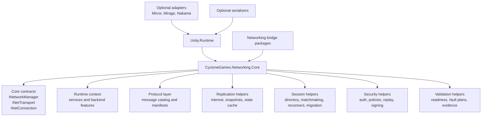
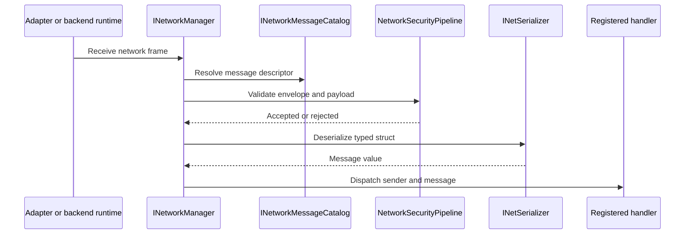

# CycloneGames.Networking

English | [Simplified Chinese](./README.SCH.md)

`CycloneGames.Networking` is the transport-neutral networking foundation used by CycloneGames runtime packages. It defines common contracts for network managers, transports, connections, serializers, message catalogs, protocol manifests, runtime profiles, replication planning, session discovery, reconnection, host migration, security validation, and optional backend adapters.

The package is a framework layer, not a complete online service. Concrete transports, platform identity, relay services, server orchestration, persistence, and game-specific replication rules are supplied by adapters or project packages.

## Package Layout

```text
CycloneGames.Networking/
  Core/
    Authentication/     Authentication provider contracts and provider chain
    Buffers/            Managed buffer pooling helpers
    Core/               INetworkManager, INetTransport, INetConnection, runtime context, message catalog
    Hardening/          Readiness scenarios, fault plans, validation evidence, and probes
    Lockstep/           Lockstep tick and command contracts
    Profile/            Runtime profiles, protocol manifests, node capabilities
    Replay/             Rollback and replay contracts
    Replication/        Interest, snapshots, state cache, send budgets, load simulation
    Routing/            Message routing contracts
    Rpc/                RPC attributes and metadata
    Scene/              Network scene contracts
    Security/           Message validation, security pipeline, replay guard, signer, crypto interfaces
    Serialization/      Serializer contracts and built-in serializer factory
    Services/           Service registration helpers
    Session/            Session, directory, matchmaking, reconnection, host migration
    Spawning/           Network spawn manager contracts
    StateSync/          State synchronization contracts
    Transports/         Transport adapter base contracts
  Unity.Runtime/
    Adapters/           Optional Mirror, Mirage, and Nakama adapters
    Serializers/        Optional serializer integrations
  DOD/Runtime/          Data-oriented runtime helpers
  Editor/               Editor diagnostics
  Tests/Editor/         EditMode tests
```

## Assembly Boundary

| Assembly | Role |
| --- | --- |
| `CycloneGames.Networking.Core` | Pure C# networking contracts, profiles, catalogs, replication, sessions, security, and validation helpers. |
| `CycloneGames.Networking.Unity.Runtime` | Unity runtime bridge and adapter-facing helpers. |
| `CycloneGames.Networking.DOD.Runtime` | Data-oriented runtime helpers. |
| `CycloneGames.Networking.Editor` | Editor diagnostics and tooling. |
| `CycloneGames.Networking.Tests.Editor` | EditMode regression tests. |
| `CycloneGames.Networking.Adapter.Mirror` | Optional Mirror adapter assembly. |
| `CycloneGames.Networking.Adapter.Mirage` | Optional Mirage adapter assembly. |
| `CycloneGames.Networking.Adapter.Nakama` | Optional Nakama adapter assembly. |
| `CycloneGames.Networking.Serializer.*` | Optional serializer integration assemblies. |

The core assembly does not expose UnityEngine types in its public contracts. Unity-facing behavior is isolated in runtime, adapter, serializer, or editor assemblies.

## Architecture Overview


```mermaid
graph TD
    Core["CycloneGames.Networking.Core"]
    Contracts["Core contracts<br/>INetworkManager<br/>INetTransport<br/>INetConnection"]
    Runtime["Runtime context<br/>services and backend features"]
    Protocol["Protocol layer<br/>message catalog and manifests"]
    Replication["Replication helpers<br/>interest, snapshots, state cache"]
    Session["Session helpers<br/>directory, matchmaking, reconnect, migration"]
    Security["Security helpers<br/>auth, policies, replay, signing"]
    Validation["Validation helpers<br/>readiness, fault plans, evidence"]
    UnityRuntime["Unity.Runtime"]
    Adapters["Optional adapters<br/>Mirror, Mirage, Nakama"]
    Serializers["Optional serializers"]
    GameplayPackages["Networking bridge packages"]

    Core --> Contracts
    Core --> Runtime
    Core --> Protocol
    Core --> Replication
    Core --> Session
    Core --> Security
    Core --> Validation
    UnityRuntime --> Core
    Adapters --> UnityRuntime
    Serializers --> UnityRuntime
    GameplayPackages --> Core
```

## Core Runtime Contracts

| Contract | Purpose |
| --- | --- |
| `INetworkManager` | Main gameplay-facing entry point for registering handlers, sending to server, sending to clients, broadcasting, and disconnecting clients. |
| `INetTransport` | Lower-level transport lifecycle and byte send/receive abstraction. |
| `INetConnection` | Connection identity, player id, address, authentication state, and connection state. |
| `INetSerializer` | Struct serializer contract used by network managers and bridge packages. |
| `INetworkRuntimeContext` | Runtime service container for an adapter instance. |
| `INetworkMessageCatalog` | Thread-safe registry for message descriptors, message ranges, and protocol fingerprinting. |
| `NetworkRuntimeProfile` | Immutable runtime capacity and timing profile with project-extensible keyed settings. |
| `NetworkNodeCapabilities` | String-backed capability model for clients, relays, gateways, servers, or custom nodes. |

## Message Pipeline


```mermaid
sequenceDiagram
    participant Adapter as Adapter or backend runtime
    participant Manager as INetworkManager
    participant Catalog as INetworkMessageCatalog
    participant Security as NetworkSecurityPipeline
    participant Serializer as INetSerializer
    participant Handler as Registered handler

    Adapter->>Manager: Receive network frame
    Manager->>Catalog: Resolve message descriptor
    Manager->>Security: Validate envelope and payload
    Security-->>Manager: Accepted or rejected
    Manager->>Serializer: Deserialize typed struct
    Serializer-->>Manager: Message value
    Manager->>Handler: Dispatch sender and message
```

## Basic Message Flow

`INetworkManager` keeps gameplay code independent from the concrete transport. Register handlers during startup, then send typed struct messages through the manager.

```csharp
using CycloneGames.Networking;

public readonly struct ChatLineMessage
{
    public readonly uint SenderNetworkId;
    public readonly string Text;

    public ChatLineMessage(uint senderNetworkId, string text)
    {
        SenderNetworkId = senderNetworkId;
        Text = text ?? string.Empty;
    }
}

public sealed class ChatNetworkEndpoint
{
    private const ushort CHAT_LINE_MESSAGE_ID = 30000;
    private readonly INetworkManager _networkManager;

    public ChatNetworkEndpoint(INetworkManager networkManager)
    {
        _networkManager = networkManager;
        _networkManager.RegisterHandler<ChatLineMessage>(CHAT_LINE_MESSAGE_ID, OnChatLine);
    }

    public void SendToServer(ChatLineMessage message)
    {
        _networkManager.SendToServer(CHAT_LINE_MESSAGE_ID, message, NetworkChannel.Reliable);
    }

    private static void OnChatLine(INetConnection sender, ChatLineMessage message)
    {
        // Dispatch to gameplay or UI code owned by the project.
    }
}
```

## Message IDs and Protocol Manifests

Global message id ranges are defined by `NetworkConstants` and exposed through `NetworkMessageRanges`.

| Range | IDs | Owner |
| --- | ---: | --- |
| System | `0-999` | Core system messages |
| RPC | `1000-9999` | RPC layer |
| Module | `10000-29999` | Cyclone package modules |
| User | `30000-65535` | Project or product assemblies |

Cyclone packages register module ranges. Project messages belong in `NetworkMessageKind.User` ranges.

```csharp
using CycloneGames.Networking;

public static class ProjectCombatProtocol
{
    public const ushort MIN_ID = 30000;
    public const ushort MAX_ID = 30999;
    public const ushort HIT_CONFIRM_ID = MIN_ID;

    public static NetworkProtocolManifest CreateManifest()
    {
        return new NetworkProtocolManifestBuilder(
                "Project.Combat",
                MIN_ID,
                MAX_ID,
                NetworkMessageKind.User)
            .AddMessage<HitConfirmMessage>(HIT_CONFIRM_ID, NetworkChannel.Reliable, 128)
            .SetMetadata("module", "Combat")
            .Build();
    }
}

public readonly struct HitConfirmMessage
{
    public readonly uint Source;
    public readonly uint Target;

    public HitConfirmMessage(uint source, uint target)
    {
        Source = source;
        Target = target;
    }
}
```

Register the manifest through `INetworkMessageCatalog.RegisterProtocolManifest`. The catalog rejects overlapping ranges and duplicate ids.

### Module Protocol & Handshake

Every Cyclone domain module wraps its manifest in a single `NetworkModuleProtocol`, so the
version check, catalog resolution, and registration logic live in one place instead of being
copied per module. The wire version window is **derived from the manifest** (its
`CurrentVersion` / `MinimumSupportedVersion`, which also feed the fingerprint), so the manifest
is the single source of truth and the module version can never drift from it:

```csharp
public static class ProjectCombatProtocol
{
    public const byte PROTOCOL_VERSION = 1;
    public const byte MIN_SUPPORTED_PROTOCOL_VERSION = 1;

    // Module is the single source of truth: built from the manifest (which the constants above stamp
    // with CurrentVersion / MinimumSupportedVersion) and deriving its version window from it. The
    // manifest / range / fingerprint are derived once into readonly fields: single source, no duplicate
    // construction, and zero-cost field reads on any hot path.
    public static readonly NetworkModuleProtocol Module = new NetworkModuleProtocol(CreateManifest());

    public static readonly NetworkProtocolManifest DefaultManifest = Module.Manifest;
    public static readonly NetworkMessageIdRange MessageRange = Module.MessageRange;
    public static readonly ulong ProtocolFingerprint = Module.Fingerprint;

    public static bool TryRegister(INetworkManager net) => Module.TryRegister(net);
    public static bool IsSupportedProtocolVersion(byte v) => Module.IsSupportedProtocolVersion(v);
}
```

A connection-level handshake message implements `INetworkProtocolHandshakeMessage` (a fields-only
message contract — the negotiation logic lives in the `NetworkProtocolHandshake` helper) so the
version/fingerprint negotiation is written once. Implement it with explicit interface
members to keep the wire fields intact, and route compatibility checks through
`NetworkProtocolHandshake.Negotiate` (zero-GC via a generic `in` constraint):

```csharp
public struct CombatHandshake : INetworkProtocolHandshakeMessage
{
    public ulong ProtocolFingerprint;
    public byte MinimumSupportedProtocolVersion;
    public byte CurrentProtocolVersion;

    ulong INetworkProtocolHandshakeMessage.ProtocolFingerprint => ProtocolFingerprint;
    byte INetworkProtocolHandshakeMessage.CurrentProtocolVersion => CurrentProtocolVersion;
    byte INetworkProtocolHandshakeMessage.MinimumSupportedProtocolVersion => MinimumSupportedProtocolVersion;
    ulong INetworkProtocolHandshakeMessage.DomainStateHash => 0UL; // or a module-specific hash

    public NetworkHandshakeResult Negotiate()
        => NetworkProtocolHandshake.Negotiate(this, ProjectCombatProtocol.Module);
}
```

`Negotiate` returns a `NetworkHandshakeResult` (`Compatible`, `Malformed`,
`FingerprintMismatch`, `VersionIncompatible`, `DomainStateMismatch`) so rejections are
diagnosable. Set `DomainStateHash` together with `requireDomainStateMatch: true` when peers
must also agree on a module-specific fingerprint (for example a shared gameplay-tag manifest
or behavior-tree template).

## Runtime Context

`NetworkRuntimeContext` stores services exposed by an adapter instance. The constructor registers the network manager, message catalog, and transport when present.

```csharp
using CycloneGames.Networking;

public static class RuntimeContextFactory
{
    public static INetworkRuntimeContext Create(INetworkManager manager)
    {
        return new NetworkRuntimeContext(
                NetworkRuntimeId.FromAsciiCode("Custom"),
                "Custom Runtime",
                manager,
                NetworkBackendFeatures.RealtimeTransport)
            .AddFeature(NetworkBackendFeatures.AuthSession)
            .Build();
    }
}
```

Optional module packages use this context to find shared services such as `INetworkMessageCatalog`, `NetworkRuntimeProfile`, and security helpers without binding to a DI container.

## Runtime Profiles and Capabilities

`NetworkRuntimeProfile` stores common capacity and timing values:

- `MaxConnections`
- `TickRate`
- `SendRate`
- `Mtu`
- `MaxPayloadBytes`
- `BufferSize`
- `PoolSize`
- `SnapshotBufferSize`
- `SessionSearchMaxResults`
- Timeout, heartbeat, reconnect, and host migration windows

`NetworkRuntimeProfileBuilder.SetInt`, `SetFloat`, and `SetString` add project-owned settings without editing Cyclone source.

`NetworkNodeCapabilities` uses string-backed `NetworkCapabilityId` values. This keeps capability discovery extensible for project runtimes, platform services, or custom deployment nodes.

## Replication Helpers

The `Replication` folder contains pure C# helpers for state replication:

| Type | Purpose |
| --- | --- |
| `NetworkReplicationPolicy` | Describes interest mode, reason, owner/team/layer data, priority, and distance. |
| `NetworkReplicationPlanner` | Selects observers for replicated objects using policy and interest evaluators. |
| `NetworkReplicationStateCache` | Stores per-connection/object send state, sequence, hashes, and tick metadata. |
| `NetworkSnapshotPacketBuilder` | Writes snapshot packet entries from `INetworkSnapshotPayloadSource`. |
| `NetworkSpatialHashIndex` | Spatial indexing for interest queries. |
| `AdaptiveNetworkSendScheduler` | Computes send cadence from budget and load signals. |
| `NetworkReplicationLoadSimulator` | Deterministic replication load probe for validation and sizing. |

Gameplay packages, such as GameplayAbilities, GameplayTags, BehaviorTree, AIPerception, Interaction, and Movement, define their own payload DTOs and register their own protocol ranges on top of these generic helpers.

## Session, Discovery, Reconnection, and Host Migration

The `Session` folder contains backend-neutral runtime models:

| Type | Purpose |
| --- | --- |
| `NetworkSession` | Mutable session model with id, name, mode, map, address, port, players, state, and properties. |
| `NetworkSessionDirectory` | In-memory searchable directory of `NetworkSessionDescriptor` values. |
| `NetworkMatchmakingCoordinator` | Chooses whether to join a session, create a session, queue matchmaking, or report no match. |
| `ReconnectionManager` | Tracks reconnect reservations and catch-up state. |
| `HostMigrationCoordinator` | Selects a new host candidate and creates authority transfer plans. |

Example session search:

```csharp
using System.Collections.Generic;
using CycloneGames.Networking.Session;

public static class SessionSearchExample
{
    public static int FindLanRooms(NetworkSessionDirectory directory, List<NetworkSessionDescriptor> results)
    {
        var criteria = new NetworkSessionSearchCriteria
        {
            RequiredConnectivity = NetworkSessionConnectivity.Lan,
            HideFullSessions = true,
            RequireJoinable = true
        };

        return directory.Search(criteria, results);
    }
}
```

Example host candidate setup:

```csharp
using CycloneGames.Networking;
using CycloneGames.Networking.Session;

public static class HostMigrationExample
{
    public static bool TryCreatePlan(
        HostMigrationCoordinator coordinator,
        NetworkTickId transferTick,
        out NetworkAuthorityTransferPlan plan)
    {
        return coordinator.TryBeginMigration(
            HostMigrationReason.HostDisconnected,
            transferTick,
            out plan);
    }
}
```

The coordinator produces an authority transfer plan. Applying the plan to spawned objects, scene ownership, gameplay systems, and backend rooms is owned by the adapter or project layer.

## Security and Validation

The security layer is split into composable contracts:

| Type | Purpose |
| --- | --- |
| `INetworkAuthenticationProvider` | Validates credentials for a connection and returns a `NetworkPrincipal`. |
| `NetworkAuthenticationProviderChain` | Runs multiple authentication providers in order. |
| `MessageSecurityPolicyRegistry` | Stores default and per-message security policies. |
| `NetworkSecurityPipeline` | Validates direction, payload size, auth state, transport encryption, signature, replay window, and rate limit. |
| `INetworkMessageSigner` | Signs and verifies message payloads. |
| `HmacSha256NetworkMessageSigner` | Built-in HMAC-SHA256 signer. |
| `INetworkCryptoProvider` | Encryption/decryption abstraction. The built-in provider is a no-op implementation. |
| `INetworkReplayProtector` | Replay protection abstraction. |
| `INetworkAntiCheatSignalSink` | Records rejected-message and anomaly signals. |
| `INetworkAuthoritativeValidator<TCommand, TState>` | Server-authoritative command validation contract. |

Example security pipeline configuration:

```csharp
using CycloneGames.Networking;
using CycloneGames.Networking.Security;

public static class SecurityPipelineFactory
{
    public static NetworkSecurityPipeline Create(byte[] sessionKey, ushort signedMessageId)
    {
        var policies = new MessageSecurityPolicyRegistry();
        policies.SetPolicy(
            signedMessageId,
            MessageSecurityPolicy.Default
                .WithAuthenticatedConnectionRequired(true)
                .WithReplayProtection(true)
                .WithSignatureRequired(true));

        return new NetworkSecurityPipeline(new NetworkSecurityPipelineOptions
        {
            MessagePolicies = policies,
            MessageSigner = new HmacSha256NetworkMessageSigner(sessionKey),
            ReplayProtector = new NetworkReplayGuardProtector(),
            EnableRateLimiting = true,
            RateLimiter = new RateLimiter(64, 65536, 16)
        });
    }
}
```

Security providers are runtime objects. Key ownership, long-term credential storage, moderation workflows, and platform identity verification live outside this package.

## Optional Adapters

Adapter assemblies are optional and use asmdef `versionDefines` plus `defineConstraints`; they do not require PlayerSettings scripting define symbols.

| Adapter assembly | Package resource | Define |
| --- | --- | --- |
| `CycloneGames.Networking.Adapter.Mirror` | `com.mirror-networking.mirror` | `CYCLONE_NETWORKING_HAS_MIRROR` |
| `CycloneGames.Networking.Adapter.Mirage` | `com.miragenet.mirage` | `CYCLONE_NETWORKING_HAS_MIRAGE` |
| `CycloneGames.Networking.Adapter.Nakama` | `com.heroiclabs.nakama-unity` | `CYCLONE_NETWORKING_HAS_NAKAMA` |

When a dependency is absent, Unity does not compile the matching adapter assembly. Core and other Cyclone packages remain independent from those SDK assemblies.

## Optional Serializers

The serializer integration assemblies live under `Unity.Runtime/Serializers/`:

- FlatBuffers
- MessagePack
- NewtonsoftJson
- ProtoBuf

The core serializer contract is `INetSerializer`. Adapter code can use `INetworkSerializerConfigurable` to replace or wrap the serializer during bootstrap.

## Validation and Hardening APIs

The `Hardening` folder provides deterministic runtime models for validation planning and evidence collection:

| Type | Purpose |
| --- | --- |
| `NetworkProductionReadinessScenario` | Scenario definition with capabilities, load, fault, and platform metadata. |
| `NetworkFailureInjectionPlan` | Fault plan data model for disconnects, packet loss, latency, reconnect, and migration events. |
| `NetworkProductionReadinessEvaluator` | Evaluates scenario inputs and reports missing readiness conditions. |
| `NetworkProductionValidationPlan` | Defines required evidence items for a validation plan. |
| `NetworkProductionValidationEvaluator` | Evaluates supplied evidence against a validation plan. |
| `NetworkProtocolFuzzValidationProbe` | Deterministic frame codec fuzz probe. |
| `NetworkReplicationLoadValidationProbe` | Deterministic replication load probe. |

These APIs record validation facts; they do not execute an external load rig or certify a live deployment by themselves.

## Persistence

Core runtime classes in this package do not write files, assets, PlayerPrefs, EditorPrefs, SessionState, registry data, or runtime save data. Runtime profiles, capabilities, manifests, security pipelines, session directories, rate limiters, and validation reports are in-memory objects unless a project or editor tool explicitly serializes them.

Unity `.meta` files are package asset metadata and remain version-controlled with the package. Adapter SDKs, deployment descriptors, secrets, certificates, account tokens, and platform configuration are owned outside this package.

## Validation

Run these checks after changing core code:

```text
Unity Test Runner > EditMode > CycloneGames.Networking.Tests.Editor
Unity Test Runner > EditMode > networking bridge package tests that depend on the changed API
```

For CLI-oriented checks, compile the edited pure C# files with the same references used by the current Unity-generated projects after Unity refreshes project files.

Focus test coverage on:

- Message catalog range conflicts and protocol fingerprints.
- Serializer bounds and malformed payload handling.
- Replication planner selection, state cache lifecycle, and snapshot packet limits.
- Session search, reconnection reservations, and host migration plans.
- Security pipeline policy, signature, replay, rate limit, and rejected-signal behavior.
- Adapter asmdef version define behavior for optional SDK packages.

## Related Packages

- `CycloneGames.GameplayAbilities.Networking`
- `CycloneGames.GameplayTags.Networking`
- `CycloneGames.GameplayFramework.Networking`
- `CycloneGames.BehaviorTree.Networking`
- `CycloneGames.AIPerception.Networking`
- `CycloneGames.RPGFoundation.Interaction.Networking`
- `CycloneGames.RPGFoundation.Movement.Networking`
