# CycloneGames.Networking

English | [简体中文](./README.SCH.md)

A **production-grade networking abstraction layer** for Unity supporting state synchronization, lockstep, rollback netcode, client prediction, and more. Designed for **low-allocation runtime performance**, **adapter-aware thread safety**, and **cross-platform compatibility**.

## Features

- **Multiple Sync Models**: State sync, lockstep, GGPO-style rollback — pick the right one for your game
- **Flexible Serialization**: Pluggable serializers (Json, MessagePack, ProtoBuf, FlatBuffers)
- **Clean Abstractions**: Transport-agnostic interfaces (`INetTransport`, `INetworkManager`, `INetConnection`)
- **Client Prediction**: Full predict → authorize → reconcile pipeline with rollback
- **Deterministic Simulation**: Q32.32 fixed-point math, deterministic RNG, pluggable desync detection (`IStateHasher`)
- **Replication Infrastructure**: Policy-based interest evaluation, spatial AOI indexing, per-connection state cache, snapshot packet writing, adaptive send budgets, and deterministic load simulation
- **Optional Gameplay Integrations**: GameplayAbilities, GameplayTags, GameplayFramework, and RPGFoundation networking live in separate packages
- **Session Resilience**: Backend-neutral room directory, matchmaking plans, reconnect reservations, host migration, and authority transfer plans
- **Project Extensibility**: Runtime profiles, node capability descriptors, and protocol manifests keep project-specific numbers out of Cyclone core code
- **Production Hardening**: Scenario-driven readiness matrix for capacity, protocol, capability, and failure-injection coverage
- **Security**: Token-bucket rate limiting, message validation
- **Diagnostics**: Network profiler, condition simulator (LAN/4G/Satellite presets)
- **Thread Safety**: Mirror adapter includes cross-thread send queue with `ArrayPool`; other adapters should send on main thread unless extended similarly

## Table of Contents

- [CycloneGames.Networking](#cyclonegamesnetworking)
  - [Features](#features)
  - [Table of Contents](#table-of-contents)
  - [Architecture Overview](#architecture-overview)
    - [Design Principles](#design-principles)
  - [Quick Start](#quick-start)
    - [Prerequisites](#prerequisites)
    - [Minimal Example: Send and Receive Messages](#minimal-example-send-and-receive-messages)
    - [Minimal Example: Using Mirror Adapter](#minimal-example-using-mirror-adapter)
  - [Module Reference](#module-reference)
    - [1. Core Abstractions](#1-core-abstractions)
    - [2. Buffer System](#2-buffer-system)
    - [3. Service Locator](#3-service-locator)
    - [4. Serialization](#4-serialization)
    - [5. Tick System](#5-tick-system)
    - [6. Client Prediction](#6-client-prediction)
      - [Snapshot Interpolation](#snapshot-interpolation)
      - [Lag Compensation](#lag-compensation)
    - [7. Replication Infrastructure](#7-replication-infrastructure)
    - [8. State Synchronization](#8-state-synchronization)
    - [9. Remote Procedure Calls](#9-remote-procedure-calls)
    - [10. Lockstep \& Deterministic Simulation](#10-lockstep--deterministic-simulation)
      - [Lockstep Example](#lockstep-example)
      - [Fixed-Point Math](#fixed-point-math)
      - [GGPO-Style Rollback](#ggpo-style-rollback)
    - [11. Security](#11-security)
    - [12. Session \& Reconnection](#12-session--reconnection)
    - [13. Replay System](#13-replay-system)
    - [14. Network Spawning](#14-network-spawning)
    - [15. Scene Management](#15-scene-management)
    - [16. Compression](#16-compression)
    - [17. Diagnostics](#17-diagnostics)
    - [18. Gameplay Abilities Integration](#18-gameplay-abilities-integration)
    - [19. Authentication](#19-authentication)
    - [20. Platform Configuration](#20-platform-configuration)
    - [21. Transport Adapters](#21-transport-adapters)
    - [22. Profiles, Capabilities, and Protocol Manifests](#22-profiles-capabilities-and-protocol-manifests)
    - [23. Production Hardening Matrix](#23-production-hardening-matrix)
  - [Game Type Guide](#game-type-guide)
  - [Tutorials](#tutorials)
    - [Tutorial 1: FPS Network Sync from Scratch](#tutorial-1-fps-network-sync-from-scratch)
    - [Tutorial 2: RTS Lockstep](#tutorial-2-rts-lockstep)
    - [Tutorial 3: Team Visibility With Replication Infrastructure](#tutorial-3-team-visibility-with-replication-infrastructure)
  - [API Quick Reference](#api-quick-reference)
    - [Core](#core)
    - [Synchronization](#synchronization)
    - [Deterministic](#deterministic)
    - [Replication Infrastructure](#replication-infrastructure)
    - [Session Resilience](#session-resilience)
    - [Project Extensibility](#project-extensibility)
    - [Production Hardening](#production-hardening)
    - [GAS Integration (`CycloneGames.GameplayAbilities.Networking`)](#gas-integration-cyclonegamesgameplayabilitiesnetworking)
  - [Current Adapter and Protocol Notes](#current-adapter-and-protocol-notes)
  - [Directory Structure](#directory-structure)
  - [License](#license)

---

## Architecture Overview


```mermaid
flowchart TB
    subgraph GameLayer["🎮 Game Layer"]
        GameLogic["Game Logic"]
        GAS["GameplayAbilities</br>(GAS)"]
    end

    subgraph API["📦 Public API"]
        NetServices["NetServices</br>• Instance</br>• Register / Unregister"]
    end

    subgraph HighLevel["⚙️ High-Level Systems"]
        RPC["RpcProcessor</br>Remote Procedure Calls"]
        StateSync["NetworkVariable</br>State Sync"]
        Prediction["ClientPrediction</br>Predict + Reconcile"]
        Lockstep["LockstepManager</br>Deterministic Lockstep"]
        Rollback["RollbackNetcode</br>GGPO-style Rollback"]
        Replication["ReplicationCore</br>AOI / State Cache / Snapshots"]
        Spawn["SpawnManager</br>Object Spawning"]
        Scene["SceneManager</br>Scene Loading"]
    end

    subgraph Bridge["🔗 GAS Bridge (CycloneGames.GameplayAbilities.Networking separate package)"]
        AbilityBridge["NetworkedAbilityBridge"]
        AttrSync["AttributeSyncManager"]
        GasAdapter["GameplayAbilitiesNetworkedASCAdapter\nExtensions"]
    end

    subgraph Mid["📡 Middle Layer"]
        INetworkManager["INetworkManager</br>• RegisterHandler</br>• Send / Broadcast"]
        TickSystem["NetworkTickSystem</br>• Fixed timestep</br>• 1-128 Hz"]
        Serializer["INetSerializer</br>• Json / MsgPack / ProtoBuf"]
        Compression["NetworkCompression</br>• Quantized Vector3</br>• Smallest-three Quaternion"]
    end

    subgraph Low["🔌 Transport Layer"]
        INetTransport["INetTransport</br>• StartServer / StartClient</br>• Send / Broadcast"]
    end

    subgraph Adapters["🔄 Adapters"]
        Mirror["MirrorNetAdapter"]
        Mirage["MirageNetAdapter"]
        Custom["Custom Adapter"]
    end

    subgraph Security["🔒 Security"]
        RateLimiter["RateLimiter</br>Token Bucket"]
        Validator["MessageValidator</br>Payload Validation"]
    end

    subgraph Diagnostics["📊 Diagnostics"]
        Profiler["NetworkProfiler"]
        CondSim["ConditionSimulator</br>Latency / Loss Injection"]
    end

    GameLogic --> NetServices
    GAS --> AbilityBridge
    AbilityBridge --> AttrSync
    AbilityBridge --> EffectRepl
    AbilityBridge --> INetworkManager
    NetServices --> INetworkManager
    INetworkManager --> RPC
    INetworkManager --> StateSync
    INetworkManager --> Prediction
    INetworkManager --> Lockstep
    INetworkManager --> Rollback
    INetworkManager --> Interest
    INetworkManager --> Spawn
    INetworkManager --> Scene
    INetworkManager --> Serializer
    INetworkManager --> TickSystem
    Serializer --> Compression
    INetworkManager --> INetTransport
    INetTransport --> Mirror
    INetTransport --> Mirage
    INetTransport --> Custom
    INetTransport --> Security
    INetTransport --> Diagnostics
```

### Design Principles

| Principle                   | Description                                                                                         |
| --------------------------- | --------------------------------------------------------------------------------------------------- |
| **Interface-Driven**        | All subsystems defined via interfaces (`INetTransport`, `INetSerializer`, `IInterestManager`, etc.) |
| **Zero-GC Steady State**    | `ArrayPool`, `ConcurrentQueue` pools, ring buffers — no runtime allocations                         |
| **Modular**                 | Serializers, transports, interest managers are all pluggable                                        |
| **Deterministic**           | Q32.32 fixed-point math, lockstep, rollback for competitive games                                   |
| **Pluggable Hashing**       | `IStateHasher` struct-generic for zero-cost hash algorithm injection                                |
| **Thread-Safe**             | Mirror adapter provides cross-thread send queue (`ConcurrentQueue`) and `Interlocked` accounting    |
| **Conditional Compilation** | Adapter assemblies use package-driven private symbols such as `CYCLONE_NETWORKING_HAS_MIRROR`.      |

---

## Quick Start

### Prerequisites

- Unity 2022.3+
- A transport implementation (e.g., [Mirror](https://github.com/MirrorNetworking/Mirror))

### Minimal Example: Send and Receive Messages

```csharp
using CycloneGames.Networking;
using CycloneGames.Networking.Services;
using UnityEngine;

// ① Define message struct (value type, zero-GC)
public struct ChatMsg
{
    public int SenderId;
    public int MessageType;
}

// ② Sender
public class ChatSender : MonoBehaviour
{
    private const ushort MSG_CHAT = 1001;

    void Update()
    {
        if (Input.GetKeyDown(KeyCode.Return))
        {
            NetServices.Instance.SendToServer(MSG_CHAT, new ChatMsg
            {
                SenderId = 1,
                MessageType = 0
            });
        }
    }
}

// ③ Receiver
public class ChatReceiver : MonoBehaviour
{
    private const ushort MSG_CHAT = 1001;

    void Start()
    {
        NetServices.Instance.RegisterHandler<ChatMsg>(MSG_CHAT, OnChat);
    }

    void OnChat(INetConnection conn, ChatMsg msg)
    {
        Debug.Log($"Message from player {msg.SenderId}");
    }

    void OnDestroy()
    {
        NetServices.Instance.UnregisterHandler(MSG_CHAT);
    }
}
```

### Minimal Example: Using Mirror Adapter

```csharp
// Add a MirrorNetAdapter component to a GameObject in the scene.
// MirrorNetAdapter automatically registers itself with NetServices on Awake.

// Then access the network manager from anywhere:
var net = NetServices.Instance;
bool isAvailable = NetServices.IsAvailable; // true after adapter registers
```

---

## Module Reference

### 1. Core Abstractions

**Path**: `Runtime/Scripts/Core/`

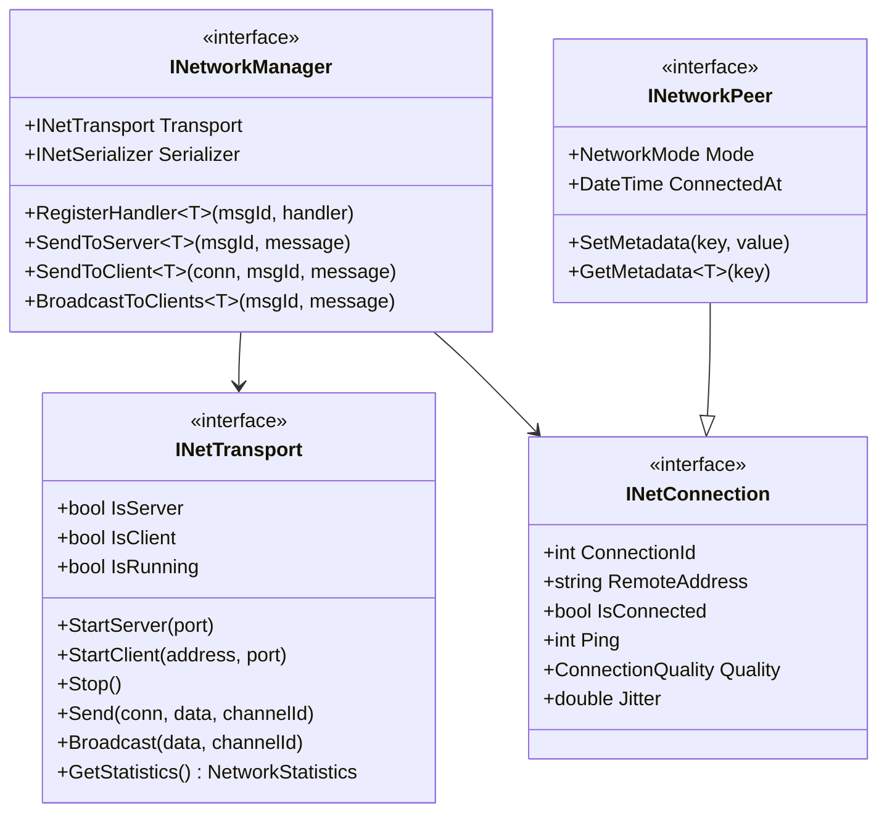
```mermaid
classDiagram
    class INetTransport {
        <<interface>>
        +bool IsServer
        +bool IsClient
        +bool IsRunning
        +StartServer(port)
        +StartClient(address, port)
        +Stop()
        +Send(conn, data, channelId)
        +Broadcast(data, channelId)
        +GetStatistics() NetworkStatistics
    }

    class INetworkManager {
        <<interface>>
        +INetTransport Transport
        +INetSerializer Serializer
        +RegisterHandler~T~(msgId, handler)
        +SendToServer~T~(msgId, message)
        +SendToClient~T~(conn, msgId, message)
        +BroadcastToClients~T~(msgId, message)
    }

    class INetConnection {
        <<interface>>
        +int ConnectionId
        +string RemoteAddress
        +bool IsConnected
        +int Ping
        +ConnectionQuality Quality
        +double Jitter
    }

    class INetworkPeer {
        <<interface>>
        +NetworkMode Mode
        +DateTime ConnectedAt
        +SetMetadata(key, value)
        +GetMetadata~T~(key)
    }

    INetworkPeer --|> INetConnection
    INetworkManager --> INetTransport
    INetworkManager --> INetConnection
```

| Enum                | Values                                                              | Purpose          |
| ------------------- | ------------------------------------------------------------------- | ---------------- |
| `NetworkMode`       | Offline, Client, Server, Host, ListenServer, DedicatedServer, Relay | Runtime mode     |
| `NetworkChannel`    | Reliable, Unreliable, ReliableUnordered, UnreliableSequenced        | Channel types    |
| `ConnectionQuality` | Excellent, Good, Fair, Poor, Disconnected                           | Connection grade |
| `TransportError`    | None, DnsResolve, Refused, Timeout, Congestion, ...                 | Error types      |

---

### 2. Buffer System

**Path**: `Runtime/Scripts/Buffers/`

Thread-safe, zero-allocation buffer pool for message serialization.

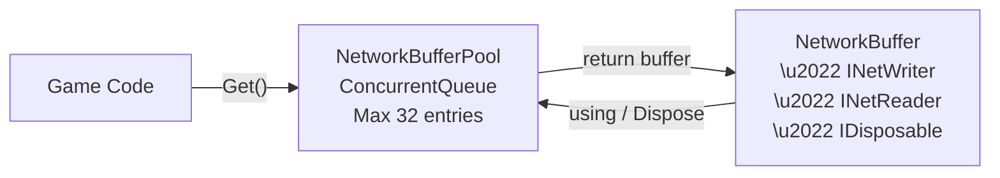
```mermaid
flowchart LR
    Code["Game Code"] -->|"Get()"| Pool["NetworkBufferPool</br>ConcurrentQueue</br>Max 32 entries"]
    Pool -->|"return buffer"| Buffer["NetworkBuffer</br>\u2022 INetWriter</br>\u2022 INetReader</br>\u2022 IDisposable"]
    Buffer -->|"using / Dispose"| Pool
```

```csharp
// Zero-allocation buffer usage
using (var buffer = NetworkBufferPool.Get())
{
    buffer.WriteInt(playerId);
    buffer.WriteFloat(health);
    buffer.WriteBlittable(position); // unmanaged types only

    var segment = buffer.ToArraySegment();
    transport.Send(conn, segment, channelId);
}
// Automatically returned to pool on Dispose
```

---

### 3. Service Locator

**Path**: `Runtime/Scripts/Services/`

Global access to the active `INetworkManager`.

```csharp
// Registration (usually automatic in adapter Awake)
NetServices.Register(myNetworkManager);

// Global access
var net = NetServices.Instance;

// Safe access
if (NetServices.IsAvailable)
    net.SendToServer(msgId, data);

// Unregister
NetServices.Unregister(myNetworkManager);
```

---

### 4. Serialization

**Path**: `Runtime/Scripts/Serialization/` + `Runtime/Scripts/Serializers/`

Pluggable serialization with conditional compilation.

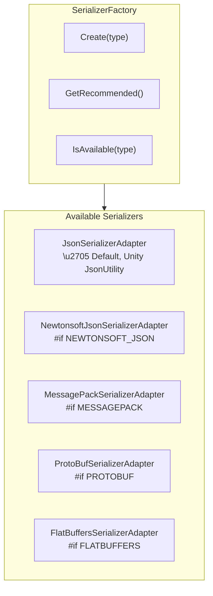
```mermaid
flowchart TB
    subgraph Factory["SerializerFactory"]
        Create["Create(type)"]
        GetRec["GetRecommended()"]
        IsAvail["IsAvailable(type)"]
    end

    subgraph Serializers["Available Serializers"]
        Json["JsonSerializerAdapter</br>\u2705 Default, Unity JsonUtility"]
        Newtonsoft["NewtonsoftJsonSerializerAdapter</br>#if NEWTONSOFT_JSON"]
        MsgPack["MessagePackSerializerAdapter</br>#if MESSAGEPACK"]
        ProtoBuf["ProtoBufSerializerAdapter</br>#if PROTOBUF"]
        FlatBuf["FlatBuffersSerializerAdapter</br>#if FLATBUFFERS"]
    end

    Factory --> Serializers
```

| Serializer      | Define Symbol     | Format | Recommended For    |
| --------------- | ----------------- | ------ | ------------------ |
| Json (Unity)    | _(default)_       | Text   | Dev/Debug          |
| Newtonsoft Json | `NEWTONSOFT_JSON` | Text   | Complex structures |
| MessagePack     | `MESSAGEPACK`     | Binary | **Production**     |
| ProtoBuf        | `PROTOBUF`        | Binary | Schema-driven      |
| FlatBuffers     | `FLATBUFFERS`     | Binary | Zero-copy perf     |

```csharp
// Get recommended serializer (priority: MessagePack > Newtonsoft > Json)
var serializer = SerializerFactory.GetRecommended();

// Or create specific
if (SerializerFactory.IsAvailable(SerializerType.MessagePack))
    serializer = SerializerFactory.Create(SerializerType.MessagePack);
```

---

### 5. Tick System

**Path**: `Runtime/Scripts/Simulation/`

Deterministic fixed-timestep tick driver — the foundation for prediction, lockstep, and rollback.

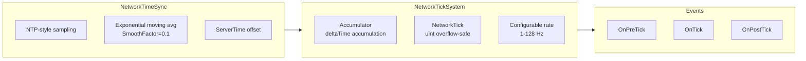
```mermaid
flowchart LR
    subgraph TickSystem["NetworkTickSystem"]
        Accumulator["Accumulator</br>deltaTime accumulation"]
        Tick["NetworkTick</br>uint overflow-safe"]
        Rate["Configurable rate</br>1-128 Hz"]
    end

    subgraph Events["Events"]
        PreTick["OnPreTick"]
        OnTick["OnTick"]
        PostTick["OnPostTick"]
    end

    subgraph TimeSync["NetworkTimeSync"]
        NTP["NTP-style sampling"]
        EMA["Exponential moving avg</br>SmoothFactor=0.1"]
        Offset["ServerTime offset"]
    end

    TickSystem --> Events
    TimeSync --> TickSystem
```

```csharp
// Create tick system (30 Hz)
var tickSystem = new NetworkTickSystem(30);

// Register tick callback
tickSystem.OnTick += tick =>
{
    SimulateGameplay(tick);
};

// Drive in Update (max 5 ticks/frame to prevent spiral-of-death)
void Update() => tickSystem.Update(Time.deltaTime);

// Time synchronization (NTP-style)
var timeSync = new NetworkTimeSync();
timeSync.ProcessTimeSample(clientSendTime, serverTime, clientReceiveTime);
double serverNow = timeSync.LocalToServerTime(Time.timeAsDouble);
```

---

### 6. Client Prediction

**Path**: `Runtime/Scripts/Prediction/`

Full **client-side prediction + server authority + rollback reconciliation** pipeline.

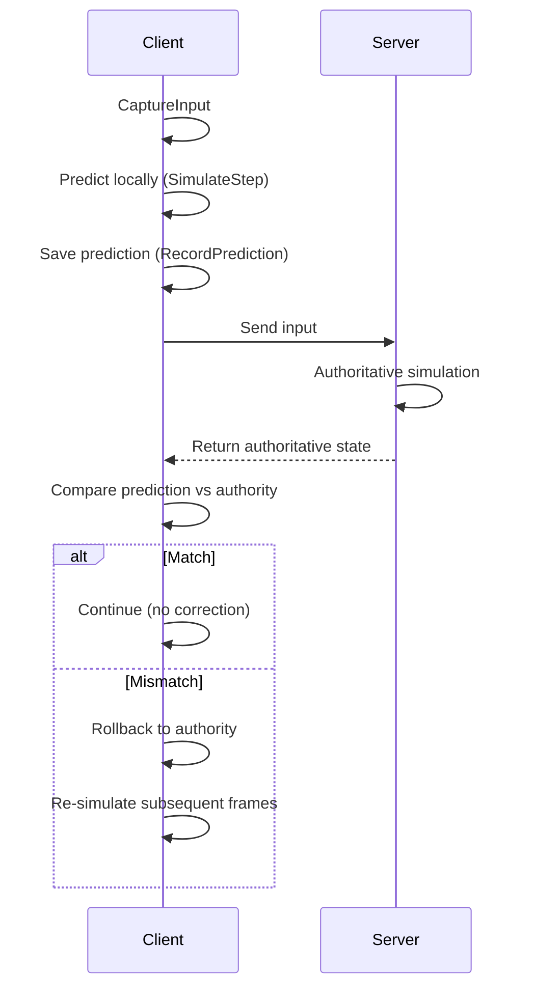
```mermaid
sequenceDiagram
    participant Client
    participant Server

    Client->>Client: CaptureInput
    Client->>Client: Predict locally (SimulateStep)
    Client->>Client: Save prediction (RecordPrediction)
    Client->>Server: Send input
    Server->>Server: Authoritative simulation
    Server-->>Client: Return authoritative state
    Client->>Client: Compare prediction vs authority
    alt Match
        Client->>Client: Continue (no correction)
    else Mismatch
        Client->>Client: Rollback to authority
        Client->>Client: Re-simulate subsequent frames
    end
```

```csharp
// ① Implement IPredictable
public class PlayerMovement : IPredictable<MoveInput, PlayerState>
{
    public MoveInput CaptureInput()
        => new MoveInput { Horizontal = Input.GetAxis("Horizontal") };

    public PlayerState CaptureState()
        => new PlayerState { X = transform.position.x };

    public void ApplyState(in PlayerState state)
        => transform.position = new Vector3(state.X, 0, 0);

    public void SimulateStep(in MoveInput input, float deltaTime)
        => transform.position += Vector3.right * input.Horizontal * deltaTime;

    public bool StatesMatch(in PlayerState a, in PlayerState b)
        => Mathf.Abs(a.X - b.X) < 0.01f;
}

// ② Use the prediction system
var prediction = new ClientPredictionSystem<MoveInput, PlayerState>(player, capacity: 128);
prediction.RecordPrediction(currentTick, deltaTime);
prediction.ProcessServerState(serverTick, serverState); // auto-rollback on mismatch
```

#### Snapshot Interpolation

Smooth display of remote entities:

```csharp
var interp = new SnapshotInterpolation<TransformSnapshot>(
    TransformSnapshot.Lerp, TransformSnapshot.GetTimestamp
);
interp.AddSnapshot(new TransformSnapshot
{
    Timestamp = serverTime,
    Position = pos,
    Rotation = rot
});
var result = interp.Update(currentTime);
transform.position = result.Position;
transform.rotation = result.Rotation;
```

#### Lag Compensation

Server-side historical hit detection:

```csharp
var lagComp = new LagCompensationBuffer(capacity: 128);
lagComp.Record(tick, position, rotation, bounds);

if (lagComp.HitTest(clientTick, shootRay, maxDist, out float hitDist))
    ConfirmHit();
```

---

### 7. Replication Infrastructure

**Path**: `Core/Replication/`

Builds per-connection replication work from pure C# snapshots. Gameplay systems provide observer/object data, the core evaluates interest and send budgets, and the send layer writes deterministic snapshot packets. This is the common foundation for MMO AOI, MOBA team visibility, shooter owner prediction, sandbox chunk replication, replay capture, and dedicated server simulation.

The replication layer is intentionally backend-neutral. It does not depend on Mirror, Mirage, Nakama, Unity `GameObject`, `MonoBehaviour`, `ScriptableObject`, PlayerSettings symbols, or a DI container. A project can construct the services directly, register them in its own DI container, or wrap them behind a game-specific server composition root.

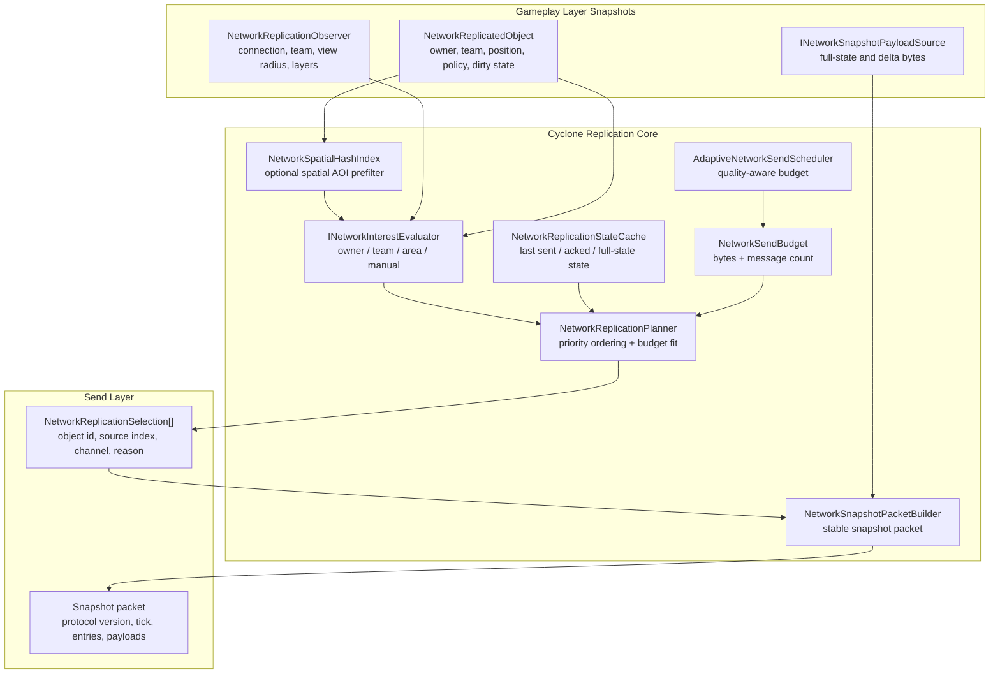
```mermaid
flowchart TB
    subgraph Inputs["Gameplay Layer Snapshots"]
        Observer["NetworkReplicationObserver</br>connection, team, view radius, layers"]
        Object["NetworkReplicatedObject</br>owner, team, position, policy, dirty state"]
        Payloads["INetworkSnapshotPayloadSource</br>full-state and delta bytes"]
    end

    subgraph Replication["Cyclone Replication Core"]
        Spatial["NetworkSpatialHashIndex</br>optional spatial AOI prefilter"]
        State["NetworkReplicationStateCache</br>last sent / acked / full-state state"]
        Evaluator["INetworkInterestEvaluator</br>owner / team / area / manual"]
        Planner["NetworkReplicationPlanner</br>priority ordering + budget fit"]
        Scheduler["AdaptiveNetworkSendScheduler</br>quality-aware budget"]
        Budget["NetworkSendBudget</br>bytes + message count"]
        Packet["NetworkSnapshotPacketBuilder</br>stable snapshot packet"]
    end

    subgraph Output["Send Layer"]
        Selection["NetworkReplicationSelection[]</br>object id, source index, channel, reason"]
        Snapshot["Snapshot packet</br>protocol version, tick, entries, payloads"]
    end

    Object --> Spatial
    Spatial --> Evaluator
    Observer --> Evaluator
    Object --> Evaluator
    Evaluator --> Planner
    State --> Planner
    Scheduler --> Budget
    Budget --> Planner
    Planner --> Selection
    Selection --> Packet
    Payloads --> Packet
    Packet --> Snapshot
```

#### Planning and Interest

`NetworkReplicationPlanner` is the deterministic selector. It receives a single observer, a span of `NetworkReplicatedObject` snapshots, a server tick, a mutable `NetworkSendBudget`, and a caller-owned output span. It filters objects through `INetworkInterestEvaluator`, orders them by score, and writes only the entries that fit the byte and message budget.

```csharp
using CycloneGames.Networking.Replication;

var observer = new NetworkReplicationObserver(
    connectionId: 10,
    playerId: 1001,
    teamId: 2,
    position: playerPosition,
    viewRadius: 80f);

var objects = new[]
{
    new NetworkReplicatedObject(
        objectId: 5001,
        policy: NetworkReplicationPolicy.OwnerOrArea(80f),
        position: actorPosition,
        ownerConnectionId: 10,
        isDirty: true,
        estimatedPayloadBytes: 96)
};

var planner = new NetworkReplicationPlanner();
var budget = new NetworkSendBudget(maxBytes: 4096, maxMessages: 64);
var selections = new NetworkReplicationSelection[128];

int count = planner.BuildPlan(observer, objects, serverTick, ref budget, selections);
for (int i = 0; i < count; i++)
{
    NetworkReplicationSelection selection = selections[i];
    // Use selection.SourceIndex to fetch the source object and write the payload.
}
```

Use `NetworkReplicationPolicy` for common visibility rules:

| Policy | Best For |
| --- | --- |
| `OwnerOnly` | Player-owned inventory, private prediction state, local-only authoritative corrections |
| `OwnerOrArea(radius)` | Shooter characters, projectiles, vehicles, interactable props |
| `Team(radius)` | MOBA and team shooter allies, shared squad information |
| `Area(radius)` | MMO actors, sandbox chunks, public world props |
| `Manual` | Quest phases, stealth/reveal systems, streaming volumes, custom shard rules |

For large worlds, use `NetworkSpatialHashIndex` as a prefilter before planning. The index supports XZ, XY, and XYZ cell modes, layer masks, update/removal by object id, and caller-owned query buffers. Query does not allocate when the index has already been built.

```csharp
var index = new NetworkSpatialHashIndex(cellSize: 32f);
for (int i = 0; i < objects.Length; i++)
{
    NetworkReplicatedObject obj = objects[i];
    index.Upsert(obj.ObjectId, i, obj.Position, obj.InterestLayerMask);
}

Span<NetworkSpatialQueryResult> nearby = stackalloc NetworkSpatialQueryResult[256];
int nearbyCount = index.Query(
    observer.Position,
    observer.ViewRadius,
    observer.InterestLayerMask,
    nearby);
```

#### State Cache and Snapshot Packets

`NetworkReplicationStateCache` stores per-connection object state: last sent tick, last full-state tick, last acked tick, last payload hash, payload size, sequence, and whether a full state is required. It lets the replication layer make different decisions for a reconnecting player, a newly observed object, and a stable object that only needs deltas.

```csharp
var stateCache = new NetworkReplicationStateCache(capacity: 65536);
NetworkReplicatedObject source = objects[sourceIndex];
NetworkReplicatedObject perConnectionObject = stateCache.ApplyState(
    observer.ConnectionId,
    source);

stateCache.MarkSent(
    observer.ConnectionId,
    source.ObjectId,
    serverTick,
    fullState: perConnectionObject.RequiresFullState,
    payloadBytes: 96,
    payloadHash: payloadHash,
    sequence: sequence);
```

`NetworkSnapshotPacketBuilder` writes a stable packet format for the selected objects. The builder does not know gameplay serialization. Instead, `INetworkSnapshotPayloadSource` supplies full-state or delta payload size, hash, and bytes. This keeps GameplayAbilities, GameplayTags, GameplayFramework, RPGFoundation, or third-party gameplay packages independent from the transport and packet writer.

```csharp
var packetBuilder = new NetworkSnapshotPacketBuilder();
NetworkSnapshotWriteResult result = packetBuilder.WriteSnapshot(
    selections.AsSpan(0, count),
    serverTick,
    payloadSource,
    writer);
```

Snapshot packets start with a protocol version byte, server tick, entry count, and then per-object entries containing object id, full/delta flags, channel, payload length, and payload bytes. The result reports object counts, full/delta split, bytes written, and an aggregate payload hash for diagnostics and replay validation.

#### Adaptive Scheduling and Load Simulation

`AdaptiveNetworkSendScheduler` implements `IAdaptiveSendRate` and converts connection quality plus transport statistics into target send interval and `NetworkSendBudget`. Poor links receive smaller budgets and longer intervals. Disconnected links receive a zero byte/message budget so upper layers stop scheduling work for them.

```csharp
var scheduler = new AdaptiveNetworkSendScheduler();
scheduler.Update(connectionId, transportStats, quality, deltaTime);

NetworkSendBudget budget = scheduler.CreateSendBudget(connectionId);
int count = planner.BuildPlan(observer, objects, serverTick, ref budget, selections);
```

`NetworkReplicationLoadSimulator` is a deterministic design-time stress harness. It does not replace soak tests on real servers, but it is useful for checking how planner budgets behave when object count, connection count, view radius, dirty ratio, and world size change.

```csharp
var simulator = new NetworkReplicationLoadSimulator();
var result = simulator.Run(new NetworkReplicationLoadSimulationOptions(
    connectionCount: 1000,
    objectCount: 20000,
    tickCount: 120,
    worldSize: 4000f,
    viewRadius: 120f,
    dirtyRatio: 0.35f,
    budgetBytes: 4096,
    budgetMessages: 64,
    resultCapacity: 256,
    seed: 42u));
```

#### Performance and Platform Notes

- Runtime hot paths use caller-owned arrays/spans for planning, spatial query results, and snapshot writing. Preallocate these buffers per worker, room, shard, or replication lane.
- `NetworkSpatialHashIndex` allocates when new cells are created. Build and update it as part of server world indexing, not inside every per-connection planning call.
- `NetworkReplicationStateCache` uses managed dictionaries and is suitable for Unity, headless .NET servers, and tests. Large MMO shards should own one cache per replication world, zone, or shard and remove connection/object state aggressively on disconnect/despawn.
- `NetworkSnapshotPacketBuilder` is serializer-agnostic. Payload sources should use existing serializers or gameplay package serializers and should avoid temporary arrays in high-frequency snapshot paths.
- The core stores positions in `NetworkVector3` and uses deterministic ids and primitive data. It is portable across Windows, Linux, macOS, iOS, Android, WebGL, and console builds when the selected transport/backend supports that platform.
- The module writes no files, stores no PlayerSettings symbols, and creates no hidden global preferences. Load simulation is an in-memory validation utility.

---

### 8. State Synchronization

**Path**: `Runtime/Scripts/StateSync/`

Automatic dirty tracking and change synchronization.

```csharp
// Value-type variable (zero-GC, T : unmanaged, IEquatable<T>)
var health = new NetworkVariable<int>(100);
health.Value = 80; // auto-marks dirty, fires OnChanged

health.OnChanged += (oldVal, newVal) =>
    Debug.Log($"Health: {oldVal} → {newVal}");

// Managed-type variable
var name = new NetworkVariableManaged<string>("Player1", serializer);

// Variable set (up to 64 variables, bit-mask dirty tracking)
var varSet = new NetworkVariableSet();
varSet.Register(health);
if (varSet.IsAnyDirty)
{
    varSet.WriteDirty(writer);
    varSet.ClearAllDirty();
}
```

---

### 9. Remote Procedure Calls

**Path**: `Runtime/Scripts/Rpc/`

Attribute-based RPC system.

```csharp
[ServerRpc(requiresOwnership: true)]
void CmdAttack(int targetId) { /* runs on server */ }

[ClientRpc(target: RpcTarget.AllClients)]
void RpcDamaged(int damage) { /* runs on all clients */ }

// Processor-based usage
var rpc = new RpcProcessor(networkManager);
rpc.Register<DamageMsg>(1, OnDamageReceived);
rpc.Send(1, new DamageMsg { TargetId = 5, Amount = 20 }, RpcTarget.AllClients);
```

`RpcTarget` options: `Server`, `Owner`, `AllClients`, `Observers`, `AllExceptOwner`, `AllExceptSender`.

---

### 10. Lockstep & Deterministic Simulation

**Path**: `Runtime/Scripts/Lockstep/`

Full deterministic lockstep and GGPO-style rollback.

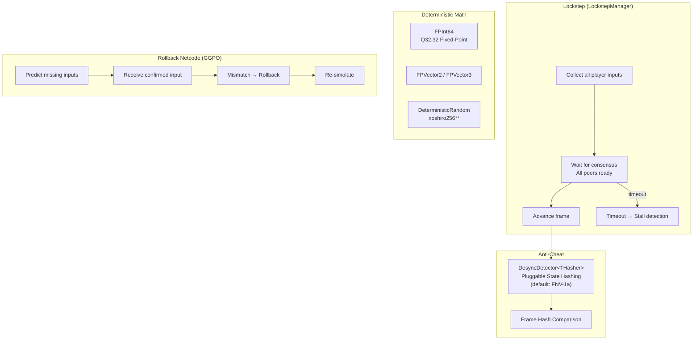
```mermaid
flowchart TB
    subgraph Lockstep["Lockstep (LockstepManager)"]
        Input["Collect all player inputs"]
        Wait["Wait for consensus</br>All peers ready"]
        Advance["Advance frame"]
        Stall["Timeout → Stall detection"]
    end

    subgraph Deterministic["Deterministic Math"]
        FP["FPInt64</br>Q32.32 Fixed-Point"]
        Vec["FPVector2 / FPVector3"]
        Rand["DeterministicRandom</br>xoshiro256**"]
    end

    subgraph Desync["Anti-Cheat"]
        Hash["DesyncDetector&lt;THasher&gt;</br>Pluggable State Hashing</br>(default: FNV-1a)"]
        Compare["Frame Hash Comparison"]
    end

    subgraph RB["Rollback Netcode (GGPO)"]
        Predict["Predict missing inputs"]
        Confirm["Receive confirmed input"]
        Roll["Mismatch → Rollback"]
        Resim["Re-simulate"]
    end

    Input --> Wait --> Advance
    Wait -->|"timeout"| Stall
    Advance --> Hash --> Compare
    Predict --> Confirm --> Roll --> Resim
```

#### Lockstep Example

```csharp
var lockstep = new LockstepManager<GameInput>(
    peerCount: 2, localPeerId: 0, inputDelay: 2
);

lockstep.OnSimulateFrame += (frame, inputs) =>
{
    foreach (var (peerId, input) in inputs)
        SimulatePlayer(peerId, input);
};

void FixedUpdate()
{
    lockstep.SubmitLocalInput(CaptureInput());
    lockstep.Tick(); // advances when all inputs received
}
```

#### Fixed-Point Math

Cross-platform deterministic calculations (floating-point varies across CPU architectures):

```csharp
FPInt64 a = FPInt64.FromFloat(3.14f);
FPInt64 b = FPInt64.FromInt(2);
FPInt64 c = a * b; // exact multiplication (no float drift)

var v = new FPVector3(FPInt64.FromFloat(1f), FPInt64.Zero, FPInt64.Zero);
FPInt64 len = FPVector3.Distance(v, FPVector3.Zero);

// Deterministic RNG (same seed → same results on all clients)
var rng = new DeterministicRandom(seed: 12345);
int roll = rng.NextInt(1, 7);
```

#### GGPO-Style Rollback

```csharp
public class MySimulation : IRollbackSimulation<GameInput, GameState>
{
    public GameInput PredictInput(int frame) => default;
    public GameState SaveState() => currentState;
    public void LoadState(in GameState state) => currentState = state;
    public void Simulate(in GameInput input) { /* one frame */ }
    public void OnRollback(int fromFrame, int toFrame) => Debug.Log("Rollback!");
}

var rollback = new RollbackNetcode<GameInput, GameState>(simulation, maxRollbackFrames: 8);
rollback.AdvanceFrame(localInput);
rollback.ReceiveConfirmedInput(frame, confirmedInput); // auto-rollback if mismatch
```

---

### 11. Security

**Path**: `Runtime/Scripts/Security/`

```csharp
// Token-bucket rate limiter
var limiter = new RateLimiter(maxMessagesPerSecond: 60, maxBytesPerSecond: 32768, burstLimit: 10);
if (!limiter.TryConsume(connectionId, messageSize))
    return; // over limit

// Message validator
var validator = new MessageValidator(maxPayloadSize: 1024, maxMessageId: 9999);
var result = validator.Validate(msgId, payloadSize);
if (result != ValidationResult.Valid)
    Debug.LogWarning($"Invalid message: {result}");
```

---

### 12. Session Resilience

**Path**: `Core/Session/`

Provides backend-neutral room discovery, matchmaking planning, reconnection reservations, and host migration coordination. Steam lobbies, LAN discovery, Nakama matches, custom master servers, relay rooms, and dedicated server fleets should all feed the same core descriptors instead of leaking backend-specific types into gameplay code.

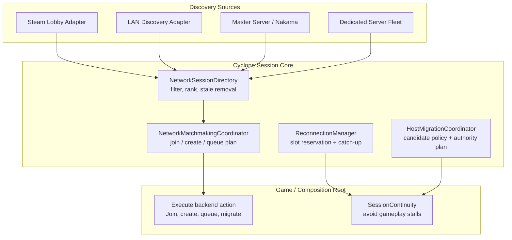
```mermaid
flowchart TB
    subgraph Sources["Discovery Sources"]
        Steam["Steam Lobby Adapter"]
        Lan["LAN Discovery Adapter"]
        Backend["Master Server / Nakama"]
        Fleet["Dedicated Server Fleet"]
    end

    subgraph CoreSession["Cyclone Session Core"]
        Directory["NetworkSessionDirectory</br>filter, rank, stale removal"]
        MatchPlan["NetworkMatchmakingCoordinator</br>join / create / queue plan"]
        Reconnect["ReconnectionManager</br>slot reservation + catch-up"]
        Migration["HostMigrationCoordinator</br>candidate policy + authority plan"]
    end

    subgraph Game["Game / Composition Root"]
        Execute["Execute backend action</br>Join, create, queue, migrate"]
        Continue["SessionContinuity</br>avoid gameplay stalls"]
    end

    Steam --> Directory
    Lan --> Directory
    Backend --> Directory
    Fleet --> Directory
    Directory --> MatchPlan
    MatchPlan --> Execute
    Reconnect --> Continue
    Migration --> Continue
```

#### Room Search and Matchmaking

`NetworkSessionDirectory` stores backend-neutral `NetworkSessionDescriptor` entries. It can rank rooms from Steam, LAN, relay, backend matchmaking, or dedicated server fleets with the same filter rules: game mode, map, region, build id, capacity, ping, privacy, connectivity, host-migration support, reconnection support, skill band, and custom properties such as mod hash or ruleset hash.

```csharp
var directory = new NetworkSessionDirectory();
directory.Upsert(new NetworkSessionDescriptor(
    sessionId: "steam-lobby-123",
    name: "Night Run",
    gameMode: "roguelike",
    currentPlayers: 3,
    maxPlayers: 8,
    map: "graveyard",
    region: "asia",
    buildId: "live-2026-06",
    pingMs: 42,
    supportsHostMigration: true,
    supportsReconnection: true,
    connectivity: NetworkSessionConnectivity.PlatformLobby | NetworkSessionConnectivity.Relay,
    source: NetworkSessionDiscoverySource.Platform));

var criteria = new NetworkSessionSearchCriteria
{
    GameMode = "roguelike",
    Region = "asia",
    BuildId = "live-2026-06",
    MinOpenSlots = 1,
    RequireHostMigration = true,
    RequireReconnection = true
};

var results = new List<NetworkSessionDescriptor>(32);
int count = directory.Search(criteria, results);
```

`NetworkMatchmakingCoordinator` does not call any backend directly. It returns a plan: join the best compatible room, create a new room, enter a queue, or do nothing. Steam, LAN, Nakama, or a custom service can execute that plan in their own adapter.

```csharp
var matchmaking = new NetworkMatchmakingCoordinator();
NetworkMatchmakingPlan plan = matchmaking.BuildPlan(
    directory,
    criteria,
    NetworkMatchmakingOptions.Default);

switch (plan.Action)
{
    case NetworkMatchmakingPlanAction.JoinSession:
        // Adapter joins plan.SelectedSession.
        break;
    case NetworkMatchmakingPlanAction.CreateSession:
        // Adapter creates a room using the same criteria.
        break;
    case NetworkMatchmakingPlanAction.EnterQueue:
        // Adapter enters backend matchmaking.
        break;
}
```

#### Reconnection and Host Migration

`ReconnectionManager` reserves a disconnected player's slot for a bounded window, validates reconnect tokens, and optionally runs `IStateCatchUp` before the player returns to gameplay. This prevents ordinary client disconnects from freezing the session.

```csharp
var reconnect = new ReconnectionManager(myStateCatchUpImpl);
reconnect.ReconnectWindow = 300f; // 5-minute window

reconnect.OnClientReconnected += (originalConnectionId, newConnection) =>
    Debug.Log($"Player reconnected. originalId={originalConnectionId}, newConn={newConnection.ConnectionId}");

reconnect.OnReconnectWindowExpired += originalConnectionId =>
    Debug.Log($"Reservation expired for {originalConnectionId}");
```

`HostMigrationCoordinator` is the generic host-failover layer for listen-server, P2P, relay-coordinated, or server-node authority transfer. It tracks candidates and emits a `NetworkAuthorityTransferPlan` instead of performing backend-specific operations itself.

```csharp
var migration = new HostMigrationCoordinator("room-123");
migration.UpsertParticipant(new NetworkHostParticipant(
    connectionId: 1,
    playerId: 1001,
    isConnected: false,
    canHost: true,
    authorityRank: 100));
migration.UpsertParticipant(new NetworkHostParticipant(
    connectionId: 2,
    playerId: 1002,
    isConnected: true,
    canHost: true,
    authorityRank: 50,
    kind: NetworkHostCandidateKind.PlayerListenServer,
    pingMs: 24,
    lastConfirmedTick: new NetworkTickId(1200)));

migration.SetCurrentHost(1, 1001);
if (migration.TryBeginMigration(
        HostMigrationReason.HostDisconnected,
        new NetworkTickId(1201),
        out NetworkAuthorityTransferPlan transfer))
{
    // Transfer session owner, simulation authority, spawn authority,
    // object authority, scene authority, match state, and RNG authority.
}
```

The default candidate policy is intentionally generic: authority rank first, then host kind, last confirmed tick, capacity/hardware score, packet loss, ping, join time, and connection id. A small Steam co-op game can use player listen-server candidates; a 100-player room can prefer relay or server candidates; a 10,000-player regional world should use dedicated server or shard candidates rather than client-host migration.

Interfaces and core services: `ILobbyManager`, `IMatchmaker`, `IHostMigration`, `IReconnectionManager`, `NetworkSessionDirectory`, `NetworkMatchmakingCoordinator`, `HostMigrationCoordinator`, `IHostCandidatePolicy`.

---

### 13. Replay System

**Path**: `Runtime/Scripts/Replay/`

```csharp
// Recording
var recorder = new ReplayRecorder(keyframeInterval: 300);
recorder.StartRecording();
recorder.RecordFrame(tick, inputData);
recorder.RecordKeyframe(tick, fullState);
recorder.StopRecording();

// Playback
var player = new ReplayPlayer(recorder.GetAllFrames());
player.Play();
player.SetSpeed(2.0f);
player.Seek(targetTick);
player.Pause();

// Spectator mode (with delay)
var spectator = new SpectatorManager(delayTicks: 90); // 3s delay @30Hz
```

---

### 14. Network Spawning

**Path**: `Runtime/Scripts/Spawning/`

```csharp
var spawnManager = new NetworkSpawnManager(networkManager);
spawnManager.Spawn(prefabId: 1, position, rotation, ownerConnectionId);

spawnManager.OnSpawned += obj =>
    Debug.Log($"Spawned: NetworkId={obj.NetworkId}");

spawnManager.TransferOwnership(networkId, newOwnerConnectionId);
```

---

### 15. Scene Management

**Path**: `Runtime/Scripts/Scene/`

```csharp
var sceneManager = new NetworkSceneManager(networkManager);

sceneManager.ServerLoadScene("BattleArena");
sceneManager.ServerLoadScene("Dungeon_01", additive: true);
sceneManager.ServerLoadSceneForConnections("PrivateDungeon", new[] { conn1, conn2 });

sceneManager.OnSceneLoaded += sceneName => Debug.Log($"Loaded: {sceneName}");
```

---

### 16. Compression

**Path**: `Runtime/Scripts/Compression/`

```csharp
// Vector3 quantization (ZigZag + variable-length integer encoding)
var qv = QuantizedVector3.FromVector3(transform.position, precision: 100);
qv.WriteTo(writer);
Vector3 pos = QuantizedVector3.ReadFrom(reader).ToVector3(precision: 100);

// Quaternion smallest-three compression (4 bytes, 10 bits per component)
var qq = QuantizedQuaternion.FromQuaternion(transform.rotation);
```

---

### 17. Diagnostics

**Path**: `Runtime/Scripts/Diagnostics/`

```csharp
// Network profiler
var profiler = new NetworkProfiler();
profiler.RecordSend(msgId, byteCount);
profiler.Update(deltaTime);

var snapshot = profiler.TakeSnapshot();
Debug.Log($"Upload: {snapshot.BytesSentPerSecond} B/s");
Debug.Log($"Download: {snapshot.BytesReceivedPerSecond} B/s");

// Per-message-type stats
var stats = profiler.GetMessageStats(msgId);

// Network condition simulator (for testing)
var simulator = new NetworkConditionSimulator(realTransport);
simulator.ApplyPreset(NetworkConditionSimulator.Preset.Mobile4G);
// Presets: LAN, Broadband, WiFi, Mobile4G, Mobile3G, Satellite, Terrible

simulator.LatencyMs = 150;
simulator.JitterMs = 30;
simulator.PacketLossPercent = 5f;
simulator.Enabled = true;
```

---

### 18. Gameplay Abilities Integration

**Path**: 📦 **Separate Package** — `CycloneGames.GameplayAbilities.Networking` (sibling directory)  
**Asmdef**: `CycloneGames.GameplayAbilities.Networking.Core` / `CycloneGames.GameplayAbilities.Networking.Unity.Runtime`  
**Reference**: `CycloneGames.Networking.Core`  
**Namespace**: `CycloneGames.GameplayAbilities.Networking`

> **Package structure**: This module is split into two layers.
>
> - `CycloneGames.GameplayAbilities.Networking.Core` — Protocol and bridge layer: message IDs, `IAbilityNetAdapter`, `NetworkedAbilityBridge`, serializers, state checksums, and security policies.
> - `CycloneGames.GameplayAbilities.Networking.Unity.Runtime` — Mainline GAS integration for `CycloneGames.GameplayAbilities`: ASC adapter, refined effect delta replication, full-state snapshot wiring, and security helpers.

Deep integration with `CycloneGames.GameplayAbilities` for networked abilities, effects, and attributes.

> Current package note: GAS networking lives in `CycloneGames.GameplayAbilities.Networking`. Add the Core assembly for pure protocol usage and the Unity.Runtime assembly when wiring `AbilitySystemComponent`.

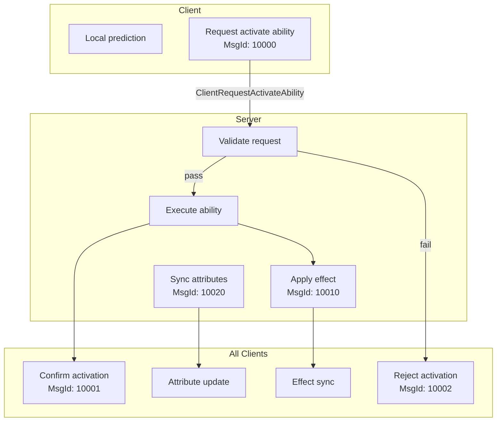
```mermaid
flowchart TB
    subgraph Client["Client"]
        PredictLocal["Local prediction"]
        Request["Request activate ability</br>MsgId: 10000"]
    end

    subgraph Server["Server"]
        Validate["Validate request"]
        Execute["Execute ability"]
        ApplyEffect["Apply effect</br>MsgId: 10010"]
        SyncAttr["Sync attributes</br>MsgId: 10020"]
    end

    subgraph Clients["All Clients"]
        Confirm["Confirm activation</br>MsgId: 10001"]
        Reject["Reject activation</br>MsgId: 10002"]
        EffectSync["Effect sync"]
        AttrUpdate["Attribute update"]
    end

    Request -->|"ClientRequestActivateAbility"| Validate
    Validate -->|"pass"| Execute
    Validate -->|"fail"| Reject
    Execute --> Confirm
    Execute --> ApplyEffect
    ApplyEffect --> EffectSync
    SyncAttr --> AttrUpdate
```

```csharp
using CycloneGames.GameplayAbilities.Networking; // 📦 Required: GAS protocol package
using CycloneGames.GameplayAbilities.Networking.Unity.Runtime; // 📦 Mainline GameplayAbilities integration

var bridge = new NetworkedAbilityBridge(networkManager);
var adapter = bridge.RegisterGameplayAbilitiesASC(myAsc, networkId, ownerConnectionId, idRegistry);

// Optional: customize authorization for full-state requests (default: owner-only)
bridge.FullStateRequestAuthorizer = (sender, targetId) => sender.ConnectionId == ownerConnectionId;

// Recommended production policy: owner or current observer only
bridge.FullStateRequestAuthorizer = (sender, targetId) =>
{
    if (TryGetAscOwnerConnectionId(targetId, out int ascOwnerId) && sender.ConnectionId == ascOwnerId)
        return true;

    var observers = GetObservers(targetId);
    if (observers == null) return false;

    for (int i = 0; i < observers.Count; i++)
    {
        if (observers[i].ConnectionId == sender.ConnectionId)
            return true;
    }

    return false;
};

// Client: request ability activation
bridge.ClientRequestActivateAbility(
    abilityIndex: 1001,
    predictionKey: key,
    targetPos: targetPos,
    direction: direction,
    targetNetworkId: targetId
);

// Attribute sync
var attrSync = new AttributeSyncManager(bridge);
attrSync.RegisterPublicAttribute(healthAttrId);
attrSync.MarkDirty(networkId, healthAttrId, baseValue: 100f, currentValue: 75f);
attrSync.FlushDirty(getOwnerConnectionId: GetOwnerConnectionId, getObservers: GetObservers, getConnectionById: GetConnectionById);

// Mainline GAS delta replication
bridge.ReplicatePendingState(adapter, GetObservers);

// Reconnect or late join
bridge.SendGameplayAbilitiesFullState(adapter, clientConnection);
```

Production hardening recommendations (commonly used):

1. Rate-limit full-state requests per connection (for example, 1 request per 2-5 seconds).
2. Audit denied requests with sender, targetId, and reason.
3. Return redacted snapshots for observers (hide private attributes/effects).

```csharp
var fullStateLimiter = new TokenBucketRateLimiter(capacity: 2, refillPerSecond: 0.5f);

bridge.FullStateRequestAuthorizer = (sender, targetId) =>
{
    if (!fullStateLimiter.TryConsume(sender.ConnectionId, 1))
    {
        AuditSecurity("GAS.FullState.RateLimited", sender.ConnectionId, targetId);
        return false;
    }

    bool isOwner = TryGetAscOwnerConnectionId(targetId, out int ownerId) && sender.ConnectionId == ownerId;
    bool isObserver = IsObserver(sender.ConnectionId, targetId);
    bool allowed = isOwner || isObserver;

    if (!allowed)
        AuditSecurity("GAS.FullState.Unauthorized", sender.ConnectionId, targetId);

    return allowed;
};

// In your ASC implementation: return full snapshot for owner, redacted snapshot for observers.
```

| Message ID Range | Purpose                                            |
| ---------------- | -------------------------------------------------- |
| 10000-10004      | Ability activate / confirm / reject / end / cancel |
| 10010-10013      | Effect applied / removed / stack changed / update  |
| 10020            | Attribute update                                   |
| 10040-10041      | Full state snapshot                                |

---

### 19. Authentication

**Path**: `Runtime/Scripts/Authentication/`

```csharp
public class MyAuthenticator : INetAuthenticator
{
    public void OnClientAuthenticate(INetConnection conn, ReadOnlySpan<byte> authData)
    {
        if (ValidateToken(authData))
            AcceptClient(conn);
        else
            RejectClient(conn, "Invalid token");
    }

    public void OnServerAuthenticate(INetConnection conn, ReadOnlySpan<byte> authData)
    {
        // Server-side authentication logic
    }
}
```

---

### 20. Platform Configuration

**Path**: `Runtime/Scripts/Platform/`

Auto-adjusts networking parameters per target platform.

```csharp
var config = NetworkPlatformConfig.GetForCurrentPlatform();
// Or manually: NetworkPlatformConfig.Android(), .PlayStation(), .WebGL(), etc.
```

| Platform | MTU  | Max Connections | IPv6 | WebSocket | Encryption |
| -------- | ---- | --------------- | ---- | --------- | ---------- |
| Windows  | 1200 | 200             | ✅   | ❌        | ❌         |
| WebGL    | 1200 | 1               | ❌   | ✅        | ❌         |
| iOS      | 1200 | 8               | ✅   | ❌        | ❌         |
| Android  | 1200 | 8               | ✅   | ❌        | ❌         |
| PS4/PS5  | 1200 | 100             | ✅   | ❌        | ✅         |
| Xbox     | 1200 | 100             | ✅   | ❌        | ✅         |
| Switch   | 1200 | 16              | ✅   | ❌        | ❌         |

---

### 21. Transport Adapters

**Path**: `Runtime/Scripts/Adapters/`

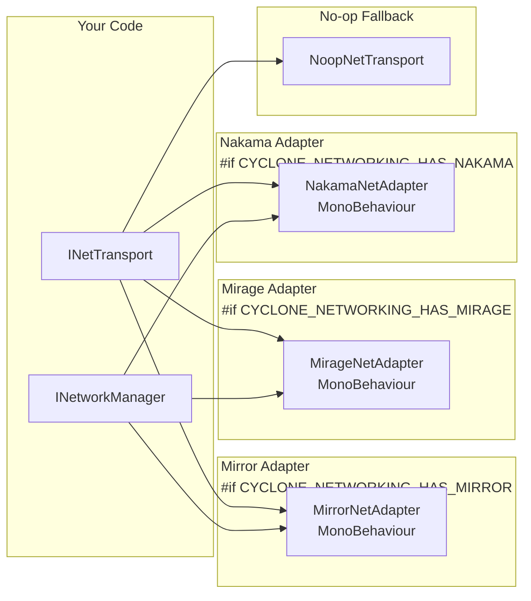
```mermaid
flowchart LR
    subgraph YourCode["Your Code"]
        INetTransport2["INetTransport"]
        INetworkManager2["INetworkManager"]
    end

    subgraph MirrorAdapter["Mirror Adapter</br>#if CYCLONE_NETWORKING_HAS_MIRROR"]
        MirrorNet["MirrorNetAdapter</br>MonoBehaviour"]
    end

    subgraph MirageAdapter["Mirage Adapter</br>#if CYCLONE_NETWORKING_HAS_MIRAGE"]
        MirageNet["MirageNetAdapter</br>MonoBehaviour"]
    end

    subgraph NakamaAdapter["Nakama Adapter</br>#if CYCLONE_NETWORKING_HAS_NAKAMA"]
        NakamaNet["NakamaNetAdapter</br>MonoBehaviour"]
    end

    subgraph NoopAdapter["No-op Fallback"]
        Noop["NoopNetTransport"]
    end

    INetTransport2 --> MirrorNet
    INetTransport2 --> MirageNet
    INetTransport2 --> NakamaNet
    INetTransport2 --> Noop
    INetworkManager2 --> MirrorNet
    INetworkManager2 --> MirageNet
    INetworkManager2 --> NakamaNet
```

| Adapter            | Define Symbol                         | Package Resource             | Description                              |
| ------------------ | ------------------------------------- | ---------------------------- | ---------------------------------------- |
| `MirrorNetAdapter` | `CYCLONE_NETWORKING_HAS_MIRROR`       | `com.mirror-networking.mirror` | Mirror transport + manager adapter     |
| `MirageNetAdapter` | `CYCLONE_NETWORKING_HAS_MIRAGE`       | `com.miragenet.mirage`       | Mirage transport + manager adapter       |
| `NakamaNetAdapter` | `CYCLONE_NETWORKING_HAS_NAKAMA`       | `com.heroiclabs.nakama-unity` | Nakama session, match, and socket adapter |
| `NoopNetTransport` | _(always)_                            | _(none)_                     | No-op fallback for testing               |

Unity `versionDefines` are driven by packages resolved through Unity Package Manager. A package folder copied beside the repository does not enable these symbols unless it is referenced from `UnityStarter/Packages/manifest.json`, embedded under `UnityStarter/Packages/`, or otherwise imported as a Unity package.

Mirror and Mirage adapters implement `INetTransport` and `INetworkManager` simultaneously and register themselves with `NetServices` on `Awake`. The Nakama adapter exposes the same CycloneGames runtime contracts for Nakama-backed client sessions and match state.

---

### 22. Profiles, Capabilities, and Protocol Manifests

**Path**: `Core/Profile/`

This module is the project-side extension point for avoiding hard-coded Cyclone core changes. Built-in constants and enums remain useful defaults and stable status codes, but production projects should place scale targets, backend capabilities, and project message ownership in profiles, capability descriptors, and manifests owned by the project.

`NetworkRuntimeProfile` centralizes product tuning values such as connection limits, tick/send rates, payload sizes, buffer sizes, session search limits, reconnect windows, and host migration windows. It also supports project-defined integer, float, and string settings for values Cyclone cannot predict.

```csharp
NetworkRuntimeProfile profile = NetworkRuntimeProfiles.CreateDefaultBuilder()
    .SetInt("project.max_zone_players", 10000)
    .SetFloat("project.snapshot_jitter_buffer_seconds", 0.15f)
    .SetString("project.deployment", "regional-shard")
    .Build();

runtimeContextBuilder.AddRuntimeProfile(profile);
```

`NetworkNodeCapabilities` describes what a client host, relay, shard, gateway, or dedicated server node can actually do. Capability ids are string-backed, so a project can add Steam, LAN, console network, cloud, shard, persistence, anti-cheat, or modding capabilities without changing Cyclone enums.

```csharp
NetworkCapabilityId zoneLease = new NetworkCapabilityId("project.zone_lease");

NetworkNodeCapabilities node = new NetworkNodeCapabilitiesBuilder
{
    NodeId = "us-east-zone-17",
    Region = "us-east",
    Platform = "linux-headless",
    MaxConnections = 10000,
    MaxPayloadBytes = 1200,
    CpuScore = 92,
    MemoryScore = 88,
}
.Add(NetworkCapabilityIds.DedicatedServer, level: 2, score: 40d)
.Add(NetworkCapabilityIds.Sharding, level: 3, score: 50d)
.Add(zoneLease, level: 1, score: 20d)
.Build();

NetworkCapabilityQuery query = new NetworkCapabilityQuery
{
    Region = "us-east",
    MinimumConnections = 5000,
}
.Require(NetworkCapabilityIds.DedicatedServer)
.Prefer(zoneLease);

bool canHost = NetworkNodeCapabilityMatcher.Matches(node, query);
```

`NetworkProtocolManifest` lets a package or game project declare message ranges, protocol versions, message descriptors, schema metadata, and catalog registration in one place. Cyclone-owned modules should register module ranges; project gameplay protocols should use user ranges and live in project assemblies.

```csharp
NetworkProtocolManifest manifest = new NetworkProtocolManifestBuilder(
        owner: "Project.Gameplay",
        minMessageId: 30000,
        maxMessageId: 30999,
        kind: NetworkMessageKind.User)
    .AddMessage<PlayerInputMessage>(30000, NetworkChannel.UnreliableSequenced, maxPayloadSize: 96)
    .AddMessage<InventoryCommandMessage>(30001, NetworkChannel.Reliable, maxPayloadSize: 512)
    .SetMetadata("schema", "project-gameplay-v3")
    .Build();

catalog.RegisterProtocolManifest(manifest);
```

Guidelines:

- Treat enums as stable status/result codes or convenience presets. Use `NetworkCapabilityId`, labels, profile settings, and protocol manifests for open-ended project categories.
- Treat numeric values in `NetworkConstants` as framework defaults, not product ceilings. Product-scale limits belong in project profiles and deployment descriptors.
- Keep project protocols in project-owned manifests. Cyclone package manifests should only describe Cyclone-owned messages.
- For very large games, model capacity at node, shard, zone, fleet, and gateway levels instead of increasing a single `MaxConnections` value.

Persistence behavior: these core models do not write files or assets. Projects can serialize profiles, capabilities, and manifests through their own `ScriptableObject`, JSON, YAML, remote config, or deployment pipeline adapters, then build these pure C# objects during composition.

---

### 23. Production Hardening Matrix

**Path**: `Core/Hardening/`

The hardening matrix turns production-readiness expectations into explicit, project-extensible contracts. It does not replace real load tests, soak tests, platform certification, security reviews, or backend deployment validation. Instead, it gives every project a common way to declare what must be proven and to fail fast when a profile, node, protocol manifest, or failure-injection plan is incomplete.

The evaluator consumes four generic inputs:

- `NetworkRuntimeProfile`: product scale and timing targets.
- `NetworkNodeCapabilities`: host, relay, shard, gateway, or dedicated server capabilities.
- `NetworkProtocolManifest`: protocol ownership, message ranges, versions, and payload budgets.
- `NetworkFailureInjectionPlan`: planned coverage for latency, packet loss, disconnects, reconnect storms, backend outage, mobile suspend, WebGL throttling, protocol mismatch, and project-defined faults.

```csharp
NetworkProductionReadinessScenario scenario = NetworkProductionReadinessScenarios
    .CreateMassiveShardBuilder()
    .Build();

NetworkFailureInjectionPlan faults = new NetworkFailureInjectionPlanBuilder
{
    PlanId = "massive-zone-faults"
}
    .AddFault(NetworkFaultIds.BandwidthCap, durationSeconds: 30d)
    .AddFault(NetworkFaultIds.ReconnectStorm, durationSeconds: 30d)
    .AddFault(NetworkFaultIds.BackendUnavailable, durationSeconds: 30d)
    .Build();

var input = new NetworkProductionReadinessInput
{
    RuntimeProfile = profile,
    NodeCapabilities = nodeCapabilities
}
    .AddProtocolManifest(projectGameplayManifest)
    .AddFailurePlan(faults);

NetworkProductionReadinessReport report = NetworkProductionReadinessEvaluator.Evaluate(scenario, input);
if (!report.Passed)
{
    // Print issues in CI, editor diagnostics, or deployment validation tooling.
}
```

Built-in scenario builders are generic templates, not game-genre locks:

| Builder | Purpose |
| --- | --- |
| `CreateSmallSessionBuilder()` | LAN, platform lobby, relay, listen-server, or small peer session validation |
| `CreateAuthoritativeArenaBuilder()` | Server-authoritative action session with prediction, rollback, reconnect, and protocol checks |
| `CreateLargeAreaBuilder()` | Large single-area validation for AOI, send budgets, reconnect storms, and backend limits |
| `CreateMassiveShardBuilder()` | Shard/zone/fleet/gateway validation for very large worlds |
| `CreateWebMobileBuilder()` | WebGL/mobile suspend, throttling, reconnect, and relay-oriented validation |

Projects can add their own scenario ids, requirement ids, capability ids, and fault ids without modifying Cyclone:

```csharp
var cloudSaveFleet = new NetworkCapabilityId("project.cloud.save_fleet");
var regionFailover = new NetworkFaultId("project.region_failover");

NetworkProductionReadinessScenario customScenario = new NetworkProductionReadinessScenarioBuilder
{
    ScenarioId = new NetworkHardeningScenarioId("project.live_ops"),
    MinimumProfileConnections = 5000,
    MinimumNodeConnections = 5000,
    RequireProtocolManifest = true,
    MinimumProtocolManifestCount = 1
}
    .RequireCapability(cloudSaveFleet, minimumLevel: 2)
    .RequireFault(regionFailover, minimumDurationSeconds: 60d)
    .Build();
```

Persistence behavior: hardening scenarios, reports, and fault plans are pure C# runtime objects and write no files. Projects can persist them through project-owned assets, JSON/YAML files, CI metadata, live-service deployment descriptors, or external test-report importers.

Minimum validation guidance:

- Run the hardening evaluator in EditMode tests or CI for every project-owned networking profile.
- Feed real load-test and platform-test coverage back into `NetworkFailureInjectionPlan` metadata instead of treating the built-in plan as proof by itself.
- Fail builds on `Required` or `Critical` issues; allow `Warning` issues only with explicit project sign-off.
- Maintain separate scenarios for small session, authoritative session, large area, massive shard, and web/mobile targets when a product ships multiple network modes.

---

## Game Type Guide

Choose the right modules for your game:

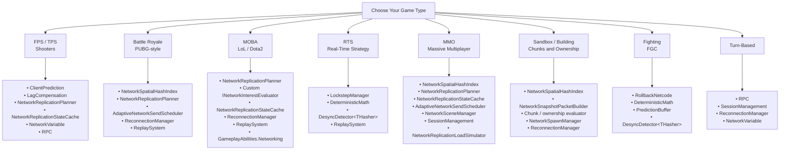
```mermaid
flowchart TB
    Start["Choose Your Game Type"] --> FPS
    Start --> BattleRoyale
    Start --> MOBA
    Start --> RTS
    Start --> MMO
    Start --> Sandbox
    Start --> Fighting
    Start --> TurnBased

    FPS["FPS / TPS</br>Shooters"]
    BattleRoyale["Battle Royale</br>PUBG-style"]
    MOBA["MOBA</br>LoL / Dota2"]
    RTS["RTS</br>Real-Time Strategy"]
    MMO["MMO</br>Massive Multiplayer"]
    Sandbox["Sandbox / Building</br>Chunks and Ownership"]
    Fighting["Fighting</br>FGC"]
    TurnBased["Turn-Based"]

    FPS --> FPS_Modules["• ClientPrediction</br>• LagCompensation</br>• NetworkReplicationPlanner</br>• NetworkReplicationStateCache</br>• NetworkVariable</br>• RPC"]

    BattleRoyale --> BR_Modules["• NetworkSpatialHashIndex</br>• NetworkReplicationPlanner</br>• AdaptiveNetworkSendScheduler</br>• ReconnectionManager</br>• ReplaySystem"]

    MOBA --> MOBA_Modules["• NetworkReplicationPlanner</br>• Custom INetworkInterestEvaluator</br>• NetworkReplicationStateCache</br>• ReconnectionManager</br>• ReplaySystem</br>• GameplayAbilities.Networking"]

    RTS --> RTS_Modules["• LockstepManager</br>• DeterministicMath</br>• DesyncDetector&lt;THasher&gt;</br>• ReplaySystem"]

    MMO --> MMO_Modules["• NetworkSpatialHashIndex</br>• NetworkReplicationPlanner</br>• NetworkReplicationStateCache</br>• AdaptiveNetworkSendScheduler</br>• NetworkSceneManager</br>• SessionManagement</br>• NetworkReplicationLoadSimulator"]

    Sandbox --> Sandbox_Modules["• NetworkSpatialHashIndex</br>• NetworkSnapshotPacketBuilder</br>• Chunk / ownership evaluator</br>• NetworkSpawnManager</br>• ReconnectionManager"]

    Fighting --> Fighting_Modules["• RollbackNetcode</br>• DeterministicMath</br>• PredictionBuffer</br>• DesyncDetector&lt;THasher&gt;"]

    TurnBased --> Turn_Modules["• RPC</br>• SessionManagement</br>• ReconnectionManager</br>• NetworkVariable"]
```

| Game Type                 | Sync Model       | Core Modules                                                           | Latency Strategy                       |
| ------------------------- | ---------------- | ---------------------------------------------------------------------- | -------------------------------------- |
| FPS/TPS                   | State sync       | ClientPrediction + LagCompensation + Planner + StateCache              | Client prediction + server rewind      |
| Battle Royale             | State sync       | SpatialHashIndex + Planner + AdaptiveScheduler + Replay                | AOI culling + burst-tolerant budgets   |
| MOBA (LoL/Dota2)          | State sync       | Planner + custom evaluator + StateCache + GameplayAbilities bridge     | Server authority + team/vision rules   |
| RTS (C&C/StarCraft)       | Lockstep         | LockstepManager + FPInt64 + DesyncDetector\<THasher\>                  | Deterministic simulation               |
| MMO                       | State sync       | SpatialHashIndex + Planner + StateCache + AdaptiveScheduler + Scene    | AOI culling, send budgeting, sharding  |
| Sandbox / Building        | State sync       | SpatialHashIndex + SnapshotPacketBuilder + chunk evaluator + Spawn     | Chunk-level deltas + ownership rules   |
| Fighting (Street Fighter) | Rollback         | RollbackNetcode + FPInt64                                              | GGPO rollback + replay                 |
| Turn-based                | Request/Response | RPC + Session                                                          | No real-time sync needed               |

---

## Tutorials

### Tutorial 1: FPS Network Sync from Scratch

```csharp
// Step 1: Define data structures
public struct FpsInput : IEquatable<FpsInput>
{
    public float MoveX, MoveZ;
    public bool Fire;
    public bool Equals(FpsInput other) =>
        MoveX == other.MoveX && MoveZ == other.MoveZ && Fire == other.Fire;
}

public struct FpsState : IEquatable<FpsState>
{
    public float X, Y, Z;
    public bool Equals(FpsState other) =>
        Math.Abs(X - other.X) < 0.01f && Math.Abs(Z - other.Z) < 0.01f;
}

// Step 2: Implement IPredictable
public class FpsPlayer : MonoBehaviour, IPredictable<FpsInput, FpsState>
{
    public float Speed = 5f;

    public FpsInput CaptureInput() => new FpsInput
    {
        MoveX = Input.GetAxis("Horizontal"),
        MoveZ = Input.GetAxis("Vertical"),
        Fire = Input.GetMouseButton(0)
    };

    public FpsState CaptureState() => new FpsState
    { X = transform.position.x, Y = transform.position.y, Z = transform.position.z };

    public void ApplyState(in FpsState state) =>
        transform.position = new Vector3(state.X, state.Y, state.Z);

    public void SimulateStep(in FpsInput input, float deltaTime) =>
        transform.position += new Vector3(input.MoveX, 0, input.MoveZ) * Speed * deltaTime;

    public bool StatesMatch(in FpsState a, in FpsState b) => a.Equals(b);
}

// Step 3: Wire it up
public class FpsNetworkController : MonoBehaviour
{
    ClientPredictionSystem<FpsInput, FpsState> _prediction;
    NetworkTickSystem _tickSystem;

    void Start()
    {
        var player = GetComponent<FpsPlayer>();
        _tickSystem = new NetworkTickSystem(60);
        _prediction = new ClientPredictionSystem<FpsInput, FpsState>(player);

        _tickSystem.OnTick += tick =>
        {
            _prediction.RecordPrediction(tick, _tickSystem.TickInterval);
            NetServices.Instance.SendToServer(2000, player.CaptureInput());
        };

        NetServices.Instance.RegisterHandler<FpsState>(2001, (conn, state) =>
            _prediction.ProcessServerState(_tickSystem.CurrentTick, state));
    }

    void Update() => _tickSystem.Update(Time.deltaTime);
}
```

### Tutorial 2: RTS Lockstep

```csharp
public struct RtsInput
{
    public int SelectedUnitId;
    public int TargetX, TargetY;
    public byte CommandType;
}

public class RtsNetworkController : MonoBehaviour
{
    LockstepManager<RtsInput> _lockstep;
    DesyncDetector _desyncDetector;

    void Start()
    {
        _desyncDetector = new DesyncDetector();
        _lockstep = new LockstepManager<RtsInput>(peerCount: 4, localPeerId: myId, inputDelay: 3);

        _lockstep.OnSimulateFrame += (frame, inputs) =>
        {
            // Deterministic simulation using fixed-point math
            foreach (var (peerId, input) in inputs)
            {
                var target = new FPVector3(
                    FPInt64.FromInt(input.TargetX), FPInt64.Zero, FPInt64.FromInt(input.TargetY));
                // Move unit deterministically...
            }

            _desyncDetector.BeginFrame(frame);
            // Hash state for desync detection
        };

        _lockstep.OnDesyncDetected += frame =>
            Debug.LogError($"Desync at frame {frame}!");
    }

    void FixedUpdate()
    {
        _lockstep.SubmitLocalInput(GetPlayerInput());
        _lockstep.Tick();
    }
}
```

### Tutorial 3: Team Visibility With Replication Infrastructure

```csharp
using CycloneGames.Networking.Replication;

public class TeamVisionController : MonoBehaviour
{
    private readonly NetworkReplicationPlanner _planner = new NetworkReplicationPlanner();
    private readonly NetworkReplicationSelection[] _results = new NetworkReplicationSelection[256];

    int BuildPlanForConnection(PlayerConnection player, NetworkReplicatedObject[] objects, int serverTick)
    {
        var observer = new NetworkReplicationObserver(
            player.ConnectionId,
            player.PlayerId,
            player.TeamId,
            player.Position,
            viewRadius: 60f);
        var budget = new NetworkSendBudget(maxBytes: 4096, maxMessages: 64);

        return _planner.BuildPlan(observer, objects, serverTick, ref budget, _results);
    }
}
```

---

## API Quick Reference

### Core

| Class/Interface   | Purpose         | Key Members                                                      |
| ----------------- | --------------- | ---------------------------------------------------------------- |
| `NetServices`     | Service locator | `Instance`, `Register`, `IsAvailable`                            |
| `INetTransport`   | Transport layer | `StartServer`, `Send`, `Broadcast`, `GetStatistics`              |
| `INetworkManager` | High-level API  | `RegisterHandler<T>`, `SendToServer<T>`, `BroadcastToClients<T>` |
| `INetConnection`  | Connection      | `ConnectionId`, `Ping`, `Quality`, `IsAuthenticated`             |

### Synchronization

| Class                         | Purpose            | Key Members                              |
| ----------------------------- | ------------------ | ---------------------------------------- |
| `NetworkTickSystem`           | Fixed-rate driver  | `Update(dt)`, `OnTick`, `TickRate`       |
| `ClientPredictionSystem<I,S>` | Client prediction  | `RecordPrediction`, `ProcessServerState` |
| `NetworkVariable<T>`          | Auto-sync variable | `Value`, `OnChanged`, `IsDirty`          |
| `RpcProcessor`                | RPC processor      | `Register<T>`, `Send<T>`                 |

### Deterministic

| Class                     | Purpose                           | Key Members                                   |
| ------------------------- | --------------------------------- | --------------------------------------------- |
| `LockstepManager<T>`      | Lockstep driver                   | `SubmitLocalInput`, `Tick`, `OnSimulateFrame` |
| `RollbackNetcode<I,S>`    | GGPO rollback                     | `AdvanceFrame`, `ReceiveConfirmedInput`       |
| `FPInt64`                 | Q32.32 fixed-point                | `FromFloat`, `ToFloat`, `Sqrt`                |
| `DesyncDetector<THasher>` | Desync detection (pluggable hash) | `BeginFrame`, `HashFPVector3`, `EndFrame`     |
| `DesyncDetector`          | Default (FNV-1a) alias            | `new DesyncDetector()`                        |
| `IStateHasher`            | Hash algorithm interface          | `Reset`, `HashInt`, `HashLong`, `GetDigest`   |
| `Fnv1aHasher`             | FNV-1a 64-bit (default)           | Built-in, zero-alloc                          |

### Replication Infrastructure

| Class/Interface                   | Best For                                      |
| --------------------------------- | --------------------------------------------- |
| `NetworkReplicationPolicy`        | Declaring owner/team/area/manual visibility   |
| `NetworkReplicationObserver`      | Per-connection visibility and budget input    |
| `NetworkReplicatedObject`         | Per-object replication snapshot               |
| `INetworkInterestEvaluator`       | Custom AOI, room, guild, stealth, reveal rules |
| `DefaultNetworkInterestEvaluator` | Owner/team/area/layer/auth baseline           |
| `NetworkSendBudget`               | Per-connection byte and message limits        |
| `NetworkReplicationPlanner`       | Priority-ordered replication selection        |
| `NetworkReplicationStateCache`    | Per-connection last sent/acked/full-state state |
| `NetworkSpatialHashIndex`         | Allocation-free spatial AOI queries after indexing |
| `NetworkSnapshotPacketBuilder`    | Stable full-state and delta snapshot packet writer |
| `INetworkSnapshotPayloadSource`   | Gameplay-owned payload size/hash/write contract |
| `AdaptiveNetworkSendScheduler`    | Quality-aware send interval and budget control |
| `NetworkReplicationLoadSimulator` | Deterministic planner load simulation         |

### Session Resilience

| Class/Interface                   | Best For                                      |
| --------------------------------- | --------------------------------------------- |
| `NetworkSessionDirectory`         | Backend-neutral room search, filtering, ranking |
| `NetworkSessionDescriptor`        | Steam/LAN/backend/dedicated room metadata     |
| `NetworkSessionSearchCriteria`    | Game mode, map, region, build, capacity, ping, feature filters |
| `NetworkMatchmakingCoordinator`   | Join/create/queue plan generation             |
| `ReconnectionManager`             | Slot reservation, reconnect token validation, state catch-up |
| `HostMigrationCoordinator`        | Host failover, candidate selection, migration state |
| `IHostCandidatePolicy`            | Custom authority, hardware, shard, relay, or platform host selection |
| `NetworkAuthorityTransferPlan`    | Session/simulation/spawn/object/scene/match/RNG authority transfer |

### Project Extensibility

| Class/Interface                            | Best For                                      |
| ------------------------------------------ | --------------------------------------------- |
| `NetworkRuntimeProfile`                    | Project-owned runtime and tuning profile      |
| `NetworkRuntimeProfileRegistry`            | Profile lookup without global project settings |
| `NetworkNodeCapabilities`                  | Backend, client host, shard, relay, or dedicated node descriptors |
| `NetworkCapabilityId`                      | Project-defined extensible capability ids     |
| `NetworkCapabilityQuery`                   | Required/preferred capability matching        |
| `NetworkProtocolManifest`                  | Versioned protocol, range, and message manifest |
| `NetworkProtocolManifestCatalogExtensions` | Registering manifests into `INetworkMessageCatalog` |

### Production Hardening

| Class/Interface                         | Best For                                      |
| --------------------------------------- | --------------------------------------------- |
| `NetworkProductionReadinessScenario`    | Scenario-owned production-readiness contract  |
| `NetworkProductionReadinessScenarios`   | Generic small-session, arena, large-area, massive-shard, and web/mobile templates |
| `NetworkProductionReadinessInput`       | Evaluation input for profiles, nodes, manifests, and fault plans |
| `NetworkProductionReadinessEvaluator`   | Deterministic readiness assessment            |
| `NetworkProductionReadinessReport`      | Blocking/warning issue report                 |
| `NetworkFailureInjectionPlan`           | Planned fault coverage for CI, editor diagnostics, or external load tests |
| `NetworkFaultId`                        | Project-defined extensible fault id           |

### GAS Integration (`CycloneGames.GameplayAbilities.Networking`)

- `NetworkedAbilityBridge`: transport-agnostic GAS protocol bridge.
- `AttributeSyncManager`: generic attribute dirty tracking and sync.
- `GameplayAbilitiesNetworkedASCAdapter`: GameplayAbilities full-state and refined effect delta integration.
- `GasBridgeGameplayAbilitiesExtensions`: one-line ASC registration, delta replication, and full-state send.

---

## Current Adapter and Protocol Notes

This section reflects the current Cyclone networking layer and should be treated as the practical entry point for new projects.

### Runtime Context

Use `INetworkRuntimeContext` to describe the active backend. Built-in runtime ids are readable ASCII codes stored in `NetworkRuntimeId`:

```csharp
NetworkRuntimeIds.Mirror  // "Mirror"
NetworkRuntimeIds.Mirage  // "Mirage"
NetworkRuntimeIds.Nakama  // "Nakama"
```

Custom backends should use `NetworkRuntimeId.FromAsciiCode("MyNet")` with at most 8 printable ASCII characters. Runtime capabilities are declared through `NetworkBackendFeatures`, such as `RealtimeTransport`, `AuthSession`, `Matchmaker`, `BackendRpc`, `Presence`, `Relay`, and `AuthoritativeServer`.

### Wire Frame

Cyclone adapters use a stable wire frame when they need a backend-neutral message envelope. A frame is the fixed Cyclone header followed by the serialized payload. The current header is 22 bytes:

| Offset | Size | Field | Description |
| ---: | ---: | --- | --- |
| 0 | 2 | Magic | ASCII bytes `C` and `N`, read as little-endian `ushort`. |
| 2 | 1 | Version | Current protocol version. |
| 3 | 1 | HeaderLength | Header byte count. |
| 4 | 2 | Flags | `NetworkMessageFlags`. |
| 6 | 2 | MessageId | Cyclone typed message id. |
| 8 | 1 | Channel | `NetworkChannel` value. |
| 9 | 1 | Reserved | Reserved for future header data. |
| 10 | 4 | Sequence | Message or frame sequence. |
| 14 | 4 | PayloadLength | Serialized payload length in bytes. |
| 18 | 4 | Checksum | FNV-1a checksum over routing metadata and payload. |

`NetworkFrameCodec` reads, writes, and validates frames without heap allocation. The checksum is non-cryptographic: it catches accidental corruption and mismatched parsing, but it is not a replacement for TLS, DTLS, HMAC, signatures, or backend authentication.

Mirror and Mirage adapters use `CycloneWireFrameMessage`. Its `Frame` field contains the full Cyclone frame, including header and payload. Use `NetworkFrameCodec.TryReadPayload` when only the payload is needed.

### Protocol Version

`NetworkWireProtocol.CurrentVersion` is currently `1`. This is the first stable Cyclone wire-frame contract, not a legacy compatibility branch. Because this project has not shipped a previous protocol, there is no `LegacyRaw` or old raw-message path in the current design.

### Backend Compatibility

Mirror and Mirage are realtime transport adapters for Unity-hosted networking. Nakama is available through `Unity.Runtime/Adapters/Nakama` as a client-side socket adapter and backend service facade.

`NakamaNetAdapter` implements `INetTransport`, `INetworkManager`, `INetworkRuntimeContextProvider`, `INetworkSessionService`, `INetworkMatchStateService`, `INetworkMatchmakerService`, `INetworkBackendRpcService`, and `INetworkPresenceService`. It sends Cyclone wire frames through Nakama match state with a configurable op code, and receives remote match state back through the same `NetworkFrameCodec` validation path.

Important Nakama usage notes:

- `StartClient(matchId)` connects the socket and optionally joins a relayed match.
- `StartServer()` is intentionally unsupported. Authoritative logic should live in Nakama server modules or a dedicated server adapter.
- `SendToServer`, `BroadcastToClients`, and `Broadcast` map to Nakama match state sends.
- Targeted `SendToClient` works when the target connection is a `NakamaNetConnection` backed by an `IUserPresence`.
- The adapter exposes Nakama session, match state, matchmaker, RPC, and presence through Cyclone service interfaces, so gameplay code does not need to depend on Nakama SDK types.
- The adapter assembly is optional and compiles only when `com.heroiclabs.nakama-unity` is installed.

Best HTTP is suitable for HTTP, REST, RPC, and download flows; do not use it as the default realtime gameplay transport unless the game intentionally uses a request/response model.

### Editor Diagnostics

Create a preset from `Create > CycloneGames > Networking > Bootstrap Preset` and open the checker from `Tools > CycloneGames > Networking > Bootstrap Diagnostics`. The diagnostics check missing transports, missing or duplicated managers, runtime context wiring, optional SDK packages, and requested backend features.

## Directory Structure

```text
Core/
├── Core/                 # Core interfaces and runtime context
├── Profile/              # Runtime profiles, node capabilities, protocol manifests
├── Hardening/            # Production readiness scenarios, fault plans, evaluators
├── Buffers/              # Buffer system and pool
├── Serialization/        # Serialization interfaces and factory
├── Replication/          # Interest, spatial AOI, state cache, snapshot packets, send budgets, load simulation
├── StateSync/            # NetworkVariable state synchronization
├── Rpc/                  # RPC attributes and processor
├── Routing/              # Actor route table for distributed deployments
├── Lockstep/             # Lockstep, rollback, IStateHasher
├── Security/             # Rate limiter, message validator
├── Session/              # Room directory, matchmaking plans, reconnection, host migration
├── Replay/               # Recording and playback
├── Spawning/             # Network object spawning
├── Scene/                # Network scene management
├── Authentication/       # Authentication interface
└── Stubs/                # No-op implementations (testing)

Optional package integrations:
├── CycloneGames.GameplayAbilities.Networking/
├── CycloneGames.GameplayFramework.Networking/
├── CycloneGames.GameplayTags.Networking/
└── CycloneGames.RPGFoundation.Interaction.Networking/
```

---

## License

This project is licensed under the terms specified in the root LICENSE file.
