# CycloneGames.Networking

<div align="left">English | <a href="./README.SCH.md">简体中文</a></div>

A **production-grade networking abstraction layer** for Unity supporting state synchronization, lockstep, rollback netcode, client prediction, and more. Designed for **low-allocation runtime performance**, **adapter-aware thread safety**, and **cross-platform compatibility**.

## Features

- **Multiple Sync Models**: State sync, lockstep, GGPO-style rollback — pick the right one for your game
- **Flexible Serialization**: Pluggable serializers (Json, MessagePack, ProtoBuf, FlatBuffers)
- **Clean Abstractions**: Transport-agnostic interfaces (`INetTransport`, `INetworkManager`, `INetConnection`)
- **Client Prediction**: Full predict → authorize → reconcile pipeline with rollback
- **Deterministic Simulation**: Q32.32 fixed-point math, deterministic RNG, pluggable desync detection (`IStateHasher`)
- **Interest Management**: Grid AOI, manual groups, team visibility, composite strategies
- **GAS Integration**: First-class GameplayAbilities networking (abilities, effects, attributes)
- **Session Management**: Lobby/matchmaking/host migration abstractions plus reconnection with state catch-up hooks
- **Security**: Token-bucket rate limiting, message validation
- **Diagnostics**: Network profiler, condition simulator (LAN/4G/Satellite presets)
- **Thread Safety**: Mirror adapter includes cross-thread send queue with `ArrayPool`; other adapters should send on main thread unless extended similarly

## Table of Contents

- [CycloneGames.Networking](#cyclonegamesnetworking)
  - [Features](#features)
  - [Table of Contents](#table-of-contents)
  - [Architecture Overview](#architecture-overview)
    - [Design Principles](#design-principles)
  - [Quick Start](#quick-start)
    - [Prerequisites](#prerequisites)
    - [Minimal Example: Send and Receive Messages](#minimal-example-send-and-receive-messages)
    - [Minimal Example: Using Mirror Adapter](#minimal-example-using-mirror-adapter)
  - [Module Reference](#module-reference)
    - [1. Core Abstractions](#1-core-abstractions)
    - [2. Buffer System](#2-buffer-system)
    - [3. Service Locator](#3-service-locator)
    - [4. Serialization](#4-serialization)
    - [5. Tick System](#5-tick-system)
    - [6. Client Prediction](#6-client-prediction)
      - [Snapshot Interpolation](#snapshot-interpolation)
      - [Lag Compensation](#lag-compensation)
    - [7. Interest Management](#7-interest-management)
    - [8. State Synchronization](#8-state-synchronization)
    - [9. Remote Procedure Calls](#9-remote-procedure-calls)
    - [10. Lockstep \& Deterministic Simulation](#10-lockstep--deterministic-simulation)
      - [Lockstep Example](#lockstep-example)
      - [Fixed-Point Math](#fixed-point-math)
      - [GGPO-Style Rollback](#ggpo-style-rollback)
    - [11. Security](#11-security)
    - [12. Session \& Reconnection](#12-session--reconnection)
    - [13. Replay System](#13-replay-system)
    - [14. Network Spawning](#14-network-spawning)
    - [15. Scene Management](#15-scene-management)
    - [16. Compression](#16-compression)
    - [17. Diagnostics](#17-diagnostics)
    - [18. Gameplay Abilities Integration](#18-gameplay-abilities-integration)
    - [19. Authentication](#19-authentication)
    - [20. Platform Configuration](#20-platform-configuration)
    - [21. Transport Adapters](#21-transport-adapters)
  - [Game Type Guide](#game-type-guide)
  - [Tutorials](#tutorials)
    - [Tutorial 1: FPS Network Sync from Scratch](#tutorial-1-fps-network-sync-from-scratch)
    - [Tutorial 2: RTS Lockstep](#tutorial-2-rts-lockstep)
    - [Tutorial 3: Team Visibility](#tutorial-3-team-visibility)
  - [API Quick Reference](#api-quick-reference)
    - [Core](#core)
    - [Synchronization](#synchronization)
    - [Deterministic](#deterministic)
    - [Interest Management](#interest-management)
    - [GAS Integration (📦 Separate Package: `CycloneGames.Networking.GAS`)](#gas-integration--separate-package-cyclonegamesnetworkinggas)
  - [Directory Structure](#directory-structure)
  - [License](#license)

---

## Architecture Overview

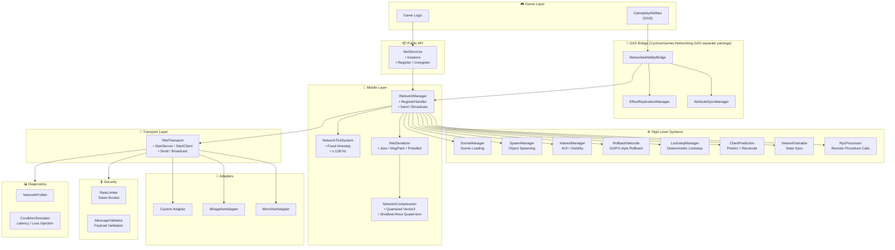
```mermaid
flowchart TB
    subgraph GameLayer["🎮 Game Layer"]
        GameLogic["Game Logic"]
        GAS["GameplayAbilities</br>(GAS)"]
    end

    subgraph API["📦 Public API"]
        NetServices["NetServices</br>• Instance</br>• Register / Unregister"]
    end

    subgraph HighLevel["⚙️ High-Level Systems"]
        RPC["RpcProcessor</br>Remote Procedure Calls"]
        StateSync["NetworkVariable</br>State Sync"]
        Prediction["ClientPrediction</br>Predict + Reconcile"]
        Lockstep["LockstepManager</br>Deterministic Lockstep"]
        Rollback["RollbackNetcode</br>GGPO-style Rollback"]
        Interest["InterestManager</br>AOI / Visibility"]
        Spawn["SpawnManager</br>Object Spawning"]
        Scene["SceneManager</br>Scene Loading"]
    end

    subgraph Bridge["🔗 GAS Bridge (CycloneGames.Networking.GAS separate package)"]
        AbilityBridge["NetworkedAbilityBridge"]
        AttrSync["AttributeSyncManager"]
        EffectRepl["EffectReplicationManager"]
    end

    subgraph Mid["📡 Middle Layer"]
        INetworkManager["INetworkManager</br>• RegisterHandler</br>• Send / Broadcast"]
        TickSystem["NetworkTickSystem</br>• Fixed timestep</br>• 1-128 Hz"]
        Serializer["INetSerializer</br>• Json / MsgPack / ProtoBuf"]
        Compression["NetworkCompression</br>• Quantized Vector3</br>• Smallest-three Quaternion"]
    end

    subgraph Low["🔌 Transport Layer"]
        INetTransport["INetTransport</br>• StartServer / StartClient</br>• Send / Broadcast"]
    end

    subgraph Adapters["🔄 Adapters"]
        Mirror["MirrorNetAdapter"]
        Mirage["MirageNetAdapter"]
        Custom["Custom Adapter"]
    end

    subgraph Security["🔒 Security"]
        RateLimiter["RateLimiter</br>Token Bucket"]
        Validator["MessageValidator</br>Payload Validation"]
    end

    subgraph Diagnostics["📊 Diagnostics"]
        Profiler["NetworkProfiler"]
        CondSim["ConditionSimulator</br>Latency / Loss Injection"]
    end

    GameLogic --> NetServices
    GAS --> AbilityBridge
    AbilityBridge --> AttrSync
    AbilityBridge --> EffectRepl
    AbilityBridge --> INetworkManager
    NetServices --> INetworkManager
    INetworkManager --> RPC
    INetworkManager --> StateSync
    INetworkManager --> Prediction
    INetworkManager --> Lockstep
    INetworkManager --> Rollback
    INetworkManager --> Interest
    INetworkManager --> Spawn
    INetworkManager --> Scene
    INetworkManager --> Serializer
    INetworkManager --> TickSystem
    Serializer --> Compression
    INetworkManager --> INetTransport
    INetTransport --> Mirror
    INetTransport --> Mirage
    INetTransport --> Custom
    INetTransport --> Security
    INetTransport --> Diagnostics
```

### Design Principles

| Principle                   | Description                                                                                         |
| --------------------------- | --------------------------------------------------------------------------------------------------- |
| **Interface-Driven**        | All subsystems defined via interfaces (`INetTransport`, `INetSerializer`, `IInterestManager`, etc.) |
| **Zero-GC Steady State**    | `ArrayPool`, `ConcurrentQueue` pools, ring buffers — no runtime allocations                         |
| **Modular**                 | Serializers, transports, interest managers are all pluggable                                        |
| **Deterministic**           | Q32.32 fixed-point math, lockstep, rollback for competitive games                                   |
| **Pluggable Hashing**       | `IStateHasher` struct-generic for zero-cost hash algorithm injection                                |
| **Thread-Safe**             | Mirror adapter provides cross-thread send queue (`ConcurrentQueue`) and `Interlocked` accounting    |
| **Conditional Compilation** | `#if MIRROR`, `#if MIRAGE`, `#if MESSAGEPACK`, etc.                                                 |

---

## Quick Start

### Prerequisites

- Unity 2022.3+
- A transport implementation (e.g., [Mirror](https://github.com/MirrorNetworking/Mirror))

### Minimal Example: Send and Receive Messages

```csharp
using CycloneGames.Networking;
using CycloneGames.Networking.Services;
using UnityEngine;

// ① Define message struct (value type, zero-GC)
public struct ChatMsg
{
    public int SenderId;
    public int MessageType;
}

// ② Sender
public class ChatSender : MonoBehaviour
{
    private const ushort MSG_CHAT = 1001;

    void Update()
    {
        if (Input.GetKeyDown(KeyCode.Return))
        {
            NetServices.Instance.SendToServer(MSG_CHAT, new ChatMsg
            {
                SenderId = 1,
                MessageType = 0
            });
        }
    }
}

// ③ Receiver
public class ChatReceiver : MonoBehaviour
{
    private const ushort MSG_CHAT = 1001;

    void Start()
    {
        NetServices.Instance.RegisterHandler<ChatMsg>(MSG_CHAT, OnChat);
    }

    void OnChat(INetConnection conn, ChatMsg msg)
    {
        Debug.Log($"Message from player {msg.SenderId}");
    }

    void OnDestroy()
    {
        NetServices.Instance.UnregisterHandler(MSG_CHAT);
    }
}
```

### Minimal Example: Using Mirror Adapter

```csharp
// Add a MirrorNetAdapter component to a GameObject in the scene.
// MirrorNetAdapter automatically registers itself with NetServices on Awake.

// Then access the network manager from anywhere:
var net = NetServices.Instance;
bool isAvailable = NetServices.IsAvailable; // true after adapter registers
```

---

## Module Reference

### 1. Core Abstractions

**Path**: `Runtime/Scripts/Core/`

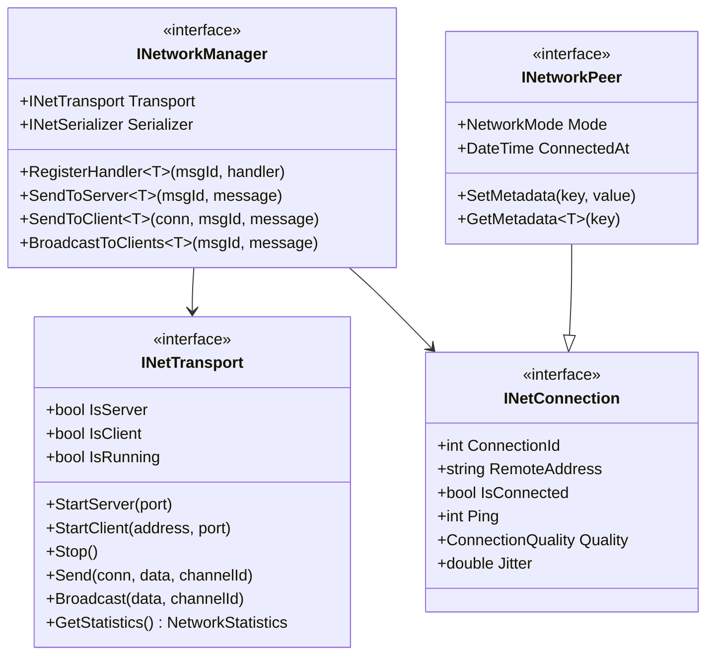
```mermaid
classDiagram
    class INetTransport {
        <<interface>>
        +bool IsServer
        +bool IsClient
        +bool IsRunning
        +StartServer(port)
        +StartClient(address, port)
        +Stop()
        +Send(conn, data, channelId)
        +Broadcast(data, channelId)
        +GetStatistics() NetworkStatistics
    }

    class INetworkManager {
        <<interface>>
        +INetTransport Transport
        +INetSerializer Serializer
        +RegisterHandler~T~(msgId, handler)
        +SendToServer~T~(msgId, message)
        +SendToClient~T~(conn, msgId, message)
        +BroadcastToClients~T~(msgId, message)
    }

    class INetConnection {
        <<interface>>
        +int ConnectionId
        +string RemoteAddress
        +bool IsConnected
        +int Ping
        +ConnectionQuality Quality
        +double Jitter
    }

    class INetworkPeer {
        <<interface>>
        +NetworkMode Mode
        +DateTime ConnectedAt
        +SetMetadata(key, value)
        +GetMetadata~T~(key)
    }

    INetworkPeer --|> INetConnection
    INetworkManager --> INetTransport
    INetworkManager --> INetConnection
```

| Enum                | Values                                                              | Purpose          |
| ------------------- | ------------------------------------------------------------------- | ---------------- |
| `NetworkMode`       | Offline, Client, Server, Host, ListenServer, DedicatedServer, Relay | Runtime mode     |
| `NetworkChannel`    | Reliable, Unreliable, ReliableUnordered, UnreliableSequenced        | Channel types    |
| `ConnectionQuality` | Excellent, Good, Fair, Poor, Disconnected                           | Connection grade |
| `TransportError`    | None, DnsResolve, Refused, Timeout, Congestion, ...                 | Error types      |

---

### 2. Buffer System

**Path**: `Runtime/Scripts/Buffers/`

Thread-safe, zero-allocation buffer pool for message serialization.

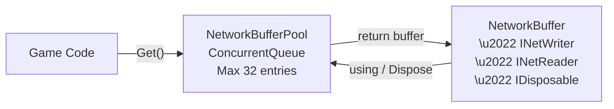
```mermaid
flowchart LR
    Code["Game Code"] -->|"Get()"| Pool["NetworkBufferPool</br>ConcurrentQueue</br>Max 32 entries"]
    Pool -->|"return buffer"| Buffer["NetworkBuffer</br>\u2022 INetWriter</br>\u2022 INetReader</br>\u2022 IDisposable"]
    Buffer -->|"using / Dispose"| Pool
```

```csharp
// Zero-allocation buffer usage
using (var buffer = NetworkBufferPool.Get())
{
    buffer.WriteInt(playerId);
    buffer.WriteFloat(health);
    buffer.WriteBlittable(position); // unmanaged types only

    var segment = buffer.ToArraySegment();
    transport.Send(conn, segment, channelId);
}
// Automatically returned to pool on Dispose
```

---

### 3. Service Locator

**Path**: `Runtime/Scripts/Services/`

Global access to the active `INetworkManager`.

```csharp
// Registration (usually automatic in adapter Awake)
NetServices.Register(myNetworkManager);

// Global access
var net = NetServices.Instance;

// Safe access
if (NetServices.IsAvailable)
    net.SendToServer(msgId, data);

// Unregister
NetServices.Unregister(myNetworkManager);
```

---

### 4. Serialization

**Path**: `Runtime/Scripts/Serialization/` + `Runtime/Scripts/Serializers/`

Pluggable serialization with conditional compilation.

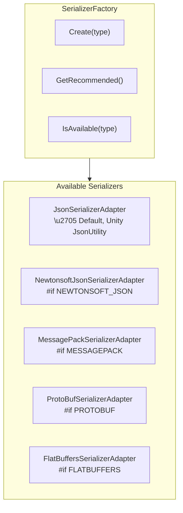
```mermaid
flowchart TB
    subgraph Factory["SerializerFactory"]
        Create["Create(type)"]
        GetRec["GetRecommended()"]
        IsAvail["IsAvailable(type)"]
    end

    subgraph Serializers["Available Serializers"]
        Json["JsonSerializerAdapter</br>\u2705 Default, Unity JsonUtility"]
        Newtonsoft["NewtonsoftJsonSerializerAdapter</br>#if NEWTONSOFT_JSON"]
        MsgPack["MessagePackSerializerAdapter</br>#if MESSAGEPACK"]
        ProtoBuf["ProtoBufSerializerAdapter</br>#if PROTOBUF"]
        FlatBuf["FlatBuffersSerializerAdapter</br>#if FLATBUFFERS"]
    end

    Factory --> Serializers
```

| Serializer      | Define Symbol     | Format | Recommended For    |
| --------------- | ----------------- | ------ | ------------------ |
| Json (Unity)    | _(default)_       | Text   | Dev/Debug          |
| Newtonsoft Json | `NEWTONSOFT_JSON` | Text   | Complex structures |
| MessagePack     | `MESSAGEPACK`     | Binary | **Production**     |
| ProtoBuf        | `PROTOBUF`        | Binary | Schema-driven      |
| FlatBuffers     | `FLATBUFFERS`     | Binary | Zero-copy perf     |

```csharp
// Get recommended serializer (priority: MessagePack > Newtonsoft > Json)
var serializer = SerializerFactory.GetRecommended();

// Or create specific
if (SerializerFactory.IsAvailable(SerializerType.MessagePack))
    serializer = SerializerFactory.Create(SerializerType.MessagePack);
```

---

### 5. Tick System

**Path**: `Runtime/Scripts/Simulation/`

Deterministic fixed-timestep tick driver — the foundation for prediction, lockstep, and rollback.

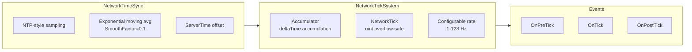
```mermaid
flowchart LR
    subgraph TickSystem["NetworkTickSystem"]
        Accumulator["Accumulator</br>deltaTime accumulation"]
        Tick["NetworkTick</br>uint overflow-safe"]
        Rate["Configurable rate</br>1-128 Hz"]
    end

    subgraph Events["Events"]
        PreTick["OnPreTick"]
        OnTick["OnTick"]
        PostTick["OnPostTick"]
    end

    subgraph TimeSync["NetworkTimeSync"]
        NTP["NTP-style sampling"]
        EMA["Exponential moving avg</br>SmoothFactor=0.1"]
        Offset["ServerTime offset"]
    end

    TickSystem --> Events
    TimeSync --> TickSystem
```

```csharp
// Create tick system (30 Hz)
var tickSystem = new NetworkTickSystem(30);

// Register tick callback
tickSystem.OnTick += tick =>
{
    SimulateGameplay(tick);
};

// Drive in Update (max 5 ticks/frame to prevent spiral-of-death)
void Update() => tickSystem.Update(Time.deltaTime);

// Time synchronization (NTP-style)
var timeSync = new NetworkTimeSync();
timeSync.ProcessTimeSample(clientSendTime, serverTime, clientReceiveTime);
double serverNow = timeSync.LocalToServerTime(Time.timeAsDouble);
```

---

### 6. Client Prediction

**Path**: `Runtime/Scripts/Prediction/`

Full **client-side prediction + server authority + rollback reconciliation** pipeline.

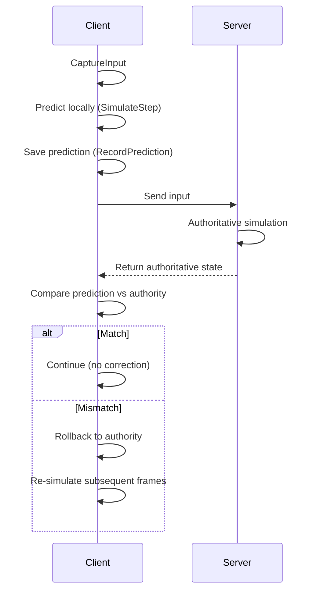
```mermaid
sequenceDiagram
    participant Client
    participant Server

    Client->>Client: CaptureInput
    Client->>Client: Predict locally (SimulateStep)
    Client->>Client: Save prediction (RecordPrediction)
    Client->>Server: Send input
    Server->>Server: Authoritative simulation
    Server-->>Client: Return authoritative state
    Client->>Client: Compare prediction vs authority
    alt Match
        Client->>Client: Continue (no correction)
    else Mismatch
        Client->>Client: Rollback to authority
        Client->>Client: Re-simulate subsequent frames
    end
```

```csharp
// ① Implement IPredictable
public class PlayerMovement : IPredictable<MoveInput, PlayerState>
{
    public MoveInput CaptureInput()
        => new MoveInput { Horizontal = Input.GetAxis("Horizontal") };

    public PlayerState CaptureState()
        => new PlayerState { X = transform.position.x };

    public void ApplyState(in PlayerState state)
        => transform.position = new Vector3(state.X, 0, 0);

    public void SimulateStep(in MoveInput input, float deltaTime)
        => transform.position += Vector3.right * input.Horizontal * deltaTime;

    public bool StatesMatch(in PlayerState a, in PlayerState b)
        => Mathf.Abs(a.X - b.X) < 0.01f;
}

// ② Use the prediction system
var prediction = new ClientPredictionSystem<MoveInput, PlayerState>(player, capacity: 128);
prediction.RecordPrediction(currentTick, deltaTime);
prediction.ProcessServerState(serverTick, serverState); // auto-rollback on mismatch
```

#### Snapshot Interpolation

Smooth display of remote entities:

```csharp
var interp = new SnapshotInterpolation<TransformSnapshot>(
    TransformSnapshot.Lerp, TransformSnapshot.GetTimestamp
);
interp.AddSnapshot(new TransformSnapshot
{
    Timestamp = serverTime,
    Position = pos,
    Rotation = rot
});
var result = interp.Update(currentTime);
transform.position = result.Position;
transform.rotation = result.Rotation;
```

#### Lag Compensation

Server-side historical hit detection:

```csharp
var lagComp = new LagCompensationBuffer(capacity: 128);
lagComp.Record(tick, position, rotation, bounds);

if (lagComp.HitTest(clientTick, shootRay, maxDist, out float hitDist))
    ConfirmHit();
```

---

### 7. Interest Management

**Path**: `Runtime/Scripts/Interest/`

Controls which entities are visible to which connections — **critical for bandwidth**.

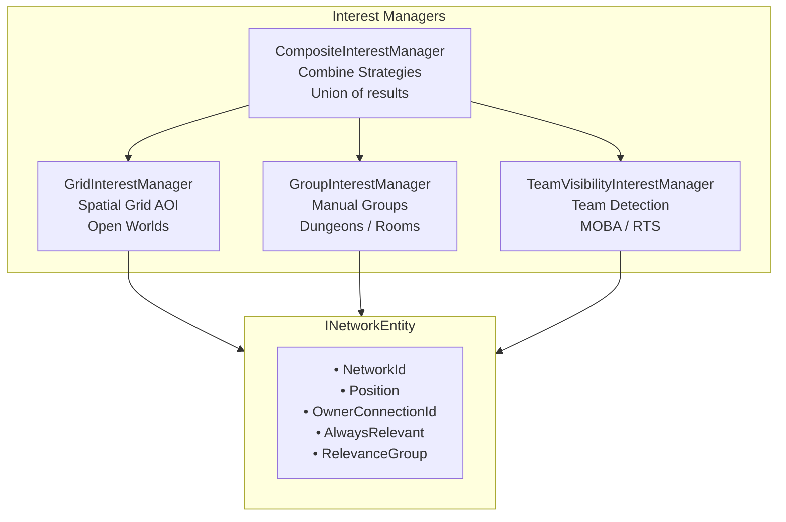
```mermaid
flowchart TB
    subgraph Managers["Interest Managers"]
        Grid["GridInterestManager</br>Spatial Grid AOI</br>Open Worlds"]
        Group["GroupInterestManager</br>Manual Groups</br>Dungeons / Rooms"]
        TeamVis["TeamVisibilityInterestManager</br>Team Detection</br>MOBA / RTS"]
        Composite["CompositeInterestManager</br>Combine Strategies</br>Union of results"]
    end

    subgraph Entity["INetworkEntity"]
        Props["• NetworkId</br>• Position</br>• OwnerConnectionId</br>• AlwaysRelevant</br>• RelevanceGroup"]
    end

    Composite --> Grid
    Composite --> Group
    Composite --> TeamVis
    Grid --> Entity
    Group --> Entity
    TeamVis --> Entity
```

```csharp
// Grid AOI (open world MMO)
var grid = new GridInterestManager(cellSize: 50f, visibilityRange: 150f);
grid.SetObserverPosition(connectionId, playerPosition);

// Manual groups (dungeons, rooms)
var group = new GroupInterestManager();
group.AddEntityToGroup("dungeon_1", entity);
group.AddConnectionToGroup("dungeon_1", connectionId);

// Team Visibility (MOBA/RTS)
var visibility = new TeamVisibilityInterestManager(defaultDetectionRange: 30f);
visibility.SetConnectionTeam(connectionId, teamId: 1);
visibility.SetEntityDetectionRange(entity, 25f);
visibility.SetHidden(entity, true);           // hidden
visibility.AddRevealZone(position, radius);   // reveal zone

// Combine strategies (union of visibility)
var composite = new CompositeInterestManager();
composite.Add(grid);
composite.Add(visibility);
```

---

### 8. State Synchronization

**Path**: `Runtime/Scripts/StateSync/`

Automatic dirty tracking and change synchronization.

```csharp
// Value-type variable (zero-GC, T : unmanaged, IEquatable<T>)
var health = new NetworkVariable<int>(100);
health.Value = 80; // auto-marks dirty, fires OnChanged

health.OnChanged += (oldVal, newVal) =>
    Debug.Log($"Health: {oldVal} → {newVal}");

// Managed-type variable
var name = new NetworkVariableManaged<string>("Player1", serializer);

// Variable set (up to 64 variables, bit-mask dirty tracking)
var varSet = new NetworkVariableSet();
varSet.Register(health);
if (varSet.IsAnyDirty)
{
    varSet.WriteDirty(writer);
    varSet.ClearAllDirty();
}
```

---

### 9. Remote Procedure Calls

**Path**: `Runtime/Scripts/Rpc/`

Attribute-based RPC system.

```csharp
[ServerRpc(requiresOwnership: true)]
void CmdAttack(int targetId) { /* runs on server */ }

[ClientRpc(target: RpcTarget.AllClients)]
void RpcDamaged(int damage) { /* runs on all clients */ }

// Processor-based usage
var rpc = new RpcProcessor(networkManager);
rpc.Register<DamageMsg>(1, OnDamageReceived);
rpc.Send(1, new DamageMsg { TargetId = 5, Amount = 20 }, RpcTarget.AllClients);
```

`RpcTarget` options: `Server`, `Owner`, `AllClients`, `Observers`, `AllExceptOwner`, `AllExceptSender`.

---

### 10. Lockstep & Deterministic Simulation

**Path**: `Runtime/Scripts/Lockstep/`

Full deterministic lockstep and GGPO-style rollback.

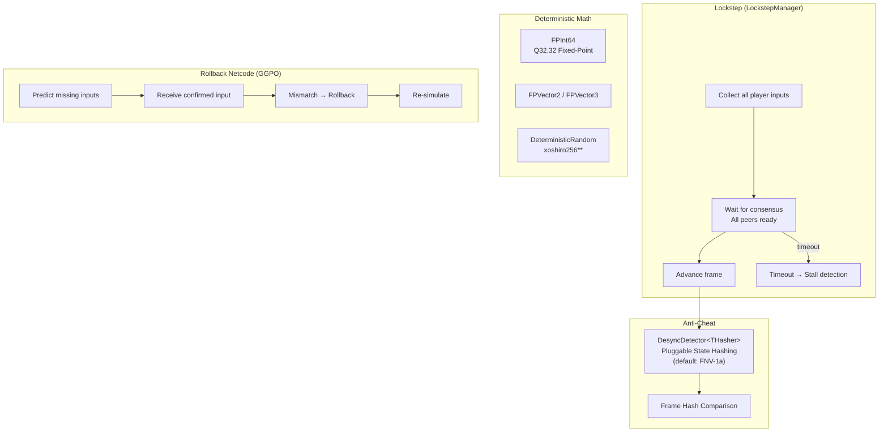
```mermaid
flowchart TB
    subgraph Lockstep["Lockstep (LockstepManager)"]
        Input["Collect all player inputs"]
        Wait["Wait for consensus</br>All peers ready"]
        Advance["Advance frame"]
        Stall["Timeout → Stall detection"]
    end

    subgraph Deterministic["Deterministic Math"]
        FP["FPInt64</br>Q32.32 Fixed-Point"]
        Vec["FPVector2 / FPVector3"]
        Rand["DeterministicRandom</br>xoshiro256**"]
    end

    subgraph Desync["Anti-Cheat"]
        Hash["DesyncDetector&lt;THasher&gt;</br>Pluggable State Hashing</br>(default: FNV-1a)"]
        Compare["Frame Hash Comparison"]
    end

    subgraph RB["Rollback Netcode (GGPO)"]
        Predict["Predict missing inputs"]
        Confirm["Receive confirmed input"]
        Roll["Mismatch → Rollback"]
        Resim["Re-simulate"]
    end

    Input --> Wait --> Advance
    Wait -->|"timeout"| Stall
    Advance --> Hash --> Compare
    Predict --> Confirm --> Roll --> Resim
```

#### Lockstep Example

```csharp
var lockstep = new LockstepManager<GameInput>(
    peerCount: 2, localPeerId: 0, inputDelay: 2
);

lockstep.OnSimulateFrame += (frame, inputs) =>
{
    foreach (var (peerId, input) in inputs)
        SimulatePlayer(peerId, input);
};

void FixedUpdate()
{
    lockstep.SubmitLocalInput(CaptureInput());
    lockstep.Tick(); // advances when all inputs received
}
```

#### Fixed-Point Math

Cross-platform deterministic calculations (floating-point varies across CPU architectures):

```csharp
FPInt64 a = FPInt64.FromFloat(3.14f);
FPInt64 b = FPInt64.FromInt(2);
FPInt64 c = a * b; // exact multiplication (no float drift)

var v = new FPVector3(FPInt64.FromFloat(1f), FPInt64.Zero, FPInt64.Zero);
FPInt64 len = FPVector3.Distance(v, FPVector3.Zero);

// Deterministic RNG (same seed → same results on all clients)
var rng = new DeterministicRandom(seed: 12345);
int roll = rng.NextInt(1, 7);
```

#### GGPO-Style Rollback

```csharp
public class MySimulation : IRollbackSimulation<GameInput, GameState>
{
    public GameInput PredictInput(int frame) => default;
    public GameState SaveState() => currentState;
    public void LoadState(in GameState state) => currentState = state;
    public void Simulate(in GameInput input) { /* one frame */ }
    public void OnRollback(int fromFrame, int toFrame) => Debug.Log("Rollback!");
}

var rollback = new RollbackNetcode<GameInput, GameState>(simulation, maxRollbackFrames: 8);
rollback.AdvanceFrame(localInput);
rollback.ReceiveConfirmedInput(frame, confirmedInput); // auto-rollback if mismatch
```

---

### 11. Security

**Path**: `Runtime/Scripts/Security/`

```csharp
// Token-bucket rate limiter
var limiter = new RateLimiter(maxMessagesPerSecond: 60, maxBytesPerSecond: 32768, burstLimit: 10);
if (!limiter.TryConsume(connectionId, messageSize))
    return; // over limit

// Message validator
var validator = new MessageValidator(maxPayloadSize: 1024, maxMessageId: 9999);
var result = validator.Validate(msgId, payloadSize);
if (result != ValidationResult.Valid)
    Debug.LogWarning($"Invalid message: {result}");
```

---

### 12. Session & Reconnection

**Path**: `Runtime/Scripts/Session/`

Provides interfaces for lobby/matchmaking/host migration, plus a concrete reconnection manager with state catch-up hooks.

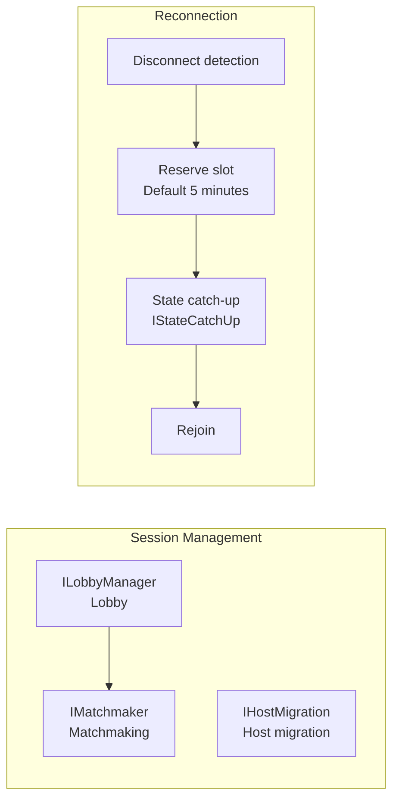
```mermaid
flowchart LR
    subgraph Session["Session Management"]
        Lobby["ILobbyManager</br>Lobby"]
        Match["IMatchmaker</br>Matchmaking"]
        Host["IHostMigration</br>Host migration"]
    end

    subgraph Reconnect["Reconnection"]
        Detect["Disconnect detection"]
        Reserve["Reserve slot</br>Default 5 minutes"]
        CatchUp["State catch-up</br>IStateCatchUp"]
        Rejoin["Rejoin"]
    end

    Lobby --> Match
    Detect --> Reserve --> CatchUp --> Rejoin
```

```csharp
// Reconnection manager
var reconnect = new ReconnectionManager(myStateCatchUpImpl);
reconnect.ReconnectWindow = 300f; // 5-minute window

reconnect.OnClientReconnected += (originalConnectionId, newConnection) =>
    Debug.Log($"Player reconnected. originalId={originalConnectionId}, newConn={newConnection.ConnectionId}");

reconnect.OnReconnectWindowExpired += originalConnectionId =>
    Debug.Log($"Reservation expired for {originalConnectionId}");
```

Interfaces: `ILobbyManager`, `IMatchmaker`, `IHostMigration`, `IReconnectionManager`.

---

### 13. Replay System

**Path**: `Runtime/Scripts/Replay/`

```csharp
// Recording
var recorder = new ReplayRecorder(keyframeInterval: 300);
recorder.StartRecording();
recorder.RecordFrame(tick, inputData);
recorder.RecordKeyframe(tick, fullState);
recorder.StopRecording();

// Playback
var player = new ReplayPlayer(recorder.GetAllFrames());
player.Play();
player.SetSpeed(2.0f);
player.Seek(targetTick);
player.Pause();

// Spectator mode (with delay)
var spectator = new SpectatorManager(delayTicks: 90); // 3s delay @30Hz
```

---

### 14. Network Spawning

**Path**: `Runtime/Scripts/Spawning/`

```csharp
var spawnManager = new NetworkSpawnManager(networkManager);
spawnManager.Spawn(prefabId: 1, position, rotation, ownerConnectionId);

spawnManager.OnSpawned += obj =>
    Debug.Log($"Spawned: NetworkId={obj.NetworkId}");

spawnManager.TransferOwnership(networkId, newOwnerConnectionId);
```

---

### 15. Scene Management

**Path**: `Runtime/Scripts/Scene/`

```csharp
var sceneManager = new NetworkSceneManager(networkManager);

sceneManager.ServerLoadScene("BattleArena");
sceneManager.ServerLoadScene("Dungeon_01", additive: true);
sceneManager.ServerLoadSceneForConnections("PrivateDungeon", new[] { conn1, conn2 });

sceneManager.OnSceneLoaded += sceneName => Debug.Log($"Loaded: {sceneName}");
```

---

### 16. Compression

**Path**: `Runtime/Scripts/Compression/`

```csharp
// Vector3 quantization (ZigZag + variable-length integer encoding)
var qv = QuantizedVector3.FromVector3(transform.position, precision: 100);
qv.WriteTo(writer);
Vector3 pos = QuantizedVector3.ReadFrom(reader).ToVector3(precision: 100);

// Quaternion smallest-three compression (4 bytes, 10 bits per component)
var qq = QuantizedQuaternion.FromQuaternion(transform.rotation);
```

---

### 17. Diagnostics

**Path**: `Runtime/Scripts/Diagnostics/`

```csharp
// Network profiler
var profiler = new NetworkProfiler();
profiler.RecordSend(msgId, byteCount);
profiler.Update(deltaTime);

var snapshot = profiler.TakeSnapshot();
Debug.Log($"Upload: {snapshot.BytesSentPerSecond} B/s");
Debug.Log($"Download: {snapshot.BytesReceivedPerSecond} B/s");

// Per-message-type stats
var stats = profiler.GetMessageStats(msgId);

// Network condition simulator (for testing)
var simulator = new NetworkConditionSimulator(realTransport);
simulator.ApplyPreset(NetworkConditionSimulator.Preset.Mobile4G);
// Presets: LAN, Broadband, WiFi, Mobile4G, Mobile3G, Satellite, Terrible

simulator.LatencyMs = 150;
simulator.JitterMs = 30;
simulator.PacketLossPercent = 5f;
simulator.Enabled = true;
```

---

### 18. Gameplay Abilities Integration

**Path**: 📦 **Separate Package** — `CycloneGames.Networking.GAS` (sibling directory)  
**Asmdef**: `CycloneGames.Networking.GAS`  
**Reference**: `CycloneGames.Networking.Runtime`  
**Namespace**: `CycloneGames.Networking.GAS`

> **Package structure**: This module is split into two layers.
>
> - `CycloneGames.Networking.GAS` — Protocol layer only: message IDs, `IAbilityNetAdapter` interface, `NetworkedAbilityBridge`, `AttributeSyncManager`, `EffectReplicationManager`. Has no dependency on any specific GAS implementation.
> - `CycloneGames.Networking.GAS.Integrations.GameplayAbilities` — Concrete wiring to `CycloneGames.GameplayAbilities`. Include this when using `CycloneGames.GameplayAbilities`; omit it for custom GAS implementations.

Deep integration with `CycloneGames.GameplayAbilities` for networked abilities, effects, and attributes.

> ⚠️ **Breaking Change**: GAS classes have been moved from core package to a separate package. Add a reference to `CycloneGames.Networking.GAS` in your asmdef.

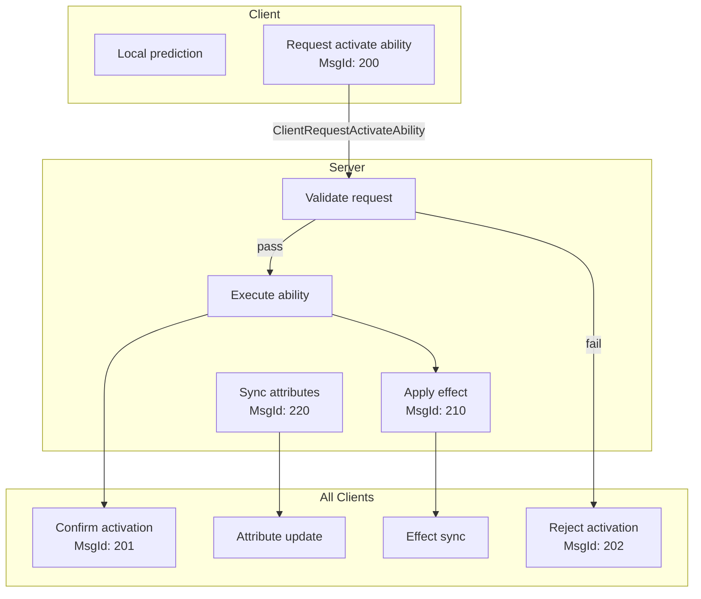
```mermaid
flowchart TB
    subgraph Client["Client"]
        PredictLocal["Local prediction"]
        Request["Request activate ability</br>MsgId: 200"]
    end

    subgraph Server["Server"]
        Validate["Validate request"]
        Execute["Execute ability"]
        ApplyEffect["Apply effect</br>MsgId: 210"]
        SyncAttr["Sync attributes</br>MsgId: 220"]
    end

    subgraph Clients["All Clients"]
        Confirm["Confirm activation</br>MsgId: 201"]
        Reject["Reject activation</br>MsgId: 202"]
        EffectSync["Effect sync"]
        AttrUpdate["Attribute update"]
    end

    Request -->|"ClientRequestActivateAbility"| Validate
    Validate -->|"pass"| Execute
    Validate -->|"fail"| Reject
    Execute --> Confirm
    Execute --> ApplyEffect
    ApplyEffect --> EffectSync
    SyncAttr --> AttrUpdate
```

```csharp
using CycloneGames.Networking.GAS; // 📦 Required: GAS separate package

var bridge = new NetworkedAbilityBridge(networkManager);
bridge.RegisterASC(networkId, ownerConnectionId, myASC);

// Optional: customize authorization for full-state requests (default: owner-only)
bridge.FullStateRequestAuthorizer = (sender, targetId) => sender.ConnectionId == ownerConnectionId;

// Recommended production policy: owner or current observer only
bridge.FullStateRequestAuthorizer = (sender, targetId) =>
{
    if (TryGetAscOwnerConnectionId(targetId, out int ascOwnerId) && sender.ConnectionId == ascOwnerId)
        return true;

    var observers = GetObservers(targetId);
    if (observers == null) return false;

    for (int i = 0; i < observers.Count; i++)
    {
        if (observers[i].ConnectionId == sender.ConnectionId)
            return true;
    }

    return false;
};

// Client: request ability activation
bridge.ClientRequestActivateAbility(
    abilityIndex: 1001,
    predictionKey: key,
    targetPos: targetPos,
    direction: direction,
    targetNetworkId: targetId
);

// Attribute sync
var attrSync = new AttributeSyncManager(bridge);
attrSync.RegisterPublicAttribute(healthAttrId);
attrSync.MarkDirty(networkId, healthAttrId, baseValue: 100f, currentValue: 75f);
attrSync.FlushDirty(getOwnerConnectionId: GetOwnerConnectionId, getObservers: GetObservers, getConnectionById: GetConnectionById);

// Effect replication
var effectRepl = new EffectReplicationManager(bridge);
int instanceId = effectRepl.OnEffectApplied(
    targetNetworkId,
    sourceNetworkId,
    effectDefinitionId,
    level,
    stackCount,
    duration,
    predictionKey: key,
    setByCallerEntries: null,
    getObservers: GetObservers
);
effectRepl.OnStackChanged(instanceId, newStackCount, GetObservers);
effectRepl.OnEffectRemoved(instanceId, GetObservers);
```

Production hardening recommendations (commonly used):

1. Rate-limit full-state requests per connection (for example, 1 request per 2-5 seconds).
2. Audit denied requests with sender, targetId, and reason.
3. Return redacted snapshots for observers (hide private attributes/effects).

```csharp
var fullStateLimiter = new TokenBucketRateLimiter(capacity: 2, refillPerSecond: 0.5f);

bridge.FullStateRequestAuthorizer = (sender, targetId) =>
{
    if (!fullStateLimiter.TryConsume(sender.ConnectionId, 1))
    {
        AuditSecurity("GAS.FullState.RateLimited", sender.ConnectionId, targetId);
        return false;
    }

    bool isOwner = TryGetAscOwnerConnectionId(targetId, out int ownerId) && sender.ConnectionId == ownerId;
    bool isObserver = IsObserver(sender.ConnectionId, targetId);
    bool allowed = isOwner || isObserver;

    if (!allowed)
        AuditSecurity("GAS.FullState.Unauthorized", sender.ConnectionId, targetId);

    return allowed;
};

// In your ASC implementation: return full snapshot for owner, redacted snapshot for observers.
```

| Message ID Range | Purpose                                            |
| ---------------- | -------------------------------------------------- |
| 200-204          | Ability activate / confirm / reject / end / cancel |
| 210-212          | Effect applied / removed / stack changed           |
| 220              | Attribute update                                   |
| 240-241          | Full state snapshot                                |

---

### 19. Authentication

**Path**: `Runtime/Scripts/Authentication/`

```csharp
public class MyAuthenticator : INetAuthenticator
{
    public void OnClientAuthenticate(INetConnection conn, ReadOnlySpan<byte> authData)
    {
        if (ValidateToken(authData))
            AcceptClient(conn);
        else
            RejectClient(conn, "Invalid token");
    }

    public void OnServerAuthenticate(INetConnection conn, ReadOnlySpan<byte> authData)
    {
        // Server-side authentication logic
    }
}
```

---

### 20. Platform Configuration

**Path**: `Runtime/Scripts/Platform/`

Auto-adjusts networking parameters per target platform.

```csharp
var config = NetworkPlatformConfig.GetForCurrentPlatform();
// Or manually: NetworkPlatformConfig.Android(), .PlayStation(), .WebGL(), etc.
```

| Platform | MTU  | Max Connections | IPv6 | WebSocket | Encryption |
| -------- | ---- | --------------- | ---- | --------- | ---------- |
| Windows  | 1200 | 200             | ✅   | ❌        | ❌         |
| WebGL    | 1200 | 1               | ❌   | ✅        | ❌         |
| iOS      | 1200 | 8               | ✅   | ❌        | ❌         |
| Android  | 1200 | 8               | ✅   | ❌        | ❌         |
| PS4/PS5  | 1200 | 100             | ✅   | ❌        | ✅         |
| Xbox     | 1200 | 100             | ✅   | ❌        | ✅         |
| Switch   | 1200 | 16              | ✅   | ❌        | ❌         |

---

### 21. Transport Adapters

**Path**: `Runtime/Scripts/Adapters/`

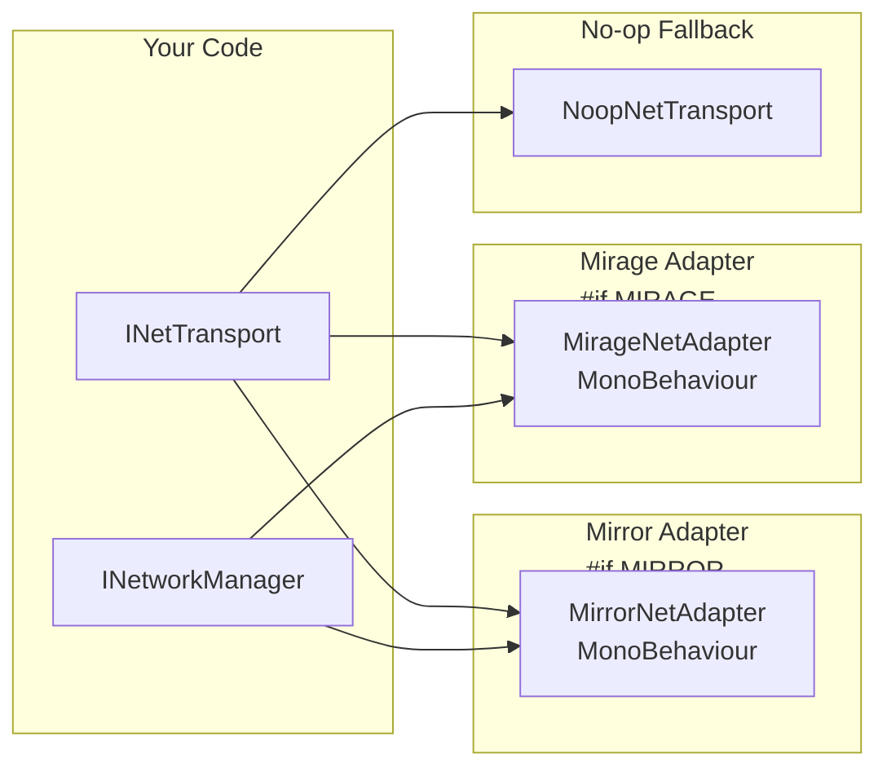
```mermaid
flowchart LR
    subgraph YourCode["Your Code"]
        INetTransport2["INetTransport"]
        INetworkManager2["INetworkManager"]
    end

    subgraph MirrorAdapter["Mirror Adapter</br>#if MIRROR"]
        MirrorNet["MirrorNetAdapter</br>MonoBehaviour"]
    end

    subgraph MirageAdapter["Mirage Adapter</br>#if MIRAGE"]
        MirageNet["MirageNetAdapter</br>MonoBehaviour"]
    end

    subgraph NoopAdapter["No-op Fallback"]
        Noop["NoopNetTransport"]
    end

    INetTransport2 --> MirrorNet
    INetTransport2 --> MirageNet
    INetTransport2 --> Noop
    INetworkManager2 --> MirrorNet
    INetworkManager2 --> MirageNet
```

| Adapter            | Define Symbol | Description                        |
| ------------------ | ------------- | ---------------------------------- |
| `MirrorNetAdapter` | `#if MIRROR`  | Mirror transport + manager adapter |
| `MirageNetAdapter` | `#if MIRAGE`  | Mirage transport + manager adapter |
| `NoopNetTransport` | _(always)_    | No-op fallback for testing         |

Both adapters implement `INetTransport` and `INetworkManager` simultaneously and register themselves with `NetServices` on `Awake`.

---

## Game Type Guide

Choose the right modules for your game:

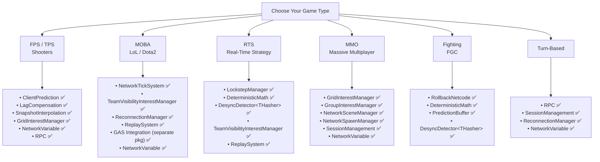
```mermaid
flowchart TB
    Start["Choose Your Game Type"] --> FPS
    Start --> MOBA
    Start --> RTS
    Start --> MMO
    Start --> Fighting
    Start --> TurnBased

    FPS["FPS / TPS</br>Shooters"]
    MOBA["MOBA</br>LoL / Dota2"]
    RTS["RTS</br>Real-Time Strategy"]
    MMO["MMO</br>Massive Multiplayer"]
    Fighting["Fighting</br>FGC"]
    TurnBased["Turn-Based"]

    FPS --> FPS_Modules["• ClientPrediction ✅</br>• LagCompensation ✅</br>• SnapshotInterpolation ✅</br>• GridInterestManager ✅</br>• NetworkVariable ✅</br>• RPC ✅"]

    MOBA --> MOBA_Modules["• NetworkTickSystem ✅</br>• TeamVisibilityInterestManager ✅</br>• ReconnectionManager ✅</br>• ReplaySystem ✅</br>• GAS Integration (separate pkg) ✅</br>• NetworkVariable ✅"]

    RTS --> RTS_Modules["• LockstepManager ✅</br>• DeterministicMath ✅</br>• DesyncDetector&lt;THasher&gt; ✅</br>• TeamVisibilityInterestManager ✅</br>• ReplaySystem ✅"]

    MMO --> MMO_Modules["• GridInterestManager ✅</br>• GroupInterestManager ✅</br>• NetworkSceneManager ✅</br>• NetworkSpawnManager ✅</br>• SessionManagement ✅</br>• NetworkVariable ✅"]

    Fighting --> Fighting_Modules["• RollbackNetcode ✅</br>• DeterministicMath ✅</br>• PredictionBuffer ✅</br>• DesyncDetector&lt;THasher&gt; ✅"]

    TurnBased --> Turn_Modules["• RPC ✅</br>• SessionManagement ✅</br>• ReconnectionManager ✅</br>• NetworkVariable ✅"]
```

| Game Type                 | Sync Model       | Core Modules                                                           | Latency Strategy                       |
| ------------------------- | ---------------- | ---------------------------------------------------------------------- | -------------------------------------- |
| FPS/TPS                   | State sync       | ClientPrediction + LagCompensation + SnapshotInterpolation             | Client prediction + server rewind      |
| MOBA (LoL/Dota2)          | State sync       | TeamVisibility + GAS + Reconnect + Replay                              | Server authority + interest management |
| RTS (C&C/StarCraft)       | Lockstep         | LockstepManager + FPInt64 + DesyncDetector\<THasher\> + TeamVisibility | Deterministic simulation               |
| MMO                       | State sync       | Grid/Group Interest + Scene + Spawn                                    | AOI culling                            |
| Fighting (Street Fighter) | Rollback         | RollbackNetcode + FPInt64                                              | GGPO rollback + replay                 |
| Turn-based                | Request/Response | RPC + Session                                                          | No real-time sync needed               |

---

## Tutorials

### Tutorial 1: FPS Network Sync from Scratch

```csharp
// Step 1: Define data structures
public struct FpsInput : IEquatable<FpsInput>
{
    public float MoveX, MoveZ;
    public bool Fire;
    public bool Equals(FpsInput other) =>
        MoveX == other.MoveX && MoveZ == other.MoveZ && Fire == other.Fire;
}

public struct FpsState : IEquatable<FpsState>
{
    public float X, Y, Z;
    public bool Equals(FpsState other) =>
        Math.Abs(X - other.X) < 0.01f && Math.Abs(Z - other.Z) < 0.01f;
}

// Step 2: Implement IPredictable
public class FpsPlayer : MonoBehaviour, IPredictable<FpsInput, FpsState>
{
    public float Speed = 5f;

    public FpsInput CaptureInput() => new FpsInput
    {
        MoveX = Input.GetAxis("Horizontal"),
        MoveZ = Input.GetAxis("Vertical"),
        Fire = Input.GetMouseButton(0)
    };

    public FpsState CaptureState() => new FpsState
    { X = transform.position.x, Y = transform.position.y, Z = transform.position.z };

    public void ApplyState(in FpsState state) =>
        transform.position = new Vector3(state.X, state.Y, state.Z);

    public void SimulateStep(in FpsInput input, float deltaTime) =>
        transform.position += new Vector3(input.MoveX, 0, input.MoveZ) * Speed * deltaTime;

    public bool StatesMatch(in FpsState a, in FpsState b) => a.Equals(b);
}

// Step 3: Wire it up
public class FpsNetworkController : MonoBehaviour
{
    ClientPredictionSystem<FpsInput, FpsState> _prediction;
    NetworkTickSystem _tickSystem;

    void Start()
    {
        var player = GetComponent<FpsPlayer>();
        _tickSystem = new NetworkTickSystem(60);
        _prediction = new ClientPredictionSystem<FpsInput, FpsState>(player);

        _tickSystem.OnTick += tick =>
        {
            _prediction.RecordPrediction(tick, _tickSystem.TickInterval);
            NetServices.Instance.SendToServer(2000, player.CaptureInput());
        };

        NetServices.Instance.RegisterHandler<FpsState>(2001, (conn, state) =>
            _prediction.ProcessServerState(_tickSystem.CurrentTick, state));
    }

    void Update() => _tickSystem.Update(Time.deltaTime);
}
```

### Tutorial 2: RTS Lockstep

```csharp
public struct RtsInput
{
    public int SelectedUnitId;
    public int TargetX, TargetY;
    public byte CommandType;
}

public class RtsNetworkController : MonoBehaviour
{
    LockstepManager<RtsInput> _lockstep;
    DesyncDetector _desyncDetector;

    void Start()
    {
        _desyncDetector = new DesyncDetector();
        _lockstep = new LockstepManager<RtsInput>(peerCount: 4, localPeerId: myId, inputDelay: 3);

        _lockstep.OnSimulateFrame += (frame, inputs) =>
        {
            // Deterministic simulation using fixed-point math
            foreach (var (peerId, input) in inputs)
            {
                var target = new FPVector3(
                    FPInt64.FromInt(input.TargetX), FPInt64.Zero, FPInt64.FromInt(input.TargetY));
                // Move unit deterministically...
            }

            _desyncDetector.BeginFrame(frame);
            // Hash state for desync detection
        };

        _lockstep.OnDesyncDetected += frame =>
            Debug.LogError($"Desync at frame {frame}!");
    }

    void FixedUpdate()
    {
        _lockstep.SubmitLocalInput(GetPlayerInput());
        _lockstep.Tick();
    }
}
```

### Tutorial 3: Team Visibility

```csharp
using CycloneGames.Networking.Interest;

public class TeamVisionController : MonoBehaviour
{
    TeamVisibilityInterestManager _visibility;

    void Start()
    {
        _visibility = new TeamVisibilityInterestManager(defaultDetectionRange: 30f);

        // Set teams
        _visibility.SetConnectionTeam(bluePlayer.ConnectionId, teamId: 1);
        _visibility.SetConnectionTeam(redPlayer.ConnectionId, teamId: 2);

        // Set entity detection range
        _visibility.SetEntityTeam(blueHero, teamId: 1);
        _visibility.SetEntityDetectionRange(blueHero, 25f);

        // Hidden unit
        _visibility.SetHidden(stealthUnit, true);
        // Invisible to enemies unless deep-reveal zone is nearby

        // Place reveal zone (deep-reveal)
        _visibility.AddRevealZone(wardPosition, radius: 15f, teamId: 1, isDeepReveal: true);
    }
}
```

---

## API Quick Reference

### Core

| Class/Interface   | Purpose         | Key Members                                                      |
| ----------------- | --------------- | ---------------------------------------------------------------- |
| `NetServices`     | Service locator | `Instance`, `Register`, `IsAvailable`                            |
| `INetTransport`   | Transport layer | `StartServer`, `Send`, `Broadcast`, `GetStatistics`              |
| `INetworkManager` | High-level API  | `RegisterHandler<T>`, `SendToServer<T>`, `BroadcastToClients<T>` |
| `INetConnection`  | Connection      | `ConnectionId`, `Ping`, `Quality`, `IsAuthenticated`             |

### Synchronization

| Class                         | Purpose            | Key Members                              |
| ----------------------------- | ------------------ | ---------------------------------------- |
| `NetworkTickSystem`           | Fixed-rate driver  | `Update(dt)`, `OnTick`, `TickRate`       |
| `ClientPredictionSystem<I,S>` | Client prediction  | `RecordPrediction`, `ProcessServerState` |
| `NetworkVariable<T>`          | Auto-sync variable | `Value`, `OnChanged`, `IsDirty`          |
| `RpcProcessor`                | RPC processor      | `Register<T>`, `Send<T>`                 |

### Deterministic

| Class                     | Purpose                           | Key Members                                   |
| ------------------------- | --------------------------------- | --------------------------------------------- |
| `LockstepManager<T>`      | Lockstep driver                   | `SubmitLocalInput`, `Tick`, `OnSimulateFrame` |
| `RollbackNetcode<I,S>`    | GGPO rollback                     | `AdvanceFrame`, `ReceiveConfirmedInput`       |
| `FPInt64`                 | Q32.32 fixed-point                | `FromFloat`, `ToFloat`, `Sqrt`                |
| `DesyncDetector<THasher>` | Desync detection (pluggable hash) | `BeginFrame`, `HashFPVector3`, `EndFrame`     |
| `DesyncDetector`          | Default (FNV-1a) alias            | `new DesyncDetector()`                        |
| `IStateHasher`            | Hash algorithm interface          | `Reset`, `HashInt`, `HashLong`, `GetDigest`   |
| `Fnv1aHasher`             | FNV-1a 64-bit (default)           | Built-in, zero-alloc                          |

### Interest Management

| Class                                | Best For                           |
| ------------------------------------ | ---------------------------------- |
| `GridInterestManager`                | Open world MMO                     |
| `GroupInterestManager`               | Dungeons, rooms                    |
| `TeamVisibilityInterestManager`      | MOBA, RTS                          |
| `CompositeInterestManager`           | Combine strategies                 |
| `BurstGridInterestManager`           | Open world MMO (5k+ entities, DOD) |
| `BurstTeamVisibilityInterestManager` | MOBA, RTS (5k+ entities, DOD)      |

### GAS Integration (📦 Separate Package: `CycloneGames.Networking.GAS`)

| Class                      | Purpose                                      |
| -------------------------- | -------------------------------------------- |
| `NetworkedAbilityBridge`   | Ability activation/confirm/reject networking |
| `AttributeSyncManager`     | Attribute dirty tracking & sync              |
| `EffectReplicationManager` | Effect instance replication                  |

---

## Directory Structure

```
Runtime/Scripts/
├── Core/                 # Core interfaces and types
├── Buffers/              # Buffer system and pool
├── Services/             # Service locator
├── Serialization/        # Serialization interfaces and factory
├── Serializers/          # Serializer adapter implementations
├── Simulation/           # Tick system and time sync
├── Prediction/           # Client prediction, interpolation, lag compensation
├── Interest/             # Interest management (Grid/Group/TeamVisibility/Composite)
├── StateSync/            # NetworkVariable state synchronization
├── Rpc/                  # RPC attributes and processor
├── Lockstep/             # Lockstep, fixed-point math, rollback, IStateHasher
├── Security/             # Rate limiter, message validator
├── Session/              # Lobby, matchmaking, reconnection
├── Replay/               # Recording and playback
├── Spawning/             # Network object spawning
├── Scene/                # Network scene management
├── Compression/          # Vector3/Quaternion compression
├── Diagnostics/          # Profiler, network condition simulator
├── Authentication/       # Authentication interface
├── Platform/             # Platform-specific configuration
├── Adapters/             # Mirror/Mirage adapters
└── Stubs/                # No-op implementations (testing)

DOD/Runtime/                      # Data-Oriented Design variants (Burst/Jobs)
├── BurstGridInterestManager.cs   # Sort-based spatial hash, NativeList + IntroSort
└── BurstTeamVisibilityInterestManager.cs  # Flat NativeList detection sources

📦 CycloneGames.Networking.GAS/    # GAS Integration (separate package)
└── Runtime/Scripts/
    ├── IAbilityNetAdapter.cs
    ├── NoopAbilityNetAdapter.cs
    ├── NetworkedAbilityBridge.cs
    ├── AttributeSyncManager.cs
    └── EffectReplicationManager.cs
```

---

## License

This project is licensed under the terms specified in the root LICENSE file.
