# CycloneGames.Networking

<div align="left">English | <a href="./README.SCH.md">简体中文</a></div>

A production-grade networking abstraction layer for Unity, designed for **zero-GC runtime performance**, **thread safety**, and **cross-platform compatibility**. It provides clean interfaces that decouple your gameplay code from specific networking implementations like Mirror or Nakama.

## Features

- **Flexible Serialization**: Pluggable serializers (Json, MessagePack, ProtoBuf, FlatBuffers) with cross-platform support
- **Clean Abstractions**: Transport-agnostic interfaces (`INetTransport`, `INetworkManager`, `INetConnection`)
- **Adapter Pattern**: Swap underlying transports (Mirror, Nakama, custom) without changing gameplay code
- **Thread Safety**: Cross-thread message queue with `ArrayPool` for safe off-main-thread sends
- **Comprehensive Diagnostics**: Connection quality metrics, statistics tracking, and error events

## Core Architecture

The framework is built upon several key components that work together to provide a comprehensive networking solution.


### 1. `NetServices` (Service Locator)

The static service locator provides global access to your active `INetworkManager`. Supports both Dependency Injection and Service Locator patterns.

```csharp
// Access via service locator
var net = NetServices.Instance;
net.SendToServer(1001, new MyMessage { Value = 42 });
```

### 2. `INetworkManager` (High-Level Interface)

The main interface for gameplay code. Handles message registration, typed serialization, and routing.

**Key Methods:**

- `RegisterHandler<T>()` - Register message handlers
- `SendToServer<T>()` / `SendToClient<T>()` - Send typed messages
- `BroadcastToClients<T>()` - Broadcast to all clients

### 3. `INetTransport` (Low-Level Interface)

The transport abstraction layer. Handles raw byte I/O, connection lifecycle, and transport-specific features.

**Key Properties:**

- `IsServer` / `IsClient` / `IsRunning`
- `Available` - Platform availability check
- `GetMaxPacketSize()` - Maximum payload size
- `GetStatistics()` - Transport diagnostics

### 4. `INetConnection` (Connection Representation)

Represents an individual network connection with comprehensive metrics.


### 5. Serialization System

The framework supports multiple serialization adapters with cross-platform compatibility:


## Dependencies

- `Mirror` (Optional, via conditional compilation `#if MIRROR`)
- `Nakama` (Planned, via conditional compilation)

## Quick Start Guide

### Step 1: Scene Setup (Mirror)

1. **Ensure Mirror is installed** in your project
2. **Add MirrorNetAdapter** to a GameObject in your scene:
   - Create a new GameObject named "NetworkManager"
   - Add the `MirrorNetAdapter` component
   - Configure your Mirror transport as usual

```csharp
// MirrorNetAdapter automatically registers itself on Awake
// Access via NetServices anywhere in your code
var net = NetServices.Instance;
```

### Step 2: Define Network Messages

```csharp
// ✅ Zero-GC message - only primitive types, no references
public struct PositionUpdate
{
    public int EntityId;
    public float X;
    public float Y;
    public float Z;
}

// ✅ Zero-GC message - fixed-size arrays are OK
public unsafe struct ChatMessage
{
    public int SenderId;
    public fixed char Content[64]; // Fixed buffer, no allocation
}

// ⚠️ NOT zero-GC - contains managed type (string)
// Use FallbackJsonSerializer for these
public struct PlayerInfo
{
    public int Id;
    // string is a reference type - causes allocation!
}
```

### Step 3: Register Message Handlers

```csharp
using CycloneGames.Networking;
using UnityEngine;

public class NetworkExample : MonoBehaviour
{
    // Message IDs - use constants for consistency
    private const ushort MSG_POSITION = 1001;
    private const ushort MSG_CHAT = 1002;

    private void Start()
    {
        var net = NetServices.Instance;

        // Register handlers for incoming messages
        net.RegisterHandler<PositionUpdate>(MSG_POSITION, OnPositionReceived);
        net.RegisterHandler<ChatMessage>(MSG_CHAT, OnChatReceived);
    }

    private void OnPositionReceived(INetConnection conn, PositionUpdate msg)
    {
        Debug.Log($"Player {conn.ConnectionId} moved to ({msg.X}, {msg.Y}, {msg.Z})");
        Debug.Log($"Connection quality: {conn.Quality}, Ping: {conn.Ping}ms");
    }

    private void OnChatReceived(INetConnection conn, ChatMessage msg)
    {
        // Handle chat message
    }

    private void OnDestroy()
    {
        var net = NetServices.Instance;
        net.UnregisterHandler(MSG_POSITION);
        net.UnregisterHandler(MSG_CHAT);
    }
}
```

### Step 4: Send Messages

```csharp
public class PlayerController : MonoBehaviour
{
    private const ushort MSG_POSITION = 1001;

    private void Update()
    {
        // Only send on input or position change
        if (PositionChanged())
        {
            SendPosition();
        }
    }

    private void SendPosition()
    {
        var net = NetServices.Instance;
        var pos = transform.position;

        // Send message using configured serializer (Json by default, MessagePack if available)
        net.SendToServer(MSG_POSITION, new PositionUpdate
        {
            EntityId = gameObject.GetInstanceID(),
            X = pos.x,
            Y = pos.y,
            Z = pos.z
        });
    }

    private bool PositionChanged() => true; // Your logic here
}
```

### Step 5: Server-Side Broadcasting

```csharp
public class GameServer : MonoBehaviour
{
    private const ushort MSG_SPAWN = 1003;

    private void Start()
    {
        var net = NetServices.Instance;

        // Listen for transport events
        net.Transport.OnClientConnected += OnClientConnected;
        net.Transport.OnClientDisconnected += OnClientDisconnected;
        net.Transport.OnError += OnNetworkError;
    }

    private void OnClientConnected(INetConnection conn)
    {
        Debug.Log($"Client connected: {conn.ConnectionId} from {conn.RemoteAddress}");

        // Send spawn message to all clients
        net.BroadcastToClients(MSG_SPAWN, new SpawnMessage
        {
            EntityId = conn.ConnectionId,
            X = 0, Y = 0, Z = 0
        });
    }

    private void OnClientDisconnected(INetConnection conn)
    {
        Debug.Log($"Client disconnected: {conn.ConnectionId}");
    }

    private void OnNetworkError(INetConnection conn, TransportError error, string message)
    {
        Debug.LogError($"Network error for {conn?.ConnectionId}: {error} - {message}");
    }
}
```

## Advanced Usage

### Using Pooled Buffers Directly

For maximum control over serialization:

```csharp
using CycloneGames.Networking;

public class AdvancedNetworking : MonoBehaviour
{
    private void SendCustomData()
    {
        // Get pooled buffer (zero-allocation)
        using (var buffer = NetworkBufferPool.Get())
        {
            // Write data manually
            buffer.WriteInt(42);
            buffer.WriteFloat(3.14f);
            buffer.WriteBlittable(new Vector3(1, 2, 3)); // Only unmanaged types!

            // Send raw bytes
            var transport = NetServices.Instance.Transport;
            int channelId = transport.GetChannelId(NetworkChannel.Reliable);
            transport.Send(connection, buffer.ToArraySegment(), channelId);
        }
        // Buffer automatically returned to pool on Dispose
    }
}
```

### Connection Quality Monitoring

```csharp
public class ConnectionMonitor : MonoBehaviour
{
    private void Update()
    {
        if (!NetServices.IsAvailable) return;

        var stats = NetServices.Instance.Transport.GetStatistics();

        // Display statistics
        Debug.Log($"Bytes Sent: {stats.BytesSent}");
        Debug.Log($"Bytes Received: {stats.BytesReceived}");
        Debug.Log($"Packets Sent: {stats.PacketsSent}");
        Debug.Log($"Active Connections: {stats.ConnectionCount}");
    }

    private void MonitorConnectionQuality(INetConnection conn)
    {
        switch (conn.Quality)
        {
            case ConnectionQuality.Excellent:
                // < 50ms RTT, very stable
                break;
            case ConnectionQuality.Good:
                // 50-100ms RTT
                break;
            case ConnectionQuality.Fair:
                // 100-200ms RTT
                break;
            case ConnectionQuality.Poor:
                // > 200ms RTT or unstable
                ShowWarning("Poor connection detected!");
                break;
        }

        // Jitter indicates connection stability
        if (conn.Jitter > 50)
        {
            ShowWarning("High jitter - consider reducing send rate");
        }
    }
}
```

### Serializer Adapters

The framework supports multiple serialization libraries via the adapter pattern. Each serializer is automatically enabled when its package is installed.

```mermaid
flowchart TB
    subgraph Core["Core Serializers"]
        Json["JsonSerializerAdapter<br/>✅ Always Available<br/>Unity JsonUtility"]
        NewtonsoftJson["NewtonsoftJsonSerializerAdapter<br/>📦 com.unity.nuget.newtonsoft-json<br/>Full JSON features"]
    end

    subgraph Binary["Binary Serializers"]
        MessagePack["MessagePackSerializerAdapter<br/>📦 com.github.messagepack-csharp"]
        ProtoBuf["ProtoBufSerializerAdapter<br/>📦 com.google.protobuf"]
        FlatBuffers["FlatBuffersSerializerAdapter<br/>📦 com.google.flatbuffers"]
    end

    subgraph Factory["SerializerFactory"]
        Create["Create(SerializerType)"]
        IsAvailable["IsAvailable(SerializerType)"]
        GetRecommended["GetRecommended()"]
    end

    Factory --> Core
    Factory --> Binary
```



#### Recommended Strategy

| Phase           | Serializer     | Reason                                             |
| --------------- | -------------- | -------------------------------------------------- |
| **Development** | NewtonsoftJson | Human-readable, easy debugging, full JSON features |
| **Production**  | MessagePack    | Binary format, smaller size, faster parsing        |

```csharp
// Configure based on build type
#if DEVELOPMENT_BUILD || UNITY_EDITOR
    adapter.SetSerializer(SerializerFactory.Create(SerializerType.NewtonsoftJson));
#else
    adapter.SetSerializer(SerializerFactory.GetRecommended()); // MessagePack if available
#endif
```

#### Using SerializerFactory

```csharp
using CycloneGames.Networking;

public class GameInitializer : MonoBehaviour
{
    private void Start()
    {
        // Check which serializers are available
        Debug.Log($"MessagePack: {SerializerFactory.IsAvailable(SerializerType.MessagePack)}");
        Debug.Log($"ProtoBuf: {SerializerFactory.IsAvailable(SerializerType.ProtoBuf)}");
        Debug.Log($"FlatBuffers: {SerializerFactory.IsAvailable(SerializerType.FlatBuffers)}");

        // Get recommended serializer (MessagePack > NewtonsoftJson > Json)
        INetSerializer serializer = SerializerFactory.GetRecommended();

        // Or create a specific serializer
        if (SerializerFactory.IsAvailable(SerializerType.MessagePack))
        {
            serializer = SerializerFactory.Create(SerializerType.MessagePack);
        }

        // Inject into adapter
        var adapter = FindObjectOfType<MirrorNetAdapter>();
        adapter.SetSerializer(serializer);
    }
}
```

#### MessagePack Integration

[MessagePack-CSharp](https://github.com/MessagePack-CSharp/MessagePack-CSharp) provides excellent performance with minimal allocations.

**Setup:**

1. Install `com.github.messagepack-csharp` package
2. The `MESSAGEPACK` define is automatically set
3. Add `[MessagePackObject]` attribute to your message types

```csharp
using MessagePack;

// MessagePack message definition
[MessagePackObject]
public struct PlayerState
{
    [Key(0)] public int PlayerId;
    [Key(1)] public float X;
    [Key(2)] public float Y;
    [Key(3)] public float Z;
    [Key(4)] public float Health;
}

// Usage
var serializer = SerializerFactory.Create(SerializerType.MessagePack);
adapter.SetSerializer(serializer);

// Now messages are serialized with MessagePack
net.SendToServer(1001, new PlayerState { PlayerId = 1, X = 10, Y = 0, Z = 5, Health = 100 });
```

#### ProtoBuf Integration (Planned)

[Protocol Buffers](https://developers.google.com/protocol-buffers) for schema-based serialization.

**Setup:**

1. Install Google.Protobuf package
2. Add `PROTOBUF` to Scripting Define Symbols
3. Define `.proto` schema and generate C# code with `protoc`

```protobuf
// player.proto
syntax = "proto3";
message PlayerState {
    int32 player_id = 1;
    float x = 2;
    float y = 3;
    float z = 4;
    float health = 5;
}
```

```csharp
// Generated code usage
var serializer = SerializerFactory.Create(SerializerType.ProtoBuf);
adapter.SetSerializer(serializer);
```

#### FlatBuffers Integration (Planned)

[FlatBuffers](https://google.github.io/flatbuffers/) for zero-copy deserialization.

**Setup:**

1. Install com.google.flatbuffers package
2. Add `FLATBUFFERS` to Scripting Define Symbols
3. Define `.fbs` schema and generate C# code with `flatc`

```csharp
// FlatBuffers provides zero-copy access to underlying buffer
using CycloneGames.Networking.Serializer.FlatBuffers;

// Wrap received buffer for zero-copy access
var byteBuffer = FlatBuffersSerializerAdapter.WrapBuffer(receivedData);
var playerState = PlayerState.GetRootAsPlayerState(byteBuffer);

// Access fields directly from buffer - no deserialization cost!
float x = playerState.X;
float y = playerState.Y;
```

#### Custom Serializer Implementation

If you need to integrate a different serialization library:

```csharp
public class MemoryPackSerializerAdapter : INetSerializer
{
    public void Serialize<T>(in T value, byte[] buffer, int offset, out int writtenBytes)
        where T : struct
    {
        var span = buffer.AsSpan(offset);
        writtenBytes = MemoryPackSerializer.Serialize(span, value);
    }

    public void Serialize<T>(in T value, INetWriter writer) where T : struct
    {
        // Use stackalloc for small messages
        Span<byte> temp = stackalloc byte[256];
        int written = MemoryPackSerializer.Serialize(temp, value);
        writer.WriteBytes(temp.Slice(0, written));
    }

    public T Deserialize<T>(ReadOnlySpan<byte> data) where T : struct
    {
        return MemoryPackSerializer.Deserialize<T>(data);
    }

    public T Deserialize<T>(INetReader reader) where T : struct
    {
        var span = reader.ReadBytesSpan(reader.Remaining);
        return Deserialize<T>(span);
    }
}

// Register custom serializer
adapter.SetSerializer(new MemoryPackSerializerAdapter());
```

#### Serializer Comparison

| Serializer         | Zero-GC | Format              | Speed  |  Size  | Cross-Platform | Best For                  |
| ------------------ | :-----: | ------------------- | :----: | :----: | :------------: | ------------------------- |
| **Json**           |   ❌    | Text                |   ⚡   | Large  |     ✅ All     | Simple structs            |
| **NewtonsoftJson** |   ❌    | Text                |   ⚡   | Large  |     ✅ All     | Development, debugging    |
| **MessagePack**    |  ✅\*   | Binary + Attributes |  ⚡⚡  | Small  |     ✅ All     | Production (recommended)  |
| **ProtoBuf**       |  ✅\*   | Binary + Schema     |  ⚡⚡  | Small  |     ✅ All     | Cross-language services   |
| **FlatBuffers**    |   ✅    | Binary + Schema     | ⚡⚡⚡ | Medium |     ✅ All     | Zero-copy, high-frequency |

> **Notes:**
>
> - \*With proper usage; complex types may have some allocations
> - **Cross-Platform**: All = Supports Unity/C#, Go, Rust, Java, Python, C++, etc.
> - **Json** uses Unity's JsonUtility (no Dictionary support)
> - **NewtonsoftJson** supports Dictionary, polymorphism, custom converters

## Transport Adapters

### Mirror Adapter

**Activation:**
Add `MIRROR` to your project's Scripting Define Symbols.

**Features:**

- Uses recommended serializer (MessagePack if available, else Json)
- Thread-safe message queue for cross-thread sends
- Full statistics tracking
- Error event forwarding

### Creating Custom Adapters

Implement `INetTransport` and `INetworkManager` for custom transports:

```csharp
public class CustomNetAdapter : MonoBehaviour, INetTransport, INetworkManager
{
    // Implement all interface members
    // Register with NetServices.Register(this) on Awake
}
```

## Best Practices

### 1. Message Design

```csharp
// ✅ DO: Use small, focused messages
public struct PositionUpdate
{
    public int EntityId;
    public float X, Y, Z;
} // 16 bytes

// ❌ DON'T: Create large monolithic messages
public struct BadGameState
{
    public fixed byte Data[4096]; // Too large, may exceed MTU
}
```

### 2. Send Rate Control

```csharp
private float _lastSendTime;
private const float SendInterval = 0.05f; // 20 Hz

private void Update()
{
    if (Time.time - _lastSendTime >= SendInterval)
    {
        SendPositionUpdate();
        _lastSendTime = Time.time;
    }
}
```

### 3. Error Handling

```csharp
private void Start()
{
    var transport = NetServices.Instance.Transport;
    transport.OnError += (conn, error, msg) =>
    {
        switch (error)
        {
            case TransportError.Timeout:
                AttemptReconnect();
                break;
            case TransportError.ConnectionClosed:
                ReturnToMainMenu();
                break;
        }
    };
}
```
