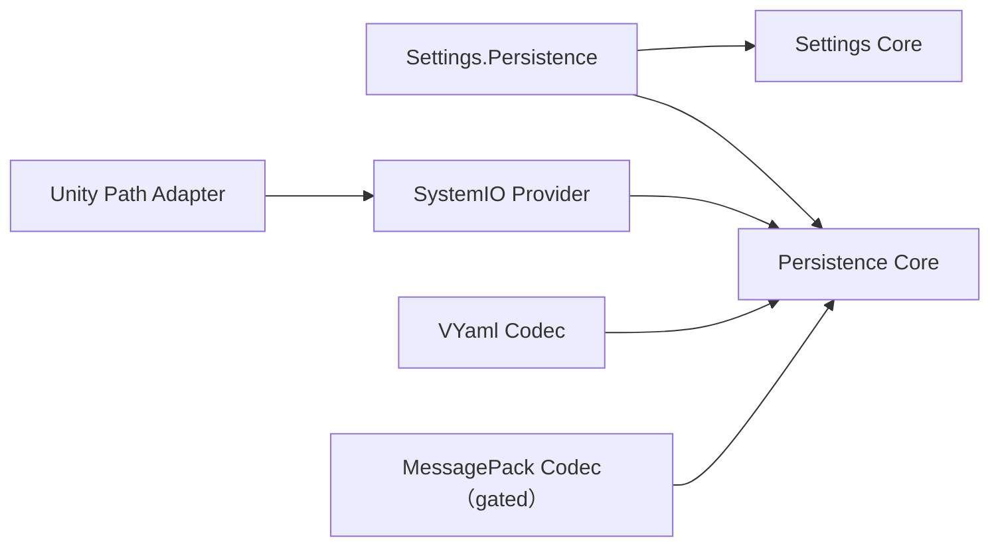

# ADR-001：Settings 与 Persistence 边界

- 状态：Accepted
- 范围：`CycloneGames.Persistence`、storage/codec provider、`CycloneGames.Settings` 与 `CycloneGames.Settings.Persistence`
- 兼容性：Breaking；不保留 prototype API 或旧磁盘格式 reader

## 背景

已退役的 Services package 同时承担内存设置所有权、validation、migration、serialization、文件 I/O、Unity path composition 和 prototype compatibility。这些职责具有不同依赖、失败行为、测试边界与发布压力。Prototype Persistence 还拆分了 length/read 操作、强制 codec 分配 exact array，并使用宽松格式识别。

## 决策

框架采用以下依赖方向：

- Settings Core 拥有经过 clone、validation 的内存状态和 schema-compatible forward migration，不理解 storage 或 serialization。
- Persistence Core 拥有一条有界、版本化 record 和 operation orchestration，不缓存业务状态，也不做业务 validation/migration。
- `Settings.Persistence` 是框架中唯一同时理解两个领域的 integration。
- Storage 与 codec 是可选 assembly 中的 adapter。Core 不引用 Unity、System.IO、VYaml、MessagePack 或 DI container。
- Record V1 固定使用 xxHash64 与 `identity/1`。Checksum 用于损坏检测，不用于真实性验证。
- `IPersistencePayloadTransform`、checksum strategy、cloud sync、slot、autosave、backup policy 和 Editor save browser 不属于本决策。

## 所有权与执行

- `IPersistenceStorage.ReadAsync` 把有界 byte array 所有权移交给 `PersistenceStore`；Store 在 parse/deserialize 后清零。
- `WriteAtomicallyAsync` 在 Task 完成前借用一份 exact record array；Store 随后清零。
- Codec 同步借用 value、buffer writer、payload memory 和 context，不能保留它们。
- 一个 Store 同时只允许一个 operation，并立即拒绝 overlap/reentrancy。它不创建 worker，也不捕获 Unity synchronization context。
- 一个 SettingsState 由唯一 composition owner 串行使用。它 clone 所有外部值，只提交通过 validation 的 candidate，并在 commit 后发布强类型通知。

## 性能与平台结果

- Buffered Record V1 是冷路径 O(n) 设计，payload hard ceiling 为 1 MiB。它不是 world snapshot streaming 格式，也不宣称每帧 zero allocation。
- SystemIO 使用异步分块传输，随后在 commit boundary 执行同步 durable flush 和 atomic move/replace。原子性与断电持久性仍取决于目标文件系统和平台。
- Core contract 不依赖 Unity。WebGL 和主机 save-data 必须由独立平台 provider 定义 quota、user、mount、suspend 和 commit 语义。
- 当前缺少 MessagePack NuGet binary/analyzer 与 Unity bridge，因此 MessagePack source 保持 assembly-gated；source presence 不等于 active support。

## 被拒绝方案

- 保留 Services compatibility facade：仓库内没有消费者，且它会延续错误依赖方向。
- 全局 Service Locator 或强制 DI container：composition 保持显式且与容器无关。
- 只有 Identity/xxHash64 一个实现时发布 transform/checksum strategy：这是投机性抽象，还会提高内存峰值。
- 用 `Task.Run` 包装文件 API：它隐藏阻塞并增加调度成本，不能改变 commit 语义。
- PlayerPrefs/EditorPrefs：record 需要可见 owner、limit、version、validation 和 recovery 行为。
- 提前创建 Protobuf、FlatBuffers、crypto、WebGL 或主机 package：等待真实消费者与平台契约。

## 迁移

仓库外消费者使用实际需要的 Settings、integration、codec 和 storage package 替换 `com.cyclone-games.service`，并重新编译所有 assembly/source consumer。Prototype record 会明确返回 `RecordFormatMismatch`；应用应删除这些文件，或在采用 Record V1 前执行由产品所有的一次性显式 import。
