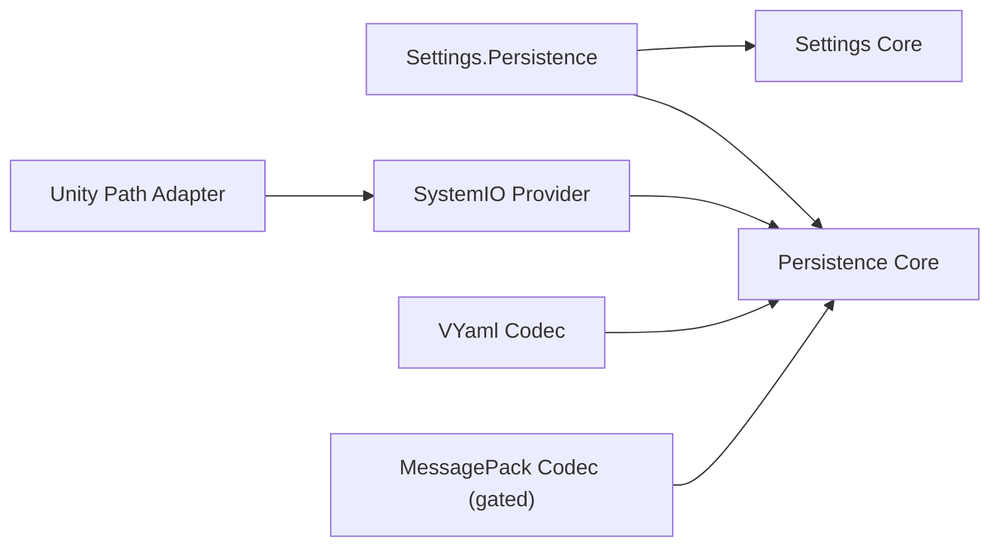

# ADR-001: Settings and Persistence Boundaries

- Status: Accepted
- Scope: `CycloneGames.Persistence`, storage/codec providers, `CycloneGames.Settings`, and `CycloneGames.Settings.Persistence`
- Compatibility: Breaking; no prototype API or disk-format reader is retained

## Context

The retired Services package combined in-memory settings ownership, validation, migration, serialization, file I/O, Unity path composition, and prototype compatibility. Those responsibilities have different dependencies, failure modes, test boundaries, and release pressure. The prototype Persistence API also split length/read operations, forced codecs to allocate exact arrays, and used permissive format detection.

## Decision

The framework uses these dependency directions:

- Settings Core owns cloned, validated in-memory state and schema-compatible forward migration. It does not know storage or serialization.
- Persistence Core owns one bounded, versioned record and operation orchestration. It does not cache application state or perform business validation/migration.
- `Settings.Persistence` is the only framework integration that understands both domains.
- Storage and codec implementations are adapters in optional assemblies. Core does not reference Unity, System.IO, VYaml, MessagePack, or a DI container.
- Record V1 fixes xxHash64 and `identity/1`. A checksum is corruption detection, not authentication.
- `IPersistencePayloadTransform`, a checksum strategy, cloud sync, slots, autosave, backup policy, and an Editor save browser are not part of this decision.

## Ownership and execution

- `IPersistenceStorage.ReadAsync` transfers ownership of a bounded byte array to `PersistenceStore`; Store clears it after parsing/deserialization.
- `WriteAtomicallyAsync` borrows one exact record array until its task completes; Store clears it afterward.
- Codecs synchronously borrow their value, buffer writer, payload memory, and contexts. They may not retain them.
- A Store permits one operation at a time and immediately rejects overlap/reentrancy. It creates no worker and does not capture a Unity synchronization context.
- A SettingsState has one composition owner. It clones every external value, commits only validated candidates, and publishes typed notifications after commit.

## Performance and platform consequences

- Buffered Record V1 is a cold-path, O(n) design with a 1 MiB hard payload ceiling. It is not a world-snapshot streaming format and does not claim per-frame zero allocation.
- SystemIO uses asynchronous chunk transfer, followed by synchronous durable flush and atomic move/replace at the commit boundary. Atomicity and power-loss durability still depend on the target file system and platform.
- Core contracts compile without Unity. WebGL and console save-data require platform providers with their own quota, user, mount, suspend, and commit semantics.
- MessagePack source remains assembly-gated while its NuGet binary/analyzer and Unity bridge are absent. Source presence is not reported as active support.

## Rejected alternatives

- Keeping Services as a compatibility facade: rejected because there are no repository consumers and it preserves the wrong dependency direction.
- A global Service Locator or mandatory DI container: rejected; composition remains explicit and container-neutral.
- A public transform/checksum strategy with only Identity/xxHash64: rejected as speculative and more memory-intensive.
- `Task.Run` around file APIs: rejected because it hides blocking and adds scheduling overhead without changing commit semantics.
- PlayerPrefs/EditorPrefs: rejected because records require visible ownership, limits, versioning, validation, and recovery behavior.
- Preemptive Protobuf, FlatBuffers, crypto, WebGL, or console packages: rejected until a real consumer and platform contract exist.

## Migration

External consumers replace `com.cyclone-games.service` with only the Settings, integration, codec, and storage packages they use. All assemblies and source consumers must recompile. Prototype record files are intentionally rejected as `RecordFormatMismatch`; applications delete them or perform an explicit product-owned one-time import before adopting Record V1.
