# CycloneGames.RPGFoundation.Interaction.Networking

[English](./README.md) | 简体中文

`CycloneGames.RPGFoundation.Interaction.Networking` 将 RPGFoundation Interaction 接入 `CycloneGames.Networking`。它定义与传输无关的 interaction request、cancel、result DTO，提供 network vector 转换 helper、authority validation helper 和消息 catalog 注册。

基础 Interaction 模块不依赖 `CycloneGames.Networking`。只有当 interaction request 或 result 需要跨 Cyclone 网络边界传递时，才需要引用本桥接包。

## 包结构

```text
CycloneGames.RPGFoundation.Interaction.Networking/
  Core/
    CycloneGames.RPGFoundation.Interaction.Networking.Core.asmdef
    InteractionNetworkAuthorityBridge.cs
    InteractionNetworkCancelRequest.cs
    InteractionNetworkProtocol.cs
    InteractionNetworkRequest.cs
    InteractionNetworkResult.cs
    InteractionNetworkVectorExtensions.cs
  Tests/Editor/
    CycloneGames.RPGFoundation.Interaction.Networking.Tests.Editor.asmdef
    InteractionNetworkingIntegrationTests.cs
```

## 程序集边界

| Assembly | 职责 | Unity 依赖 |
| --- | --- | --- |
| `CycloneGames.RPGFoundation.Interaction.Networking.Core` | Interaction DTO、vector conversion、authority bridge、message range 和 catalog registration。 | 无 |
| `CycloneGames.RPGFoundation.Interaction.Networking.Tests.Editor` | 覆盖 protocol 和 authority bridge 行为的 EditMode 测试。 | 无 |

Core assembly 引用 `CycloneGames.RPGFoundation.Interaction.Core` 和 `CycloneGames.Networking.Core`。它不引用 UnityEngine、后端 SDK 类型、PlayerSettings scripting define symbols 或特定 DI 容器。

Core 与 EditMode test assembly 都设置 `autoReferenced: false`。Consumer asmdef 必须显式引用 Core。无需 PlayerSettings scripting define。

## 核心概念

| 类型 | 作用 |
| --- | --- |
| `InteractionNetworkRequest` | 携带 interaction request 数据，以及以 `NetworkVector3` 表示的 instigator position。 |
| `InteractionNetworkCancelRequest` | 携带 request cancellation 数据。 |
| `InteractionNetworkResult` | 携带 success、cancel reason、validation failure、queue position 和 world id。 |
| `InteractionNetworkAuthorityBridge` | 使用 network DTO 调用 `InteractionAuthorityService`。 |
| `InteractionNetworkVectorExtensions` | 在 Interaction vectors 和 `NetworkVector3` 之间转换。 |
| `InteractionNetworkProtocol` | 拥有 Interaction 消息范围和 catalog descriptor。 |

## Request 流程

```mermaid
graph LR
    CoreRequest["InteractionRequest"]
    Mapper["InteractionNetworkRequest.From"]
    NetworkRequest["InteractionNetworkRequest"]
    Endpoint["INetworkMessageEndpoint"]
    Bridge["InteractionNetworkAuthorityBridge"]
    Authority["InteractionAuthorityService"]
    Result["InteractionNetworkResult"]

    CoreRequest --> Mapper
    Mapper --> NetworkRequest
    NetworkRequest --> Endpoint
    Endpoint --> Bridge
    Bridge --> Authority
    Authority --> Result
```



## 协议

`InteractionNetworkProtocol` 在共享 `NetworkMessageRanges.Module` 范围（`1000-29999`）内拥有 `13000-13999` 消息 ID。`CreateProtocolManifest` 构造完整 manifest，`RegisterMessageCatalog` / `TryRegisterMessageCatalog` 通过 `TryRegisterProtocolManifest` 提交它。Catalog 要么同时提交 range 和全部 descriptor，要么拒绝 manifest 且不留下部分注册。

每个 descriptor 都声明显式的可打印 ASCII `ContractId`，例如 `InteractionNetworkRequest:v1`。非零 `SchemaHash` 是该标识符原文的 FNV-1a 64-bit hash；manifest validation 会拒绝不匹配的组合。Protocol fingerprint 包含 range，以及每个 descriptor 的 message ID、contract identity、schema hash、channel 和 payload limit。CLR type name 与 reflection 不是协议 identity。Payload layout、codec 或语义兼容性变化必须分配新 contract identity，并在所有通信 peer 之间协调 `CurrentVersion` / `MinimumSupportedVersion`。必须在 gameplay traffic 前拒绝不兼容 peer。项目专用消息应放入独立的项目自有 manifest，并使用未占用的 `NetworkMessageRanges.User` 子范围；本模块不提供动态 descriptor 注册 facade。

| Message | ID | Channel | 作用 |
| --- | ---: | --- | --- |
| `REQUEST_MESSAGE_ID` | `13000` | Reliable | Interaction request。 |
| `RESULT_MESSAGE_ID` | `13001` | Reliable | Authority result。 |
| `CANCEL_REQUEST_MESSAGE_ID` | `13002` | Reliable | Pending interaction cancellation。 |
| `DETERMINISTIC_REQUEST_MESSAGE_ID` | `13003` | Reliable | Deterministic request entry point。 |

在 composition root 中注册协议：

```csharp
using CycloneGames.Networking;
using CycloneGames.RPGFoundation.Interaction.Networking;

public static class InteractionNetworkInstaller
{
    public static void Configure(INetworkMessageCatalog catalog)
    {
        InteractionNetworkProtocol.RegisterMessageCatalog(catalog);
    }
}
```

## Request 映射

在 adapter 边界将 Interaction core request 转换为 network request：

```csharp
using CycloneGames.Networking;
using CycloneGames.RPGFoundation.Interaction.Core;
using CycloneGames.RPGFoundation.Interaction.Networking;

public static class InteractionNetworkMapper
{
    public static InteractionNetworkRequest ToNetworkRequest(
        InteractionRequest request,
        InteractionVector3 instigatorPosition)
    {
        NetworkVector3 networkPosition = instigatorPosition.ToNetworkVector3();
        return InteractionNetworkRequest.From(request, networkPosition);
    }
}
```

通过 `InteractionAuthorityService` 验证或入队请求：

```csharp
using CycloneGames.RPGFoundation.Interaction.Core;
using CycloneGames.RPGFoundation.Interaction.Networking;

public sealed class InteractionAuthorityEndpoint
{
    private readonly InteractionNetworkAuthorityBridge _bridge;

    public InteractionAuthorityEndpoint(InteractionAuthorityService authority)
    {
        _bridge = new InteractionNetworkAuthorityBridge(authority);
    }

    public InteractionValidationResult Validate(InteractionNetworkRequest request, int serverTick)
    {
        return _bridge.Validate(request, serverTick);
    }
}
```

## 扩展点

- Connection ownership、authentication 和 backend identity mapping 放在接收网络请求的 adapter 中。
- 项目自有 interaction 消息通过独立的项目自有 manifest 注册，并使用未占用的 `NetworkMessageRanges.User` 子范围。
- 在 Interaction 模块内配置自定义 `InteractionAuthorityService`，再通过 `InteractionNetworkAuthorityBridge` 暴露给网络层。

## 持久化

本包不写入文件、资产、偏好设置、缓存或运行时存档。它只定义 value-type DTO、protocol metadata 和 authority bridge helper。

## 验证

修改本包后运行以下检查：

```text
Unity Test Runner > EditMode > CycloneGames.RPGFoundation.Interaction.Networking.Tests.Editor
Unity Test Runner > EditMode > CycloneGames.RPGFoundation.Interaction.Tests.Editor
Unity Test Runner > EditMode > CycloneGames.Networking.Tests.Editor
```
