# CycloneGames.RPGFoundation.Interaction.Networking

English | [Simplified Chinese](./README.SCH.md)

`CycloneGames.RPGFoundation.Interaction.Networking` connects RPGFoundation Interaction to `CycloneGames.Networking`. It defines transport-neutral interaction request, cancel, and result DTOs, network vector conversion helpers, authority validation helpers, and message catalog registration.

The base Interaction module remains usable without `CycloneGames.Networking`. This bridge is only required when interaction requests or results cross a Cyclone network boundary.

## Package Layout

```text
CycloneGames.RPGFoundation.Interaction.Networking/
  Core/
    CycloneGames.RPGFoundation.Interaction.Networking.Core.asmdef
    InteractionNetworkAuthorityBridge.cs
    InteractionNetworkCancelRequest.cs
    InteractionNetworkProtocol.cs
    InteractionNetworkRequest.cs
    InteractionNetworkResult.cs
    InteractionNetworkVectorExtensions.cs
  Tests/Editor/
    CycloneGames.RPGFoundation.Interaction.Networking.Tests.Editor.asmdef
    InteractionNetworkingIntegrationTests.cs
```

## Assembly Boundary

| Assembly | Role | Unity dependency |
| --- | --- | --- |
| `CycloneGames.RPGFoundation.Interaction.Networking.Core` | Interaction DTOs, vector conversion, authority bridge, message range, and catalog registration. | No |
| `CycloneGames.RPGFoundation.Interaction.Networking.Tests.Editor` | EditMode coverage for protocol and authority bridge behavior. | No |

The core assembly references `CycloneGames.RPGFoundation.Interaction.Core` and `CycloneGames.Networking.Core`. It does not reference UnityEngine, backend SDK types, PlayerSettings scripting define symbols, or a DI container.

## Core Concepts

| Type | Purpose |
| --- | --- |
| `InteractionNetworkRequest` | Carries interaction request data plus the instigator position as `NetworkVector3`. |
| `InteractionNetworkCancelRequest` | Carries request cancellation data. |
| `InteractionNetworkResult` | Carries success, cancel reason, validation failure, queue position, and world id. |
| `InteractionNetworkAuthorityBridge` | Calls `InteractionAuthorityService` using network DTOs. |
| `InteractionNetworkVectorExtensions` | Converts between Interaction vectors and `NetworkVector3`. |
| `InteractionNetworkProtocol` | Owns the Interaction message range and catalog descriptors. |

## Request Flow

```mermaid
graph LR
    CoreRequest["InteractionRequest"]
    Mapper["InteractionNetworkRequest.From"]
    NetworkRequest["InteractionNetworkRequest"]
    Manager["INetworkManager"]
    Bridge["InteractionNetworkAuthorityBridge"]
    Authority["InteractionAuthorityService"]
    Result["InteractionNetworkResult"]

    CoreRequest --> Mapper
    Mapper --> NetworkRequest
    NetworkRequest --> Manager
    Manager --> Bridge
    Bridge --> Authority
    Authority --> Result
```



## Protocol

`InteractionNetworkProtocol` owns message ids `13000-13999` in the Cyclone module range.

| Message | ID | Channel | Purpose |
| --- | ---: | --- | --- |
| `REQUEST_MESSAGE_ID` | `13000` | Reliable | Interaction request. |
| `RESULT_MESSAGE_ID` | `13001` | Reliable | Authority result. |
| `CANCEL_REQUEST_MESSAGE_ID` | `13002` | Reliable | Pending interaction cancellation. |
| `DETERMINISTIC_REQUEST_MESSAGE_ID` | `13003` | Reliable | Deterministic request entry point. |

Register the protocol in a composition root:

```csharp
using CycloneGames.Networking;
using CycloneGames.RPGFoundation.Interaction.Networking;

public static class InteractionNetworkInstaller
{
    public static void Configure(INetworkMessageCatalog catalog)
    {
        InteractionNetworkProtocol.RegisterMessageCatalog(catalog);
    }
}
```

## Request Mapping

Convert an Interaction core request into a network request at the adapter boundary:

```csharp
using CycloneGames.Networking;
using CycloneGames.RPGFoundation.Interaction.Core;
using CycloneGames.RPGFoundation.Interaction.Networking;

public static class InteractionNetworkMapper
{
    public static InteractionNetworkRequest ToNetworkRequest(
        InteractionRequest request,
        InteractionVector3 instigatorPosition)
    {
        NetworkVector3 networkPosition = instigatorPosition.ToNetworkVector3();
        return InteractionNetworkRequest.From(request, networkPosition);
    }
}
```

Validate or queue the request through `InteractionAuthorityService`:

```csharp
using CycloneGames.RPGFoundation.Interaction.Core;
using CycloneGames.RPGFoundation.Interaction.Networking;

public sealed class InteractionAuthorityEndpoint
{
    private readonly InteractionNetworkAuthorityBridge _bridge;

    public InteractionAuthorityEndpoint(InteractionAuthorityService authority)
    {
        _bridge = new InteractionNetworkAuthorityBridge(authority);
    }

    public InteractionValidationResult Validate(InteractionNetworkRequest request, int serverTick)
    {
        return _bridge.Validate(request, serverTick);
    }
}
```

## Extension Points

- Keep connection ownership, authentication, and backend identity mapping in the adapter that receives the network request.
- Register project-specific interaction messages in a project-owned `NetworkMessageKind.User` manifest.
- Use custom `InteractionAuthorityService` configuration in the Interaction module, then expose it through `InteractionNetworkAuthorityBridge`.

## Persistence

This package does not write files, assets, preferences, caches, or runtime save data. It only defines value-type DTOs, protocol metadata, and authority bridge helpers.

## Validation

Run these checks after changing the package:

```text
Unity Test Runner > EditMode > CycloneGames.RPGFoundation.Interaction.Networking.Tests.Editor
Unity Test Runner > EditMode > CycloneGames.RPGFoundation.Interaction.Tests.Editor
Unity Test Runner > EditMode > CycloneGames.Networking.Tests.Editor
```
