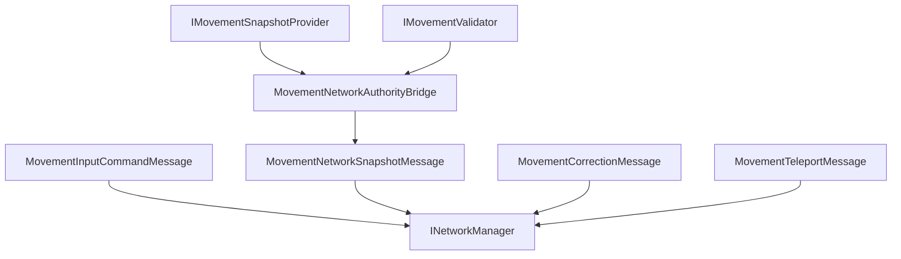

# CycloneGames.RPGFoundation.Movement.Networking

[English](./README.md) | 简体中文

`CycloneGames.RPGFoundation.Movement.Networking` 将 RPGFoundation Movement 接入 `CycloneGames.Networking`。它定义与传输无关的 movement input、authoritative snapshot、correction、teleport、full-state request、authority transfer 和 manifest handshake DTO。

基础 Movement 模块不依赖 `CycloneGames.Networking`。只有当 movement state 需要跨 Cyclone 网络边界传递时，才需要引用本桥接包。

## 包结构

```text
CycloneGames.RPGFoundation.Movement.Networking/
  Core/
    CycloneGames.RPGFoundation.Movement.Networking.Core.asmdef
    MovementAuthorityTransferMessage.cs
    MovementCorrectionMessage.cs
    MovementFullStateRequestMessage.cs
    MovementInputCommandMessage.cs
    MovementManifestHandshakeMessage.cs
    MovementNetworkAuthorityBridge.cs
    MovementNetworkProtocol.cs
    MovementNetworkSnapshotFlags.cs
    MovementNetworkSnapshotMessage.cs
    MovementNetworkVectorExtensions.cs
    MovementTeleportMessage.cs
  Tests/Editor/
    CycloneGames.RPGFoundation.Movement.Networking.Tests.Editor.asmdef
    MovementNetworkingIntegrationTests.cs
```

## 程序集边界

| Assembly | 职责 | Unity 依赖 |
| --- | --- | --- |
| `CycloneGames.RPGFoundation.Movement.Networking.Core` | Movement DTO、snapshot conversion、authority bridge、message range 和 protocol manifest registration。 | 不引用 UnityEngine；通过 Movement core 引用 `Unity.Mathematics`。 |
| `CycloneGames.RPGFoundation.Movement.Networking.Tests.Editor` | 覆盖 protocol 和 bridge 行为的 EditMode 测试。 | 不引用 UnityEngine |

Core assembly 引用 `CycloneGames.RPGFoundation.Movement.Core`、`CycloneGames.Networking.Core` 和 `Unity.Mathematics`。它不引用后端 SDK 类型、PlayerSettings scripting define symbols 或特定 DI 容器。

## 核心概念

| 类型 | 作用 |
| --- | --- |
| `MovementInputCommandMessage` | 携带 input intent、tick data、sequence、button mask、custom flags、move axes 和 aim direction。 |
| `MovementNetworkSnapshotMessage` | 携带由 `MovementSnapshot` 转换而来的 authoritative movement state。 |
| `MovementCorrectionMessage` | 携带 client reconciliation 所需的 correction 数据。 |
| `MovementTeleportMessage` | 携带 authoritative teleport 或 hard reset 数据。 |
| `MovementAuthorityTransferMessage` | 携带 movement authority transfer 数据。 |
| `MovementNetworkAuthorityBridge` | 通过 Movement core 接口 capture、apply、reset 和 validate movement snapshot。 |
| `MovementNetworkProtocol` | 拥有 Movement 消息范围和 protocol manifest。 |

## Movement Sync 流程



## 协议

`MovementNetworkProtocol` 在 Cyclone module range 中拥有 `16000-16999` 消息 ID。

| Message | ID | Channel | Payload |
| --- | ---: | --- | --- |
| `MSG_MANIFEST_HANDSHAKE` | `16000` | Reliable | `MovementManifestHandshakeMessage` |
| `MSG_INPUT_COMMAND` | `16001` | UnreliableSequenced | `MovementInputCommandMessage` |
| `MSG_AUTHORITATIVE_SNAPSHOT` | `16002` | UnreliableSequenced | `MovementNetworkSnapshotMessage` |
| `MSG_CORRECTION` | `16003` | Reliable | `MovementCorrectionMessage` |
| `MSG_FULL_STATE_REQUEST` | `16004` | Reliable | `MovementFullStateRequestMessage` |
| `MSG_AUTHORITY_TRANSFER` | `16005` | Reliable | `MovementAuthorityTransferMessage` |
| `MSG_TELEPORT` | `16006` | Reliable | `MovementTeleportMessage` |

在 composition root 中注册协议：

```csharp
using CycloneGames.Networking;
using CycloneGames.RPGFoundation.Movement.Networking;

public static class MovementNetworkInstaller
{
    public static void Configure(INetworkMessageCatalog catalog)
    {
        MovementNetworkProtocol.RegisterMessageCatalog(catalog);
    }
}
```

## Snapshot 流程

`MovementNetworkAuthorityBridge` 使用 `IMovementSnapshotProvider` 和可选 `IMovementValidator`：

```csharp
using CycloneGames.RPGFoundation.Movement.Core;
using CycloneGames.RPGFoundation.Movement.Networking;

public sealed class MovementSnapshotEndpoint
{
    private readonly MovementNetworkAuthorityBridge _bridge;

    public MovementSnapshotEndpoint(IMovementSnapshotProvider provider, IMovementValidator validator)
    {
        _bridge = new MovementNetworkAuthorityBridge(provider, validator);
    }

    public MovementNetworkSnapshotMessage Capture(ulong entityId, int serverTick, ushort sequence)
    {
        return _bridge.CaptureSnapshot(entityId, serverTick, sequence);
    }

    public bool Apply(MovementNetworkSnapshotMessage snapshot)
    {
        return _bridge.ApplySnapshot(snapshot);
    }
}
```

`ValidateTransition` 会通过可选 `IMovementValidator` 比较两个 network snapshot。

## Input Command 流程

`MovementInputCommandMessage` 使用 `ButtonMask` 和 `CustomFlags` 保持输入可扩展。项目 assembly 定义 bit 含义，并将本地输入转换成 DTO：

```csharp
using CycloneGames.Networking;
using CycloneGames.RPGFoundation.Movement.Networking;

public static class MovementInputFactory
{
    public const uint JumpButton = 1u << 0;

    public static MovementInputCommandMessage CreateJump(
        ulong entityId,
        int clientTick,
        int lastServerTick,
        ushort sequence,
        float deltaTime)
    {
        return new MovementInputCommandMessage(
            entityId,
            clientTick,
            lastServerTick,
            sequence,
            JumpButton,
            0u,
            deltaTime,
            new NetworkVector3(0f, 0f, 1f),
            new NetworkVector3(0f, 0f, 1f));
    }
}
```

## 扩展点

- 项目自有 movement verb 通过项目拥有的 `NetworkMessageKind.User` manifest 定义。
- 后端 connection、ownership 和 host/session 逻辑保留在 network adapter 中。
- `CustomFlags` 和项目自有 button mask 用于表达 generic DTO 字段之外的输入概念。

## 持久化

本包不写入文件、资产、偏好设置、缓存或运行时存档。它只定义 protocol metadata、value-type DTO 和 bridge helper。

## 验证

修改本包后运行以下检查：

```text
Unity Test Runner > EditMode > CycloneGames.RPGFoundation.Movement.Networking.Tests.Editor
Unity Test Runner > EditMode > CycloneGames.RPGFoundation.Movement.Tests.Editor
Unity Test Runner > EditMode > CycloneGames.Networking.Tests.Editor
```
