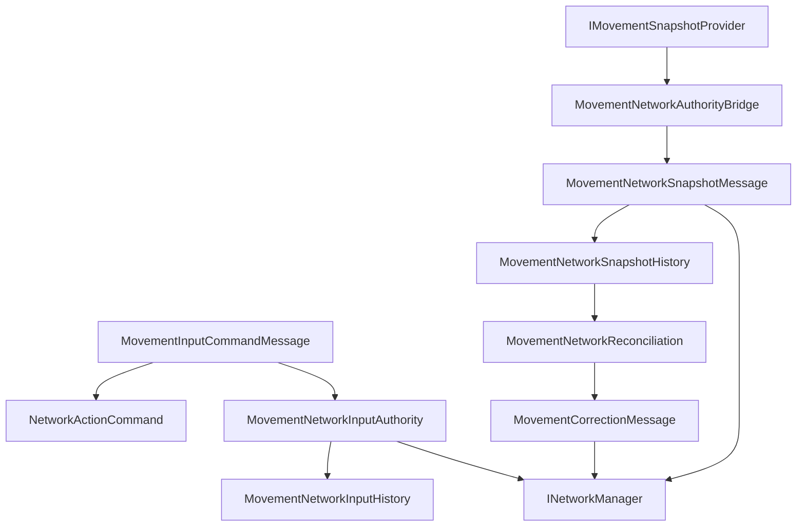

# CycloneGames.RPGFoundation.Movement.Networking

[English](./README.md) | 简体中文

`CycloneGames.RPGFoundation.Movement.Networking` 将 RPGFoundation Movement 接入 `CycloneGames.Networking`。它提供与传输层无关的移动输入、权威快照、纠正、传送、完整状态请求、权威转移、manifest handshake、输入权威校验、历史缓冲和 reconciliation helper。

基础 Movement 模块不依赖 `CycloneGames.Networking`。只有当移动状态需要跨 Cyclone 网络边界同步时，才需要引用本桥接包。

## 快速入门

1. 在 bootstrap 阶段把 `MovementNetworkProtocol` 注册到 network message catalog。
2. 将本地输入转换为 `MovementInputCommandMessage`，并写入稳定 tick、sequence、button mask 和 prediction key。
3. 在权威侧使用 `MovementNetworkInputAuthority` 和项目专属 `MovementNetworkInputValidationContext` 校验输入。
4. 通过 `MovementNetworkAuthorityBridge` 捕获权威 movement state。
5. 使用固定容量 history buffer 保存近期 input 和 snapshot，供 prediction、rewind、correction 和 late-join recovery 使用。
6. 当 predicted snapshot 与 authoritative snapshot 的偏差超过项目策略时，用 `MovementNetworkReconciliation` 生成 correction message。
7. 修改 DTO、validator、history 行为或 protocol metadata 后运行 Movement.Networking、Movement 和 Networking EditMode 测试。

## 包结构

```text
CycloneGames.RPGFoundation.Movement.Networking/
  Core/
    CycloneGames.RPGFoundation.Movement.Networking.Core.asmdef
    DefaultMovementNetworkInputValidator.cs
    IMovementNetworkInputValidator.cs
    MovementAuthorityTransferMessage.cs
    MovementCorrectionMessage.cs
    MovementFullStateRequestMessage.cs
    MovementInputCommandMessage.cs
    MovementManifestHandshakeMessage.cs
    MovementNetworkActionExtensions.cs
    MovementNetworkActionIds.cs
    MovementNetworkAuthorityBridge.cs
    MovementNetworkCorrectionPolicy.cs
    MovementNetworkInputAuthority.cs
    MovementNetworkInputHistory.cs
    MovementNetworkInputValidationContext.cs
    MovementNetworkProtocol.cs
    MovementNetworkReconciliation.cs
    MovementNetworkSnapshotFlags.cs
    MovementNetworkSnapshotHistory.cs
    MovementNetworkSnapshotMessage.cs
    MovementNetworkVectorExtensions.cs
    MovementTeleportMessage.cs
  Tests/Editor/
    CycloneGames.RPGFoundation.Movement.Networking.Tests.Editor.asmdef
    MovementNetworkingAuthorityTests.cs
    MovementNetworkingIntegrationTests.cs
```

## 程序集边界

| Assembly | 职责 | Unity 依赖 |
| --- | --- | --- |
| `CycloneGames.RPGFoundation.Movement.Networking.Core` | Movement DTO、snapshot conversion、authority bridge、input validation、history、reconciliation、message range 和 protocol manifest registration。 | 不引用 UnityEngine；通过 Movement core 引用 `Unity.Mathematics`。 |
| `CycloneGames.RPGFoundation.Movement.Networking.Tests.Editor` | 覆盖 protocol、bridge、validation、history 和 reconciliation 行为的 EditMode 测试。 | 不引用 UnityEngine。 |

Core assembly 引用 `CycloneGames.RPGFoundation.Movement.Core`、`CycloneGames.Networking.Core` 和 `Unity.Mathematics`。它不引用后端 SDK 类型、PlayerSettings scripting define symbols 或特定 DI 容器。

## 核心概念

| 类型 | 作用 |
| --- | --- |
| `MovementInputCommandMessage` | 携带 input intent、tick data、sequence、prediction key、button mask、custom flags、move axes 和 aim direction。 |
| `MovementNetworkSnapshotMessage` | 携带由 `MovementSnapshot` 转换而来的 authoritative movement state。 |
| `MovementCorrectionMessage` | 携带 client reconciliation 所需的 correction 数据。 |
| `MovementTeleportMessage` | 携带 authoritative teleport 或 hard reset 数据。 |
| `MovementAuthorityTransferMessage` | 携带 movement authority transfer 数据。 |
| `MovementNetworkAuthorityBridge` | 通过 Movement core 接口 capture、apply、reset 和 validate movement snapshot。 |
| `MovementNetworkActionExtensions` | 将 movement input DTO 映射为通用 `NetworkActionCommand`。 |
| `DefaultMovementNetworkInputValidator` | 校验 input shape、tick/sequence window、prediction key、button/custom flag mask、move axes 和 aim direction。 |
| `MovementNetworkInputAuthority` | 组合输入校验和固定容量历史，用 accepted input 拒绝 replayed duplicate。 |
| `MovementNetworkInputHistory` | 固定容量 per-entity input history，用于 replay、duplicate detection 和 reconciliation。 |
| `MovementNetworkSnapshotHistory` | 固定容量 per-entity authoritative snapshot history，用于 correction、full-state recovery 和 late join。 |
| `MovementNetworkReconciliation` | 当 predicted snapshot 与 authoritative snapshot 偏离时创建 correction message。 |
| `MovementNetworkProtocol` | 拥有 Movement message range 和 protocol manifest。 |

## Movement Sync 流程



## 协议

`MovementNetworkProtocol` 在 Cyclone module range 中拥有 `16000-16999` 消息 ID。

| Message | ID | Channel | Payload |
| --- | ---: | --- | --- |
| `MSG_MANIFEST_HANDSHAKE` | `16000` | Reliable | `MovementManifestHandshakeMessage` |
| `MSG_INPUT_COMMAND` | `16001` | UnreliableSequenced | `MovementInputCommandMessage` |
| `MSG_AUTHORITATIVE_SNAPSHOT` | `16002` | UnreliableSequenced | `MovementNetworkSnapshotMessage` |
| `MSG_CORRECTION` | `16003` | Reliable | `MovementCorrectionMessage` |
| `MSG_FULL_STATE_REQUEST` | `16004` | Reliable | `MovementFullStateRequestMessage` |
| `MSG_AUTHORITY_TRANSFER` | `16005` | Reliable | `MovementAuthorityTransferMessage` |
| `MSG_TELEPORT` | `16006` | Reliable | `MovementTeleportMessage` |

在 composition root 中注册协议：

```csharp
using CycloneGames.Networking;
using CycloneGames.RPGFoundation.Movement.Networking;

public static class MovementNetworkInstaller
{
    public static void Configure(INetworkMessageCatalog catalog)
    {
        MovementNetworkProtocol.RegisterMessageCatalog(catalog);
    }
}
```

## Snapshot 流程

`MovementNetworkAuthorityBridge` 使用 `IMovementSnapshotProvider` 和可选 `IMovementValidator`：

```csharp
using CycloneGames.RPGFoundation.Movement.Core;
using CycloneGames.RPGFoundation.Movement.Networking;

public sealed class MovementSnapshotEndpoint
{
    private readonly MovementNetworkAuthorityBridge _bridge;

    public MovementSnapshotEndpoint(IMovementSnapshotProvider provider, IMovementValidator validator)
    {
        _bridge = new MovementNetworkAuthorityBridge(provider, validator);
    }

    public MovementNetworkSnapshotMessage Capture(ulong entityId, int serverTick, ushort sequence)
    {
        return _bridge.CaptureSnapshot(entityId, serverTick, sequence);
    }

    public bool Apply(MovementNetworkSnapshotMessage snapshot)
    {
        return _bridge.ApplySnapshot(snapshot);
    }
}
```

`ValidateTransition` 会通过可选 `IMovementValidator` 比较两个 network snapshot。

## Input Command 流程

`MovementInputCommandMessage` 使用 `ButtonMask` 和 `CustomFlags` 保持输入可扩展。项目 assembly 定义 bit 含义，并将本地输入转换成 DTO：

```csharp
using CycloneGames.Networking;
using CycloneGames.RPGFoundation.Movement.Networking;

public static class MovementInputFactory
{
    public const uint JumpButton = 1u << 0;

    public static MovementInputCommandMessage CreateJump(
        ulong entityId,
        int clientTick,
        int lastServerTick,
        ushort sequence,
        float deltaTime)
    {
        return new MovementInputCommandMessage(
            entityId,
            clientTick,
            lastServerTick,
            sequence,
            JumpButton,
            0u,
            deltaTime,
            new NetworkVector3(0f, 0f, 1f),
            new NetworkVector3(0f, 0f, 1f),
            predictionKey: sequence);
    }
}
```

## Authority Validation 流程

Server-authoritative、owner-authoritative 和 client-predicted movement 可以使用同一个 validation 入口。validator 会把通用 timeline 校验委托给 `CycloneGames.Networking.Simulation` action contract，再执行 movement-specific 的 button mask、custom flag、move axes 和 aim direction 校验。

```csharp
using CycloneGames.Networking;
using CycloneGames.Networking.Simulation;
using CycloneGames.RPGFoundation.Movement.Networking;

public sealed class ServerMovementInputEndpoint
{
    private readonly MovementNetworkInputAuthority _authority =
        new MovementNetworkInputAuthority(new MovementNetworkInputHistory(capacity: 128));

    public bool TryAcceptInput(
        INetConnection sender,
        MovementInputCommandMessage command,
        NetworkTickId serverTick,
        NetworkTickId lastAcceptedClientTick,
        ushort lastAcceptedSequence)
    {
        var context = new MovementNetworkInputValidationContext(
            sender,
            serverTick,
            lastAcceptedClientTick,
            lastAcceptedSequence,
            maxAcceptedTickDrift: 8,
            allowedButtonMask: 0xFFFFu,
            allowedCustomFlags: 0x00FFu,
            maxMoveAxesMagnitude: 1.25f,
            requireNormalizedAimDirection: true);

        return _authority.TryAccept(command, context, out NetworkActionResult result)
               && result.IsAccepted;
    }
}
```

`MovementNetworkInputAuthority` 是输入接收边界。它负责校验并记录已接受 command；项目拥有的 server simulation 负责把 accepted command 应用到 movement state。

## Reconciliation 流程

Client 可以比较 predicted snapshot 和 authoritative snapshot，并在 drift 超出项目策略时创建 correction：

```csharp
MovementNetworkCorrectionPolicy policy = MovementNetworkCorrectionPolicy.Default;
if (MovementNetworkReconciliation.TryCreateCorrection(
        predictedSnapshot,
        authoritativeSnapshot,
        policy,
        out MovementCorrectionMessage correction))
{
    // Send correction through the project transport.
}
```

大位置误差会通过 `MovementNetworkSnapshotFlags.Teleport` 标记为 hard reset；较小误差保持 regular correction，方便 presentation code 平滑处理。

## 扩展点

- 项目自有 movement verb 通过项目拥有的 `NetworkMessageKind.User` manifest 定义。
- 后端 connection、ownership 和 host/session 逻辑保留在 network adapter 中。
- `CustomFlags` 和项目自有 button mask 用于表达 generic DTO 字段之外的输入概念。
- 当 ability tag、stamina、vehicle ownership、mounted state、anti-cheat rule 或平台特定 authority rule 必须在接受输入前检查时，提供项目自定义 `IMovementNetworkInputValidator`。
- 将 `MovementNetworkInputHistory` 和 `MovementNetworkSnapshotHistory` 与 `CycloneGames.Networking` 中的 generic rollback 或 prediction system 配合，用于需要 deterministic re-simulation 的游戏。

## 持久化

本包不写入文件、资产、偏好设置、缓存或运行时存档。它只定义 protocol metadata、value-type DTO、history buffer 和 bridge helper。History buffer 是运行时内存对象，由创建它的系统负责生命周期、清理和复用。

## 验证

修改本包后运行以下检查：

```text
Unity Test Runner > EditMode > CycloneGames.RPGFoundation.Movement.Networking.Tests.Editor
Unity Test Runner > EditMode > CycloneGames.RPGFoundation.Movement.Tests.Editor
Unity Test Runner > EditMode > CycloneGames.Networking.Tests.Editor
```

CLI 验证时，先让 Unity 刷新 generated project files，再编译：

```text
dotnet build UnityStarter/CycloneGames.RPGFoundation.Movement.Networking.Core.csproj --nologo
dotnet build UnityStarter/CycloneGames.RPGFoundation.Movement.Networking.Tests.Editor.csproj --nologo
```
