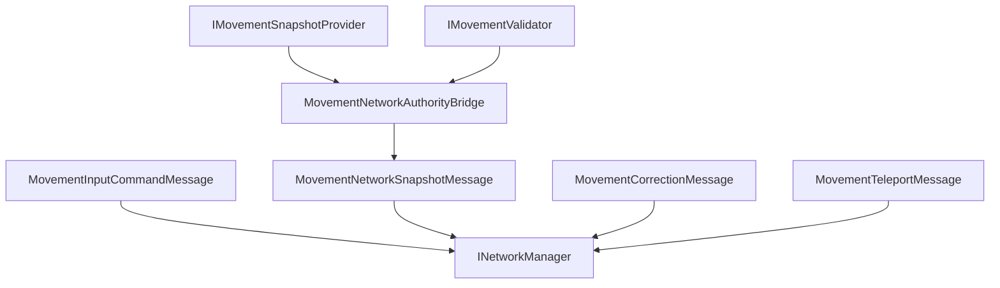

# CycloneGames.RPGFoundation.Movement.Networking

English | [Simplified Chinese](./README.SCH.md)

`CycloneGames.RPGFoundation.Movement.Networking` connects RPGFoundation Movement to `CycloneGames.Networking`. It defines transport-neutral movement input, authoritative snapshot, correction, teleport, full-state request, authority transfer, and manifest handshake DTOs.

The base Movement module remains usable without `CycloneGames.Networking`. This bridge is only required when movement state crosses a Cyclone network boundary.

## Quick Start

1. Register `MovementNetworkProtocol` in the network message catalog during bootstrap.
2. Convert local input into `MovementInputCommandMessage` values with stable ticks, sequence values, button masks, and prediction keys.
3. Validate incoming input on the authoritative side with `MovementNetworkInputAuthority` and a project-specific `MovementNetworkInputValidationContext`.
4. Capture authoritative movement state through `MovementNetworkAuthorityBridge`.
5. Store recent inputs and snapshots in the fixed-capacity history buffers used by prediction, rewind, correction, and late-join recovery.
6. Use `MovementNetworkReconciliation` to produce correction messages when predicted and authoritative snapshots diverge beyond project policy.
7. Run the Movement.Networking, Movement, and Networking EditMode tests after changing DTOs, validators, history behavior, or protocol metadata.

## Package Layout

```text
CycloneGames.RPGFoundation.Movement.Networking/
  Core/
    CycloneGames.RPGFoundation.Movement.Networking.Core.asmdef
    DefaultMovementNetworkInputValidator.cs
    IMovementNetworkInputValidator.cs
    MovementAuthorityTransferMessage.cs
    MovementCorrectionMessage.cs
    MovementFullStateRequestMessage.cs
    MovementInputCommandMessage.cs
    MovementNetworkActionExtensions.cs
    MovementNetworkActionIds.cs
    MovementManifestHandshakeMessage.cs
    MovementNetworkAuthorityBridge.cs
    MovementNetworkCorrectionPolicy.cs
    MovementNetworkInputAuthority.cs
    MovementNetworkInputHistory.cs
    MovementNetworkInputValidationContext.cs
    MovementNetworkProtocol.cs
    MovementNetworkReconciliation.cs
    MovementNetworkSnapshotHistory.cs
    MovementNetworkSnapshotFlags.cs
    MovementNetworkSnapshotMessage.cs
    MovementNetworkVectorExtensions.cs
    MovementTeleportMessage.cs
  Tests/Editor/
    CycloneGames.RPGFoundation.Movement.Networking.Tests.Editor.asmdef
    MovementNetworkingIntegrationTests.cs
```

## Assembly Boundary

| Assembly | Role | Unity dependency |
| --- | --- | --- |
| `CycloneGames.RPGFoundation.Movement.Networking.Core` | Movement DTOs, snapshot conversion, authority bridge, message range, and protocol manifest registration. | No UnityEngine; references `Unity.Mathematics` through Movement core. |
| `CycloneGames.RPGFoundation.Movement.Networking.Tests.Editor` | EditMode coverage for protocol and bridge behavior. | No UnityEngine |

The core assembly references `CycloneGames.RPGFoundation.Movement.Core`, `CycloneGames.Networking.Core`, and `Unity.Mathematics`. It does not reference backend SDK types, PlayerSettings scripting define symbols, or a DI container.

## Core Concepts

| Type | Purpose |
| --- | --- |
| `MovementInputCommandMessage` | Carries input intent, tick data, sequence, button mask, custom flags, move axes, and aim direction. |
| `MovementNetworkSnapshotMessage` | Carries authoritative movement state converted from `MovementSnapshot`. |
| `MovementCorrectionMessage` | Carries correction data for client reconciliation. |
| `MovementTeleportMessage` | Carries authoritative teleport or hard reset data. |
| `MovementAuthorityTransferMessage` | Carries movement authority transfer data. |
| `MovementNetworkAuthorityBridge` | Captures, applies, resets, and validates movement snapshots through Movement core interfaces. |
| `MovementNetworkActionExtensions` | Maps movement input DTOs to generic `NetworkActionCommand` values. |
| `DefaultMovementNetworkInputValidator` | Validates input shape, tick/sequence window, prediction key, button/custom flag masks, move axes, and aim direction. |
| `MovementNetworkInputAuthority` | Combines input validation with fixed-capacity history so accepted inputs can reject replayed duplicates. |
| `MovementNetworkInputHistory` | Fixed-capacity per-entity input history for replay, duplicate detection, and reconciliation. |
| `MovementNetworkSnapshotHistory` | Fixed-capacity per-entity authoritative snapshot history for correction, full-state recovery, and late joins. |
| `MovementNetworkReconciliation` | Creates correction messages when predicted and authoritative snapshots diverge. |
| `MovementNetworkProtocol` | Owns the Movement message range and protocol manifest. |

## Movement Sync Flow



## Protocol

`MovementNetworkProtocol` owns message ids `16000-16999` in the Cyclone module range.

| Message | ID | Channel | Payload |
| --- | ---: | --- | --- |
| `MSG_MANIFEST_HANDSHAKE` | `16000` | Reliable | `MovementManifestHandshakeMessage` |
| `MSG_INPUT_COMMAND` | `16001` | UnreliableSequenced | `MovementInputCommandMessage` |
| `MSG_AUTHORITATIVE_SNAPSHOT` | `16002` | UnreliableSequenced | `MovementNetworkSnapshotMessage` |
| `MSG_CORRECTION` | `16003` | Reliable | `MovementCorrectionMessage` |
| `MSG_FULL_STATE_REQUEST` | `16004` | Reliable | `MovementFullStateRequestMessage` |
| `MSG_AUTHORITY_TRANSFER` | `16005` | Reliable | `MovementAuthorityTransferMessage` |
| `MSG_TELEPORT` | `16006` | Reliable | `MovementTeleportMessage` |

Register the protocol in a composition root:

```csharp
using CycloneGames.Networking;
using CycloneGames.RPGFoundation.Movement.Networking;

public static class MovementNetworkInstaller
{
    public static void Configure(INetworkMessageCatalog catalog)
    {
        MovementNetworkProtocol.RegisterMessageCatalog(catalog);
    }
}
```

## Snapshot Workflow

`MovementNetworkAuthorityBridge` works with `IMovementSnapshotProvider` and optional `IMovementValidator`:

```csharp
using CycloneGames.RPGFoundation.Movement.Core;
using CycloneGames.RPGFoundation.Movement.Networking;

public sealed class MovementSnapshotEndpoint
{
    private readonly MovementNetworkAuthorityBridge _bridge;

    public MovementSnapshotEndpoint(IMovementSnapshotProvider provider, IMovementValidator validator)
    {
        _bridge = new MovementNetworkAuthorityBridge(provider, validator);
    }

    public MovementNetworkSnapshotMessage Capture(ulong entityId, int serverTick, ushort sequence)
    {
        return _bridge.CaptureSnapshot(entityId, serverTick, sequence);
    }

    public bool Apply(MovementNetworkSnapshotMessage snapshot)
    {
        return _bridge.ApplySnapshot(snapshot);
    }
}
```

`ValidateTransition` compares two network snapshots through the optional `IMovementValidator`.

## Input Command Workflow

`MovementInputCommandMessage` keeps input extensible with `ButtonMask` and `CustomFlags`. A project assembly defines the bit meanings and converts local input into the DTO:

```csharp
using CycloneGames.Networking;
using CycloneGames.RPGFoundation.Movement.Networking;

public static class MovementInputFactory
{
    public const uint JumpButton = 1u << 0;

    public static MovementInputCommandMessage CreateJump(
        ulong entityId,
        int clientTick,
        int lastServerTick,
        ushort sequence,
        float deltaTime)
    {
        return new MovementInputCommandMessage(
            entityId,
            clientTick,
            lastServerTick,
            sequence,
            JumpButton,
            0u,
            deltaTime,
            new NetworkVector3(0f, 0f, 1f),
            new NetworkVector3(0f, 0f, 1f),
            predictionKey: sequence);
    }
}
```

## Authority Validation Workflow

Server-authoritative, owner-authoritative, and client-predicted movement can use the same validation entry point. The validator delegates generic timeline checks to `CycloneGames.Networking.Simulation` action contracts, then applies movement-specific checks for button masks, custom flags, move axes, and aim direction.

```csharp
using CycloneGames.Networking;
using CycloneGames.Networking.Simulation;
using CycloneGames.RPGFoundation.Movement.Networking;

public sealed class ServerMovementInputEndpoint
{
    private readonly MovementNetworkInputAuthority _authority =
        new MovementNetworkInputAuthority(new MovementNetworkInputHistory(capacity: 128));

    public bool TryAcceptInput(
        INetConnection sender,
        MovementInputCommandMessage command,
        NetworkTickId serverTick,
        NetworkTickId lastAcceptedClientTick,
        ushort lastAcceptedSequence)
    {
        var context = new MovementNetworkInputValidationContext(
            sender,
            serverTick,
            lastAcceptedClientTick,
            lastAcceptedSequence,
            maxAcceptedTickDrift: 8,
            allowedButtonMask: 0xFFFFu,
            allowedCustomFlags: 0x00FFu,
            maxMoveAxesMagnitude: 1.25f,
            requireNormalizedAimDirection: true);

        return _authority.TryAccept(command, context, out NetworkActionResult result)
               && result.IsAccepted;
    }
}
```

`MovementNetworkInputAuthority` is the input acceptance boundary. It validates and records accepted commands; the project-owned server simulation applies accepted commands to movement state.

## Reconciliation Workflow

Clients can compare a predicted snapshot against an authoritative snapshot and request correction when the drift exceeds project policy:

```csharp
MovementNetworkCorrectionPolicy policy = MovementNetworkCorrectionPolicy.Default;
if (MovementNetworkReconciliation.TryCreateCorrection(
        predictedSnapshot,
        authoritativeSnapshot,
        policy,
        out MovementCorrectionMessage correction))
{
    // Send correction through the project transport.
}
```

Large position errors are marked as teleport-style hard resets through `MovementNetworkSnapshotFlags.Teleport`; smaller errors remain regular corrections so presentation code can smooth them.

## Extension Points

- Define project-specific movement verbs in a project-owned `NetworkMessageKind.User` manifest.
- Keep backend connection, ownership, and host/session logic in the network adapter.
- Use `CustomFlags` and project-owned button masks for input concepts not represented by the generic DTO fields.
- Supply a project-specific `IMovementNetworkInputValidator` when ability tags, stamina, vehicle ownership, mounted states, anti-cheat rules, or platform-specific authority rules must be checked before input is accepted.
- Pair `MovementNetworkInputHistory` and `MovementNetworkSnapshotHistory` with the generic rollback or prediction systems in `CycloneGames.Networking` for games that need deterministic re-simulation.

## Persistence

This package does not write files, assets, preferences, caches, or runtime save data. It only defines protocol metadata, value-type DTOs, and bridge helpers.

## Validation

Run these checks after changing the package:

```text
Unity Test Runner > EditMode > CycloneGames.RPGFoundation.Movement.Networking.Tests.Editor
Unity Test Runner > EditMode > CycloneGames.RPGFoundation.Movement.Tests.Editor
Unity Test Runner > EditMode > CycloneGames.Networking.Tests.Editor
```
