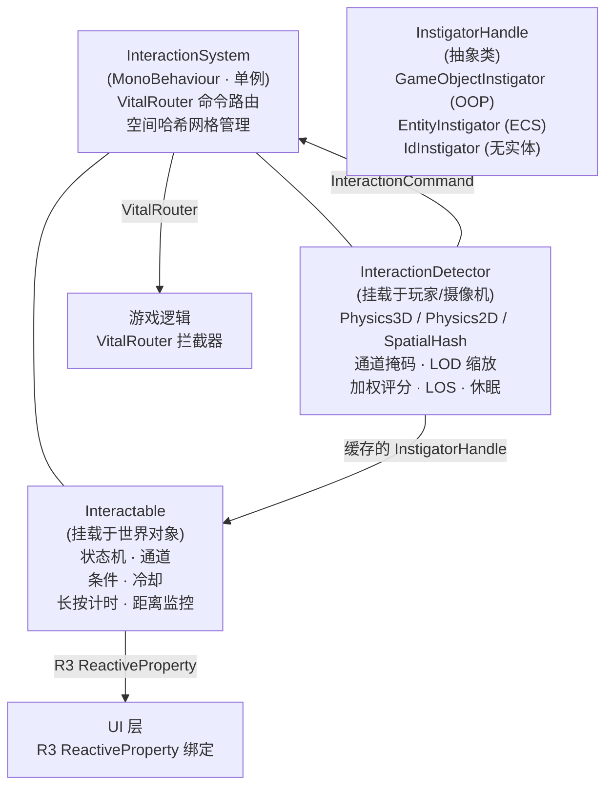
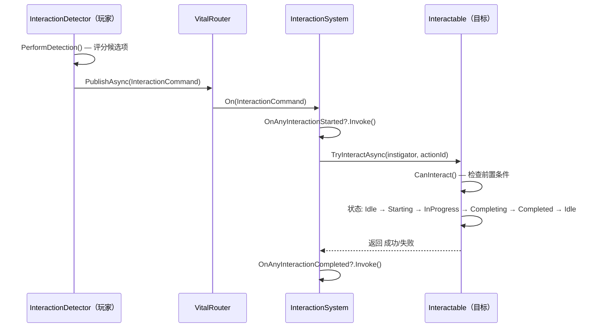
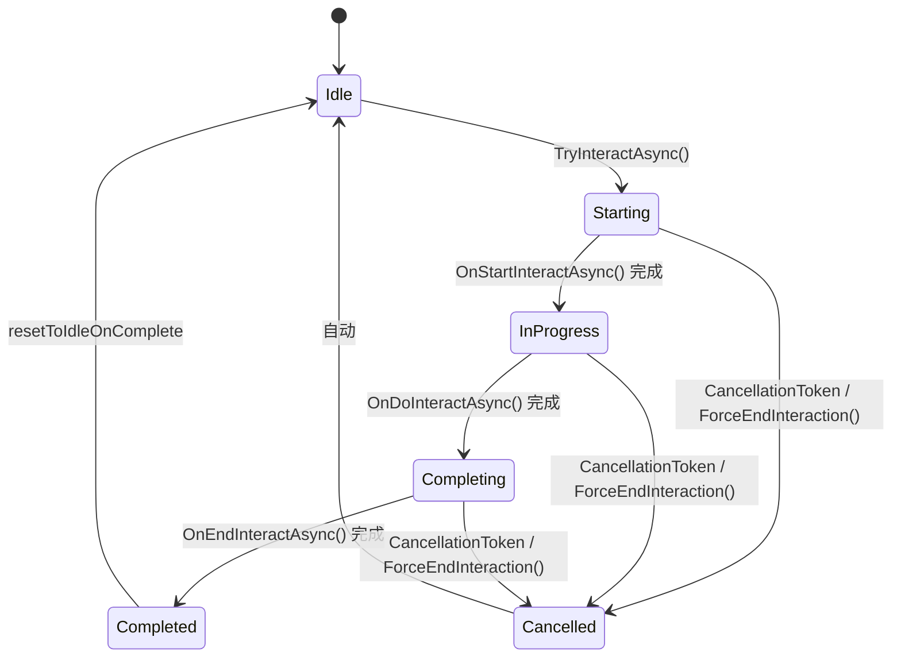

# RPG 交互模块

[**English**](README.md) | [**简体中文**]

高性能、零 GC、响应式的 Unity 交互系统。支持 **3D**、**2D** 和 **空间哈希** 三种检测模式，可轻松扩展至数千个可交互对象。基于 **R3**（响应式扩展）、**VitalRouter**（命令路由）和 **UniTask**（异步操作）构建。

> **生产说明:** 检测热路径在预热后按零 GC 或低 GC 设计。可取消的异步交互执行仍会为每次活动交互创建一个 `CancellationTokenSource`, 因此应把交互执行视为低 GC 控制路径, 而不是逐帧零 GC 扫描路径。

---

## 目录

- [RPG 交互模块](#rpg-交互模块)
  - [目录](#目录)
  - [特性概览](#特性概览)
  - [生产级大规模架构](#生产级大规模架构)
  - [架构总览](#架构总览)
  - [依赖项](#依赖项)
  - [快速上手](#快速上手)
    - [第 1 步 — 添加 InteractionSystem](#第-1-步--添加-interactionsystem)
    - [第 2 步 — 创建 Interactable](#第-2-步--创建-interactable)
    - [第 3 步 — 添加 InteractionDetector](#第-3-步--添加-interactiondetector)
    - [第 4 步 — 通过输入触发交互](#第-4-步--通过输入触发交互)
    - [第 5 步 — 显示提示 UI](#第-5-步--显示提示-ui)
  - [教程](#教程)
    - [教程 A — Physics3D 检测](#教程-a--physics3d-检测)
    - [教程 B — Physics2D 检测](#教程-b--physics2d-检测)
    - [教程 C — 空间哈希检测](#教程-c--空间哈希检测)
    - [教程 D — 运行时模式切换](#教程-d--运行时模式切换)
    - [检测模式对比](#检测模式对比)
  - [核心概念](#核心概念)
    - [交互生命周期](#交互生命周期)
    - [状态机](#状态机)
    - [检测模式](#检测模式)
    - [通道过滤](#通道过滤)
    - [评分算法](#评分算法)
    - [LOD 系统](#lod-系统)
    - [发起者系统](#发起者系统)
  - [组件参考](#组件参考)
    - [InteractionSystem](#interactionsystem)
    - [Interactable](#interactable)
    - [InteractionDetector](#interactiondetector)
  - [进阶用法](#进阶用法)
    - [自定义交互逻辑](#自定义交互逻辑)
    - [交互条件系统](#交互条件系统)
    - [双态交互](#双态交互)
    - [可拾取物品](#可拾取物品)
    - [多动作提示](#多动作提示)
    - [长按交互计时器](#长按交互计时器)
    - [距离自动取消](#距离自动取消)
    - [取消原因](#取消原因)
    - [发起者追踪](#发起者追踪)
    - [批量交互](#批量交互)
    - [全局交互事件](#全局交互事件)
    - [附近候选列表](#附近候选列表)
    - [交互进度](#交互进度)
    - [特效池系统](#特效池系统)
    - [VitalRouter 集成](#vitalrouter-集成)
    - [本地化](#本地化)
    - [R3 UI 绑定](#r3-ui-绑定)
  - [性能与安全](#性能与安全)
    - [零 GC 设计](#零-gc-设计)
    - [空间哈希网格（DOD）](#空间哈希网格dod)
    - [线程安全](#线程安全)
    - [内存安全](#内存安全)
    - [跨平台](#跨平台)
  - [编辑器工具](#编辑器工具)
  - [文件清单](#文件清单)
    - [运行时（54 个文件）](#运行时54-个文件)
    - [编辑器（8 个文件）](#编辑器8-个文件)
  - [API 参考](#api-参考)
    - [接口](#接口)
    - [类](#类)
    - [结构体](#结构体)
    - [枚举](#枚举)
  - [常见问题](#常见问题)

---

## 特性概览

| 类别                 | 说明                                                                                                          |
| -------------------- | ------------------------------------------------------------------------------------------------------------- |
| **多模式检测**       | Physics3D、Physics2D、SpatialHash — 适配任意游戏类型。                                                        |
| **响应式架构**       | R3 `ReactiveProperty` 驱动的事件化 UI 绑定。                                                                  |
| **VitalRouter 集成** | 带 World 作用域的命令路由，用于本地交互和网络 adapter 边界。                                                  |
| **LOD 检测**         | 自适应频率：近距高频、远距低频、无目标休眠。                                                                  |
| **通道过滤**         | 16 个语义无关的 Flag 通道槽位，游戏层通过常量别名自定义含义，实现选择性检测。                                 |
| **条件系统**         | 可插拔的 `IInteractionRequirement` 前置条件（钥匙、等级、任务状态等）。                                       |
| **加权评分**         | 目标选择综合距离、角度与可配置的优先级权重。                                                                  |
| **附近候选列表**     | 暴露所有评分候选项 — PUBG 风格拾取列表与手柄目标切换。                                                        |
| **交互进度**         | 连续 0–1 进度值用于定时/长按交互（进度条显示）。                                                              |
| **多动作提示**       | 单个可交互对象暴露多个动作（"E: 拾取 / F: 检查"）。                                                           |
| **发起者系统**       | `InstigatorHandle` 抽象类 — 支持 OOP（`GameObjectInstigator`）、ECS、无实体游戏及网络游戏，编译期零装箱保证。 |
| **稳定身份**         | 可选 `IInteractionStableIdentity` 与稳定请求/结果 ID，面向服务端权威多人、回放、存档和统计。                  |
| **长按交互**         | 内置 `holdDuration` 及自动进度上报。                                                                          |
| **距离自动取消**     | 发起者超出 `maxInteractionRange` 时自动取消交互。                                                             |
| **取消原因**         | 类型化的 `InteractionCancelReason` 枚举，用于玩法反馈。                                                       |
| **批量交互**         | `TryInteractAll()` 触发所有附近目标 — "拾取全部"机制。                                                        |
| **全局事件**         | `OnAnyInteractionStarted` / `OnAnyInteractionCompleted` 用于统计分析。                                        |
| **空间哈希网格**     | O(1) 空间分区，DOD SoA 布局 — 万级对象零 GC。                                                                 |
| **双态模式**         | 开关式交互（开/关、开门/关门）通过 `TwoStateInteractionBase` 实现。                                           |
| **特效池**           | 池创建和预热后低 GC 的 VFX 生成，自动回收入池。                                                               |
| **本地化就绪**       | `InteractionPromptData` 支持多语言提示文本。                                                                  |
| **编辑器工具**       | 自定义 Inspector、场景调试器、场景总览、验证窗口、Gizmos。                                                    |
| **跨平台**           | Windows、macOS、Linux、Android、iOS、WebGL、主机。无 `unsafe` 代码。                                          |

---

## 生产级大规模架构

本模块定位为商业项目中的本地交互内核。面向超大规模多人时，它应配合服务端权威 adapter 使用，而不是单独充当完整网络栈。

**模块核心已提供的职责：**

- 本地检测、评分、聚焦、提示数据、长按进度、取消和目标交互状态。
- 通过 `IInteractionStableIdentity.StableId` 和确定性的 `StableIdHash` 表达稳定目标身份。
- 通过 `InstigatorHandle.StableId` 表达稳定发起者身份；`GameObjectInstigator` 默认仍是本地身份，除非显式传入稳定 ID。
- 通过 `InteractionSystem.WorldId` 做 World 作用域路由，避免多交互世界加载时重复消费 `Router.Default` 命令。
- 带容量限制和重复请求拒绝的 `InteractionQueue`，供服务端权威 reservation/queue adapter 使用。
- 共享的 `InteractionRequestHistory` 重放防护，带容量上限，并同时供 float authority 和 deterministic authority 使用。
- 不依赖 Unity 的 `InteractionAuthorityService`，用于服务端请求校验：World 作用域、稳定 ID、tick 漂移、重复请求、重放历史压力、按发起者限流、action 可用性、目标可用性、距离检查和队列压力。
- `InteractionTargetSnapshot` 与 `InteractionVector3`，供不应依赖 `UnityEngine` 的 headless/server adapter 使用。
- `IInteractionPositionProvider` 用于可插拔位置来源，让 Networking、GameplayFramework、ECS 或后端 simulation 不必共享同一种具体向量类型，也能喂给权威校验。
- 面向 `CycloneGames.GameplayFramework.Runtime` 与 `CycloneGames.DeterministicMath.Core` 的可选桥接，以及面向 `CycloneGames.Networking.Core` 的独立 `CycloneGames.RPGFoundation.Interaction.Networking` 包，让 Mirror、Mirage、lockstep/rollback 或后端传输选择留在 Interaction 核心之外。
- `InteractionMetrics` / `InteractionMetricsSnapshot`，用于 accepted、rejected、queued、dropped、completed、failed 和 faulted 等生产可观测计数。
- 通过 `blockWhenLosBudgetExceeded` 提供 LOS 预算耗尽时的 fail-closed 行为。

**必须由游戏层或网络 adapter 承担的职责：**

- 将 `StableIdHash` 映射到权威网络实体、分片、场景或后端记录。
- 客户端预测、回滚、重对齐、延迟补偿和反作弊验证。
- 使用权威复制状态进行服务端 LOS、权限、冷却、背包、任务、战斗、反作弊和所有权验证。
- Mirror、Mirage、NGO、FishNet、自研 UDP 或后端服务的传输层序列化。
- 当场景对象重命名、复制或移动时，对稳定 ID 做持久化和迁移。

生产级多人推荐流程：

1. 客户端 detector 选择本地候选目标，发送带 `WorldId`、`TargetStableId`、`InstigatorStableId`、`ActionId` 和 `Tick` 的 `InteractionRequest`。
2. 服务端将稳定 ID 解析为权威实体，并更新 `InteractionTargetSnapshot` 记录。
3. 服务端使用权威发起者位置和 server tick 调用 `InteractionAuthorityService.ValidateRequest()` 或 `TryQueueRequest()`。
4. 游戏专属服务端代码验证 LOS、权限、冷却、所有权、背包和反作弊规则。
5. 服务端执行权威交互并广播 `InteractionResult`。
6. 客户端根据服务端结果对本地聚焦、进度和 UI 做重对齐。

内置 `INetworkInteractionSystem` 是 adapter 契约，`InteractionAuthorityService` 是校验/预约核心。Transport、prediction、rollback 和 replication 由独立网络 adapter 或项目 package 接入。

**集成边界：** `InteractionVector3` 是最低公共值对象，不是 `CycloneGames.Networking.NetworkVector3`、`CycloneGames.DeterministicMath.FPVector3` 或 `UnityEngine.Vector3` 的替代品。需要跨网络包时，添加独立的 `CycloneGames.RPGFoundation.Interaction.Networking` 包，在 `InteractionVector3` 与 `NetworkVector3` 之间转换，并使用 `InteractionNetworkProtocol`、`InteractionNetworkRequest`、`InteractionNetworkCancelRequest` 与 `InteractionNetworkResult` 作为更适合传输的 DTO/协议构件。需要接入 GameplayFramework 时，使用 `CycloneGames.RPGFoundation.Runtime.Interaction.Integrations.GameplayFramework` 将 `Actor` 的位置与稳定 ID 适配为 `InteractionTargetSnapshot` 或 `GameObjectInstigator`。如果需要 lockstep、rollback、replay 或 bit-identical server simulation，应使用 `CycloneGames.RPGFoundation.Runtime.Interaction.Integrations.DeterministicMath` 与 `InteractionDeterministicAuthorityService`；它使用 `FPVector3` / `FPInt64` 做范围校验，而不是把权威判定转换回 float。

**确定性权威位置策略：** 当 Networking、GameplayFramework 与 DeterministicMath 同时启用时，权威交互位置必须来自驱动移动的同一份 fixed-point simulation state。`InteractionVector3`、`NetworkVector3`、`UnityEngine.Vector3` 和 `Actor.GetActorLocation()` 适合展示、本地预测、Editor 工具和非确定性 server adapter；它们不是 lockstep、rollback、replay 或反作弊判定的 canonical source。

| 场景 | 应使用 | 不应作为权威源 |
| --- | --- | --- |
| 本地单机或非确定性服务端 | `InteractionVector3`、`InteractionAuthorityService` | - |
| 普通网络传输 DTO | 带 `NetworkVector3` 的 `InteractionNetworkRequest` | 除非 transport 支持 raw fixed payload，否则不要混入 `FPVector3` |
| 确定性多人、rollback、replay 或权威 simulation | `InteractionDeterministicRequestPayload`、`InteractionDeterministicVector3Payload`、`InteractionDeterministicAuthorityService`、`FPVector3` | `NetworkVector3`、`InteractionVector3`、`Actor.GetActorLocation()` |
| 确定性 GameplayFramework Actor | 显式 `IInteractionDeterministicPositionProvider` + `GameplayFrameworkDeterministicInteractionExtensions` | 从 `Actor.transform.position` 隐式转换 |
| UI、调试、统计或结果展示 | `FPVector3.ToInteractionVector3()` 作为展示转换 | 把转换后的 float 再喂回权威判定 |

CycloneGames integration 通过独立 asmdef 或独立可选包隔离。Interaction 的 Cyclone networking 桥接位于 `CycloneGames.RPGFoundation.Interaction.Networking`，不需要 PlayerSettings scripting define symbols。包内其余 integration 使用自己的 assembly reference，不应通过项目级全局 scripting define symbol 启用。

---

## 架构总览



**数据流：**



---

## 依赖项

| 包                               | 用途                                                     | 是否必需 |
| -------------------------------- | -------------------------------------------------------- | -------- |
| **R3**                           | 响应式属性与可观察对象，用于 UI 绑定                     | 是       |
| **VitalRouter**                  | 命令路由与拦截器管线                                     | 是       |
| **UniTask**                      | Unity 主线程上的零分配 async/await                       | 是       |
| **CycloneGames.Factory.Runtime** | 对象池（`ObjectPool`、`IPoolable`、`MonoPrefabFactory`） | 是       |
| **CycloneGames.RPGFoundation.Interaction.Networking** | 可选 `NetworkVector3` 与 DTO 桥，用于 transport adapter  | 可选     |
| **CycloneGames.GameplayFramework.Runtime** | 可选 `Actor` / World adapter 桥                | 可选     |
| **CycloneGames.DeterministicMath.Core** | 可选 `FPVector3` / `FPInt64` 权威校验桥，用于 lockstep、rollback 和 replay | 可选     |

---

## 快速上手

### 第 1 步 — 添加 InteractionSystem

在场景中创建一个空 GameObject，添加 `InteractionSystem` 组件。

| Inspector 字段 | 类型    | 默认值  | 说明                                                              |
| -------------- | ------- | ------- | ----------------------------------------------------------------- |
| **World Id**   | `int`   | `0`     | 本地交互世界作用域。分屏、additive scene、预测世界或服务端模拟应使用唯一值。 |
| **Is 2D Mode** | `bool`  | `false` | 2D 游戏设为 `true`（X/Y 哈希），3D 游戏设为 `false`（X/Z 哈希）。 |
| **Cell Size**  | `float` | `10`    | 空间哈希单元格大小。越大 = 单元格越少，越小 = 查询越精细。        |

### 第 2 步 — 创建 Interactable

给任意世界对象添加 `Interactable`（或其子类）组件。

| Inspector 字段            | 类型                 | 默认值       | 说明                                              |
| ------------------------- | -------------------- | ------------ | ------------------------------------------------- |
| **Stable Id**             | `string`             | `""`         | 面向多人、存档、回放和统计的稳定 authoring ID。   |
| **Interaction Prompt**    | `string`             | `"Interact"` | 显示给玩家的 UI 提示文本。                        |
| **Is Interactable**       | `bool`               | `true`       | 该对象是否接受交互。                              |
| **Auto Interact**         | `bool`               | `false`      | 检测到时自动触发交互（无需输入）。                |
| **Priority**              | `int`                | `0`          | 越高 = 评分算法越优先选择。                       |
| **Interaction Distance**  | `float`              | `2`          | 距检测器的最大检测距离。                          |
| **Interaction Point**     | `Transform`          | `null`       | 覆盖的检测位置（默认使用 `transform.position`）。 |
| **Channel**               | `InteractionChannel` | `Channel0`   | 分类标记，用于选择性检测。                        |
| **Interaction Cooldown**  | `float`              | `0`          | 两次交互之间的冷却时间（秒）。                    |
| **Hold Duration**         | `float`              | `0`          | 玩家需长按的时间（秒），0 = 即时交互。            |
| **Max Interaction Range** | `float`              | `0`          | 交互过程中的自动取消距离，0 = 不限制。            |

**前提条件：** 在同一 GameObject（或子物体）上添加 `Collider`（3D）或 `Collider2D`（2D），并设为 **Is Trigger = true**。将图层设置为与检测器的 **Interactable Layer** 掩码匹配。

**组件职责：** 每个目标 GameObject 只保留一个 `IInteractable` 实现。不要把 `Interactable` 和 `PickableItem` 或其他 `Interactable` 子类同时挂在一起。`InteractionSystem` 应放在场景/world 根对象，`InteractionDetector` 应放在玩家、摄像机、AI 控制器或传感器等发起者侧对象，`PooledEffect` 应放在特效 prefab 或特效实例上。

### 第 3 步 — 添加 InteractionDetector

在玩家或摄像机上添加 `InteractionDetector` 组件。

| Inspector 字段         | 类型                 | 默认值        | 说明                                             |
| ---------------------- | -------------------- | ------------- | ------------------------------------------------ |
| **Detection Mode**     | `DetectionMode`      | `Physics3D`   | 选择 `Physics3D`、`Physics2D` 或 `SpatialHash`。 |
| **Detection Radius**   | `float`              | `3`           | 检测原点的扫描半径。                             |
| **Interactable Layer** | `LayerMask`          | —             | 要扫描的物理图层（务必设置！）。                 |
| **Obstruction Layer**  | `LayerMask`          | `1`           | 阻挡视线的图层。                                 |
| **Detection Offset**   | `Vector3`            | `(0, 1.5, 0)` | 相对原点的偏移（如眼睛高度）。                   |
| **Max Interactables**  | `int`                | `64`          | 重叠查询的预分配缓冲区大小。                     |
| **Channel Mask**       | `InteractionChannel` | `All`         | 要检测的通道。                                   |
| **Distance Weight**    | `float`              | `1`           | 距离评分权重。                                   |
| **Angle Weight**       | `float`              | `2`           | 朝向角度评分权重。                               |
| **Priority Weight**    | `float`              | `100`         | `Priority` 字段的评分权重。                      |

### 第 4 步 — 通过输入触发交互

```csharp
using UnityEngine;
using UnityEngine.InputSystem;

public class PlayerInteraction : MonoBehaviour
{
    [SerializeField] private InteractionDetector detector;

    void Update()
    {
        if (Keyboard.current.eKey.wasPressedThisFrame)
            detector.TryInteract();
    }
}
```

### 第 5 步 — 显示提示 UI

```csharp
using UnityEngine;
using UnityEngine.UI;
using R3;

public class InteractionPromptUI : MonoBehaviour
{
    [SerializeField] private InteractionDetector detector;
    [SerializeField] private Text promptText;
    [SerializeField] private GameObject promptPanel;

    void Start()
    {
        detector.CurrentInteractable.Subscribe(i =>
        {
            bool hasTarget = i != null;
            promptPanel.SetActive(hasTarget);
            if (hasTarget)
                promptText.text = $"[E] {i.InteractionPrompt}";
        }).AddTo(this);
    }
}
```

---

## 教程

### 教程 A — Physics3D 检测

适用于：FPS、第三人称、VR 游戏。

**场景结构：**

```
Scene
├── [InteractionSystem]        (InteractionSystem 组件)
├── Player                     (CharacterController, InteractionDetector, PlayerInteraction)
│   └── Camera
├── Chest_01                   (Interactable, BoxCollider isTrigger=true, Layer=Interactable)
└── Door_01                    (Interactable, BoxCollider isTrigger=true, Layer=Interactable)
```

1. 在 Project Settings → Tags and Layers 中创建图层 "Interactable"。
2. 在玩家的 `InteractionDetector` 上：设置 **Detection Mode** 为 `Physics3D`，**Interactable Layer** = `Interactable`。
3. 在宝箱/门上：设置 **Layer** = `Interactable`，添加 `Collider` 并勾选 **Is Trigger** = `true`。
4. 按上方第 4 步编写输入脚本。

### 教程 B — Physics2D 检测

适用于：平台跳跃、俯视角 2D、视觉小说。

与教程 A 相同，但注意：

- 在可交互对象上使用 `Collider2D` 而非 `Collider`。
- 设置 `InteractionDetector.DetectionMode = Physics2D`。
- 设置 `InteractionSystem.Is2DMode = true`。
- 2D 检测使用 `detectionOrigin.right` 作为前方方向（Unity 2D 游戏的标准约定）。

### 教程 C — 空间哈希检测

适用于：开放世界中存在万级可交互对象、或无需碰撞体的场景。

无需碰撞体。`SpatialHashGrid` 负责空间分区。

1. 设置 `InteractionDetector.DetectionMode = SpatialHash`。
2. 可交互对象由 `Interactable.OnEnable()` 自动注册。
3. 对于移动的可交互对象，从移动系统调用 `interactable.NotifyPositionChanged()`。网格仅在对象移动超过 1 单位时更新（避免频繁更新）。

> **空间哈希模式的视线检测：** 视线（LOS）检查仍使用 Physics 射线检测（根据 `InteractionSystem.Is2DMode` 选择 3D 或 2D 射线）。这是空间哈希模式中唯一的 Physics 依赖。

### 教程 D — 运行时模式切换

```csharp
// 运行时将检测器从 Physics3D 切换为 SpatialHash
detector.DetectionMode = DetectionMode.SpatialHash;
```

```csharp
// 运行时修改通道过滤（例如对话期间仅显示特定类别）
detector.ChannelMask = InteractionChannel.Channel1;

// 重置为全部通道
detector.ChannelMask = InteractionChannel.All;
```

### 检测模式对比

| 特性                  | Physics3D     | Physics2D        | SpatialHash      |
| --------------------- | ------------- | ---------------- | ---------------- |
| 需要碰撞体            | 是（3D）      | 是（2D）         | 否               |
| 视线检测              | 3D 射线       | 2D 射线          | 射线（3D 或 2D） |
| 100 个对象时的性能    | 优秀          | 优秀             | 优秀             |
| 10,000 个对象时的性能 | 良好          | 良好             | 优秀             |
| 最适合                | FPS、VR、动作 | 平台跳跃、俯视角 | 开放世界、MMO    |

---

## 核心概念

### 交互生命周期

每次交互都经历确定性状态机流转：



**生命周期钩子**（在子类中重写）：

| 钩子                       | 触发时机                 | 用途                       |
| -------------------------- | ------------------------ | -------------------------- |
| `OnStartInteractAsync(ct)` | 进入 `Starting` 状态后   | 播放动画、显示 UI          |
| `OnDoInteractAsync(ct)`    | 进入 `InProgress` 状态后 | 主逻辑、长按计时、进度上报 |
| `OnEndInteractAsync(ct)`   | 进入 `Completing` 状态后 | 清理、奖励、VFX            |

### 状态机

状态由享元模式的 `InteractionStateHandler` 实例管理（零分配）。转换规则如下：

| 来源状态   | 允许转换到            |
| ---------- | --------------------- |
| Idle       | Starting              |
| Starting   | InProgress, Cancelled |
| InProgress | Completing, Cancelled |
| Completing | Completed, Cancelled  |
| Completed  | Idle                  |
| Cancelled  | Idle                  |

### 检测模式

```csharp
public enum DetectionMode : byte
{
    Physics3D = 0,   // OverlapSphereNonAlloc — 标准碰撞体检测
    Physics2D = 1,   // OverlapCircleNonAlloc — 2D 碰撞体检测
    SpatialHash = 2  // SpatialHashGrid.QueryRadius — 无需碰撞体
}
```

所有模式共享相同的评分、通道过滤和 LOD 系统。

### 通道过滤

框架提供 16 个语义无关的 Flag 槽位，游戏层自行定义含义：

```csharp
[Flags]
public enum InteractionChannel : ushort
{
    None      = 0,
    Channel0  = 1 << 0,   // 用户自定义（如 NPC）
    Channel1  = 1 << 1,   // 用户自定义（如 Item）
    Channel2  = 1 << 2,   // 用户自定义（如 Environment）
    Channel3  = 1 << 3,
    // ... Channel4–Channel14
    Channel15 = 1 << 15,
    All       = 0xFFFF
}
```

**游戏层常量别名模式**（推荐）：

```csharp
// 在你的游戏代码中 — 不在框架内
public static class MyGameChannels
{
    public const InteractionChannel NPC         = InteractionChannel.Channel0;
    public const InteractionChannel Item        = InteractionChannel.Channel1;
    public const InteractionChannel Environment = InteractionChannel.Channel2;
    public const InteractionChannel Vehicle     = InteractionChannel.Channel3;
}
```

这与 Unity 物理层的模式完全一致（Layer 0–31 是编号，你在 Project Settings 中命名它们）。

- 在每个可交互对象上设置 `Interactable.Channel` 进行分类。
- 在检测器上设置 `InteractionDetector.ChannelMask` 控制检测范围。
- 使用按位 AND 实现 O(1) 过滤，零分配。

### 评分算法

每帧对每个候选对象进行评分：

```
Score = Priority × PriorityWeight + Dot(forward, direction) × AngleWeight − (distance / radius) × DistanceWeight
```

- **Priority**：可交互对象上的整数。越高 = 越优先。
- **Angle**：检测器前方方向与目标方向的点积。面朝目标 = +1，背对 = −1。
- **Distance**：按检测半径归一化。

得分最高的候选项成为 `CurrentInteractable`。候选项按分数排序形成附近列表。

### LOD 系统

检测频率根据距离和活动状态自动调整：

| 条件                              | 更新间隔                           |
| --------------------------------- | ---------------------------------- |
| 目标在 `nearDistance`（5m）内     | `nearIntervalMs`（33ms ≈ 30Hz）    |
| 目标在 `farDistance`（15m）内     | `farIntervalMs`（150ms ≈ 7Hz）     |
| 目标超过 `farDistance`            | `veryFarIntervalMs`（300ms ≈ 3Hz） |
| 目标超过 `disableDistance`（50m） | 丢弃目标，进入休眠                 |
| 超过 `sleepEnterMs`（1s）无目标   | `sleepIntervalMs`（500ms ≈ 2Hz）   |

所有数值均可在每个检测器的 Inspector 中配置。

### 发起者系统

发起者标识**谁**发起了交互。这对合作模式、分屏、ECS 和无实体游戏至关重要。

```
InstigatorHandle（抽象类）
├── GameObjectInstigator — MonoBehaviour / OOP 游戏
├── EntityInstigator — Unity ECS（用户自定义）
└── IdInstigator — 卡牌 / 回合制游戏（用户自定义）
```

**为什么使用抽象类而非 `object`、`interface` 或 `GameObject`？**

| 备选方案             | 问题                                                                               |
| -------------------- | ---------------------------------------------------------------------------------- |
| `object`             | 值类型（struct）可被传入，导致隐式装箱 GC。                                        |
| `interface`          | struct 可实现接口 → 存储为接口类型时发生装箱。                                     |
| `GameObject`         | 耦合 Unity OOP。与 ECS（`Entity` 是 struct）和无实体游戏不兼容。                   |
| `T where T : class`  | 泛型类型参数会"感染"整个接口链（`IInteractable<T>`、`IInteractionSystem<T>` 等）。 |
| **`abstract class`** | 只有引用类型可继承 → **编译期零装箱保证**。无泛型污染。                            |

内置的 `GameObjectInstigator` 封装了 `GameObject`：

```csharp
public sealed class GameObjectInstigator : InstigatorHandle
{
    public GameObject GameObject { get; }
    public override int Id => GameObject.GetInstanceID();
    public override ulong StableId { get; }
    public override bool TryGetPosition(out Vector3 position) { ... }
    public T GetComponent<T>() => GameObject.GetComponent<T>();
}
```

`InteractionDetector` 在 `Awake()` 中缓存一个 `GameObjectInstigator` — 每次交互零分配。

---

## 组件参考

### InteractionSystem

中央枢纽。每个场景一个。管理空间哈希网格并通过 VitalRouter 路由交互命令。

**Inspector 字段：**

| 字段       | 类型    | 默认值  | 说明                            |
| ---------- | ------- | ------- | ------------------------------- |
| World Id   | `int`   | `0`     | 本地交互世界作用域。            |
| Is 2D Mode | `bool`  | `false` | 2D（X/Y）或 3D（X/Z）空间哈希。 |
| Cell Size  | `float` | `10`    | 空间哈希单元格大小。            |

**公共 API：**

```csharp
// 单例
static InteractionSystem Instance { get; }
static bool TryGetWorld(int worldId, out InteractionSystem system);

// 生命周期
void Initialize();
void Initialize(bool is2DMode, float cellSize = 10f);

// 空间网格
void Register(IInteractable interactable);
void Unregister(IInteractable interactable);
void UpdatePosition(IInteractable interactable);
SpatialHashGrid SpatialGrid { get; }
bool Is2DMode { get; }
int WorldId { get; }

// 直接交互（绕过 VitalRouter）
UniTask ProcessInteractionAsync(IInteractable target);
UniTask ProcessInteractionAsync(IInteractable target, InstigatorHandle instigator);

// 全局事件
event Action<IInteractable, InstigatorHandle> OnAnyInteractionStarted;
event Action<IInteractable, InstigatorHandle, bool> OnAnyInteractionCompleted;
```

### Interactable

挂载于任意世界对象。实现 `IInteractable`。所有可交互对象的基类。

**关键行为：**

- 在 `OnEnable` 时自动注册到 `InteractionSystem` 空间网格，`OnDisable` 时注销。
- 暴露可选稳定身份，用于生产级多人、存档、回放和统计。
- 每帧缓存 `Position`，避免重复访问 `Transform`。
- 使用 `Interlocked.CompareExchange` 实现原子级并发交互防护。
- 通过 `CanInteract(InstigatorHandle instigator)` 评估 `IInteractionRequirement` 条件。
- 追踪 `CurrentInstigator`（发起当前交互的 `InstigatorHandle`）。
- 在 `OnDoInteractAsync` 期间上报 `InteractionProgress`（0–1）。
- 支持多动作提示（`Actions` 数组）。
- 内置 `HoldTimerAsync` 实现长按交互。
- 在活跃交互期间通过 `maxInteractionRange` 实现距离自动取消。
- 触发 `OnStateChanged`、`OnProgressChanged`、`OnInteractionCancelled` 事件。
- `CancellationTokenSource` 在所有代码路径中正确释放（提前返回、成功、取消和 fault）。
- 用户代码异常会被记录为日志，上报为 `InteractionCancelReason.Faulted`，并把状态机恢复到 `Idle`。
- `RegisterWithSystem()` / `UnregisterFromSystem()` 为 `protected virtual`，可在子类中重写。
- `SetInteractionSystem(IInteractionSystem system, bool registerImmediately = true)` 支持 DI 和自定义 composition root, 不必依赖场景单例查找。

### InteractionDetector

挂载于玩家或摄像机。扫描、评分并追踪最佳交互目标。

**Inspector 字段：**

| 字段                  | 类型                 | 默认值        | 说明                         |
| --------------------- | -------------------- | ------------- | ---------------------------- |
| Detection Mode        | `DetectionMode`      | `Physics3D`   | 检测算法。运行时可读写。     |
| Detection Radius      | `float`              | `3`           | 扫描半径。                   |
| Interactable Layer    | `LayerMask`          | —             | 要扫描的物理图层。           |
| Obstruction Layer     | `LayerMask`          | `1`           | 视线遮挡图层。               |
| Detection Offset      | `Vector3`            | `(0, 1.5, 0)` | 相对原点 Transform 的偏移。  |
| Max Interactables     | `int`                | `64`          | 重叠查询缓冲区大小。         |
| Channel Mask          | `InteractionChannel` | `All`         | 要检测的通道。运行时可读写。 |
| Distance Weight       | `float`              | `1`           | 距离评分权重。               |
| Angle Weight          | `float`              | `2`           | 角度评分权重。               |
| Priority Weight       | `float`              | `100`         | 优先级评分权重。             |
| Max Nearby Candidates | `int`                | `16`          | 附近列表上限。               |
| Auto Interact Min Interval | `float`         | `250`         | 同一目标自动交互尝试之间的最小毫秒间隔。 |

**LOD Inspector 字段：**

| 字段                 | 类型    | 默认值 | 说明                         |
| -------------------- | ------- | ------ | ---------------------------- |
| Near Distance        | `float` | `5`    | 快速更新的距离阈值。         |
| Far Distance         | `float` | `15`   | 中等更新的距离阈值。         |
| Disable Distance     | `float` | `50`   | 超过此距离丢弃目标。         |
| Near Interval Ms     | `float` | `33`   | 近距时的更新间隔（≈30Hz）。  |
| Far Interval Ms      | `float` | `150`  | 远距时的更新间隔（≈7Hz）。   |
| Very Far Interval Ms | `float` | `300`  | 极远距时的更新间隔（≈3Hz）。 |
| Sleep Interval Ms    | `float` | `500`  | 休眠模式的更新间隔（≈2Hz）。 |
| Sleep Enter Ms       | `float` | `1000` | 无目标多久后进入休眠。       |
| Max LOS Checks Per Frame | `int` | `0` | 每个检测周期最多执行多少次 LOS 射线。`0` 表示不限制。 |
| Block When LOS Budget Exhausted | `bool` | `true` | LOS 预算耗尽时把目标视为被遮挡，而不是放行。 |

**公共 API：**

```csharp
// 响应式目标（用于 UI 绑定）
ReadOnlyReactiveProperty<IInteractable> CurrentInteractable { get; }

// 按分数排序的附近候选项
IReadOnlyList<InteractionCandidate> NearbyInteractables { get; }
event Action<IReadOnlyList<InteractionCandidate>> OnNearbyInteractablesChanged;

// 运行时配置
DetectionMode DetectionMode { get; set; }
InteractionChannel ChannelMask { get; set; }

// 操作
void TryInteract();
void TryInteract(string actionId);
void TryInteractAll();
void TryInteractAll(string actionId);
void CycleTarget(int direction);   // +1 = 下一个, -1 = 上一个
void SetDetectionEnabled(bool enabled);

```

---

## 进阶用法

### 自定义交互逻辑

继承 `Interactable` 并重写生命周期钩子：

```csharp
using System.Threading;
using Cysharp.Threading.Tasks;

public class TreasureChest : Interactable
{
    protected override async UniTask OnStartInteractAsync(CancellationToken ct)
    {
        // 播放开箱动画
        GetComponent<Animator>().SetTrigger("Open");
        await UniTask.Delay(500, cancellationToken: ct);
    }

    protected override async UniTask OnDoInteractAsync(CancellationToken ct)
    {
        // 长按开箱计时器（如 holdDuration > 0）
        await HoldTimerAsync(ct);

        // 根据 Action ID 分支（如使用多动作提示）
        switch (PendingActionId)
        {
            case "loot":
                GiveLoot();
                break;
            case "trap-check":
                CheckForTraps();
                break;
            default:
                GiveLoot();
                break;
        }
    }

    protected override async UniTask OnEndInteractAsync(CancellationToken ct)
    {
        // 生成特效
        EffectPoolSystem.Spawn(sparksPrefab, transform.position, Quaternion.identity, 2f);
        isInteractable = false; // 一次性交互
    }
}
```

### 交互条件系统

实现 `IInteractionRequirement` 并挂载到与 `Interactable` 相同的对象上 — `Awake()` 时自动发现。

```csharp
using UnityEngine;

public class KeyRequirement : MonoBehaviour, IInteractionRequirement
{
    [SerializeField] private string keyId;

    public string FailureReason => $"需要钥匙: {keyId}";

    public bool IsMet(IInteractable target, InstigatorHandle instigator)
    {
        if (instigator is GameObjectInstigator goi)
        {
            var inventory = goi.GetComponent<PlayerInventory>();
            return inventory != null && inventory.HasKey(keyId);
        }
        return false;
    }
}
```

```csharp
public class LevelRequirement : MonoBehaviour, IInteractionRequirement
{
    [SerializeField] private int minimumLevel = 5;

    public string FailureReason => $"需要等级 {minimumLevel}";

    public bool IsMet(IInteractable target, InstigatorHandle instigator)
    {
        if (instigator is GameObjectInstigator goi)
        {
            var stats = goi.GetComponent<PlayerStats>();
            return stats != null && stats.Level >= minimumLevel;
        }
        return false;
    }
}
```

**工作原理：**

- `Interactable.Awake()` 调用 `GetComponents<IInteractionRequirement>()` 收集所有条件。
- `Interactable.CanInteract(InstigatorHandle)` 遍历所有条件 — 任一失败则返回 `false`。
- `Requirements` 属性以 `IReadOnlyList<IInteractionRequirement>` 形式暴露，供 UI 显示。
- 对 ECS 或无实体游戏，你的自定义 `InstigatorHandle` 子类携带所需数据。

### 双态交互

用于开关式交互（门、开关、拉杆）：

```csharp
using System.Threading;
using Cysharp.Threading.Tasks;

public class ToggleDoor : Interactable, ITwoStateInteraction
{
    private TwoStateInteractionBase _twoState;

    public bool IsActivated => _twoState.IsActivated;

    protected override void Awake()
    {
        base.Awake();
        _twoState = GetComponent<TwoStateInteractionBase>();
    }

    protected override UniTask OnDoInteractAsync(CancellationToken ct)
    {
        _twoState.ToggleState();
        interactionPrompt = IsActivated ? "关闭" : "打开";
        return UniTask.CompletedTask;
    }

    public void ActivateState() => _twoState.ActivateState();
    public void DeactivateState() => _twoState.DeactivateState();
    public void ToggleState() => _twoState.ToggleState();
}
```

`TwoStateInteractionBase` 组件管理布尔状态，配合 `startActivated` 初始值使用。

### 可拾取物品

使用内置的 `PickableItem` 实现简单拾取机制：

```csharp
// 无需代码 — 在 Inspector 中配置：
// 1. 添加 PickableItem 组件
// 2. 设置 "Destroy On Pickup" = true
// 3. （可选）指定 "Pickup Effect Prefab" 用于特效
```

自定义拾取逻辑，重写 `OnPickedUp()`：

```csharp
public class GoldCoin : PickableItem
{
    [SerializeField] private int goldAmount = 10;

    protected override void OnPickedUp()
    {
        if (CurrentInstigator is GameObjectInstigator goi)
            goi.GetComponent<PlayerWallet>()?.AddGold(goldAmount);
    }
}
```

### 多动作提示

在 Inspector 的 **Actions** 数组中配置多个动作：

| 字段          | 说明                                     |
| ------------- | ---------------------------------------- |
| Action Id     | 唯一标识符（如 `"pickup"`、`"examine"`） |
| Display Text  | UI 显示文本（如 `"拾取"`）               |
| Input Hint    | 按键提示（如 `"E"`、`"长按 F"`）         |
| Display Order | UI 显示排序优先级                        |
| Is Enabled    | 运行时开关                               |

触发特定动作：

```csharp
detector.TryInteract("examine");  // 触发 "examine" 动作
detector.TryInteract("pickup");   // 触发 "pickup" 动作
detector.TryInteract();           // 触发默认动作（actionId = null）
```

在可交互对象中读取 `PendingActionId` 分支行为：

```csharp
protected override UniTask OnDoInteractAsync(CancellationToken ct)
{
    switch (PendingActionId)
    {
        case "examine": ShowDescription(); break;
        case "pickup":  AddToInventory(); break;
        default:        AddToInventory(); break;
    }
    return UniTask.CompletedTask;
}
```

### 长按交互计时器

在 Inspector 中设置 `holdDuration > 0`。进度会自动上报。

```csharp
public class HackTerminal : Interactable
{
    protected override async UniTask OnDoInteractAsync(CancellationToken ct)
    {
        // HoldTimerAsync 驱动 InteractionProgress 从 0→1
        // 玩家需长按 holdDuration 秒
        await HoldTimerAsync(ct);

        // 到达此处 = 玩家长按了足够时间
        UnlockDoor();
    }
}
```

绑定 UI 到进度：

```csharp
interactable.OnProgressChanged += (_, progress) =>
{
    progressBar.fillAmount = progress;
};
```

如果玩家提前松手（CancellationToken 被取消），交互进入 `Cancelled` 状态，进度重置为 0。

### 距离自动取消

在 Inspector 中设置 `maxInteractionRange > 0`。在交互期间，系统会每帧检查可交互对象与发起者之间的距离。

如果发起者超出 `maxInteractionRange`，交互将以 `InteractionCancelReason.OutOfRange` 被取消。

**内部工作原理：**

1. `Interactable.TryInteractAsync()` 通过 `InteractionSystem.RegisterDistanceMonitor()` 注册活动目标。
2. `InteractionSystem.LateUpdate()` 在一个批处理循环中检查所有活动距离监控项。
3. `InstigatorHandle.TryGetPosition(out Vector3)` 对无实体发起者返回 `false`; 这些条目会被跳过且不报错。
4. 每帧空值检查目标和发起者引用，防止使用已销毁对象。
5. 使用平方距离比较（无 `sqrt` 开销）提升性能。
6. 目标在 `finally` 中注销距离监控，覆盖成功、取消和 fault 路径。

### 取消原因

```csharp
public enum InteractionCancelReason : byte
{
    Manual,          // 玩家/代码调用了 ForceEndInteraction()
    OutOfRange,      // 发起者超出 maxInteractionRange
    Interrupted,     // 外部玩法事件（受伤、眩晕）
    Timeout,         // 交互超时
    TargetDestroyed, // 可交互对象被销毁
    SystemShutdown,  // 场景卸载 / InteractionSystem 被释放
    Faulted          // 用户代码或 adapter 抛出异常
}
```

响应取消事件：

```csharp
interactable.OnInteractionCancelled += (source, reason) =>
{
    switch (reason)
    {
        case InteractionCancelReason.OutOfRange:
            ShowMessage("距离太远！");
            break;
        case InteractionCancelReason.Interrupted:
            ShowMessage("被打断了！");
            break;
    }
};
```

从玩法代码强制取消：

```csharp
interactable.ForceEndInteraction(InteractionCancelReason.Interrupted);
```

### 发起者追踪

在交互期间访问当前发起者：

```csharp
public class CoopChest : Interactable
{
    protected override async UniTask OnDoInteractAsync(CancellationToken ct)
    {
        if (CurrentInstigator is GameObjectInstigator goi)
            Debug.Log($"由 {goi.GameObject.name} 打开");

        await HoldTimerAsync(ct);
        GiveItemToPlayer(CurrentInstigator);
    }
}
```

以指定发起者程序化触发交互：

```csharp
var handle = new GameObjectInstigator(playerGameObject);
await interactable.TryInteractAsync(instigator: handle, actionId: "open");
```

**自定义 ECS 发起者：**

```csharp
public sealed class EntityInstigator : InstigatorHandle
{
    public Entity Entity { get; }
    public override int Id => Entity.Index;

    public EntityInstigator(Entity entity) => Entity = entity;

    public override bool TryGetPosition(out Vector3 pos)
    {
        // 从 EntityManager 解析位置
        pos = World.DefaultGameObjectInjectionWorld
              .EntityManager.GetComponentData<LocalTransform>(Entity).Position;
        return true;
    }
}
```

**自定义无实体游戏发起者：**

```csharp
public sealed class PlayerIdInstigator : InstigatorHandle
{
    public int PlayerId { get; }
    public override int Id => PlayerId;

    public PlayerIdInstigator(int playerId) => PlayerId = playerId;
    // TryGetPosition 返回 false（默认）→ 跳过距离监控
}
```

### 批量交互

一次性与所有附近候选项交互：

```csharp
// 拾取所有附近物品
detector.TryInteractAll();

// 检查所有附近对象
detector.TryInteractAll("examine");
```

### 全局交互事件

订阅 `InteractionSystem` 以实现数据统计、成就或任务追踪：

```csharp
InteractionSystem.Instance.OnAnyInteractionStarted += (target, instigator) =>
{
    Analytics.LogEvent("interaction_started", target.InteractionPrompt);
};

InteractionSystem.Instance.OnAnyInteractionCompleted += (target, instigator, success) =>
{
    if (success)
        QuestManager.OnInteraction(target);
};
```

### 附近候选列表

访问所有评分候选项（不仅是最佳项）：

```csharp
// 轮询
IReadOnlyList<InteractionCandidate> candidates = detector.NearbyInteractables;
foreach (var candidate in candidates)
{
    Debug.Log($"{candidate.Interactable.InteractionPrompt}: 分数={candidate.Score:F1}");
}

// 事件驱动（零 GC — 列表是内部缓冲区，请勿缓存引用）
detector.OnNearbyInteractablesChanged += candidates =>
{
    UpdateLootListUI(candidates);
};
```

手柄循环切换候选项：

```csharp
if (gamepad.dpad.right.wasPressedThisFrame)
    detector.CycleTarget(+1);
if (gamepad.dpad.left.wasPressedThisFrame)
    detector.CycleTarget(-1);
```

### 交互进度

`InteractionProgress` 属性在 `OnDoInteractAsync` 期间上报连续 0–1 进度：

```csharp
// 内置方式：HoldTimerAsync 自动驱动进度
protected override async UniTask OnDoInteractAsync(CancellationToken ct)
{
    await HoldTimerAsync(ct);
}

// 手动方式：调用 ReportProgress() 实现自定义定时交互
protected override async UniTask OnDoInteractAsync(CancellationToken ct)
{
    for (int i = 0; i < 100; i++)
    {
        ct.ThrowIfCancellationRequested();
        await UniTask.Delay(50, cancellationToken: ct);
        ReportProgress(i / 100f);
    }
}
```

### 特效池系统

池创建和预热完成后, VFX 生成路径为低 GC, 并支持自动回收入池：

```csharp
// 在加载阶段或场景启动阶段预热
EffectPoolSystem.Prewarm(sparksPrefab, 32);

// 生成特效，2 秒后自动回收
EffectPoolSystem.Spawn(sparksPrefab, position, rotation, 2f);

// 生成特效，不自动回收（手动调用 ReturnToPool()）
EffectPoolSystem.Spawn(smokePrefab, position, rotation);
```

**设置方法：** 在特效预制体上挂载 `PooledEffect` 组件。设置 `Default Duration` 控制自动回收时间。

系统特性：

- 首次生成时自动初始化（懒加载）。
- 使用主线程 `Dictionary<int, ObjectPool<...>>`; Unity 对象创建和池访问必须留在 Unity 主线程。
- 池以预制体 `InstanceID` 为键, 每个唯一预制体一个池。
- 如预制体无 `PooledEffect` 组件，回退到 `Instantiate()`。该 fallback 不是零 GC, 不应放在热路径。
- 持有场景卸载时自动释放。

### VitalRouter 集成

交互通过 `InteractionCommand` 经 VitalRouter 路由。这使得：

```csharp
// 拦截交互（例如过场动画期间阻止）
[Routes]
public partial class CutsceneInterceptor : MonoBehaviour
{
    [Route]
    async UniTask OnInteraction(InteractionCommand cmd)
    {
        if (CutsceneManager.IsPlaying)
            return; // 吞掉命令
    }
}
```

**InteractionCommand 结构体：**

```csharp
public readonly struct InteractionCommand : VitalRouter.ICommand
{
    public readonly IInteractable Target;
    public readonly string ActionId;
    public readonly InstigatorHandle Instigator;
}
```

绕过 VitalRouter 直接交互：

```csharp
await InteractionSystem.Instance.ProcessInteractionAsync(target, instigator);
```

### 本地化

在 Inspector 中逐对象启用：

1. 勾选 **Use Localization**。
2. 填写 **Localization Table Name**、**Localization Key** 和 **Fallback Text**。

在 UI 中访问：

```csharp
var data = interactable.PromptData;
if (data.HasValue && data.Value.IsValid)
{
    string text = LocalizationTable.Get(data.Value.LocalizationTableName, data.Value.LocalizationKey);
    prompt.text = text ?? data.Value.FallbackText;
}
else
{
    prompt.text = interactable.InteractionPrompt;
}
```

### R3 UI 绑定

`InteractionDetector.CurrentInteractable` 是 R3 的 `ReadOnlyReactiveProperty<IInteractable>`，支持零模板代码的响应式 UI：

```csharp
detector.CurrentInteractable.Subscribe(target =>
{
    promptPanel.SetActive(target != null);
    if (target != null)
    {
        promptText.text = target.InteractionPrompt;
        progressBar.fillAmount = target.InteractionProgress;
    }
}).AddTo(this);
```

---

## 性能与安全

### 零 GC 设计

检测与空间查询热路径在预热后按零 GC 或低 GC 设计：

| 技术                        | 应用位置                                             |
| --------------------------- | ---------------------------------------------------- |
| 预分配数组                  | 碰撞体缓冲区、排序缓冲区、空间网格槽数组             |
| 调用方持有查询缓冲          | `SpatialHashGrid.QueryRadiusNonAlloc()` 避免共享结果列表 |
| `Array.Empty<T>()`          | 空条件/动作列表（共享静态实例）                      |
| 结构体候选项                | `InteractionCandidate` 为 `readonly struct`          |
| 结构体命令                  | `InteractionCommand` 为 `readonly struct`            |
| 结构体生成数据              | `PooledEffectSpawnData` 为 `readonly struct`         |
| 缓存位置                    | `Position` 属性每帧缓存，避免 `Transform` 访问       |
| 享元状态                    | `InteractionStateHandler` 实例为共享静态单例         |
| 数组迭代                    | 所有热循环使用 `for (int i = 0; ...)` 而非 `foreach` |
| 无 LINQ                     | 运行时代码零 LINQ 使用                               |
| 无闭包                      | 热路径无 lambda 捕获                                 |
| `InstigatorHandle` 抽象类   | 只有引用类型可继承 → 编译期防止装箱                  |
| 缓存 `GameObjectInstigator` | `InteractionDetector.Awake()` 创建一个实例，永久复用 |
| `StringBuilder` 用于调试    | 调试输出使用池化 `StringBuilder`，非字符串拼接       |

**预热分配**（一次性，非每帧）：

- `EffectPoolSystem` 在首次生成时为每个唯一特效预制体创建一个池。使用 `Prewarm()` 可将对象创建移动到加载阶段。
- `InteractionDetector` 在 `Awake()` 中为组件缓存、LOS 缓存和自动交互节流缓存分配 per-detector `Dictionary`。
- 可取消的交互执行会在活动交互生命周期内创建并释放一个 `CancellationTokenSource`。

### 空间哈希网格（DOD）

`SpatialHashGrid` 采用面向数据设计（DOD）的结构体数组（SoA）布局，实现缓存友好的遍历：

| 数组            | 用途                                           |
| --------------- | ---------------------------------------------- |
| `_items[]`      | `IInteractable` 引用                           |
| `_posX/Y/Z[]`   | 缓存的世界坐标（SoA 布局）                     |
| `_hashes[]`     | 每个槽的预计算单元格哈希                       |
| `_nextInCell[]` | 侵入式链表：下一个槽索引                       |
| `_prevInCell[]` | 侵入式链表：上一个槽索引                       |
| `_cellHeads`    | `Dictionary<long, int>`：单元格哈希 → 头节点槽 |
| `_freeSlots`    | `Stack<int>` 实现 O(1) 槽回收                  |

**特性：**

- O(1) 插入、移除、位置更新。
- O(k) 查询，k = 被查询单元格中的对象数（通常很少）。
- `QueryRadiusNonAlloc()` 写入调用方持有的 `List<IInteractable>`, 并接受 `maxResults` 与 `allowBufferGrowth` 以避免热路径意外扩容。
- 通过 `ReaderWriterLockSlim` 实现线程安全（读并行、写独占）。
- 初始容量分配后零 GC。使用 `Array.Resize` 扩容（均摊）。
- 同时支持 3D（X/Z）和 2D（X/Y）哈希。
- 哈希函数：`((long)cx << 32) | (uint)cz` — 将 2D 单元格坐标映射为唯一 64 位键。
- 距离评分使用 `math.sqrt`（Unity.Mathematics）— 通过 Burst/IL2CPP 映射为硬件 `sqrtss` 指令。

### 线程安全

| 组件                              | 机制                                     |
| --------------------------------- | ---------------------------------------- |
| `Interactable._isInteractingFlag` | `Interlocked.CompareExchange` — 原子无锁 |
| `SpatialHashGrid`                 | `ReaderWriterLockSlim` — 读并行、写独占  |
| `InteractionDetector` 缓存        | Per-detector `Dictionary`; 仅主线程访问  |
| `EffectPoolSystem.s_pools`        | 主线程 `Dictionary`; Unity 对象池不是 worker thread safe |
| `InteractionSystem.WorldId`       | 主线程 world registry 和命令过滤         |

> **注意：** 交互系统为 Unity 的单线程主循环设计。线程安全机制主要防护 async/协程交错和潜在的 Job System 读取，而非真正的多线程并发。

### 内存安全

| 关注点         | 保护措施                                                                                                                                                                                                  |
| -------------- | --------------------------------------------------------------------------------------------------------------------------------------------------------------------------------------------------------- |
| 使用已销毁对象 | `GameObjectInstigator.TryGetPosition` 在访问 `.transform` 前空值检查 `GameObject`。集中式距离监控每帧空值检查目标和发起者。`IsValidInteractable` 检查 `UnityEngine.Object` 的销毁状态。 |
| CTS 释放       | `_interactionCts` 在所有路径中释放：`TrySetState` 提前返回、成功、取消和 faulted exception。                                                                                                  |
| 重复交互       | `Interlocked.CompareExchange` 在 `_isInteractingFlag` 上防止并发交互。                                                                                                                                    |
| 事件清理       | Runtime 事件在 `OnDestroy()` 中置空，并捕获事件回调异常，避免订阅者永久破坏交互状态机。                                                                                                                   |
| 组件缓存       | Per-detector 缓存在 lookup 时移除已销毁的 `UnityEngine.Object` 引用。                                                                                                                                      |

### 跨平台

| 特性                   | 兼容性                                                      |
| ---------------------- | ----------------------------------------------------------- |
| `math.sqrt`            | Unity.Mathematics — 全平台硬件 `sqrtss` 指令                |
| 无 `unsafe` 代码       | 无指针运算、无 `stackalloc`                                 |
| 无平台相关 API         | 所有 API 均为 Unity 跨平台                                  |
| `ReaderWriterLockSlim` | 所有 .NET Standard 2.1 / .NET 6+ 目标均可用                 |
| 字节序                 | 哈希函数使用位运算而非字节重解释                            |

---

## 编辑器工具

| 工具                              | 访问方式                                                              | 说明                                                                                             |
| --------------------------------- | --------------------------------------------------------------------- | ------------------------------------------------------------------------------------------------ |
| **Interactable Inspector**        | 选中任意 Interactable                                                 | 显示实时状态、进度、发起者、动作列表及条件验证。                                                 |
| **InteractionDetector Inspector** | 选中任意 Detector                                                     | 实时评分分解、候选列表、LOD 层级、组件缓存统计。                                                 |
| **InteractionSystem Inspector**   | 选中系统对象                                                          | 网格统计、注册数量、模式显示。                                                                   |
| **TwoStateInteraction Inspector** | 选中双态对象                                                          | 切换按钮、状态预览。                                                                             |
| **Interaction Validator**         | `Tools → CycloneGames → Interaction → Interaction Validator`          | 扫描交互 authoring 问题，包括组件职责冲突、重复目标组件、缺失碰撞体、错误图层和未启用触发器。     |
| **Scene Overview**                | `Tools → CycloneGames → Interaction → Scene Overview`                 | 列出所有可交互对象及其通道、状态、优先级。                                                       |
| **Scene Debugger**                | `Tools → CycloneGames → Interaction → Toggle Scene Interaction Debug` | 实时检测可视化、候选项高亮、评分叠加。                                                           |
| **Gizmos**                        | 场景视图（选中对象）                                                  | 黄色线框球体表示 `interactionDistance`，绿色球体表示检测器 `detectionRadius`，线条连接当前目标。 |

---

## 文件清单

### 运行时（54 个文件）

| 文件                              | 用途                                           |
| --------------------------------- | ---------------------------------------------- |
| `Runtime/IInteractable.cs`                | 可交互对象核心接口                             |
| `Runtime/Interactable.cs`                 | 基础 MonoBehaviour 实现                        |
| `Runtime/IInteractionSystem.cs`           | 系统管理接口                                   |
| `Runtime/InteractionSystem.cs`            | 中央枢纽：VitalRouter 路由 + 空间网格          |
| `Core/InteractionAuthorityOptions.cs` | 权威校验配置                            |
| `Core/InteractionAuthorityService.cs` | 不依赖 Unity 的请求校验、目标注册和队列路由  |
| `Core/IInteractionPositionProvider.cs` | 权威校验使用的可插拔位置来源契约        |
| `Core/InteractionMetrics.cs`      | 面向生产可观测性的线程安全计数器和快照   |
| `Core/InteractionRateLimiter.cs`  | 按发起者统计的 tick 窗口限流器                           |
| `Core/InteractionRequestHistory.cs` | authority service 共享的有界重放/重复请求历史 |
| `Core/InteractionRequestHistoryResult.cs` | 重放历史 accepted/rejected 结果枚举 |
| `Core/InteractionTargetSnapshot.cs` | 面向 server/headless adapter 的无 Unity 目标状态             |
| `Core/InteractionValidationFailure.cs` | 类型化权威拒绝原因枚举                        |
| `Core/InteractionValidationResult.cs` | accepted/rejected 校验结果                            |
| `Core/InteractionVector3.cs`      | 权威校验使用的无 Unity 向量值                      |
| `Runtime/Integrations/DeterministicMath/IInteractionDeterministicPositionProvider.cs` | fixed-point 位置来源契约 |
| `Runtime/Integrations/DeterministicMath/InteractionDeterministicAuthorityService.cs` | 使用 `FPVector3` / `FPInt64` 的确定性权威校验 |
| `Runtime/Integrations/DeterministicMath/InteractionDeterministicMathExtensions.cs` | `InteractionVector3` 与 `FPVector3` 转换辅助 |
| `Runtime/Integrations/DeterministicMath/InteractionDeterministicVector3Payload.cs` | 面向网络、replay、存档和后端协议的 raw fixed-point 向量 payload |
| `Runtime/Integrations/DeterministicMath/InteractionDeterministicRequest.cs` | 带 fixed-point 发起者位置的 lockstep 友好请求 |
| `Runtime/Integrations/DeterministicMath/InteractionDeterministicRequestPayload.cs` | 带 raw fixed-point 发起者位置、适合传输的确定性请求 |
| `Runtime/Integrations/DeterministicMath/InteractionDeterministicTargetSnapshot.cs` | 面向确定性 simulation 的 fixed-point 目标状态 |
| `Runtime/Integrations/DeterministicMath/GameplayFramework/GameplayFrameworkDeterministicInteractionExtensions.cs` | 需要显式 deterministic position provider 的 GameplayFramework 桥 |
| `CycloneGames.RPGFoundation.Interaction.Networking/Core/*.cs` | 独立可选包，提供传输友好 DTO、message catalog registration 和 `NetworkVector3` 转换 |
| `Runtime/Integrations/GameplayFramework/GameplayFrameworkInteractionExtensions.cs` | `Actor` 到 Interaction 位置、发起者和快照的辅助方法 |
| `Runtime/IInteractionDetector.cs`         | 检测与目标追踪接口                             |
| `Runtime/InteractionDetector.cs`          | 完整检测实现（3D、2D、SpatialHash、LOD、评分） |
| `Runtime/InstigatorHandle.cs`             | 抽象发起者身份基类                             |
| `Runtime/GameObjectInstigator.cs`         | 内置 MonoBehaviour 游戏发起者                  |
| `Runtime/InteractionCommand.cs`           | VitalRouter 命令结构体                         |
| `Runtime/InteractionStates.cs`            | 状态枚举 + 享元状态处理器                      |
| `Runtime/InteractionChannel.cs`           | 通道过滤 Flags 枚举                            |
| `Runtime/InteractionAction.cs`            | 多动作提示数据结构体                           |
| `Runtime/InteractionCandidate.cs`         | 评分候选项结构体                               |
| `Runtime/InteractionPromptData.cs`        | 本地化就绪的提示数据结构体                     |
| `Runtime/InteractionCancelReason.cs`      | 取消原因枚举                                   |
| `Runtime/IInteractionRequirement.cs`      | 可插拔前置条件接口                             |
| `Runtime/ITwoStateInteraction.cs`         | 开关交互接口                                   |
| `Runtime/TwoStateInteractionBase.cs`      | 开关状态管理基类                               |
| `Runtime/IEffectPoolSystem.cs`            | VFX 池接口                                     |
| `Runtime/EffectPoolSystem.cs`             | 静态 VFX 池实现                                |
| `Runtime/PooledEffect.cs`                 | 可池化特效 MonoBehaviour                       |
| `Runtime/SpatialHashGrid.cs`              | DOD 空间哈希网格（SoA 布局）                   |
| `Runtime/Implementations/PickableItem.cs` | 内置可拾取物品                                 |

### 编辑器（8 个文件）

| 文件                            | 用途                                     |
| ------------------------------- | ---------------------------------------- |
| `Editor/InteractionComponentRules.cs`  | Inspector 与 Validator 共享的职责冲突检查 |
| `Editor/InteractableEditor.cs`         | Interactable 自定义 Inspector            |
| `Editor/InteractionDetectorEditor.cs`  | InteractionDetector 自定义 Inspector     |
| `Editor/InteractionSystemEditor.cs`    | InteractionSystem 自定义 Inspector       |
| `Editor/TwoStateInteractionEditor.cs`  | TwoStateInteractionBase 自定义 Inspector |
| `Editor/InteractionValidatorWindow.cs` | 场景验证编辑器窗口                       |
| `Editor/InteractionSceneOverview.cs`   | 场景总览编辑器窗口                       |
| `Editor/InteractionSceneDebugger.cs`   | 实时调试编辑器窗口                       |

---

## API 参考

### 接口

| 接口                      | 关键成员                                                                                                                                                                                                                                                                                         |
| ------------------------- | ------------------------------------------------------------------------------------------------------------------------------------------------------------------------------------------------------------------------------------------------------------------------------------------------ |
| `IInteractable`           | `InteractionPrompt`, `IsInteractable`, `Priority`, `Position`, `Channel`, `CurrentState`, `CurrentInstigator`, `InteractionProgress`, `Actions`, `Requirements`, `TryInteractAsync()`, `CanInteract()`, `ForceEndInteraction()`, `OnStateChanged`, `OnProgressChanged`, `OnInteractionCancelled` |
| `IInteractionSystem`      | `SpatialGrid`, `Register()`, `Unregister()`, `ProcessInteractionAsync()`, `OnAnyInteractionStarted`, `OnAnyInteractionCompleted`                                                                                                                                                                 |
| `IInteractionDetector`    | `CurrentInteractable`, `NearbyInteractables`, `DetectionMode`, `ChannelMask`, `TryInteract()`, `TryInteractAll()`, `CycleTarget()`, `SetDetectionEnabled()`                                                                                                                                      |
| `IInteractionRequirement` | `IsMet(IInteractable, InstigatorHandle)`, `FailureReason`                                                                                                                                                                                                                                        |
| `IInteractionStableIdentity` | `StableId`, `StableIdHash`, `HasStableId`                                                                                                                                                                                                                                                     |
| `IInteractionPositionProvider` | `TryGetInteractionPosition(out InteractionVector3)`                                                                                                                                                                                                                                      |
| `IInteractionDeterministicPositionProvider` | `TryGetDeterministicInteractionPosition(out FPVector3)`                                                                                                                                                                                                                         |
| `ITwoStateInteraction`    | `IsActivated`, `ActivateState()`, `DeactivateState()`, `ToggleState()`                                                                                                                                                                                                                           |
| `IEffectPoolSystem`       | `Initialize()`, `Prewarm()`, `Spawn()`                                                                                                                                                                                                                                                           |

### 类

| 类                        | 说明                                                                           |
| ------------------------- | ------------------------------------------------------------------------------ |
| `InstigatorHandle`        | 抽象发起者身份基类。`abstract int Id`、`virtual TryGetPosition(out Vector3)`。 |
| `GameObjectInstigator`    | 内置实现：封装 `GameObject`，提供 `GetComponent<T>()`。                        |
| `Interactable`            | 实现 `IInteractable` 的基础 MonoBehaviour，完整生命周期管理。                  |
| `InteractionDetector`     | 实现 `IInteractionDetector` 的 MonoBehaviour：检测、评分、LOD。                |
| `InteractionSystem`       | 实现 `IInteractionSystem` 的 MonoBehaviour：VitalRouter 路由、authority snapshot 和 metrics。                 |
| `InteractionAuthorityService` | 不依赖 Unity 的稳定 ID 请求服务端校验/预约核心。                         |
| `InteractionDeterministicAuthorityService` | 面向 lockstep 和 rollback 的 deterministic fixed-point 校验/预约核心。 |
| `InteractionNetworkAuthorityBridge` | `CycloneGames.RPGFoundation.Interaction.Networking` 中的可选桥接，将 `InteractionNetworkRequest` 接入 `InteractionAuthorityService`。 |
| `InteractionMetrics`      | 面向校验和执行可观测性的线程安全计数器。                                 |
| `TwoStateInteractionBase` | 实现 `ITwoStateInteraction` 的 MonoBehaviour。                                 |
| `PickableItem`            | 内置可拾取物品的 `Interactable` 子类。                                         |
| `PooledEffect`            | 可池化 VFX 的 MonoBehaviour，支持自动回收。                                    |
| `EffectPoolSystem`        | 静态 VFX 池管理器。                                                            |
| `SpatialHashGrid`         | DOD 空间哈希网格（SoA 布局）。                                                 |

### 结构体

| 结构体                  | 字段                                                                                                                        |
| ----------------------- | --------------------------------------------------------------------------------------------------------------------------- |
| `InteractionCommand`    | `IInteractable Target`, `string ActionId`, `InstigatorHandle Instigator`, `WorldId`, `TargetStableId`, `InstigatorStableId` |
| `InteractionRequest`    | `RequestId`, `InstigatorId`, `TargetInstanceId`, `InstigatorStableId`, `TargetStableId`, `ActionId`, `Tick`, `WorldId`      |
| `InteractionResult`     | `RequestId`, `InstigatorId`, `TargetInstanceId`, `InstigatorStableId`, `TargetStableId`, `Success`, `CancelReason`, `QueuePosition`, `WorldId` |
| `InteractionTargetSnapshot` | `WorldId`, `TargetStableId`, `Position`, `InteractionRange`, `IsAvailable`, `AllowDefaultAction`, `EnabledActionIds`, `Version` |
| `InteractionDeterministicTargetSnapshot` | `WorldId`, `TargetStableId`, `FPVector3 Position`, `FPInt64 InteractionRange`, 可用性和 action 字段 |
| `InteractionValidationResult` | `Request`, `Target`, `Failure`, `QueuePosition`, `IsAccepted`, `IsQueued`                                               |
| `InteractionMetricsSnapshot` | `TotalRequests`, `AcceptedRequests`, `RejectedRequests`, `QueuedRequests`, 执行计数器, `LastRejection`         |
| `InteractionVector3`    | `X`, `Y`, `Z`                                                                                                             |
| `InteractionDeterministicRequest` | `RequestId`, `InstigatorStableId`, `TargetStableId`, `ActionId`, `Tick`, `WorldId`, `FPVector3 InstigatorPosition` |
| `InteractionDeterministicRequestPayload` | `RequestId`、稳定 ID、`ActionId`、`Tick`、`WorldId`、raw fixed-point `InstigatorPosition` payload |
| `InteractionDeterministicVector3Payload` | `XRaw`、`YRaw`、`ZRaw` Q32.32 fixed-point 原始值 |
| `InteractionNetworkRequest` | `RequestId`, `InstigatorStableId`, `TargetStableId`, `ActionId`, `Tick`, `WorldId`, `InstigatorPosition`              |
| `InteractionNetworkCancelRequest` | `RequestId`, `InstigatorStableId`, `TargetStableId`, `CancelReason`, `Tick`, `WorldId`                           |
| `InteractionNetworkResult` | `RequestId`, `InstigatorStableId`, `TargetStableId`, `Success`, `CancelReason`, `ValidationFailure`, `QueuePosition`, `WorldId` |
| `InteractionNetworkProtocol` | `PROTOCOL_VERSION`, `REQUEST_MESSAGE_ID`, `RESULT_MESSAGE_ID`, `CANCEL_REQUEST_MESSAGE_ID`, channel 和 payload 常量 |
| `InteractionAction`     | `string ActionId`, `string DisplayText`, `string InputHint`, `string LocalizationKey`, `int DisplayOrder`, `bool IsEnabled` |
| `InteractionCandidate`  | `IInteractable Interactable`, `float Score`, `float DistanceSqr`                                                            |
| `InteractionPromptData` | `string LocalizationTableName`, `string LocalizationKey`, `string FallbackText`                                             |
| `PooledEffectSpawnData` | `Vector3 Position`, `Quaternion Rotation`, `float Duration`                                                                 |

### 枚举

| 枚举                      | 值                                                                                    |
| ------------------------- | ------------------------------------------------------------------------------------- |
| `InteractionStateType`    | `Idle`, `Starting`, `InProgress`, `Completing`, `Completed`, `Cancelled`              |
| `DetectionMode`           | `Physics3D`, `Physics2D`, `SpatialHash`                                               |
| `InteractionChannel`      | `None`, `Channel0`–`Channel15`, `All`                                                 |
| `InteractionCancelReason` | `Manual`, `OutOfRange`, `Interrupted`, `Timeout`, `TargetDestroyed`, `SystemShutdown`, `Faulted`, `Rejected` |

---

## 常见问题

**Q：对象未被检测到时需要检查哪些内容？**

> 1. 对象拥有 `Collider`/`Collider2D` 且设为 **Is Trigger = true**（SpatialHash 模式不需要碰撞体）。
> 2. 对象图层匹配检测器的 **Interactable Layer**。
> 3. 对象的 `Channel` 匹配检测器的 **Channel Mask**。
> 4. `IsInteractable` 为 `true`。
> 5. 对象在 `InteractionDistance` 和 `DetectionRadius` 范围内。
>    使用 **Interaction Validator** 窗口自动检查。

**Q：能否完全绕过 VitalRouter？**

> 可以。直接调用 `InteractionSystem.Instance.ProcessInteractionAsync(target, instigator)`。

**Q：过场动画期间如何阻止交互？**

> 方法一：调用 `detector.SetDetectionEnabled(false)`。方法二：添加 VitalRouter 拦截器，在过场期间吞掉 `InteractionCommand`。

**Q：正在交互时调用 `TryInteractAsync` 会怎样？**

> 原子标志（`Interlocked.CompareExchange`）立即返回 `false`。无异常、无副作用。

**Q：发起者系统会产生 GC 吗？**

> 不会。`InstigatorHandle` 是抽象类 — 只有引用类型可继承，保证编译期零装箱。`InteractionDetector` 在 `Awake()` 中缓存一个 `GameObjectInstigator` 实例，每次交互复用。每次交互调用零分配。

**Q：非空间发起者（如卡牌游戏）的距离监控如何工作？**

> `InstigatorHandle.TryGetPosition()` 默认返回 `false`。距离监控检测到后完全跳过。无错误、无开销。

**Q：SpatialHash 模式大规模下的性能如何？**

> O(1) 插入/移除，O(k) 查询（k 是被查询单元格中的对象数）。DOD SoA 布局提供缓存友好的遍历。在 10,000+ 对象下测试小于 1ms/帧。

**Q：能否在 Unity Job System 中安全使用？**

> `SpatialHashGrid` 的只读访问通过 `ReaderWriterLockSlim` 保证线程安全。但交互系统本身（状态机、事件）为主线程设计。使用 Job 时，在读锁下将所需数据复制出网格。

**Q：能否用于 Unity ECS/DOTS？**

> 核心接口（`IInteractable`、`InstigatorHandle`）兼容。创建封装 `Entity` 的 `EntityInstigator` 子类即可。检测和交互逻辑以 MonoBehaviour 形式在主线程运行。如需完全 DOTS 原生检测，将 `SpatialHashGrid` 数据包装到 NativeContainer 中。

**Q：如何处理按键重绑定？**

> `InteractionAction` 上的 `InputHint` 字段是显示字符串，非输入绑定。玩家重绑定按键时在运行时更新该字段。输入处理由项目的 input adapter 负责，并由该 adapter 调用 `TryInteract()`。
