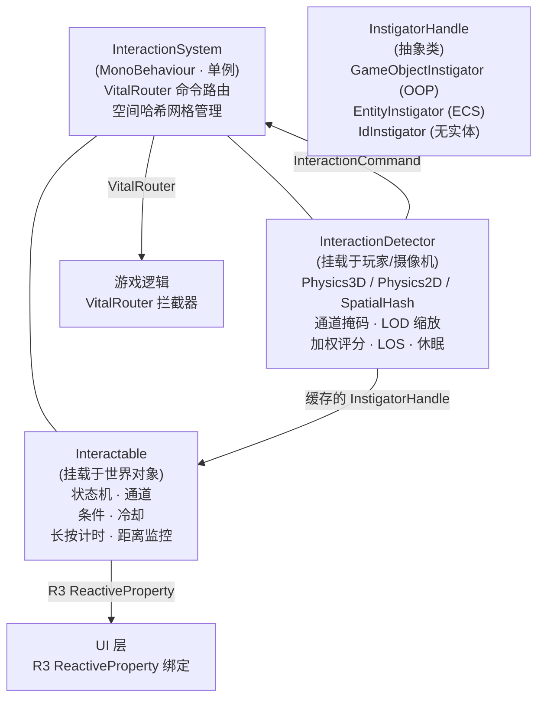
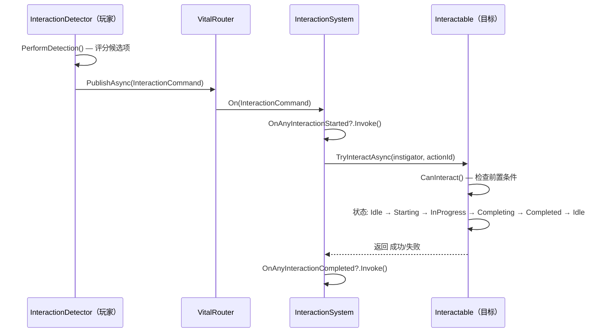
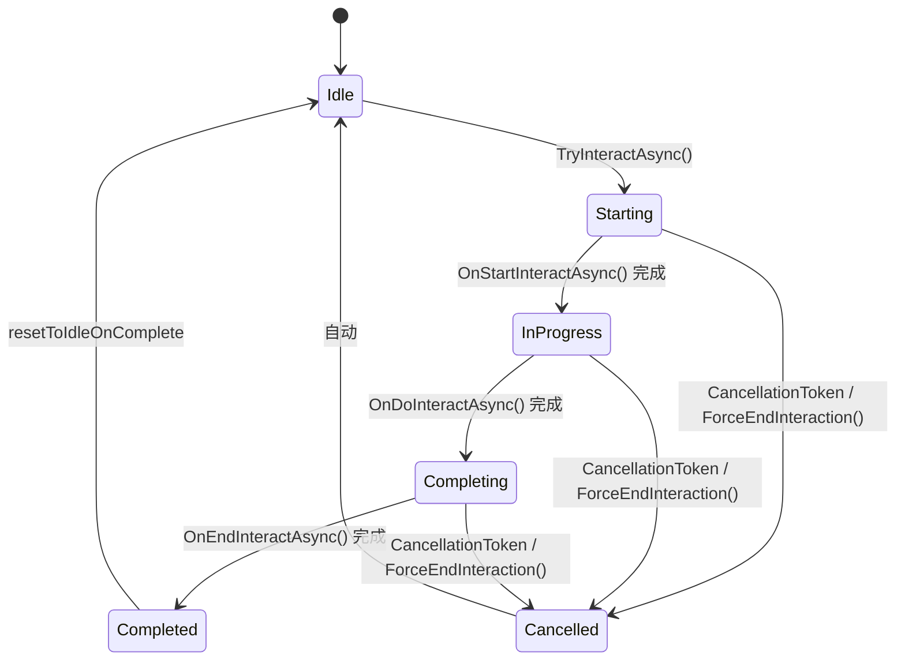

# RPG 交互模块

[English](README.md) | 简体中文

一个支持 3D、2D 和空间哈希检测模式的 Unity 交互运行时。使用 R3 提供面向 UI 的数据流，使用 VitalRouter 进行命令路由，并使用 UniTask 执行异步交互。

## 目录

- [概述](#概述)
- [架构](#架构)
- [快速上手](#快速上手)
- [核心概念](#核心概念)
- [使用指南](#使用指南)
- [进阶主题](#进阶主题)
- [常见场景](#常见场景)
- [性能与内存](#性能与内存)
- [故障排查](#故障排查)

## 概述

一个具备多模式检测、加权目标评分、自适应 LOD 和可插拔权威契约的交互运行时。检测器每帧根据距离、角度和优先级对附近候选项评分；得分最高的目标通过 VitalRouter 命令路由触发可交互对象状态机。

### 主要特性

| 类别                 | 说明                                                                                      |
| -------------------- | ----------------------------------------------------------------------------------------- |
| **多模式检测**       | 每个 detector 可选择 Physics3D、Physics2D 或 SpatialHash 检测。                           |
| **响应式架构**       | R3 `ReactiveProperty` 驱动的事件化 UI 绑定。                                              |
| **命令路由**         | 带 World 作用域的 VitalRouter 路由，`InteractionCommand` 可被拦截。                       |
| **LOD 检测**         | 自适应频率：近距高频、远距低频、无目标休眠。                                              |
| **通道过滤**         | 16 个语义无关的 Flag 通道，常数时间按位 AND 过滤。                                        |
| **条件系统**         | 可插拔的 `IInteractionRequirement` 前置条件（钥匙、等级、任务状态等）。                   |
| **加权评分**         | `Score = Priority × PriorityWeight + Dot(forward, direction) × AngleWeight − (distance / radius) × DistanceWeight` |
| **附近候选列表**     | 暴露所有评分候选项，用于拾取列表和手柄目标切换。                                          |
| **长按交互**         | 内置 `holdDuration` 及自动 0–1 进度上报。                                                 |
| **距离自动取消**     | 发起者超出 `maxInteractionRange` 时自动取消。                                             |
| **发起者系统**       | `InstigatorHandle`，内置 `GameObjectInstigator`；可扩展用于 ECS 或无实体游戏。            |
| **稳定身份**         | 可选 `IInteractionStableIdentity`，面向多人、回放、存档和统计。                           |
| **双态模式**         | 开关式交互（开/关）通过 `TwoStateInteractionBase` 实现。                                  |
| **特效池**           | 低 GC 的 VFX 生成，支持自动回收入池。                                                     |
| **编辑器工具**       | 自定义 Inspector、场景调试器、验证窗口、Gizmos。                                          |

## 架构



**数据流：**



### 依赖项

| 包                               | 用途                                                     | 是否必需 |
| -------------------------------- | -------------------------------------------------------- | -------- |
| **R3**                           | 响应式属性与可观察对象，用于 UI 绑定                     | 是       |
| **VitalRouter**                  | 命令路由与拦截器管线                                     | 是       |
| **UniTask**                      | 面向 Unity 的异步执行与取消                              | 是       |
| **CycloneGames.Factory.Runtime** | 对象池（`ObjectPool`、`IPoolable`、`MonoPrefabFactory`） | 是       |
| **CycloneGames.RPGFoundation.Interaction.Networking** | 可选 `NetworkVector3` 与 DTO 桥 | 可选     |
| **CycloneGames.GameplayFramework.Runtime** | 可选 `Actor` / World adapter 桥                | 可选     |
| **CycloneGames.DeterministicMath.Core** | 可选 `FPVector3` / `FPInt64` 权威校验桥         | 可选     |

## 快速上手

### 第 1 步 — 添加 InteractionSystem

创建空 GameObject，添加 `InteractionSystem`：

| Inspector 字段 | 类型    | 默认值  | 说明                                                |
| -------------- | ------- | ------- | --------------------------------------------------- |
| **World Id**   | `int`   | `0`     | 本地交互世界作用域，用于分屏或 additive scene。     |
| **Is 2D Mode** | `bool`  | `false` | 2D 游戏设为 `true`（X/Y 哈希），3D 设为 `false`（X/Z 哈希）。 |
| **Cell Size**  | `float` | `10`    | 空间哈希单元格大小。                                |

### 第 2 步 — 创建 Interactable

给任意世界对象添加 `Interactable`：

| Inspector 字段            | 类型                 | 默认值       | 说明                                     |
| ------------------------- | -------------------- | ------------ | ---------------------------------------- |
| **Interaction Prompt**    | `string`             | `"Interact"` | 显示给玩家的 UI 提示文本。               |
| **Is Interactable**       | `bool`               | `true`       | 该对象是否接受交互。                     |
| **Priority**              | `int`                | `0`          | 越高 = 评分算法越优先选择。              |
| **Interaction Distance**  | `float`              | `2`          | 距检测器的最大检测距离。                 |
| **Channel**               | `InteractionChannel` | `Channel0`   | 分类标记，用于选择性检测。               |
| **Hold Duration**         | `float`              | `0`          | 玩家需长按的时间（秒），0 = 即时交互。   |
| **Max Interaction Range** | `float`              | `0`          | 交互过程中的自动取消距离，0 = 不限制。   |

添加 `Collider` 或 `Collider2D` 并设为 **Is Trigger = true**。将图层设置为与检测器的 **Interactable Layer** 掩码匹配。

### 第 3 步 — 添加 InteractionDetector

在玩家或摄像机上添加 `InteractionDetector`：

| Inspector 字段         | 类型                 | 默认值        | 说明                                 |
| ---------------------- | -------------------- | ------------- | ------------------------------------ |
| **Detection Mode**     | `DetectionMode`      | `Physics3D`   | `Physics3D`、`Physics2D` 或 `SpatialHash`。 |
| **Detection Radius**   | `float`              | `3`           | 扫描半径。                           |
| **Interactable Layer** | `LayerMask`          | —             | 要扫描的物理图层。                   |
| **Obstruction Layer**  | `LayerMask`          | `1`           | 阻挡视线的图层。                     |
| **Max Interactables**  | `int`                | `64`          | 重叠查询缓冲区大小。                 |
| **Channel Mask**       | `InteractionChannel` | `All`         | 要检测的通道。                       |
| **Distance Weight**    | `float`              | `1`           | 距离评分权重。                       |
| **Angle Weight**       | `float`              | `2`           | 角度评分权重。                       |
| **Priority Weight**    | `float`              | `100`         | `Priority` 评分权重。                |

### 第 4 步 — 触发交互

```csharp
using UnityEngine;
using UnityEngine.InputSystem;

public class PlayerInteraction : MonoBehaviour
{
    [SerializeField] private InteractionDetector detector;

    void Update()
    {
        if (Keyboard.current.eKey.wasPressedThisFrame)
            detector.TryInteract();
    }
}
```

### 第 5 步 — 显示提示 UI

```csharp
using UnityEngine;
using UnityEngine.UI;
using R3;

public class InteractionPromptUI : MonoBehaviour
{
    [SerializeField] private InteractionDetector detector;
    [SerializeField] private Text promptText;
    [SerializeField] private GameObject promptPanel;

    void Start()
    {
        detector.CurrentInteractable.Subscribe(i =>
        {
            bool hasTarget = i != null;
            promptPanel.SetActive(hasTarget);
            if (hasTarget)
                promptText.text = $"[E] {i.InteractionPrompt}";
        }).AddTo(this);
    }
}
```

### 检测模式对比

| 属性         | Physics3D             | Physics2D             | SpatialHash                                  |
| ------------ | --------------------- | --------------------- | -------------------------------------------- |
| 发现来源     | Unity 3D Physics      | Unity 2D Physics      | 模块持有的空间网格                           |
| 需要碰撞体   | 是（3D）              | 是（2D）              | 否                                           |
| 视线检测     | 3D raycast            | 2D raycast            | 3D 或 2D raycast                             |
| 容量控制     | Non-alloc 碰撞体缓冲区 | Non-alloc 碰撞体缓冲区 | `maxResults` 与 `allowBufferGrowth`          |

SpatialHash 模式：可交互对象由 `OnEnable()` 自动注册。移动的可交互对象调用 `interactable.NotifyPositionChanged()`。网格仅在对象移动超过 1 单位时更新。

## 核心概念

### 交互生命周期



**生命周期钩子**（在子类中重写）：

| 钩子                       | 触发时机                 | 用途                       |
| -------------------------- | ------------------------ | -------------------------- |
| `OnStartInteractAsync(ct)` | 进入 `Starting` 状态后   | 播放动画、显示 UI          |
| `OnDoInteractAsync(ct)`    | 进入 `InProgress` 状态后 | 主逻辑、长按计时、进度上报 |
| `OnEndInteractAsync(ct)`   | 进入 `Completing` 状态后 | 清理、奖励、VFX            |

### 状态机

由共享的 `InteractionStateHandler` 实例管理。已验证的转换规则：

| 来源状态   | 允许转换到            |
| ---------- | --------------------- |
| Idle       | Starting              |
| Starting   | InProgress, Cancelled |
| InProgress | Completing, Cancelled |
| Completing | Completed, Cancelled  |
| Completed  | Idle                  |
| Cancelled  | Idle                  |

### 检测模式

```csharp
public enum DetectionMode : byte
{
    Physics3D = 0,   // OverlapSphereNonAlloc
    Physics2D = 1,   // OverlapCircleNonAlloc
    SpatialHash = 2  // SpatialHashGrid.QueryRadius — 无需碰撞体
}
```

### 通道过滤

16 个语义无关的 Flag 槽位，游戏层通过常量别名定义含义：

```csharp
[Flags]
public enum InteractionChannel : ushort
{
    None      = 0,
    Channel0  = 1 << 0, Channel1  = 1 << 1,
    Channel2  = 1 << 2, Channel3  = 1 << 3,
    // ... Channel4–Channel14
    Channel15 = 1 << 15,
    All       = 0xFFFF
}

// 游戏层常量别名模式（推荐）：
public static class MyGameChannels
{
    public const InteractionChannel NPC         = InteractionChannel.Channel0;
    public const InteractionChannel Item        = InteractionChannel.Channel1;
    public const InteractionChannel Environment = InteractionChannel.Channel2;
}
```

### 评分算法

```
Score = Priority × PriorityWeight + Dot(forward, direction) × AngleWeight − (distance / radius) × DistanceWeight
```

- **Priority**：可交互对象上的整数。越高 = 越优先。
- **Angle**：检测器前方与目标方向的点积（面朝 = +1，背对 = −1）。
- **Distance**：按检测半径归一化。

得分最高的候选项成为 `CurrentInteractable`。

### LOD 系统

| 条件                              | 更新间隔                        |
| --------------------------------- | ------------------------------- |
| 目标在 `nearDistance`（5m）内     | `nearIntervalMs`（33ms ≈ 30Hz） |
| 目标在 `farDistance`（15m）内     | `farIntervalMs`（150ms ≈ 7Hz）  |
| 目标超过 `farDistance`            | `veryFarIntervalMs`（300ms）    |
| 目标超过 `disableDistance`（50m） | 丢弃目标，进入休眠              |
| 超过 `sleepEnterMs`（1s）无目标   | `sleepIntervalMs`（500ms）      |

所有数值均可在每个检测器的 Inspector 中配置。

### 发起者系统

```
InstigatorHandle（抽象类）
├── GameObjectInstigator — MonoBehaviour / OOP 游戏
├── EntityInstigator — Unity ECS（用户自定义）
└── IdInstigator — 卡牌 / 回合制游戏（用户自定义）
```

使用抽象类而非 `object` 或 `interface` 的原因：
- `object` 允许值类型，导致隐式装箱 GC。
- `interface` 在 struct 实现时会发生装箱。
- `abstract class` 让公共契约保持引用类型，无需泛型参数。

```csharp
public sealed class GameObjectInstigator : InstigatorHandle
{
    public GameObject GameObject { get; }
    public override int Id => GameObject.GetInstanceID();
    public override ulong StableId { get; }
    public override bool TryGetPosition(out Vector3 position) { ... }
    public T GetComponent<T>() => GameObject.GetComponent<T>();
}
```

`InteractionDetector` 在 `Awake()` 中缓存一个 `GameObjectInstigator`。

## 使用指南

### 自定义交互逻辑

```csharp
using System.Threading;
using Cysharp.Threading.Tasks;

public class TreasureChest : Interactable
{
    protected override async UniTask OnStartInteractAsync(CancellationToken ct)
    {
        GetComponent<Animator>().SetTrigger("Open");
        await UniTask.Delay(500, cancellationToken: ct);
    }

    protected override async UniTask OnDoInteractAsync(CancellationToken ct)
    {
        await HoldTimerAsync(ct);
        switch (PendingActionId)
        {
            case "loot": GiveLoot(); break;
            case "trap-check": CheckForTraps(); break;
            default: GiveLoot(); break;
        }
    }

    protected override async UniTask OnEndInteractAsync(CancellationToken ct)
    {
        EffectPoolSystem.Spawn(sparksPrefab, transform.position, Quaternion.identity, 2f);
        isInteractable = false;
    }
}
```

### 交互条件系统

实现 `IInteractionRequirement` — 在 `Awake()` 中通过 `GetComponents<IInteractionRequirement>()` 自动发现：

```csharp
public class KeyRequirement : MonoBehaviour, IInteractionRequirement
{
    [SerializeField] private string keyId;

    public string FailureReason => $"需要钥匙: {keyId}";

    public bool IsMet(IInteractable target, InstigatorHandle instigator)
    {
        if (instigator is GameObjectInstigator goi)
        {
            var inventory = goi.GetComponent<PlayerInventory>();
            return inventory != null && inventory.HasKey(keyId);
        }
        return false;
    }
}
```

### 双态交互

用于开关式交互（门、开关）：

```csharp
public class ToggleDoor : Interactable, ITwoStateInteraction
{
    private TwoStateInteractionBase _twoState;
    public bool IsActivated => _twoState.IsActivated;

    protected override void Awake()
    {
        base.Awake();
        _twoState = GetComponent<TwoStateInteractionBase>();
    }

    protected override UniTask OnDoInteractAsync(CancellationToken ct)
    {
        _twoState.ToggleState();
        interactionPrompt = IsActivated ? "关闭" : "打开";
        return UniTask.CompletedTask;
    }
}
```

### 可拾取物品

内置 `PickableItem` 子类。在 Inspector 中配置：设置 `Destroy On Pickup = true`，指定 `Pickup Effect Prefab`。自定义逻辑：

```csharp
public class GoldCoin : PickableItem
{
    [SerializeField] private int goldAmount = 10;

    protected override void OnPickedUp()
    {
        if (CurrentInstigator is GameObjectInstigator goi)
            goi.GetComponent<PlayerWallet>()?.AddGold(goldAmount);
    }
}
```

### 多动作提示

在 Inspector 的 **Actions** 数组中配置多个动作：

```csharp
detector.TryInteract("examine");  // 触发 "examine" 动作
detector.TryInteract("pickup");   // 触发 "pickup" 动作
detector.TryInteract();           // 默认动作（actionId = null）
```

在可交互对象中读取 `PendingActionId` 分支行为。

### 长按交互计时器

设置 `holdDuration > 0`。`HoldTimerAsync(ct)` 驱动 `InteractionProgress` 从 0 到 1：

```csharp
protected override async UniTask OnDoInteractAsync(CancellationToken ct)
{
    await HoldTimerAsync(ct);
    UnlockDoor();
}
```

绑定 UI：`interactable.OnProgressChanged += (_, progress) => progressBar.fillAmount = progress;`

### 距离自动取消

设置 `maxInteractionRange > 0`。交互期间每帧使用平方距离比较（无 `sqrt`）。超出范围以 `InteractionCancelReason.OutOfRange` 取消。`InstigatorHandle.TryGetPosition()` 对无实体发起者返回 `false`，距离监控自动跳过。

### 取消原因

```csharp
public enum InteractionCancelReason : byte
{
    Manual,          // 玩家/代码调用了 ForceEndInteraction()
    OutOfRange,      // 发起者超出 maxInteractionRange
    Interrupted,     // 外部玩法事件（受伤、眩晕）
    Timeout,         // 交互超时
    TargetDestroyed, // 可交互对象被销毁
    SystemShutdown,  // 场景卸载 / InteractionSystem 被释放
    Faulted          // 用户代码或 adapter 抛出异常
}
```

响应取消：`interactable.OnInteractionCancelled += (source, reason) => { ... };`
强制取消：`interactable.ForceEndInteraction(InteractionCancelReason.Interrupted);`

### 发起者追踪

```csharp
public class CoopChest : Interactable
{
    protected override async UniTask OnDoInteractAsync(CancellationToken ct)
    {
        if (CurrentInstigator is GameObjectInstigator goi)
            Debug.Log($"由 {goi.GameObject.name} 打开");
        await HoldTimerAsync(ct);
        GiveItemToPlayer(CurrentInstigator);
    }
}
```

自定义 ECS 发起者：

```csharp
public sealed class EntityInstigator : InstigatorHandle
{
    public Entity Entity { get; }
    public override int Id => Entity.Index;
    public EntityInstigator(Entity entity) => Entity = entity;
    public override bool TryGetPosition(out Vector3 pos) { ... }
}
```

### 批量交互

```csharp
detector.TryInteractAll();       // 所有附近目标
detector.TryInteractAll("loot"); // 特定动作，所有目标
```

### 全局事件

```csharp
InteractionSystem.Instance.OnAnyInteractionStarted += (target, instigator) =>
    Analytics.LogEvent("interaction_started", target.InteractionPrompt);

InteractionSystem.Instance.OnAnyInteractionCompleted += (target, instigator, success) =>
    { if (success) QuestManager.OnInteraction(target); };
```

### 附近候选列表

```csharp
IReadOnlyList<InteractionCandidate> candidates = detector.NearbyInteractables;
foreach (var c in candidates)
    Debug.Log($"{c.Interactable.InteractionPrompt}: 分数={c.Score:F1}");
```

手柄循环切换：`detector.CycleTarget(+1)` / `detector.CycleTarget(-1)`。

### 交互进度

内置方式：`HoldTimerAsync` 自动驱动进度。
手动方式：`ReportProgress(0.5f)` 实现自定义定时交互。

```csharp
protected override async UniTask OnDoInteractAsync(CancellationToken ct)
{
    for (int i = 0; i < 100; i++)
    {
        ct.ThrowIfCancellationRequested();
        await UniTask.Delay(50, cancellationToken: ct);
        ReportProgress(i / 100f);
    }
}
```

### 特效池系统

```csharp
EffectPoolSystem.Prewarm(sparksPrefab, 32);  // 加载阶段预热
EffectPoolSystem.Spawn(sparksPrefab, position, rotation, 2f);  // 2 秒后自动回收
EffectPoolSystem.Spawn(smokePrefab, position, rotation);  // 手动 ReturnToPool()
```

在特效预制体上挂载 `PooledEffect` 组件。池以预制体 `InstanceID` 为键，每个唯一预制体一个池。首次生成时懒加载初始化。

## 进阶主题

### 权威与网络同步

本模块提供 Unity-free 的权威契约，用于服务端校验：

- `InteractionAuthorityService` — 服务端请求校验：World 作用域、稳定 ID、tick 漂移、重复请求、限流、距离检查、队列压力。
- `InteractionTargetSnapshot` / `InteractionVector3` — 不依赖 `UnityEngine` 的 headless/server adapter。
- `IInteractionPositionProvider` — 可插拔位置来源，用于 Networking、ECS 或后端 simulation。
- `InteractionMetrics` — 用于 accepted、rejected、queued 和 faulted 的线程安全计数器。

**服务端权威流程：**

1. 客户端 detector 选择候选目标，发送带 `WorldId`、`TargetStableId`、`InstigatorStableId`、`ActionId`、`Tick` 的 `InteractionRequest`。
2. 服务端将稳定 ID 解析为权威实体，运行 `InteractionAuthorityService.ValidateRequest()`。
3. 游戏专属服务端代码验证 LOS、权限、冷却、所有权。
4. 服务端执行并广播 `InteractionResult`。
5. 客户端根据服务端结果重对齐本地聚焦和 UI。

确定性多人游戏使用 DeterministicMath integration 的 `FPVector3` / `FPInt64` 配合 `InteractionDeterministicAuthorityService`。

| 场景 | 应使用 | 不应作为权威源 |
| --- | --- | --- |
| 本地单机或非确定性服务端 | `InteractionVector3`、`InteractionAuthorityService` | - |
| 普通网络传输 DTO | 带 `NetworkVector3` 的 `InteractionNetworkRequest` | `FPVector3`（除非 transport 支持 raw fixed payload） |
| 确定性多人、rollback 或 replay | `FPVector3`、`InteractionDeterministicAuthorityService` | `NetworkVector3`、`InteractionVector3` |
| UI、调试、统计 | `FPVector3.ToInteractionVector3()` | 把转换后的 float 再喂回权威判定 |

### VitalRouter 集成

交互通过 `InteractionCommand` 经 VitalRouter 路由：

```csharp
[Routes]
public partial class CutsceneInterceptor : MonoBehaviour
{
    [Route]
    async UniTask OnInteraction(InteractionCommand cmd)
    {
        if (CutsceneManager.IsPlaying)
            return; // 吞掉命令
    }
}
```

绕过路由：`await InteractionSystem.Instance.ProcessInteractionAsync(target, instigator);`

## 常见场景

### 过场期间阻止交互

调用 `detector.SetDetectionEnabled(false)`，或添加 VitalRouter 拦截器。

### PUBG 风格拾取列表

使用 `detector.NearbyInteractables` — 返回按分数排序的所有候选项。

### ECS / 无实体游戏

子类化 `InstigatorHandle`。`TryGetPosition()` 默认返回 `false`，距离监控自动跳过。

### 按键重绑定

玩家重绑定按键时在运行时更新 `InteractionAction.InputHint`。输入处理由项目的 input adapter 负责。

## 性能与内存

### 分配边界

| 技术                      | 应用位置                                                 |
| ------------------------- | -------------------------------------------------------- |
| 预分配数组                | 碰撞体缓冲区、排序缓冲区、空间网格槽数组                 |
| 调用方持有查询缓冲        | `SpatialHashGrid.QueryRadiusNonAlloc()`                  |
| 结构体候选项/命令         | `InteractionCandidate`、`InteractionCommand` 为 `readonly struct` |
| 缓存位置                  | `Position` 每帧缓存，避免 `Transform` 访问               |
| 享元状态                  | `InteractionStateHandler` 实例为共享静态单例             |
| `InstigatorHandle` 抽象类 | 只有引用类型可继承 — 编译期防止装箱                      |
| 缓存 `GameObjectInstigator` | `InteractionDetector.Awake()` 创建一个可复用实例        |

**已知分配点：** `EffectPoolSystem` 首次生成时创建池（使用 `Prewarm()` 移到加载阶段），`InteractionDetector` 在 `Awake()` 中分配 per-detector Dictionary，可取消执行会创建 `CancellationTokenSource`。

### 空间哈希网格

SoA 布局实现缓存友好遍历：

| 数组            | 用途                                    |
| --------------- | --------------------------------------- |
| `_items[]`      | `IInteractable` 引用                    |
| `_posX/Y/Z[]`   | 缓存的世界坐标（SoA）                   |
| `_hashes[]`     | 预计算单元格哈希                        |
| `_nextInCell[]` | 侵入式链表前向指针                      |
| `_prevInCell[]` | 侵入式链表后向指针                      |
| `_cellHeads`    | `Dictionary<long, int>` 单元格哈希→头槽 |
| `_freeSlots`    | `Stack<int>` 实现 O(1) 槽回收           |

通过 `ReaderWriterLockSlim` 实现线程安全。查询成本取决于单元格大小、半径和局部密度。

### 线程安全

| 组件                  | 机制                                       |
| --------------------- | ------------------------------------------ |
| `Interactable` 并发控制 | `Interlocked.CompareExchange` — 原子无锁  |
| `SpatialHashGrid`     | `ReaderWriterLockSlim` — 读并行、写独占    |
| Unity 组件            | 仅主线程                                   |

## 故障排查

| 现象                       | 可能原因                                   | 解决方法                                           |
| -------------------------- | ------------------------------------------ | -------------------------------------------------- |
| 对象未被检测到             | 缺失/invalid collider、layer、channel 或 `IsInteractable` | 使用 **Interaction Validator** 窗口自动检查       |
| 过场期间交互仍触发         | Detector 仍处于活动状态                    | 调用 `detector.SetDetectionEnabled(false)`         |
| 交互期间 `TryInteractAsync` 返回 false | 尝试并发交互                    | 原子标志阻止重入；等待当前交互完成                 |
| 大量可交互对象时性能差     | 单元格大小、半径或密度不匹配               | 在代表性场景中测量单元格大小和查询半径             |
| ECS 兼容性                 | Package 使用 `MonoBehaviour` 路径          | 子类化 `InstigatorHandle` 暴露实体身份；detector 是主线程 |
| 使用已销毁对象错误         | 访问已释放的 GameObject                    | `GameObjectInstigator.TryGetPosition` 每帧空值检查 |

## 验证

通过 Unity Test Runner 运行 EditMode 测试，目标为 `CycloneGames.RPGFoundation.Interaction.Tests.Editor`。多人场景需用相同 query 输入同时验证客户端预测路径与权威服务端路径。
