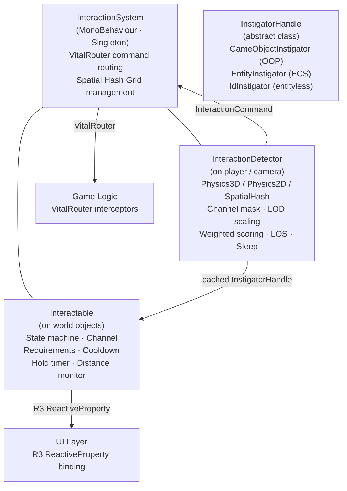
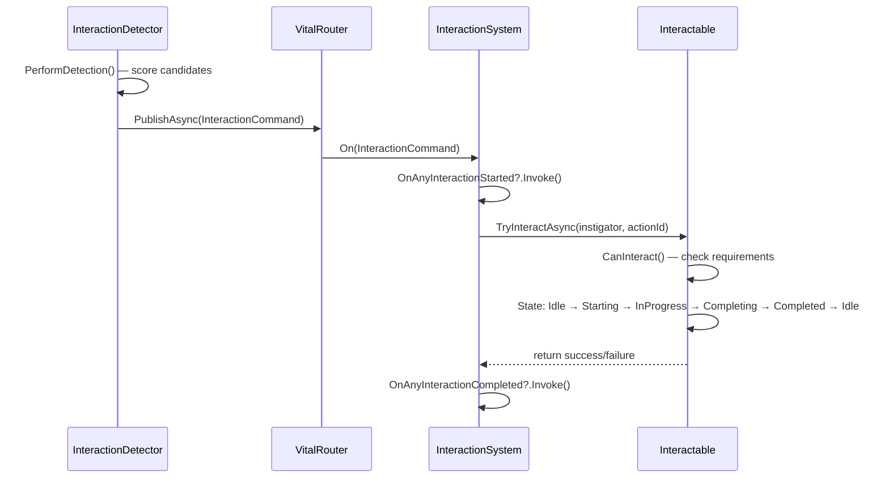
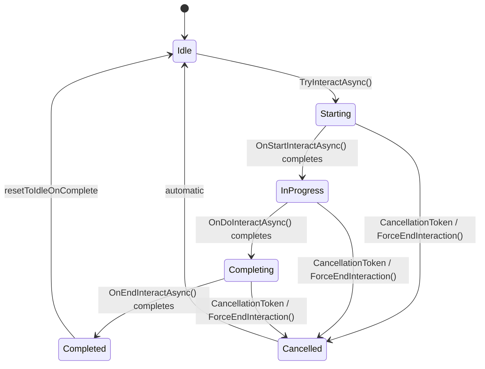

# RPG Interaction Module

[English | 简体中文](README.SCH.md)

An interaction runtime for Unity with 3D, 2D, and Spatial Hash detection modes. Uses R3 for UI-facing streams, VitalRouter for command routing, and UniTask for asynchronous interaction execution.

## Table of Contents

- [Overview](#overview)
- [Architecture](#architecture)
- [Quick Start](#quick-start)
- [Core Concepts](#core-concepts)
- [Usage Guide](#usage-guide)
- [Advanced Topics](#advanced-topics)
- [Common Scenarios](#common-scenarios)
- [Performance and Memory](#performance-and-memory)
- [Troubleshooting](#troubleshooting)

## Overview

An interaction runtime with multi-mode detection, weighted target scoring, adaptive LOD, and pluggable authority contracts. The detector scores nearby candidates each frame based on distance, angle, and priority; the best-scored target triggers interactable state machines through VitalRouter command routing.

### Key Features

| Category                  | Description                                                                              |
| ------------------------- | ---------------------------------------------------------------------------------------- |
| **Multi-Mode Detection**  | Physics3D, Physics2D, and SpatialHash selected per detector.                             |
| **Reactive Architecture** | R3 `ReactiveProperty` for event-driven UI binding.                                       |
| **Command Routing**       | World-scoped VitalRouter routing with interceptable `InteractionCommand`.                |
| **LOD Detection**         | Adaptive frequency scaling: fast when close, slow when far, sleep when idle.             |
| **Channel Filtering**     | 16 semantics-free flag channels with constant-time bitwise AND filtering.                |
| **Requirement System**    | Pluggable `IInteractionRequirement` conditions (key, level, quest state).                |
| **Weighted Scoring**      | `Score = Priority × PriorityWeight + Dot(forward, direction) × AngleWeight − (distance / radius) × DistanceWeight` |
| **Nearby Candidates**     | All scored candidates exposed for loot lists and gamepad target cycling.                 |
| **Hold-to-Interact**      | Built-in `holdDuration` with automatic progress reporting (0–1).                         |
| **Distance Auto-Cancel**  | Cancels if the instigator moves beyond `maxInteractionRange`.                            |
| **Instigator System**     | `InstigatorHandle` with `GameObjectInstigator` built-in; extensible for ECS/entityless.  |
| **Stable Identity**       | Optional `IInteractionStableIdentity` for multiplayer, replay, save data, and analytics. |
| **Two-State Pattern**     | Toggle interaction (open/close, on/off) via `TwoStateInteractionBase`.                   |
| **Effect Pool**           | Low-GC VFX spawning with auto return-to-pool.                                            |
| **Editor Tooling**        | Custom Inspectors, Scene Debugger, Validator Window, Gizmos.                             |

## Architecture



**Data flow:**



### Dependencies

| Package                          | Purpose                                                         | Required |
| -------------------------------- | --------------------------------------------------------------- | -------- |
| **R3**                           | Reactive properties and observables for UI binding              | Yes      |
| **VitalRouter**                  | Command routing and interceptor pipeline                        | Yes      |
| **UniTask**                      | Unity-oriented asynchronous execution and cancellation          | Yes      |
| **CycloneGames.Factory.Runtime** | Object pooling (`ObjectPool`, `IPoolable`, `MonoPrefabFactory`) | Yes      |
| **CycloneGames.RPGFoundation.Interaction.Networking** | Optional `NetworkVector3` and DTO bridge | Optional |
| **CycloneGames.GameplayFramework.Runtime** | Optional `Actor` / world adapter bridge                | Optional |
| **CycloneGames.DeterministicMath.Core** | Optional `FPVector3` / `FPInt64` authority bridge        | Optional |

## Quick Start

### Step 1 — Add InteractionSystem

Create an empty GameObject, add `InteractionSystem`:

| Inspector Field | Type    | Default | Description                                                 |
| --------------- | ------- | ------- | ----------------------------------------------------------- |
| **World Id**    | `int`   | `0`     | Local interaction world scope for split-screen or additive scenes. |
| **Is 2D Mode**  | `bool`  | `false` | `true` for 2D games (X/Y hashing), `false` for 3D (X/Z).    |
| **Cell Size**   | `float` | `10`    | Spatial hash cell size.                                      |

### Step 2 — Create an Interactable

Add `Interactable` to any world object:

| Inspector Field           | Type                 | Default      | Description                                              |
| ------------------------- | -------------------- | ------------ | -------------------------------------------------------- |
| **Interaction Prompt**    | `string`             | `"Interact"` | UI text shown to the player.                             |
| **Is Interactable**       | `bool`               | `true`       | Whether this object accepts interactions.                |
| **Priority**              | `int`                | `0`          | Higher = preferred by scoring.                           |
| **Interaction Distance**  | `float`              | `2`          | Max detection range from the detector.                   |
| **Channel**               | `InteractionChannel` | `Channel0`   | Category flag for selective detection.                   |
| **Hold Duration**         | `float`              | `0`          | Seconds the player must hold (0 = instant).              |
| **Max Interaction Range** | `float`              | `0`          | Auto-cancel distance during interaction (0 = disabled).  |

Add a `Collider` or `Collider2D` with **Is Trigger = true**. Set its layer to match the detector's **Interactable Layer** mask.

### Step 3 — Add an InteractionDetector

Add `InteractionDetector` to the player or camera:

| Inspector Field        | Type                 | Default       | Description                                |
| ---------------------- | -------------------- | ------------- | ------------------------------------------ |
| **Detection Mode**     | `DetectionMode`      | `Physics3D`   | `Physics3D`, `Physics2D`, or `SpatialHash`. |
| **Detection Radius**   | `float`              | `3`           | Scan radius.                               |
| **Interactable Layer** | `LayerMask`          | —             | Physics layers to scan.                    |
| **Obstruction Layer**  | `LayerMask`          | `1`           | Layers that block line-of-sight.           |
| **Max Interactables**  | `int`                | `64`          | Overlap buffer size.                       |
| **Channel Mask**       | `InteractionChannel` | `All`         | Which channels to detect.                  |
| **Distance Weight**    | `float`              | `1`           | Scoring weight for distance.               |
| **Angle Weight**       | `float`              | `2`           | Scoring weight for facing angle.           |
| **Priority Weight**    | `float`              | `100`         | Scoring weight for `Priority`.             |

### Step 4 — Trigger Interaction

```csharp
using UnityEngine;
using UnityEngine.InputSystem;

public class PlayerInteraction : MonoBehaviour
{
    [SerializeField] private InteractionDetector detector;

    void Update()
    {
        if (Keyboard.current.eKey.wasPressedThisFrame)
            detector.TryInteract();
    }
}
```

### Step 5 — Display Prompt UI

```csharp
using UnityEngine;
using UnityEngine.UI;
using R3;

public class InteractionPromptUI : MonoBehaviour
{
    [SerializeField] private InteractionDetector detector;
    [SerializeField] private Text promptText;
    [SerializeField] private GameObject promptPanel;

    void Start()
    {
        detector.CurrentInteractable.Subscribe(i =>
        {
            bool hasTarget = i != null;
            promptPanel.SetActive(hasTarget);
            if (hasTarget)
                promptText.text = $"[E] {i.InteractionPrompt}";
        }).AddTo(this);
    }
}
```

### Detection Mode Comparison

| Property             | Physics3D                 | Physics2D                 | SpatialHash                                  |
| -------------------- | ------------------------- | ------------------------- | -------------------------------------------- |
| Discovery source     | Unity 3D physics          | Unity 2D physics          | Module-owned spatial grid                    |
| Requires colliders   | Yes (3D)                  | Yes (2D)                  | No                                           |
| Line-of-sight        | 3D raycast                | 2D raycast                | 3D or 2D raycast                             |
| Capacity control     | Non-alloc collider buffer | Non-alloc collider buffer | `maxResults` and `allowBufferGrowth`          |

SpatialHash mode: Interactables register via `OnEnable()`. For moving interactables, call `interactable.NotifyPositionChanged()`. The grid updates only if the object has moved > 1 unit.

## Core Concepts

### Interaction Lifecycle



**Lifecycle hooks** (override in subclasses):

| Hook                       | When                     | Use For                          |
| -------------------------- | ------------------------ | -------------------------------- |
| `OnStartInteractAsync(ct)` | After `Starting` state   | Play animation, show UI          |
| `OnDoInteractAsync(ct)`    | After `InProgress` state | Main logic, hold timer, progress |
| `OnEndInteractAsync(ct)`   | After `Completing` state | Cleanup, rewards, VFX            |

### State Machine

Managed by shared `InteractionStateHandler` instances. Validated transitions:

| From       | Allowed To            |
| ---------- | --------------------- |
| Idle       | Starting              |
| Starting   | InProgress, Cancelled |
| InProgress | Completing, Cancelled |
| Completing | Completed, Cancelled  |
| Completed  | Idle                  |
| Cancelled  | Idle                  |

### Detection Modes

```csharp
public enum DetectionMode : byte
{
    Physics3D = 0,   // OverlapSphereNonAlloc
    Physics2D = 1,   // OverlapCircleNonAlloc
    SpatialHash = 2  // SpatialHashGrid.QueryRadius — collider-free
}
```

### Channel Filtering

16 semantics-free flag slots. Game layers define meaning via constant aliases:

```csharp
[Flags]
public enum InteractionChannel : ushort
{
    None      = 0,
    Channel0  = 1 << 0, Channel1  = 1 << 1,
    Channel2  = 1 << 2, Channel3  = 1 << 3,
    // ... Channel4–Channel14
    Channel15 = 1 << 15,
    All       = 0xFFFF
}

// Game-layer alias pattern (recommended):
public static class MyGameChannels
{
    public const InteractionChannel NPC         = InteractionChannel.Channel0;
    public const InteractionChannel Item        = InteractionChannel.Channel1;
    public const InteractionChannel Environment = InteractionChannel.Channel2;
}
```

### Scoring Algorithm

```
Score = Priority × PriorityWeight + Dot(forward, direction) × AngleWeight − (distance / radius) × DistanceWeight
```

- **Priority**: Integer on the interactable. Higher = preferred.
- **Angle**: Dot product of detector forward and target direction (+1 facing, −1 behind).
- **Distance**: Normalized by detection radius.

Highest-scored candidate becomes `CurrentInteractable`.

### LOD System

| Condition                             | Update Interval                |
| ------------------------------------- | ------------------------------ |
| Target within `nearDistance` (5m)     | `nearIntervalMs` (33ms ≈ 30Hz) |
| Target within `farDistance` (15m)     | `farIntervalMs` (150ms ≈ 7Hz)  |
| Target beyond `farDistance`           | `veryFarIntervalMs` (300ms)    |
| Target beyond `disableDistance` (50m) | Target dropped, enters sleep   |
| No target for > `sleepEnterMs` (1s)   | `sleepIntervalMs` (500ms)      |

All values configurable per detector.

### Instigator System

```
InstigatorHandle (abstract class)
├── GameObjectInstigator — MonoBehaviour / OOP games
├── EntityInstigator — Unity ECS (user-defined)
└── IdInstigator — card game / turn-based (user-defined)
```

`InstigatorHandle` is an abstract class (not `object` or `interface`) because:
- `object` allows value types, causing silent boxing GC.
- `interface` causes boxing when structs implement it.
- `abstract class` keeps the contract reference-typed without a generic parameter.

```csharp
public sealed class GameObjectInstigator : InstigatorHandle
{
    public GameObject GameObject { get; }
    public override int Id => GameObject.GetInstanceID();
    public override ulong StableId { get; }
    public override bool TryGetPosition(out Vector3 position) { ... }
    public T GetComponent<T>() => GameObject.GetComponent<T>();
}
```

`InteractionDetector` caches one `GameObjectInstigator` in `Awake()`.

## Usage Guide

### Custom Interactable Logic

```csharp
using System.Threading;
using Cysharp.Threading.Tasks;

public class TreasureChest : Interactable
{
    protected override async UniTask OnStartInteractAsync(CancellationToken ct)
    {
        GetComponent<Animator>().SetTrigger("Open");
        await UniTask.Delay(500, cancellationToken: ct);
    }

    protected override async UniTask OnDoInteractAsync(CancellationToken ct)
    {
        await HoldTimerAsync(ct);
        switch (PendingActionId)
        {
            case "loot": GiveLoot(); break;
            case "trap-check": CheckForTraps(); break;
            default: GiveLoot(); break;
        }
    }

    protected override async UniTask OnEndInteractAsync(CancellationToken ct)
    {
        EffectPoolSystem.Spawn(sparksPrefab, transform.position, Quaternion.identity, 2f);
        isInteractable = false;
    }
}
```

### Interaction Requirements

Implement `IInteractionRequirement` — auto-discovered at `Awake()` via `GetComponents<IInteractionRequirement>()`:

```csharp
public class KeyRequirement : MonoBehaviour, IInteractionRequirement
{
    [SerializeField] private string keyId;

    public string FailureReason => $"Requires key: {keyId}";

    public bool IsMet(IInteractable target, InstigatorHandle instigator)
    {
        if (instigator is GameObjectInstigator goi)
        {
            var inventory = goi.GetComponent<PlayerInventory>();
            return inventory != null && inventory.HasKey(keyId);
        }
        return false;
    }
}
```

### Two-State Interactions

For toggle-style interactions (doors, switches):

```csharp
public class ToggleDoor : Interactable, ITwoStateInteraction
{
    private TwoStateInteractionBase _twoState;
    public bool IsActivated => _twoState.IsActivated;

    protected override void Awake()
    {
        base.Awake();
        _twoState = GetComponent<TwoStateInteractionBase>();
    }

    protected override UniTask OnDoInteractAsync(CancellationToken ct)
    {
        _twoState.ToggleState();
        interactionPrompt = IsActivated ? "Close" : "Open";
        return UniTask.CompletedTask;
    }
}
```

### Pickable Items

Built-in `PickableItem` subclass. Configure in Inspector: set `Destroy On Pickup = true` and assign a `Pickup Effect Prefab`. For custom logic:

```csharp
public class GoldCoin : PickableItem
{
    [SerializeField] private int goldAmount = 10;

    protected override void OnPickedUp()
    {
        if (CurrentInstigator is GameObjectInstigator goi)
            goi.GetComponent<PlayerWallet>()?.AddGold(goldAmount);
    }
}
```

### Multi-Action Prompts

Configure multiple actions in the Inspector's **Actions** array:

```csharp
detector.TryInteract("examine");  // Triggers the "examine" action
detector.TryInteract("pickup");   // Triggers the "pickup" action
detector.TryInteract();           // Default (actionId = null)
```

In the interactable, read `PendingActionId` to branch behavior.

### Hold-to-Interact Timer

Set `holdDuration > 0`. `HoldTimerAsync(ct)` drives `InteractionProgress` from 0 to 1:

```csharp
protected override async UniTask OnDoInteractAsync(CancellationToken ct)
{
    await HoldTimerAsync(ct);
    UnlockDoor();
}
```

Bind UI: `interactable.OnProgressChanged += (_, progress) => progressBar.fillAmount = progress;`

### Distance Auto-Cancellation

Set `maxInteractionRange > 0`. During interaction, distance is checked every frame via squared comparison (no `sqrt`). Out-of-range cancels with `InteractionCancelReason.OutOfRange`. `InstigatorHandle.TryGetPosition()` returns `false` for entityless instigators; distance monitoring skips those entries.

### Cancellation Reasons

```csharp
public enum InteractionCancelReason : byte
{
    Manual,          // Player/code called ForceEndInteraction()
    OutOfRange,      // Instigator moved beyond maxInteractionRange
    Interrupted,     // External gameplay event (damage, stun)
    Timeout,         // Interaction time limit exceeded
    TargetDestroyed, // The interactable was destroyed
    SystemShutdown,  // Scene unloaded / InteractionSystem disposed
    Faulted          // User code or adapter threw an exception
}
```

React: `interactable.OnInteractionCancelled += (source, reason) => { ... };`
Cancel: `interactable.ForceEndInteraction(InteractionCancelReason.Interrupted);`

### Instigator Tracking

```csharp
public class CoopChest : Interactable
{
    protected override async UniTask OnDoInteractAsync(CancellationToken ct)
    {
        if (CurrentInstigator is GameObjectInstigator goi)
            Debug.Log($"Opened by: {goi.GameObject.name}");
        await HoldTimerAsync(ct);
        GiveItemToPlayer(CurrentInstigator);
    }
}
```

Custom instigator for ECS:

```csharp
public sealed class EntityInstigator : InstigatorHandle
{
    public Entity Entity { get; }
    public override int Id => Entity.Index;
    public EntityInstigator(Entity entity) => Entity = entity;
    public override bool TryGetPosition(out Vector3 pos) { ... }
}
```

### Batch Interactions

```csharp
detector.TryInteractAll();       // All nearby targets
detector.TryInteractAll("loot"); // Specific action, all targets
```

### Global Events

```csharp
InteractionSystem.Instance.OnAnyInteractionStarted += (target, instigator) =>
    Analytics.LogEvent("interaction_started", target.InteractionPrompt);

InteractionSystem.Instance.OnAnyInteractionCompleted += (target, instigator, success) =>
    { if (success) QuestManager.OnInteraction(target); };
```

### Nearby Candidates

```csharp
IReadOnlyList<InteractionCandidate> candidates = detector.NearbyInteractables;
foreach (var c in candidates)
    Debug.Log($"{c.Interactable.InteractionPrompt}: score={c.Score:F1}");
```

Gamepad cycling: `detector.CycleTarget(+1)` / `detector.CycleTarget(-1)`.

### Interaction Progress

Built-in: `HoldTimerAsync` drives progress automatically.
Manual: `ReportProgress(0.5f)` for custom timed interactions.

```csharp
protected override async UniTask OnDoInteractAsync(CancellationToken ct)
{
    for (int i = 0; i < 100; i++)
    {
        ct.ThrowIfCancellationRequested();
        await UniTask.Delay(50, cancellationToken: ct);
        ReportProgress(i / 100f);
    }
}
```

### Effect Pool System

```csharp
EffectPoolSystem.Prewarm(sparksPrefab, 32);  // During loading
EffectPoolSystem.Spawn(sparksPrefab, position, rotation, 2f);  // Auto-return after 2s
EffectPoolSystem.Spawn(smokePrefab, position, rotation);  // Manual ReturnToPool()
```

Attach `PooledEffect` component to the effect prefab. Pools are keyed by prefab `InstanceID`, one pool per unique prefab. Initializes lazily on first spawn.

## Advanced Topics

### Authority and Networking

This module provides Unity-free authority contracts for server-side validation:

- `InteractionAuthorityService` — server-side request validation: world scope, stable IDs, tick drift, duplicate requests, rate limits, range checks, queue pressure.
- `InteractionTargetSnapshot` / `InteractionVector3` — headless/server adapters without `UnityEngine` dependency.
- `IInteractionPositionProvider` — pluggable position sources for networking, ECS, or backend simulation.
- `InteractionMetrics` — thread-safe counters for accepted, rejected, queued, and faulted interactions.

**Server-authoritative flow:**

1. Client detector selects a candidate, sends `InteractionRequest` with `WorldId`, `TargetStableId`, `InstigatorStableId`, `ActionId`, `Tick`.
2. Server resolves stable IDs and runs `InteractionAuthorityService.ValidateRequest()`.
3. Game-specific server code validates LOS, permissions, cooldowns, ownership.
4. Server executes and broadcasts `InteractionResult`.
5. Clients reconcile local focus/UI against the server result.

For deterministic multiplayer, use `InteractionDeterministicAuthorityService` with `FPVector3` / `FPInt64` from the `DeterministicMath` integration.

| Situation | Use | Do not use as authority |
| --- | --- | --- |
| Local single-player or non-deterministic server | `InteractionVector3`, `InteractionAuthorityService` | - |
| Transport DTO for regular networking | `InteractionNetworkRequest` with `NetworkVector3` | `FPVector3` (unless transport supports raw fixed payloads) |
| Deterministic multiplayer, rollback, or replay | `FPVector3`, `InteractionDeterministicAuthorityService` | `NetworkVector3`, `InteractionVector3` |
| UI, debug, analytics | `FPVector3.ToInteractionVector3()` | Feeding converted float back into authority |

### VitalRouter Integration

Interactions are routed as `InteractionCommand`:

```csharp
[Routes]
public partial class CutsceneInterceptor : MonoBehaviour
{
    [Route]
    async UniTask OnInteraction(InteractionCommand cmd)
    {
        if (CutsceneManager.IsPlaying)
            return; // Swallow the command
    }
}
```

Bypass: `await InteractionSystem.Instance.ProcessInteractionAsync(target, instigator);`

## Common Scenarios

### Stop interaction during cutscenes

Either call `detector.SetDetectionEnabled(false)`, or add a VitalRouter interceptor.

### PUBG-style loot list

Use `detector.NearbyInteractables` — returns all scored candidates sorted by score.

### ECS / entityless games

Subclass `InstigatorHandle`. `TryGetPosition()` returns `false` by default; distance monitoring skips automatically.

### Input rebinding

Update `InteractionAction.InputHint` at runtime when the player rebinds keys. Input processing belongs to the project's input adapter.

## Performance and Memory

### Allocation Boundaries

| Technique                     | Where                                                            |
| ----------------------------- | ---------------------------------------------------------------- |
| Pre-allocated arrays          | Collider buffers, sort buffers, spatial grid slot arrays         |
| Caller-owned query buffer     | `SpatialHashGrid.QueryRadiusNonAlloc()`                          |
| Struct candidates/commands    | `InteractionCandidate`, `InteractionCommand` are `readonly struct` |
| Cached position               | `Position` caches per frame, avoids `Transform` access           |
| Flyweight states              | `InteractionStateHandler` instances are shared static singletons |
| `InstigatorHandle` abstract   | Only reference types can inherit — compile-time boxing prevention |
| Cached `GameObjectInstigator` | One reusable instance created in `InteractionDetector.Awake()`   |

**Known allocation points:** `EffectPoolSystem` creates a pool on first spawn (use `Prewarm()` during loading), `InteractionDetector` allocates per-detector dictionaries in `Awake()`, and cancellable execution creates a `CancellationTokenSource`.

### Spatial Hash Grid

SoA layout for cache-friendly traversal:

| Array           | Purpose                                          |
| --------------- | ------------------------------------------------ |
| `_items[]`      | `IInteractable` references                        |
| `_posX/Y/Z[]`   | Cached world positions (SoA)                      |
| `_hashes[]`     | Pre-computed cell hash                            |
| `_nextInCell[]` | Intrusive linked list forward pointers            |
| `_prevInCell[]` | Intrusive linked list backward pointers           |
| `_cellHeads`    | `Dictionary<long, int>` cell hash → head slot     |
| `_freeSlots`    | `Stack<int>` for O(1) slot recycling              |

Thread-safe via `ReaderWriterLockSlim`. Query cost depends on cell size, radius, and local density.

### Thread Safety

| Component                 | Mechanism                                           |
| ------------------------- | --------------------------------------------------- |
| `Interactable` concurrency | `Interlocked.CompareExchange` — atomic lock-free    |
| `SpatialHashGrid`         | `ReaderWriterLockSlim` — read-parallel, write-exclusive |
| Unity components          | Main-thread only                                     |

## Troubleshooting

| Symptom | Likely cause | Resolution |
| --- | --- | --- |
| Object not detected | Missing/invalid collider, layer, channel, or `IsInteractable` | Use **Interaction Validator** window to auto-check |
| Interaction blocked during cutscene | Detector still active | Call `detector.SetDetectionEnabled(false)` |
| `TryInteractAsync` returns false during interaction | Concurrent interaction attempted | The atomic flag prevents re-entry; wait for completion |
| Performance issues with many interactables | Cell size, radius, or density mismatch | Profile cell size and query radius in representative scenes |
| ECS compatibility | Package uses `MonoBehaviour` paths | Subclass `InstigatorHandle` for entity identity; detector is main-thread only |
| Use-after-destroy errors | Disposed GameObject accessed | `GameObjectInstigator.TryGetPosition` null-checks each frame |

## Validation

Run EditMode tests from Unity Test Runner, targeting `CycloneGames.RPGFoundation.Interaction.Tests.Editor`. For multiplayer, test both client prediction and authoritative server paths with identical query inputs.
