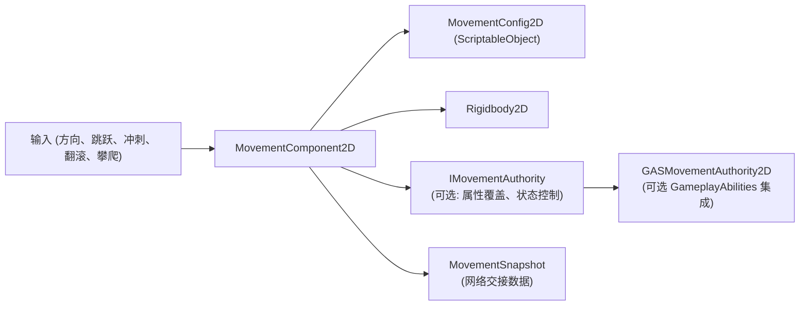

# RPG 2D 移动模块

[English](README.md) | 简体中文

一个基于状态的 Unity 2D 角色移动组件。支持 Platformer、BeltScroll 和 TopDown 移动模式，提供 ScriptableObject 配置、运行时属性修改、snapshot 和可选的 GameplayAbilities integration assembly。

## 目录

- [概述](#概述)
- [架构](#架构)
- [快速上手](#快速上手)
- [核心概念](#核心概念)
- [使用指南](#使用指南)
- [进阶主题](#进阶主题)
- [常见场景](#常见场景)
- [性能与内存](#性能与内存)
- [故障排查](#故障排查)

## 概述

`MovementComponent2D` 为 2D 角色提供显式状态机驱动的移动。移动计算使用 `Unity.Mathematics`。组件、Physics2D、动画和事件均运行在 Unity 主线程。

### 主要特性

- **三种移动模式** — Platformer、BeltScroll（DNF 风格）和 TopDown
- **状态机** — 显式状态（Idle、Walk、Run、Sprint、Jump、Fall、Climb、WallSlide）
- **2D 手感特性** — 土狼时间、跳跃缓冲、空中控制、小间隙跨越
- **ScriptableObject 配置** — 通过 `MovementConfig2D` 共享移动参数
- **Rigidbody2D 物理** — 重力、通过 `Physics2D.OverlapBox` 进行地面检测
- **属性修改** — 运行时覆盖所有移动属性
- **时间缩放** — 全局与组件局部控制
- **攀爬系统** — 梯子和贴墙攀爬，支持蹬墙跳

## 架构



### MovementConfig2D 参数

| 分类     | 参数           | 描述         | 默认值  |
| -------- | -------------- | ------------ | ------- |
| **地面** | walkSpeed      | 行走速度     | 3.0     |
| **地面** | runSpeed       | 跑步速度     | 5.0     |
| **地面** | sprintSpeed    | 冲刺速度     | 8.0     |
| **空中** | jumpForce      | 跳跃力度     | 12.0    |
| **空中** | maxJumpCount   | 多段跳次数   | 1       |
| **空中** | maxFallSpeed   | 最大下落速度 | 20.0    |
| **物理** | gravity        | 重力         | 25.0    |
| **物理** | groundLayer    | 地面检测层   | Default |
| **手感** | coyoteTime     | 延迟跳跃窗口 | 0.1s    |
| **手感** | jumpBufferTime | 提前跳跃窗口 | 0.1s    |

## 快速上手

### 步骤 1：创建配置

`Create > CycloneGames > RPG Foundation > Movement Config 2D`

### 步骤 2：添加组件

在 2D 角色 GameObject 上添加 `MovementComponent2D`。分配 `MovementConfig2D` 和 `Rigidbody2D`（缺失时会自动添加）。

### 步骤 3：基础输入

**Platformer 模式：**

```csharp
using CycloneGames.RPGFoundation.Movement.Runtime.Movement2D;

public class Player2DController : MonoBehaviour
{
    private MovementComponent2D _movement;

    void Awake() => _movement = GetComponent<MovementComponent2D>();

    void Update()
    {
        float horizontal = Input.GetAxis("Horizontal");
        _movement.SetInputDirection(new Vector2(horizontal, 0));
        _movement.SetJumpPressed(Input.GetButtonDown("Jump"));
        _movement.SetSprintHeld(Input.GetButton("Sprint"));
    }
}
```

**BeltScroll 模式（DNF 风格）：**

```csharp
void Update()
{
    // X = 水平移动, Y = 纵深移动
    float horizontal = Input.GetAxis("Horizontal");
    float vertical = Input.GetAxis("Vertical");
    _movement.SetInputDirection(new Vector2(horizontal, vertical));
    _movement.SetJumpPressed(Input.GetButtonDown("Jump"));
    _movement.SetSprintHeld(Input.GetButton("Sprint"));
}
```

## 核心概念

### MovementType2D

| 类型           | 描述            | 物理           |
| -------------- | --------------- | -------------- |
| **Platformer** | 标准横板卷轴    | Y=重力/跳跃    |
| **BeltScroll** | DNF 风格带纵深  | 跳跃由物理控制 |
| **TopDown**    | 经典 RPG 俯视角 | 无重力         |

### BeltScroll 模式

BeltScroll（DNF 风格）使用伪 3D：X 为水平移动，Y 模拟纵深（上=远，下=近），跳跃通过 Rigidbody2D 物理临时增加 Y 偏移。使用 SpriteRenderer 的 `Sorting Layer` 或 `Order in Layer` 基于 Y 坐标实现正确的深度渲染。

### 土狼时间与跳跃缓冲

```csharp
config.coyoteTime = 0.1f;     // 离开平台后 100ms 宽限期
config.jumpBufferTime = 0.1f; // 100ms 缓冲窗口 — 提前按下跃键会在落地时执行
```

### 空中控制

```csharp
config.airControlMultiplier = 0.5f; // 空中 50% 水平控制力
```

### 小间隙跨越

速度超过 `minSpeedForGapBridge` 时，组件会在因小间隙离开接地状态前检查前方地面：

| 参数                   | 说明                     | 默认值 |
| ---------------------- | ------------------------ | ------ |
| `enableGapBridging`    | 启用/禁用功能            | true   |
| `minSpeedForGapBridge` | 触发所需的最低速度 (m/s) | 4.0    |
| `maxGapDistance`       | 可跨越的最大沟槽宽度 (m) | 1.0    |

慢走时不会触发沟槽跨越，角色会正常掉入沟槽。

## 使用指南

### 动画 BlendTree

使用 `Velocity.magnitude` 获得平滑的 BlendTree 插值：

```csharp
void Update()
{
    var movement = GetComponent<MovementComponent2D>();
    animator.SetFloat("Speed", movement.Velocity.magnitude);
}
```

### 慢动作

```csharp
// 全局慢动作
Time.timeScale = 0.2f;

// 角色独立时间缩放
movementComponent.LocalTimeScale = 1.5f;
movementComponent.IgnoreTimeScale = true;
```

### 组件 API

```csharp
// 属性
MovementStateType CurrentState { get; }
bool IsGrounded { get; }
float CurrentSpeed { get; }
Vector2 Velocity { get; }
bool IsMoving { get; }
IMovementAuthority MovementAuthority { get; set; }

// 方法
void SetInputDirection(Vector2 direction);
void SetJumpPressed(bool pressed);
void SetSprintHeld(bool held);
void SetCrouchHeld(bool held);
void SetRollPressed(bool pressed);
bool RequestClimb(ClimbingMode climbingMode, int wallSide = 0, object context = null);
bool StopClimb();
bool RequestStateChange(MovementStateType type);
MovementSnapshot GetSnapshot();
void ApplySnapshot(in MovementSnapshot snapshot);
void ResetFromSnapshot(in MovementSnapshot snapshot);

// 事件
event Action<MovementStateType, MovementStateType> OnStateChanged;
event Action OnJumpStart;
event Action OnLanded;
```

## 进阶主题

### 属性修改（无需 GAS）

```csharp
using CycloneGames.RPGFoundation.Movement.Core;
using CycloneGames.RPGFoundation.Movement.Runtime;
using CycloneGames.RPGFoundation.Movement.Runtime.Movement2D;

var movement = GetComponent<MovementComponent2D>();
var authority = gameObject.AddComponent<MovementAttributeAuthority>();
movement.MovementAuthority = authority;

authority.SetBaseValueOverride(MovementAttribute.RunSpeed, 7f);
authority.SetMultiplier(MovementAttribute.JumpForce, 1.2f);
```

### GameplayAbilities 集成

GAS integration 仅在启用 `CYCLONE_RPGFOUNDATION_HAS_GAMEPLAY_ABILITIES` 时编译。当移动动作（跳跃、翻滚、贴墙攀爬）由 ability 拥有时，使用 `MovementStateRequestContext.FromAbility(this)` 请求状态 — 这样权限检查仍会生效，且不会递归激活同一 ability。

```csharp
#if CYCLONE_RPGFOUNDATION_HAS_GAMEPLAY_ABILITIES
using CycloneGames.RPGFoundation.Movement.Core;
using CycloneGames.RPGFoundation.Movement.Runtime.Movement2D;
using CycloneGames.RPGFoundation.Movement.Integrations.GameplayAbilities;

var movement = GetComponent<MovementComponent2D>();
var gasAuthority = gameObject.AddComponent<GASMovementAttributeAuthority>();
movement.MovementAuthority = gasAuthority;

gasAuthority.AddAttributeMapping(
    MovementAttribute.RunSpeed,
    "Attribute.Secondary.Speed",
    baseValue: 100f
);
#endif
```

**支持的属性：** WalkSpeed、RunSpeed、SprintSpeed、CrouchSpeed、JumpForce、Gravity、AirControlMultiplier。

### 攀爬与蹬墙跳

| 模式     | 进入条件         | 移动方式  | 场景        |
| -------- | ---------------- | --------- | ----------- |
| **梯子** | 触发区域 + 按上  | 上/下/左/右 | 标准梯子   |
| **贴墙** | 空中 + 墙 + 输入 | 上/下     | 贴墙滑落   |

设置：在 config 中启用 `enableLadderClimbing` 或 `enableWallClimbing`，指定 `Ladder Layer` 和 `Wall Layer`，为梯子区域创建 Trigger Collider2D。

蹬墙跳配置：

```csharp
config.wallJumpForceX = 8f;
config.wallJumpForceY = 10f;
config.wallSlideSpeed = 2f;
```

### GAS 移动权限

```csharp
public class GASMovementAuthority2D : MonoBehaviour, IMovementAuthority
{
    public bool CanEnterState(MovementStateType stateType, object context)
    {
        if (stateType == MovementStateType.Sprint) return HasStamina();
        return true;
    }
    public void OnStateEntered(MovementStateType stateType) { }
    public void OnStateExited(MovementStateType stateType) { }
    public MovementAttributeModifier GetAttributeModifier(MovementAttribute attribute)
        => new MovementAttributeModifier(null, 1f);
    public float? GetBaseValue(MovementAttribute attribute) => null;
    public float GetMultiplier(MovementAttribute attribute) => 1f;
    public float GetFinalValue(MovementAttribute attribute, float configValue) => configValue;
}
```

## 常见场景

### 自动转向

角色自动翻转朝向移动方向：
```csharp
_movement.SetInputDirection(new Vector2(1, 0));  // 朝右
_movement.SetInputDirection(new Vector2(-1, 0)); // 朝左
```

### 攀爬梯子

1. 在 config 中启用 `enableLadderClimbing`。
2. 在梯子上创建 Trigger Collider2D，设置 layer 为 `Ladder Layer`。
3. 玩家走进触发区域并按上 — `MovementComponent2D` 进入 Climb 状态。

### 多段跳

在 config 中设置 `maxJumpCount = 2` 即可实现二段跳。

## 性能与内存

- 移动计算使用 `Unity.Mathematics` 实现 SIMD 友好的向量运算。
- `Rigidbody2D` 和 `Physics2D.OverlapBox` 的分配取决于 Unity Physics backend。
- Snapshot 为 `readonly struct` — 通过 `in` 传递时不产生堆分配。
- `MovementComponent2D` 是 Unity 组件，仅从主线程调用。多线程模拟应放入纯数据系统。
- 使用 `MovementAttributeAuthority` 而非逐帧重复计算属性。

## 故障排查

| 现象               | 原因                                       | 解决方法                                     |
| ------------------ | ------------------------------------------ | -------------------------------------------- |
| 角色不移动         | 缺少 `Rigidbody2D` 或 `MovementConfig2D`  | 通过 Inspector 添加对应组件                  |
| 未检测到地面       | `groundLayer` 未设置或 `groundCheck` Transform 位置错误 | 将 `groundCheck` 放在角色脚部，设置正确的 layer |
| 跳跃未触发         | `coyoteTime` / `jumpBufferTime` 可能过短   | 增加到 0.1–0.2s                              |
| 沟槽跨越不起作用   | 速度低于 `minSpeedForGapBridge`            | 提高速度或减少沟槽距离                       |
| 3D 物理错误        | 混用了 2D 和 3D 组件                       | 仅使用 `Rigidbody2D` 和 `Collider2D`；3D 游戏使用 `MovementComponent` |
