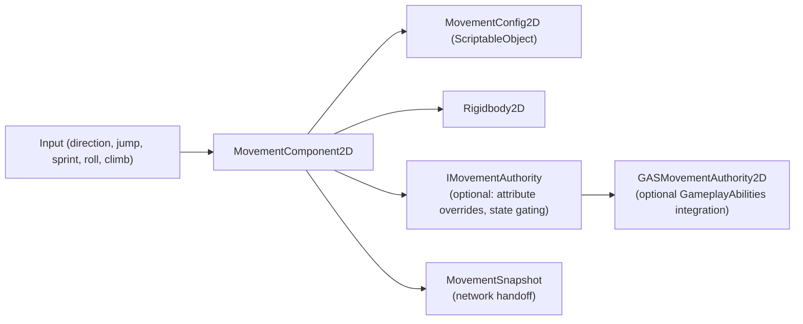

# RPG Movement Component 2D

[English | 简体中文](README.SCH.md)

A state-based 2D character movement component for Unity. Supports Platformer, BeltScroll, and TopDown movement modes with ScriptableObject configuration, runtime attribute modification, snapshots, and an optional GameplayAbilities integration assembly.

## Table of Contents

- [Overview](#overview)
- [Architecture](#architecture)
- [Quick Start](#quick-start)
- [Core Concepts](#core-concepts)
- [Usage Guide](#usage-guide)
- [Advanced Topics](#advanced-topics)
- [Common Scenarios](#common-scenarios)
- [Performance and Memory](#performance-and-memory)
- [Troubleshooting](#troubleshooting)

## Overview

`MovementComponent2D` provides explicit state-machine-driven movement for 2D characters. Movement calculations use `Unity.Mathematics`. The component, Physics2D, animation, and events all run on the Unity main thread.

### Key Features

- **Three movement modes** — Platformer, BeltScroll (DNF-style), and TopDown
- **State machine** — Explicit states (Idle, Walk, Run, Sprint, Jump, Fall, Climb, WallSlide)
- **2D feel features** — Coyote time, jump buffering, air control, gap bridging
- **ScriptableObject configuration** — Shared movement parameters via `MovementConfig2D`
- **Rigidbody2D physics** — Gravity, ground detection via `Physics2D.OverlapBox`
- **Attribute modification** — Runtime overrides for all movement attributes
- **Time scaling** — Global and component-local controls
- **Climbing system** — Ladder and wall climbing with wall jump support

## Architecture



### MovementConfig2D Parameters

| Category    | Parameter      | Description            | Default |
| ----------- | -------------- | ---------------------- | ------- |
| **Ground**  | walkSpeed      | Walking speed          | 3.0     |
| **Ground**  | runSpeed       | Running speed          | 5.0     |
| **Ground**  | sprintSpeed    | Sprinting speed        | 8.0     |
| **Air**     | jumpForce      | Jump velocity          | 12.0    |
| **Air**     | maxJumpCount   | Multi-jump count       | 1       |
| **Air**     | maxFallSpeed   | Terminal velocity      | 20.0    |
| **Physics** | gravity        | Gravity force          | 25.0    |
| **Physics** | groundLayer    | Ground detection layer | Default |
| **Feel**    | coyoteTime     | Late jump window       | 0.1s    |
| **Feel**    | jumpBufferTime | Early jump window      | 0.1s    |

## Quick Start

### Step 1: Create Configuration

`Create > CycloneGames > RPG Foundation > Movement Config 2D`

### Step 2: Add Component

Add `MovementComponent2D` to your 2D character GameObject. Assign `MovementConfig2D` and `Rigidbody2D` (auto-added if missing).

### Step 3: Basic Input

**Platformer Mode:**

```csharp
using CycloneGames.RPGFoundation.Movement.Runtime.Movement2D;

public class Player2DController : MonoBehaviour
{
    private MovementComponent2D _movement;

    void Awake() => _movement = GetComponent<MovementComponent2D>();

    void Update()
    {
        float horizontal = Input.GetAxis("Horizontal");
        _movement.SetInputDirection(new Vector2(horizontal, 0));
        _movement.SetJumpPressed(Input.GetButtonDown("Jump"));
        _movement.SetSprintHeld(Input.GetButton("Sprint"));
    }
}
```

**BeltScroll Mode (DNF-style):**

```csharp
void Update()
{
    // X = horizontal movement, Y = depth movement
    float horizontal = Input.GetAxis("Horizontal");
    float vertical = Input.GetAxis("Vertical");
    _movement.SetInputDirection(new Vector2(horizontal, vertical));
    _movement.SetJumpPressed(Input.GetButtonDown("Jump"));
    _movement.SetSprintHeld(Input.GetButton("Sprint"));
}
```

## Core Concepts

### MovementType2D

| Type           | Description            | Physics          |
| -------------- | ---------------------- | ---------------- |
| **Platformer** | Standard side-scroller | Y=gravity/jump   |
| **BeltScroll** | DNF-style with depth   | Jump via physics |
| **TopDown**    | Classic RPG view       | No gravity       |

### BeltScroll Mode

BeltScroll (DNF-style) uses pseudo-3D: X is horizontal movement, Y simulates depth (up = far, down = close), and jumping adds temporary Y offset via Rigidbody2D physics. Use SpriteRenderer's `Sorting Layer` or `Order in Layer` based on Y for proper depth rendering.

### Coyote Time and Jump Buffering

```csharp
config.coyoteTime = 0.1f;     // 100ms grace period after leaving a platform
config.jumpBufferTime = 0.1f; // 100ms buffer window — jump pressed early executes on land
```

### Air Control

```csharp
config.airControlMultiplier = 0.5f; // 50% horizontal control while airborne
```

### Gap Bridging

When speed exceeds `minSpeedForGapBridge`, the component checks ahead before leaving grounded state across small gaps:

| Parameter              | Description                      | Default |
| ---------------------- | -------------------------------- | ------- |
| `enableGapBridging`    | Enable/disable feature           | true    |
| `minSpeedForGapBridge` | Minimum speed to trigger (m/s)   | 4.0     |
| `maxGapDistance`       | Maximum bridgeable gap width (m) | 1.0     |

Walking slowly will not trigger gap bridging — the character will fall normally.

## Usage Guide

### Animation BlendTree

Use `Velocity.magnitude` for smooth BlendTree interpolation:

```csharp
void Update()
{
    var movement = GetComponent<MovementComponent2D>();
    animator.SetFloat("Speed", movement.Velocity.magnitude);
}
```

### Slow Motion

```csharp
// Global slow motion
Time.timeScale = 0.2f;

// Per-character time scale
movementComponent.LocalTimeScale = 1.5f;
movementComponent.IgnoreTimeScale = true;
```

### Component API

```csharp
// Properties
MovementStateType CurrentState { get; }
bool IsGrounded { get; }
float CurrentSpeed { get; }
Vector2 Velocity { get; }
bool IsMoving { get; }
IMovementAuthority MovementAuthority { get; set; }

// Methods
void SetInputDirection(Vector2 direction);
void SetJumpPressed(bool pressed);
void SetSprintHeld(bool held);
void SetCrouchHeld(bool held);
void SetRollPressed(bool pressed);
bool RequestClimb(ClimbingMode climbingMode, int wallSide = 0, object context = null);
bool StopClimb();
bool RequestStateChange(MovementStateType type);
MovementSnapshot GetSnapshot();
void ApplySnapshot(in MovementSnapshot snapshot);
void ResetFromSnapshot(in MovementSnapshot snapshot);

// Events
event Action<MovementStateType, MovementStateType> OnStateChanged;
event Action OnJumpStart;
event Action OnLanded;
```

## Advanced Topics

### Attribute Modification (Without GAS)

```csharp
using CycloneGames.RPGFoundation.Movement.Core;
using CycloneGames.RPGFoundation.Movement.Runtime;
using CycloneGames.RPGFoundation.Movement.Runtime.Movement2D;

var movement = GetComponent<MovementComponent2D>();
var authority = gameObject.AddComponent<MovementAttributeAuthority>();
movement.MovementAuthority = authority;

authority.SetBaseValueOverride(MovementAttribute.RunSpeed, 7f);
authority.SetMultiplier(MovementAttribute.JumpForce, 1.2f);
```

### GameplayAbilities Integration

The GAS integration compiles only when `CYCLONE_RPGFOUNDATION_HAS_GAMEPLAY_ABILITIES` is enabled. When movement verbs (jump, roll, wall-climb) are owned by abilities, use `MovementStateRequestContext.FromAbility(this)` to request states — this keeps authority checks active without recursively activating the same ability.

```csharp
#if CYCLONE_RPGFOUNDATION_HAS_GAMEPLAY_ABILITIES
using CycloneGames.RPGFoundation.Movement.Core;
using CycloneGames.RPGFoundation.Movement.Runtime.Movement2D;
using CycloneGames.RPGFoundation.Movement.Integrations.GameplayAbilities;

var movement = GetComponent<MovementComponent2D>();
var gasAuthority = gameObject.AddComponent<GASMovementAttributeAuthority>();
movement.MovementAuthority = gasAuthority;

gasAuthority.AddAttributeMapping(
    MovementAttribute.RunSpeed,
    "Attribute.Secondary.Speed",
    baseValue: 100f
);
#endif
```

**Supported attributes:** WalkSpeed, RunSpeed, SprintSpeed, CrouchSpeed, JumpForce, Gravity, AirControlMultiplier.

### Climbing and Wall Jump

| Mode       | Entry              | Movement           | Use Case          |
| ---------- | ------------------ | ------------------ | ----------------- |
| **Ladder** | Trigger + Up       | Up/Down/Left/Right | Standard ladders  |
| **Wall**   | Air + Wall + Input | Up/Down            | Wall sliding      |

Setup: enable `enableLadderClimbing` or `enableWallClimbing` in config, assign `Ladder Layer` and `Wall Layer`, create Trigger Collider2D for ladder zones.

Wall jump config:

```csharp
config.wallJumpForceX = 8f;
config.wallJumpForceY = 10f;
config.wallSlideSpeed = 2f;
```

### GAS Movement Authority

```csharp
public class GASMovementAuthority2D : MonoBehaviour, IMovementAuthority
{
    public bool CanEnterState(MovementStateType stateType, object context)
    {
        if (stateType == MovementStateType.Sprint) return HasStamina();
        return true;
    }
    public void OnStateEntered(MovementStateType stateType) { }
    public void OnStateExited(MovementStateType stateType) { }
    public MovementAttributeModifier GetAttributeModifier(MovementAttribute attribute)
        => new MovementAttributeModifier(null, 1f);
    public float? GetBaseValue(MovementAttribute attribute) => null;
    public float GetMultiplier(MovementAttribute attribute) => 1f;
    public float GetFinalValue(MovementAttribute attribute, float configValue) => configValue;
}
```

## Common Scenarios

### Auto-facing

Character automatically flips to face movement direction:
```csharp
_movement.SetInputDirection(new Vector2(1, 0));  // Faces right
_movement.SetInputDirection(new Vector2(-1, 0)); // Faces left
```

### Climbing a ladder

1. Enable `enableLadderClimbing` in config.
2. Create a Trigger Collider2D on the ladder, set its layer to `Ladder Layer`.
3. Player walks into the trigger and presses Up — `MovementComponent2D` enters the Climb state.

### Multi-jump

Set `maxJumpCount = 2` in config for double jump.

## Performance and Memory

- Movement calculations use `Unity.Mathematics` for SIMD-friendly vector operations.
- `Rigidbody2D` and `Physics2D.OverlapBox` allocate per Unity's physics backend.
- Snapshots are `readonly struct` — no heap allocation when passed by `in`.
- `MovementComponent2D` is a Unity component; call from the main thread only. Threaded simulation belongs in pure data systems.
- Use `MovementAttributeAuthority` instead of per-frame attribute recalculation.

## Troubleshooting

| Symptom | Cause | Resolution |
| --- | --- | --- |
| Character doesn't move | Missing `Rigidbody2D` or `MovementConfig2D` | Add components via Inspector |
| No ground detection | `groundLayer` not set or `groundCheck` Transform misplaced | Place `groundCheck` at character's feet, set correct layer |
| Jump not triggering | `coyoteTime` / `jumpBufferTime` may be too short | Increase to 0.1–0.2s |
| Gap bridging not working | Speed below `minSpeedForGapBridge` | Increase speed or reduce gap distance |
| 3D physics errors | Mixing 2D and 3D components | Use only `Rigidbody2D` and `Collider2D`; use `MovementComponent` for 3D games |
