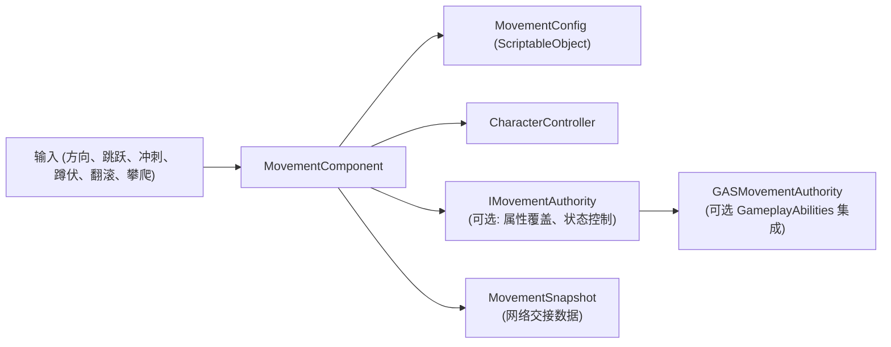

# RPG 移动模块

[English](README.md) | 简体中文

一个基于状态的 Unity 3D 角色移动组件，提供显式输入、旋转、移动状态、snapshot 和可选 GameplayAbilities integration 边界。

## 目录

- [概述](#概述)
- [架构](#架构)
- [快速上手](#快速上手)
- [核心概念](#核心概念)
- [使用指南](#使用指南)
- [进阶主题](#进阶主题)
- [常见场景](#常见场景)
- [性能与内存](#性能与内存)
- [故障排查](#故障排查)

## 概述

`MovementComponent` 提供显式状态机驱动的 3D 移动。移动和旋转已解耦 — 组件处理速度、重力、地面检测、跳跃和状态转换，旋转则通过 `SetLookDirection` 和 `SetRotation` 单独控制。可选的 GAS integration assembly 仅在启用 `CYCLONE_RPGFOUNDATION_HAS_GAMEPLAY_ABILITIES` 时编译。

本包不直接依赖 `CycloneGames.GameplayFramework`。移动与生成所有权保持分离。

### 主要特性

- **状态机** — 显式状态（Idle、Walk、Run、Sprint、Jump、Fall、Crouch、Roll、Climb、WallSlide）
- **解耦旋转** — 移动不自动旋转，旋转通过 `SetLookDirection` / `SetRotation` 控制
- **CharacterController 物理** — 手动重力，`CharacterController.Move` 集成
- **Snapshot 支持** — `MovementSnapshot` 用于网络交接
- **属性修改** — 运行时覆盖，可选 GAS 映射
- **时间缩放** — 全局与组件局部控制
- **攀爬系统** — 梯子和贴墙攀爬

## 架构



`MovementComponent` 是 Unity 组件，必须从主线程调用。`MovementSnapshot` 只作为网络交接数据；多线程模拟应放入纯数据系统或 deterministic integration assembly。

## 快速上手

### 核心 Runtime API

```csharp
movement.SetInputDirection(localMoveDirection);
movement.SetJumpPressed(jumpPressed);
movement.SetSprintHeld(sprintHeld);
movement.SetCrouchHeld(crouchHeld);
movement.SetRollPressed(rollPressed);
movement.RequestClimb(ClimbingMode.Ladder);
movement.RequestClimb(ClimbingMode.Wall, wallNormal);
movement.StopClimb();

MovementSnapshot snapshot = movement.GetSnapshot();
movement.ApplySnapshot(snapshot);
movement.ResetFromSnapshot(snapshot);
```

### 旋转 API

```csharp
movement.SetLookDirection(targetDirection);           // 平滑旋转到目标方向
movement.SetRotation(targetRotation, immediate: true); // 立即旋转
movement.SetRotation(targetDirection, immediate: true); // 从方向立即旋转
movement.ClearLookDirection();                         // 停止自动旋转
```

### 基础玩家控制器

```csharp
using CycloneGames.RPGFoundation.Movement.Runtime;

public class PlayerController : MonoBehaviour
{
    private MovementComponent _movement;

    void Awake() => _movement = GetComponent<MovementComponent>();

    void Update()
    {
        Vector2 moveInput = new Vector2(Input.GetAxis("Horizontal"), Input.GetAxis("Vertical"));
        _movement.SetInputDirection(new Vector3(moveInput.x, 0, moveInput.y));
        _movement.SetJumpPressed(Input.GetButtonDown("Jump"));
        _movement.SetSprintHeld(Input.GetButton("Sprint"));
    }
}
```

## 核心概念

### 移动与旋转已解耦

`MovementComponent` 处理速度、重力、地面检测、跳跃和状态转换。它不会自动将角色转向移动方向。旋转必须显式控制。

### 旋转技术

| 技术 | API | 适用场景 |
| --- | --- | --- |
| 鼠标视角（欧拉角） | `SetLookDirection(dir)` | 带鼠标灵敏度和垂直角度限制的第一/第三人称 |
| 基于相机的方向 | `SetLookDirection(cameraForward)` | 相机跟随的第三人称 |
| 屏幕转世界射线 | `SetLookDirection(hitPoint - position)` | 点击朝向 |
| 手柄右摇杆 | `SetLookDirection(cameraDir)` | 主机/跨平台 |
| 相机相对移动 | `SetInputDirection(local) + SetLookDirection(worldMove)` | 第三人称动作游戏 |

### 相机相对移动

第三人称游戏中输入相对于相机方向时：

```csharp
void Update()
{
    Vector2 moveInput = new Vector2(Input.GetAxis("Horizontal"), Input.GetAxis("Vertical"));

    // 相机相对世界方向
    Vector3 camForward = _camera.transform.forward;
    Vector3 camRight = _camera.transform.right;
    camForward.y = 0f; camRight.y = 0f;
    camForward.Normalize(); camRight.Normalize();
    Vector3 worldMove = (camForward * moveInput.y + camRight * moveInput.x).normalized;

    // 转换为本地空间给 MovementComponent，并设置朝向
    _movement.SetInputDirection(transform.InverseTransformDirection(worldMove));
    if (moveInput.magnitude > 0.1f)
        _movement.SetLookDirection(worldMove);
}
```

### GAS 移动权限

当跳跃、翻滚或攀爬由 ability 实现时，应由 ability 使用 `MovementStateRequestContext.FromAbility(this)` 请求移动状态。GAS authority 会决定激活 ability、直接进入状态，或阻止状态切换。

## 使用指南

### 鼠标视角（欧拉角）

```csharp
private float _verticalRotation = 0f;
private float _horizontalRotation = 0f;

void Update()
{
    Vector2 moveInput = new Vector2(Input.GetAxis("Horizontal"), Input.GetAxis("Vertical"));
    _movement.SetInputDirection(new Vector3(moveInput.x, 0, moveInput.y));

    Vector2 lookInput = new Vector2(Input.GetAxis("Mouse X"), Input.GetAxis("Mouse Y"));
    _horizontalRotation += lookInput.x * 2f;
    _verticalRotation = Mathf.Clamp(_verticalRotation - lookInput.y * 2f, -80f, 80f);

    float hRad = _horizontalRotation * Mathf.Deg2Rad;
    float vRad = _verticalRotation * Mathf.Deg2Rad;
    Vector3 direction = new Vector3(
        Mathf.Sin(hRad) * Mathf.Cos(vRad),
        Mathf.Sin(vRad),
        Mathf.Cos(hRad) * Mathf.Cos(vRad)
    );
    _movement.SetLookDirection(direction.normalized);
}
```

### 手柄右摇杆旋转

```csharp
Vector2 lookInput = new Vector2(Input.GetAxis("RightStickX"), Input.GetAxis("RightStickY"));
if (lookInput.magnitude < 0.1f) return;

Vector3 camRight = _camera.transform.right;
Vector3 camForward = _camera.transform.forward;
camRight.y = 0f; camForward.y = 0f;
camRight.Normalize(); camForward.Normalize();

Vector3 direction = (camForward * lookInput.y + camRight * lookInput.x).normalized;
_movement.SetLookDirection(direction);
```

### 点击朝向

```csharp
if (Input.GetMouseButton(0))
{
    Ray ray = _camera.ScreenPointToRay(Input.mousePosition);
    if (Physics.Raycast(ray, out RaycastHit hit))
    {
        Vector3 direction = (hit.point - transform.position);
        direction.y = 0f;
        _movement.SetLookDirection(direction.normalized);
    }
}
```

### 动画

```csharp
void Update()
{
    var movement = GetComponent<MovementComponent>();
    animator.SetFloat("Speed", movement.CurrentSpeed);
    animator.SetBool("IsGrounded", movement.IsGrounded);
    animator.SetBool("IsCrouching", movement.CurrentState == MovementStateType.Crouch);
}
```

## 进阶主题

### GameplayAbilities 集成

Integration assembly 仅在启用 `CYCLONE_RPGFOUNDATION_HAS_GAMEPLAY_ABILITIES` 且 `CycloneGames.GameplayAbilities.Runtime` 与 `CycloneGames.GameplayTags.Core` 都可用时编译。当移动动词由 ability 拥有时，使用 `MovementStateRequestContext.FromAbility(this)` 请求状态。

### 属性修改

```csharp
var movement = GetComponent<MovementComponent>();
var authority = gameObject.AddComponent<MovementAttributeAuthority>();
movement.MovementAuthority = authority;

authority.SetBaseValueOverride(MovementAttribute.RunSpeed, 7f);
authority.SetMultiplier(MovementAttribute.JumpForce, 1.2f);
```

### 时间缩放

```csharp
Time.timeScale = 0.2f;
movementComponent.LocalTimeScale = 1.5f;
movementComponent.IgnoreTimeScale = true;
```

## 常见场景

### 分离移动和旋转

移动输入控制速度，相机或鼠标独立控制旋转。使用 `SetInputDirection` 处理移动，`SetLookDirection` 处理旋转。

### 自动面向移动方向

```csharp
Vector3 worldMove = GetCameraRelativeMovementDirection(moveInput);
if (moveInput.magnitude > 0.1f)
{
    _movement.SetInputDirection(transform.InverseTransformDirection(worldMove));
    _movement.SetLookDirection(worldMove);
}
```

### 多段跳

在移动 config 中配置 `maxJumpCount`，每次按下消耗一次跳跃次数，接触地面时重置。

## 性能与内存

- 使用 `CharacterController.Move` 进行位移 — 分配取决于 Unity 的 Physics backend。
- Snapshot 为 `readonly struct`，通过 `in` 传递时不产生堆分配。
- `MovementComponent` 仅限主线程。多线程模拟应放入纯数据系统。
- 使用 `MovementAttributeAuthority` 而非逐帧计算属性。

## 故障排查

| 现象             | 原因                                         | 解决方法                                   |
| ---------------- | -------------------------------------------- | ------------------------------------------ |
| 角色穿过地面掉落 | 未附加 `CharacterController` 或 `groundCheck` 位置错误 | 添加 `CharacterController`，将 groundCheck 放在脚部 |
| 旋转未生效       | 缺少 `SetLookDirection` 或 `SetRotation` 调用 | 移动不会自动旋转 — 需显式调用旋转 API     |
| 跳跃未触发       | `IMovementAuthority.CanEnterState` 阻止了状态切换 | 检查 authority 实现                      |
| 攀爬未生效       | config 中缺少 `enableClimbing` 或 layer 错误 | 验证 config 和 layer mask               |
| 性能问题         | 逐帧重复计算属性开销较大                     | 使用 `MovementAttributeAuthority` 缓存覆盖值 |
