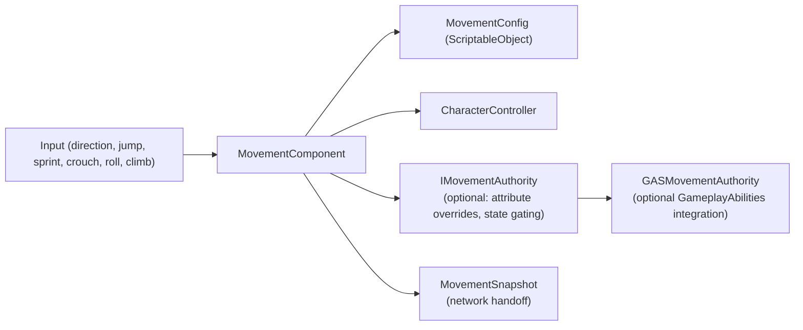

# RPG Movement Component

[English | 简体中文](README.SCH.md)

A state-based 3D character movement component for Unity with explicit input, rotation, movement-state, snapshot, and optional GameplayAbilities integration boundaries.

## Table of Contents

- [Overview](#overview)
- [Architecture](#architecture)
- [Quick Start](#quick-start)
- [Core Concepts](#core-concepts)
- [Usage Guide](#usage-guide)
- [Advanced Topics](#advanced-topics)
- [Common Scenarios](#common-scenarios)
- [Performance and Memory](#performance-and-memory)
- [Troubleshooting](#troubleshooting)

## Overview

`MovementComponent` provides explicit state-machine-driven 3D movement. Movement and rotation are decoupled — the component handles velocity, gravity, ground detection, jumping, and state transitions, while rotation is controlled separately via `SetLookDirection` and `SetRotation`. The optional GAS integration assembly compiles only when `CYCLONE_RPGFOUNDATION_HAS_GAMEPLAY_ABILITIES` is enabled.

This package does not directly depend on `CycloneGames.GameplayFramework`. Movement and spawn ownership remain separate.

### Key Features

- **State machine** — Explicit states (Idle, Walk, Run, Sprint, Jump, Fall, Crouch, Roll, Climb, WallSlide)
- **Decoupled rotation** — Movement does not auto-rotate; rotation controlled via `SetLookDirection` / `SetRotation`
- **CharacterController physics** — Manual gravity, `CharacterController.Move` integration
- **Snapshot support** — `MovementSnapshot` for network handoff
- **Attribute modification** — Runtime overrides with optional GAS mapping
- **Time scaling** — Global and component-local controls
- **Climbing system** — Ladder and wall climbing

## Architecture



`MovementComponent` is a Unity component and must be called from the main thread. Use `MovementSnapshot` as network handoff data; threaded simulation belongs in pure data systems or deterministic integration assemblies.

## Quick Start

### Core Runtime API

```csharp
movement.SetInputDirection(localMoveDirection);
movement.SetJumpPressed(jumpPressed);
movement.SetSprintHeld(sprintHeld);
movement.SetCrouchHeld(crouchHeld);
movement.SetRollPressed(rollPressed);
movement.RequestClimb(ClimbingMode.Ladder);
movement.RequestClimb(ClimbingMode.Wall, wallNormal);
movement.StopClimb();

MovementSnapshot snapshot = movement.GetSnapshot();
movement.ApplySnapshot(snapshot);
movement.ResetFromSnapshot(snapshot);
```

### Rotation API

```csharp
movement.SetLookDirection(targetDirection);           // Smooth rotation toward direction
movement.SetRotation(targetRotation, immediate: true); // Instant rotation
movement.SetRotation(targetDirection, immediate: true); // Instant from direction
movement.ClearLookDirection();                         // Stop automatic rotation
```

### Basic Player Controller

```csharp
using CycloneGames.RPGFoundation.Movement.Runtime;

public class PlayerController : MonoBehaviour
{
    private MovementComponent _movement;

    void Awake() => _movement = GetComponent<MovementComponent>();

    void Update()
    {
        Vector2 moveInput = new Vector2(Input.GetAxis("Horizontal"), Input.GetAxis("Vertical"));
        _movement.SetInputDirection(new Vector3(moveInput.x, 0, moveInput.y));
        _movement.SetJumpPressed(Input.GetButtonDown("Jump"));
        _movement.SetSprintHeld(Input.GetButton("Sprint"));
    }
}
```

## Core Concepts

### Movement and Rotation Are Decoupled

`MovementComponent` handles velocity, gravity, ground detection, jumping, and state transitions. It does not automatically rotate the character toward movement direction. Rotation must be controlled explicitly.

### Rotation Techniques

| Technique | API | Use Case |
| --- | --- | --- |
| Mouse look (Euler) | `SetLookDirection(dir)` | First/third person with mouse sensitivity and vertical clamp |
| Camera-based direction | `SetLookDirection(cameraForward)` | Third-person with camera follow |
| Screen-to-world raycast | `SetLookDirection(hitPoint - position)` | Click-to-look |
| Gamepad right stick | `SetLookDirection(cameraDir)` | Console/cross-platform |
| Camera-relative movement | `SetInputDirection(local) + SetLookDirection(worldMove)` | Third-person action games |

### Camera-Relative Movement

For third-person games where input is relative to camera direction:

```csharp
void Update()
{
    Vector2 moveInput = new Vector2(Input.GetAxis("Horizontal"), Input.GetAxis("Vertical"));

    // Camera-relative world direction
    Vector3 camForward = _camera.transform.forward;
    Vector3 camRight = _camera.transform.right;
    camForward.y = 0f; camRight.y = 0f;
    camForward.Normalize(); camRight.Normalize();
    Vector3 worldMove = (camForward * moveInput.y + camRight * moveInput.x).normalized;

    // Convert to local space for MovementComponent, and set look direction
    _movement.SetInputDirection(transform.InverseTransformDirection(worldMove));
    if (moveInput.magnitude > 0.1f)
        _movement.SetLookDirection(worldMove);
}
```

### GAS Movement Authority

When jump, roll, or climb are implemented as abilities, the ability requests the movement state with `MovementStateRequestContext.FromAbility(this)`. The GAS authority decides whether to activate an ability, enter the state directly, or block the transition.

## Usage Guide

### Mouse Look with Euler Angles

```csharp
private float _verticalRotation = 0f;
private float _horizontalRotation = 0f;

void Update()
{
    Vector2 moveInput = new Vector2(Input.GetAxis("Horizontal"), Input.GetAxis("Vertical"));
    _movement.SetInputDirection(new Vector3(moveInput.x, 0, moveInput.y));

    Vector2 lookInput = new Vector2(Input.GetAxis("Mouse X"), Input.GetAxis("Mouse Y"));
    _horizontalRotation += lookInput.x * 2f;
    _verticalRotation = Mathf.Clamp(_verticalRotation - lookInput.y * 2f, -80f, 80f);

    float hRad = _horizontalRotation * Mathf.Deg2Rad;
    float vRad = _verticalRotation * Mathf.Deg2Rad;
    Vector3 direction = new Vector3(
        Mathf.Sin(hRad) * Mathf.Cos(vRad),
        Mathf.Sin(vRad),
        Mathf.Cos(hRad) * Mathf.Cos(vRad)
    );
    _movement.SetLookDirection(direction.normalized);
}
```

### Gamepad Right Stick Rotation

```csharp
Vector2 lookInput = new Vector2(Input.GetAxis("RightStickX"), Input.GetAxis("RightStickY"));
if (lookInput.magnitude < 0.1f) return;

Vector3 camRight = _camera.transform.right;
Vector3 camForward = _camera.transform.forward;
camRight.y = 0f; camForward.y = 0f;
camRight.Normalize(); camForward.Normalize();

Vector3 direction = (camForward * lookInput.y + camRight * lookInput.x).normalized;
_movement.SetLookDirection(direction);
```

### Click-to-Look

```csharp
if (Input.GetMouseButton(0))
{
    Ray ray = _camera.ScreenPointToRay(Input.mousePosition);
    if (Physics.Raycast(ray, out RaycastHit hit))
    {
        Vector3 direction = (hit.point - transform.position);
        direction.y = 0f;
        _movement.SetLookDirection(direction.normalized);
    }
}
```

### Animation

```csharp
void Update()
{
    var movement = GetComponent<MovementComponent>();
    animator.SetFloat("Speed", movement.CurrentSpeed);
    animator.SetBool("IsGrounded", movement.IsGrounded);
    animator.SetBool("IsCrouching", movement.CurrentState == MovementStateType.Crouch);
}
```

## Advanced Topics

### GameplayAbilities Integration

The integration assembly compiles only when `CYCLONE_RPGFOUNDATION_HAS_GAMEPLAY_ABILITIES` is enabled and both `CycloneGames.GameplayAbilities.Runtime` and `CycloneGames.GameplayTags.Core` are available. When movement verbs are owned by abilities, use `MovementStateRequestContext.FromAbility(this)` to request states.

### Attribute Modification

```csharp
var movement = GetComponent<MovementComponent>();
var authority = gameObject.AddComponent<MovementAttributeAuthority>();
movement.MovementAuthority = authority;

authority.SetBaseValueOverride(MovementAttribute.RunSpeed, 7f);
authority.SetMultiplier(MovementAttribute.JumpForce, 1.2f);
```

### Time Scaling

```csharp
Time.timeScale = 0.2f;
movementComponent.LocalTimeScale = 1.5f;
movementComponent.IgnoreTimeScale = true;
```

## Common Scenarios

### Separate Movement and Rotation

Movement input controls velocity; camera or mouse controls rotation independently. Use `SetInputDirection` for movement and `SetLookDirection` for rotation.

### Auto-face Movement Direction

```csharp
Vector3 worldMove = GetCameraRelativeMovementDirection(moveInput);
if (moveInput.magnitude > 0.1f)
{
    _movement.SetInputDirection(transform.InverseTransformDirection(worldMove));
    _movement.SetLookDirection(worldMove);
}
```

### Multi-jump

Configure `maxJumpCount` in the movement config. Each press consumes one jump count; ground contact resets it.

## Performance and Memory

- Uses `CharacterController.Move` for displacement — allocations depend on Unity's physics backend.
- Snapshots are `readonly struct` with no heap allocation when passed by `in`.
- `MovementComponent` is main-thread only. Threaded simulation belongs in pure data systems.
- Use `MovementAttributeAuthority` instead of per-frame attribute computation.

## Troubleshooting

| Symptom | Cause | Resolution |
| --- | --- | --- |
| Character falls through ground | `CharacterController` not attached or `groundCheck` misplaced | Add `CharacterController`, place ground check at feet |
| Rotation not applied | Missing `SetLookDirection` or `SetRotation` call | Movement does not auto-rotate — call rotation API explicitly |
| Jump not triggering | `CanEnterState` blocked by `IMovementAuthority` | Check authority implementation |
| Climbing not working | Missing `enableClimbing` in config or wrong layer | Verify config and layer masks |
| Performance issues | Heavy per-frame attribute recalculation | Use `MovementAttributeAuthority` for cached overrides |
