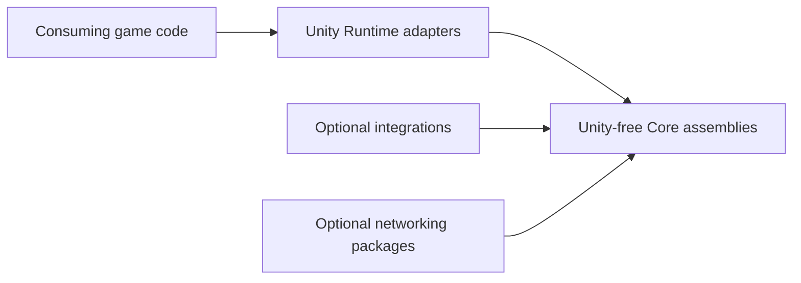

# CycloneGames.RPGFoundation

[English](./README.md) | 简体中文

`CycloneGames.RPGFoundation` 为 Unity 项目提供可复用的 RPG 基础模块。包内系统按玩法领域组织，核心契约与 Unity 运行时对象解耦，Unity-facing 行为通过独立的 Runtime、Editor、Tests 和 Integration 程序集暴露。

当前包包含 `Interaction`、`Movement`、`Projectile` 和 `Trajectory`。可选网络桥接位于独立包中，可选第三方或 CycloneGames 集成位于隔离的 integration assembly 中。

## 如何选择模块

| 模块 | 适用场景 | 不适用场景 |
| --- | --- | --- |
| `Interaction/` | 可交互目标、本地交互请求、权威校验、确定性交互 payload 和交互 authoring 工具。 | 移动、Projectile 模拟或技能目标轨迹查询。 |
| `Movement/` | 2D/3D 移动契约、Unity 移动组件、状态门控、寻路 adapter、动画 adapter 和技能驱动移动集成。 | 命中校验、Projectile 生命周期或光束轨迹求解。 |
| `Projectile/` | 带生命周期、制导、速度、反弹/穿透计数、命中事件、Unity view 和可选网络快照的飞行实体。 | 即时 hitscan 武器、激光反射查询或瞄准预览 trace。 |
| `Trajectory/` | 射线、球形/圆形 sweep、hitscan 武器、光束预览、反射激光、穿透链和服务器命中校验。 | 长生命周期的可视飞行实体或跟踪导弹生命周期状态。 |

火球、奥术飞弹、跟踪导弹、箭矢、可见飞行子弹和任何需要生命周期所有权的对象使用 `Projectile`。轨道炮、激光、霰弹 pellet trace、反射光束、目标预览和权威 hitscan 校验使用 `Trajectory`。

## 包结构

长期维护模块使用以下布局：

```text
<Module>/
  README.md
  README.SCH.md
  Core/
  Runtime/
  Editor/
  Tests/
  Runtime/Integrations/
```

| 目录 | 作用 |
| --- | --- |
| `Core/` | 不依赖 Unity 的契约、值对象、校验逻辑、确定性数据，以及可在 server、headless、CLI 和 Unity 测试环境运行的服务。 |
| `Runtime/` | Unity-facing 组件、ScriptableObject authoring bridge、runtime adapter 和默认 Unity 实现。 |
| `Editor/` | Inspector、window、validator、drawer 和 authoring 工具。 |
| `Tests/` | 模块契约和运行时行为的 EditMode 与 PlayMode 测试。 |
| `Runtime/Integrations/` | 通过独立 asmdef 隔离的可选第三方或 CycloneGames 模块 adapter。 |



Core 程序集设计为可在 Unity、EditMode tests、CLI 工具、headless server 和未来非 Unity adapter 中使用。Runtime 程序集是 Unity 边界。Integration 程序集依赖宿主模块和可选依赖，但宿主模块 Core 不反向依赖 integration。

## 模块文档

| 模块 | 文档 | 概要 |
| --- | --- | --- |
| `Interaction/` | [README.md](./Interaction/README.md) / [README.SCH.md](./Interaction/README.SCH.md) | 交互契约、运行时组件、权威校验、确定性桥接、Inspector 和测试。 |
| `Movement/` | `Movement/Runtime/Movement2D/README.md`、`Movement/Runtime/Movement3D/README.md` | 2D/3D 移动组件、寻路 adapter、动画抽象、状态门控和技能集成。 |
| `Projectile/` | [README.md](./Projectile/README.md) / [README.SCH.md](./Projectile/README.SCH.md) | Projectile 生命周期模拟、制导、碰撞 sweep、反弹/穿透行为、view、Factory-backed pooling bridge、确定性集成和测试。 |
| `Trajectory/` | [README.md](./Trajectory/README.md) / [README.SCH.md](./Trajectory/README.SCH.md) | 即时轨迹求解、swept 命中检测、反射、穿透链、固定 buffer、Unity physics adapter 和确定性集成。 |

## 程序集边界

| Assembly | 职责 |
| --- | --- |
| `CycloneGames.RPGFoundation.Interaction.Core` | 不依赖 Unity 的交互契约、值对象、校验、限流和权威服务。 |
| `CycloneGames.RPGFoundation.Interaction.Runtime` | Unity-facing 交互组件和运行时服务。 |
| `CycloneGames.RPGFoundation.Interaction.Editor` | 交互 Inspector、validator 和 Editor 工具。 |
| `CycloneGames.RPGFoundation.Interaction.Tests.Editor` | 交互 EditMode 测试。 |
| `CycloneGames.RPGFoundation.Movement.Core` | 不依赖 Unity 的移动契约、属性、状态标识、快照和 helper 类型。 |
| `CycloneGames.RPGFoundation.Movement.Runtime` | Unity-facing 2D/3D 移动组件、ScriptableObject 配置、动画抽象和寻路抽象。 |
| `CycloneGames.RPGFoundation.Movement.Editor` | 移动 Inspector 和 authoring 校验。 |
| `CycloneGames.RPGFoundation.Movement.Tests.Editor` | 移动 EditMode 测试。 |
| `CycloneGames.RPGFoundation.Projectile.Core` | 不依赖 Unity 的 projectile definition、spawn request、state、snapshot、simulation、collision contract、event buffer 和 handle。 |
| `CycloneGames.RPGFoundation.Projectile.Runtime` | Unity-facing projectile definition asset、projectile system、collision world、view 和 Factory-backed view pooling bridge。 |
| `CycloneGames.RPGFoundation.Projectile.Editor` | Projectile definition 和 system Inspector。 |
| `CycloneGames.RPGFoundation.Projectile.Tests.Editor` | Projectile EditMode 测试。 |
| `CycloneGames.RPGFoundation.Trajectory.Core` | 不依赖 Unity 的 trajectory query、hit、segment、固定 trace buffer、collision contract 和 solver。 |
| `CycloneGames.RPGFoundation.Trajectory.Runtime` | Unity 2D/3D physics adapter，用于 ray、sphere 和 circle sweep trajectory query。 |
| `CycloneGames.RPGFoundation.Trajectory.Tests.Editor` | Trajectory EditMode 测试。 |

## 与 GameplayAbilities 的关系

`CycloneGames.GameplayAbilities` 应表达玩法意图和效果。RPGFoundation 模块提供可复用的执行基础能力：

- 使用 `Movement` integration 处理技能驱动的移动状态变化。
- 使用 `Trajectory` 为 hitscan 技能、激光光束、反射技能、锥形或 pellet trace、瞄准预览生成 target data。
- 使用 `Projectile` 生成由技能持有的火球、奥术飞弹、箭矢、榴弹和跟踪导弹。
- 使用 `Interaction` 处理交互技能请求、校验和权威检查。

例如，火球技能可以创建 `ProjectileSpawnRequest`，光束技能可以创建 `TrajectoryQuery` 并将 `TrajectoryHit` 结果转换为 ability target data。

## 多人与确定性

本包支持多种多人模型，但不强制绑定某一种网络架构：

- 服务器权威：客户端可以预测本地表现，服务器基于权威状态校验 `Projectile` 和 `Trajectory` 结果。
- 客户端预测与校正：transport-neutral networking packages 可以承载 snapshot、correction data、prediction key 和 validation payload。
- Lockstep 或 rollback：需要 bit-identical 模拟时，使用 `DeterministicMath` integration 和确定性 collision world。

Unity Physics 不是所有支持平台上的确定性 lockstep 真相来源。Unity physics adapter 适合客户端表现、Editor 工具和服务器权威 Unity 模拟。Lockstep 或 rollback 命中校验应使用确定性 collision world 和稳定 target ID。

## 可选集成

可选集成隔离在独立程序集中，因此基础包在未安装可选包时也能编译。Cyclone 网络桥接由独立可选包提供。

| Integration Assembly | 依赖 |
| --- | --- |
| `CycloneGames.RPGFoundation.Interaction.Integrations.DeterministicMath` | `CycloneGames.DeterministicMath.Core` |
| `CycloneGames.RPGFoundation.Interaction.Integrations.GameplayFramework` | `CycloneGames.GameplayFramework.Runtime` |
| `CycloneGames.RPGFoundation.Interaction.Integrations.DeterministicMath.GameplayFramework` | DeterministicMath + GameplayFramework |
| `CycloneGames.RPGFoundation.Movement.Integrations.DeterministicMath` | `CycloneGames.DeterministicMath.Core` |
| `CycloneGames.RPGFoundation.Movement.Integrations.Animancer` | `Kybernetik.Animancer` |
| `CycloneGames.RPGFoundation.Movement.Integrations.UnityNavigation` | `Unity.AI.Navigation` |
| `CycloneGames.RPGFoundation.Movement.Integrations.AStar` | `AstarPathfindingProject` |
| `CycloneGames.RPGFoundation.Movement.Integrations.AgentsNavigation` | ProjectDawn Agents Navigation |
| `CycloneGames.RPGFoundation.Movement.Integrations.GameplayAbilities` | `CycloneGames.GameplayAbilities.Runtime` + `CycloneGames.GameplayTags.Core` |
| `CycloneGames.RPGFoundation.Projectile.Integrations.DeterministicMath` | `CycloneGames.DeterministicMath.Core` |
| `CycloneGames.RPGFoundation.Trajectory.Integrations.DeterministicMath` | `CycloneGames.DeterministicMath.Core` |

可选网络包：

| Package | 依赖 | 作用 |
| --- | --- | --- |
| `CycloneGames.RPGFoundation.Interaction.Networking` | `CycloneGames.Networking.Core` | 与传输层无关的 interaction request、result、cancel 和 authority validation contract。 |
| `CycloneGames.RPGFoundation.Movement.Networking` | `CycloneGames.Networking.Core` | 与传输层无关的 movement input、authoritative snapshot、correction、teleport、full-state request、authority transfer、input validation、history 和 reconciliation contract。 |
| `CycloneGames.RPGFoundation.Projectile.Networking` | `CycloneGames.Networking.Core` | 与传输层无关的 projectile spawn、snapshot、hit、despawn、prediction、authority 和 validation contract。 |

## Define 符号

以下符号由 integration asmdef 通过 `versionDefines` 或 define constraints 生成或消费。它们用于诊断和 integration-local 条件编译，不作为项目级全局要求。

| Symbol | 启用内容 |
| --- | --- |
| `CYCLONE_RPGFOUNDATION_HAS_DETERMINISTIC_MATH` | Interaction、Movement、Projectile 和 Trajectory DeterministicMath 集成。 |
| `CYCLONE_RPGFOUNDATION_HAS_GAMEPLAY_FRAMEWORK` | Interaction GameplayFramework 集成。 |
| `CYCLONE_RPGFOUNDATION_HAS_ANIMANCER` | Movement Animancer 集成。 |
| `CYCLONE_RPGFOUNDATION_HAS_UNITY_AI_NAVIGATION` | Movement Unity AI Navigation 集成。 |
| `CYCLONE_RPGFOUNDATION_HAS_ASTAR_PATHFINDING` | Movement A* Pathfinding 集成。 |
| `CYCLONE_RPGFOUNDATION_HAS_AGENTS_NAVIGATION` | Movement Agents Navigation 集成。 |
| `CYCLONE_RPGFOUNDATION_HAS_GAMEPLAY_ABILITIES` | Movement GameplayAbilities 集成，依赖 GameplayAbilities 和 GameplayTags 程序集。 |

## Package Manifest 说明

本包存放在 `Assets/ThirdParty/CycloneGames/` 下。Unity 不会像已安装 UPM 包那样，基于同目录 `package.json` 的 dependency 字段自动启用或禁用本地 Assets 文件夹模块。真实编译边界由项目中的 `.asmdef` 引用、define constraints、version defines 和源码文件决定。

## 持久化

本包不定义运行时存档、Editor 偏好、PlayerPrefs、EditorPrefs、SessionState、registry entry 或隐藏缓存。配置和持久化玩法状态由接入项目或明确声明该行为的可选模块持有。

## 验证

修改程序集、移动文件、更新 integration reference 或调整序列化契约后运行以下检查：

```text
Unity Test Runner > EditMode > CycloneGames.RPGFoundation.Interaction.Tests.Editor
Unity Test Runner > EditMode > CycloneGames.RPGFoundation.Movement.Tests.Editor
Unity Test Runner > EditMode > CycloneGames.RPGFoundation.Projectile.Tests.Editor
Unity Test Runner > EditMode > CycloneGames.RPGFoundation.Trajectory.Tests.Editor
Unity Test Runner > EditMode > optional RPGFoundation networking package tests when present
```

启用 `CYCLONE_RPGFOUNDATION_HAS_DETERMINISTIC_MATH` 时，还应运行：

```text
Unity Test Runner > EditMode > CycloneGames.RPGFoundation.Interaction.DeterministicMath.Tests.Editor
Unity Test Runner > EditMode > CycloneGames.RPGFoundation.Movement.DeterministicMath.Tests.Editor
Unity Test Runner > EditMode > CycloneGames.RPGFoundation.Projectile.DeterministicMath.Tests.Editor
Unity Test Runner > EditMode > CycloneGames.RPGFoundation.Trajectory.DeterministicMath.Tests.Editor
```

Unity 刷新 generated project files 后可执行 CLI 检查：

```text
dotnet build UnityStarter/CycloneGames.RPGFoundation.Movement.Core.csproj --nologo
dotnet build UnityStarter/CycloneGames.RPGFoundation.Movement.Runtime.csproj --nologo
dotnet build UnityStarter/CycloneGames.RPGFoundation.Projectile.Core.csproj --nologo
dotnet build UnityStarter/CycloneGames.RPGFoundation.Trajectory.Core.csproj --nologo
```
