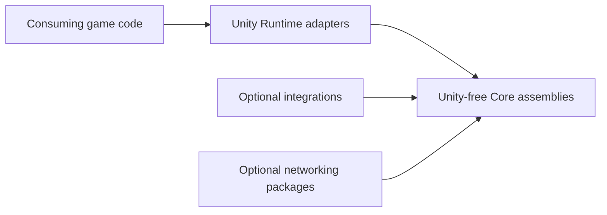

# CycloneGames.RPGFoundation

English | [Simplified Chinese](./README.SCH.md)

`CycloneGames.RPGFoundation` provides reusable RPG-oriented foundation modules for Unity projects. The package groups gameplay-facing systems by domain, keeps core contracts independent from Unity runtime objects, and exposes Unity-facing behavior through dedicated Runtime, Editor, Tests, and Integration assemblies.

The package currently includes `Interaction`, `Movement`, `Projectile`, and `Trajectory`. Optional networking bridges live in separate packages, and optional third-party or CycloneGames integrations live behind isolated integration assemblies.

## When to Use Each Module

| Module | Use it for | Do not use it for |
| --- | --- | --- |
| `Interaction/` | Interactable targets, local interaction requests, authority validation, deterministic interaction payloads, and interaction authoring tools. | Movement, projectile simulation, or ability target tracing. |
| `Movement/` | 2D/3D movement contracts, Unity movement components, state gates, pathfinding adapters, animation adapters, and ability-driven movement integration. | Hit validation, projectile lifetime, or beam trajectory solving. |
| `Projectile/` | Spawned flying entities with lifetime, guidance, velocity, bounce/pierce counters, hit events, Unity views, and optional network snapshots. | Instant hitscan weapons, laser ricochet queries, or aim preview traces. |
| `Trajectory/` | Immediate path solving for rays, sphere/circle sweeps, hitscan weapons, beam previews, ricochet lasers, pierce chains, and server hit validation. | Long-lived visual projectile entities or homing missile lifetime state. |

Use `Projectile` for fireballs, arcane missiles, homing missiles, arrows, bullets with visible travel, and any object that needs lifecycle ownership. Use `Trajectory` for railguns, lasers, shotgun pellet traces, ricochet beams, target previews, and authoritative hitscan validation.

## Package Layout

Long-lived modules use this layout:

```text
<Module>/
  README.md
  README.SCH.md
  Core/
  Runtime/
  Editor/
  Tests/
  Runtime/Integrations/
```

| Directory | Purpose |
| --- | --- |
| `Core/` | Unity-free contracts, value objects, validation logic, deterministic data, and services for server, headless, CLI, and Unity test contexts. |
| `Runtime/` | Unity-facing components, ScriptableObject authoring bridges, runtime adapters, and default Unity implementations. |
| `Editor/` | Inspectors, windows, validators, drawers, and authoring tools. |
| `Tests/` | EditMode and PlayMode coverage for module contracts and runtime behavior. |
| `Runtime/Integrations/` | Optional third-party or CycloneGames module adapters isolated behind their own asmdefs. |



Core assemblies are intended to be usable from Unity, EditMode tests, CLI tools, headless servers, and future non-Unity adapters. Runtime assemblies are the Unity boundary. Integration assemblies depend on the host module and the optional dependency, but host module Core assemblies do not depend on integrations.

## Module Documentation

| Module | Documentation | Summary |
| --- | --- | --- |
| `Interaction/` | [README.md](./Interaction/README.md) / [README.SCH.md](./Interaction/README.SCH.md) | Interaction contracts, runtime components, authority validation, deterministic bridges, inspectors, and tests. |
| `Movement/` | `Movement/Runtime/Movement2D/README.md`, `Movement/Runtime/Movement3D/README.md` | 2D/3D movement components, pathing adapters, animation abstraction, state gates, and ability integration. |
| `Projectile/` | [README.md](./Projectile/README.md) / [README.SCH.md](./Projectile/README.SCH.md) | Projectile lifecycle simulation, guidance, collision sweep, bounce/pierce behavior, views, pooling bridge, deterministic integration, and tests. |
| `Trajectory/` | [README.md](./Trajectory/README.md) / [README.SCH.md](./Trajectory/README.SCH.md) | Immediate trajectory solving, swept hit detection, reflection, pierce chains, fixed buffers, Unity physics adapters, and deterministic integration. |

## Assembly Boundary

| Assembly | Role |
| --- | --- |
| `CycloneGames.RPGFoundation.Interaction.Core` | Unity-free interaction contracts, value objects, validation, rate limiting, and authority services. |
| `CycloneGames.RPGFoundation.Interaction.Runtime` | Unity-facing interaction components and runtime services. |
| `CycloneGames.RPGFoundation.Interaction.Editor` | Interaction inspectors, validators, and editor tools. |
| `CycloneGames.RPGFoundation.Interaction.Tests.Editor` | Interaction EditMode tests. |
| `CycloneGames.RPGFoundation.Movement.Core` | Unity-free movement contracts, attributes, state identifiers, snapshots, and helper types. |
| `CycloneGames.RPGFoundation.Movement.Runtime` | Unity-facing 2D/3D movement components, ScriptableObject configs, animation abstraction, and pathfinding abstraction. |
| `CycloneGames.RPGFoundation.Movement.Editor` | Movement inspectors and authoring validation. |
| `CycloneGames.RPGFoundation.Movement.Tests.Editor` | Movement EditMode tests. |
| `CycloneGames.RPGFoundation.Projectile.Core` | Unity-free projectile definitions, spawn requests, state, snapshots, simulation, collision contracts, event buffers, and handles. |
| `CycloneGames.RPGFoundation.Projectile.Runtime` | Unity-facing projectile definition assets, projectile systems, collision worlds, views, and Factory-backed view pooling bridge. |
| `CycloneGames.RPGFoundation.Projectile.Editor` | Projectile definition and system inspectors. |
| `CycloneGames.RPGFoundation.Projectile.Tests.Editor` | Projectile EditMode tests. |
| `CycloneGames.RPGFoundation.Trajectory.Core` | Unity-free trajectory queries, hits, segments, fixed trace buffers, collision contracts, and solver. |
| `CycloneGames.RPGFoundation.Trajectory.Runtime` | Unity 2D/3D physics adapters for ray, sphere, and circle sweep trajectory queries. |
| `CycloneGames.RPGFoundation.Trajectory.Tests.Editor` | Trajectory EditMode tests. |

## GameplayAbilities Fit

`CycloneGames.GameplayAbilities` should create gameplay intent and effects. RPGFoundation modules provide reusable execution primitives:

- Use `Movement` integrations for ability-driven movement state changes.
- Use `Trajectory` to build target data for hitscan skills, laser beams, ricochet abilities, cone or pellet traces, and aim previews.
- Use `Projectile` to spawn ability-owned fireballs, arcane missiles, arrows, grenades, and homing missiles.
- Use `Interaction` for interact ability requests, validation, and authority checks.

For example, a fireball ability can create a `ProjectileSpawnRequest`, while a beam ability can create a `TrajectoryQuery` and convert `TrajectoryHit` results into ability target data.

## Multiplayer and Determinism

The package supports multiple multiplayer models, but it does not force one networking architecture:

- Server authoritative: clients may predict local presentation, while the server validates `Projectile` and `Trajectory` results from authoritative state.
- Client prediction with reconciliation: transport-neutral networking packages can carry snapshots, correction data, prediction keys, and validation payloads.
- Lockstep or rollback: use `DeterministicMath` integrations and deterministic collision worlds where bit-identical simulation is required.

Unity Physics is not a deterministic lockstep source of truth across all supported platforms. Use Unity physics adapters for client presentation, editor tooling, and server-authoritative Unity simulations. Use deterministic collision worlds and stable target IDs for lockstep or rollback hit validation.

## Optional Integrations

Optional integrations are isolated in their own assemblies so the base package compiles without optional packages installed. Cyclone networking bridges are provided by separate optional packages.

| Integration Assembly | Dependency |
| --- | --- |
| `CycloneGames.RPGFoundation.Interaction.Integrations.DeterministicMath` | `CycloneGames.DeterministicMath.Core` |
| `CycloneGames.RPGFoundation.Interaction.Integrations.GameplayFramework` | `CycloneGames.GameplayFramework.Runtime` |
| `CycloneGames.RPGFoundation.Interaction.Integrations.DeterministicMath.GameplayFramework` | DeterministicMath + GameplayFramework |
| `CycloneGames.RPGFoundation.Movement.Integrations.DeterministicMath` | `CycloneGames.DeterministicMath.Core` |
| `CycloneGames.RPGFoundation.Movement.Integrations.Animancer` | `Kybernetik.Animancer` |
| `CycloneGames.RPGFoundation.Movement.Integrations.UnityNavigation` | `Unity.AI.Navigation` |
| `CycloneGames.RPGFoundation.Movement.Integrations.AStar` | `AstarPathfindingProject` |
| `CycloneGames.RPGFoundation.Movement.Integrations.AgentsNavigation` | ProjectDawn Agents Navigation |
| `CycloneGames.RPGFoundation.Movement.Integrations.GameplayAbilities` | `CycloneGames.GameplayAbilities.Runtime` + `CycloneGames.GameplayTags.Core` |
| `CycloneGames.RPGFoundation.Projectile.Integrations.DeterministicMath` | `CycloneGames.DeterministicMath.Core` |
| `CycloneGames.RPGFoundation.Trajectory.Integrations.DeterministicMath` | `CycloneGames.DeterministicMath.Core` |

Optional networking packages:

| Package | Dependency | Purpose |
| --- | --- | --- |
| `CycloneGames.RPGFoundation.Interaction.Networking` | `CycloneGames.Networking.Core` | Transport-neutral interaction request, result, cancel, and authority validation contracts. |
| `CycloneGames.RPGFoundation.Movement.Networking` | `CycloneGames.Networking.Core` | Transport-neutral movement input, authoritative snapshot, correction, teleport, full-state request, authority transfer, input validation, history, and reconciliation contracts. |
| `CycloneGames.RPGFoundation.Projectile.Networking` | `CycloneGames.Networking.Core` | Transport-neutral projectile spawn, snapshot, hit, despawn, prediction, authority, and validation contracts. |

## Defines

These symbols are generated or consumed by integration asmdefs through `versionDefines` or define constraints. They are diagnostics and integration-local compile switches, not project-wide requirements.

| Symbol | Enables |
| --- | --- |
| `CYCLONE_RPGFOUNDATION_HAS_DETERMINISTIC_MATH` | Interaction, Movement, Projectile, and Trajectory DeterministicMath integrations. |
| `CYCLONE_RPGFOUNDATION_HAS_GAMEPLAY_FRAMEWORK` | Interaction GameplayFramework integration. |
| `CYCLONE_RPGFOUNDATION_HAS_ANIMANCER` | Movement Animancer integration. |
| `CYCLONE_RPGFOUNDATION_HAS_UNITY_AI_NAVIGATION` | Movement Unity AI Navigation integration. |
| `CYCLONE_RPGFOUNDATION_HAS_ASTAR_PATHFINDING` | Movement A* Pathfinding integration. |
| `CYCLONE_RPGFOUNDATION_HAS_AGENTS_NAVIGATION` | Movement Agents Navigation integration. |
| `CYCLONE_RPGFOUNDATION_HAS_GAMEPLAY_ABILITIES` | Movement GameplayAbilities integration with GameplayAbilities and GameplayTags assemblies. |

## Package Manifest Note

This package is stored under `Assets/ThirdParty/CycloneGames/`. Unity does not automatically enable or disable local Asset-folder modules based on `package.json` dependency fields in the same way it does for installed UPM packages. The effective compile boundary is defined by `.asmdef` references, define constraints, version defines, and the files present in the current checkout.

## Persistence

This package does not define runtime save files, editor preferences, PlayerPrefs, EditorPrefs, SessionState data, registry entries, or hidden caches. Configuration and persistent gameplay state are owned by the consuming project or by the specific optional module that declares them.

## Validation

Run these checks after changing assemblies, moving files, updating integration references, or changing serialized contracts:

```text
Unity Test Runner > EditMode > CycloneGames.RPGFoundation.Interaction.Tests.Editor
Unity Test Runner > EditMode > CycloneGames.RPGFoundation.Movement.Tests.Editor
Unity Test Runner > EditMode > CycloneGames.RPGFoundation.Projectile.Tests.Editor
Unity Test Runner > EditMode > CycloneGames.RPGFoundation.Trajectory.Tests.Editor
Unity Test Runner > EditMode > optional RPGFoundation networking package tests when present
```

When `CYCLONE_RPGFOUNDATION_HAS_DETERMINISTIC_MATH` is enabled, also run:

```text
Unity Test Runner > EditMode > CycloneGames.RPGFoundation.Interaction.DeterministicMath.Tests.Editor
Unity Test Runner > EditMode > CycloneGames.RPGFoundation.Movement.DeterministicMath.Tests.Editor
Unity Test Runner > EditMode > CycloneGames.RPGFoundation.Projectile.DeterministicMath.Tests.Editor
Unity Test Runner > EditMode > CycloneGames.RPGFoundation.Trajectory.DeterministicMath.Tests.Editor
```

For CLI-oriented checks after Unity refreshes generated project files:

```text
dotnet build UnityStarter/CycloneGames.RPGFoundation.Movement.Core.csproj --nologo
dotnet build UnityStarter/CycloneGames.RPGFoundation.Movement.Runtime.csproj --nologo
dotnet build UnityStarter/CycloneGames.RPGFoundation.Projectile.Core.csproj --nologo
dotnet build UnityStarter/CycloneGames.RPGFoundation.Trajectory.Core.csproj --nologo
```
