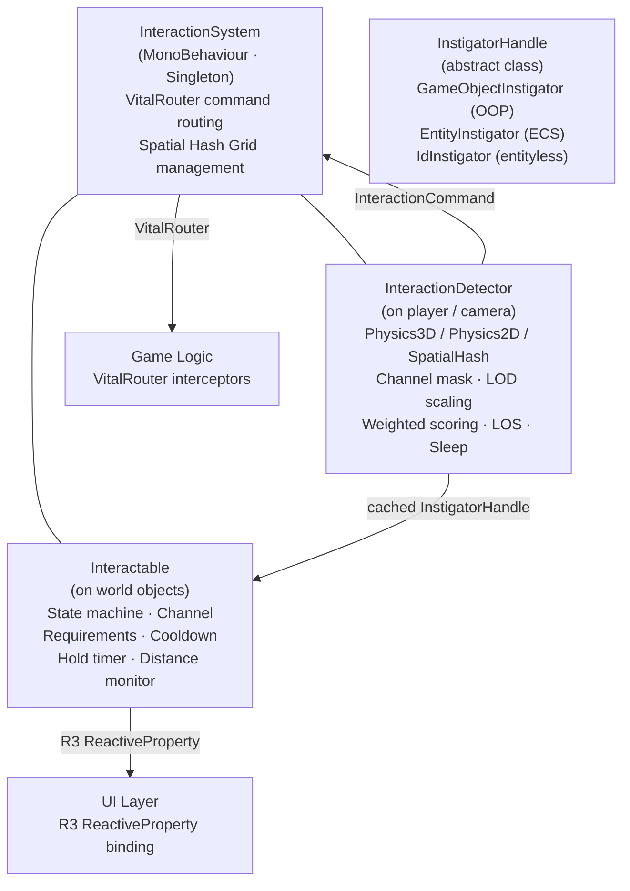
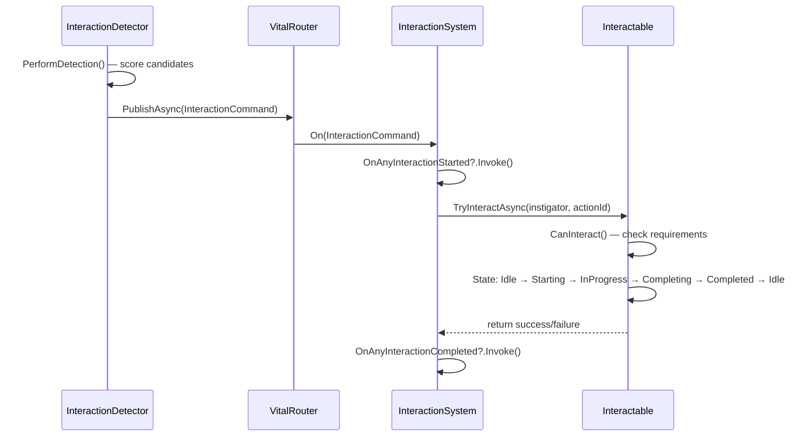
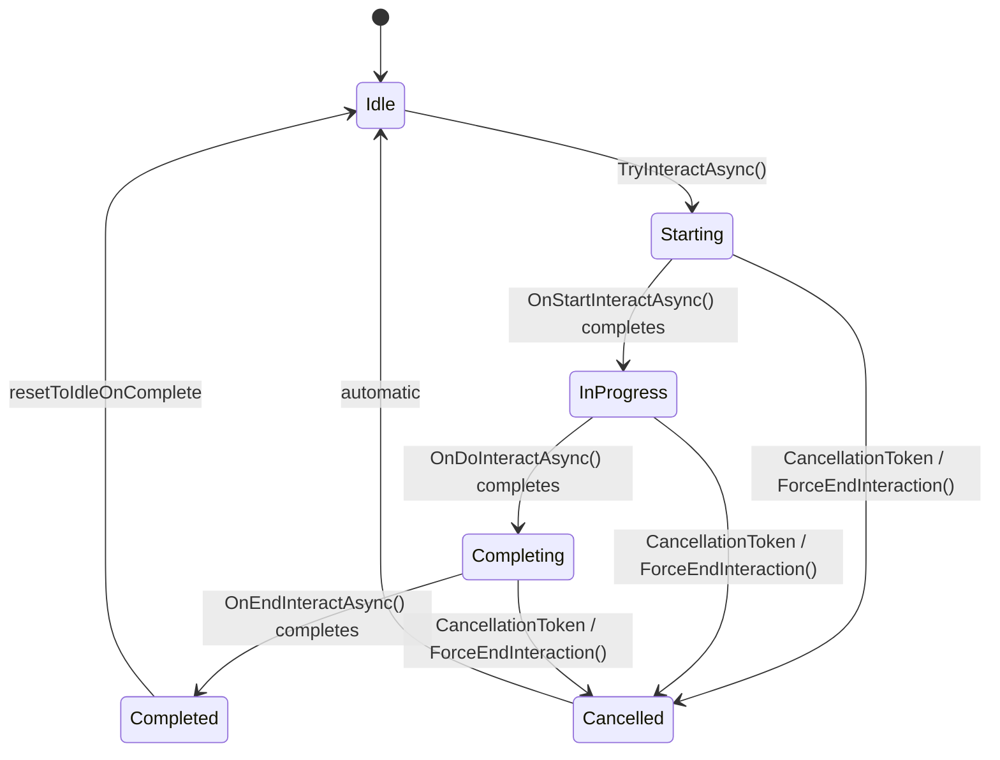

# RPG Interaction Module

[**English**] | [**简体中文**](README.SCH.md)

A high-performance, zero-GC, reactive interaction system for Unity. Supports **3D**, **2D**, and **Spatial Hash** detection modes, designed to scale to thousands of interactable objects. Built on **R3** (Reactive Extensions), **VitalRouter** (command routing), and **UniTask** (async operations).

---

## Table of Contents

- [RPG Interaction Module](#rpg-interaction-module)
  - [Table of Contents](#table-of-contents)
  - [Features](#features)
  - [Architecture](#architecture)
  - [Dependencies](#dependencies)
  - [Quick Start](#quick-start)
    - [Step 1 — Add the InteractionSystem](#step-1--add-the-interactionsystem)
    - [Step 2 — Create an Interactable](#step-2--create-an-interactable)
    - [Step 3 — Add an InteractionDetector](#step-3--add-an-interactiondetector)
    - [Step 4 — Trigger Interaction from Input](#step-4--trigger-interaction-from-input)
    - [Step 5 — Display Prompt UI](#step-5--display-prompt-ui)
  - [Tutorials](#tutorials)
    - [Tutorial A — Physics3D Detection](#tutorial-a--physics3d-detection)
    - [Tutorial B — Physics2D Detection](#tutorial-b--physics2d-detection)
    - [Tutorial C — Spatial Hash Detection](#tutorial-c--spatial-hash-detection)
    - [Tutorial D — Runtime Mode Switching](#tutorial-d--runtime-mode-switching)
    - [Detection Mode Comparison](#detection-mode-comparison)
  - [Core Concepts](#core-concepts)
    - [Interaction Lifecycle](#interaction-lifecycle)
    - [State Machine](#state-machine)
    - [Detection Modes](#detection-modes)
    - [Channel Filtering](#channel-filtering)
    - [Scoring Algorithm](#scoring-algorithm)
    - [LOD System](#lod-system)
    - [Instigator System](#instigator-system)
  - [Component Reference](#component-reference)
    - [InteractionSystem](#interactionsystem)
    - [Interactable](#interactable)
    - [InteractionDetector](#interactiondetector)
  - [Advanced Usage](#advanced-usage)
    - [Custom Interactable Logic](#custom-interactable-logic)
    - [Interaction Requirements](#interaction-requirements)
    - [Two-State Interactions](#two-state-interactions)
    - [Pickable Items](#pickable-items)
    - [Multi-Action Prompts](#multi-action-prompts)
    - [Hold-to-Interact Timer](#hold-to-interact-timer)
    - [Distance Auto-Cancellation](#distance-auto-cancellation)
    - [Cancellation Reasons](#cancellation-reasons)
    - [Instigator Tracking](#instigator-tracking)
    - [Batch Interactions](#batch-interactions)
    - [Global Interaction Events](#global-interaction-events)
    - [Nearby Candidates List](#nearby-candidates-list)
    - [Interaction Progress](#interaction-progress)
    - [Effect Pool System](#effect-pool-system)
    - [VitalRouter Integration](#vitalrouter-integration)
    - [Localization](#localization)
    - [UI Binding with R3](#ui-binding-with-r3)
  - [Performance \& Safety](#performance--safety)
    - [Zero-GC Design](#zero-gc-design)
    - [Spatial Hash Grid (DOD)](#spatial-hash-grid-dod)
    - [Thread Safety](#thread-safety)
    - [Memory Safety](#memory-safety)
    - [Cross-Platform](#cross-platform)
  - [Editor Tools](#editor-tools)
  - [File Inventory](#file-inventory)
    - [Runtime (23 files)](#runtime-23-files)
    - [Editor (7 files)](#editor-7-files)
  - [API Reference](#api-reference)
    - [Interfaces](#interfaces)
    - [Classes](#classes)
    - [Structs](#structs)
    - [Enums](#enums)
  - [FAQ](#faq)

---

## Features

| Category                    | Description                                                                                                                                              |
| --------------------------- | -------------------------------------------------------------------------------------------------------------------------------------------------------- |
| **Multi-Mode Detection**    | Physics3D, Physics2D, and SpatialHash — supports any game type.                                                                                          |
| **Reactive Architecture**   | R3 `ReactiveProperty` for event-driven UI binding.                                                                                                       |
| **VitalRouter Integration** | Decoupled command routing for local and networked interactions.                                                                                          |
| **LOD Detection**           | Adaptive frequency scaling: fast when close, slow when far, sleep when idle.                                                                             |
| **Channel Filtering**       | 16 semantics-free flag channels (user defines meaning via game-layer aliases) for selective detection.                                                   |
| **Requirement System**      | Pluggable `IInteractionRequirement` conditions (key, level, quest state).                                                                                |
| **Weighted Scoring**        | Target selection combining distance, angle, and configurable priority weight.                                                                            |
| **Nearby Candidates**       | Exposes all scored candidates — PUBG-style loot lists and gamepad target cycling.                                                                        |
| **Interaction Progress**    | Continuous 0–1 progress for timed/hold interactions (progress bars).                                                                                     |
| **Multi-Action Prompts**    | Single interactable exposes multiple actions ("E: Pick Up / F: Examine").                                                                                |
| **Instigator System**       | `InstigatorHandle` abstract class — supports OOP (`GameObjectInstigator`), ECS, entityless, and networked games with compile-time zero-boxing guarantee. |
| **Hold-to-Interact**        | Built-in `holdDuration` with automatic progress reporting.                                                                                               |
| **Distance Auto-Cancel**    | Auto-cancels if the instigator walks beyond `maxInteractionRange`.                                                                                       |
| **Cancel Reasons**          | Typed `InteractionCancelReason` enum for gameplay reactions.                                                                                             |
| **Batch Interactions**      | `TryInteractAll()` triggers all nearby targets — "pick up all" mechanics.                                                                                |
| **Global Events**           | `OnAnyInteractionStarted` / `OnAnyInteractionCompleted` for analytics.                                                                                   |
| **Spatial Hash Grid**       | O(1) spatial partitioning with DOD SoA layout — 10k+ objects, zero GC.                                                                                   |
| **Two-State Pattern**       | Toggle interaction (open/close, on/off) via `TwoStateInteractionBase`.                                                                                   |
| **Effect Pool**             | Zero-allocation VFX spawning with auto return-to-pool.                                                                                                   |
| **Localization Ready**      | `InteractionPromptData` for multi-language prompt text.                                                                                                  |
| **Editor Tooling**          | Custom Inspectors, Scene Debugger, Scene Overview, Validator Window, Gizmos.                                                                             |
| **Cross-Platform**          | Windows, macOS, Linux, Android, iOS, WebGL, Consoles. No `unsafe` code.                                                                                  |

---

## Architecture



**Data flow:**



---

## Dependencies

| Package                          | Purpose                                                         | Required |
| -------------------------------- | --------------------------------------------------------------- | -------- |
| **R3**                           | Reactive properties and observables for UI binding              | Yes      |
| **VitalRouter**                  | Command routing and interceptor pipeline                        | Yes      |
| **UniTask**                      | Async/await without allocation on Unity's main thread           | Yes      |
| **CycloneGames.Factory.Runtime** | Object pooling (`ObjectPool`, `IPoolable`, `MonoPrefabFactory`) | Yes      |

---

## Quick Start

### Step 1 — Add the InteractionSystem

Create an empty GameObject in the scene, add the `InteractionSystem` component.

| Inspector Field | Type    | Default | Description                                                            |
| --------------- | ------- | ------- | ---------------------------------------------------------------------- |
| **Is 2D Mode**  | `bool`  | `false` | `true` for 2D games (X/Y hashing), `false` for 3D (X/Z).               |
| **Cell Size**   | `float` | `10`    | Spatial hash cell size. Larger = fewer cells, smaller = finer queries. |

### Step 2 — Create an Interactable

Add `Interactable` (or a subclass) to any world object.

| Inspector Field           | Type                 | Default      | Description                                                         |
| ------------------------- | -------------------- | ------------ | ------------------------------------------------------------------- |
| **Interaction Prompt**    | `string`             | `"Interact"` | UI text shown to the player.                                        |
| **Is Interactable**       | `bool`               | `true`       | Whether this object accepts interactions.                           |
| **Auto Interact**         | `bool`               | `false`      | Trigger automatically when detected (no input).                     |
| **Priority**              | `int`                | `0`          | Higher = preferred by the scoring algorithm.                        |
| **Interaction Distance**  | `float`              | `2`          | Max detection range from the detector.                              |
| **Interaction Point**     | `Transform`          | `null`       | Override position for detection (defaults to `transform.position`). |
| **Channel**               | `InteractionChannel` | `Channel0`   | Category flag for selective detection.                              |
| **Interaction Cooldown**  | `float`              | `0`          | Seconds before re-interaction is allowed.                           |
| **Hold Duration**         | `float`              | `0`          | Seconds the player must hold to complete (0 = instant).             |
| **Max Interaction Range** | `float`              | `0`          | Auto-cancel distance during interaction (0 = disabled).             |

**Requirements:** Add a `Collider` (3D) or `Collider2D` (2D) set to **Is Trigger = true** on the same GameObject or a child. Set its layer to match the detector's **Interactable Layer** mask.

### Step 3 — Add an InteractionDetector

Add `InteractionDetector` to the player or camera.

| Inspector Field        | Type                 | Default       | Description                                        |
| ---------------------- | -------------------- | ------------- | -------------------------------------------------- |
| **Detection Mode**     | `DetectionMode`      | `Physics3D`   | Select `Physics3D`, `Physics2D`, or `SpatialHash`. |
| **Detection Radius**   | `float`              | `3`           | Scan radius around the detection origin.           |
| **Interactable Layer** | `LayerMask`          | —             | Physics layers to scan (set this!).                |
| **Obstruction Layer**  | `LayerMask`          | `1`           | Layers that block line-of-sight.                   |
| **Detection Offset**   | `Vector3`            | `(0, 1.5, 0)` | Offset from origin (e.g., eye height).             |
| **Max Interactables**  | `int`                | `64`          | Pre-allocated buffer size for overlap queries.     |
| **Channel Mask**       | `InteractionChannel` | `All`         | Which channels to detect.                          |
| **Distance Weight**    | `float`              | `1`           | Scoring weight for distance.                       |
| **Angle Weight**       | `float`              | `2`           | Scoring weight for facing angle.                   |
| **Priority Weight**    | `float`              | `100`         | Scoring weight for the `Priority` field.           |

### Step 4 — Trigger Interaction from Input

```csharp
using UnityEngine;
using UnityEngine.InputSystem;

public class PlayerInteraction : MonoBehaviour
{
    [SerializeField] private InteractionDetector detector;

    void Update()
    {
        if (Keyboard.current.eKey.wasPressedThisFrame)
            detector.TryInteract();
    }
}
```

### Step 5 — Display Prompt UI

```csharp
using UnityEngine;
using UnityEngine.UI;
using R3;

public class InteractionPromptUI : MonoBehaviour
{
    [SerializeField] private InteractionDetector detector;
    [SerializeField] private Text promptText;
    [SerializeField] private GameObject promptPanel;

    void Start()
    {
        detector.CurrentInteractable.Subscribe(i =>
        {
            bool hasTarget = i != null;
            promptPanel.SetActive(hasTarget);
            if (hasTarget)
                promptText.text = $"[E] {i.InteractionPrompt}";
        }).AddTo(this);
    }
}
```

---

## Tutorials

### Tutorial A — Physics3D Detection

Best for: FPS, third-person, VR games.

**Scene setup:**

```
Scene
├── [InteractionSystem]        (InteractionSystem component)
├── Player                     (CharacterController, InteractionDetector, PlayerInteraction)
│   └── Camera
├── Chest_01                   (Interactable, BoxCollider isTrigger=true, Layer=Interactable)
└── Door_01                    (Interactable, BoxCollider isTrigger=true, Layer=Interactable)
```

1. Create layer "Interactable" in Project Settings → Tags and Layers.
2. On player's `InteractionDetector`: set **Detection Mode** to `Physics3D`, **Interactable Layer** = `Interactable`.
3. On chest/door: set **Layer** = `Interactable`, add `Collider` with **Is Trigger** = `true`.
4. Write your input script as shown in Step 4 above.

### Tutorial B — Physics2D Detection

Best for: platformers, top-down 2D, visual novels.

Same setup as Tutorial A, but:

- Use `Collider2D` instead of `Collider` on interactables.
- Set `InteractionDetector.DetectionMode = Physics2D`.
- Set `InteractionSystem.Is2DMode = true`.
- 2D detection uses `detectionOrigin.right` as the forward direction (standard for 2D Unity games).

### Tutorial C — Spatial Hash Detection

Best for: open-world with 10k+ interactables, or objects without colliders.

No colliders needed. The `SpatialHashGrid` handles spatial partitioning.

1. Set `InteractionDetector.DetectionMode = SpatialHash`.
2. Interactables register automatically via `Interactable.OnEnable()`.
3. For moving interactables, call `interactable.NotifyPositionChanged()` from your movement system. The grid only updates if the object has moved > 1 unit (to avoid thrashing).

> **LOS check in SpatialHash mode:** Line-of-sight checks still use Physics raycasts (3D or 2D based on `InteractionSystem.Is2DMode`). This is the only Physics dependency in SpatialHash mode.

### Tutorial D — Runtime Mode Switching

```csharp
// Switch a detector from Physics3D to SpatialHash at runtime
detector.DetectionMode = DetectionMode.SpatialHash;
```

```csharp
// Change channel filter at runtime (e.g., show only a specific category during dialogue)
detector.ChannelMask = InteractionChannel.Channel1;

// Reset to all channels
detector.ChannelMask = InteractionChannel.All;
```

### Detection Mode Comparison

| Feature                    | Physics3D       | Physics2D            | SpatialHash        |
| -------------------------- | --------------- | -------------------- | ------------------ |
| Requires Colliders         | Yes (3D)        | Yes (2D)             | No                 |
| Line-of-Sight              | 3D Raycast      | 2D Raycast           | Raycast (3D or 2D) |
| Performance at 100 objects | Excellent       | Excellent            | Excellent          |
| Performance at 10k objects | Good            | Good                 | Excellent          |
| Best for                   | FPS, VR, action | Platformer, top-down | Open-world, MMO    |

---

## Core Concepts

### Interaction Lifecycle

Every interaction goes through a deterministic state machine:



**Lifecycle hooks** (override in subclasses):

| Hook                       | When                     | Use For                          |
| -------------------------- | ------------------------ | -------------------------------- |
| `OnStartInteractAsync(ct)` | After `Starting` state   | Play animation, show UI          |
| `OnDoInteractAsync(ct)`    | After `InProgress` state | Main logic, hold timer, progress |
| `OnEndInteractAsync(ct)`   | After `Completing` state | Cleanup, rewards, VFX            |

### State Machine

States are managed by flyweight `InteractionStateHandler` instances (zero allocation). Transitions are validated:

| From       | Allowed To            |
| ---------- | --------------------- |
| Idle       | Starting              |
| Starting   | InProgress, Cancelled |
| InProgress | Completing, Cancelled |
| Completing | Completed, Cancelled  |
| Completed  | Idle                  |
| Cancelled  | Idle                  |

### Detection Modes

```csharp
public enum DetectionMode : byte
{
    Physics3D = 0,   // OverlapSphereNonAlloc — standard collider detection
    Physics2D = 1,   // OverlapCircleNonAlloc — 2D collider detection
    SpatialHash = 2  // SpatialHashGrid.QueryRadius — collider-free
}
```

All modes share the same scoring, channel filtering, and LOD systems.

### Channel Filtering

The framework provides 16 semantics-free flag slots. Games define their own meaning:

```csharp
[Flags]
public enum InteractionChannel : ushort
{
    None      = 0,
    Channel0  = 1 << 0,   // user-defined (e.g. NPC)
    Channel1  = 1 << 1,   // user-defined (e.g. Item)
    Channel2  = 1 << 2,   // user-defined (e.g. Environment)
    Channel3  = 1 << 3,
    // ... Channel4–Channel14
    Channel15 = 1 << 15,
    All       = 0xFFFF
}
```

**Game-layer alias pattern** (recommended):

```csharp
// In YOUR game code — not in the framework
public static class MyGameChannels
{
    public const InteractionChannel NPC         = InteractionChannel.Channel0;
    public const InteractionChannel Item        = InteractionChannel.Channel1;
    public const InteractionChannel Environment = InteractionChannel.Channel2;
    public const InteractionChannel Vehicle     = InteractionChannel.Channel3;
}
```

This is the same pattern Unity uses for physics layers (Layer 0–31 are numbered; you name them in Project Settings).

- Set `Interactable.Channel` on each object to categorize it.
- Set `InteractionDetector.ChannelMask` to control which categories are detected.
- Uses bitwise AND for O(1) filtering with zero allocation.

### Scoring Algorithm

Each candidate is scored per frame:

```
Score = Priority × PriorityWeight + Dot(forward, direction) × AngleWeight − (distance / radius) × DistanceWeight
```

- **Priority**: Integer on the interactable. Higher = preferred.
- **Angle**: `Dot` product of the detector's forward and the direction to the target. Facing it = +1, behind = −1.
- **Distance**: Normalized by detection radius.

The highest scored candidate becomes `CurrentInteractable`. Candidates are sorted by score for the nearby list.

### LOD System

Detection frequency adapts automatically based on distance and activity:

| Condition                             | Update Interval                   |
| ------------------------------------- | --------------------------------- |
| Target within `nearDistance` (5m)     | `nearIntervalMs` (33ms ≈ 30Hz)    |
| Target within `farDistance` (15m)     | `farIntervalMs` (150ms ≈ 7Hz)     |
| Target beyond `farDistance`           | `veryFarIntervalMs` (300ms ≈ 3Hz) |
| Target beyond `disableDistance` (50m) | Target dropped, enters sleep      |
| No target for > `sleepEnterMs` (1s)   | `sleepIntervalMs` (500ms ≈ 2Hz)   |

All values are configurable per detector in the Inspector.

### Instigator System

The instigator identifies **who** initiated an interaction. This is critical for co-op, split-screen, ECS, and entityless games.

```
InstigatorHandle (abstract class)
├── GameObjectInstigator — MonoBehaviour / OOP games
├── EntityInstigator — Unity ECS (user-defined)
└── IdInstigator — cardgame / turn-based (user-defined)
```

**Why an abstract class instead of `object`, `interface`, or `GameObject`?**

| Alternative          | Problem                                                                                                        |
| -------------------- | -------------------------------------------------------------------------------------------------------------- |
| `object`             | Value types (structs) can be passed, causing silent boxing GC.                                                 |
| `interface`          | Structs can implement interfaces → boxing when stored as the interface type.                                   |
| `GameObject`         | Couples to Unity OOP. Incompatible with ECS (`Entity` is a struct) and entityless games.                       |
| `T where T : class`  | Generic type parameter infects the entire interface chain (`IInteractable<T>`, `IInteractionSystem<T>`, etc.). |
| **`abstract class`** | Only reference types can inherit → **compile-time zero-boxing guarantee**. No generic pollution.               |

The built-in `GameObjectInstigator` wraps `GameObject`:

```csharp
public sealed class GameObjectInstigator : InstigatorHandle
{
    public GameObject GameObject { get; }
    public override int Id => GameObject.GetInstanceID();
    public override bool TryGetPosition(out Vector3 position) { ... }
    public T GetComponent<T>() => GameObject.GetComponent<T>();
}
```

`InteractionDetector` caches one `GameObjectInstigator` in `Awake()` — zero allocation per interaction.

---

## Component Reference

### InteractionSystem

Central hub. One per scene. Manages the spatial hash grid and routes interaction commands via VitalRouter.

**Inspector Fields:**

| Field      | Type    | Default | Description                           |
| ---------- | ------- | ------- | ------------------------------------- |
| Is 2D Mode | `bool`  | `false` | 2D (X/Y) or 3D (X/Z) spatial hashing. |
| Cell Size  | `float` | `10`    | Spatial hash cell size.               |

**Public API:**

```csharp
// Singleton
static InteractionSystem Instance { get; }

// Lifecycle
void Initialize();
void Initialize(bool is2DMode, float cellSize = 10f);

// Spatial grid
void Register(IInteractable interactable);
void Unregister(IInteractable interactable);
void UpdatePosition(IInteractable interactable);
SpatialHashGrid SpatialGrid { get; }
bool Is2DMode { get; }

// Direct interaction (bypasses VitalRouter)
UniTask ProcessInteractionAsync(IInteractable target);
UniTask ProcessInteractionAsync(IInteractable target, InstigatorHandle instigator);

// Global events
event Action<IInteractable, InstigatorHandle> OnAnyInteractionStarted;
event Action<IInteractable, InstigatorHandle, bool> OnAnyInteractionCompleted;
```

### Interactable

Attach to any world object. Implements `IInteractable`. Base class for all interactable objects.

**Key behaviors:**

- Auto-registers with `InteractionSystem` spatial grid on `OnEnable`, unregisters on `OnDisable`.
- Caches `Position` per frame to avoid repeated `Transform` access.
- Uses `Interlocked.CompareExchange` for atomic concurrent-interaction prevention.
- Evaluates `IInteractionRequirement` conditions via `CanInteract(InstigatorHandle instigator)`.
- Tracks `CurrentInstigator` (the `InstigatorHandle` that initiated the current interaction).
- Reports `InteractionProgress` (0–1) during `OnDoInteractAsync`.
- Supports multi-action prompts via `Actions` array.
- Built-in `HoldTimerAsync` for hold-to-interact behavior.
- Distance auto-cancellation via `maxInteractionRange` during active interactions.
- Fires `OnStateChanged`, `OnProgressChanged`, `OnInteractionCancelled` events.
- `CancellationTokenSource` is properly disposed in all code paths (early return, success, exception).
- `RegisterWithSystem()` / `UnregisterFromSystem()` are `protected virtual` for subclass override.

### InteractionDetector

Attach to the player or camera. Scans, scores, and tracks the best interaction target.

**Inspector Fields:**

| Field                 | Type                 | Default       | Description                               |
| --------------------- | -------------------- | ------------- | ----------------------------------------- |
| Detection Mode        | `DetectionMode`      | `Physics3D`   | Detection algorithm. R/W at runtime.      |
| Detection Radius      | `float`              | `3`           | Scan radius.                              |
| Interactable Layer    | `LayerMask`          | —             | Physics layers to scan.                   |
| Obstruction Layer     | `LayerMask`          | `1`           | LOS obstruction layers.                   |
| Detection Offset      | `Vector3`            | `(0, 1.5, 0)` | Offset from origin transform.             |
| Max Interactables     | `int`                | `64`          | Overlap buffer size.                      |
| Channel Mask          | `InteractionChannel` | `All`         | Which channels to detect. R/W at runtime. |
| Distance Weight       | `float`              | `1`           | Scoring weight for distance.              |
| Angle Weight          | `float`              | `2`           | Scoring weight for facing angle.          |
| Priority Weight       | `float`              | `100`         | Scoring weight for priority.              |
| Max Nearby Candidates | `int`                | `16`          | Cap for the nearby list.                  |

**LOD Inspector Fields:**

| Field                | Type    | Default | Description                                |
| -------------------- | ------- | ------- | ------------------------------------------ |
| Near Distance        | `float` | `5`     | Distance threshold for fast updates.       |
| Far Distance         | `float` | `15`    | Distance threshold for medium updates.     |
| Disable Distance     | `float` | `50`    | Target dropped beyond this distance.       |
| Near Interval Ms     | `float` | `33`    | Update interval when near (≈30Hz).         |
| Far Interval Ms      | `float` | `150`   | Update interval when far (≈7Hz).           |
| Very Far Interval Ms | `float` | `300`   | Update interval beyond far (≈3Hz).         |
| Sleep Interval Ms    | `float` | `500`   | Update interval in sleep mode (≈2Hz).      |
| Sleep Enter Ms       | `float` | `1000`  | Time without target before entering sleep. |

**Public API:**

```csharp
// Reactive target (for UI binding)
ReadOnlyReactiveProperty<IInteractable> CurrentInteractable { get; }

// Nearby candidates sorted by score
IReadOnlyList<InteractionCandidate> NearbyInteractables { get; }
event Action<IReadOnlyList<InteractionCandidate>> OnNearbyInteractablesChanged;

// Runtime configuration
DetectionMode DetectionMode { get; set; }
InteractionChannel ChannelMask { get; set; }

// Actions
void TryInteract();
void TryInteract(string actionId);
void TryInteractAll();
void TryInteractAll(string actionId);
void CycleTarget(int direction);   // +1 = next, -1 = previous
void SetDetectionEnabled(bool enabled);

// Performance
static void ClearComponentCache();  // Call on scene transitions
```

---

## Advanced Usage

### Custom Interactable Logic

Inherit from `Interactable` and override lifecycle hooks:

```csharp
using System.Threading;
using Cysharp.Threading.Tasks;

public class TreasureChest : Interactable
{
    protected override async UniTask OnStartInteractAsync(CancellationToken ct)
    {
        // Play opening animation
        GetComponent<Animator>().SetTrigger("Open");
        await UniTask.Delay(500, cancellationToken: ct);
    }

    protected override async UniTask OnDoInteractAsync(CancellationToken ct)
    {
        // Hold-to-open timer (if holdDuration > 0)
        await HoldTimerAsync(ct);

        // Branch by action ID if using multi-action prompts
        switch (PendingActionId)
        {
            case "loot":
                GiveLoot();
                break;
            case "trap-check":
                CheckForTraps();
                break;
            default:
                GiveLoot();
                break;
        }
    }

    protected override async UniTask OnEndInteractAsync(CancellationToken ct)
    {
        // Spawn VFX
        EffectPoolSystem.Spawn(sparksPrefab, transform.position, Quaternion.identity, 2f);
        isInteractable = false; // One-time interaction
    }
}
```

### Interaction Requirements

Implement `IInteractionRequirement` and attach alongside the `Interactable` — auto-discovered at `Awake()`.

```csharp
using UnityEngine;

public class KeyRequirement : MonoBehaviour, IInteractionRequirement
{
    [SerializeField] private string keyId;

    public string FailureReason => $"Requires key: {keyId}";

    public bool IsMet(IInteractable target, InstigatorHandle instigator)
    {
        if (instigator is GameObjectInstigator goi)
        {
            var inventory = goi.GetComponent<PlayerInventory>();
            return inventory != null && inventory.HasKey(keyId);
        }
        return false;
    }
}
```

```csharp
public class LevelRequirement : MonoBehaviour, IInteractionRequirement
{
    [SerializeField] private int minimumLevel = 5;

    public string FailureReason => $"Requires level {minimumLevel}";

    public bool IsMet(IInteractable target, InstigatorHandle instigator)
    {
        if (instigator is GameObjectInstigator goi)
        {
            var stats = goi.GetComponent<PlayerStats>();
            return stats != null && stats.Level >= minimumLevel;
        }
        return false;
    }
}
```

**How it works:**

- `Interactable.Awake()` calls `GetComponents<IInteractionRequirement>()` to collect all requirements.
- `Interactable.CanInteract(InstigatorHandle)` iterates all requirements — returns `false` if any fails.
- The `Requirements` property exposes them as `IReadOnlyList<IInteractionRequirement>` for UI display.
- For ECS or entityless games, your custom `InstigatorHandle` subclass carries the necessary data.

### Two-State Interactions

For toggle-style interactions (doors, switches, levers):

```csharp
using System.Threading;
using Cysharp.Threading.Tasks;

public class ToggleDoor : Interactable, ITwoStateInteraction
{
    private TwoStateInteractionBase _twoState;

    public bool IsActivated => _twoState.IsActivated;

    protected override void Awake()
    {
        base.Awake();
        _twoState = GetComponent<TwoStateInteractionBase>();
    }

    protected override UniTask OnDoInteractAsync(CancellationToken ct)
    {
        _twoState.ToggleState();
        interactionPrompt = IsActivated ? "Close" : "Open";
        return UniTask.CompletedTask;
    }

    public void ActivateState() => _twoState.ActivateState();
    public void DeactivateState() => _twoState.DeactivateState();
    public void ToggleState() => _twoState.ToggleState();
}
```

The `TwoStateInteractionBase` component manages the boolean state with `startActivated` initial value.

### Pickable Items

Use the built-in `PickableItem` for simple pickup mechanics:

```csharp
// No code needed — configure in Inspector:
// 1. Add PickableItem component
// 2. Set "Destroy On Pickup" = true
// 3. (Optional) Assign a "Pickup Effect Prefab" for VFX
```

For custom pickup logic, override `OnPickedUp()`:

```csharp
public class GoldCoin : PickableItem
{
    [SerializeField] private int goldAmount = 10;

    protected override void OnPickedUp()
    {
        if (CurrentInstigator is GameObjectInstigator goi)
            goi.GetComponent<PlayerWallet>()?.AddGold(goldAmount);
    }
}
```

### Multi-Action Prompts

Configure multiple actions in the Inspector's **Actions** array:

| Field         | Description                                       |
| ------------- | ------------------------------------------------- |
| Action Id     | Unique identifier (e.g., `"pickup"`, `"examine"`) |
| Display Text  | UI text (e.g., `"Pick Up"`)                       |
| Input Hint    | Key hint (e.g., `"E"`, `"Hold F"`)                |
| Display Order | Sort order for UI display                         |
| Is Enabled    | Runtime toggle                                    |

Trigger a specific action:

```csharp
detector.TryInteract("examine");  // Triggers the "examine" action
detector.TryInteract("pickup");   // Triggers the "pickup" action
detector.TryInteract();           // Triggers default (actionId = null)
```

In the interactable, read `PendingActionId` to branch behavior:

```csharp
protected override UniTask OnDoInteractAsync(CancellationToken ct)
{
    switch (PendingActionId)
    {
        case "examine": ShowDescription(); break;
        case "pickup":  AddToInventory(); break;
        default:        AddToInventory(); break;
    }
    return UniTask.CompletedTask;
}
```

### Hold-to-Interact Timer

Set `holdDuration > 0` in the Inspector. Progress is reported automatically.

```csharp
public class HackTerminal : Interactable
{
    protected override async UniTask OnDoInteractAsync(CancellationToken ct)
    {
        // HoldTimerAsync drives InteractionProgress from 0→1
        // Player must hold for holdDuration seconds
        await HoldTimerAsync(ct);

        // Reached here = player held long enough
        UnlockDoor();
    }
}
```

Bind UI to progress:

```csharp
interactable.OnProgressChanged += (_, progress) =>
{
    progressBar.fillAmount = progress;
};
```

If the player releases early (CancellationToken is cancelled), the interaction enters the `Cancelled` state and progress resets to 0.

### Distance Auto-Cancellation

Set `maxInteractionRange > 0` in the Inspector. During an active interaction, the distance between the interactable and the instigator is checked every frame.

If the instigator moves beyond `maxInteractionRange`, the interaction is cancelled with `InteractionCancelReason.OutOfRange`.

**How it works internally:**

1. `StartDistanceMonitor()` is called when the interaction begins.
2. Checks `InstigatorHandle.TryGetPosition(out Vector3)` — if it returns `false` (entityless instigator), the monitor is skipped.
3. Runs `MonitorDistanceAsync()` as a fire-and-forget UniTaskVoid.
4. Null-checks `_currentInstigator` each frame for use-after-destroy safety.
5. Uses squared distance comparison (no `sqrt`) for performance.
6. `StopDistanceMonitor()` disposes the inner `CancellationTokenSource` on interaction end.

### Cancellation Reasons

```csharp
public enum InteractionCancelReason : byte
{
    Manual,          // Player/code called ForceEndInteraction()
    OutOfRange,      // Instigator moved beyond maxInteractionRange
    Interrupted,     // External gameplay event (damage, stun)
    Timeout,         // Interaction time limit exceeded
    TargetDestroyed, // The interactable was destroyed
    SystemShutdown   // Scene unloaded / InteractionSystem disposed
}
```

React to cancellation:

```csharp
interactable.OnInteractionCancelled += (source, reason) =>
{
    switch (reason)
    {
        case InteractionCancelReason.OutOfRange:
            ShowMessage("Too far away!");
            break;
        case InteractionCancelReason.Interrupted:
            ShowMessage("Interrupted!");
            break;
    }
};
```

Force cancel from gameplay code:

```csharp
interactable.ForceEndInteraction(InteractionCancelReason.Interrupted);
```

### Instigator Tracking

Access the current instigator during interaction:

```csharp
public class CoopChest : Interactable
{
    protected override async UniTask OnDoInteractAsync(CancellationToken ct)
    {
        if (CurrentInstigator is GameObjectInstigator goi)
            Debug.Log($"Opened by: {goi.GameObject.name}");

        await HoldTimerAsync(ct);
        GiveItemToPlayer(CurrentInstigator);
    }
}
```

Programmatic interaction with a specific instigator:

```csharp
var handle = new GameObjectInstigator(playerGameObject);
await interactable.TryInteractAsync(instigator: handle, actionId: "open");
```

**Custom instigator for ECS:**

```csharp
public sealed class EntityInstigator : InstigatorHandle
{
    public Entity Entity { get; }
    public override int Id => Entity.Index;

    public EntityInstigator(Entity entity) => Entity = entity;

    public override bool TryGetPosition(out Vector3 pos)
    {
        // Resolve position from EntityManager
        pos = World.DefaultGameObjectInjectionWorld
              .EntityManager.GetComponentData<LocalTransform>(Entity).Position;
        return true;
    }
}
```

**Custom instigator for entityless games:**

```csharp
public sealed class PlayerIdInstigator : InstigatorHandle
{
    public int PlayerId { get; }
    public override int Id => PlayerId;

    public PlayerIdInstigator(int playerId) => PlayerId = playerId;
    // TryGetPosition returns false (default) → distance monitoring is skipped
}
```

### Batch Interactions

Interact with all nearby candidates at once:

```csharp
// Pick up all nearby items
detector.TryInteractAll();

// Examine all nearby objects
detector.TryInteractAll("examine");
```

### Global Interaction Events

Subscribe to `InteractionSystem` for analytics, achievements, or quest tracking:

```csharp
InteractionSystem.Instance.OnAnyInteractionStarted += (target, instigator) =>
{
    Analytics.LogEvent("interaction_started", target.InteractionPrompt);
};

InteractionSystem.Instance.OnAnyInteractionCompleted += (target, instigator, success) =>
{
    if (success)
        QuestManager.OnInteraction(target);
};
```

### Nearby Candidates List

Access all scored candidates (not just the best):

```csharp
// Poll
IReadOnlyList<InteractionCandidate> candidates = detector.NearbyInteractables;
foreach (var candidate in candidates)
{
    Debug.Log($"{candidate.Interactable.InteractionPrompt}: score={candidate.Score:F1}");
}

// Event-driven (zero-GC — the list is an internal buffer, do not cache)
detector.OnNearbyInteractablesChanged += candidates =>
{
    UpdateLootListUI(candidates);
};
```

Cycle through candidates (gamepad):

```csharp
if (gamepad.dpad.right.wasPressedThisFrame)
    detector.CycleTarget(+1);
if (gamepad.dpad.left.wasPressedThisFrame)
    detector.CycleTarget(-1);
```

### Interaction Progress

The `InteractionProgress` property reports continuous 0–1 progress during `OnDoInteractAsync`:

```csharp
// Built-in: HoldTimerAsync drives progress automatically
protected override async UniTask OnDoInteractAsync(CancellationToken ct)
{
    await HoldTimerAsync(ct);
}

// Manual: call ReportProgress() for custom timed interactions
protected override async UniTask OnDoInteractAsync(CancellationToken ct)
{
    for (int i = 0; i < 100; i++)
    {
        ct.ThrowIfCancellationRequested();
        await UniTask.Delay(50, cancellationToken: ct);
        ReportProgress(i / 100f);
    }
}
```

### Effect Pool System

Zero-allocation VFX spawning with automatic return-to-pool:

```csharp
// Spawn with auto-return after 2 seconds
EffectPoolSystem.Spawn(sparksPrefab, position, rotation, 2f);

// Spawn without auto-return (manually call ReturnToPool())
EffectPoolSystem.Spawn(smokePrefab, position, rotation);
```

**Setup:** Attach `PooledEffect` component to the effect prefab. Set `Default Duration` for auto-return timing.

The system:

- Initializes automatically on first spawn (lazy init).
- Uses `ConcurrentDictionary` for thread-safe pool lookup.
- Pools are keyed by prefab `InstanceID` — one pool per unique prefab.
- Falls back to `Instantiate()` if the prefab has no `PooledEffect` component.
- Auto-disposes when the owner scene is unloaded.

### VitalRouter Integration

Interactions are routed as `InteractionCommand` via VitalRouter. This enables:

```csharp
// Intercept interactions (e.g., block during cutscenes)
[Routes]
public partial class CutsceneInterceptor : MonoBehaviour
{
    [Route]
    async UniTask OnInteraction(InteractionCommand cmd)
    {
        if (CutsceneManager.IsPlaying)
            return; // Swallow the command
    }
}
```

**InteractionCommand struct:**

```csharp
public readonly struct InteractionCommand : VitalRouter.ICommand
{
    public readonly IInteractable Target;
    public readonly string ActionId;
    public readonly InstigatorHandle Instigator;
}
```

Bypass VitalRouter for direct interaction:

```csharp
await InteractionSystem.Instance.ProcessInteractionAsync(target, instigator);
```

### Localization

Enable per-interactable in the Inspector:

1. Check **Use Localization**.
2. Fill in **Localization Table Name**, **Localization Key**, and **Fallback Text**.

Access in UI:

```csharp
var data = interactable.PromptData;
if (data.HasValue && data.Value.IsValid)
{
    string text = LocalizationTable.Get(data.Value.LocalizationTableName, data.Value.LocalizationKey);
    prompt.text = text ?? data.Value.FallbackText;
}
else
{
    prompt.text = interactable.InteractionPrompt;
}
```

### UI Binding with R3

The `InteractionDetector.CurrentInteractable` is an R3 `ReadOnlyReactiveProperty<IInteractable>`, enabling zero-boilerplate reactive UI:

```csharp
detector.CurrentInteractable.Subscribe(target =>
{
    promptPanel.SetActive(target != null);
    if (target != null)
    {
        promptText.text = target.InteractionPrompt;
        progressBar.fillAmount = target.InteractionProgress;
    }
}).AddTo(this);
```

---

## Performance & Safety

### Zero-GC Design

The module is designed for zero garbage collection during runtime (after warm-up):

| Technique                         | Where                                                              |
| --------------------------------- | ------------------------------------------------------------------ |
| Pre-allocated arrays              | Collider buffers, sort buffers, spatial grid slot arrays           |
| `Array.Empty<T>()`                | Empty requirements/actions (shared static instance)                |
| Struct candidates                 | `InteractionCandidate` is a `readonly struct`                      |
| Struct commands                   | `InteractionCommand` is a `readonly struct`                        |
| Struct spawn data                 | `PooledEffectSpawnData` is a `readonly struct`                     |
| Cached position                   | `Position` property caches per frame, avoids `Transform` access    |
| Flyweight states                  | `InteractionStateHandler` instances are shared static singletons   |
| Array iteration                   | All hot loops use `for (int i = 0; ...)` instead of `foreach`      |
| No LINQ                           | Zero LINQ usage in runtime code                                    |
| No closures                       | No lambda captures in hot paths                                    |
| `InstigatorHandle` abstract class | Only reference types can inherit → compile-time boxing prevention  |
| Cached `GameObjectInstigator`     | `InteractionDetector.Awake()` creates one instance, reused forever |
| `StringBuilder` for debug         | Debug output uses pooled `StringBuilder`, not string concatenation |

**Warm-up allocations** (one-time, not per-frame):

- `EffectPoolSystem` creates one pool per unique effect prefab on first spawn.
- `InteractionDetector` component cache creates one `Dictionary` snapshot per new collider discovered.

### Spatial Hash Grid (DOD)

The `SpatialHashGrid` uses a Data-Oriented Design (DOD) Structure-of-Arrays (SoA) layout for cache-friendly traversal:

| Array           | Purpose                                               |
| --------------- | ----------------------------------------------------- |
| `_items[]`      | `IInteractable` references                            |
| `_posX/Y/Z[]`   | Cached world positions (SoA layout)                   |
| `_hashes[]`     | Pre-computed cell hash for each slot                  |
| `_nextInCell[]` | Intrusive linked list: next slot index                |
| `_prevInCell[]` | Intrusive linked list: prev slot index                |
| `_cellHeads`    | `Dictionary<long, int>` mapping cell hash → head slot |
| `_freeSlots`    | `Stack<int>` for O(1) slot recycling                  |

**Characteristics:**

- O(1) insert, remove, position update.
- O(k) query where k = number of items in queried cells (typically small).
- Thread-safe via `ReaderWriterLockSlim` (read-parallel, write-exclusive).
- Zero GC after initial capacity allocation. Grows with `Array.Resize` (amortized).
- Supports both 3D (X/Z) and 2D (X/Y) hashing.
- Hash function: `((long)cx << 32) | (uint)cz` — maps 2D cell coordinates to a unique 64-bit key.
- Distance scoring uses `math.sqrt` from Unity.Mathematics — maps to hardware `sqrtss` instruction via Burst/IL2CPP.

### Thread Safety

| Component                              | Mechanism                                               |
| -------------------------------------- | ------------------------------------------------------- |
| `Interactable._isInteractingFlag`      | `Interlocked.CompareExchange` — atomic lock-free        |
| `SpatialHashGrid`                      | `ReaderWriterLockSlim` — read-parallel, write-exclusive |
| `InteractionDetector.s_componentCache` | Copy-on-write pattern — reads see consistent snapshot   |
| `EffectPoolSystem.s_pools`             | `ConcurrentDictionary` — lock-free thread-safe          |
| `InteractionSystem.Instance`           | Single-threaded access (Unity main thread only)         |

> **Note:** The interaction system is designed for Unity's single-threaded main loop. Thread safety mechanisms protect against async/coroutine interleaving and potential Job System reads, not true multi-threading.

### Memory Safety

| Concern            | Protection                                                                                                                                                                                                                               |
| ------------------ | ---------------------------------------------------------------------------------------------------------------------------------------------------------------------------------------------------------------------------------------- |
| Use-after-destroy  | `GameObjectInstigator.TryGetPosition` null-checks `GameObject` before accessing `.transform`. `MonitorDistanceAsync` null-checks `_currentInstigator` each frame. `IsValidInteractable` checks `UnityEngine.Object` for destroyed state. |
| CTS disposal       | `_interactionCts` is disposed in all paths: early return from `TrySetState`, `finally` block (success + exception), and `CancelInteraction()`. `_distanceCheckCts` is disposed in `StopDistanceMonitor()`.                               |
| Double interaction | `Interlocked.CompareExchange` on `_isInteractingFlag` prevents concurrent interactions.                                                                                                                                                  |
| Event cleanup      | `OnProgressChanged` and `OnInteractionCancelled` are nulled in `OnDestroy()`.                                                                                                                                                            |
| Component cache    | Periodic cleanup removes entries referencing destroyed `UnityEngine.Object` instances.                                                                                                                                                   |

### Cross-Platform

| Feature                   | Compatibility                                                      |
| ------------------------- | ------------------------------------------------------------------ |
| `math.sqrt`               | Unity.Mathematics — hardware `sqrtss` on all platforms              |
| No `unsafe` code          | No pointer arithmetic, no `stackalloc`                             |
| No platform-specific APIs | All APIs are Unity cross-platform                                  |
| `ReaderWriterLockSlim`    | Available on all .NET Standard 2.1 / .NET 6+ targets               |
| Endianness                | Hash functions use bitwise operations, not byte reinterpretation   |

---

## Editor Tools

| Tool                              | Access                             | Description                                                                                                                 |
| --------------------------------- | ---------------------------------- | --------------------------------------------------------------------------------------------------------------------------- |
| **Interactable Inspector**        | Select any Interactable            | Shows live state, progress, instigator, action list, and requirement validation.                                            |
| **InteractionDetector Inspector** | Select any Detector                | Real-time scoring breakdown, candidate list, LOD tier, component cache stats.                                               |
| **InteractionSystem Inspector**   | Select the system                  | Grid stats, registered count, mode display.                                                                                 |
| **TwoStateInteraction Inspector** | Select two-state object            | Toggle buttons, state preview.                                                                                              |
| **Interaction Validator**         | `Window → Interaction → Validator` | Scans all interactables in the scene for common misconfiguration (missing colliders, wrong layers, disabled triggers).      |
| **Scene Overview**                | `Window → Interaction → Overview`  | Table of all interactables with channel, state, priority.                                                                   |
| **Scene Debugger**                | `Window → Interaction → Debugger`  | Live detection visualization, candidate highlighting, score overlay.                                                        |
| **Gizmos**                        | Scene View (selected objects)      | Yellow wireframe sphere for `interactionDistance`, green sphere for detector `detectionRadius`, red line to current target. |

---

## File Inventory

### Runtime (23 files)

| File                              | Purpose                                                           |
| --------------------------------- | ----------------------------------------------------------------- |
| `IInteractable.cs`                | Core contract for interactable objects                            |
| `Interactable.cs`                 | Base MonoBehaviour implementation                                 |
| `IInteractionSystem.cs`           | System management interface                                       |
| `InteractionSystem.cs`            | Central hub with VitalRouter routing and spatial grid             |
| `IInteractionDetector.cs`         | Detection and target tracking interface                           |
| `InteractionDetector.cs`          | Full detection implementation (3D, 2D, SpatialHash, LOD, scoring) |
| `InstigatorHandle.cs`             | Abstract instigator identity base class                           |
| `GameObjectInstigator.cs`         | Built-in instigator for MonoBehaviour games                       |
| `InteractionCommand.cs`           | VitalRouter command struct                                        |
| `InteractionStates.cs`            | State enum + flyweight state handlers                             |
| `InteractionChannel.cs`           | Flags enum for channel filtering                                  |
| `InteractionAction.cs`            | Multi-action prompt data struct                                   |
| `InteractionCandidate.cs`         | Scored candidate struct                                           |
| `InteractionPromptData.cs`        | Localization-ready prompt data struct                             |
| `InteractionCancelReason.cs`      | Cancellation reason enum                                          |
| `IInteractionRequirement.cs`      | Pluggable precondition interface                                  |
| `ITwoStateInteraction.cs`         | Toggle interaction contract                                       |
| `TwoStateInteractionBase.cs`      | Toggle state management base class                                |
| `IEffectPoolSystem.cs`            | VFX pool interface                                                |
| `EffectPoolSystem.cs`             | Static VFX pool implementation                                    |
| `PooledEffect.cs`                 | Poolable effect MonoBehaviour                                     |
| `SpatialHashGrid.cs`              | DOD spatial hash grid with SoA layout                             |
| `Implementations/PickableItem.cs` | Built-in pickable item                                            |

### Editor (7 files)

| File                            | Purpose                                      |
| ------------------------------- | -------------------------------------------- |
| `InteractableEditor.cs`         | Custom inspector for Interactable            |
| `InteractionDetectorEditor.cs`  | Custom inspector for InteractionDetector     |
| `InteractionSystemEditor.cs`    | Custom inspector for InteractionSystem       |
| `TwoStateInteractionEditor.cs`  | Custom inspector for TwoStateInteractionBase |
| `InteractionValidatorWindow.cs` | Scene validation editor window               |
| `InteractionSceneOverview.cs`   | Scene overview editor window                 |
| `InteractionSceneDebugger.cs`   | Live debug editor window                     |

---

## API Reference

### Interfaces

| Interface                 | Key Members                                                                                                                                                                                                                                                                                      |
| ------------------------- | ------------------------------------------------------------------------------------------------------------------------------------------------------------------------------------------------------------------------------------------------------------------------------------------------ |
| `IInteractable`           | `InteractionPrompt`, `IsInteractable`, `Priority`, `Position`, `Channel`, `CurrentState`, `CurrentInstigator`, `InteractionProgress`, `Actions`, `Requirements`, `TryInteractAsync()`, `CanInteract()`, `ForceEndInteraction()`, `OnStateChanged`, `OnProgressChanged`, `OnInteractionCancelled` |
| `IInteractionSystem`      | `SpatialGrid`, `Register()`, `Unregister()`, `ProcessInteractionAsync()`, `OnAnyInteractionStarted`, `OnAnyInteractionCompleted`                                                                                                                                                                 |
| `IInteractionDetector`    | `CurrentInteractable`, `NearbyInteractables`, `DetectionMode`, `ChannelMask`, `TryInteract()`, `TryInteractAll()`, `CycleTarget()`, `SetDetectionEnabled()`                                                                                                                                      |
| `IInteractionRequirement` | `IsMet(IInteractable, InstigatorHandle)`, `FailureReason`                                                                                                                                                                                                                                        |
| `ITwoStateInteraction`    | `IsActivated`, `ActivateState()`, `DeactivateState()`, `ToggleState()`                                                                                                                                                                                                                           |
| `IEffectPoolSystem`       | `Initialize()`, `Spawn()`                                                                                                                                                                                                                                                                        |

### Classes

| Class                     | Description                                                                                      |
| ------------------------- | ------------------------------------------------------------------------------------------------ |
| `InstigatorHandle`        | Abstract base for instigator identity. `abstract int Id`, `virtual TryGetPosition(out Vector3)`. |
| `GameObjectInstigator`    | Built-in: wraps `GameObject`, provides `GetComponent<T>()`.                                      |
| `Interactable`            | Base MonoBehaviour implementing `IInteractable` with full lifecycle.                             |
| `InteractionDetector`     | MonoBehaviour implementing `IInteractionDetector` with detection, scoring, LOD.                  |
| `InteractionSystem`       | MonoBehaviour implementing `IInteractionSystem` with VitalRouter routing.                        |
| `TwoStateInteractionBase` | MonoBehaviour implementing `ITwoStateInteraction`.                                               |
| `PickableItem`            | Built-in `Interactable` subclass for pickup mechanics.                                           |
| `PooledEffect`            | MonoBehaviour for pooled VFX with auto-return.                                                   |
| `EffectPoolSystem`        | Static VFX pool manager.                                                                         |
| `SpatialHashGrid`         | DOD spatial hash grid with SoA layout.                                                           |

### Structs

| Struct                  | Fields                                                                                                                      |
| ----------------------- | --------------------------------------------------------------------------------------------------------------------------- |
| `InteractionCommand`    | `IInteractable Target`, `string ActionId`, `InstigatorHandle Instigator`                                                    |
| `InteractionAction`     | `string ActionId`, `string DisplayText`, `string InputHint`, `string LocalizationKey`, `int DisplayOrder`, `bool IsEnabled` |
| `InteractionCandidate`  | `IInteractable Interactable`, `float Score`, `float DistanceSqr`                                                            |
| `InteractionPromptData` | `string LocalizationTableName`, `string LocalizationKey`, `string FallbackText`                                             |
| `PooledEffectSpawnData` | `Vector3 Position`, `Quaternion Rotation`, `float Duration`                                                                 |

### Enums

| Enum                      | Values                                                                                |
| ------------------------- | ------------------------------------------------------------------------------------- |
| `InteractionStateType`    | `Idle`, `Starting`, `InProgress`, `Completing`, `Completed`, `Cancelled`              |
| `DetectionMode`           | `Physics3D`, `Physics2D`, `SpatialHash`                                               |
| `InteractionChannel`      | `None`, `Channel0`–`Channel15`, `All`                                                 |
| `InteractionCancelReason` | `Manual`, `OutOfRange`, `Interrupted`, `Timeout`, `TargetDestroyed`, `SystemShutdown` |

---

## FAQ

**Q: My object isn't detected. What should I check?**

> 1. The object has a `Collider`/`Collider2D` set as **Is Trigger = true** (not needed in SpatialHash mode).
> 2. The object's layer matches the detector's **Interactable Layer**.
> 3. The object's `Channel` matches the detector's **Channel Mask**.
> 4. `IsInteractable` is `true`.
> 5. The object is within `InteractionDistance` and `DetectionRadius`.
>    Use the **Interaction Validator** window to auto-check.

**Q: Can I bypass VitalRouter entirely?**

> Yes. Call `InteractionSystem.Instance.ProcessInteractionAsync(target, instigator)` directly.

**Q: How do I prevent interactions during cutscenes?**

> Either call `detector.SetDetectionEnabled(false)`, or add a VitalRouter interceptor that swallows `InteractionCommand` during cutscenes.

**Q: What happens if `TryInteractAsync` is called while already interacting?**

> The atomic flag (`Interlocked.CompareExchange`) returns immediately with `false`. No exception, no side effects.

**Q: Does the instigator system cause GC?**

> No. `InstigatorHandle` is an abstract class — only reference types can inherit, guaranteeing zero boxing at compile time. `InteractionDetector` caches one `GameObjectInstigator` instance in `Awake()`, reused for every interaction. Zero allocation per interaction call.

**Q: How does distance monitoring work with non-spatial instigators (e.g., card game)?**

> `InstigatorHandle.TryGetPosition()` returns `false` by default. The distance monitor detects this and skips monitoring entirely. No errors, no overhead.

**Q: What's the performance of SpatialHash mode at scale?**

> O(1) insert/remove, O(k) query where k is items in queried cells. The DOD SoA layout provides cache-friendly iteration. Tested with 10,000+ objects at under 1ms per frame.

**Q: Is the system safe to use with Unity's Job System?**

> Read-only access to `SpatialHashGrid` is thread-safe via `ReaderWriterLockSlim`. However, the interaction system itself (state machine, events) is designed for the main thread. If using Jobs, copy the data you need out of the grid under a read lock.

**Q: Can I use this with Unity ECS/DOTS?**

> The core interfaces (`IInteractable`, `InstigatorHandle`) are compatible. Create an `EntityInstigator` subclass wrapping the `Entity`. Detection and interaction logic run on the main thread as MonoBehaviours. For fully DOTS-native detection, wrap the `SpatialHashGrid` data in NativeContainers.

**Q: How do I handle input rebinding?**

> The `InputHint` field on `InteractionAction` is a display string, not an input binding. Update it at runtime when the player rebinds keys. The system doesn't process input directly — your input handler calls `TryInteract()`.
