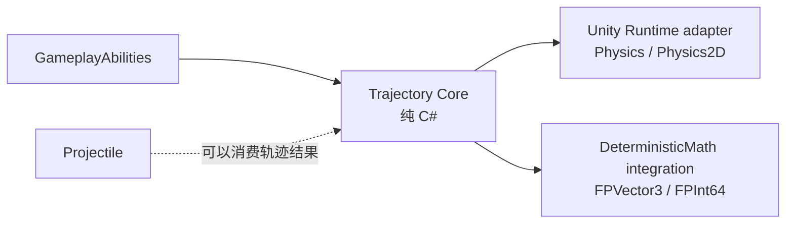

# CycloneGames RPGFoundation Trajectory

[English](README.md) | 简体中文

`Trajectory` 负责求解即时路径：射线、球形/圆形 sweep、穿透链和反射段。它是一个无状态路径求解器，不是 projectile 生命周期系统。飞行物用 `Projectile`；hitscan 武器、光束预览、反射激光、瞄准预测和服务端命中校验用 `Trajectory`。

## 目录

- [概述](#概述)
- [架构](#架构)
- [快速上手](#快速上手)
- [核心概念](#核心概念)
- [使用指南](#使用指南)
- [进阶主题](#进阶主题)
- [常见场景](#常见场景)
- [性能与内存](#性能与内存)
- [故障排查](#故障排查)

## 概述

`TrajectorySolver.Trace` 接收 `TrajectoryQuery`，查询 `ITrajectoryCollisionWorld`，将 segment 和 hit 记录写入由调用方持有的 `TrajectoryTraceBuffer`。求解器始终使用 swept segment cast，而非仅检查终点。Core 不依赖 Unity，Unity Physics adapter 将 sweep 请求转换为 `RaycastNonAlloc` / `SphereCastNonAlloc` / `CircleCastNonAlloc`。

### 主要特性

- **射线与半径 sweep** — 2D 和 3D，支持 swept from-to cast（防穿墙）
- **反射与穿透** — 可配置 continuation，固定迭代预算
- **调用方持有缓冲区** — 复用 buffer 时不产生 per-trace 托管分配
- **Unity-free Core** — `noEngineReferences: true`，可在 headless/server context 中使用
- **DeterministicMath 集成** — 用于 lockstep、rollback、replay 的定点 solver
- **Editor preset** — `TrajectoryQueryPresetAsset` 提供 Hitscan、Ricochet Beam、Piercing Beam preset
- **Debug probe** — Scene View 中预览 segment、hit point 和 normal

## 架构



### 模块布局

| 区域 | 用途 |
| --- | --- |
| `Core/` | Unity-free 数据结构、`TrajectorySolver`、固定容量 buffer、collision-world 契约。 |
| `Runtime/` | Unity Physics 的 3D 与 2D collision adapter。 |
| `Runtime/Integrations/DeterministicMath/` | 用于 lockstep、rollback、server replay 或确定性校验的 fixed-point solver。 |
| `Tests/Editor/` | Nearest-hit selection、reflection continuation、pierce ignore state、确定性重复运行。 |

## 快速上手

构建 query，调用 `Trace`，读取结果：

```csharp
var buffer = new TrajectoryTraceBuffer(segmentCapacity: 8, hitCapacity: 8, castHitCapacity: 16);
var query = TrajectoryQuery.CreateRay(
    traceId: abilityExecutionId,
    ownerEntityId: casterEntityId,
    collisionLayerMask: hitMask,
    origin: muzzlePosition,
    direction: aimDirection,
    maxDistance: 40f,
    maxReflectionCount: 2);

TrajectoryTraceResult result = TrajectorySolver.Trace(in query, collisionWorld, buffer);
for (int i = 0; i < buffer.HitCount; i++)
{
    TrajectoryHit hit = buffer.GetHit(i);
    // 将 hit.TargetEntityId 或 hit.TargetObjectId 转换为 ability 目标数据。
}
```

## 核心概念

### 数据模型

| 类型 | 用途 |
| --- | --- |
| `TrajectoryQuery` | 不可变输入：起点、方向、最大距离、半径、collision mask、反射次数、穿透次数、命中上限、迭代上限、初始忽略目标。 |
| `ITrajectoryCollisionWorld` | 碰撞 adapter 边界。Core 不知道 Unity collider、scene、transform 或 physics scene。 |
| `TrajectoryTraceBuffer` | 调用方持有的预分配 segment、hit 和 cast scratch 数组。复用无分配。 |
| `TrajectorySolver.Trace` | 将 `TrajectorySegment` 和 `TrajectoryHit` 写入 buffer，返回 `TrajectoryTraceResult`。 |
| `TrajectoryQueryValidator` | 将 query 校验结果写入调用方提供的 issue 数组 — 可在 Inspector、CI、server config 中复用。 |

### Projectile 与 Trajectory

`Projectile` 表示随时间存在的实体。按 tick 更新，拥有速度、生命周期、制导、反弹/穿透计数、命中事件、表现视图和可选网络消息。

`Trajectory` 表示当下求出的路径。不生成对象，不更新生命周期，不拥有表现状态。

| 场景 | 模块 |
| --- | --- |
| 火球术、奥术飞弹、跟踪导弹 | `Projectile` |
| 激光指示、轨道炮、霰弹 pellet 轨迹、反射光束 | `Trajectory` |
| 技能瞄准预览 | `Trajectory` |
| 服务端权威 hitscan 校验 | `Trajectory` |

### 碰撞响应类型

碰撞世界返回 `TrajectoryHitResponse`：

- `Stop` — 记录命中并结束轨迹。
- `Reflect` — 记录命中，按命中法线反射方向，离开表面一个 offset，用剩余距离继续。
- `Pierce` — 记录命中，沿当前方向前移，忽略刚命中的目标，用剩余距离继续。

每次 non-alloc cast 返回多个结果时，solver 选择最近的有效命中。等距离命中优先使用稳定目标身份做 tie-break。

## 使用指南

### 创建 Ray Trace

```csharp
var query = TrajectoryQuery.CreateRay(
    traceId: 1,
    ownerEntityId: 0,
    collisionLayerMask: ~0,
    origin: transform.position,
    direction: transform.forward,
    maxDistance: 100f,
    maxReflectionCount: 0);
```

### 创建 Sweep Trace

```csharp
var query = TrajectoryQuery.CreateSweep(
    radius: 0.5f,
    traceId: 1,
    ownerEntityId: 0,
    collisionLayerMask: ~0,
    origin: transform.position,
    direction: transform.forward,
    maxDistance: 50f,
    maxReflectionCount: 2,
    maxPierceCount: 3);
```

### 复用 Buffer

```csharp
// 每个 owner（actor、ability、worker）创建一个
private TrajectoryTraceBuffer _buffer = new(segmentCapacity: 8, hitCapacity: 8, castHitCapacity: 16);

void Update()
{
    _buffer.Clear();
    var result = TrajectorySolver.Trace(in _query, collisionWorld, _buffer);
    // 处理 hits...
}
```

### Unity Physics Adapter

| Adapter | 3D 查询 | 2D 查询 |
| --- | --- | --- |
| Ray | `Physics.RaycastNonAlloc` | `Physics2D.RaycastNonAlloc` |
| Radius sweep | `Physics.SphereCastNonAlloc` | `Physics2D.CircleCastNonAlloc` |

## 进阶主题

### 多人一致性

Core 使用 `float` — 适合 server-authoritative 或 client-predicted 玩法，最终命中校验由服务器负责。

Lockstep 或 rollback 玩法使用 `DeterministicMath` integration（`FPVector3` 和 `FPInt64`）。确定性仍取决于碰撞世界；Unity Physics 不是跨平台确定性的。

**推荐模式：**

- **Server authoritative**：客户端本地 trace 保证响应，服务端用权威状态校验，发送确认命中数据。
- **Rollback**：确定性模拟同时拥有移动和轨迹碰撞数据。
- **Lockstep**：使用 fixed-point 查询数据、稳定目标 ID、稳定命中排序和确定性空间查询。

### DeterministicMath 集成

由 `CYCLONE_RPGFOUNDATION_HAS_DETERMINISTIC_MATH` 启用。用 `FPVector3` 和 `FPInt64` 镜像 query、buffer、hit、segment 和 solver 模型。

### Editor 工具

`TrajectoryQueryPresetAsset` 保存可复用 authoring data，提供 Hitscan、Ricochet Beam、Piercing Beam preset。`TrajectoryDebugProbe` 在 Scene View 中预览 segment、hit point 和 normal。两者均可被继承；自定义 Inspector 先绘制已知字段，再绘制未处理的业务子类字段。

## 常见场景

### Hitscan 武器

创建 `TrajectoryQuery.CreateRay`，从枪口位置沿瞄准方向，`maxReflectionCount = 0`。处理第一个命中作为目标。

### 反射光束

设置 `maxReflectionCount = 2` 或更高。每次反射记录一个命中，反射方向后继续 — 可视化效果为弹跳激光。

### 穿透射击

设置 `maxPierceCount = 3`。轨迹记录每个命中，忽略命中目标后继续走完剩余距离。

### 服务端命中校验

服务端根据客户端上报的瞄准数据构建相同的 `TrajectoryQuery`，校验权威 trace 与客户端上报的命中在容差范围内是否匹配。

## 性能与内存

- 调用方复用 `TrajectoryTraceBuffer` 时不产生 per-trace 托管分配。
- Core 无状态，线程安全。
- Buffer 是可变且由调用方持有的对象 — 每个 worker、actor 或 ability execution 使用自己的 buffer。
- Unity adapter 封装 Unity Physics，必须在 Unity 支持的线程/上下文调用。
- DeterministicMath integration 不依赖 Unity，可在 headless/server 代码中运行。

### 持久化

本模块运行时不写入文件、资产、偏好、存档或缓存。Buffer 与 adapter 都是调用方显式持有的 runtime object。

## 故障排查

| 现象                 | 原因                                   | 解决方法                                                   |
| -------------------- | -------------------------------------- | ---------------------------------------------------------- |
| 未检测到命中         | Collision mask 或 layer 设置错误       | 验证 `collisionLayerMask`，确保对应 layer 上存在 collider  |
| 命中丢失（穿墙）     | 使用 teleport 式终点检测而非 sweep     | 使用 sweep adapter（`SphereCastNonAlloc` / `CircleCastNonAlloc`） |
| 反射未生效           | 缺少 `maxReflectionCount` 或反射 mask  | 设置 `maxReflectionCount > 0`，配置反射 layer mask        |
| 确定性不匹配         | Unity Physics 非确定性                 | 切换到 `DeterministicMath` integration，使用确定性碰撞世界 |
| GC 分配              | 每次 trace 重新创建 buffer             | 预分配并复用 `TrajectoryTraceBuffer`                       |

## 验证

运行 EditMode 测试：`CycloneGames.RPGFoundation.Trajectory.Tests.Editor`。启用 `CYCLONE_RPGFOUNDATION_HAS_DETERMINISTIC_MATH` 时，同时运行 `CycloneGames.RPGFoundation.Trajectory.DeterministicMath.Tests.Editor`。多人场景需用相同 query 输入同时验证客户端预测路径与权威服务端/回放路径。
