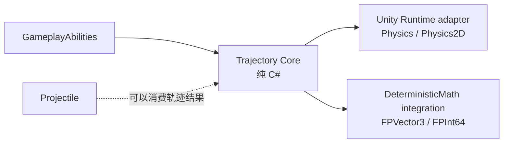

# CycloneGames RPGFoundation Trajectory

`Trajectory` 负责求解即时路径：射线、球形/圆形 sweep、穿透链和反射段。它不是 Projectile 生命周期系统。需要带生命周期、制导、表现对象、对象复用和网络实体状态的飞行物时使用 `Projectile`；需要 hitscan 武器、光束预览、反射激光、瞄准预测、服务器命中校验或 GameplayAbility 查询时使用 `Trajectory`。

## 模块结构



- `Core/` 包含不依赖 Unity 的数据结构、`TrajectorySolver`、固定容量 buffer 和碰撞世界契约。
- `Runtime/` 包含 Unity Physics 的 3D 与 2D adapter。
- `Runtime/Integrations/DeterministicMath/` 包含用于 lockstep、rollback、服务器回放或确定性校验的 fixed-point solver。
- `Tests/Editor/` 覆盖最近命中选择、反射剩余距离、穿透后的 ignore 状态，以及确定性重复运行。

## 核心概念

`TrajectoryQuery` 是不可变输入，包含起点、方向、最大距离、半径、碰撞 layer mask、反射次数、穿透次数、最大命中数量、最大迭代次数，以及初始忽略目标。

`ITrajectoryCollisionWorld` 是碰撞 adapter 边界。Core 不知道 Unity collider、scene、transform 或 physics scene。服务器可以用同一个接口接入确定性 broadphase 或空间索引。

`TrajectoryTraceBuffer` 由调用方持有。它预分配 segment、hit 和 cast scratch 数组，重复求解时不会产生托管内存分配。

`TrajectorySolver.Trace` 将 `TrajectorySegment` 和 `TrajectoryHit` 写入 buffer，并返回 `TrajectoryTraceResult`。求解器始终使用从 `From` 到 `To` 的 swept cast，而不是只检查终点。

`TrajectoryQueryValidator` 会把 authoring 或 runtime query 的校验结果写入调用方提供的 issue 数组。Inspector、CI asset check、server configuration validation 或命令行工具都可以在批量 trace 前复用这套规则。

## Projectile 与 Trajectory

`Projectile` 表示随时间存在的实体。它按 tick 更新，拥有当前速度、生命周期、制导、反弹/穿透计数、命中事件、表现视图和可选网络消息。

`Trajectory` 表示当下求出的路径。它不生成对象，不更新生命周期，也不拥有表现状态。Projectile 可以在特殊碰撞行为中使用 Trajectory 求解，但两个概念应保持分离。

典型映射：

- 火球术、奥术飞弹、跟踪导弹：`Projectile`。
- 激光指示、轨道炮、霰弹单 pellet 轨迹、反射光束：`Trajectory`。
- 技能瞄准预览：`Trajectory`。
- 服务器权威的 hitscan 命中校验：`Trajectory`。

## 碰撞、防穿墙与反射

Core 将每次查询视为 `From` 到 `To` 的 sweep。Runtime adapter 对应到：

- 3D ray：`Physics.RaycastNonAlloc`
- 3D radius sweep：`Physics.SphereCastNonAlloc`
- 2D ray：`Physics2D.RaycastNonAlloc`
- 2D radius sweep：`Physics2D.CircleCastNonAlloc`

碰撞世界返回 `TrajectoryHitResponse`：

- `Stop`：记录命中并结束轨迹。
- `Reflect`：记录命中，按命中法线反射方向，离开表面一个 offset，然后用剩余距离继续。
- `Pierce`：记录命中，沿当前方向前移一个 offset，下一次 cast 忽略刚命中的目标，然后用剩余距离继续。

每次 non-alloc cast 返回多个结果时，solver 会选择最近的有效命中。等距离命中会优先使用稳定目标身份做 tie-break。Unity instance ID 在不同机器间不稳定，所以确定性多人玩法应使用服务器权威结果，或使用能提供稳定目标 ID 的确定性碰撞世界。

## 多人一致性

Core 使用 `float`，因为它是 Unity-free 的通用路径求解器，适合客户端、工具和服务器权威玩法。服务器权威或客户端预测场景中，最终命中校验应由服务器负责。

如果玩法需要 lockstep 或 rollback，使用 `CycloneGames.RPGFoundation.Trajectory.Integrations.DeterministicMath`。它用 `FPVector3` 和 `FPInt64` 镜像 query、buffer、hit、segment 和 solver 模型。确定性仍取决于碰撞世界；Unity Physics 不是跨平台确定性的 lockstep 命中真相来源。

推荐多人模式：

- 服务器权威：客户端本地 trace 保证响应，服务器用权威状态 trace 或校验，然后发送确认命中数据。
- Rollback：确定性模拟同时拥有移动状态和轨迹碰撞数据，客户端用相同输入重放。
- Lockstep：使用 fixed-point 查询数据、稳定目标 ID、稳定命中排序和确定性空间查询。

## 性能与线程

- 调用方复用 `TrajectoryTraceBuffer` 时，每次 trace 不产生托管分配。
- Core 无状态，线程安全。
- Buffer 是可变且由调用方持有的对象；每个 worker、actor、ability execution 或等价 owner 应独占自己的 buffer。
- Unity Runtime adapter 封装 Unity Physics，必须在 Unity 支持的线程/上下文调用。
- DeterministicMath integration 不依赖 Unity；只要碰撞世界也是线程安全的，就可以在 headless/server 代码中运行。

## GameplayAbilities 用法

GameplayAbility 可以构建 `TrajectoryQuery`，调用 `TrajectorySolver.Trace`，再把命中转换成 target data、gameplay effect、cue event 或 prediction confirmation payload。

```csharp
var buffer = new TrajectoryTraceBuffer(segmentCapacity: 8, hitCapacity: 8, castHitCapacity: 16);
var query = TrajectoryQuery.CreateRay(
    traceId: abilityExecutionId,
    ownerEntityId: casterEntityId,
    collisionLayerMask: hitMask,
    origin: muzzlePosition,
    direction: aimDirection,
    maxDistance: 40f,
    maxReflectionCount: 2);

TrajectoryTraceResult result = TrajectorySolver.Trace(in query, collisionWorld, buffer);
for (int i = 0; i < buffer.HitCount; i++)
{
    TrajectoryHit hit = buffer.GetHit(i);
    // Convert hit.TargetEntityId or hit.TargetObjectId into ability target data.
}
```

## Editor 工具

`TrajectoryQueryPresetAsset` 保存 hitscan、光束、反射轨迹和目标预览 trace 的可复用 authoring data。运行时它会构建纯 Core 的 `TrajectoryQuery`。产品代码可以继承它，加入额外 target filter、gameplay tag、ability metadata 或队伍规则。

`TrajectoryDebugProbe` 是场景 authoring 辅助组件。给它分配 query preset，选择 Unity 3D 或 2D collision adapter，配置 reflection 和 pierce layer mask，然后在 Scene View 中选中 probe，即可预览 segment、hit point 和 normal。

Editor 工具设计时考虑了业务扩展：

- `TrajectoryQueryPresetAsset` 和 `TrajectoryDebugProbe` 可以被继承。
- `TrajectoryQueryPresetAsset.BuildQuery` 是 virtual。
- `TrajectoryQueryPresetAsset.BuildAuthoringQuery` 暴露 runtime sanitization 前的 raw authoring 值，用于校验。
- `TrajectoryDebugProbe` 暴露 protected virtual buffer 和 collision-world 创建路径。
- 自定义 Inspector 先绘制已知字段，再绘制业务子类未处理的 serialized fields。
- Scene preview 设置序列化在 probe 上，不写入 `EditorPrefs`。

Query preset inspector 提供 Hitscan、Ricochet Beam 和 Piercing Beam preset。Preset 只调整 query shape 和 traversal budget，并保留 collision layer mask、initial ignored target 和派生类 extension field。

Debug probe 是 authoring 和校验工具。生产玩法通常应由 gameplay system、ability 或服务器逻辑创建 query，而不是把 probe 当作全局状态。

## 持久化

本模块运行时不写入文件、资产、偏好、存档或缓存。Buffer 与 adapter 都是调用方显式持有的 runtime object。

## 验证

- 运行 `CycloneGames.RPGFoundation.Trajectory.Tests.Editor` 的 EditMode tests。
- 启用 `CYCLONE_RPGFOUNDATION_HAS_DETERMINISTIC_MATH` 时，运行 `CycloneGames.RPGFoundation.Trajectory.DeterministicMath.Tests.Editor`。
- 在 Unity 场景中，对 3D 与 2D adapter 分别验证 ray、radius sweep、stop、reflect 和 pierce layer。
- 多人玩法需要用相同 query 输入同时验证客户端预测路径与服务器权威或确定性回放路径。
