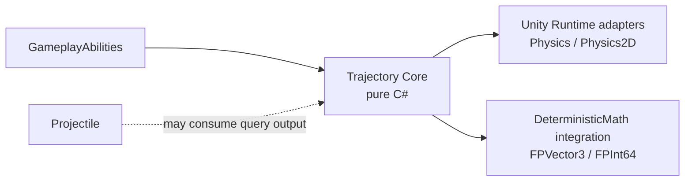

# CycloneGames RPGFoundation Trajectory

`Trajectory` solves immediate travel paths: rays, sphere/circle sweeps, pierce chains, and reflection segments. It is not a projectile lifecycle system. Use `Projectile` for spawned flying entities with lifetime, guidance, visual ownership, pooling, and network entity state. Use `Trajectory` for hitscan weapons, beam previews, ricochet lasers, targeting prediction, server hit validation, and gameplay ability queries that need a fixed output buffer.

## Module Layout



- `Core/` contains Unity-free data structures, `TrajectorySolver`, fixed-capacity buffers, and collision-world contracts.
- `Runtime/` contains Unity Physics adapters for 3D and 2D collision queries.
- `Runtime/Integrations/DeterministicMath/` contains a fixed-point solver for lockstep, rollback, server replay, or deterministic validation.
- `Tests/Editor/` covers nearest-hit selection, reflection continuation, pierce ignore state, and deterministic repeatability.

## Core Concepts

`TrajectoryQuery` is the immutable input. It includes origin, direction, maximum distance, radius, collision layer mask, reflection count, pierce count, hit count, iteration cap, and the initial ignored target.

`ITrajectoryCollisionWorld` is the narrow collision adapter boundary. Core never knows about Unity colliders, scenes, transforms, or physics scenes. A server can provide a deterministic broadphase or spatial index through the same interface.

`TrajectoryTraceBuffer` is caller-owned. It preallocates segment, hit, and cast scratch arrays, so repeated tracing does not allocate managed memory after setup.

`TrajectorySolver.Trace` writes `TrajectorySegment` and `TrajectoryHit` records into the buffer and returns a `TrajectoryTraceResult`. The solver always uses swept segment casts rather than teleport-style endpoint checks.

`TrajectoryQueryValidator` validates authoring or runtime queries into caller-owned issue arrays. Use it from Inspectors, CI asset checks, server configuration validation, or command-line tools before executing large batches of traces.

## Projectile vs Trajectory

`Projectile` represents an entity over time. It updates every tick, owns current velocity, lifetime, guidance, bounce/pierce counters, hit events, visual views, and optional networking messages.

`Trajectory` represents a solved path now. It does not spawn objects, does not tick lifetime, and does not own visual state. A projectile may use trajectory solving for special collision behavior, but the concepts are intentionally separate.

Typical mapping:

- Fireball, arcane missile, homing missile: `Projectile`.
- Laser pointer, railgun, shotgun pellet trace, ricochet beam: `Trajectory`.
- Ability targeting preview: `Trajectory`.
- Server-authoritative validation of a hitscan shot: `Trajectory`.

## Collision, Tunneling, and Reflection

Core treats every query as a sweep from `From` to `To`. Runtime adapters map that to:

- 3D ray: `Physics.RaycastNonAlloc`
- 3D radius sweep: `Physics.SphereCastNonAlloc`
- 2D ray: `Physics2D.RaycastNonAlloc`
- 2D radius sweep: `Physics2D.CircleCastNonAlloc`

Collision worlds return `TrajectoryHitResponse`:

- `Stop`: record the hit and end the trace.
- `Reflect`: record the hit, reflect direction around the hit normal, offset from the surface, and continue with the remaining distance.
- `Pierce`: record the hit, move slightly forward, ignore the just-hit target for the next cast, and continue with the remaining distance.

The solver selects the nearest valid hit from every non-alloc cast result. Equal-distance ties are resolved by stable target identity where available. Unity instance IDs are not stable across machines, so deterministic multiplayer should use server-authoritative results or a deterministic collision world that supplies stable target IDs.

## Multiplayer Consistency

Core uses `float` because it is a Unity-free, general-purpose path solver for clients, tools, and server authority. This is suitable for server-authoritative or client-predicted gameplay when the server owns final hit validation.

For lockstep or rollback gameplay, use `CycloneGames.RPGFoundation.Trajectory.Integrations.DeterministicMath`. It mirrors the query, buffer, hit, segment, and solver model with `FPVector3` and `FPInt64`. Determinism still depends on the collision world. Unity Physics is not deterministic across all platforms and should not be the source of truth for lockstep hit results.

Recommended multiplayer patterns:

- Server authoritative: clients trace for responsiveness, the server traces or validates with authoritative state, then sends confirmed hit data.
- Rollback: deterministic simulation owns both movement state and trajectory collision data; clients replay the same inputs.
- Lockstep: use fixed-point query data, stable target IDs, stable hit ordering, and deterministic spatial queries.

## Performance and Threading

- No per-trace managed allocation occurs when the caller reuses `TrajectoryTraceBuffer`.
- Core is stateless and thread-safe.
- Buffers are mutable and caller-owned; use one buffer per worker, actor, ability execution, or job-equivalent owner.
- Unity Runtime adapters wrap Unity Physics and must be called on Unity's supported thread/context.
- DeterministicMath integration is Unity-free and can run in headless/server code when its collision world is also thread-safe.

## GameplayAbilities Usage

A GameplayAbility can build a `TrajectoryQuery`, call `TrajectorySolver.Trace`, then convert hits into target data, gameplay effects, cue events, or prediction confirmation payloads.

```csharp
var buffer = new TrajectoryTraceBuffer(segmentCapacity: 8, hitCapacity: 8, castHitCapacity: 16);
var query = TrajectoryQuery.CreateRay(
    traceId: abilityExecutionId,
    ownerEntityId: casterEntityId,
    collisionLayerMask: hitMask,
    origin: muzzlePosition,
    direction: aimDirection,
    maxDistance: 40f,
    maxReflectionCount: 2);

TrajectoryTraceResult result = TrajectorySolver.Trace(in query, collisionWorld, buffer);
for (int i = 0; i < buffer.HitCount; i++)
{
    TrajectoryHit hit = buffer.GetHit(i);
    // Convert hit.TargetEntityId or hit.TargetObjectId into ability target data.
}
```

## Editor Tooling

`TrajectoryQueryPresetAsset` stores reusable authoring data for hitscan, beam, ricochet, and target-preview traces. It builds pure Core `TrajectoryQuery` values at runtime and can be subclassed by product code for additional target filters, gameplay tags, ability metadata, or team rules.

`TrajectoryDebugProbe` is a scene authoring helper. Assign a query preset, choose a Unity 3D or 2D collision adapter, configure reflection and pierce layer masks, and select the probe in the Scene View to preview segments, hit points, and normals.

Editor tooling is designed for extension:

- `TrajectoryQueryPresetAsset` and `TrajectoryDebugProbe` are inheritable.
- `TrajectoryQueryPresetAsset.BuildQuery` is virtual.
- `TrajectoryQueryPresetAsset.BuildAuthoringQuery` exposes raw authoring values for validation before runtime sanitization.
- `TrajectoryDebugProbe` exposes protected virtual buffer and collision-world creation paths.
- Custom inspectors draw known fields first and then draw unhandled serialized fields from derived classes.
- Scene preview settings are serialized on the probe rather than stored in `EditorPrefs`.

The query preset inspector includes Hitscan, Ricochet Beam, and Piercing Beam presets. Presets adjust only query shape and traversal budgets; they preserve collision layer masks, initial ignored targets, and derived-class extension fields.

The debug probe is an authoring and validation tool. Production gameplay should usually create queries from gameplay systems, abilities, or server logic rather than treating a probe as global state.

## Persistence

This module writes no files, assets, preferences, save data, or caches at runtime. Buffers and adapters are explicit runtime objects owned by the caller.

## Validation

- Run EditMode tests for `CycloneGames.RPGFoundation.Trajectory.Tests.Editor`.
- When `CYCLONE_RPGFOUNDATION_HAS_DETERMINISTIC_MATH` is enabled, run `CycloneGames.RPGFoundation.Trajectory.DeterministicMath.Tests.Editor`.
- In Unity scenes, validate 3D and 2D adapters with ray and radius sweeps against stop, reflect, and pierce layers.
- For multiplayer, test both the client prediction path and the authoritative server or deterministic replay path with identical query inputs.
