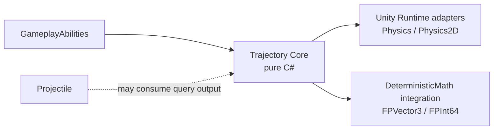

# CycloneGames RPGFoundation Trajectory

[English | 简体中文](README.SCH.md)

`Trajectory` solves immediate travel paths: rays, sphere/circle sweeps, pierce chains, and reflection segments. It is a stateless path solver, not a projectile lifecycle system. Use `Projectile` for spawned flying entities; use `Trajectory` for hitscan weapons, beam previews, ricochet lasers, targeting prediction, and server hit validation.

## Table of Contents

- [Overview](#overview)
- [Architecture](#architecture)
- [Quick Start](#quick-start)
- [Core Concepts](#core-concepts)
- [Usage Guide](#usage-guide)
- [Advanced Topics](#advanced-topics)
- [Common Scenarios](#common-scenarios)
- [Performance and Memory](#performance-and-memory)
- [Troubleshooting](#troubleshooting)

## Overview

`TrajectorySolver.Trace` takes a `TrajectoryQuery`, queries an `ITrajectoryCollisionWorld`, and writes segment and hit records into a caller-owned `TrajectoryTraceBuffer`. The solver always uses swept segment casts rather than endpoint-only checks. Core has no Unity dependency; Unity Physics adapters convert the sweep requests to `RaycastNonAlloc` / `SphereCastNonAlloc` / `CircleCastNonAlloc`.

### Key Features

- **Ray and radius sweeps** — 2D and 3D, with swept from-to casts (no tunneling)
- **Reflection and pierce** — Configurable continuation with fixed iteration budget
- **Caller-owned buffers** — No per-trace managed allocation when buffers are reused
- **Unity-free Core** — `noEngineReferences: true`, usable in headless/server contexts
- **DeterministicMath integration** — Fixed-point solver for lockstep, rollback, replay
- **Editor presets** — `TrajectoryQueryPresetAsset` with Hitscan, Ricochet Beam, Piercing Beam presets
- **Debug probe** — Scene view preview with segment, hit point, and normal visualization

## Architecture



### Module Layout

| Area | Purpose |
| --- | --- |
| `Core/` | Unity-free data structures, `TrajectorySolver`, fixed-capacity buffers, collision-world contracts. |
| `Runtime/` | Unity Physics adapters for 3D and 2D collision queries. |
| `Runtime/Integrations/DeterministicMath/` | Fixed-point solver for lockstep, rollback, server replay, or deterministic validation. |
| `Tests/Editor/` | Nearest-hit selection, reflection continuation, pierce ignore state, deterministic repeatability. |

## Quick Start

Build a query, call `Trace`, read results:

```csharp
var buffer = new TrajectoryTraceBuffer(segmentCapacity: 8, hitCapacity: 8, castHitCapacity: 16);
var query = TrajectoryQuery.CreateRay(
    traceId: abilityExecutionId,
    ownerEntityId: casterEntityId,
    collisionLayerMask: hitMask,
    origin: muzzlePosition,
    direction: aimDirection,
    maxDistance: 40f,
    maxReflectionCount: 2);

TrajectoryTraceResult result = TrajectorySolver.Trace(in query, collisionWorld, buffer);
for (int i = 0; i < buffer.HitCount; i++)
{
    TrajectoryHit hit = buffer.GetHit(i);
    // Convert hit.TargetEntityId or hit.TargetObjectId into ability target data.
}
```

## Core Concepts

### Data Model

| Type | Purpose |
| --- | --- |
| `TrajectoryQuery` | Immutable input: origin, direction, max distance, radius, collision mask, reflection count, pierce count, hit cap, iteration cap, initial ignored target. |
| `ITrajectoryCollisionWorld` | Narrow collision adapter boundary. Core never knows about Unity colliders, scenes, transforms, or physics scenes. |
| `TrajectoryTraceBuffer` | Caller-owned preallocated arrays for segments, hits, and cast scratch. Reuse avoids allocation. |
| `TrajectorySolver.Trace` | Writes `TrajectorySegment` and `TrajectoryHit` records into the buffer; returns `TrajectoryTraceResult`. |
| `TrajectoryQueryValidator` | Validates queries into caller-owned issue arrays — reusable from Inspectors, CI, server config. |

### Projectile vs Trajectory

`Projectile` represents an entity over time. It updates every tick, owns velocity, lifetime, guidance, bounce/pierce counters, hit events, visual views, and optional networking messages.

`Trajectory` represents a solved path now. It does not spawn objects, tick lifetime, or own visual state.

| Use case | Module |
| --- | --- |
| Fireball, arcane missile, homing missile | `Projectile` |
| Laser pointer, railgun, shotgun pellet trace, ricochet beam | `Trajectory` |
| Ability targeting preview | `Trajectory` |
| Server-authoritative hitscan validation | `Trajectory` |

### Collision Response Types

Collision worlds return `TrajectoryHitResponse`:

- `Stop` — Record the hit and end the trace.
- `Reflect` — Record the hit, reflect direction around the hit normal, offset from surface, continue with remaining distance.
- `Pierce` — Record the hit, move forward, ignore the just-hit target, continue with remaining distance.

The solver selects the nearest valid hit from each non-alloc cast result. Equal-distance ties resolve by stable target identity where available.

## Usage Guide

### Creating a Ray Trace

```csharp
var query = TrajectoryQuery.CreateRay(
    traceId: 1,
    ownerEntityId: 0,
    collisionLayerMask: ~0,
    origin: transform.position,
    direction: transform.forward,
    maxDistance: 100f,
    maxReflectionCount: 0);
```

### Creating a Sweep Trace

```csharp
var query = TrajectoryQuery.CreateSweep(
    radius: 0.5f,
    traceId: 1,
    ownerEntityId: 0,
    collisionLayerMask: ~0,
    origin: transform.position,
    direction: transform.forward,
    maxDistance: 50f,
    maxReflectionCount: 2,
    maxPierceCount: 3);
```

### Reusing Buffers

```csharp
// Create once per owner (actor, ability, worker)
private TrajectoryTraceBuffer _buffer = new(segmentCapacity: 8, hitCapacity: 8, castHitCapacity: 16);

void Update()
{
    _buffer.Clear();
    var result = TrajectorySolver.Trace(in _query, collisionWorld, _buffer);
    // Process hits...
}
```

### Unity Physics Adapters

| Adapter | 3D Query | 2D Query |
| --- | --- | --- |
| Ray | `Physics.RaycastNonAlloc` | `Physics2D.RaycastNonAlloc` |
| Radius sweep | `Physics.SphereCastNonAlloc` | `Physics2D.CircleCastNonAlloc` |

## Advanced Topics

### Multiplayer Consistency

Core uses `float` — suitable for server-authoritative or client-predicted gameplay where the server owns final hit validation.

For lockstep or rollback, use the `DeterministicMath` integration with `FPVector3` and `FPInt64`. Determinism still depends on the collision world; Unity Physics is not deterministic across all platforms.

**Recommended patterns:**

- **Server authoritative**: clients trace for responsiveness, server validates with authoritative state, sends confirmed hit data.
- **Rollback**: deterministic simulation owns both movement and trajectory collision data.
- **Lockstep**: use fixed-point query data, stable target IDs, stable hit ordering, and deterministic spatial queries.

### DeterministicMath Integration

Enabled by `CYCLONE_RPGFOUNDATION_HAS_DETERMINISTIC_MATH`. Mirrors the query, buffer, hit, segment, and solver model with `FPVector3` and `FPInt64`.

### Editor Tooling

`TrajectoryQueryPresetAsset` stores reusable authoring data with presets (Hitscan, Ricochet Beam, Piercing Beam). `TrajectoryDebugProbe` previews segments, hit points, and normals in the Scene View. Both are inheritable; custom inspectors draw known fields first, then unhandled derived fields.

## Common Scenarios

### Hitscan weapon

Create a `TrajectoryQuery.CreateRay` from muzzle position in aim direction with `maxReflectionCount = 0`. Process first hit as the target.

### Ricochet beam

Set `maxReflectionCount = 2` or higher. Each reflection records a hit, reflects direction, and continues — visualized as a bouncing laser.

### Piercing shot

Set `maxPierceCount = 3`. The trace records each hit, ignores the hit target for subsequent casts, and continues through the remaining distance.

### Server hit validation

Server builds an identical `TrajectoryQuery` from the client's reported aim data and validates that the authoritative trace matches the client-reported hit within tolerance.

## Performance and Memory

- No per-trace managed allocation when the caller reuses `TrajectoryTraceBuffer`.
- Core is stateless and thread-safe.
- Buffers are mutable and caller-owned — use one buffer per worker, actor, or ability execution.
- Unity adapters wrap Unity Physics and must be called on Unity's supported thread/context.
- DeterministicMath integration is Unity-free and can run in headless/server code.

### Persistence

This module writes no files, assets, preferences, save data, or caches at runtime. Buffers and adapters are explicit runtime objects owned by the caller.

## Troubleshooting

| Symptom | Cause | Resolution |
| --- | --- | --- |
| No hits detected | Wrong collision mask or layer setup | Verify `collisionLayerMask` and ensure colliders exist on the configured layer |
| Missed hits (tunneling) | Teleport-style endpoint check instead of sweep | Use sweep-based adapters (`SphereCastNonAlloc` / `CircleCastNonAlloc`) |
| Reflection not working | Missing `maxReflectionCount` or reflection collision mask | Set `maxReflectionCount > 0` and configure reflection layer mask |
| Deterministic mismatch | Unity Physics non-determinism | Switch to `DeterministicMath` integration with a deterministic collision world |
| GC allocations | Buffer recreated per trace | Preallocate and reuse `TrajectoryTraceBuffer` across calls |

## Validation

Run EditMode tests: `CycloneGames.RPGFoundation.Trajectory.Tests.Editor`. When `CYCLONE_RPGFOUNDATION_HAS_DETERMINISTIC_MATH` is enabled, also run `CycloneGames.RPGFoundation.Trajectory.DeterministicMath.Tests.Editor`. For multiplayer, test both client prediction and authoritative server/replay paths with identical query inputs.
