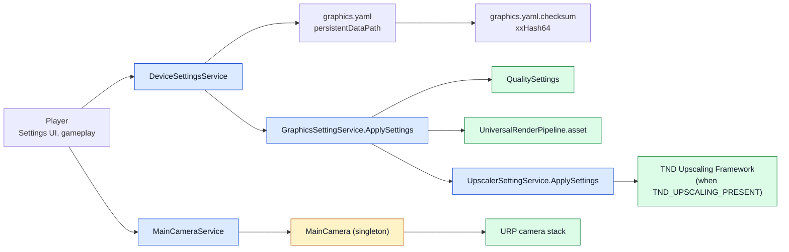

# CycloneGames.Services

[English | 简体中文](README.md)

CycloneGames.Services 为 Unity 打包三个 runtime service：带完整性校验和零 GC 修改的通用 YAML 持久化设置存储、URP 主相机栈管理器，以及平台感知的图形和 upscaler service。设置以 YAML 加 xxHash64 checksum 副文件形式持久化到 `Application.persistentDataPath`；图形和 upscaler service 把持久化设置应用到 `QualitySettings`、`UniversalRenderPipeline.asset` 以及可选的 TND Upscaling Framework。

## 目录

- [概述](#概述)
- [架构](#架构)
- [快速上手](#快速上手)
- [核心概念](#核心概念)
- [使用指南](#使用指南)
- [进阶主题](#进阶主题)
- [常见场景](#常见场景)
- [性能与内存](#性能与内存)
- [故障排查](#故障排查)

## 概述

Runtime service 回答一个问题：哪个平台状态应该变化，由哪个输入驱动？CycloneGames.Services 用三个聚焦的子系统回答它。`DeviceSettingsService<T>` 把一个设置 `struct` 转成 YAML 文件加 checksum 副文件，通过 `ref` 委托应用更新以避免 struct 复制，并在每次读取时报告 load integrity。`MainCameraService` 通过单例 `MainCamera` 暴露 URP camera stack，让其他系统在不直接引用 `UnityEngine.Rendering.Universal` 的情况下增删和清除 overlay camera。`GraphicsSettingService` 与 `UpscalerSettingService` 把持久化设置应用到 `QualitySettings`、URP asset 以及（若存在）TND Upscaling Framework。

设置层是泛型的：任何 `[YamlObject]` struct 配合一个 `IDefaultProvider<T>` 和可选的 `ISettingsVersionMigrator<T>` 都可以持久化。行尾在哈希前归一化为 LF，所以 Windows 与 macOS 写入的文件可以互相校验。Checksum 是一个 xxHash64 十六进制字符串，存放在 `<file>.checksum` 副文件中，与设置文件一起原子写入。

图形和 upscaler service 平台感知。`GraphicsSettingsDefaultProvider` 通过 `SystemInfo`（GPU 内存、处理器核数、系统内存）检测设备 tier，生成 Low/Medium/High/Ultra 分层默认值。`UpscalerSettingsDefaultProvider` 检测 GPU 厂商和图形 API，在 FSR3、SGSR2、DLSS、XeSS 之间选择，由 `FSR_3_PRESENT`、`SGSR_2_PRESENT`、`DLSS_PRESENT`、`XESS_PRESENT` 编译符号控制。

### 主要特性

- **`DeviceSettingsService<T>`**：通用 YAML 持久化设置，含 xxHash64 checksum、版本迁移和通过 `ref` 委托的零 GC `UpdateSettings`。
- **`ISettingsVersionMigrator<T>`**：可选 schema 迁移，支持前向兼容设置。
- **`GraphicsSettingsData` / `UpscalerSettingsData`**：`[YamlObject]` struct，含 `SettingsVersion` 字段用于迁移。
- **`GraphicsSettingService`**：把图形设置应用到 `QualitySettings` 和 URP asset；通过 UniTask 支持延迟分辨率变更。
- **`UpscalerSettingService`**：在 `TND_UPSCALING_PRESENT` 定义时把 upscaler 设置应用到 TND Upscaling Framework。
- **`MainCameraService` / `MainCamera`**：单例 `MonoBehaviour` 加 service 包装，用于 URP camera stack 操作。
- **平台感知默认值**：基于 `SystemInfo` 的 tier 检测，覆盖桌面、手机、主机和 WebGL。

## 架构

| 程序集 | 路径 | 用途 |
| --- | --- | --- |
| `CycloneGames.Service.Runtime` | `Runtime/Scripts/` | 所有公开契约与实现。引用 URP、VYaml、UniTask、`CycloneGames.Hash.Core`、`CycloneGames.IO.SystemIO`、`CycloneGames.Logger` 与 `TND.Upscaling.Framework.Runtime.Core`。 |



所有者为每个设置类型构造一个 service，service 读写 YAML 加 checksum 副文件，gameplay 代码调用 `ApplySettings` 把持久化 struct 推入 Unity 子系统。Camera stack 由 `MainCamera`（单例 `MonoBehaviour`）拥有；`MainCameraService` 缓存查找并转发调用。

## 快速上手

在你的 asmdef 中引用 `CycloneGames.Service.Runtime`，然后导入命名空间：

```csharp
using CycloneGames.Service.Runtime;
```

### 持久化和加载图形设置

```csharp
// 1. 用 default provider 构造 service：
var graphicsSettings = new DeviceSettingsService<GraphicsSettingsData>(
    fileName: "graphics.yaml",
    defaultProvider: new GraphicsSettingsDefaultProvider(),
    subDirectory: "Settings");

// 2. 加载（首次运行创建默认值）：
graphicsSettings.LoadSettings();

// 3. 应用到 Unity：
var graphicsService = new GraphicsSettingService();
graphicsService.ApplySettings(graphicsSettings.Settings);

// 4. 不复制 struct 进行修改：
graphicsSettings.UpdateSettings((ref GraphicsSettingsData s) => s.AntiAliasingLevel = 4);
graphicsSettings.SaveSettings();
```

### 应用 upscaler 设置

```csharp
var upscalerSettings = new DeviceSettingsService<UpscalerSettingsData>(
    fileName: "upscaler.yaml",
    defaultProvider: new UpscalerSettingsDefaultProvider(),
    subDirectory: "Settings");

upscalerSettings.LoadSettings();

var upscalerService = new UpscalerSettingService();
upscalerService.ApplySettings(upscalerSettings.Settings);

Console.WriteLine($"Upscaler: {upscalerService.CurrentTechnology} @ {upscalerService.CurrentQuality}");
```

### 向主相机 stack 添加 overlay camera

```csharp
var mainCameraService = new MainCameraService();
mainCameraService.AddCameraToStack(myOverlayCamera, index: 0);
```

`MainCameraService` 解析 `MainCamera.Instance`（回退到 `FindFirstObjectByType<MainCamera>()`）并缓存引用。

## 核心概念

### 设置完整性

`DeviceSettingsService<T>` 在同一目录写入设置文件和 checksum 副文件：

```text
<persistentDataPath>/Settings/graphics.yaml
<persistentDataPath>/Settings/graphics.yaml.checksum
```

Checksum 是文件字节（LF 归一化后）的 xxHash64，格式化为 16 字符大写十六进制字符串。加载时，service 重新计算 hash 并报告四种状态之一：

| 状态 | 含义 |
| --- | --- |
| `Valid` | Checksum 文件存在且与重新计算的 hash 匹配。 |
| `Modified` | Checksum 文件存在但不匹配——外部编辑或篡改。 |
| `Missing` | 无 checksum 文件——首次运行或被删除。 |
| `Corrupted` | 文件存在但无法作为 YAML 反序列化；设置重置为默认值。 |

`Modified` 和 `Missing` 不阻塞加载——文件正常解析，integrity 状态通过 `LastLoadIntegrity` 暴露给调用方决定如何响应。`Corrupted` 重置为默认值并重写两个文件。

### 零 GC 修改

`UpdateSettings` 接受一个 `SettingsRefAction<T>` 委托，按 `ref` 接收设置，所以修改不复制 struct：

```csharp
graphicsSettings.UpdateSettings((ref GraphicsSettingsData s) =>
{
    s.AntiAliasingLevel = 4;
    s.ShadowDistance = 80f;
});
```

委托在修改后用更新后的 struct 触发 `OnSettingsChanged`。修改仅在内存中；调用 `SaveSettings()` 持久化。

### 版本迁移

`ISettingsVersionMigrator<T>` 让项目把旧 schema 前向迁移。service 在反序列化后调用 `NeedsMigration`，true 时运行 `Migrate(ref T)`，然后重新保存迁移后的 struct：

```csharp
public sealed class GraphicsSettingsMigrator : ISettingsVersionMigrator<GraphicsSettingsData>
{
    public int CurrentVersion => GraphicsSettingsDefaultProvider.CURRENT_SETTINGS_VERSION;

    public bool NeedsMigration(in GraphicsSettingsData settings)
    {
        return settings.SettingsVersion != CurrentVersion;
    }

    public void Migrate(ref GraphicsSettingsData settings)
    {
        // 仅前向迁移：提升版本，用默认值填充新字段。
        if (settings.SettingsVersion < 1)
        {
            settings.SettingsVersion = 1;
            // 应用 version 1 引入的新字段默认值。
        }
    }
}

// 在构造时传入 migrator：
var service = new DeviceSettingsService<GraphicsSettingsData>(
    fileName: "graphics.yaml",
    defaultProvider: new GraphicsSettingsDefaultProvider(),
    subDirectory: "Settings",
    migrator: new GraphicsSettingsMigrator());
```

Migrator 仅在 `LoadSettings` 时运行，从不在 `SaveSettings` 时运行。迁移的设置被重新保存，后续加载跳过迁移。

### 设备 tier 检测

`GraphicsSettingsDefaultProvider` 与 `UpscalerSettingsDefaultProvider` 从 `SystemInfo` 推导默认值：

| Tier | 手机 | 桌面 | 主机 | WebGL |
| --- | --- | --- | --- | --- |
| Low | GPU < 2 GB 或核数 < 4 | GPU < 2 GB | — | 始终 |
| Medium | GPU ≥ 2 GB 且核数 ≥ 4 | GPU ≥ 2 GB 且核数 ≥ 4 且 RAM ≥ 4 GB | RAM < 8 GB | — |
| High | GPU ≥ 4 GB 且核数 ≥ 6 | GPU ≥ 4 GB 且核数 ≥ 6 且 RAM ≥ 8 GB | RAM ≥ 8 GB | — |
| Ultra | — | GPU ≥ 8 GB 且核数 ≥ 8 且 RAM ≥ 16 GB | RAM ≥ 12 GB | — |

Editor 始终报告 `Ultra`。检测在 default provider 被调用时运行一次，缓存结果应仅在首次启动时重新读取。

### Upscaler 技术选择

`UpscalerSettingsDefaultProvider` 基于平台、GPU 厂商和图形 API 选择 upscaler：

| 平台 | 优先 upscaler |
| --- | --- |
| 手机（Android/iOS） | SGSR2（移动优化）若可用，否则 None |
| WebGL | None（无 upscaler 支持） |
| macOS | SGSR2 若可用，否则 None（FSR3 需 DX12/Vulkan） |
| Linux（Vulkan） | FSR3 若可用，否则 SGSR2，否则 None |
| Windows（DX12/Vulkan） | NVIDIA RTX 用 DLSS，NVIDIA GTX/AMD 用 FSR3，Intel Arc 用 XeSS，否则 FSR3 |
| 主机 | FSR3 若可用，否则 None |

每项技术由编译符号（`FSR_3_PRESENT`、`SGSR_2_PRESENT`、`DLSS_PRESENT`、`XESS_PRESENT`）控制，符号由对应 UPM 包定义。无包时符号未定义，技术报告为不可用。

## 使用指南

### 持久化自定义设置类型

```csharp
using VYaml.Annotations;

[YamlObject]
public partial struct AudioSettingsData
{
    public int SettingsVersion;
    public float MasterVolume;
    public float MusicVolume;
    public float SfxVolume;
    public bool Muted;
}

public sealed class AudioSettingsDefaultProvider : IDefaultProvider<AudioSettingsData>
{
    public AudioSettingsData GetDefault() => new AudioSettingsData
    {
        SettingsVersion = 1,
        MasterVolume = 1f,
        MusicVolume = 0.8f,
        SfxVolume = 1f,
        Muted = false,
    };
}
```

```csharp
var audioSettings = new DeviceSettingsService<AudioSettingsData>(
    fileName: "audio.yaml",
    defaultProvider: new AudioSettingsDefaultProvider(),
    subDirectory: "Settings");

audioSettings.LoadSettings();

audioSettings.UpdateSettings((ref AudioSettingsData s) => s.MasterVolume = 0.7f);
audioSettings.SaveSettings();

Console.WriteLine($"Master: {audioSettings.Settings.MasterVolume}");
Console.WriteLine($"Integrity: {audioSettings.LastLoadIntegrity}");
```

VYaml source generator 在编译期为 `[YamlObject]` struct 生成 formatter；`SettingsYamlResolver` 对未标注类型回退到 `UnityResolver` 和 `StandardResolver`。

### 从 UI 应用图形设置

```csharp
public void OnApplyButtonClicked()
{
    var graphicsSettings = new DeviceSettingsService<GraphicsSettingsData>(
        "graphics.yaml",
        new GraphicsSettingsDefaultProvider(),
        "Settings");

    graphicsSettings.LoadSettings();

    graphicsSettings.UpdateSettings((ref GraphicsSettingsData s) =>
    {
        s.QualityLevel = qualityDropdown.value;
        s.AntiAliasingLevel = aaDropdown.value switch { 0 => 0, 1 => 2, 2 => 4, _ => 8 };
        s.RenderScale = renderScaleSlider.value;
        s.HDREnabled = hdrToggle.isOn;
    });

    graphicsSettings.SaveSettings();

    var graphicsService = new GraphicsSettingService();
    graphicsService.ApplySettings(graphicsSettings.Settings);
}
```

`ApplySettings` 调用 `GraphicsSettingService` 上的每个 `Set*` 方法，转发到 `QualitySettings`、`UniversalRenderPipeline.asset` 与 `Screen`。分辨率变更通过 UniTask 延迟以避免阻塞 UI 线程。

### 重置为默认值

```csharp
graphicsSettings.ResetToDefaults();
graphicsSettings.SaveSettings();
graphicsService.ApplySettings(graphicsSettings.Settings);
```

`ResetToDefaults` 用 default provider 的输出替换内存中的 struct 并触发 `OnSettingsChanged`。不写入磁盘；调用 `SaveSettings` 持久化。

### 管理 URP camera stack

```csharp
public sealed class MinimapController : MonoBehaviour
{
    [SerializeField] private Camera _minimapCamera;
    private IMainCameraService _mainCameraService;

    void OnEnable()
    {
        _mainCameraService = new MainCameraService();
        _mainCameraService.AddCameraToStack(_minimapCamera);
    }

    void OnDisable()
    {
        _mainCameraService.RemoveCameraFromStack(_minimapCamera);
    }
}
```

`AddCameraToStack` 把传入 camera 的 `renderType` 设为 `Overlay` 并按请求 index 插入 URP camera stack。`RemoveCameraFromStack` 移除它。两者都触发其他系统可观察的事件。

### 查看 upscaler 支持

```csharp
UpscalerTechnology[] supported = upscalerService.GetSupportedTechnologies();
foreach (var tech in supported)
{
    Console.WriteLine($"Supported: {tech}");
}

Console.WriteLine($"Active: {upscalerService.IsUpscalerActive}");
Console.WriteLine($"Technology: {upscalerService.CurrentTechnology}");
Console.WriteLine($"Quality: {upscalerService.CurrentQuality}");
Console.WriteLine($"Scale factor: {upscalerService.CurrentScaleFactor}");
```

`GetSupportedTechnologies` 基于 build 中的编译符号返回可用技术数组。这驱动 UI 下拉，使玩家只能选择 build 中包含的技术。

## 进阶主题

### 自定义 default provider

项目可以用自己的 `IDefaultProvider<T>` 覆盖平台感知默认值：

```csharp
public sealed class CustomGraphicsDefaults : IDefaultProvider<GraphicsSettingsData>
{
    public GraphicsSettingsData GetDefault()
    {
        return new GraphicsSettingsData
        {
            SettingsVersion = GraphicsSettingsDefaultProvider.CURRENT_SETTINGS_VERSION,
            QualityLevel = 2,
            TargetFrameRate = 60,
            VSyncCount = 1,
            AntiAliasingLevel = 4,
            ShadowDistance = 70f,
            TextureQuality = 0,
            AnisotropicFiltering = 2,
            LodBias = 1.2f,
            SoftParticles = true,
            RenderScale = 1f,
            HDREnabled = true,
            ShortEdgeResolution = 1080,
            FullScreenMode = 1,
        };
    }
}

var service = new DeviceSettingsService<GraphicsSettingsData>(
    "graphics.yaml",
    new CustomGraphicsDefaults(),
    "Settings");
```

自定义 provider 适用于项目希望发布不匹配平台 tier 的预设（如手机"省电"预设）。

### 自定义 YAML resolver

`SettingsYamlResolver` 按顺序链接三个 VYaml resolver：`GeneratedResolver`（用于 `[YamlObject]` 类型）、`UnityResolver`（用于 `Color`、`Vector2` 等）和 `StandardResolver`（其他所有）。要注册自定义 formatter，把它加入 generated resolver，或实现自定义 `IYamlFormatterResolver` 并传入。

### 订阅设置变更

```csharp
graphicsSettings.OnSettingsChanged += settings =>
{
    Debug.Log($"AntiAliasing changed to {settings.AntiAliasingLevel}");
};
```

`OnSettingsChanged` 在每次 `UpdateSettings`、`ResetToDefaults` 和成功的 `LoadSettings` 后触发。委托按值接收新 struct，订阅者可以读取字段而不持有 service 引用。

### 条件 upscaler 支持

Runtime assembly 定义五个 version-define 符号：

| 符号 | 来源包 |
| --- | --- |
| `TND_UPSCALING_PRESENT` | `com.tnd.upscaling` 1.0.0+ |
| `FSR_3_PRESENT` | `com.tnd.upscaler.fsr3` 1.0.0+ |
| `SGSR_2_PRESENT` | `com.tnd.upscaler.sgsr2` 1.0.0+ |
| `DLSS_PRESENT` | `com.tnd.upscaler.dlss` 1.0.0+ |
| `XESS_PRESENT` | `com.tnd.upscaler.xess` 1.0.0+ |

`TND_UPSCALING_PRESENT` 未定义时，`UpscalerSettingService.ApplySettings` 记录警告并保持 `IsUpscalerActive` 为 `false`。公开 API 不变，调用方不需要 `#if` 守卫。安装或移除 UPM 包以在编译期启用或禁用每个 upscaler。

### 分辨率变更延迟

`GraphicsSettingService.SetRenderResolution` 取消任何待处理的分辨率变更并启动新 UniTask，调用 `Screen.SetResolution` 并等待 100 ms 后记录成功：

```csharp
public void SetRenderResolution(int shortEdgeResolution, DisplayOrientation orientation = DisplayOrientation.Landscape)
{
    CancelPendingResolutionChange();
    _resolutionCts = new CancellationTokenSource();
    SetResolutionAsync(shortEdgeResolution, orientation, _resolutionCts.Token).Forget();
}
```

延迟让 Unity 在 `Screen.SetResolution` 后、下一帧渲染前稳定。玩家快速切换分辨率时，仅最后一次调用生效。

## 常见场景

### 启动时设置加载和应用

```csharp
public sealed class Bootstrapper : MonoBehaviour
{
    private DeviceSettingsService<GraphicsSettingsData> _graphicsSettings;
    private DeviceSettingsService<UpscalerSettingsData> _upscalerSettings;
    private GraphicsSettingService _graphicsService;
    private UpscalerSettingService _upscalerService;

    IEnumerator Start()
    {
        _graphicsSettings = new DeviceSettingsService<GraphicsSettingsData>(
            "graphics.yaml", new GraphicsSettingsDefaultProvider(), "Settings");
        _upscalerSettings = new DeviceSettingsService<UpscalerSettingsData>(
            "upscaler.yaml", new UpscalerSettingsDefaultProvider(), "Settings");

        _graphicsSettings.LoadSettings();
        _upscalerSettings.LoadSettings();

        _graphicsService = new GraphicsSettingService();
        _upscalerService = new UpscalerSettingService();

        _graphicsService.ApplySettings(_graphicsSettings.Settings);
        _upscalerService.ApplySettings(_upscalerSettings.Settings);

        yield break;
    }

    void OnDestroy()
    {
        _graphicsService?.Dispose();
    }
}
```

首次启动时，`LoadSettings` 写入默认文件和 checksum；后续启动读取并校验现有文件。

### 质量下拉

```csharp
public sealed class QualityDropdown : MonoBehaviour
{
    [SerializeField] private TMP_Dropdown _dropdown;
    private IGraphicsSettingService _graphicsService;
    private DeviceSettingsService<GraphicsSettingsData> _settings;

    void Start()
    {
        _graphicsService = new GraphicsSettingService();
        _settings = new DeviceSettingsService<GraphicsSettingsData>(
            "graphics.yaml", new GraphicsSettingsDefaultProvider(), "Settings");
        _settings.LoadSettings();

        _dropdown.ClearOptions();
        _dropdown.AddItems(_graphicsService.QualityLevels);
        _dropdown.SetValueWithoutNotify(_settings.Settings.QualityLevel);
        _dropdown.onValueChanged.AddListener(OnQualityChanged);
    }

    void OnQualityChanged(int index)
    {
        _settings.UpdateSettings((ref GraphicsSettingsData s) => s.QualityLevel = index);
        _settings.SaveSettings();
        _graphicsService.SetQualityLevel(index);
    }
}
```

`QualityLevels` 读取 `QualitySettings.names` 一次并缓存。

### 检测外部修改

```csharp
graphicsSettings.LoadSettings();

if (graphicsSettings.LastLoadIntegrity == SettingsIntegrity.Modified)
{
    Debug.LogWarning("Graphics settings were modified externally. Reverting to defaults.");
    graphicsSettings.ResetToDefaults();
    graphicsSettings.SaveSettings();
}
else if (graphicsSettings.LastLoadIntegrity == SettingsIntegrity.Corrupted)
{
    Debug.LogError("Graphics settings file was corrupted and has been reset.");
}
```

integrity 标志让项目区分首次运行（Missing）、正常加载（Valid）、外部编辑（Modified）和文件损坏（Corrupted），无需自行解析文件。

### Cinemachine brain 的 overlay camera

```csharp
public sealed class CinemachineOverlay : MonoBehaviour
{
    [SerializeField] private Camera _overlayCamera;
    private IMainCameraService _mainCameraService;

    void OnEnable()
    {
        _mainCameraService = new MainCameraService();
        _mainCameraService.AddCameraToStack(_overlayCamera, index: 0);
        _mainCameraService.OnCameraAddedToStack += c => Debug.Log($"Added: {c.name}");
    }

    void OnDisable()
    {
        _mainCameraService.RemoveCameraFromStack(_overlayCamera);
    }
}
```

事件让其他系统观察 stack 变化而无需轮询 `CameraStackCount`。

### 多 upscaler build

项目在同一 build 中发布 FSR3 和 DLSS：

1. 安装 `com.tnd.upscaling`、`com.tnd.upscaler.fsr3` 与 `com.tnd.upscaler.dlss` UPM 包。
2. 三个符号（`TND_UPSCALING_PRESENT`、`FSR_3_PRESENT`、`DLSS_PRESENT`）在编译期定义。
3. `UpscalerSettingsDefaultProvider` 运行时检测 GPU，为 NVIDIA RTX 硬件选 DLSS，其他选 FSR3。
4. `GetSupportedTechnologies()` 返回 `[None, FSR3, DLSS]`，UI 提供两个选项。

构建时移除一个包会移除对应符号和支持列表中的项，UI 自动适配。

## 性能与内存

| 路径 | 成本 |
| --- | --- |
| `LoadSettings`（冷） | 一次文件读、一次 checksum 读、一次 VYaml 反序列化、一次 hash 计算。 |
| `LoadSettings`（热） | 同冷；调用间无缓存层。 |
| `SaveSettings` | 一次 VYaml 序列化、一次原子文件写、一次 checksum 写。 |
| `UpdateSettings` | 零 GC —— `ref` 委托就地修改 struct。 |
| `OnSettingsChanged` | 每个订阅者一次委托调用；每次调用 struct 复制一次。 |
| `GraphicsSettingService.ApplySettings` | 约 15 次 `QualitySettings` / URP 调用，一次延迟 `Screen.SetResolution`。 |
| `MainCameraService` 调用 | 缓存 `MainCamera.Instance` 查找；首次调用后零分配。 |

文件通过 `SystemFileStore.Default.WriteBytesAtomically` 写入，Windows 上使用 `File.Replace` 使写入事务化。Checksum 副文件与设置文件一起原子写入。

### 分配行为

- `DeviceSettingsService<T>` 持有一个 `_settings` struct、一个 `_filePath` 字符串和一个 `_serializerOptions` 实例。每次调用的分配限于 YAML buffer writer 和行尾归一化 buffer。
- `GraphicsSettingService` 每个待处理分辨率变更分配一个 `CancellationTokenSource`；快速变更在创建新 CTS 前取消并 dispose 上一个。
- `UpscalerSettingService` 构造后零分配。
- `MainCameraService` 缓存 `MainCamera` 引用；`GetMainCamera` 仅在缓存为空时回退到 `FindFirstObjectByType<MainCamera>()`。

### 线程

- `DeviceSettingsService<T>` 非线程安全。调用面向 Unity 主线程或单一 owner。
- 文件写入通过 `SystemFileStore.Default`，使用 .NET 文件 API，遵循 OS 自身的线程模型。
- `GraphicsSettingService.SetRenderResolution` 在 `PlayerLoopTiming.Update` 上启动 UniTask；分辨率变更在主线程运行。
- `MainCameraService` 在主线程解析 `MainCamera.Instance`；`FindFirstObjectByType` 仅限主线程。

### 平台行为

- `Application.persistentDataPath` 是所有设置文件的根。路径因平台而异（详见 Unity 文档）。
- `SystemInfo.graphicsMemorySize` 报告近似 VRAM；某些平台（特别是集成 GPU）会低估专用 VRAM。
- 主机平台（`PS4`、`PS5`、`XboxOne`、`GameCoreXboxOne`、`GameCoreXboxSeries`、`Switch`）由 `Application.platform` 检测并路由到主机 tier 默认值。
- WebGL 始终回退到 `Low` tier 和 `UpscalerTechnology.None`。

## 故障排查

| 现象 | 可能原因 | 解决方法 |
| --- | --- | --- |
| 每次加载 `LastLoadIntegrity == Modified` | checksum 副文件被 build step 或同步工具剥离 | 从同步规则排除 `*.checksum` 文件，或在 build 时计算 checksum |
| `LastLoadIntegrity == Corrupted` | YAML 文件被手动编辑且不再有效 | 让 service 重置为默认值，或修复 YAML 语法 |
| 每次启动设置重置 | `LoadSettings` 在 default provider 就绪前调用，或文件路径错误 | 校验 `Application.persistentDataPath` 解析且目录存在 |
| `UpdateSettings` 不持久化 | `UpdateSettings` 仅修改内存状态 | 在 `UpdateSettings` 后调用 `SaveSettings` 写盘 |
| `ApplySettings` 不改变分辨率 | 分辨率变更通过 UniTask 延迟，可能被后续调用取消 | 避免循环调用 `SetRenderResolution`；对 UI 事件 debounce |
| Upscaler 报告 `IsUpscalerActive == false` | 未定义 `TND_UPSCALING_PRESENT`，或请求技术的编译符号缺失 | 安装 `com.tnd.upscaling` 和所需 upscaler 包 |
| `MainCameraService` 记录 "MainCamera not found" | 场景中无激活的 `MainCamera` `MonoBehaviour` | 在主相机 GameObject 上添加 `MainCamera` 组件 |
| `OnSettingsChanged` 在加载时触发 | `LoadSettings` 在成功反序列化后调用事件 | 用 loading 标志过滤，或在加载期间取消订阅 |
| 自定义类型 YAML 序列化失败 | 类型未标注 `[YamlObject]`，或 VYaml source generator 未运行 | 给 struct 添加 `[YamlObject]` 与 `partial`，重新编译 |

## 参考

- [VYaml](https://github.com/hadashiA/VYaml) —— YAML 序列化库。
- [UniTask](https://github.com/Cysharp/UniTask) —— Unity 异步操作库。
- [Universal Render Pipeline](https://docs.unity3d.com/Packages/com.unity.render-pipelines.universal@latest)
