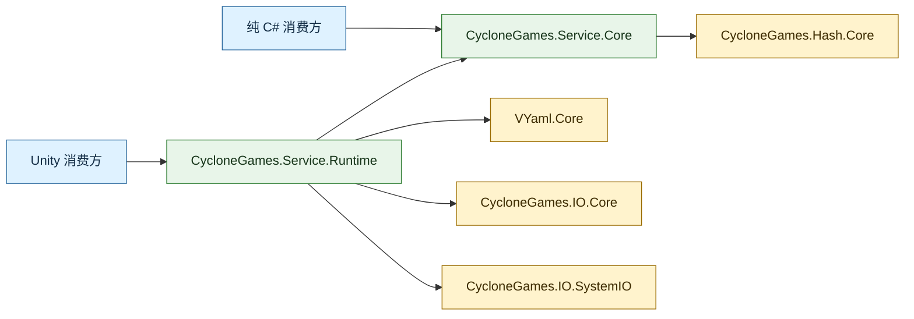

# CycloneGames.Services

[English](README.md)

CycloneGames.Services 提供强类型、有界、版本化的设置状态，具备显式校验、前向迁移、变更通知和单文件原子持久化能力。纯 C# Core 与序列化器和 Unity 解耦；Unity Runtime adapter 使用 VYaml、`Application.persistentDataPath` 与 CycloneGames.IO 组合 Core。

## 目录

- [概览](#概览)
- [架构](#架构)
- [快速开始](#快速开始)
- [核心概念](#核心概念)
- [使用指南](#使用指南)
- [进阶主题](#进阶主题)
- [常见场景](#常见场景)
- [性能与内存](#性能与内存)
- [故障排查](#故障排查)

## 概览

模块核心为 `SettingsStore<T>`：一个单一 owner 容器，持有一个强类型 `struct` 值并管理其完整生命周期——从默认值构造、有界文件读取、Schema 迁移、校验、变更、原子持久化、变更通知到 Dispose。适合设置和其他体积较小、低频提交的配置值。

### 核心特性

- **单一 owner 状态**：一个 `SettingsStore<T>` 实例拥有一个 `struct` 值和一个已绑定 storage entry。
- **显式 Schema**：默认值、版本、校验、深拷贝和前向迁移统一在 `ISettingsSchema<T>`。
- **序列化器无关的 Codec**：`ISettingsCodec<T>` 在值与 payload 之间转换；Core 不依赖任何序列化器。
- **有界读写**：每次读取有分配上限；写入是原子单条目替换。
- **结构化结果**：Load、Update、Save 和 Reset 失败返回带 error code 和消息的结构化结果。
- **Unity 组合边界**：`UnityPersistentSettings` 使用 VYaml 和 `Application.persistentDataPath` 组合 Core，不向 contract 泄露 `UnityEngine` 类型。
- **完整性证据**：每个 envelope 包含 xxHash64 checksum；checksum 修改过的输入默认会被检测并拒绝。
- **Legacy payload 支持**：可选 opt-in 读取旧 API 版本的原始 payload 与 checksum sidecar。

## 架构

两个 assembly 均已设置 `autoReferenced` 为 `false`。消费方 asmdef 应引用实际使用的最窄 assembly。

| Assembly | Unity API | 直接依赖 | 目标消费方 |
| --- | --- | --- | --- |
| `CycloneGames.Service.Core` | 无；已启用 `noEngineReferences` | `CycloneGames.Hash.Core` | 纯 C# 组合、测试、headless/server adapter、自定义序列化器和存储 |
| `CycloneGames.Service.Runtime` | `Application.persistentDataPath` 和 VYaml Unity formatter | Core、`VYaml.Core`、`CycloneGames.IO.Core`、`CycloneGames.IO.SystemIO` | 需要默认 YAML/文件系统组合的 Unity Player 和 Editor 工具 |
| `CycloneGames.Service.Tests.Core` | 无；已启用 `noEngineReferences` | Core、`CycloneGames.Hash.Core` | Editor 中的纯 C# 状态与持久化测试 |
| `CycloneGames.Service.Tests.Runtime` | Editor test assembly | Core、Runtime、`VYaml.Core` | 仅用于 EditMode 验证 |

| 目录 | 内容 |
| --- | --- |
| `Core/Settings/` | 与序列化器无关的 Contract、Result、Envelope、Options 和 `SettingsStore<T>` |
| `Runtime/Scripts/Settings/` | Unity persistent-path factory 和 VYaml adapter |
| `Tests/Runtime/` | Core/Runtime integration boundary 的 Editor-only 测试 |



### 主要公开类型

| 类型 | 职责 |
| --- | --- |
| `SettingsStore<T>` | 拥有一个当前值，隔离 Snapshot，串行化操作，校验 Candidate，加载、迁移、保存、重置、通知和 Dispose |
| `ISettingsSchema<T>` | 为一个设置类型定义当前 Schema 版本、合法默认值、独立拷贝、校验和前向迁移 |
| `ISettingsCodec<T>` | 以确定性方式在设置值与 Payload 之间转换，并执行调用方提供的字节预算 |
| `ISettingsStorage` | 绑定一个逻辑条目，定义有界读取和同步原子提交语义，不假设文件系统 |
| `ILegacySettingsChecksumStorage` | 读取和删除旧版 checksum sidecar 的可选能力 |
| `SettingsStoreOptions` | 不可变策略：Payload 预算、Legacy 读取策略、Modified-payload 策略和临时 buffer 清理 |
| `SettingsLoadResult` | 描述 Load 状态、完整性、格式、源/目标版本、迁移、重写需求和失败详情 |
| `SettingsOperationResult` | 描述 Update、Reset 或 Save 成功、已提交状态变更、Warning 和失败详情 |
| `UnityPersistentSettings` | 在 `Application.persistentDataPath` 下校验相对路径并组合默认 YAML Store |
| `VYamlSettingsCodec<T>` | 使用 VYaml 实现序列化器边界，内部链式连接消费方 generated resolver、Unity 和标准 formatter |

## 快速开始

在消费方 asmdef 中添加 `CycloneGames.Service.Runtime`。VYaml source generation 还需要消费方 assembly 引用项目所用的 VYaml assembly。

定义 partial settings struct 及其 Schema：

```csharp
using CycloneGames.Services;
using VYaml.Annotations;

namespace MyGame.Settings
{
    [YamlObject]
    public partial struct GameSettings
    {
        public int SchemaVersion;
        public float MasterVolume;
        public bool FullScreen;
    }

    public sealed class GameSettingsSchema : ISettingsSchema<GameSettings>
    {
        public int CurrentVersion => 1;

        public GameSettings CreateDefault()
        {
            return new GameSettings
            {
                SchemaVersion = CurrentVersion,
                MasterVolume = 1f,
                FullScreen = true
            };
        }

        public GameSettings Clone(in GameSettings settings)
        {
            return settings;
        }

        public int GetVersion(in GameSettings settings)
        {
            return settings.SchemaVersion;
        }

        public SettingsValidationResult Validate(in GameSettings settings)
        {
            if (float.IsNaN(settings.MasterVolume)
                || float.IsInfinity(settings.MasterVolume)
                || settings.MasterVolume < 0f
                || settings.MasterVolume > 1f)
            {
                return SettingsValidationResult.Invalid(
                    "MasterVolume 必须是有限值且位于 [0, 1] 闭区间内。");
            }

            return SettingsValidationResult.Valid();
        }

        public SettingsMigrationResult Migrate(
            int sourceVersion,
            int targetVersion,
            ref GameSettings settings)
        {
            if (sourceVersion == 0 && targetVersion == 1)
            {
                settings.SchemaVersion = 1;
                return SettingsMigrationResult.Success();
            }

            return SettingsMigrationResult.Failure(
                $"不存在从 Schema {sourceVersion} 到 {targetVersion} 的迁移路径。");
        }
    }
}
```

在 Unity 生命周期边界组合并持有 Store：

```csharp
using CycloneGames.Services;
using CycloneGames.Services.Unity;
using MyGame.Settings;
using UnityEngine;
using VYaml.Serialization;

public sealed class GameSettingsOwner : MonoBehaviour
{
    private SettingsStore<GameSettings> _store;

    private void Awake()
    {
        _store = UnityPersistentSettings.CreateYaml(
            "Settings/game.yaml",
            new GameSettingsSchema(),
            GeneratedResolver.Instance,
            new SettingsStoreOptions(maxPayloadBytes: 16 * 1024));

        _store.Changed += OnSettingsChanged;

        SettingsLoadResult load = _store.Load();
        if (!load.Succeeded)
        {
            GameSettings fallback = _store.Value;
            ApplySettings(in fallback, SettingsChangeReason.ResetToDefaults);
            Debug.LogError($"加载设置失败: {load.ErrorCode}: {load.Message}");
            return;
        }

        if (load.RequiresSave)
        {
            SaveAndReport();
        }
    }

    public void SetMasterVolume(float volume)
    {
        SettingsOperationResult update = _store.Update(
            (ref GameSettings settings) => settings.MasterVolume = volume);

        if (!update.Succeeded)
        {
            Debug.LogWarning($"设置更新被拒绝: {update.ErrorCode}: {update.Message}");
            return;
        }

        SaveAndReport();
    }

    private void OnSettingsChanged(
        in GameSettings settings,
        SettingsChangeReason reason)
    {
        ApplySettings(in settings, reason);
    }

    private static void ApplySettings(
        in GameSettings settings,
        SettingsChangeReason reason)
    {
        AudioListener.volume = settings.MasterVolume;
        Screen.fullScreen = settings.FullScreen;
    }

    private void SaveAndReport()
    {
        SettingsOperationResult save = _store.Save();
        if (!save.Succeeded)
        {
            Debug.LogError($"保存设置失败: {save.ErrorCode}: {save.Message}");
        }
    }

    private void OnDestroy()
    {
        if (_store == null) return;

        _store.Changed -= OnSettingsChanged;
        _store.Dispose();
        _store = null;
    }
}
```

该示例在用户操作提交后保存。对于 Slider 或快速变化的控件，在交互期间只更新内存值，在确认时保存或通过产品侧 debounce 策略保存。

## 核心概念

### SettingsStore\<T\>

一个 `SettingsStore<T>` 拥有一个 Owner 和一个已绑定存储条目。在组合根构造它，避免放入全局静态状态，并在 Owner 关闭时 Dispose。

| 操作 | 行为 | 持久化 | 通知 |
| --- | --- | --- | --- |
| 构造 | 创建默认值，拷贝为 Store 持有状态，完成校验 | 无 | 无 |
| `Load()` | 读取 Candidate，检查 bounds/format/integrity/version，迁移，校验，拷贝后提交；常规失败保留之前的值 | 只读 | 存储值提交后触发 `Loaded`；条目缺失时触发 `ResetToDefaults` |
| `Update(action)` | 为回调拷贝当前值，校验 Candidate，再次拷贝后提交；失败保留之前的值 | 无 | 提交后触发 `Updated` |
| `Save()` | 重新校验当前值，序列化，封装 Envelope，原子替换已绑定条目 | 写入一个条目 | 无 |
| `ResetToDefaults()` | 创建、校验并提交默认值 | 无 | 提交后触发 `ResetToDefaults` |
| `Dispose()` | 清除订阅者，将持有值替换为 `default`，拒绝后续访问 | 无 | 无 |

`Value` 返回 `_schema.Clone(in _value)`——一个独立快照。每个 Observer 也会收到独立拷贝。`ISettingsSchema<T>.Clone` 必须深拷贝所有可达的可变 array、collection 和 object。

### Schema（`ISettingsSchema<T>`）

Schema 定义当前版本、合法默认值、独立拷贝、校验规则和前向迁移。`CreateDefault()` 必须返回当前版本并通过 `Validate`。`Clone` 必须返回独立值。`GetVersion` 和 `Validate` 不得修改传入值。`Migrate` 仅在 source 版本低于 target 时调用，并必须将内嵌版本精确更新为 `CurrentVersion`。

逐步执行迁移以保持中间版本规则显式：

```csharp
public SettingsMigrationResult Migrate(
    int sourceVersion, int targetVersion, ref GameSettings settings)
{
    int version = sourceVersion;
    while (version < targetVersion)
    {
        switch (version)
        {
            case 0:
                settings.MasterVolume = 1f;
                settings.SchemaVersion = 1;
                version = 1;
                break;
            case 1:
                settings.FullScreen = true;
                settings.SchemaVersion = 2;
                version = 2;
                break;
            default:
                return SettingsMigrationResult.Failure(
                    $"从 Schema {version} 迁移的步骤不存在。");
        }
    }
    return SettingsMigrationResult.Success();
}
```

迁移仅修改内存中的 Candidate。仅在 `Load()` 成功且返回 `RequiresSave` 后持久化。

### Codec（`ISettingsCodec<T>`）

Codec 以确定性方式在设置值与持久化 payload 之间转换。`Serialize` 接收允许的最大 payload size，必须在超出该预算前抛出 `SettingsPayloadBudgetExceededException`。`Deserialize` 不得保留对传入 payload 的 view，除非创建自有拷贝。

### Storage（`ISettingsStorage`）

`ISettingsStorage` 绑定一个逻辑条目，定义有界读取和同步原子提交语义。`GetLength` 和 `Read` 仅对缺失条目报告 `SettingsStorageEntryNotFoundException`；权限、挂载、配额等错误必须可区分。`WriteAtomically` 必须同步消费数组而不保留；提交失败时必须保留之前的完整条目。Store 故意不执行 `Exists` 预检，因为它会引入竞态条件。

### 结果

`SettingsLoadResult.Succeeded` 对 `Loaded` 和 `Missing` 均为 true，仅对 `Failed` 为 false。文件缺失是正常的首次运行状态：默认值被提交，`RequiresSave` 为 true。

| 属性 | 含义 |
| --- | --- |
| `Status` | `Loaded`、`Missing` 或 `Failed` |
| `Integrity` | Checksum evidence 是否被检查及匹配（见下表） |
| `Format` | `EnvelopeV1`、`LegacyPayload` 或 `None` |
| `SourceVersion` / `TargetVersion` | 存储中读取的版本和当前 build 的 schema version |
| `MigrationApplied` | Schema 已在内存中迁移 Candidate |
| `RequiresSave` | 存储条目缺失、为 Legacy、已迁移或显式接受了 checksum-modified payload |
| `ErrorCode`、`Message`、`Exception` | 稳定分类、详情和可选的原始异常 |

Integrity 为证据，非策略：

| Integrity | 含义 |
| --- | --- |
| `NotChecked` | 存储在校验证据建立前失败 |
| `Valid` | 存储的 checksum 与 payload 匹配 |
| `Missing` | 主条目不存在，或可选 legacy checksum 不存在 |
| `Modified` | Checksum 与 payload 不匹配；默认策略在反序列化前拒绝 |
| `Corrupted` | Envelope 或序列化 payload 无法被接受 |

`SettingsOperationResult.StateChanged` 仅在 `Update` 或 `ResetToDefaults` 提交值时返回 true。

### 错误码

| Error code | 含义 |
| --- | --- |
| `ReadFailed` | 长度/读取操作失败；保留之前的值 |
| `PayloadTooLarge` | 内容超出配置预算 |
| `UnsupportedFormat` | Envelope 版本未知或 Legacy input 已禁用 |
| `CorruptedEnvelope` | Envelope header 格式错误 |
| `DeserializeFailed` | Codec 拒绝了 Payload |
| `SchemaVersionMismatch` | Envelope 与 Payload 版本不一致，或迁移未生成当前版本 |
| `FutureSchemaVersion` | 数据由更新版本读取写入；不要覆盖 |
| `MigrationFailed` | 未完成合法的前向迁移 |
| `ValidationFailed` | 默认值、加载数据或 Update 违反领域不变性 |
| `SerializationFailed` | Codec 抛异常、返回 null 或 Payload 无法封装 |
| `WriteFailed` | 原子提交失败 |
| `UpdateCallbackFailed` | 变更回调抛异常；之前的值被保留 |
| `ObserverFailed` | 状态已提交，但某个 Observer 拷贝或订阅者失败 |
| `SnapshotFailed` | Schema 无法创建所有权转移所需的隔离拷贝 |
| `LegacyCleanupFailed` | Envelope 已提交但 Legacy sidecar 删除失败（成功 Warning） |
| `IntegrityCheckFailed` | Checksum 不匹配；默认拒绝，或 opt-in 接受并需规范化重写 |

### 所有权与线程

Storage、Codec、Validation、Migration、Callback 和 Observer 错误通过结果表达。无效构造参数、生命周期误用、重入和无效 Schema 配置可能抛出异常。

通知为同步执行，仅在权威值提交后触发。订阅者按注册顺序逐个调用，各自获得独立 Schema 快照。Observer 必须简短、不抛异常，且不得对同一 Store 调用 `Load`、`Update`、`Save`、`ResetToDefaults` 或 `Dispose`。

嵌套和重入操作通过 `InvalidOperationException` 快速失败。类型非线程安全。所有访问必须通过单一 Owner 和单一 Scheduler 串行化。原子存储提交防止条目撕裂，但不解决并发写入问题。

## 使用指南

### 自定义 Codec

Core assembly 支持显式构造注入。Codec 是窄适配器，应对相同值产生相同字节，拒绝格式错误的输入，并执行 payload 预算约束：

```csharp
using System;
using System.Buffers.Binary;
using System.IO;
using CycloneGames.Services;

public sealed class GameSettingsBinaryCodec : ISettingsCodec<GameSettings>
{
    private const int PayloadSize = 9;

    public byte[] Serialize(in GameSettings settings, int maxByteCount)
    {
        if (maxByteCount <= 0)
            throw new ArgumentOutOfRangeException(nameof(maxByteCount));

        if (PayloadSize > maxByteCount)
            throw new SettingsPayloadBudgetExceededException(maxByteCount);

        var payload = new byte[PayloadSize];
        BinaryPrimitives.WriteInt32LittleEndian(payload.AsSpan(0, 4), settings.SchemaVersion);
        BinaryPrimitives.WriteInt32LittleEndian(
            payload.AsSpan(4, 4), BitConverter.SingleToInt32Bits(settings.MasterVolume));
        payload[8] = settings.FullScreen ? (byte)1 : (byte)0;
        return payload;
    }

    public GameSettings Deserialize(ReadOnlyMemory<byte> payload)
    {
        ReadOnlySpan<byte> bytes = payload.Span;
        if (bytes.Length != PayloadSize || bytes[8] > 1)
            throw new InvalidDataException("Settings Payload 格式错误。");

        return new GameSettings
        {
            SchemaVersion = BinaryPrimitives.ReadInt32LittleEndian(bytes.Slice(0, 4)),
            MasterVolume = BitConverter.Int32BitsToSingle(
                BinaryPrimitives.ReadInt32LittleEndian(bytes.Slice(4, 4))),
            FullScreen = bytes[8] == 1
        };
    }
}
```

### 显式组合

```csharp
using CycloneGames.Services;

public static class SettingsComposition
{
    public static SettingsStore<GameSettings> Create(ISettingsStorage storage)
    {
        return new SettingsStore<GameSettings>(
            storage,
            new GameSettingsBinaryCodec(),
            new GameSettingsSchema(),
            new SettingsStoreOptions(
                maxPayloadBytes: 4 * 1024,
                allowLegacyPayload: false,
                clearTemporaryBuffers: true,
                allowModifiedPayload: false));
    }
}
```

### 平台存储

`SystemFileSettingsStorage` 接受全限定路径，仅在 Editor、Standalone、iOS、Android 和 Dedicated Server build 中启用，内部使用 `SystemFileStore.Default`。其他平台在构造时直接失败。

对于 WebGL、主机平台或未来未验证的 Player，基于目标 SDK 的存储 API 实现 `ISettingsStorage`，并通过 `UnityPersistentSettings.CreateYaml` 的 storage overload 注入：

```csharp
using CycloneGames.Services;
using CycloneGames.Services.Unity;

// 默认 Unity 路径组合
var store = UnityPersistentSettings.CreateYaml(
    "Settings/game.yaml", schema, resolver, options);

// 任意平台的自定义存储
var store = UnityPersistentSettings.CreateYaml(
    new MyWebGlStorage("settings.yaml"), schema, resolver, options);
```

## 进阶主题

### 持久化格式

每次新保存为单个 Envelope 后跟 Codec Payload 字节：

```text
# CycloneGames.Services Settings
# format: 1
# schema: 2
# xxh64: <16 hexadecimal digits>
---
<payload bytes>
```

Envelope header 使用 ASCII，解码时最多扫描 256 bytes，记录独立的 format version、schema version 和 xxHash64 payload checksum。`Save()` 在内存中构建 Envelope 并调用 `ISettingsStorage.WriteAtomically`。默认 `SystemFileSettingsStorage` 委托给 CycloneGames.IO 的同目录临时文件提交。

### Legacy 迁移

Legacy data 为目标路径下的原始 Codec Payload，及可选的同级 `<destination>.checksum`（包含十六进制 xxHash64）。Legacy input 默认禁用。在迁移窗口内使用 `allowLegacyPayload: true` 开启：

1. 不含 Envelope magic 的内容被视为 `LegacyPayload`。
2. Schema version 从反序列化后的 Payload 读取。
3. 可读的 checksum sidecar 报告 `Valid` 或 `Modified`；比较时 CR 和 CRLF 统一为 LF。
4. Storage adapter 未实现 `ILegacySettingsChecksumStorage` 或 checksum 读取返回 not-found 时报告 `Missing`。
5. 执行正常的版本、迁移和校验规则。
6. 成功结果设置 `RequiresSave` 用于单文件 Envelope 重写。
7. 每次 Envelope 成功提交后，Adapter 调用幂等 sidecar 删除。删除失败返回 `LegacyCleanupFailed` warning。

仅在升级已知安装用户群期间启用 Legacy input，之后移除 opt-in。

### Checksum 修改后的 Payload

默认情况下，Checksum 不匹配以 `IntegrityCheckFailed` 失败。确实需要接受人工编辑本地偏好的产品可以使用 `allowModifiedPayload: true` 构造 `SettingsStoreOptions`；candidate 仍须通过版本、迁移和 Schema 校验。xxHash64 用于检测意外修改；它不是 MAC、签名或加密方案。

### 线程

Store 仅提供同步 API，不接受 Cancellation Token。内部无锁，不支持并发访问。Unity 组合保持在主线程。非 Unity 产品将存储工作移至 Worker 时，应将整个 Store Owner 放入串行 Worker Queue，并通过显式 Scheduler 发布不可变快照。

## 常见场景

### Unity 游戏设置

快速开始示例展示了标准模式：定义 YAML 注解的设置 struct 和 Schema，使用 `UnityPersistentSettings.CreateYaml` 组合 Store，启动时 Load，通过 `Update` 修改，显式 Save，并订阅 `Changed` 以将值应用到 Unity 子系统。

### 服务端配置

对于 Headless Server 或 CLI 工具，仅使用 `CycloneGames.Service.Core` 组合。注入一个写入进程启动目录的 `ISettingsStorage`：

```csharp
public static SettingsStore<T> CreateServerSettings<T>(
    string configPath, ISettingsSchema<T> schema, ISettingsCodec<T> codec)
    where T : struct
{
    return new SettingsStore<T>(
        new SystemFileSettingsStorage(configPath),
        codec,
        schema,
        new SettingsStoreOptions(maxPayloadBytes: 64 * 1024));
}
```

### 自定义序列化器接入

为任意序列化器（JSON、Binary、Protobuf、MessagePack 等）实现 `ISettingsCodec<T>`。确保 Codec 具有确定性、执行预算约束，并在 IL2CPP/AOT 下可运行，不依赖纯反射发现。

## 性能与内存

设置操作属于 Cold Path。应在启动、显式提交、检查点或关闭时调用——而非每帧调用。

`SettingsStoreOptions` 将 Payload 限制在 256 bytes 到 16 MiB 之间，默认 256 KiB。读取最多允许 `MaxPayloadBytes + 256` bytes 以容纳 Envelope。Legacy checksum 读取上限为 256 bytes。

| 操作 | 分配 | 说明 |
| --- | --- | --- |
| `Load` | 有界整文件数组 | Envelope Payload 使用 `ReadOnlyMemory<byte>` view |
| `Save` | Envelope 数组 + 序列化 Payload | VYaml 从 `ArrayPool<byte>.Shared` 租用，每次增长前检查预算 |
| `Value`（获取） | 1 次 Clone | 纯值拷贝可零分配 |
| `Update` | >= 2 次 Clone | 回调前一次 + 校验后一次 |
| Observer 通知 | 每个订阅者 1 次 Clone | 各自独立快照 |
| Observer 增删 | 数组拷贝 | 仅在冷订阅路径 |

Load 和 Save 不具备 Zero-GC 声明。Header 解码、YAML 处理和引用图深拷贝会产生分配。实现仅长期持有一个 `T` 值、一个 Observer 数组和不可变协作者。它不缓存序列化 Payload、不维护注册表、不池化 Store，也不监听文件。

`ClearTemporaryBuffers == true`（默认）时，Store 在释放自身持有的文件、Legacy checksum、序列化 Payload 和 Envelope 数组前清零。序列化器内部 Buffer 和 OS 缓存不在此保证内。

**安全**：所有持久化文件须按不可信输入处理。保持字节预算有界，并在 `ISettingsSchema<T>` 中校验每个字段。不要在此存储凭据、付费状态或反作弊决策。Threat Model 需要时，在专用 Adapter 中添加平台安全存储或认证加密。

## 故障排查

| 现象 | 常见原因 | 处理方式 |
| --- | --- | --- |
| VYaml 报告无 formatter | 类型未标注 `[YamlObject]`/`partial`、source generation 未运行或 resolver 错误 | 修复消费方 assembly 并传入其 `GeneratedResolver.Instance` |
| Unity factory 拒绝路径 | 路径为 rooted、通过 `..` 逃逸、包含 empty/dot segment 或穿越 link | 使用简单相对路径，如 `Settings/game.yaml` |
| 首次 Load 返回 `Missing` | 主存储条目不存在 | 应用已提交的默认值，在正常提交点保存 |
| Load 以 `IntegrityCheckFailed` 失败 | 存储的 xxHash64 与 Payload 不匹配且未启用 modified input | 保留文件；仅为有意的人工编辑流程启用 `allowModifiedPayload` |
| Load 返回 `FutureSchemaVersion` | 较新版本写入了该文件 | 保留文件并使用兼容版本 |
| Update 返回 `ValidationFailed` | Candidate 违反 Schema 约束 | 显示领域错误信息；已提交值不变 |
| Result 报告 `ObserverFailed` | Observer 拷贝或 `Changed` 订阅者抛异常 | 修复拷贝或订阅者；状态已提交 |
| Save 返回 `WriteFailed` | 权限、配额、挂载或文件冲突 | 保留旧文件，检查异常，遵循平台存储策略 |
| Save 返回 `LegacyCleanupFailed` | Envelope 已提交但 sidecar 删除失败 | 保存已生效；下次成功 Save 会重试删除 |
| 残留 `.cyclone-*.tmp` 文件 | 进程或事务在清理前中断 | 仅在没有事务运行时清理 |
| `SystemFileSettingsStorage` 在 Player 中抛出异常 | System.IO adapter 未通过该平台验证 | 实现平台存储 `ISettingsStorage` 并使用 storage overload |
