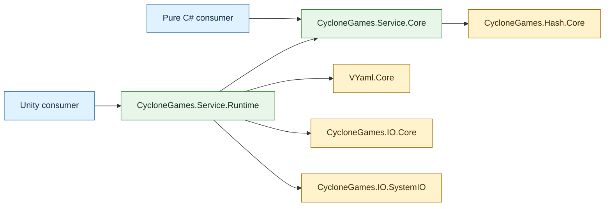

# CycloneGames.Services

[简体中文](README.SCH.md)

CycloneGames.Services provides typed, bounded, versioned settings state with explicit validation, forward migration, change notification, and one-file atomic persistence. Its pure C# core is serializer-neutral and Unity-independent; the Unity runtime adapter composes that core with VYaml, `Application.persistentDataPath`, and CycloneGames.IO.

## Table of Contents

- [Overview](#overview)
- [Architecture](#architecture)
- [Quick Start](#quick-start)
- [Core Concepts](#core-concepts)
- [Usage Guide](#usage-guide)
- [Advanced Topics](#advanced-topics)
- [Common Scenarios](#common-scenarios)
- [Performance and Memory](#performance-and-memory)
- [Troubleshooting](#troubleshooting)

## Overview

The module centers on `SettingsStore<T>`, a single-owner container that holds one typed `struct` value and manages its full lifecycle: construction from defaults, bounded file reads, schema migration, validation, mutation, atomic persistence, change notification, and disposal. It is designed for settings and other small, infrequently committed configuration values.

### Key features

- **Single-owner typed state**: one `SettingsStore<T>` instance owns one `struct` value and one bound storage entry.
- **Explicit schema**: defaults, version, validation, deep cloning, and forward migration in one `ISettingsSchema<T>`.
- **Serializer-neutral codec**: `ISettingsCodec<T>` converts between value and payload; the core has no serialization dependency.
- **Bounded reads and writes**: every read has an allocation ceiling; writes are atomic one-entry replacements.
- **Structured results**: load, update, save, and reset failures return typed results with error codes and messages.
- **Unity composition boundary**: `UnityPersistentSettings` composes the core with VYaml and `Application.persistentDataPath` without leaking `UnityEngine` types into contracts.
- **Integrity evidence**: xxHash64 checksum in every envelope; checksum-modified input is detected and rejected by default.
- **Legacy payload support**: opt-in reading of raw payloads and checksum sidecars from earlier API versions.

## Architecture

Both assemblies set `autoReferenced` to `false`. A consumer asmdef must reference the narrowest assembly it uses.

| Assembly | Unity API | Direct dependencies | Intended consumers |
| --- | --- | --- | --- |
| `CycloneGames.Service.Core` | None; `noEngineReferences` enabled | `CycloneGames.Hash.Core` | Pure C# composition, tests, headless/server adapters, custom serializers and storage |
| `CycloneGames.Service.Runtime` | `Application.persistentDataPath` and VYaml Unity formatters | Core, `VYaml.Core`, `CycloneGames.IO.Core`, `CycloneGames.IO.SystemIO` | Unity players and Editor tools that need the default YAML/file-system composition |
| `CycloneGames.Service.Tests.Core` | None; `noEngineReferences` enabled | Core, `CycloneGames.Hash.Core` | Editor-hosted pure C# state and persistence tests |
| `CycloneGames.Service.Tests.Runtime` | Editor test assembly | Core, Runtime, `VYaml.Core` | EditMode verification only |

| Directory | Contents |
| --- | --- |
| `Core/Settings/` | Serializer-neutral contracts, results, envelope, options, and `SettingsStore<T>` |
| `Runtime/Scripts/Settings/` | Unity persistent-path factory and VYaml adapters |
| `Tests/Runtime/` | Editor-only tests for the Core/Runtime integration boundary |



### Public types

| Type | Responsibility |
| --- | --- |
| `SettingsStore<T>` | Owns one current value, isolates snapshots, serializes operations, validates candidates, loads, migrates, saves, resets, notifies, and disposes |
| `ISettingsSchema<T>` | Defines current schema version, valid defaults, independent cloning, validation, and forward migration for one settings type |
| `ISettingsCodec<T>` | Deterministically converts one settings value to and from a payload and enforces the caller-provided serialization byte budget |
| `ISettingsStorage` | Binds one logical entry and defines bounded read plus synchronous atomic commit semantics without assuming a filesystem |
| `ILegacySettingsChecksumStorage` | Optional capability for reading and deleting the former checksum sidecar |
| `SettingsStoreOptions` | Immutable policy: payload budget, legacy-read policy, modified-payload policy, and temporary-buffer clearing |
| `SettingsLoadResult` | Describes load status, integrity, format, source/target versions, migration, rewrite requirement, and failure details |
| `SettingsOperationResult` | Describes update, reset, or save success, committed state change, warning, and failure details |
| `UnityPersistentSettings` | Validates a portable relative path under `Application.persistentDataPath` and composes the default YAML store |
| `VYamlSettingsCodec<T>` | Implements the serializer boundary with VYaml and chains consumer-generated, Unity, and standard formatters |

## Quick Start

Add `CycloneGames.Service.Runtime` to the consumer asmdef. VYaml source generation also requires the consumer assembly to reference the VYaml assembly used by the project.

Define a partial settings struct and its schema:

```csharp
using CycloneGames.Services;
using VYaml.Annotations;

namespace MyGame.Settings
{
    [YamlObject]
    public partial struct GameSettings
    {
        public int SchemaVersion;
        public float MasterVolume;
        public bool FullScreen;
    }

    public sealed class GameSettingsSchema : ISettingsSchema<GameSettings>
    {
        public int CurrentVersion => 1;

        public GameSettings CreateDefault()
        {
            return new GameSettings
            {
                SchemaVersion = CurrentVersion,
                MasterVolume = 1f,
                FullScreen = true
            };
        }

        public GameSettings Clone(in GameSettings settings)
        {
            return settings;
        }

        public int GetVersion(in GameSettings settings)
        {
            return settings.SchemaVersion;
        }

        public SettingsValidationResult Validate(in GameSettings settings)
        {
            if (float.IsNaN(settings.MasterVolume)
                || float.IsInfinity(settings.MasterVolume)
                || settings.MasterVolume < 0f
                || settings.MasterVolume > 1f)
            {
                return SettingsValidationResult.Invalid(
                    "MasterVolume must be finite and in the inclusive range [0, 1].");
            }

            return SettingsValidationResult.Valid();
        }

        public SettingsMigrationResult Migrate(
            int sourceVersion,
            int targetVersion,
            ref GameSettings settings)
        {
            if (sourceVersion == 0 && targetVersion == 1)
            {
                settings.SchemaVersion = 1;
                return SettingsMigrationResult.Success();
            }

            return SettingsMigrationResult.Failure(
                $"No migration path exists from schema {sourceVersion} to {targetVersion}.");
        }
    }
}
```

Compose and own the store at a Unity lifecycle boundary:

```csharp
using CycloneGames.Services;
using CycloneGames.Services.Unity;
using MyGame.Settings;
using UnityEngine;
using VYaml.Serialization;

public sealed class GameSettingsOwner : MonoBehaviour
{
    private SettingsStore<GameSettings> _store;

    private void Awake()
    {
        _store = UnityPersistentSettings.CreateYaml(
            "Settings/game.yaml",
            new GameSettingsSchema(),
            GeneratedResolver.Instance,
            new SettingsStoreOptions(maxPayloadBytes: 16 * 1024));

        _store.Changed += OnSettingsChanged;

        SettingsLoadResult load = _store.Load();
        if (!load.Succeeded)
        {
            GameSettings fallback = _store.Value;
            ApplySettings(in fallback, SettingsChangeReason.ResetToDefaults);
            Debug.LogError($"Settings load failed: {load.ErrorCode}: {load.Message}");
            return;
        }

        if (load.RequiresSave)
        {
            SaveAndReport();
        }
    }

    public void SetMasterVolume(float volume)
    {
        SettingsOperationResult update = _store.Update(
            (ref GameSettings settings) => settings.MasterVolume = volume);

        if (!update.Succeeded)
        {
            Debug.LogWarning($"Settings update rejected: {update.ErrorCode}: {update.Message}");
            return;
        }

        SaveAndReport();
    }

    private void OnSettingsChanged(
        in GameSettings settings,
        SettingsChangeReason reason)
    {
        ApplySettings(in settings, reason);
    }

    private static void ApplySettings(
        in GameSettings settings,
        SettingsChangeReason reason)
    {
        AudioListener.volume = settings.MasterVolume;
        Screen.fullScreen = settings.FullScreen;
    }

    private void SaveAndReport()
    {
        SettingsOperationResult save = _store.Save();
        if (!save.Succeeded)
        {
            Debug.LogError($"Settings save failed: {save.ErrorCode}: {save.Message}");
        }
    }

    private void OnDestroy()
    {
        if (_store == null) return;

        _store.Changed -= OnSettingsChanged;
        _store.Dispose();
        _store = null;
    }
}
```

This example saves after a committed user action. For sliders or rapidly changing controls, update the in-memory value during interaction and save on confirmation or through a product-owned debounce policy.

## Core Concepts

### SettingsStore\<T\>

One `SettingsStore<T>` has one owner and one bound storage entry. Construct it at a composition root, keep it out of static global state, and dispose it when the owner shuts down.

| Operation | Behavior | Persistence | Notification |
| --- | --- | --- | --- |
| Construction | Creates defaults, clones into store-owned state, and validates | None | None |
| `Load()` | Reads candidate, checks bounds/format/integrity/version, migrates, validates, clones, then commits; ordinary failures preserve the previous value | Read only | `Loaded` after stored value commits; `ResetToDefaults` when entry is missing |
| `Update(action)` | Clones current value for the callback, validates the candidate, clones again into store-owned state, then commits; failure preserves the previous value | None | `Updated` after commit |
| `Save()` | Revalidates current value, serializes, wraps in envelope, and atomically replaces the bound entry | Writes one entry | None |
| `ResetToDefaults()` | Creates, validates, and commits defaults | None | `ResetToDefaults` after commit |
| `Dispose()` | Clears subscribers, replaces held value with `default`, and rejects later access | None | None |

`Value` returns `_schema.Clone(in _value)` -- an independent snapshot. Each observer also receives an independent clone. `ISettingsSchema<T>.Clone` must deep-copy every reachable mutable array, collection, and object.

### Schema (`ISettingsSchema<T>`)

The schema defines the current version, valid defaults, independent cloning, validation rules, and forward migration for one settings type. `CreateDefault()` must return the current version and pass `Validate`. `Clone` must return an independent value. `GetVersion` and `Validate` must not mutate the supplied value. `Migrate` is called only for an older source and must update the embedded version to `CurrentVersion`.

Apply migrations step by step so intermediate release rules remain explicit:

```csharp
public SettingsMigrationResult Migrate(
    int sourceVersion, int targetVersion, ref GameSettings settings)
{
    int version = sourceVersion;
    while (version < targetVersion)
    {
        switch (version)
        {
            case 0:
                settings.MasterVolume = 1f;
                settings.SchemaVersion = 1;
                version = 1;
                break;
            case 1:
                settings.FullScreen = true;
                settings.SchemaVersion = 2;
                version = 2;
                break;
            default:
                return SettingsMigrationResult.Failure(
                    $"No migration step for schema {version}.");
        }
    }
    return SettingsMigrationResult.Success();
}
```

Migration changes only the in-memory candidate. Persist only after `Load()` succeeds and returns `RequiresSave`.

### Codec (`ISettingsCodec<T>`)

The codec deterministically converts between a settings value and its persisted payload. `Serialize` receives the maximum payload size and must throw `SettingsPayloadBudgetExceededException` before exceeding it. `Deserialize` must not retain a view into the supplied payload unless it makes an owned copy.

### Storage (`ISettingsStorage`)

`ISettingsStorage` binds one logical entry and defines bounded read plus synchronous atomic commit semantics. `GetLength` and `Read` must report only a missing entry as `SettingsStorageEntryNotFoundException`; permission, mount, and quota failures must remain distinguishable. `WriteAtomically` must synchronously consume without retaining the array, and a failed commit must preserve the previous complete entry. The store deliberately performs no `Exists` preflight because it adds a race.

### Results

`SettingsLoadResult.Succeeded` is true for both `Loaded` and `Missing`; it is false only for `Failed`. A missing file is a normal first-run state: defaults are committed and `RequiresSave` is true.

| Property | Meaning |
| --- | --- |
| `Status` | `Loaded`, `Missing`, or `Failed` |
| `Integrity` | Whether checksum evidence was checked and matched (see table below) |
| `Format` | `EnvelopeV1`, `LegacyPayload`, or `None` |
| `SourceVersion` / `TargetVersion` | Version read from storage and the schema version supported by this build |
| `MigrationApplied` | The schema migrated the candidate in memory |
| `RequiresSave` | The storage entry is missing, legacy, migrated, or an explicitly accepted checksum-modified payload |
| `ErrorCode`, `Message`, `Exception` | Stable classification, detail, and optional original exception |

Integrity values are evidence, not policy:

| Integrity | Meaning |
| --- | --- |
| `NotChecked` | Storage failed before checksum evidence could be established |
| `Valid` | The stored checksum matches the payload |
| `Missing` | The primary entry is absent, or the optional legacy checksum is absent |
| `Modified` | The checksum does not match the payload; default policy rejects before deserialization |
| `Corrupted` | The envelope or serialized payload could not be accepted |

`SettingsOperationResult.StateChanged` is true only when `Update` or `ResetToDefaults` committed a value.

### Error codes

| Error code | Meaning |
| --- | --- |
| `ReadFailed` | Length/read operation failed; preserve the prior value |
| `PayloadTooLarge` | Content exceeded the configured budget |
| `UnsupportedFormat` | Envelope version is unknown or legacy input is disabled |
| `CorruptedEnvelope` | Envelope header is malformed |
| `DeserializeFailed` | Codec rejected the payload |
| `SchemaVersionMismatch` | Envelope and payload disagree, or migration did not produce the current version |
| `FutureSchemaVersion` | Data written by a newer schema; do not overwrite |
| `MigrationFailed` | No valid forward migration completed |
| `ValidationFailed` | Defaults, loaded data, or an update violates domain invariants |
| `SerializationFailed` | Codec threw, returned null, or payload could not be wrapped |
| `WriteFailed` | Atomic commit failed |
| `UpdateCallbackFailed` | The mutation callback threw; previous value preserved |
| `ObserverFailed` | State committed, but a per-observer clone or subscriber failed |
| `SnapshotFailed` | Schema could not create the isolated clone for ownership transfer |
| `LegacyCleanupFailed` | Envelope committed but legacy sidecar deletion failed (successful warning) |
| `IntegrityCheckFailed` | Checksum mismatched; default reject, or opt-in accept with canonical rewrite required |

### Ownership and threading

Storage, codec, validation, migration, callback, and observer failures are represented by results. Invalid constructor arguments, lifecycle misuse, reentrancy, and invalid schema configuration may throw.

Notifications are synchronous and run after the authoritative value commits. Subscribers are invoked individually in registration order with independent schema snapshots. Observers must be short, non-throwing, and must not call `Load`, `Update`, `Save`, `ResetToDefaults`, or `Dispose` on the same store.

Nested and reentrant operations fail with `InvalidOperationException`. The type is not thread-safe. Serialize all access through one owner and one scheduler. An atomic storage commit prevents a torn entry but does not resolve concurrent writers.

## Usage Guide

### Custom codec

The core assembly supports explicit constructor injection. A codec is a narrow adapter that should produce the same bytes for the same value, reject malformed input, and enforce the payload budget:

```csharp
using System;
using System.Buffers.Binary;
using System.IO;
using CycloneGames.Services;

public sealed class GameSettingsBinaryCodec : ISettingsCodec<GameSettings>
{
    private const int PayloadSize = 9;

    public byte[] Serialize(in GameSettings settings, int maxByteCount)
    {
        if (maxByteCount <= 0)
            throw new ArgumentOutOfRangeException(nameof(maxByteCount));

        if (PayloadSize > maxByteCount)
            throw new SettingsPayloadBudgetExceededException(maxByteCount);

        var payload = new byte[PayloadSize];
        BinaryPrimitives.WriteInt32LittleEndian(payload.AsSpan(0, 4), settings.SchemaVersion);
        BinaryPrimitives.WriteInt32LittleEndian(
            payload.AsSpan(4, 4), BitConverter.SingleToInt32Bits(settings.MasterVolume));
        payload[8] = settings.FullScreen ? (byte)1 : (byte)0;
        return payload;
    }

    public GameSettings Deserialize(ReadOnlyMemory<byte> payload)
    {
        ReadOnlySpan<byte> bytes = payload.Span;
        if (bytes.Length != PayloadSize || bytes[8] > 1)
            throw new InvalidDataException("The settings payload is malformed.");

        return new GameSettings
        {
            SchemaVersion = BinaryPrimitives.ReadInt32LittleEndian(bytes.Slice(0, 4)),
            MasterVolume = BitConverter.Int32BitsToSingle(
                BinaryPrimitives.ReadInt32LittleEndian(bytes.Slice(4, 4))),
            FullScreen = bytes[8] == 1
        };
    }
}
```

### Explicit composition

```csharp
using CycloneGames.Services;

public static class SettingsComposition
{
    public static SettingsStore<GameSettings> Create(ISettingsStorage storage)
    {
        return new SettingsStore<GameSettings>(
            storage,
            new GameSettingsBinaryCodec(),
            new GameSettingsSchema(),
            new SettingsStoreOptions(
                maxPayloadBytes: 4 * 1024,
                allowLegacyPayload: false,
                clearTemporaryBuffers: true,
                allowModifiedPayload: false));
    }
}
```

### Platform storage

`SystemFileSettingsStorage` accepts a fully qualified path, is enabled only in Editor, Standalone, iOS, Android, and Dedicated Server builds, and uses `SystemFileStore.Default` privately. Other platforms fail fast at the constructor.

For WebGL, consoles, or future unqualified players, implement `ISettingsStorage` over the target SDK's save-data API and inject it through the storage overload of `UnityPersistentSettings.CreateYaml`:

```csharp
using CycloneGames.Services;
using CycloneGames.Services.Unity;

// Default Unity path composition
var store = UnityPersistentSettings.CreateYaml(
    "Settings/game.yaml", schema, resolver, options);

// Custom storage for any platform
var store = UnityPersistentSettings.CreateYaml(
    new MyWebGlStorage("settings.yaml"), schema, resolver, options);
```

## Advanced Topics

### Persistence format

Every new save is a single envelope followed by codec payload bytes:

```text
# CycloneGames.Services Settings
# format: 1
# schema: 2
# xxh64: <16 hexadecimal digits>
---
<payload bytes>
```

The envelope header is ASCII, capped at 256 bytes during decoding, and records an independent format version, schema version, and xxHash64 payload checksum. `Save()` builds the envelope in memory and calls `ISettingsStorage.WriteAtomically`. The default `SystemFileSettingsStorage` delegates to CycloneGames.IO's same-directory temporary-file commit.

### Legacy migration

Legacy data is a raw codec payload at the destination with an optional sibling `<destination>.checksum` containing hexadecimal xxHash64. Legacy input is disabled by default. During a migration window, opt in with `allowLegacyPayload: true`:

1. Content without envelope magic is treated as `LegacyPayload`.
2. Schema version is read from the deserialized payload.
3. A readable checksum sidecar reports `Valid` or `Modified`; comparison normalizes CR and CRLF line endings to LF.
4. A storage adapter without `ILegacySettingsChecksumStorage`, or a not-found checksum read, yields `Missing`.
5. Normal version, migration, and validation rules run.
6. A successful result sets `RequiresSave` for the one-file envelope rewrite.
7. After every successful envelope commit, the adapter invokes idempotent sidecar deletion. Deletion failure returns a `LegacyCleanupFailed` warning.

Enable legacy input only while upgrading a known installed population, then remove the opt-in.

### Checksum-modified payload

A checksum mismatch fails with `IntegrityCheckFailed` by default. A product that intentionally accepts manually edited local preferences may construct `SettingsStoreOptions` with `allowModifiedPayload: true`; the candidate must still pass version, migration, and schema validation. xxHash64 detects accidental change; it is not a MAC, signature, or encryption scheme.

### Threading

The store exposes synchronous APIs and no cancellation token. It contains no locks and is not safe for concurrent access. Keep Unity composition on the main thread. If a non-Unity product moves storage work to a worker, move the entire store owner to one serialized worker queue and publish immutable snapshots back through an explicit scheduler.

## Common Scenarios

### Unity game settings

The Quick Start example shows the standard pattern: define a YAML-annotated settings struct and schema, compose the store with `UnityPersistentSettings.CreateYaml`, load on startup, mutate through `Update`, save explicitly, and subscribe to `Changed` to apply values to Unity subsystems.

### Server configuration

For headless server or CLI tools, compose purely with `CycloneGames.Service.Core`. Inject an `ISettingsStorage` that writes to a server-local path during process startup and deployment rollback:

```csharp
public static SettingsStore<T> CreateServerSettings<T>(
    string configPath, ISettingsSchema<T> schema, ISettingsCodec<T> codec)
    where T : struct
{
    return new SettingsStore<T>(
        new SystemFileSettingsStorage(configPath),
        codec,
        schema,
        new SettingsStoreOptions(maxPayloadBytes: 64 * 1024));
}
```

### Custom serializer integration

Implement `ISettingsCodec<T>` for any serializer (JSON, binary, Protobuf, MessagePack). Ensure the codec is deterministic, enforces the budget, and works on IL2CPP/AOT without reflection-only discovery.

## Performance and Memory

Settings operations are cold-path operations. Call them during startup, explicit commit, checkpoint, or shutdown -- not every frame.

`SettingsStoreOptions` bounds payloads from 256 bytes to 16 MiB; the default is 256 KiB. Reads allow at most `MaxPayloadBytes + 256` bytes to accommodate the envelope. Legacy checksum reads are capped at 256 bytes.

| Operation | Allocation | Notes |
| --- | --- | --- |
| `Load` | Bounded whole-file array | Envelope payload uses `ReadOnlyMemory<byte>` view over that array |
| `Save` | Envelope array + serialized payload | VYaml rents from `ArrayPool<byte>.Shared`, checks budget before each growth |
| `Value` (get) | 1 clone | Value-only clones can be zero-allocation |
| `Update` | >= 2 clones | Clone before callback + after validation |
| Observer notification | 1 clone per subscriber | Per-subscriber independent snapshots |
| Observer add/remove | Array copy | Cold subscription path only |

No zero-GC claim applies to load or save. Header decoding, YAML processing, and deep clones of mutable reference graphs allocate. The implementation retains one `T` value, an observer array, and immutable collaborators. It does not cache serialized payloads, maintain a registry, pool stores, or watch files.

With `ClearTemporaryBuffers == true` (the default), the store clears the file, legacy checksum, serialized payload, and envelope arrays before releasing them. Serializer-internal buffers and OS caches are outside that guarantee.

**Security**: Treat every persisted file as untrusted input. Keep the byte budget finite and validate every field in `ISettingsSchema<T>`. Do not store credentials, payment state, or anti-cheat decisions here. Add platform secure storage or authenticated encryption in a dedicated adapter when the threat model requires them.

## Troubleshooting

| Symptom | Likely cause | Resolution |
| --- | --- | --- |
| VYaml reports no formatter | Type is not `[YamlObject]`/`partial`, source generation did not run, or wrong resolver | Fix the consumer assembly and pass its `GeneratedResolver.Instance` |
| Unity factory rejects a path | Path is rooted, escapes with `..`, has empty/dot segments, or traverses a link | Use a simple portable path such as `Settings/game.yaml` |
| First load returns `Missing` | No primary storage entry exists | Apply committed defaults and save at the normal commit point |
| Load fails with `IntegrityCheckFailed` | Stored xxHash64 does not match payload and modified input is disabled | Preserve file; enable `allowModifiedPayload` only for intentional manual-edit workflows |
| Load returns `FutureSchemaVersion` | A newer build wrote the file | Preserve it and require a compatible build |
| Update returns `ValidationFailed` | Candidate violates schema invariants | Show a domain-specific message; committed value is unchanged |
| Result reports `ObserverFailed` | A per-observer clone or `Changed` subscriber threw | Fix clone or subscriber; state has already committed |
| Save returns `WriteFailed` | Permission, quota, mount, file contention | Preserve old file, inspect exception, follow platform storage policy |
| Save returns `LegacyCleanupFailed` | Envelope committed but sidecar deletion failed | Save is committed; retry deletion on next successful save |
| `.cyclone-*.tmp` file remains | Process or transaction interrupted before cleanup | Remove only when no atomic transaction is active |
| `SystemFileSettingsStorage` throws on a Player | System.IO adapter not qualified for that platform | Implement platform-backed `ISettingsStorage` and use the storage overload |
