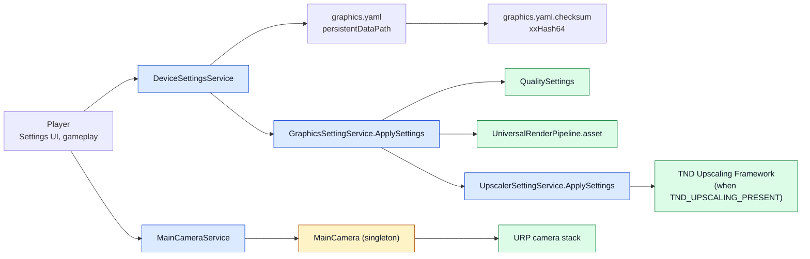

# CycloneGames.Services

[English | 简体中文](README.SCH.md)

CycloneGames.Services bundles three runtime services for Unity: a generic YAML-backed settings store with integrity checking and zero-GC mutation, a URP main-camera stack manager, and platform-aware graphics and upscaler services. Settings persist to `Application.persistentDataPath` as YAML with an xxHash64 checksum sidecar; graphics and upscaler services translate persistent settings into `QualitySettings`, `UniversalRenderPipeline.asset`, and the optional TND Upscaling Framework.

## Table of Contents

- [Overview](#overview)
- [Architecture](#architecture)
- [Quick Start](#quick-start)
- [Core Concepts](#core-concepts)
- [Usage Guide](#usage-guide)
- [Advanced Topics](#advanced-topics)
- [Common Scenarios](#common-scenarios)
- [Performance and Memory](#performance-and-memory)
- [Troubleshooting](#troubleshooting)

## Overview

A runtime service answers one question: which platform state should change, and from which input? CycloneGames.Services answers that with three focused subsystems. `DeviceSettingsService<T>` turns a `struct` of settings into a YAML file plus a checksum sidecar, applies updates through a `ref` delegate to avoid struct copies, and reports load integrity on every read. `MainCameraService` exposes a URP camera stack through a singleton `MainCamera` so other systems can add, remove, and clear overlay cameras without referencing `UnityEngine.Rendering.Universal` directly. `GraphicsSettingService` and `UpscalerSettingService` apply persisted settings to `QualitySettings`, the URP asset, and the TND Upscaling Framework when present.

The settings layer is generic: any `[YamlObject]` struct paired with an `IDefaultProvider<T>` and an optional `ISettingsVersionMigrator<T>` can be persisted. Line endings are normalized to LF before hashing so files written on Windows and macOS verify on the other platform. The checksum is an xxHash64 hex string in a `<file>.checksum` sidecar, written atomically alongside the settings file.

The graphics and upscaler services are platform-aware. `GraphicsSettingsDefaultProvider` detects device tier from `SystemInfo` (GPU memory, processor count, system memory) and produces tiered defaults (Low/Medium/High/Ultra). `UpscalerSettingsDefaultProvider` detects GPU vendor and graphics API to choose among FSR3, SGSR2, DLSS, and XeSS, gated by `FSR_3_PRESENT`, `SGSR_2_PRESENT`, `DLSS_PRESENT`, and `XESS_PRESENT` compile symbols.

### Key Features

- **`DeviceSettingsService<T>`** — generic YAML-persisted settings with xxHash64 checksum, version migration, and zero-GC `UpdateSettings` via `ref` delegate.
- **`ISettingsVersionMigrator<T>`** — opt-in schema migration for forward-compatible settings.
- **`GraphicsSettingsData` / `UpscalerSettingsData`** — `[YamlObject]` structs with `SettingsVersion` field for migration.
- **`GraphicsSettingService`** — applies graphics settings to `QualitySettings` and URP asset; supports deferred resolution changes via UniTask.
- **`UpscalerSettingService`** — applies upscaler settings to the TND Upscaling Framework when `TND_UPSCALING_PRESENT` is defined.
- **`MainCameraService` / `MainCamera`** — singleton `MonoBehaviour` plus a service wrapper for URP camera stack operations.
- **Platform-aware defaults** — `SystemInfo`-based tier detection for desktop, mobile, console, and WebGL.

## Architecture

| Assembly | Path | Purpose |
| --- | --- | --- |
| `CycloneGames.Service.Runtime` | `Runtime/Scripts/` | All public contracts and implementations. References URP, VYaml, UniTask, `CycloneGames.Hash.Core`, `CycloneGames.IO.SystemIO`, `CycloneGames.Logger`, and `TND.Upscaling.Framework.Runtime.Core`. |



The owner constructs a service per settings type, the service reads and writes YAML plus a checksum sidecar, and gameplay code calls `ApplySettings` to push the persisted struct into Unity subsystems. The camera stack is owned by `MainCamera` (a singleton `MonoBehaviour`); `MainCameraService` caches the lookup and forwards calls.

## Quick Start

Reference `CycloneGames.Service.Runtime` from your asmdef and import the namespace:

```csharp
using CycloneGames.Service.Runtime;
```

### Persist and load graphics settings

```csharp
// 1. Construct the service with a default provider:
var graphicsSettings = new DeviceSettingsService<GraphicsSettingsData>(
    fileName: "graphics.yaml",
    defaultProvider: new GraphicsSettingsDefaultProvider(),
    subDirectory: "Settings");

// 2. Load (or create with defaults on first run):
graphicsSettings.LoadSettings();

// 3. Apply to Unity:
var graphicsService = new GraphicsSettingService();
graphicsService.ApplySettings(graphicsSettings.Settings);

// 4. Mutate without copying the struct:
graphicsSettings.UpdateSettings((ref GraphicsSettingsData s) => s.AntiAliasingLevel = 4);
graphicsSettings.SaveSettings();
```

### Apply upscaler settings

```csharp
var upscalerSettings = new DeviceSettingsService<UpscalerSettingsData>(
    fileName: "upscaler.yaml",
    defaultProvider: new UpscalerSettingsDefaultProvider(),
    subDirectory: "Settings");

upscalerSettings.LoadSettings();

var upscalerService = new UpscalerSettingService();
upscalerService.ApplySettings(upscalerSettings.Settings);

Console.WriteLine($"Upscaler: {upscalerService.CurrentTechnology} @ {upscalerService.CurrentQuality}");
```

### Add an overlay camera to the main camera stack

```csharp
var mainCameraService = new MainCameraService();
mainCameraService.AddCameraToStack(myOverlayCamera, index: 0);
```

`MainCameraService` resolves `MainCamera.Instance` (with a `FindFirstObjectByType<MainCamera>()` fallback) and caches the reference.

## Core Concepts

### Settings integrity

`DeviceSettingsService<T>` writes a settings file and a checksum sidecar in the same directory:

```text
<persistentDataPath>/Settings/graphics.yaml
<persistentDataPath>/Settings/graphics.yaml.checksum
```

The checksum is the xxHash64 of the file bytes (after LF normalization) formatted as a 16-character uppercase hex string. On load, the service recomputes the hash and reports one of four states:

| State | Meaning |
| --- | --- |
| `Valid` | Checksum file exists and matches the recomputed hash. |
| `Modified` | Checksum file exists but does not match — external edit or tamper. |
| `Missing` | No checksum file exists — first run or deleted. |
| `Corrupted` | File exists but cannot be deserialized as YAML; settings reset to defaults. |

`Modified` and `Missing` do not block loading — the file is parsed normally and the integrity state is exposed via `LastLoadIntegrity` for the caller to decide how to react. `Corrupted` resets to defaults and rewrites both files.

### Zero-GC mutation

`UpdateSettings` accepts a `SettingsRefAction<T>` delegate that receives the settings by `ref`, so mutations do not copy the struct:

```csharp
graphicsSettings.UpdateSettings((ref GraphicsSettingsData s) =>
{
    s.AntiAliasingLevel = 4;
    s.ShadowDistance = 80f;
});
```

The delegate fires `OnSettingsChanged` with the updated struct after mutation. Mutations are in-memory only; call `SaveSettings()` to persist.

### Version migration

`ISettingsVersionMigrator<T>` lets a project migrate older schemas forward. The service calls `NeedsMigration` after deserialization and runs `Migrate(ref T)` when true, then re-saves the migrated struct:

```csharp
public sealed class GraphicsSettingsMigrator : ISettingsVersionMigrator<GraphicsSettingsData>
{
    public int CurrentVersion => GraphicsSettingsDefaultProvider.CURRENT_SETTINGS_VERSION;

    public bool NeedsMigration(in GraphicsSettingsData settings)
    {
        return settings.SettingsVersion != CurrentVersion;
    }

    public void Migrate(ref GraphicsSettingsData settings)
    {
        // Forward-only migration: bump version, fill new fields with defaults.
        if (settings.SettingsVersion < 1)
        {
            settings.SettingsVersion = 1;
            // Apply any new-field defaults introduced in version 1.
        }
    }
}

// Pass the migrator at construction:
var service = new DeviceSettingsService<GraphicsSettingsData>(
    fileName: "graphics.yaml",
    defaultProvider: new GraphicsSettingsDefaultProvider(),
    subDirectory: "Settings",
    migrator: new GraphicsSettingsMigrator());
```

The migrator runs only on `LoadSettings`, never on `SaveSettings`. Migrated settings are re-saved so subsequent loads skip migration.

### Device tier detection

`GraphicsSettingsDefaultProvider` and `UpscalerSettingsDefaultProvider` derive defaults from `SystemInfo`:

| Tier | Mobile | Desktop | Console | WebGL |
| --- | --- | --- | --- | --- |
| Low | GPU < 2 GB or cores < 4 | GPU < 2 GB | — | Always |
| Medium | GPU ≥ 2 GB and cores ≥ 4 | GPU ≥ 2 GB and cores ≥ 4 and RAM ≥ 4 GB | RAM < 8 GB | — |
| High | GPU ≥ 4 GB and cores ≥ 6 | GPU ≥ 4 GB and cores ≥ 6 and RAM ≥ 8 GB | RAM ≥ 8 GB | — |
| Ultra | — | GPU ≥ 8 GB and cores ≥ 8 and RAM ≥ 16 GB | RAM ≥ 12 GB | — |

The Editor always reports `Ultra`. The detection runs once when the default provider is invoked; cached results should be re-read on first launch only.

### Upscaler technology selection

`UpscalerSettingsDefaultProvider` picks an upscaler based on platform, GPU vendor, and graphics API:

| Platform | Preferred upscaler |
| --- | --- |
| Mobile (Android/iOS) | SGSR2 (mobile-optimized) if available, else None |
| WebGL | None (no upscaler support) |
| macOS | SGSR2 if available, else None (FSR3 requires DX12/Vulkan) |
| Linux (Vulkan) | FSR3 if available, else SGSR2, else None |
| Windows (DX12/Vulkan) | DLSS for NVIDIA RTX, FSR3 for NVIDIA GTX/AMD, XeSS for Intel Arc, else FSR3 |
| Console | FSR3 if available, else None |

Each technology is gated by a compile symbol (`FSR_3_PRESENT`, `SGSR_2_PRESENT`, `DLSS_PRESENT`, `XESS_PRESENT`) defined by the corresponding UPM package. Without the package, the symbol is undefined and the technology reports as unavailable.

## Usage Guide

### Persist a custom settings type

```csharp
using VYaml.Annotations;

[YamlObject]
public partial struct AudioSettingsData
{
    public int SettingsVersion;
    public float MasterVolume;
    public float MusicVolume;
    public float SfxVolume;
    public bool Muted;
}

public sealed class AudioSettingsDefaultProvider : IDefaultProvider<AudioSettingsData>
{
    public AudioSettingsData GetDefault() => new AudioSettingsData
    {
        SettingsVersion = 1,
        MasterVolume = 1f,
        MusicVolume = 0.8f,
        SfxVolume = 1f,
        Muted = false,
    };
}
```

```csharp
var audioSettings = new DeviceSettingsService<AudioSettingsData>(
    fileName: "audio.yaml",
    defaultProvider: new AudioSettingsDefaultProvider(),
    subDirectory: "Settings");

audioSettings.LoadSettings();

audioSettings.UpdateSettings((ref AudioSettingsData s) => s.MasterVolume = 0.7f);
audioSettings.SaveSettings();

Console.WriteLine($"Master: {audioSettings.Settings.MasterVolume}");
Console.WriteLine($"Integrity: {audioSettings.LastLoadIntegrity}");
```

The VYaml source generator produces the formatter for `[YamlObject]` structs at compile time; `SettingsYamlResolver` falls back to `UnityResolver` and `StandardResolver` for non-attributed types.

### Apply graphics settings from a UI

```csharp
public void OnApplyButtonClicked()
{
    var graphicsSettings = new DeviceSettingsService<GraphicsSettingsData>(
        "graphics.yaml",
        new GraphicsSettingsDefaultProvider(),
        "Settings");

    graphicsSettings.LoadSettings();

    graphicsSettings.UpdateSettings((ref GraphicsSettingsData s) =>
    {
        s.QualityLevel = qualityDropdown.value;
        s.AntiAliasingLevel = aaDropdown.value switch { 0 => 0, 1 => 2, 2 => 4, _ => 8 };
        s.RenderScale = renderScaleSlider.value;
        s.HDREnabled = hdrToggle.isOn;
    });

    graphicsSettings.SaveSettings();

    var graphicsService = new GraphicsSettingService();
    graphicsService.ApplySettings(graphicsSettings.Settings);
}
```

`ApplySettings` calls each `Set*` method on `GraphicsSettingService`, which forwards to `QualitySettings`, `UniversalRenderPipeline.asset`, and `Screen`. Resolution changes are deferred through a UniTask to avoid blocking the UI thread.

### Reset to defaults

```csharp
graphicsSettings.ResetToDefaults();
graphicsSettings.SaveSettings();
graphicsService.ApplySettings(graphicsSettings.Settings);
```

`ResetToDefaults` replaces the in-memory struct with the default provider's output and fires `OnSettingsChanged`. It does not write to disk; call `SaveSettings` to persist.

### Manage the URP camera stack

```csharp
public sealed class MinimapController : MonoBehaviour
{
    [SerializeField] private Camera _minimapCamera;
    private IMainCameraService _mainCameraService;

    void OnEnable()
    {
        _mainCameraService = new MainCameraService();
        _mainCameraService.AddCameraToStack(_minimapCamera);
    }

    void OnDisable()
    {
        _mainCameraService.RemoveCameraFromStack(_minimapCamera);
    }
}
```

`AddCameraToStack` sets the incoming camera's `renderType` to `Overlay` and inserts it into the URP camera stack at the requested index. `RemoveCameraFromStack` removes it. Both fire events that other systems can observe.

### Inspect upscaler support

```csharp
UpscalerTechnology[] supported = upscalerService.GetSupportedTechnologies();
foreach (var tech in supported)
{
    Console.WriteLine($"Supported: {tech}");
}

Console.WriteLine($"Active: {upscalerService.IsUpscalerActive}");
Console.WriteLine($"Technology: {upscalerService.CurrentTechnology}");
Console.WriteLine($"Quality: {upscalerService.CurrentQuality}");
Console.WriteLine($"Scale factor: {upscalerService.CurrentScaleFactor}");
```

`GetSupportedTechnologies` returns an array of available technologies based on the compile symbols present in the build. This drives the UI dropdown so players can only choose technologies that ship with the build.

## Advanced Topics

### Custom default provider

A project can override the platform-aware defaults with its own `IDefaultProvider<T>`:

```csharp
public sealed class CustomGraphicsDefaults : IDefaultProvider<GraphicsSettingsData>
{
    public GraphicsSettingsData GetDefault()
    {
        return new GraphicsSettingsData
        {
            SettingsVersion = GraphicsSettingsDefaultProvider.CURRENT_SETTINGS_VERSION,
            QualityLevel = 2,
            TargetFrameRate = 60,
            VSyncCount = 1,
            AntiAliasingLevel = 4,
            ShadowDistance = 70f,
            TextureQuality = 0,
            AnisotropicFiltering = 2,
            LodBias = 1.2f,
            SoftParticles = true,
            RenderScale = 1f,
            HDREnabled = true,
            ShortEdgeResolution = 1080,
            FullScreenMode = 1,
        };
    }
}

var service = new DeviceSettingsService<GraphicsSettingsData>(
    "graphics.yaml",
    new CustomGraphicsDefaults(),
    "Settings");
```

Custom providers are useful when a project wants to ship curated presets that do not match the platform tier (for example, a "battery saver" preset on mobile).

### Custom YAML resolver

`SettingsYamlResolver` chains three VYaml resolvers in order: `GeneratedResolver` (for `[YamlObject]` types), `UnityResolver` (for `Color`, `Vector2`, etc.), and `StandardResolver` (for everything else). To register a custom formatter, add it to the generated resolver or implement a custom `IYamlFormatterResolver` and pass it through.

### Subscribing to settings changes

```csharp
graphicsSettings.OnSettingsChanged += settings =>
{
    Debug.Log($"AntiAliasing changed to {settings.AntiAliasingLevel}");
};
```

`OnSettingsChanged` fires after every `UpdateSettings`, `ResetToDefaults`, and successful `LoadSettings`. The delegate receives the new struct by value, so subscribers can read fields without holding a reference to the service.

### Conditional upscaler support

The runtime assembly defines five version-define symbols:

| Symbol | Source package |
| --- | --- |
| `TND_UPSCALING_PRESENT` | `com.tnd.upscaling` 1.0.0+ |
| `FSR_3_PRESENT` | `com.tnd.upscaler.fsr3` 1.0.0+ |
| `SGSR_2_PRESENT` | `com.tnd.upscaler.sgsr2` 1.0.0+ |
| `DLSS_PRESENT` | `com.tnd.upscaler.dlss` 1.0.0+ |
| `XESS_PRESENT` | `com.tnd.upscaler.xess` 1.0.0+ |

When `TND_UPSCALING_PRESENT` is undefined, `UpscalerSettingService.ApplySettings` logs a warning and leaves `IsUpscalerActive` at `false`. The public API is unchanged, so callers do not need `#if` guards. Install or remove the UPM packages to enable or disable each upscaler at compile time.

### Resolution change deferral

`GraphicsSettingService.SetRenderResolution` cancels any pending resolution change and starts a new UniTask that calls `Screen.SetResolution` and waits 100 ms before logging success:

```csharp
public void SetRenderResolution(int shortEdgeResolution, DisplayOrientation orientation = DisplayOrientation.Landscape)
{
    CancelPendingResolutionChange();
    _resolutionCts = new CancellationTokenSource();
    SetResolutionAsync(shortEdgeResolution, orientation, _resolutionCts.Token).Forget();
}
```

The deferral lets Unity settle after `Screen.SetResolution` before the next frame renders. If the player changes resolution rapidly, only the last call takes effect.

## Common Scenarios

### Boot-time settings load and apply

```csharp
public sealed class Bootstrapper : MonoBehaviour
{
    private DeviceSettingsService<GraphicsSettingsData> _graphicsSettings;
    private DeviceSettingsService<UpscalerSettingsData> _upscalerSettings;
    private GraphicsSettingService _graphicsService;
    private UpscalerSettingService _upscalerService;

    IEnumerator Start()
    {
        _graphicsSettings = new DeviceSettingsService<GraphicsSettingsData>(
            "graphics.yaml", new GraphicsSettingsDefaultProvider(), "Settings");
        _upscalerSettings = new DeviceSettingsService<UpscalerSettingsData>(
            "upscaler.yaml", new UpscalerSettingsDefaultProvider(), "Settings");

        _graphicsSettings.LoadSettings();
        _upscalerSettings.LoadSettings();

        _graphicsService = new GraphicsSettingService();
        _upscalerService = new UpscalerSettingService();

        _graphicsService.ApplySettings(_graphicsSettings.Settings);
        _upscalerService.ApplySettings(_upscalerSettings.Settings);

        yield break;
    }

    void OnDestroy()
    {
        _graphicsService?.Dispose();
    }
}
```

On first launch, `LoadSettings` writes a default file and checksum; subsequent launches read and verify the existing file.

### Quality dropdown

```csharp
public sealed class QualityDropdown : MonoBehaviour
{
    [SerializeField] private TMP_Dropdown _dropdown;
    private IGraphicsSettingService _graphicsService;
    private DeviceSettingsService<GraphicsSettingsData> _settings;

    void Start()
    {
        _graphicsService = new GraphicsSettingService();
        _settings = new DeviceSettingsService<GraphicsSettingsData>(
            "graphics.yaml", new GraphicsSettingsDefaultProvider(), "Settings");
        _settings.LoadSettings();

        _dropdown.ClearOptions();
        _dropdown.AddItems(_graphicsService.QualityLevels);
        _dropdown.SetValueWithoutNotify(_settings.Settings.QualityLevel);
        _dropdown.onValueChanged.AddListener(OnQualityChanged);
    }

    void OnQualityChanged(int index)
    {
        _settings.UpdateSettings((ref GraphicsSettingsData s) => s.QualityLevel = index);
        _settings.SaveSettings();
        _graphicsService.SetQualityLevel(index);
    }
}
```

`QualityLevels` reads `QualitySettings.names` once and caches the result.

### Detecting external modification

```csharp
graphicsSettings.LoadSettings();

if (graphicsSettings.LastLoadIntegrity == SettingsIntegrity.Modified)
{
    Debug.LogWarning("Graphics settings were modified externally. Reverting to defaults.");
    graphicsSettings.ResetToDefaults();
    graphicsSettings.SaveSettings();
}
else if (graphicsSettings.LastLoadIntegrity == SettingsIntegrity.Corrupted)
{
    Debug.LogError("Graphics settings file was corrupted and has been reset.");
}
```

The integrity flag lets a project distinguish first-run (Missing), normal load (Valid), external edit (Modified), and broken file (Corrupted) without parsing the file itself.

### Overlay camera for a cinemachine brain

```csharp
public sealed class CinemachineOverlay : MonoBehaviour
{
    [SerializeField] private Camera _overlayCamera;
    private IMainCameraService _mainCameraService;

    void OnEnable()
    {
        _mainCameraService = new MainCameraService();
        _mainCameraService.AddCameraToStack(_overlayCamera, index: 0);
        _mainCameraService.OnCameraAddedToStack += c => Debug.Log($"Added: {c.name}");
    }

    void OnDisable()
    {
        _mainCameraService.RemoveCameraFromStack(_overlayCamera);
    }
}
```

The events let other systems observe stack mutations without polling `CameraStackCount`.

### Multi-upscaler build

A project ships FSR3 and DLSS in the same build:

1. Install `com.tnd.upscaling`, `com.tnd.upscaler.fsr3`, and `com.tnd.upscaler.dlss` UPM packages.
2. All three symbols (`TND_UPSCALING_PRESENT`, `FSR_3_PRESENT`, `DLSS_PRESENT`) are defined at compile time.
3. `UpscalerSettingsDefaultProvider` detects the GPU at runtime and picks DLSS for NVIDIA RTX hardware, FSR3 for everything else.
4. `GetSupportedTechnologies()` returns `[None, FSR3, DLSS]` and the UI offers both options.

Removing a package at build time removes the symbol and the corresponding entry from the supported list, so the UI adapts automatically.

## Performance and Memory

| Path | Cost |
| --- | --- |
| `LoadSettings` (cold) | One file read, one checksum read, one VYaml deserialize, one hash compute. |
| `LoadSettings` (warm) | Same as cold; no caching layer between calls. |
| `SaveSettings` | One VYaml serialize, one atomic file write, one checksum write. |
| `UpdateSettings` | Zero GC — `ref` delegate mutates the struct in place. |
| `OnSettingsChanged` | One delegate invocation per subscriber; struct copied once per invocation. |
| `GraphicsSettingService.ApplySettings` | ~15 `QualitySettings` / URP calls, one deferred `Screen.SetResolution`. |
| `MainCameraService` calls | Cached `MainCamera.Instance` lookup; zero allocation after first call. |

Files are written through `SystemFileStore.Default.WriteBytesAtomically`, which uses `File.Replace` on Windows to make the write transactional. The checksum sidecar is written atomically alongside the settings file.

### Allocation behavior

- `DeviceSettingsService<T>` holds one `_settings` struct, one `_filePath` string, and one `_serializerOptions` instance for its lifetime. Per-call allocations are limited to the YAML buffer writer and the line-ending normalization buffer.
- `GraphicsSettingService` allocates one `CancellationTokenSource` per pending resolution change; rapid changes cancel and dispose the previous CTS before creating a new one.
- `UpscalerSettingService` is allocation-free after construction.
- `MainCameraService` caches the `MainCamera` reference; `GetMainCamera` falls back to `FindFirstObjectByType<MainCamera>()` only when the cache is empty.

### Threading

- `DeviceSettingsService<T>` is not thread-safe. Calls are intended for the Unity main thread or a single owner.
- File writes go through `SystemFileStore.Default`, which uses .NET file APIs that respect the OS's own threading model.
- `GraphicsSettingService.SetRenderResolution` starts a UniTask on `PlayerLoopTiming.Update`; the resolution change runs on the main thread.
- `MainCameraService` resolves `MainCamera.Instance` on the main thread; `FindFirstObjectByType` is main-thread-only.

### Platform behavior

- `Application.persistentDataPath` is the root for all settings files. The path differs per platform (see Unity docs for details).
- `SystemInfo.graphicsMemorySize` reports approximate VRAM; on some platforms (notably integrated GPUs) it underestimates dedicated VRAM.
- Console platforms (`PS4`, `PS5`, `XboxOne`, `GameCoreXboxOne`, `GameCoreXboxSeries`, `Switch`) are detected by `Application.platform` and routed to console-tier defaults.
- WebGL always falls back to `Low` tier and `UpscalerTechnology.None`.

## Troubleshooting

| Symptom | Likely cause | Resolution |
| --- | --- | --- |
| `LastLoadIntegrity == Modified` on every load | The checksum sidecar is being stripped by a build step or sync tool | Exclude `*.checksum` files from sync rules, or compute the checksum at build time |
| `LastLoadIntegrity == Corrupted` | The YAML file was edited by hand and is no longer valid | Let the service reset to defaults, or fix the YAML syntax |
| Settings reset on every launch | `LoadSettings` is being called before the default provider is ready, or the file path is wrong | Verify `Application.persistentDataPath` resolves and the directory exists |
| `UpdateSettings` does not persist | `UpdateSettings` only mutates in-memory state | Call `SaveSettings` after `UpdateSettings` to write to disk |
| `ApplySettings` does not change resolution | The resolution change is deferred through a UniTask and may be cancelled by a subsequent call | Avoid calling `SetRenderResolution` in a loop; debounce UI events |
| Upscaler reports `IsUpscalerActive == false` | `TND_UPSCALING_PRESENT` is undefined, or the requested technology's compile symbol is missing | Install `com.tnd.upscaling` and the desired upscaler package |
| `MainCameraService` logs "MainCamera not found" | No `MainCamera` `MonoBehaviour` is active in the scene | Add a `MainCamera` component to the main camera GameObject |
| `OnSettingsChanged` fires on load | `LoadSettings` invokes the event after a successful deserialize | Filter by checking a loading flag, or unsubscribe during load |
| YAML serialization fails for a custom type | The type is not annotated with `[YamlObject]`, or the VYaml source generator did not run | Add `[YamlObject]` and `partial` to the struct, then recompile |

## References

- [VYaml](https://github.com/hadashiA/VYaml) — YAML serialization library.
- [UniTask](https://github.com/Cysharp/UniTask) — async/await for Unity.
- [Universal Render Pipeline](https://docs.unity3d.com/Packages/com.unity.render-pipelines.universal@latest)
