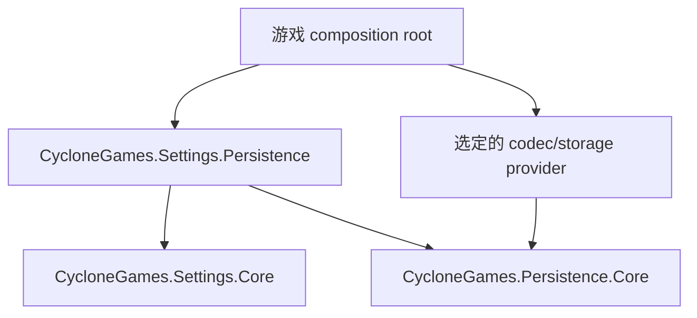
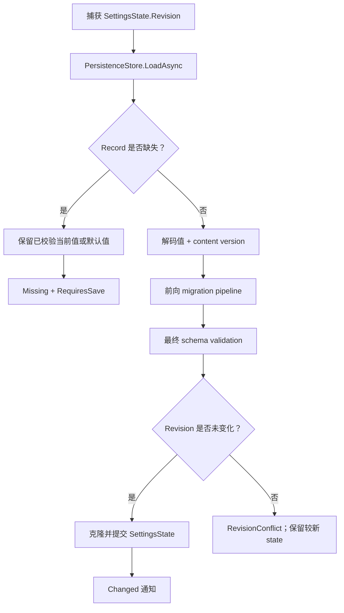

# CycloneGames.Settings.Persistence

[English | 简体中文](README.md)

CycloneGames.Settings.Persistence 在经验证的设置状态（`CycloneGames.Settings`）与有界持久化记录（`CycloneGames.Persistence`）之间搭建桥梁。它唯一的运行时服务 `PersistentSettings<T>` 负责协调加载、迁移、提交、保存和删除。每项职责仍归属其所属包。

## 目录

- [概述](#概述)
- [架构](#架构)
- [快速上手](#快速上手)
- [核心概念](#核心概念)
- [使用指南](#使用指南)
- [进阶主题](#进阶主题)
- [常见场景](#常见场景)
- [性能与内存](#性能与内存)
- [故障排查](#故障排查)

## 概述

`PersistentSettings<T>` 借用构造时注入的三个依赖：

- `SettingsState<T>` —— 权威的内存状态。
- `SettingsMigrationPipeline<T>` —— 从任意受支持版本的前向迁移。
- `PersistenceStore<T>` —— 带字节预算与原子写入行为的版本化存储。

它不拥有这三者中的任何一个，也不拥有任何可释放资源。

### 主要特性

- **显式组合**——调用方创建并保留所有依赖；无隐式 DI。
- **带迁移的加载**——解码、逐版本迁移、校验、提交。
- **Compare-and-commit**——I/O 前捕获 `Revision`；过期的候选值以 `RevisionConflict` 拒绝。
- **支持缺失记录**——已校验默认值已在 state 中；需要显式保存。
- **迁移感知的保存**——`RequiresSave` 标记迁移已执行但未隐式写盘。
- **单请求串行**——重叠操作抛出 `InvalidOperationException`。

## 架构



| 程序集 | 路径 | 用途 |
| --- | --- | --- |
| `CycloneGames.Settings.Persistence` | `Runtime/` | `PersistentSettings<T>` 桥梁。引用 `CycloneGames.Settings.Core` 和 `CycloneGames.Persistence.Core`。`autoReferenced: false`，`noEngineReferences: true`。 |
| `CycloneGames.Settings.Persistence.Tests.Core` | `Tests/Core/` | 集成测试。 |

Settings Core 不引用 Persistence。Persistence Core 不引用 Settings。Codec 和 storage provider 的 concrete type 不出现在本 integration 的 public API 中。

## 快速上手

启动时组合全部依赖：

```csharp
var schema = new GameSettingsSchema();
var migrations = new SettingsMigrationPipeline<GameSettings>(
    schema,
    1,
    new GameSettingsV1ToV2());

var codec = new VYamlPersistenceCodec<GameSettings>(GeneratedResolver.Instance);
IPersistenceStorage storage =
    UnityPersistentStorage.Create("Settings/game-settings.cgp");

var state = new SettingsState<GameSettings>(schema);
var store = new PersistenceStore<GameSettings>(
    storage,
    new PersistenceProfile<GameSettings>(codec));
var settings = new PersistentSettings<GameSettings>(state, migrations, store);

// 启动时加载。
PersistentSettingsLoadResult load = await settings.LoadAsync(ct);

if (load.IsMissing)
{
    await settings.SaveAsync(ct);
}
else if (load.RequiresSave)
{
    await settings.SaveAsync(ct);
}
```

保留 `state` 用于更新和 snapshot，保留 `settings` 用于存储操作。VYaml resolver 必须为 IL2CPP/AOT 显式支持设置模型。本 integration 不执行 resolver discovery。

## 核心概念

### Load 工作流



### Load result 语义

| 状态 | 对 state 的影响 | `RequiresSave` | 说明 |
| --- | --- | --- | --- |
| `Missing` | 不修改 | `true` | 已校验默认值已在 state 中 |
| 当前版本 `Loaded` | 提交已校验克隆 | `false` | Observer 在提交后执行 |
| 迁移后 `Loaded` | 提交迁移值 | `true` | Load 不隐式写盘 |
| Persistence 失败或取消 | 不修改 | `false` | 保留原始 `PersistenceErrorCode` |
| Migration 或 validation 失败 | 不修改 | `false` | 现有 state 保持权威 |
| Load 期间 state 已变化 | 不修改 | `false` | `RevisionConflict`；不覆盖较新 state |

Observer 失败作为成功 loaded result 上的 `ObserverFailureCount` 和 `FirstObserverException` 返回，不会变成 persistence failure，也不会回滚提交。

### Save 与 delete

```csharp
PersistenceOperationResult save = await settings.SaveAsync(ct);
PersistenceOperationResult delete = await settings.DeleteStoredValueAsync(ct);
```

`SaveAsync` 捕获隔离 state snapshot 并以 `SettingsState<T>.CurrentVersion` 保存。`DeleteStoredValueAsync` 仅删除存储记录，不重置内存 state。

## 使用指南

### 单请求串行策略

同一个 `PersistentSettings<T>` 实例同一时间只允许一个 load、save 或 delete。重叠同步抛出 `InvalidOperationException`，不会排队。其依赖也各自拥有 overlap guard。

### State 与 schema 一致性

构造时校验 `state` 与 `migrations` 共享同一个 schema 实例和 `CurrentVersion`。不匹配抛出 `ArgumentException`。

### 取消行为

Migration step 之前和 state compare-and-commit 之前检查取消。Commit 前取消不修改 state。已完成 state commit 不会重新报告为取消。

### 线程

Integration 使用 `Task` 和 `CancellationToken`；内部 await 使用 `ConfigureAwait(false)`。Migration、state commit 和 loaded-state 通知可能在 worker continuation 执行。Core observer 必须能在该线程安全运行。Unity observer 必须先把 snapshot 投递到主线程 dispatcher。

## 进阶主题

### Provider 与平台选择

平台行为由注入的 `IPersistenceStorage` 决定：

| 环境 | 预期 provider |
| --- | --- |
| Windows、Linux、macOS 桌面 | Sandboxed System.IO provider |
| iOS 与 Android | Unity path adapter + 已验证的平台备份/生命周期策略 |
| Dedicated server 或 CLI | 显式 trusted root 的 System.IO provider |
| WebGL | 独立异步 IndexedDB/JavaScript provider |
| 主机平台 | 平台 SDK save-data provider + 认证特定生命周期 |

非 Unity 进程：`SystemFilePersistenceStorage.CreateSandboxed(trustedRoot, relativePath)`。Unity 环境：`UnityPersistentStorage.Create(relativePath)`。

### Codec 互换

MessagePack provider 源码存在但未激活（缺少外部依赖）。启用时仅替换 codec：

```csharp
IPersistenceCodec<GameSettings> codec = messagePackCodec;
```

`PersistentSettings<T>`、schema、migration 和 storage contract 保持不变。

## 常见场景

### 启动加载模式

```csharp
PersistentSettingsLoadResult load = await settings.LoadAsync(ct);

if (load.IsMissing)
{
    // State 持有已校验默认值。显式保存。
    await settings.SaveAsync(ct);
}
else if (!load.Completed)
{
    ReportLoadFailure(load.Error, load.PersistenceError, load.Message, load.Exception);
}
else if (load.RequiresSave)
{
    // 已完成迁移。在安全时机持久化。
    await settings.SaveAsync(ct);
}
```

### 处理 RevisionConflict

```csharp
PersistentSettingsLoadResult load = await settings.LoadAsync(ct);

if (!load.Completed && load.Error == PersistentSettingsLoadError.StateCommitFailed)
{
    // Load 期间另一个 commit 抢先。保留较新 state。
}
```

### 用户触发变更后显式保存

```csharp
SettingsUpdateResult update = state.Update(
    (ref GameSettings candidate) => candidate.Language = selectedLanguage);

if (update.Succeeded)
{
    await settings.SaveAsync(ct);
}
```

## 性能与内存

Load 和 save 属于冷路径。

- Load 在不同阶段持有 decoded model、migration clone 和 state commit clone。
- Save 在序列化前捕获一个 state snapshot。
- `PersistenceStore<T>` 负责 byte budget；schema clone 成本取决于具体模型。
- Migration 执行复杂度与版本步骤数线性相关。
- 不引入反射、Service Locator、全局缓存、轮询或逐帧回调。

## 故障排查

| 现象 | 检查项 |
| --- | --- |
| 构造拒绝 composition | State 与 migration pipeline 必须共享同一个 schema 实例和 `CurrentVersion` |
| Load 返回 `Missing` | 检查 provider location 和平台可用性；state 仍有效 |
| Load 返回 migration failure | 检查 `MinimumSupportedVersion`、完整 `v -> v + 1` 链和最终 validation |
| Load 返回 future-version error | 不要保存 defaults；更新应用或提供显式兼容 reader |
| 出现 observer warning | 独立修复 observer；提交状态已成为权威 |
| Load 返回 `RevisionConflict` | I/O 期间另一个 state commit 抢先；保留较新 state |
| Overlap 抛异常 | 在 composition owner 中串行化生命周期操作 |

## 验证

运行集成测试：

```text
<UnityEditor> -batchmode -nographics -projectPath <repo-root>/UnityStarter -runTests -testPlatform EditMode -assemblyNames CycloneGames.Settings.Persistence.Tests.Core -testResults <result-path> -quit
```

测试覆盖：missing/default 行为、当前版本与迁移后的 load、不隐式写盘的显式 `RequiresSave`、future-version 拒绝、load 前/中取消、validation failure 的状态保护、过期 revision 保护、提交后 observer warning、使用当前版本 metadata 保存、delete 不 reset、operation overlap 与构造 schema/version 不一致拒绝。
