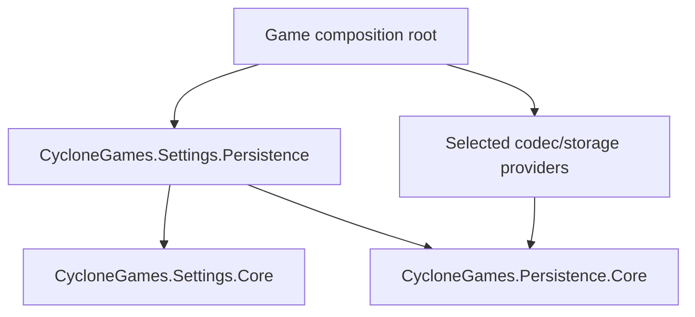
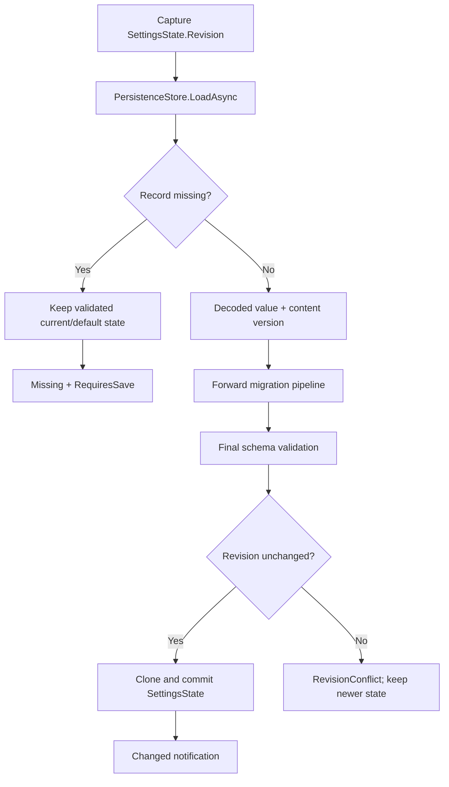

# CycloneGames.Settings.Persistence

[English | 简体中文](README.SCH.md)

CycloneGames.Settings.Persistence bridges validated settings state (`CycloneGames.Settings`) with bounded persistence records (`CycloneGames.Persistence`). Its only runtime service, `PersistentSettings<T>`, coordinates load, migration, commit, save, and delete. Each responsibility stays in its owning package.

## Table of Contents

- [Overview](#overview)
- [Architecture](#architecture)
- [Quick Start](#quick-start)
- [Core Concepts](#core-concepts)
- [Usage Guide](#usage-guide)
- [Advanced Topics](#advanced-topics)
- [Common Scenarios](#common-scenarios)
- [Performance and Memory](#performance-and-memory)
- [Troubleshooting](#troubleshooting)

## Overview

`PersistentSettings<T>` borrows three dependencies supplied at construction:

- `SettingsState<T>` — the authoritative in-memory value.
- `SettingsMigrationPipeline<T>` — forward migration from any supported version.
- `PersistenceStore<T>` — versioned storage with byte budgets and atomic write behavior.

It does not own any of the three. It owns no disposable resource.

### Key features

- **Explicit composition** — the caller creates and retains all dependencies; no implicit DI.
- **Load with migration** — decode, migrate through every version step, validate, and commit.
- **Compare-and-commit** — capture `Revision` before I/O; reject stale candidates with `RevisionConflict`.
- **Missing record support** — validated defaults are already in state; requires explicit save.
- **Migration-aware save** — `RequiresSave` signals that migration was applied without implicit write.
- **One-request-at-a-time** — overlap throws `InvalidOperationException`.

## Architecture



| Assembly | Path | Purpose |
| --- | --- | --- |
| `CycloneGames.Settings.Persistence` | `Runtime/` | `PersistentSettings<T>` bridge. References `CycloneGames.Settings.Core` and `CycloneGames.Persistence.Core`. `autoReferenced: false`, `noEngineReferences: true`. |
| `CycloneGames.Settings.Persistence.Tests.Core` | `Tests/Core/` | Integration tests. |

Settings Core never references Persistence. Persistence Core never references Settings. Codec and storage provider types do not appear in this integration's public API.

## Quick Start

Compose all dependencies at startup:

```csharp
var schema = new GameSettingsSchema();
var migrations = new SettingsMigrationPipeline<GameSettings>(
    schema,
    1,
    new GameSettingsV1ToV2());

var codec = new VYamlPersistenceCodec<GameSettings>(GeneratedResolver.Instance);
IPersistenceStorage storage =
    UnityPersistentStorage.Create("Settings/game-settings.cgp");

var state = new SettingsState<GameSettings>(schema);
var store = new PersistenceStore<GameSettings>(
    storage,
    new PersistenceProfile<GameSettings>(codec));
var settings = new PersistentSettings<GameSettings>(state, migrations, store);

// Load at startup.
PersistentSettingsLoadResult load = await settings.LoadAsync(ct);

if (load.IsMissing)
{
    await settings.SaveAsync(ct);
}
else if (load.RequiresSave)
{
    await settings.SaveAsync(ct);
}
```

Retain `state` for updates/snapshots and `settings` for storage operations. The VYaml resolver must explicitly support the settings model for IL2CPP/AOT. This integration does not perform resolver discovery.

## Core Concepts

### Load workflow



### Load result semantics

| Status | State effect | `RequiresSave` | Notes |
| --- | --- | --- | --- |
| `Missing` | No change | `true` | Validated defaults already in state |
| `Loaded` at current version | Validated clone committed | `false` | Observers run after commit |
| `Loaded` after migration | Migrated value committed | `true` | Load never writes implicitly |
| Persistence failure or cancellation | No change | `false` | Original `PersistenceErrorCode` preserved |
| Migration or validation failure | No change | `false` | Existing state remains authoritative |
| State changed while load pending | No change | `false` | `RevisionConflict`; newer state not overwritten |

Observer failures are returned as `ObserverFailureCount` and `FirstObserverException` on a successful loaded result. They do not become persistence failures and do not roll back the commit.

### Save and delete

```csharp
PersistenceOperationResult save = await settings.SaveAsync(ct);
PersistenceOperationResult delete = await settings.DeleteStoredValueAsync(ct);
```

`SaveAsync` captures an isolated state snapshot and saves it with `SettingsState<T>.CurrentVersion`. `DeleteStoredValueAsync` deletes only the stored record; it does not reset in-memory state.

## Usage Guide

### One-request-at-a-time policy

One `PersistentSettings<T>` instance permits one active load, save, or delete. Overlap throws `InvalidOperationException` synchronously; operations are not queued. Its dependencies have their own overlap guards.

### State and schema consistency

Constructor validates that `state` and `migrations` share the same schema instance and `CurrentVersion`. A mismatch throws `ArgumentException`.

### Cancellation behavior

Cancellation is checked before migration steps and before state compare-and-commit. Cancellation before commit leaves state unchanged. A completed state commit is never reclassified as cancelled.

### Threading

The integration uses `Task` and `CancellationToken`; internal awaits use `ConfigureAwait(false)`. Migration, state commit, and loaded-state notification may run on a worker continuation. Core observers must be safe on that thread. A Unity-bound observer must enqueue its snapshot to the main-thread dispatcher before touching Unity APIs.

## Advanced Topics

### Provider and platform selection

Platform behavior is selected by the injected `IPersistenceStorage`:

| Environment | Expected provider |
| --- | --- |
| Windows, Linux, macOS desktop | Sandboxed System.IO provider |
| iOS and Android | Unity path adapter with verified platform backup/lifecycle policy |
| Dedicated server or CLI | Direct System.IO provider with explicit trusted root |
| WebGL | Separate asynchronous IndexedDB/JavaScript provider |
| Console platforms | Platform SDK save-data provider with certification-specific lifecycle |

For non-Unity: `SystemFilePersistenceStorage.CreateSandboxed(trustedRoot, relativePath)`. For Unity: `UnityPersistentStorage.Create(relativePath)`.

### Codec swapping

MessagePack support is source-present but inactive without its external dependency. When activated, replace only the codec:

```csharp
IPersistenceCodec<GameSettings> codec = messagePackCodec;
```

`PersistentSettings<T>`, schema, migrations, and storage contract remain unchanged.

## Common Scenarios

### Startup load pattern

```csharp
PersistentSettingsLoadResult load = await settings.LoadAsync(ct);

if (load.IsMissing)
{
    // State holds validated defaults. Save explicitly.
    await settings.SaveAsync(ct);
}
else if (!load.Completed)
{
    ReportLoadFailure(load.Error, load.PersistenceError, load.Message, load.Exception);
}
else if (load.RequiresSave)
{
    // Migration applied. Persist at a safe point.
    await settings.SaveAsync(ct);
}
```

### Handling RevisionConflict

```csharp
PersistentSettingsLoadResult load = await settings.LoadAsync(ct);

if (!load.Completed && load.Error == PersistentSettingsLoadError.StateCommitFailed)
{
    // Another commit won during load. Keep the newer state.
}
```

### Explicit save after user-triggered change

```csharp
SettingsUpdateResult update = state.Update(
    (ref GameSettings candidate) => candidate.Language = selectedLanguage);

if (update.Succeeded)
{
    await settings.SaveAsync(ct);
}
```

## Performance and Memory

Load and save are cold-path operations.

- Load holds the decoded model, a migration clone, and a state commit clone at different orchestration stages.
- Save captures one state snapshot before serialization.
- `PersistenceStore<T>` enforces byte budgets; schema clone cost remains model-specific.
- Migration execution is linear in the number of required version steps.
- No reflection, service locator, global cache, polling, or per-frame callback is introduced.

## Troubleshooting

| Symptom | Check |
| --- | --- |
| Constructor rejects composition | State and migration pipeline must share the same schema instance and `CurrentVersion` |
| Load returns `Missing` | Verify provider location and platform availability; state remains valid |
| Load returns migration failure | Verify `MinimumSupportedVersion`, complete `v -> v + 1` chain, and final validation |
| Load returns future-version error | Do not save defaults; update the application or provide an explicit compatible reader |
| Observer warning appears | Fix the observer independently; committed state is already authoritative |
| Load returns `RevisionConflict` | Another state commit won during I/O; keep that newer state |
| Overlap throws | Serialize lifecycle operations in the composition owner |

## Validation

Run integration tests:

```text
<UnityEditor> -batchmode -nographics -projectPath <repo-root>/UnityStarter -runTests -testPlatform EditMode -assemblyNames CycloneGames.Settings.Persistence.Tests.Core -testResults <result-path> -quit
```

Tests cover: missing/default behavior, current and migrated loads, explicit `RequiresSave` without implicit write, future-version rejection, pre/mid-load cancellation, validation failure preservation, stale revision protection, post-commit observer warnings, save with current-version metadata, delete without reset, and operation overlap/constructor mismatch rejection.
