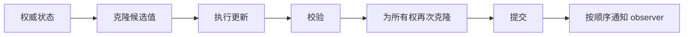

# CycloneGames.Settings

[English | 简体中文](README.md)

CycloneGames.Settings 提供经过校验的内存设置状态，支持显式克隆边界、提交后变更通知以及确定性前向迁移。它是纯 C# 核心，不依赖 `UnityEngine`。本包负责权威值、schema 与迁移路径；持久化交给可选的 `CycloneGames.Settings.Persistence` 适配模块。

## 目录

- [概述](#概述)
- [架构](#架构)
- [快速上手](#快速上手)
- [核心概念](#核心概念)
- [使用指南](#使用指南)
- [进阶主题](#进阶主题)
- [常见场景](#常见场景)
- [性能与内存](#性能与内存)
- [故障排查](#故障排查)

## 概述

设置系统需要回答三个问题：当前权威值是什么、如何校验候选值、以及旧版本如何演进到当前版本。CycloneGames.Settings 用 `SettingsState<T>` 管理所有权、`ISettingsSchema<T>` 定义值契约、`SettingsMigrationPipeline<T>` 处理版本演进。

每次操作——更新、重置或加载——都会克隆当前值、在克隆上应用变更、校验结果、再次克隆以取得权威所有权，然后提交。任何阶段失败都不会改变旧值。提交后向已注册 observer 发送隔离 snapshot 通知。

### 主要特性

- **校验后的状态所有权**：通过 `SettingsState<T>` 实现 clone 隔离的 snapshot 与提交语义。
- **Schema 契约**：通过 `ISettingsSchema<T>` 定义版本、默认值、深拷贝与校验。
- **变更通知**：通过 `SettingsChangedHandler<T>` 在每次提交后交付隔离 snapshot 与变更原因。
- **前向迁移**：通过 `ISettingsMigration<T>` 步骤（每个 `v -> v + 1` 转换）与 `SettingsMigrationPipeline<T>` 完成。
- **强类型结果值**：更新、迁移和加载操作返回带显式 error code 的结果。
- **无并发**——操作由 composition owner 串行化；重叠操作抛出 `InvalidOperationException`。
- **纯 C# 核心**：`noEngineReferences: true`，零运行时依赖。

## 架构

| 程序集 | 路径 | 用途 |
| --- | --- | --- |
| `CycloneGames.Settings.Core` | `Core/` | 状态所有权、schema 契约、迁移管线、result type。`autoReferenced: false`，`noEngineReferences: true`。 |
| `CycloneGames.Settings.Tests.Core` | `Tests/Core/` | EditMode 测试：状态隔离、迁移排序和失败路径。 |

本模块不拥有文件、路径、序列化器或平台适配器。加载和保存通过 `CycloneGames.Persistence.Core` 中的 `PersistenceStore<T>` 契约进行。



## 快速上手

定义 Settings 模型和 schema：

```csharp
using CycloneGames.Settings;

public sealed class AudioSettings
{
    public float MasterVolume;
    public bool Muted;
}

public sealed class AudioSettingsSchema : ISettingsSchema<AudioSettings>
{
    public int CurrentVersion => 1;

    public AudioSettings CreateDefault()
    {
        return new AudioSettings
        {
            MasterVolume = 0.8f,
            Muted = false
        };
    }

    public AudioSettings Clone(in AudioSettings value)
    {
        return new AudioSettings
        {
            MasterVolume = value.MasterVolume,
            Muted = value.Muted
        };
    }

    public SettingsValidationResult Validate(in AudioSettings value)
    {
        if (value == null)
        {
            return SettingsValidationResult.Invalid("Audio settings are required.");
        }

        return value.MasterVolume >= 0f && value.MasterVolume <= 1f
            ? SettingsValidationResult.Valid()
            : SettingsValidationResult.Invalid("Master volume must be between zero and one.");
    }
}
```

创建 state owner、订阅通知、更新候选值：

```csharp
var state = new SettingsState<AudioSettings>(new AudioSettingsSchema());

state.Changed +=
    (in AudioSettings snapshot, SettingsChangeReason reason) =>
    {
        audioMixer.SetFloat("MasterVolume", snapshot.MasterVolume);
    };

SettingsUpdateResult result = state.Update(
    (ref AudioSettings candidate) => candidate.MasterVolume = 0.6f);

if (!result.Succeeded)
{
    ReportSettingsFailure(result.Error, result.Message, result.Exception);
}

AudioSettings isolatedSnapshot = state.Snapshot();
```

## 核心概念

### Schema 契约

`ISettingsSchema<T>` 是 Settings 模型的生命周期契约：

- `CurrentVersion` 在 state 和 migration pipeline 的生命周期内保持稳定。
- `CreateDefault` 返回完整模型。
- `Clone` 产生深拷贝，不得保留或共享属于输入的可变状态。
- `Validate` 是确定性的，不修改输入。
- schema 实现不执行文件 I/O、隐式全局查找或非确定性计算。

默认值无效时，`SettingsState<T>` 构造立即失败——在启动或测试阶段发现。

### 克隆隔离

`SettingsState<T>` 不直接返回权威对象。`Snapshot()` 会调用 schema 的克隆函数。每个 observer 获得独立克隆，因此一个 observer 不能修改状态或另一个 observer 的输入。

对于纯值类型 struct，`Clone` 通常可以直接返回值。若 struct 包含数组、列表、native handle 或可变引用对象，仍需显式深拷贝。

Settings 模型是纯数据，不能拥有 `IDisposable` 资源、unmanaged handle、`UnityEngine.Object` 生命周期或线程亲和状态——clone、迁移、校验失败、取消和替换丢弃候选值时不调用 `Dispose`。

### 更新、重置与加载

```csharp
// 更新隔离候选值。
SettingsUpdateResult update = state.Update(
    (ref AudioSettings candidate) => candidate.MasterVolume = 0.6f);

// 重置为 schema 默认值。
SettingsUpdateResult reset = state.ResetToDefaults();

// 应用外部持久化边界解码的值。
long expectedRevision = state.Revision;
AudioSettings decoded = DecodeFromAnExternalBoundary();
SettingsUpdateResult loaded = state.TryApplyLoaded(in decoded, expectedRevision);
```

`TryApplyLoaded` 是 persistence integration 的 compare-and-commit 入口。它不执行 I/O，也不绕过校验。如果其他提交在加载期间推进了 `Revision`，过期候选值以 `RevisionConflict` 拒绝。

### 通知

通知在提交后同步执行，线程即完成 state 操作的线程。本模块不自动切换到 Unity 主线程。

单个 observer 抛出可恢复异常时：
- 不回滚已提交状态。
- 不阻止后续 observer。
- 通过 `ObserverFailureCount` 和 `FirstObserverException` 报告。
- 不伪装成更新、迁移或持久化失败。

Observer 必须在操作线程上安全执行。异步 persistence integration 提交状态时，该线程可能是 worker continuation。需要操作 Unity 的 observer 必须先把 snapshot 投递到主线程 dispatcher。

Observer 不得在同一个 state 实例上重入调用 `Snapshot`、`Update`、`ResetToDefaults`，也不得重入 add/remove `Changed` 订阅——这些访问会抛出 `InvalidOperationException`。重入的 `TryApplyLoaded` 返回 `RevisionConflict`。

## 使用指南

### 前向迁移

每个 migration 只表示一个 `v -> v + 1` 转换：

```csharp
public sealed class AudioV1ToV2 : ISettingsMigration<AudioSettings>
{
    public int SourceVersion => 1;
    public int TargetVersion => 2;

    public SettingsMigrationResult Apply(ref AudioSettings candidate)
    {
        candidate.MasterVolume = Clamp01(candidate.MasterVolume);
        return SettingsMigrationResult.Success();
    }
}
```

为显式支持版本窗口创建 pipeline：

```csharp
var schema = new AudioSettingsSchemaV2();
var migrations = new SettingsMigrationPipeline<AudioSettings>(
    schema,
    1,
    new AudioV1ToV2());

AudioSettings candidate = decodedValue;
SettingsMigrationPipelineResult migration =
    migrations.Migrate(sourceVersion: 1, ref candidate, cancellationToken);
```

支持窗口存在重复 source、自环、倒退、跳版、缺失步骤、窗口外边或歧义路径时，构造立即失败。Pipeline 在构造时排序一次，迁移成本为 `O(currentVersion - sourceVersion)`，不执行图搜索。

迁移在克隆对象上执行，仅在所有步骤和最终 schema 校验成功后替换调用方 candidate。失败时调用方原始 candidate 保持不变。

`ISettingsMigration<T>` 只能迁移已被 codec 反序列化为 `T` 的数据。结构完全不兼容的历史 payload 需要 version-aware codec 或 persistence 边界上的旧 DTO。

### 并发与失败策略

| 情况 | 行为 |
| --- | --- |
| 默认值无效 | 构造抛出 `InvalidOperationException` |
| 候选值回调抛异常 | 更新失败；旧状态保持权威 |
| 校验失败 | 返回强类型失败；不提交 |
| Observer 抛出可恢复异常 | 提交成功并返回 warning；后续 observer 继续执行 |
| Callback 抛出 fatal exception | 此前的提交生效后向外传播；后续 callback 不保证执行 |
| Source version 不受支持 | 迁移失败；candidate 不变 |
| 过期异步加载候选值 | `RevisionConflict`；较新 state 保持权威 |
| 重叠或重入操作 | `InvalidOperationException` |
| `default` result 值 | 显式表示未初始化；`Message` 仍保证非 null |

State 和 migration pipeline 使用原子 guard 拒绝重叠。它们不是并发容器，也不会排队。Composition owner 串行化操作。

每种 result struct 都公开 `IsInitialized`。`SettingsUpdateError.Uninitialized` 与 `SettingsMigrationError.Uninitialized` 是零值。schema 或 migration 返回 `default` 时判定为契约失败。

## 进阶主题

### Struct 与 class 模型

不含引用对象的纯 struct 可按值克隆，不产生 managed allocation。struct 中包含数组、列表或可变引用对象时，schema 中仍需显式深拷贝。

### 版本稳定 schema

`CurrentVersion` 在 state 和 migration pipeline 生命周期内必须保持稳定。升级版本时创建新 schema 与对应的从旧版本迁移步骤，然后整体替换 state 和 pipeline。

## 常见场景

### 对接 Unity Audio Mixer

```csharp
state.Changed +=
    (in AudioSettings snapshot, SettingsChangeReason reason) =>
    {
        audioMixer.SetFloat("MasterVolume", snapshot.MasterVolume);
    };
```

### 启动时加载持久化设置

```csharp
PersistentSettingsLoadResult load = await settings.LoadAsync(ct);

if (load.IsMissing)
{
    // 已校验默认值已在 state 中。
    await settings.SaveAsync(ct);
}
else if (load.RequiresSave)
{
    // 已完成迁移；持久化当前版本。
    await settings.SaveAsync(ct);
}
```

### 重置为出厂默认值

```csharp
SettingsUpdateResult reset = state.ResetToDefaults();
if (!reset.Succeeded)
{
    // 处理意外的 schema default 失败。
}
```

## 性能与内存

Settings 变更属于冷路径。

- `Snapshot`、更新 candidate、class 模型的提交值和 observer snapshot，按 schema 的克隆实现产生分配。
- 不含引用对象的纯 struct 可按值克隆，不产生 managed allocation。
- Observer 订阅和移除分配替换后的 handler array；通知遍历稳定数组，不调用会分配 invocation list 的路径。
- 通知复杂度为 `O(observerCount)`，为隔离而有意为每个 observer 克隆。
- 不使用反射、运行时代码生成、LINQ、Service Locator、worker thread 或 Unity 对象查找。

## 故障排查

| 现象 | 原因 | 解决方法 |
| --- | --- | --- |
| 构造抛异常 | schema 默认值无效 | 修复 `CreateDefault` 或 `Validate` |
| Update 返回 failure | callback 抛异常、校验拒绝或克隆失败 | 检查 `result.Error`、`result.Message`、`result.Exception` |
| Load 返回 `RevisionConflict` | 异步加载期间另一个 commit 推进了 `Revision` | 保留较新 state；仅产品策略要求时重试 |
| 出现 observer warning | 已注册 observer 抛出可恢复异常 | 修复 observer；state 已提交 |
| 重入操作抛异常 | observer 在通知期间调用了 state 变更方法 | 切换到非重入 dispatch 路径 |
| Migration pipeline 构造被拒绝 | 重复 source、gap、倒退或版本跳越 | 确保每个受支持版本恰好一个 `v -> v + 1` 步骤 |

## 验证

运行 EditMode 测试：

```text
<UnityEditor> -batchmode -nographics -projectPath <repo-root>/UnityStarter -runTests -testPlatform EditMode -assemblyNames CycloneGames.Settings.Tests.Core -testResults <result-path> -quit
```

测试覆盖：无效默认值、class 与 struct 克隆隔离、callback/clone/validation 回滚、提交后 observer warning 与后续执行、reset、带 revision 检查的 loaded commit、过期候选值拒绝、重入拒绝、migration 排序、支持窗口、step 失败和最终 validation。
