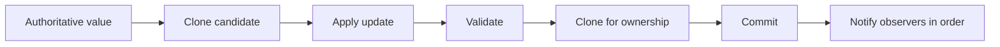

# CycloneGames.Settings

[English | 简体中文](README.SCH.md)

CycloneGames.Settings provides validated in-memory settings state with explicit clone boundaries, post-commit change notifications, and deterministic forward migration. It is a pure C# core with no `UnityEngine` dependency. The package owns the authoritative value, its schema, and its migration path; it delegates persistence to the optional `CycloneGames.Settings.Persistence` adapter.

## Table of Contents

- [Overview](#overview)
- [Architecture](#architecture)
- [Quick Start](#quick-start)
- [Core Concepts](#core-concepts)
- [Usage Guide](#usage-guide)
- [Advanced Topics](#advanced-topics)
- [Common Scenarios](#common-scenarios)
- [Performance and Memory](#performance-and-memory)
- [Troubleshooting](#troubleshooting)

## Overview

A settings system answers three questions: what is the current authoritative value, how is a candidate validated, and how does an older version evolve to the current version. CycloneGames.Settings answers with `SettingsState<T>` for ownership, `ISettingsSchema<T>` for the value contract, and `SettingsMigrationPipeline<T>` for version evolution.

Each operation — update, reset, or load — clones the current value, applies changes to the clone, validates the result, clones again for authoritative ownership, and commits. A failure at any stage leaves the previous value unchanged. Committed values notify registered observers with an isolated snapshot.

### Key features

- **Validated state ownership** through `SettingsState<T>` with clone-isolated snapshots and commit semantics.
- **Schema contract** via `ISettingsSchema<T>` defining version, defaults, deep clone, and validation.
- **Change notifications** via `SettingsChangedHandler<T>` delivering an isolated snapshot and reason after each commit.
- **Forward migration** via `ISettingsMigration<T>` steps (each `v -> v + 1`) and `SettingsMigrationPipeline<T>`.
- **Typed result values** for update, migration, and load operations with explicit error codes.
- **No concurrency** — operations are serialized by the composition owner; overlap throws `InvalidOperationException`.
- **Pure C# core** with `noEngineReferences: true` and zero runtime dependencies.

## Architecture

| Assembly | Path | Purpose |
| --- | --- | --- |
| `CycloneGames.Settings.Core` | `Core/` | State ownership, schema contract, migration pipeline, result types. `autoReferenced: false`, `noEngineReferences: true`. |
| `CycloneGames.Settings.Tests.Core` | `Tests/Core/` | EditMode tests for state isolation, migration ordering, and failure paths. |

The module owns no files, paths, serializers, or platform adapters. Loading and saving happen through the `PersistenceStore<T>` contract in `CycloneGames.Persistence.Core`.



## Quick Start

Define the settings model and its schema:

```csharp
using CycloneGames.Settings;

public sealed class AudioSettings
{
    public float MasterVolume;
    public bool Muted;
}

public sealed class AudioSettingsSchema : ISettingsSchema<AudioSettings>
{
    public int CurrentVersion => 1;

    public AudioSettings CreateDefault()
    {
        return new AudioSettings
        {
            MasterVolume = 0.8f,
            Muted = false
        };
    }

    public AudioSettings Clone(in AudioSettings value)
    {
        return new AudioSettings
        {
            MasterVolume = value.MasterVolume,
            Muted = value.Muted
        };
    }

    public SettingsValidationResult Validate(in AudioSettings value)
    {
        if (value == null)
        {
            return SettingsValidationResult.Invalid("Audio settings are required.");
        }

        return value.MasterVolume >= 0f && value.MasterVolume <= 1f
            ? SettingsValidationResult.Valid()
            : SettingsValidationResult.Invalid("Master volume must be between zero and one.");
    }
}
```

Create the state owner, subscribe, and update:

```csharp
var state = new SettingsState<AudioSettings>(new AudioSettingsSchema());

state.Changed +=
    (in AudioSettings snapshot, SettingsChangeReason reason) =>
    {
        audioMixer.SetFloat("MasterVolume", snapshot.MasterVolume);
    };

SettingsUpdateResult result = state.Update(
    (ref AudioSettings candidate) => candidate.MasterVolume = 0.6f);

if (!result.Succeeded)
{
    ReportSettingsFailure(result.Error, result.Message, result.Exception);
}

AudioSettings isolatedSnapshot = state.Snapshot();
```

## Core Concepts

### Schema contract

`ISettingsSchema<T>` is a lifetime contract for the settings model:

- `CurrentVersion` remains stable for the lifetime of the state and migration pipeline.
- `CreateDefault` returns a complete model.
- `Clone` produces a deep copy; it must not retain or alias mutable state from its input.
- `Validate` is deterministic and does not mutate its input.
- Schema implementations do not perform file I/O, hidden global lookup, or non-deterministic computation.

Invalid defaults fail during `SettingsState<T>` construction — detect this during startup or tests.

### Clone isolation

`SettingsState<T>` never returns its authoritative object directly. `Snapshot()` calls the schema clone function. Each observer receives its own clone, so one observer cannot mutate the state or another observer's input.

For a struct, `Clone` can normally return the value. A struct containing arrays, lists, native handles, or mutable reference objects requires an explicit deep clone.

The settings model is pure data. It must not own `IDisposable` resources, unmanaged handles, `UnityEngine.Object` lifetimes, or thread-affine state — clone, migration, failed validation, cancellation, and replacement discard candidates without calling `Dispose`.

### Update, reset, and load

```csharp
// Update an isolated candidate.
SettingsUpdateResult update = state.Update(
    (ref AudioSettings candidate) => candidate.MasterVolume = 0.6f);

// Reset to schema defaults.
SettingsUpdateResult reset = state.ResetToDefaults();

// Apply a value decoded by an external persistence boundary.
long expectedRevision = state.Revision;
AudioSettings decoded = DecodeFromAnExternalBoundary();
SettingsUpdateResult loaded = state.TryApplyLoaded(in decoded, expectedRevision);
```

`TryApplyLoaded` is a validated compare-and-commit entry point for persistence integrations. It does not perform I/O or bypass validation. If another commit advanced `Revision` during the load, the stale candidate is rejected with `RevisionConflict`.

### Notifications

Notifications run synchronously after commit on the thread that completed the state operation. The module does not marshal to Unity's main thread.

A recoverable observer exception:
- Does not roll back the committed value.
- Does not prevent later observers from running.
- Is reported through `ObserverFailureCount` and `FirstObserverException`.
- Is not reported as an update, migration, or persistence failure.

Observers must be valid on the operation thread. When state is committed by an async persistence integration, that thread may be a worker continuation. A Unity-bound observer must enqueue its snapshot to the main-thread dispatcher before touching Unity APIs.

Observers must not call `Snapshot`, `Update`, `ResetToDefaults`, or add/remove `Changed` subscriptions reentrantly on the same state instance — those throw `InvalidOperationException`. Reentrant `TryApplyLoaded` returns `RevisionConflict`.

## Usage Guide

### Forward migration

Each migration represents exactly one `v -> v + 1` transition:

```csharp
public sealed class AudioV1ToV2 : ISettingsMigration<AudioSettings>
{
    public int SourceVersion => 1;
    public int TargetVersion => 2;

    public SettingsMigrationResult Apply(ref AudioSettings candidate)
    {
        candidate.MasterVolume = Clamp01(candidate.MasterVolume);
        return SettingsMigrationResult.Success();
    }
}
```

Create a pipeline for an explicit supported version window:

```csharp
var schema = new AudioSettingsSchemaV2();
var migrations = new SettingsMigrationPipeline<AudioSettings>(
    schema,
    1,
    new AudioV1ToV2());

AudioSettings candidate = decodedValue;
SettingsMigrationPipelineResult migration =
    migrations.Migrate(sourceVersion: 1, ref candidate, cancellationToken);
```

Construction fails when the window contains a duplicate source, self-loop, backward edge, version jump, missing step, out-of-window edge, or ambiguous route. The pipeline orders steps once during construction. Migration cost is `O(currentVersion - sourceVersion)` with no graph search during execution.

Migration operates on a clone and assigns the caller's candidate only after every step and final schema validation succeeds. A failure leaves the caller's original candidate unchanged. The pipeline checks cancellation before cloning, between steps, and before publishing the result.

`ISettingsMigration<T>` can migrate only data that the codec can already deserialize into `T`. A structurally incompatible historic payload requires a version-aware codec or an old DTO at the persistence boundary.

### Concurrency and failure policy

| Situation | Behavior |
| --- | --- |
| Invalid defaults | Constructor throws `InvalidOperationException` |
| Candidate callback throws | Update fails; old state remains authoritative |
| Validation fails | Typed failure returned; no commit |
| Recoverable observer exception | Commit succeeds with warning; later observers still run |
| Fatal callback exception | Propagates after any prior commit; later callbacks not guaranteed |
| Unsupported source version | Migration fails; candidate unchanged |
| Stale async loaded candidate | `RevisionConflict`; newer state remains authoritative |
| Overlapping or reentrant operation | `InvalidOperationException` |
| `default` result value | Explicitly uninitialized; `Message` remains non-null |

The state and migration pipeline use a small atomic guard to reject overlap. They are not concurrent collections and do not queue work. The composition owner serializes operations.

Every result struct exposes `IsInitialized`. `SettingsUpdateError.Uninitialized` and `SettingsMigrationError.Uninitialized` are the zero values. A schema or migration returning `default` is rejected as a contract failure.

## Advanced Topics

### Struct vs class models

Struct-only models without referenced objects can clone by value without managed allocation. A struct containing arrays, lists, or mutable reference objects still requires an explicit deep clone implementation in the schema.

### Version-stable schemas

`CurrentVersion` must remain stable for the lifetime of the state and migration pipeline. Bump the version by creating a new schema alongside a migration step from the old version. Replace the state and pipeline together.

## Common Scenarios

### Integrating with Unity's audio mixer

```csharp
state.Changed +=
    (in AudioSettings snapshot, SettingsChangeReason reason) =>
    {
        audioMixer.SetFloat("MasterVolume", snapshot.MasterVolume);
    };
```

### Loading persisted settings at startup

```csharp
PersistentSettingsLoadResult load = await settings.LoadAsync(ct);

if (load.IsMissing)
{
    // Validated defaults are already in state.
    await settings.SaveAsync(ct);
}
else if (load.RequiresSave)
{
    // Migration applied; persist the current version.
    await settings.SaveAsync(ct);
}
```

### Resetting to shipping defaults

```csharp
SettingsUpdateResult reset = state.ResetToDefaults();
if (!reset.Succeeded)
{
    // Handle unexpected schema default failure.
}
```

## Performance and Memory

Settings changes are cold-path operations.

- `Snapshot`, update candidates, committed class values, and observer snapshots allocate according to the schema's clone implementation.
- Struct-only models without referenced objects can clone by value without managed allocation.
- Observer subscription and removal allocate a replacement handler array; notification iterates the stable array without allocating an invocation list.
- Notification is `O(observerCount)` and clones per observer for isolation.
- No reflection, runtime code generation, LINQ, service location, worker thread, or Unity object lookup is used.

## Troubleshooting

| Symptom | Cause | Resolution |
| --- | --- | --- |
| Constructor throws | Invalid defaults from schema | Fix `CreateDefault` or `Validate` |
| Update returns failure | Callback threw, validation rejected, or clone failed | Check `result.Error`, `result.Message`, `result.Exception` |
| `RevisionConflict` on load | Another commit advanced `Revision` during async load | Keep the newer state; retry only if product policy requires it |
| Observer warning | A registered observer threw a recoverable exception | Fix the observer; state is already committed |
| Reentrant operation throws | Observer called state mutation during notification | Marshal to a non-reentrant dispatch path |
| Migration pipeline rejects construction | Duplicate source, gap, backward step, or version jump | Ensure exactly one `v -> v + 1` step per supported version |

## Validation

Run EditMode tests:

```text
<UnityEditor> -batchmode -nographics -projectPath <repo-root>/UnityStarter -runTests -testPlatform EditMode -assemblyNames CycloneGames.Settings.Tests.Core -testResults <result-path> -quit
```

Tests cover: invalid defaults, class and struct clone isolation, callback/clone/validation rollback, post-commit observer warnings and continuation, reset, revision-checked loaded commits, stale-candidate rejection, reentrancy rejection, migration ordering, supported windows, step failure, and final validation.
