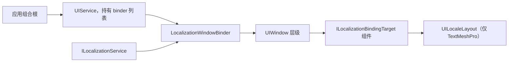

# CycloneGames.UIFramework.Localization

[English | 简体中文](README.md)

CycloneGames.UIFramework.Localization 是可选的 companion 模块，负责把 [CycloneGames.Localization](../CycloneGames.Localization/README.SCH.md) 绑定到 [CycloneGames.UIFramework](../CycloneGames.UIFramework/README.SCH.md) 的窗口上。它为窗口提供事务性、窗口作用域的本地化绑定，并在 TextMeshPro 可用时额外提供按语言区分的布局快照。

两个包都不依赖本模块。`CycloneGames.UIFramework` 在没有 `CycloneGames.Localization` 时照样编译，`CycloneGames.Localization` 在没有 `CycloneGames.UIFramework` 时也照样编译。本模块是二者唯一的交汇点。

## 目录

- [CycloneGames.UIFramework.Localization](#cyclonegamesuiframeworklocalization)
  - [目录](#目录)
  - [概述](#概述)
  - [核心类型](#核心类型)
  - [快速上手](#快速上手)
  - [本地化后端](#本地化后端)
  - [文本后端](#文本后端)
  - [TextMeshPro 分层](#textmeshpro-分层)
  - [线程与生命周期](#线程与生命周期)
  - [移除](#移除)
  - [故障排查](#故障排查)

## 概述

`LocalizationWindowBinder` 是一个 `IUIWindowBinder`。它对已实例化的窗口层级只扫描一次，按层级顺序绑定所有 `ILocalizationBindingTarget`，任一绑定失败时按逆序回滚，窗口关闭时同样按逆序解绑。绑定完成后语言切换不会重新扫描层级，已绑定的目标自行响应语言变更。

`UILocaleLayout` 是一个 `ILocalizationBindingTarget`，它把按语言区分的几何与排版快照存放在预制体旁，并在提交的语言变更时应用。因为 `TrackedElement.Text` 是 `TMP_Text`，它依赖 TextMeshPro。详见[本地化界面布局](Documents~/LocalizedLayouts.SCH.md)。



## 核心类型

| 类型 | 程序集 | 职责 |
| --- | --- | --- |
| `LocalizationWindowBinder` | Runtime | `IUIWindowBinder`，绑定窗口层级内所有 `ILocalizationBindingTarget` |
| `UILocaleLayout` | Runtime TextMeshPro | `MonoBehaviour` 兼 `ILocalizationBindingTarget`，应用按语言的布局快照 |
| `TrackedElement` | Runtime TextMeshPro | 单个被追踪的 RectTransform、文本或布局组 |
| `ElementSnapshot` | Runtime TextMeshPro | 单个被追踪元素在某语言下的捕获值 |
| `LocaleSnapshot` | Runtime TextMeshPro | 某语言下的全部元素快照 |
| `UIFrameworkLocalizationLog` | Runtime | 绑定诊断使用的内部日志门面 |
| `UIFrameworkLocalizationEditorLog` | Editor | 本地化编辑工具使用的内部日志门面 |

## 快速上手

在 Unity 主线程上创建 binder，并把它传给 `UIService`。本地化服务不必已经初始化，详见[线程与生命周期](#线程与生命周期)。

```csharp
using System;
using System.Threading;
using Cysharp.Threading.Tasks;
using CycloneGames.Localization.Runtime;
using CycloneGames.UIFramework.Runtime;
using CycloneGames.UIFramework.Runtime.Integrations.Localization;
using UnityEngine;

public sealed class GameUiBootstrap : MonoBehaviour
{
    [SerializeField] private UIRoot uiRoot;
    [SerializeField] private UIWindowConfiguration startupWindow;

    private IUIService _ui;

    private async UniTask RunAsync(
        ILocalizationService localization,
        CancellationToken lifetimeToken)
    {
        IUIWindowBinder[] binders = { new LocalizationWindowBinder(localization) };

        _ui = new UIService(uiRoot, options: null, binders: binders);
        await _ui.OpenAsync(startupWindow, cancellationToken: lifetimeToken);
    }
}
```

`LocalizationWindowBinder` 还接受一个可选的 `IAssetPackage`。当本地化资源需要通过指定包解析、而不是走默认包时传入。

不由 `UIService` 管理的独立 Canvas 可以改由产品层组合根直接绑定 `UILocaleLayout`，这条路径不需要窗口 binder。

## 本地化后端

本模块消费 `CycloneGames.Localization.Core` 中的窄契约 `ILocalizationProvider`，从不引用
`CycloneGames.Localization.Runtime`。因此替换本地化后端的项目不会把 CycloneGames 的实现拖进自己的程序集图。

| 契约 | 程序集 | Unity 类型 | 承载内容 |
| --- | --- | --- | --- |
| `ILocalizationProvider` | `CycloneGames.Localization.Core` | 无 | 语言状态、变更通知、按字符串寻址的文本查询 |
| `ILocalizationService` | `CycloneGames.Localization.Runtime` | `ScriptableObject`、`Object`、`AssetRef` | 上述全部，外加生命周期、可序列化键结构、本地化资产与 catalog |

`ILocalizationService` 继承自 `ILocalizationProvider`，因此原本把 CycloneGames 服务交给本模块的代码无需改动即可继续编译。

改用 I2 Localization 或 Unity 官方 Localization 包时，实现 `ILocalizationProvider` 并传给
`LocalizationWindowBinder` 即可，本模块其余部分无需改动。需要后端专属能力的组件会对拿到的 provider 做收窄，
并在其不是 `ILocalizationService` 时抛出明确错误：`LocalizeTMPText` 绑定可序列化的 `LocalizedString` 键，
`LocalizeImage` 解析本地化资产。

## 文本后端

一个项目完全可能同时存在多种文本组件技术。Unity 2023.2 与 Unity 6 上，TextMeshPro 被内置进 `com.unity.ugui`，无法移除；因此引入 UniText 这类第三方文本方案并不是替换 TextMeshPro，而是与之共存。

本模块把它拆成三个独立切片，而不是抽一层统一抽象：

| 切片 | 检测方式 | 缺失时的行为 |
| --- | --- | --- |
| 核心绑定（`LocalizationWindowBinder`） | 恒定编译 | 不适用 |
| TextMeshPro 布局（`UILocaleLayout`） | 对 TextMeshPro 包配置 `versionDefines` | 程序集被排除，预制体快照数据不再加载 |
| 其它文本后端 | 每种后端一个 companion 程序集 | 程序集被排除，对其余部分无影响 |

每个切片拥有自己的程序集和自己的 `versionDefines` 规则，启用某个后端不会改变另一个后端的编译方式。不要在核心程序集里引入统一的文本抽象：TextMeshPro 暴露可写的 `fontSize`、对齐与样式属性，而 UniText 的 `fontSize` 是 `protected`、对齐字段是 `private`，所以「写这些属性」的公共接口无法在两者上都诚实实现。后端专属组件留在后端专属程序集里。

另外，UniText 通过 `IUniTextResolver.TryResolve` 解析文本，该回调可能在 worker 线程上执行。从该回调触碰 UniText 组件前必须先切回主线程。

## TextMeshPro 分层

`TrackedElement.Text` 是 `TMP_Text`，因此 `UILocaleLayout` 位于独立程序集中，TextMeshPro 不可用时该程序集被整体排除。不含 TMP 的程序集不持有任何编译期 TextMeshPro 依赖，所以 `LocalizationWindowBinder` 在所有 Unity 版本上都能继续绑定图片、音频和自定义目标。

| Unity 分支 | TextMeshPro 的提供方式 | 宏来源 |
| --- | --- | --- |
| Unity 2022 LTS 及更早 | 独立的 `com.unity.textmeshpro` 包 | 第一条 `versionDefines` 规则 |
| Unity 2023.2 与 Unity 6（6000.0+） | 内置于 `com.unity.ugui` 2.0.0 | 第二条 `versionDefines` 规则 |

不要把 `CYCLONEGAMES_HAS_TEXTMESHPRO` 加进 Player Settings。陈旧的手写宏会在没有 TextMeshPro 的情况下强制编译，直接把构建打挂。

## 线程与生命周期

构造、绑定与释放都限制在 Unity 主线程。binder 会捕获自己的属主线程，并拒绝来自其它线程的调用。组件发现每个窗口实例只做一次，语言切换不会重新扫描层级。

binder 不要求本地化服务已经初始化。服务尚未初始化时，窗口照常打开，绑定会订阅 `ILocalizationService.Changed`，并在服务上报 `LocalizationChangeReason.Initialized` 时立即完成绑定。这样组合根可以无条件注册 binder，而不必把它排在资源目录加载之后。若窗口在初始化完成之前就关闭，它永远不会绑定，也不会泄漏订阅。请在主线程上初始化服务，否则绑定会保持挂起并记录一条错误，而不是从非属主线程去改组件。

binder 参与 `UIService` 的开启事务。任一目标绑定失败时，已创建的绑定按逆序释放，开启操作整体中止。窗口关闭同样按逆序释放。

## 移除

删除模块目录；在 `Packages/` 布局的项目里则是移除对应的 manifest 条目。两个宿主包都会继续编译。曾经挂过 `UILocaleLayout` 的预制体和场景会报 missing script，其序列化快照数据不再被加载。移除前先备份这些资产。

## 故障排查

| 现象 | 原因 | 处理 |
| --- | --- | --- |
| `CS0234: The type or namespace name 'Localization' does not exist in the namespace 'CycloneGames'` | 没有安装 `CycloneGames.Localization` | 安装 `CycloneGames.Localization`，或移除本模块 |
| `CS0012: The type 'IAssetPackage' is defined in an assembly that is not referenced` | 调用方构造 `LocalizationBindingContext` 但没有引用 `CycloneGames.AssetManagement.Runtime` | 补上该引用；可选构造参数会强制要求它 |
| `CS0122: 'UIFrameworkLocalizationEditorLog' is inaccessible` | Editor 的 TextMeshPro 切片看不到内部日志门面 | 保留为该程序集声明 `InternalsVisibleTo` 的 `AssemblyInfo.cs` |
| `UILocaleLayout` 报 missing script | TextMeshPro 切片被排除了 | 安装 TextMeshPro；Unity 6 上确认 uGUI 为 2.0.0 或更高 |
| 窗口打开了，但文本一直是创作语言 | 开窗时本地化服务尚未初始化 | 这是预期行为：绑定会在 `Initialized` 时生效。若一直没有生效，确认 `ILocalizationService.Initialize` 是否在主线程执行 |
| `InvalidOperationException: LocalizationWindowBinder must be created on the Unity main thread` | binder 在非主线程上被构造 | 在主线程启动流程里构造，不要放在 worker 任务中 |
