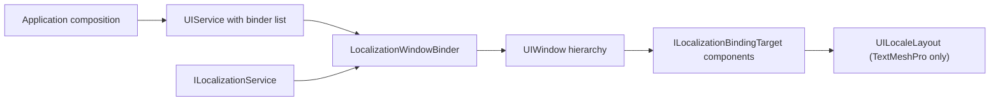

# CycloneGames.UIFramework.Localization

[English | 简体中文](README.SCH.md)

CycloneGames.UIFramework.Localization is an optional companion module that binds [CycloneGames.Localization](../CycloneGames.Localization/README.md) to [CycloneGames.UIFramework](../CycloneGames.UIFramework/README.md) windows. It gives a window a transactional, window-scoped localization binding and, when TextMeshPro is available, adds per-locale layout snapshots.

Neither package depends on this module. `CycloneGames.UIFramework` compiles without `CycloneGames.Localization`, and `CycloneGames.Localization` compiles without `CycloneGames.UIFramework`. This module is the only place where the two meet.

## Table of Contents

- [CycloneGames.UIFramework.Localization](#cyclonegamesuiframeworklocalization)
  - [Table of Contents](#table-of-contents)
  - [Overview](#overview)
  - [Core Types](#core-types)
  - [Quick Start](#quick-start)
  - [Localization Backends](#localization-backends)
  - [Text Backends](#text-backends)
  - [TextMeshPro Layering](#textmeshpro-layering)
  - [Threading and Lifecycle](#threading-and-lifecycle)
  - [Removal](#removal)
  - [Troubleshooting](#troubleshooting)

## Overview

`LocalizationWindowBinder` is an `IUIWindowBinder`. It scans the instantiated window hierarchy once, binds every `ILocalizationBindingTarget` in hierarchy order, rolls back in reverse order if any bind fails, and unbinds in reverse order when the window closes. The binder never rescans on locale change; already-bound targets observe the locale change themselves.

`UILocaleLayout` is an `ILocalizationBindingTarget` that stores per-locale geometry and typography snapshots next to a prefab and applies them when the committed locale changes. It requires TextMeshPro because `TrackedElement.Text` is a `TMP_Text`. See [Localized UI Layouts](Documents~/LocalizedLayouts.md).



## Core Types

| Type | Assembly | Role |
| --- | --- | --- |
| `LocalizationWindowBinder` | Runtime | `IUIWindowBinder` that binds every `ILocalizationBindingTarget` in a window hierarchy |
| `UILocaleLayout` | Runtime TextMeshPro | `MonoBehaviour` and `ILocalizationBindingTarget` applying per-locale layout snapshots |
| `TrackedElement` | Runtime TextMeshPro | One tracked RectTransform, text, or layout group |
| `ElementSnapshot` | Runtime TextMeshPro | Per-locale captured value for one tracked element |
| `LocaleSnapshot` | Runtime TextMeshPro | All element snapshots for one locale |
| `UIFrameworkLocalizationLog` | Runtime | Internal log facade for binding diagnostics |
| `UIFrameworkLocalizationEditorLog` | Editor | Internal log facade for localization authoring tooling |

## Quick Start

Create the binder on the Unity main thread and pass it to `UIService`. The localization service does not have to be initialized yet; see [Threading and Lifecycle](#threading-and-lifecycle).

```csharp
using System;
using System.Threading;
using Cysharp.Threading.Tasks;
using CycloneGames.Localization.Runtime;
using CycloneGames.UIFramework.Runtime;
using CycloneGames.UIFramework.Runtime.Integrations.Localization;
using UnityEngine;

public sealed class GameUiBootstrap : MonoBehaviour
{
    [SerializeField] private UIRoot uiRoot;
    [SerializeField] private UIWindowConfiguration startupWindow;

    private IUIService _ui;

    private async UniTask RunAsync(
        ILocalizationService localization,
        CancellationToken lifetimeToken)
    {
        IUIWindowBinder[] binders = { new LocalizationWindowBinder(localization) };

        _ui = new UIService(uiRoot, options: null, binders: binders);
        await _ui.OpenAsync(startupWindow, cancellationToken: lifetimeToken);
    }
}
```

`LocalizationWindowBinder` also accepts an optional `IAssetPackage`. Pass one when localized assets should resolve through a specific package instead of the default.

Standalone canvases that are not managed by `UIService` can bind `UILocaleLayout` from the product composition root instead. The window binder is not required for that path.

## Localization Backends

The module consumes the narrow, backend-agnostic contract `ILocalizationProvider` from
`CycloneGames.Localization.Core`. It never references `CycloneGames.Localization.Runtime`, so a project
that swaps the localization backend does not drag the CycloneGames implementation into its assembly graph.

| Contract | Assembly | Unity types | What it carries |
| --- | --- | --- | --- |
| `ILocalizationProvider` | `CycloneGames.Localization.Core` | none | Locale state, change notification, string-addressed text lookup |
| `ILocalizationService` | `CycloneGames.Localization.Runtime` | `ScriptableObject`, `Object`, `AssetRef` | All of the above plus lifecycle, serializable key structs, localized assets, and catalogs |

`ILocalizationService` derives from `ILocalizationProvider`, so code that already hands a CycloneGames
service to this module keeps compiling unchanged.

To use I2 Localization or the Unity Localization package instead, implement `ILocalizationProvider` and
pass it to `LocalizationWindowBinder`; nothing else in this module has to change. Components that need
backend-specific capabilities narrow the provider they are handed and fail with an explicit error when it
is not an `ILocalizationService`: `LocalizeTMPText` binds the serializable `LocalizedString` key, and
`LocalizeImage` resolves localized assets.

## Text Backends

A project can end up with more than one text component technology at the same time. On Unity 2023.2 and Unity 6, TextMeshPro ships inside `com.unity.ugui` and cannot be removed, so adding a third-party text solution such as UniText does not replace TextMeshPro — it coexists with it.

The module treats this as three separate slices rather than one abstraction:

| Slice | Detection | Behaviour when absent |
| --- | --- | --- |
| Core binding (`LocalizationWindowBinder`) | Always compiled | Not applicable |
| TextMeshPro layout (`UILocaleLayout`) | `versionDefines` on the TextMeshPro package | Assembly excluded; prefab snapshot data is not loaded |
| Additional text backends | One companion assembly per backend | Assembly excluded; no effect on the rest |

Each slice owns its own assembly and its own `versionDefines` rule, so enabling one backend never changes how another compiles. Do not introduce a shared text abstraction in the core assembly: TextMeshPro exposes writable `fontSize`, `alignment`, and style properties, while UniText keeps `fontSize` protected and its alignment fields private, so a common "write these properties" interface cannot be implemented honestly on both. Backend-specific components stay in backend-specific assemblies.

UniText additionally resolves text through `IUniTextResolver.TryResolve`, which may run on a worker thread. Anything that touches a UniText component from that callback must marshal back to the main thread first.

## TextMeshPro Layering

`TrackedElement.Text` is a `TMP_Text`, so `UILocaleLayout` lives in a separate assembly that is excluded when TextMeshPro is unavailable. The TMP-free assembly keeps no compile-time TextMeshPro dependency, so `LocalizationWindowBinder` keeps binding images, audio, and custom targets on every Unity version.

| Unity branch | How TextMeshPro ships | Symbol source |
| --- | --- | --- |
| Unity 2022 LTS and earlier | Standalone `com.unity.textmeshpro` package | First `versionDefines` rule |
| Unity 2023.2 and Unity 6 (6000.0+) | Inside `com.unity.ugui` 2.0.0 | Second `versionDefines` rule |

Never add `CYCLONEGAMES_HAS_TEXTMESHPRO` to Player Settings. A stale manual symbol forces compilation without TextMeshPro and fails the build.

## Threading and Lifecycle

Construction, binding, and disposal are confined to the Unity main thread. The binder captures its owner thread and rejects use from another thread. Component discovery happens once per window instance; locale changes do not rescan the hierarchy.

The binder does not require the localization service to be initialized. When the service is not yet initialized, the window still opens and the binding subscribes to `ILocalizationService.Changed`; it binds its targets as soon as the service reports `LocalizationChangeReason.Initialized`. This lets a composition root register the binder unconditionally instead of sequencing it behind catalog loading. A window that closes before initialization completes never binds and does not leak its subscription. Initialize the service from the main thread, otherwise the binding stays pending and logs an error instead of mutating components from a foreign thread.

The binder participates in the `UIService` open transaction. If any target fails to bind, already-created bindings are disposed in reverse order and the open aborts. Window closure disposes in reverse order as well.

## Removal

Delete the module folder, or remove its manifest entry in a `Packages/` project. Both host packages keep compiling. Prefabs and scenes that carried a `UILocaleLayout` report a missing script, and their serialized snapshot data is no longer loaded. Back those assets up before removing the module.

## Troubleshooting

| Symptom | Cause | Fix |
| --- | --- | --- |
| `CS0234: The type or namespace name 'Localization' does not exist in the namespace 'CycloneGames'` | `CycloneGames.Localization` is not installed | Install `CycloneGames.Localization`, or remove this module |
| `CS0012: The type 'IAssetPackage' is defined in an assembly that is not referenced` | A consumer constructs `LocalizationBindingContext` without referencing `CycloneGames.AssetManagement.Runtime` | Add the reference; the optional constructor parameter forces it |
| `CS0122: 'UIFrameworkLocalizationEditorLog' is inaccessible` | The editor TextMeshPro slice cannot see the internal facade | Keep `AssemblyInfo.cs` with `InternalsVisibleTo` for that assembly |
| `UILocaleLayout` reports a missing script | The TextMeshPro slice was excluded | Install TextMeshPro, or on Unity 6 confirm uGUI is 2.0.0 or newer |
| A window opens but its text stays in the authored language | The localization service had not initialized when the window opened | Expected: the binding applies on `Initialized`. If it never does, confirm `ILocalizationService.Initialize` runs on the main thread |
| `InvalidOperationException: LocalizationWindowBinder must be created on the Unity main thread` | The binder was constructed off the main thread | Construct it during main-thread bootstrap, not inside a worker task |
