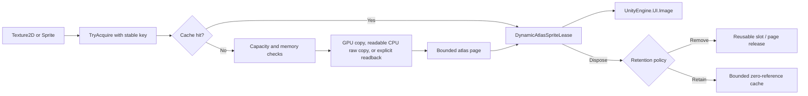

# 动态 UI 图集

[English](DynamicAtlas.md) | 简体中文

动态 UI 图集将运行时 UI Sprite 组合到数量有界的共享纹理中。它为无法全部放入构建期 `SpriteAtlas` 的兼容 `Image` 元素减少纹理切换，并提供显式 Sprite Lease 与有界的页面、条目和内存预算。

## 目录

- [概述](#概述)
- [核心概念](#核心概念)
- [使用指南](#使用指南)
- [进阶主题](#进阶主题)
- [故障排查](#故障排查)

## 概述

`DynamicAtlasService` 将运行时 UI 纹理打包进有界的非压缩 `RGBA32` 页面。它适用于运行时下载的图标、Live Service 图片、需要在运行时共享页面的多源图集 Sprite，以及生命周期和稳定内容 key 明确的有限图标集合。

### 主要特性

- **有界页面**：显式 `pageSize`、`maxPages`、`maxEntries` 与 `memoryBudgetBytes` 上限。
- **显式 Lease**：`DynamicAtlasSpriteLease` 持有每个条目一个引用；Dispose 幂等。
- **GPU 优先复制**：格式匹配时通过 `Graphics.CopyTexture` 写入 GPU-only 页面；可读 CPU raw copy 与显式同步 Readback 作为可选 fallback。
- **稳定 key**：ordinal、区分大小写、带命名空间、长度有界的 key。
- **Retention 策略**：`RemoveWhenUnused` 或 `RetainUntilCapacityPressure`，配合 `TrimUnused`。
- **平台 Profile**：通过 `CreateForCurrentPlatform` 提供 Desktop High、Mobile High、Mobile Low 与 WebGL 起始 Profile。

更少的图集页可能改善 Canvas 合批；使用 Unity Profiler 与 Frame Debugger 在每个目标设备上测量完整 UI。内容在构建时已确定时优先使用构建期 `SpriteAtlas`。

### 快速上手

使用稳定且带命名空间的 key。在一个 Service 生命周期内，相同 key 始终表示同一份逻辑内容。

```csharp
using CycloneGames.UIFramework.DynamicAtlas;
using UnityEngine;
using UnityEngine.UI;

public sealed class InventoryIcon : MonoBehaviour
{
    [SerializeField] private Image image;
    [SerializeField] private Sprite sourceSprite;

    private DynamicAtlasService atlas;
    private DynamicAtlasSpriteLease iconLease;

    private void Awake()
    {
        DynamicAtlasConfig config = DynamicAtlasConfig.CreateForCurrentPlatform(
            preferLowMemoryProfile: true);
        atlas = new DynamicAtlasService(config);
    }

    private void OnEnable()
    {
        DynamicAtlasInsertStatus status = atlas.TryAcquireSprite(
            "inventory/icons/iron-sword",
            sourceSprite,
            out iconLease);

        if (status == DynamicAtlasInsertStatus.Success ||
            status == DynamicAtlasInsertStatus.CacheHit)
        {
            image.sprite = iconLease.Sprite;
        }
    }

    private void OnDisable()
    {
        image.sprite = null;
        iconLease?.Dispose();
        iconLease = null;
    }

    private void OnDestroy()
    {
        atlas?.Dispose();
        atlas = null;
    }
}
```

一个 Service 通常服务于一个 UI scope、一组 Scene 或应用生命周期。不要为每个图标创建一个 Service。

## 核心概念

### 所有权模型

`DynamicAtlasService` 拥有生成的 `Sprite` 与图集页 `Texture2D`。创建、调用和 Dispose 必须位于同一个 Unity 主线程。直接传入源纹理时由调用方拥有；Service 不会销毁调用方提供的 `Texture2D` 或 `Sprite`。

`DynamicAtlasSpriteLease` 持有一个条目引用。Dispose Lease 会精确释放一个引用。重复 Dispose 安全，`Clear()` 或 Service Dispose 后再 Dispose Lease 也安全。



### 稳定 key 与重复获取

Key 使用 ordinal、区分大小写的比较方式。Key 不得为空，长度不得超过 `maxKeyLength`。推荐的 key 形式：`inventory/icons/iron-sword`、`liveops/season-12/reward/0042`、`ugc/user-7f21/emblem/content-hash`。不要使用 `GetInstanceID()`、运行时对象 identity、本地化显示名或可变列表位置生成持久 key。

Key 已存在时，获取操作返回缓存 Sprite 并增加引用计数，不会再次复制传入的源内容。使用同一 key 传入不同内容不会替换现有条目。

### Retention 策略

`RemoveWhenUnused` 在引用计数归零时立即销毁条目，slot 进入可复用状态。页面为空且页面数量超过 `minRetainedPages` 时页面被销毁。

`RetainUntilCapacityPressure` 让零引用条目继续保留在缓存中，再次获取时不需要重新复制像素。容量不足时最久未使用的零引用条目最先被驱逐；活跃条目绝不会被驱逐。可在明确的内存压力边界、Scene 切换或应用进入后台时调用 `TrimUnused()`。

Service 不会搬迁活跃 Sprite，搬迁会让 `Image.sprite` 引用失效。使用 `TrimUnused()` 移除零引用条目并回收空页面，不移动活跃条目。

## 使用指南

### 获取 API

| API | 来源 | 说明 |
| --- | --- | --- |
| `TryAcquire(key, texture, out lease)` | 完整 `Texture2D` | 使用配置中的默认 pivot 和 pixels-per-unit |
| `TryAcquireRegion(key, texture, rect, out lease)` | 像素对齐的 `RectInt` | 拒绝越界或空区域 |
| `TryAcquireSprite(key, sprite, out lease)` | `Sprite` | 保留 pivot、border 和 pixels-per-unit |
| `TryAcquireLocation(location, out lease)` | 显式同步 loader | Loader 与 unloader 构成一组所有权契约；缓存未命中且未提供该组合时返回 `LoaderUnavailable` |
| `TryAcquireCached(key, out lease)` | 已存在的缓存条目 | 不加载也不插入内容 |

`TryAcquireSprite` 接受矩形未旋转的 Sprite 几何。如果打包 Sprite 启用了 rotation 或 Tight Packing，或打包后矩形改变了逻辑 Sprite 尺寸，操作会被拒绝。源 `SpriteAtlas` 应关闭 rotation 与 Tight Packing。

Location 获取不会隐式回退到 `Resources.Load`。必须在 Service 构造前同时提供两个 delegate。

```csharp
DynamicAtlasConfig config = DynamicAtlasConfig.CreateForCurrentPlatform(
    loadFunc: LoadTextureSynchronously,
    unloadFunc: ReleaseLoadedTexture);

using var atlas = new DynamicAtlasService(config);
DynamicAtlasInsertStatus status = atlas.TryAcquireLocation(
    "liveops/icons/reward-0042",
    out DynamicAtlasSpriteLease lease);
```

### 容量与内存配置

| 字段 | 用途 |
| --- | --- |
| `pageSize` | 每个图集页的 2 次幂宽高 |
| `maxPages` | 页面数量硬上限 |
| `minRetainedPages` | 为可预测 churn 保留的空页面数量 |
| `maxEntries` | 活跃条目与保留条目的总数硬上限 |
| `maxEntriesPerPage` | 单页 metadata 与 packing 数量硬上限 |
| `maxKeyLength` | 不可信或远程 key 的输入长度上限 |
| `memoryBudgetBytes` | 页面纹理 CPU 与 GPU 副本的组合估算预算 |
| `padding` | 条目每一侧的透明间距 |
| `enableBleed` | 为双线性采样把一个边缘像素复制到 padding |
| `oversizePolicy` | 拒绝或显式缩放超过页面的内容 |
| `copyFallback` | 选择仅 GPU、可读 CPU raw-copy 或显式同步 Readback 权限 |

无参配置采用有界的 GPU-first 基线：1024 像素页面、最多两个页面、512 个条目，以及 16 MiB 最坏情况页面纹理预算。只有在目标 workload 已具有实测插入时间与内存预算后，才应选择更大的 Profile。

`EstimatedTextureBytes` 覆盖活跃图集页的纹理副本以及 Play Mode 中等待 Unity 延迟销毁的页面；`PendingDestructionBytes` 单独报告延迟销毁部分。Metadata、生成的 `Sprite`、源资源与临时纹理分配由独立边界约束。

### 批量插入

CPU-backed 插入默认在每个条目后上传可读页面。`BeginBatch()` 延迟上传直到最外层 Batch 被 Dispose。

```csharp
using (DynamicAtlasWriteBatch batch = atlas.BeginBatch())
{
    atlas.TryAcquire("shop/icon/001", textureA, out DynamicAtlasSpriteLease first);
    atlas.TryAcquire("shop/icon/002", textureB, out DynamicAtlasSpriteLease second);

    activeLeases.Add(first);
    activeLeases.Add(second);
}
```

Batch 支持嵌套。最外层 `Dispose()` 会 Flush 缓冲区。外层 Batch Dispose 前不要渲染刚插入的 CPU-backed Sprite。

### Borrowed low-GC 查询

`TryGetSprite(key, out sprite)` 执行 ordinal Dictionary 查询，不增加引用计数。返回结果属于 borrowed reference；capacity-pressure eviction、`TrimUnused()`、`Clear()` 或 Service Dispose 都可能使其失效。不要跨另一图集操作或下一帧缓存。消费者需要保存 Sprite 时，必须通过 `TryAcquireCached` 或其他获取 API 获得 Lease。

```csharp
private readonly List<DynamicAtlasPageSnapshot> pages = new(8);
private readonly List<DynamicAtlasEntrySnapshot> entries = new(256);

atlas.CopyPageSnapshots(pages);
atlas.CopyEntrySnapshots(entries);
```

### Service、场景 Host 与 DI

```csharp
DynamicAtlasConfig config = DynamicAtlasConfig.CreateForCurrentPlatform();
var atlas = new DynamicAtlasService(config);
```

DI 容器拥有同一生命周期时，可注册 `IDynamicAtlas` 或 `DynamicAtlasService`。Dispose 必须在 Unity 主线程执行。

`DynamicAtlasManager` 是可选场景 Host。启用 `autoInitialize` 时在 `Awake` 创建自己拥有的 Service。`SetService(service, takeOwnership)` 支持外部 Composition Root。读取 `Service` 不会隐式初始化。独立 UI Context 需要不同预算与生命周期时，可以使用多个 Manager。

端到端示例位于 `Samples/DynamicAtlasLeaseSample.cs` —— 自包含组件，使用 512 像素单页与 2 MiB 纹理预算，在 Enable 时获取一个 Sprite，在 Disable 时释放 Lease，并在 Destroy 时 Dispose 自己拥有的 Service。设置步骤见 [Samples/README.SCH.md](../Samples/README.SCH.md)。

## 进阶主题

### 复制路径

每个页面的复制模式在创建后保持不变，避免 CPU 整页上传覆盖只写入 GPU 的内容。

**GPU-only 页面** —— 源与目标解析为相同 `GraphicsFormat` 且支持 `CopyTextureSupport.Basic` 时，`Graphics.CopyTexture` 直接写入 GPU-only 页面。页面初始化完成后会释放 CPU 副本。

**CPU-backed 页面** —— `AllowCpuRawCopy` 允许使用可读页面并读取与目标 `GraphicsFormat` 完全一致的可读源。`AllowSynchronousReadback` 还允许在无法 raw copy 时使用临时 RenderTexture 与 `ReadPixels`。同步 Readback 可能阻塞渲染线程；`DynamicAtlasStats.SynchronousReadbackCount` 会显示使用次数。

**目标格式** —— 运行时页面支持 `RGBA32`。运行时压缩 block packing 不受支持。需要压缩页面存储时使用构建期 `SpriteAtlas`。

### ScaleDown

`ScaleDown` 最多会按页面内容尺寸创建一个临时 RenderTexture 和一个临时可读纹理。该策略默认关闭，并要求 `AllowSynchronousReadback`。生成 Sprite 的 border 会按比例缩放，pixels-per-unit 也乘以相同比例，在降低像素分辨率的同时保持逻辑 UI 尺寸。

### 平台 Profile

`CreateForCurrentPlatform()` 会为已识别的桌面、移动端与 WebGL Target 选择以下有界 Profile。未知平台族会取得无参兼容基线。

| Profile | 页面 | 页面数 | 条目数 | 纹理估算预算 | Fallback |
| --- | ---: | ---: | ---: | ---: | --- |
| `DesktopHighEnd` | 2048 | 4 | 4096 | 64 MiB | 仅 GPU |
| `MobileHighEnd` | 2048 | 2 | 2048 | 32 MiB | 仅 GPU |
| `MobileLowEnd` | 1024 | 2 | 768 | 16 MiB 最坏情况 | GPU 优先；允许 readable CPU raw copy |
| `WebGL` | 1024 | 2 | 512 | 20 MiB | 允许 CPU raw copy；拒绝同步 Readback |

Service 构造时会在活跃设备上验证页面尺寸与目标纹理格式；源与目标 `GraphicsFormat` 是否一致以及 `CopyTexture` 支持情况，会在插入选择复制路径时解析。主机平台与未列出硬件档位应根据目标设备实测预算构建显式配置。

### 诊断

`GetStats()` 返回值类型快照，包含页面、条目、保留条目与活跃引用数量；payload、reserved 与 total pixel area；活跃页面与待销毁页面的纹理估算字节数与配置预算；cache hit、miss、insert、eviction 与 rejection 数量；以及 GPU copy、CPU raw copy 与同步 Readback 次数。

Play Mode 下通过 `Tools > CycloneGames > UI Framework > Dynamic Atlas Debugger` 检查活跃 Service。每个 Service 的条目快照上限为 4096。通过 `Tools > CycloneGames > UI Framework > SpriteAtlas Compatibility Validator` 检查源图集 packing、readable 状态与各平台导入格式。Validator 不会改写资产。

### 持久化与安全

模块不写入文件、偏好设置、缓存或资产。所有页面与 metadata 都位于当前进程，随 Service 销毁。远程 location 与 key 均为不可信输入。创建 `Texture2D` 前必须限制 key 长度、解码后尺寸、条目数量、下载大小与插入频率。移除条目会销毁生成的 `Sprite` 并释放 packing metadata，但不会清零保留页面中的对应像素。

## 故障排查

| 现象 | 可能原因 | 解决方法 |
| --- | --- | --- |
| `InvalidKey` | Key 为空或超过 `maxKeyLength` | 获取前拒绝或规范化输入 |
| `InvalidSource` | 源纹理或加载结果为空 | 保留当前 UI placeholder |
| `InvalidRegion` | 像素区域或 Sprite metadata 无效 | 修正 authoring 或请求数据 |
| `OversizedSource` | 内容超过页面容量 | 预处理尺寸，或显式启用 `ScaleDown` |
| `LoaderUnavailable` | `TryAcquireLocation` 缓存未命中且没有显式 loader/unloader pair | 同时配置两个 delegate，或改用直接源获取 |
| `UnsupportedSpritePacking` | 存在 rotation、Tight Packing 或 trimmed geometry | 修改源图集 packing |
| `EntryCapacityReached` | 所有条目都处于活跃状态 | 增加经过测量的限制，或拆分所有权 scope |
| `PageCapacityReached` | 页面无法容纳内容 | 释放内容或调整经过测量的页面限制 |
| `MemoryBudgetReached` | 新页面会超过纹理预算 | Trim、释放，或调整经过测量的预算 |
| `CopyUnsupported` | GPU Copy 不可用且 fallback 关闭 | 提供匹配格式，或启用 fallback |
| `CopyFailed` | 图形操作失败 | 保留 placeholder 并记录诊断 |
| `Disposed` | Service 生命周期已结束 | 停止调用并修正生命周期顺序 |
| Borrowed sprite 在帧之间失效 | `TryGetSprite` 结果未受 Lease 保护 | 使用 `TryAcquireCached` 或其他获取 API |
| 同步 Readback 阻塞渲染线程 | 热路径使用了 `AllowSynchronousReadback` | 准备匹配的非压缩源变体 |

不要每帧重试容量失败。应使用 backoff，或等待 Release/Trim 边界改变状态。
