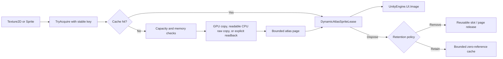

# Dynamic UI Atlas

[English | 简体中文](DynamicAtlas.SCH.md)

The Dynamic UI Atlas groups runtime UI sprites onto a bounded set of shared textures. It reduces texture switches for compatible `Image` elements that cannot be fully packed into build-time `SpriteAtlas` assets, with explicit sprite leases and bounded page, entry, and memory budgets.

## Table of Contents

- [Overview](#overview)
- [Core Concepts](#core-concepts)
- [Usage Guide](#usage-guide)
- [Advanced Topics](#advanced-topics)
- [Troubleshooting](#troubleshooting)

## Overview

`DynamicAtlasService` packs runtime UI textures into bounded uncompressed `RGBA32` pages. It targets runtime-downloaded icons, live-service images, sprites from multiple source atlases that must share a runtime page, and bounded icon sets with predictable lifetime and stable content keys.

### Key Features

- **Bounded pages**: explicit `pageSize`, `maxPages`, `maxEntries`, and `memoryBudgetBytes` limits.
- **Explicit leases**: `DynamicAtlasSpriteLease` owns one reference per entry; disposal is idempotent.
- **GPU-first copy**: `Graphics.CopyTexture` into GPU-only pages when formats match; readable CPU raw copy and explicit synchronous readback as opt-in fallbacks.
- **Stable keys**: ordinal, case-sensitive, namespaced keys with a bounded length.
- **Retention policies**: `RemoveWhenUnused` or `RetainUntilCapacityPressure` with `TrimUnused`.
- **Platform profiles**: Desktop High, Mobile High, Mobile Low, and WebGL starting profiles via `CreateForCurrentPlatform`.

A lower page count can improve Canvas batching; measure the complete UI on each target device with the Unity Profiler and Frame Debugger. Prefer a build-time `SpriteAtlas` when all content is known during the build.

### Quick Start

Use a stable, namespaced key. The same key always identifies the same logical content for the lifetime of a service.

```csharp
using CycloneGames.UIFramework.DynamicAtlas;
using UnityEngine;
using UnityEngine.UI;

public sealed class InventoryIcon : MonoBehaviour
{
    [SerializeField] private Image image;
    [SerializeField] private Sprite sourceSprite;

    private DynamicAtlasService atlas;
    private DynamicAtlasSpriteLease iconLease;

    private void Awake()
    {
        DynamicAtlasConfig config = DynamicAtlasConfig.CreateForCurrentPlatform(
            preferLowMemoryProfile: true);
        atlas = new DynamicAtlasService(config);
    }

    private void OnEnable()
    {
        DynamicAtlasInsertStatus status = atlas.TryAcquireSprite(
            "inventory/icons/iron-sword",
            sourceSprite,
            out iconLease);

        if (status == DynamicAtlasInsertStatus.Success ||
            status == DynamicAtlasInsertStatus.CacheHit)
        {
            image.sprite = iconLease.Sprite;
        }
    }

    private void OnDisable()
    {
        image.sprite = null;
        iconLease?.Dispose();
        iconLease = null;
    }

    private void OnDestroy()
    {
        atlas?.Dispose();
        atlas = null;
    }
}
```

One service normally serves a UI scope, scene group, or application lifetime. Do not create one service per icon.

## Core Concepts

### Ownership model

`DynamicAtlasService` owns generated `Sprite` and page `Texture2D` objects. It must be created, used, and disposed on the same Unity main thread. Source textures are caller-owned when passed directly; the service never destroys a caller-provided `Texture2D` or `Sprite`.

`DynamicAtlasSpriteLease` owns one reference to an entry. Disposing the lease releases exactly one reference. Double disposal is safe, and disposal after `Clear()` or service disposal is also safe.



### Stable keys and duplicate acquisition

Keys use ordinal, case-sensitive comparison. They must be non-empty and no longer than `maxKeyLength`. Recommended key shapes: `inventory/icons/iron-sword`, `liveops/season-12/reward/0042`, `ugc/user-7f21/emblem/content-hash`. Do not derive persistent keys from `GetInstanceID()`, runtime object identity, localized display names, or mutable list positions.

When a key already exists, acquisition returns the cached sprite and increments its reference count. The supplied source is not copied again, and supplying different content with the same key does not replace the entry.

### Retention policies

`RemoveWhenUnused` destroys an entry when its reference count reaches zero; the slot becomes reusable. An empty page is destroyed when the page count exceeds `minRetainedPages`.

`RetainUntilCapacityPressure` keeps a zero-reference entry cached so reacquisition returns it without copying pixels. When capacity is needed, the least-recently-used zero-reference entry is evicted first. Active entries are never evicted. Call `TrimUnused()` at explicit memory-pressure boundaries, scene transitions, or application backgrounding.

The service does not relocate active sprites. Relocation would invalidate `Image.sprite` references. Use `TrimUnused()` to remove zero-reference entries and reclaim empty pages without moving active entries.

## Usage Guide

### Acquisition APIs

| API | Source | Notes |
| --- | --- | --- |
| `TryAcquire(key, texture, out lease)` | Full `Texture2D` | Uses the configured default pivot and pixels-per-unit |
| `TryAcquireRegion(key, texture, rect, out lease)` | Pixel-aligned `RectInt` | Rejects out-of-range and empty regions |
| `TryAcquireSprite(key, sprite, out lease)` | `Sprite` | Preserves pivot, border, and pixels-per-unit |
| `TryAcquireLocation(location, out lease)` | Explicit synchronous loader | Loader and unloader form one ownership pair; a cache miss returns `LoaderUnavailable` when the pair is absent |
| `TryAcquireCached(key, out lease)` | Existing cache entry | Does not load or insert content |

`TryAcquireSprite` accepts rectangular, non-rotated sprite geometry. A packed sprite is rejected when rotation or Tight Packing is enabled, or when its packed rectangle changes the logical sprite dimensions. Configure source `SpriteAtlas` assets with rotation and Tight Packing disabled.

Location acquisition never falls back to `Resources.Load`. Supply both delegates before service construction.

```csharp
DynamicAtlasConfig config = DynamicAtlasConfig.CreateForCurrentPlatform(
    loadFunc: LoadTextureSynchronously,
    unloadFunc: ReleaseLoadedTexture);

using var atlas = new DynamicAtlasService(config);
DynamicAtlasInsertStatus status = atlas.TryAcquireLocation(
    "liveops/icons/reward-0042",
    out DynamicAtlasSpriteLease lease);
```

### Capacity and memory configuration

| Field | Purpose |
| --- | --- |
| `pageSize` | Power-of-two width and height of each page |
| `maxPages` | Hard page-count limit |
| `minRetainedPages` | Empty pages retained for predictable churn |
| `maxEntries` | Hard active-plus-retained entry limit |
| `maxEntriesPerPage` | Hard metadata and packing limit for one page |
| `maxKeyLength` | Input bound for untrusted or remote keys |
| `memoryBudgetBytes` | Estimated combined CPU and GPU page-texture budget |
| `padding` | Transparent separation on every side of an entry |
| `enableBleed` | Copies one edge pixel into padding for bilinear filtering |
| `oversizePolicy` | Rejects or explicitly scales content larger than a page |
| `copyFallback` | Selects GPU-only, readable CPU raw-copy, or explicit synchronous-readback permission |

The serializable no-argument configuration is a bounded GPU-first baseline: 1024-pixel pages, at most two pages, 512 entries, and a 16 MiB worst-case page-texture budget. Choose a larger profile only after the target workload has a measured insertion-time and memory budget.

`EstimatedTextureBytes` covers active atlas page texture copies and Play Mode pages waiting for Unity's delayed destruction. `PendingDestructionBytes` reports the delayed-destruction portion. Metadata, generated `Sprite` objects, source assets, and temporary texture allocations are controlled by separate bounds.

### Batch insertion

CPU-backed insertion normally uploads the readable page after each entry. `BeginBatch()` defers uploads until the outer batch is disposed.

```csharp
using (DynamicAtlasWriteBatch batch = atlas.BeginBatch())
{
    atlas.TryAcquire("shop/icon/001", textureA, out DynamicAtlasSpriteLease first);
    atlas.TryAcquire("shop/icon/002", textureB, out DynamicAtlasSpriteLease second);

    activeLeases.Add(first);
    activeLeases.Add(second);
}
```

Batches can be nested. The outermost `Dispose()` flushes pending uploads. Do not render newly inserted CPU-backed sprites before the outer batch is disposed.

### Borrowed low-GC queries

`TryGetSprite(key, out sprite)` performs an ordinal dictionary lookup without incrementing the reference count. The result is borrowed and can be invalidated by capacity-pressure eviction, `TrimUnused()`, `Clear()`, or service disposal. Do not cache it across another atlas operation or frame. Use `TryAcquireCached` or another acquisition API to obtain a lease when a consumer stores the sprite.

```csharp
private readonly List<DynamicAtlasPageSnapshot> pages = new(8);
private readonly List<DynamicAtlasEntrySnapshot> entries = new(256);

atlas.CopyPageSnapshots(pages);
atlas.CopyEntrySnapshots(entries);
```

### Service, scene host, and DI

```csharp
DynamicAtlasConfig config = DynamicAtlasConfig.CreateForCurrentPlatform();
var atlas = new DynamicAtlasService(config);
```

Register `IDynamicAtlas` or `DynamicAtlasService` in a DI container when the container owns the same lifetime. Disposal must occur on the Unity main thread.

`DynamicAtlasManager` is an optional scene host. It creates an owned service during `Awake` when `autoInitialize` is enabled. `SetService(service, takeOwnership)` supports an external composition root. Reading `Service` never initializes it implicitly. Multiple managers are allowed when separate UI contexts require separate budgets and lifetimes.

An end-to-end sample is at `Samples/DynamicAtlasLeaseSample.cs` — a self-contained component with a 512-pixel, one-page, 2 MiB texture budget that acquires a sprite on enable, releases on disable, and disposes on destroy. See [Samples/README.md](../Samples/README.md) for setup instructions.

## Advanced Topics

### Copy paths

Pages have one immutable copy mode so CPU uploads cannot overwrite content inserted only on the GPU.

**GPU-only page** — when the source and destination resolve to the same `GraphicsFormat` and `CopyTextureSupport.Basic` is available, `Graphics.CopyTexture` writes directly into a GPU-only page. The page releases its CPU copy after initialization.

**CPU-backed page** — `AllowCpuRawCopy` permits readable pages and row-copy from a readable source with the exact destination `GraphicsFormat`. `AllowSynchronousReadback` additionally permits a temporary render texture and `ReadPixels`. Synchronous readback can stall the render thread; `DynamicAtlasStats.SynchronousReadbackCount` exposes its use.

**Destination format** — `RGBA32` is the supported runtime page destination. Runtime compressed block packing is not supported. Use build-time `SpriteAtlas` compression when compressed page storage is required.

### ScaleDown

`ScaleDown` can allocate a temporary render texture and a temporary readable texture up to the page content size. It is disabled by default and requires `AllowSynchronousReadback`. The generated border is scaled and pixels-per-unit is multiplied by the same scale, preserving the sprite's logical UI size while reducing pixel resolution.

### Platform profiles

`CreateForCurrentPlatform()` selects one of the bounded profiles below for recognized desktop, mobile, and WebGL targets. Unknown platform families receive the no-argument compatibility baseline.

| Profile | Page | Pages | Entries | Estimated texture budget | Fallback |
| --- | ---: | ---: | ---: | ---: | --- |
| `DesktopHighEnd` | 2048 | 4 | 4096 | 64 MiB | GPU only |
| `MobileHighEnd` | 2048 | 2 | 2048 | 32 MiB | GPU only |
| `MobileLowEnd` | 1024 | 2 | 768 | 16 MiB worst case | GPU first; readable CPU raw copy allowed |
| `WebGL` | 1024 | 2 | 512 | 20 MiB | CPU raw copy allowed; synchronous readback rejected |

Service construction validates the page size and destination texture format on the active device. Source/destination `GraphicsFormat` equality and `CopyTexture` support are resolved when an insertion selects its copy path. For consoles and unlisted hardware tiers, construct an explicit configuration from measured target-device budgets.

### Diagnostics

`GetStats()` returns a value-type snapshot containing page, entry, retained-entry, and active-reference counts; payload, reserved, and total pixel areas; estimated active-plus-pending-destruction page texture bytes and configured budget; cache hits, misses, insertions, evictions, and rejections; and GPU copy, CPU raw copy, and synchronous readback counts.

Open `Tools > CycloneGames > UI Framework > Dynamic Atlas Debugger` during Play Mode to inspect active services. Entry snapshots are bounded to 4,096 entries per service. Open `Tools > CycloneGames > UI Framework > SpriteAtlas Compatibility Validator` to inspect source atlas packing, readability, and platform import formats. The validator never rewrites assets.

### Persistence and security

The module does not write files, preferences, caches, or assets. All pages and metadata are process-local and destroyed with the service. Treat remote locations and keys as untrusted input. Bound key length, decoded dimensions, item counts, download size, and insertion frequency before creating a `Texture2D`. Removing an entry destroys its generated `Sprite` and releases packing metadata but does not zero the corresponding pixels inside a retained page.

## Troubleshooting

| Symptom | Likely cause | Resolution |
| --- | --- | --- |
| `InvalidKey` | Key empty or exceeds `maxKeyLength` | Reject or normalize input before acquisition |
| `InvalidSource` | Source or loaded texture is null | Keep the current UI placeholder |
| `InvalidRegion` | Pixel region or sprite metadata invalid | Correct authoring or request data |
| `OversizedSource` | Content exceeds page capacity | Pre-size content or explicitly enable `ScaleDown` |
| `LoaderUnavailable` | `TryAcquireLocation` missed the cache without a loader/unloader pair | Configure both delegates or use direct source acquisition |
| `UnsupportedSpritePacking` | Rotation, Tight Packing, or trimmed geometry present | Change source atlas packing |
| `EntryCapacityReached` | All entry slots are active | Increase a measured limit or split ownership scopes |
| `PageCapacityReached` | No page can fit the content | Release content or revise measured page limits |
| `MemoryBudgetReached` | Another page exceeds the configured texture budget | Trim, release, or revise the measured budget |
| `CopyUnsupported` | GPU copy unavailable and fallback disabled | Provide a matching source format or enable fallback |
| `CopyFailed` | The graphics operation failed | Preserve a placeholder and record diagnostics |
| `Disposed` | Service lifetime has ended | Stop the caller and correct lifecycle ordering |
| Borrowed sprite invalidated between frames | `TryGetSprite` result not protected by a lease | Use `TryAcquireCached` or another acquisition API |
| Synchronous readback stalls the render thread | `AllowSynchronousReadback` path used on a hot path | Prepare matching uncompressed source variants |

Do not retry capacity failures every frame. Apply backoff or wait until a release/trim boundary changes the state.
