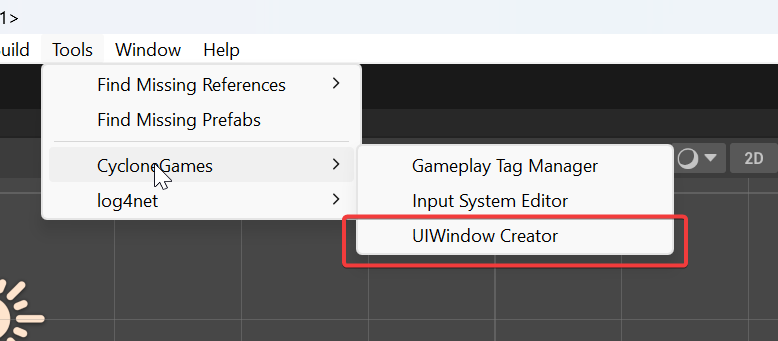
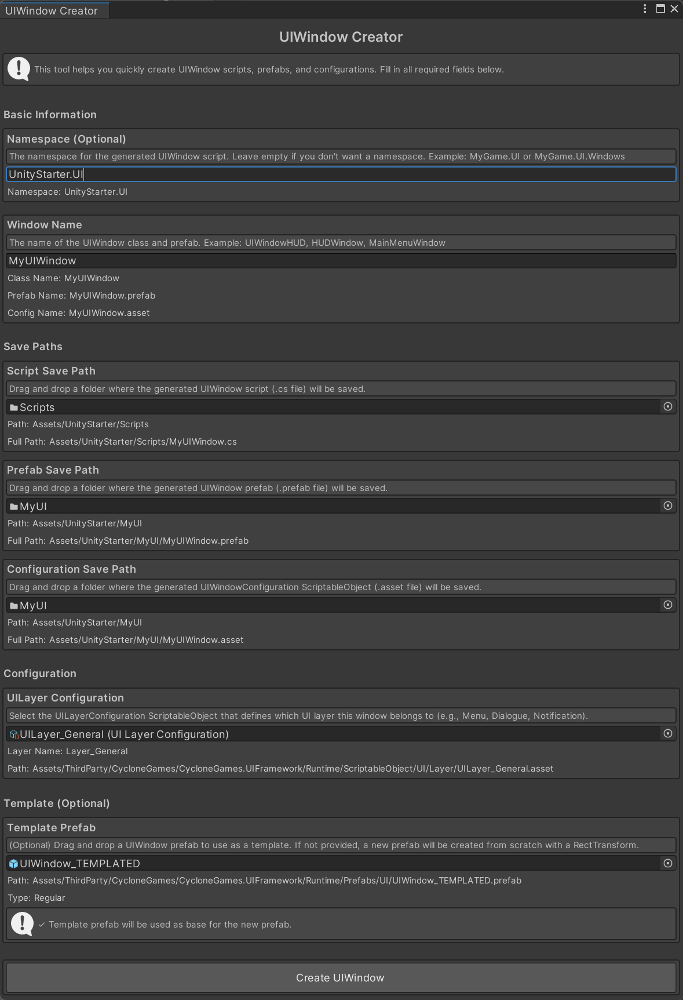

# CycloneGames.UIFramework

<div align="left"><a href="./README.md">English</a> | 简体中文</div>

一个为 Unity 设计的简洁、健壮且数据驱动的 UI 框架，旨在实现可扩展性和易用性。它为管理 UI 窗口、层级和过渡动画提供了清晰的架构，并利用了异步加载和解耦的动画系统。

## 特性

- **原生异步**: 所有资源加载和实例化操作都使用 `UniTask` 完全异步执行，确保流畅、无阻塞的用户体验。
- **数据驱动**: 使用 `ScriptableObject` 资产配置窗口和层级，以实现最大的灵活性和设计师友好性。
- **健壮的状态管理**: 通过正式的状态机管理每个 `UIWindow` 的生命周期，防止常见的错误和竞态条件。
- **可扩展的动画系统**: 轻松为窗口创建和分配自定义的过渡动画。
- **面向服务的架构**: 与 `AssetManagement`, `Factory`, `Logger` 等其他服务无缝集成，接口编程可以完美兼容各 DI/IoC 框架。
- **注重性能**: 包含预制体缓存、实例化节流和动态图集系统等功能，以保持高性能。

## 核心架构

该框架由几个关键组件构建而成，它们协同工作，提供了一套全面的 UI 管理解决方案。

### 1. `UIService` (门面)

这是与 UI 系统交互的主要公共 API。游戏逻辑代码应通过 `UIService` 来打开和关闭窗口，从而将底层的复杂性抽象出来。它作为一个清晰的入口点，并负责 `UIManager` 的初始化。

### 2. `UIManager` (核心)

一个持久化的单例，负责协调整个 UI 的生命周期。其职责包括：

- **异步加载**: 使用 `CycloneGames.AssetManagement` 异步加载 `UIWindowConfiguration` 和 UI 预制体。
- **生命周期管理**: 管理 `UIWindow` 实例的创建、销毁和状态转换。
- **资源缓存**: 实现了一个 LRU (最近最少使用) 缓存来存储 UI 预制体，以优化重开常用窗口时的性能。
- **实例化节流**: 限制每帧实例化的 UI 元素数量，以防止性能峰值。

### 3. `UIRoot` & `UILayer` (场景层级)

- **`UIRoot`**: 场景中必需的组件，作为所有 UI 元素的根节点。它包含 UI 相机并管理所有的 `UILayer`。
- **`UILayer`**: 代表一个独立的渲染和输入层级（例如 `Menu`, `Dialogue`, `Notification`）。窗口被添加到特定的层级中，由层级控制其排序顺序和分组。`UILayer` 通过 `ScriptableObject` 资产进行配置。

### 4. `UIWindow` (UI 单元)

所有 UI 面板、页面或弹窗的基类。每个 `UIWindow` 都是一个自包含的组件，拥有自己的行为和生命周期，由一个健壮的状态机管理：

- **`Opening`**: 窗口正在被创建，其打开过渡动画正在播放。
- **`Opened`**: 窗口完全可见并可交互。
- **`Closing`**: 窗口的关闭过渡动画正在播放。
- **`Closed`**: 窗口已隐藏并准备被销毁。

### 5. `UIWindowConfiguration` (数据驱动配置)

一个 `ScriptableObject`，用于定义 `UIWindow` 的属性。这种数据驱动的方法将配置与代码解耦，使设计师能够轻松修改 UI 行为而无需接触脚本。关键属性包括：

- 需要实例化的 UI 预制体。
- 窗口所属的 `UILayer`。

### 6. `IUIWindowTransitionDriver` (解耦的动画)

一个接口，定义了窗口在打开和关闭时的动画方式。这个强大的抽象允许您使用任何动画系统（如 Unity Animator, LitMotion, DOTween）来实现过渡逻辑，并将其应用于窗口，而无需修改其核心逻辑。

## 依赖项

- `com.cysharp.unitask`
- `com.cyclone-games.assetmanagement`
- `com.cyclone-games.factory`
- `com.cyclone-games.logger`
- `com.cyclone-games.service`

## 快速上手指南

本指南将逐步引导您设置和使用 UIFramework。跟随步骤创建您的第一个 UI 窗口！

### 步骤 1: 场景设置

1. **定位 UIFramework 预制体**: 在包中找到 `UIFramework.prefab`，路径为 `Runtime/Prefabs/UI/UIFramework.prefab`。
2. **添加到场景**: 您可以：
   - 直接将预制体拖入场景，或
   - 使用资源管理系统在运行时加载它
3. **验证设置**: 预制体包含：
   - 带有 UI 相机的 `UIRoot` 组件
   - 默认的 `UILayer` 配置（菜单、对话、通知等）

`UIFramework.prefab` 已预配置了必要的组件，因此您可以立即开始使用。

### 步骤 2: 创建 `UILayer` 配置

`UILayer` 配置定义了 UI 窗口的渲染和输入层级。框架提供了几个默认层级，但您可以创建自定义的。

1. **创建新的层级配置**:

   - 在项目窗口中，右键单击并选择 **Create > CycloneGames > UIFramework > UILayer Configuration**
   - 为其指定一个描述性的名称，例如 `UILayer_Menu`、`UILayer_Dialogue`、`UILayer_Notification`

2. **配置层级**:

   - 在 Inspector 中打开 `UILayerConfiguration` 资产
   - 设置 `Layer Name`（例如 "Menu"、"Dialogue"）
   - 如果需要，调整 `Sorting Order`（数值越大，渲染越靠前）

3. **分配给 UIRoot**:
   - 在场景中选择 `UIRoot` GameObject
   - 在 Inspector 中，找到 `Layer Configurations` 列表
   - 将您新创建的 `UILayerConfiguration` 资产添加到列表中

**层级设置示例:**

```
UILayer_Menu (Sorting Order: 100)
UILayer_Dialogue (Sorting Order: 200)
UILayer_Notification (Sorting Order: 300)
```

### 步骤 3: 创建您的第一个 `UIWindow`

有两种创建 `UIWindow` 的方法：使用快速创建工具或手动创建。我们将介绍两种方法。

#### 方法 1: 快速创建（推荐新手使用）

框架提供了一个便捷的编辑器工具，可以一次性创建所有必要的文件。

1. **打开 UIWindow Creator**:

   - 在 Unity 菜单栏中，转到 **Tools > CycloneGames > UIWindow Creator**
   - 将打开一个包含所有创建选项的窗口

2. **填写所需信息**:

   - **Window Name**: 输入描述性名称（例如 `MainMenuWindow`、`HUDWindow`）
   - **Namespace**（可选）: 如果您使用命名空间，请在此输入（例如 `MyGame.UI`）
   - **Script Save Path**: 拖入一个文件夹，C# 脚本将保存在此
   - **Prefab Save Path**: 拖入一个文件夹，预制体将保存在此
   - **Configuration Save Path**: 拖入一个文件夹，`UIWindowConfiguration` 资产将保存在此
   - **UILayer Configuration**: 选择您在步骤 2 中创建的 `UILayerConfiguration` 资产
   - **Template Prefab**（可选）: 您可以拖入一个模板预制体作为基础

3. **创建 UIWindow**:
   - 点击 **"Create UIWindow"** 按钮
   - 工具将自动创建：
     - 继承自 `UIWindow` 的 C# 脚本
     - 附加了脚本的预制体
     - 将所有内容链接在一起的 `UIWindowConfiguration` 资产

**可视化指南:**

- 
- 

#### 方法 2: 手动创建

如果您更喜欢手动创建文件或需要更多控制：

1. **创建脚本**:

   ```csharp
   using CycloneGames.UIFramework.Runtime;
   using UnityEngine;
   using UnityEngine.UI;

   public class MainMenuWindow : UIWindow
   {
       [SerializeField] private Button playButton;
       [SerializeField] private Button settingsButton;
       [SerializeField] private Button quitButton;

       protected override void Awake()
       {
           base.Awake();

           // 初始化按钮监听器
           if (playButton != null)
               playButton.onClick.AddListener(OnPlayClicked);
           if (settingsButton != null)
               settingsButton.onClick.AddListener(OnSettingsClicked);
           if (quitButton != null)
               quitButton.onClick.AddListener(OnQuitClicked);
       }

       private void OnPlayClicked()
       {
           Debug.Log("点击了开始按钮！");
           // 在此处添加您的游戏开始逻辑
       }

       private void OnSettingsClicked()
       {
           Debug.Log("点击了设置按钮！");
           // 在此处添加您的设置逻辑
       }

       private void OnQuitClicked()
       {
           Debug.Log("点击了退出按钮！");
           Application.Quit();
       }
   }
   ```

2. **创建预制体**:

   - 在场景中创建一个新的 UI `Canvas` 或 `Panel`
   - 将您的 `MainMenuWindow` 组件添加到根 `GameObject`
   - 设计您的 UI（添加按钮、文本、图像等）
   - 在 Inspector 中将 UI 元素引用分配给序列化字段
   - 将其保存为预制体（从 Hierarchy 拖到 Project 窗口）

3. **创建配置**:
   - 在项目窗口中右键单击，选择 **Create > CycloneGames > UIFramework > UIWindow Configuration**
   - 将其命名为 `UIWindow_MainMenu`（这是您用来打开窗口的名称）
   - 在 Inspector 中：
     - 将您的 `MainMenuWindow` 预制体分配给 `Window Prefab` 字段
     - 将适当的 `UILayer`（例如 `UILayer_Menu`）分配给 `Layer` 字段

### 步骤 4: 初始化并使用 `UIService`

`UIService` 是您打开和关闭 UI 窗口的主要接口。您需要在游戏启动时初始化一次。

#### 基本初始化（使用 Resources）

如果您使用 Unity 内置的 `Resources.Load`：

```csharp
using CycloneGames.UIFramework.Runtime;
using CycloneGames.Factory.Runtime;
using CycloneGames.Service.Runtime;
using CycloneGames.AssetManagement.Runtime;
using Cysharp.Threading.Tasks;
using UnityEngine;

public class GameInitializer : MonoBehaviour
{
    private IUIService uiService;

    async void Start()
    {
        // 初始化资源管理（使用 Resources）
        IAssetModule module = new ResourcesModule();
        await module.InitializeAsync(new AssetManagementOptions());
        var package = module.CreatePackage("DefaultResources");
        await package.InitializeAsync(default);
        AssetManagementLocator.DefaultPackage = package;

        // 创建所需的服务
        var assetPathBuilderFactory = new TemplateAssetPathBuilderFactory();
        var objectSpawner = new DefaultUnityObjectSpawner();
        var mainCameraService = new MainCameraService();

        // 初始化 UIService
        uiService = new UIService();
        uiService.Initialize(assetPathBuilderFactory, objectSpawner, mainCameraService);

        // 现在您可以打开 UI 窗口了！
        await OpenMainMenu();
    }

    public async UniTask OpenMainMenu()
    {
        // "UIWindow_MainMenu" 是您的 UIWindowConfiguration 资产的文件名
        UIWindow window = await uiService.OpenUIAsync("UIWindow_MainMenu");

        if (window != null && window is MainMenuWindow mainMenu)
        {
            Debug.Log("主菜单打开成功！");
            // 您现在可以与窗口实例交互
        }
        else
        {
            Debug.LogError("打开主菜单窗口失败！");
        }
    }

    public void CloseMainMenu()
    {
        uiService.CloseUI("UIWindow_MainMenu");
    }
}
```

#### 高级初始化（使用资源包）

如果您使用 Addressables、YooAsset 或其他资源管理系统：

```csharp
using CycloneGames.UIFramework.Runtime;
using CycloneGames.AssetManagement.Runtime;
// ... 其他 using 语句

public class GameInitializer : MonoBehaviour
{
    private IUIService uiService;
    private IAssetPackage uiPackage;

    async void Start()
    {
        // 初始化您的资源管理系统
        // 此示例假设您有一个 IAssetPackage 实例
        uiPackage = await InitializeYourAssetPackageAsync();

        // 创建所需的服务
        var assetPathBuilderFactory = new YourAssetPathBuilderFactory();
        var objectSpawner = new DefaultUnityObjectSpawner();
        var mainCameraService = new MainCameraService();

        // 使用包初始化 UIService
        uiService = new UIService();
        uiService.Initialize(assetPathBuilderFactory, objectSpawner, mainCameraService, uiPackage);

        // 打开 UI 窗口
        await OpenMainMenu();
    }

    // ... 其余代码
}
```

### 步骤 5: 打开和关闭窗口

一旦 `UIService` 初始化完成，打开和关闭窗口就很简单了：

```csharp
// 异步打开窗口（推荐）
UIWindow window = await uiService.OpenUIAsync("UIWindow_MainMenu");

// 使用回调打开窗口（即发即弃）
uiService.OpenUI("UIWindow_MainMenu", (window) => {
    if (window != null)
        Debug.Log("窗口已打开！");
});

// 关闭窗口
uiService.CloseUI("UIWindow_MainMenu");

// 异步关闭窗口
await uiService.CloseUIAsync("UIWindow_MainMenu");

// 检查窗口是否打开
bool isOpen = uiService.IsUIWindowValid("UIWindow_MainMenu");

// 获取打开的窗口引用
UIWindow window = uiService.GetUIWindow("UIWindow_MainMenu");
if (window is MainMenuWindow mainMenu)
{
    // 与窗口交互
}
```

### 步骤 6: 处理窗口生命周期

每个 `UIWindow` 都有一个由状态机管理的生命周期。您可以重写方法来挂钩不同的状态：

```csharp
public class MyWindow : UIWindow
{
    protected override void Awake()
    {
        base.Awake();
        Debug.Log("窗口正在创建");
    }

    // 窗口开始打开时调用（动画之前）
    protected override void OnStartOpen()
    {
        base.OnStartOpen();
        Debug.Log("窗口正在打开");
    }

    // 窗口完成打开时调用（动画之后）
    protected override void OnFinishedOpen()
    {
        base.OnFinishedOpen();
        Debug.Log("窗口完全打开并可交互");
    }

    // 窗口开始关闭时调用（动画之前）
    protected override void OnStartClose()
    {
        base.OnStartClose();
        Debug.Log("窗口正在关闭");
    }

    // 窗口完成关闭时调用（动画之后，销毁之前）
    protected override void OnFinishedClose()
    {
        base.OnFinishedClose();
        Debug.Log("窗口已关闭并将被销毁");
    }
}
```

## 动态图集系统教程

在掌握了创建和打开 UI 窗口的基础知识后，您可以使用**动态图集系统**来优化 UI 性能。该系统通过在运行时将多个 UI 纹理合并到单个图集中来减少 Draw Call。

### 什么是动态图集？

在 Unity UI 中，每个精灵纹理通常需要单独的 Draw Call。如果您在屏幕上有 50 个不同的图标，那可能就需要 50 个 Draw Call。动态图集系统将这些纹理打包到单个大纹理（图集）中，允许 Unity 将它们批处理在一起，从而显著减少 Draw Call。

**优势:**

- **减少 Draw Call**: 将多个纹理合并为一个，减少 CPU 开销
- **更好的性能**: 在移动设备上尤其重要
- **运行时打包**: 无需预创建图集 - 纹理按需打包
- **自动管理**: 引用计数确保纹理在不再需要时被释放

### 何时使用动态图集？

在以下情况下使用动态图集：

- 您有许多经常变化的小 UI 图标/精灵
- 您想减少 Draw Call，但不想预创建静态图集
- 您的 UI 使用许多不同的纹理，它们并不总是同时可见
- 您需要运行时灵活性（例如，从服务器加载图标）

在以下情况下不要使用动态图集：

- 您有少量静态 UI 元素（预创建的图集更好）
- 您的纹理非常大（它们会被缩放，失去质量）
- 您需要像素完美渲染（图集打包可能会引入轻微偏移）

### 步骤 1: 理解三种使用模式

动态图集系统提供了三种使用方式，每种都适用于不同的场景：

#### 模式 1: DynamicAtlasManager（最简单 - 推荐新手使用）

这是最简单的入门方式。它使用单例模式，开箱即用。

```csharp
using CycloneGames.UIFramework.DynamicAtlas;
using UnityEngine;
using UnityEngine.UI;

public class MyUIWindow : UIWindow
{
    [SerializeField] private Image iconImage;
    private string currentIconPath;

    protected override void Awake()
    {
        base.Awake();

        // 配置动态图集（只需要一次，通常在初始化时）
        // 这是可选的 - 如果不调用，将使用默认值
        DynamicAtlasManager.Instance.Configure(
            load: path => Resources.Load<Texture2D>(path),
            unload: (path, tex) => Resources.UnloadAsset(tex),
            size: 2048,  // 图集页面大小（像素）
            autoScaleLargeTextures: true
        );
    }

    public void SetIcon(string iconPath)
    {
        // 释放之前的图标（如果有）
        if (!string.IsNullOrEmpty(currentIconPath))
        {
            DynamicAtlasManager.Instance.ReleaseSprite(currentIconPath);
        }

        // 从图集获取精灵（如果需要，会自动加载和打包）
        Sprite sprite = DynamicAtlasManager.Instance.GetSprite(iconPath);

        if (sprite != null && iconImage != null)
        {
            iconImage.sprite = sprite;
            currentIconPath = iconPath;
        }
    }

    protected override void OnDestroy()
    {
        // 窗口销毁时始终释放精灵
        if (!string.IsNullOrEmpty(currentIconPath))
        {
            DynamicAtlasManager.Instance.ReleaseSprite(currentIconPath);
            currentIconPath = null;
        }
        base.OnDestroy();
    }
}
```

#### 模式 2: 工厂模式（推荐用于依赖注入）

如果您使用 DI 框架或想要更多控制图集生命周期：

```csharp
using CycloneGames.UIFramework.DynamicAtlas;
using UnityEngine;
using UnityEngine.UI;

public class MyUIWindow : UIWindow
{
    [SerializeField] private Image iconImage;
    private IDynamicAtlas atlas;
    private string currentIconPath;

    // 通过构造函数或 setter 注入图集
    public void SetAtlas(IDynamicAtlas atlasService)
    {
        atlas = atlasService;
    }

    public void SetIcon(string iconPath)
    {
        if (atlas == null)
        {
            Debug.LogError("图集未初始化！");
            return;
        }

        // 释放之前的图标
        if (!string.IsNullOrEmpty(currentIconPath))
        {
            atlas.ReleaseSprite(currentIconPath);
        }

        // 从图集获取精灵
        Sprite sprite = atlas.GetSprite(iconPath);

        if (sprite != null && iconImage != null)
        {
            iconImage.sprite = sprite;
            currentIconPath = iconPath;
        }
    }

    protected override void OnDestroy()
    {
        if (atlas != null && !string.IsNullOrEmpty(currentIconPath))
        {
            atlas.ReleaseSprite(currentIconPath);
            currentIconPath = null;
        }
        base.OnDestroy();
    }
}

// 在您的初始化代码中：
public class GameInitializer : MonoBehaviour
{
    private IDynamicAtlasFactory atlasFactory;

    void Start()
    {
        // 创建工厂
        atlasFactory = new DynamicAtlasFactory();

        // 使用自定义配置创建图集
        var config = new DynamicAtlasConfig(
            pageSize: 2048,
            autoScaleLargeTextures: true
        );
        IDynamicAtlas atlas = atlasFactory.Create(config);

        // 注入到您的 UI 窗口中
        // （这取决于您的 DI 框架）
    }
}
```

#### 模式 3: 直接使用服务（高级）

为了最大控制，直接创建服务：

```csharp
using CycloneGames.UIFramework.DynamicAtlas;
using UnityEngine;
using UnityEngine.UI;

public class MyUIWindow : UIWindow
{
    [SerializeField] private Image iconImage;
    private IDynamicAtlas atlas;
    private string currentIconPath;

    protected override void Awake()
    {
        base.Awake();

        // 直接创建图集服务
        atlas = new DynamicAtlasService(
            forceSize: 2048,
            loadFunc: path => Resources.Load<Texture2D>(path),
            unloadFunc: (path, tex) => Resources.UnloadAsset(tex),
            autoScaleLargeTextures: true
        );
    }

    public void SetIcon(string iconPath)
    {
        if (atlas == null) return;

        // 释放之前的图标
        if (!string.IsNullOrEmpty(currentIconPath))
        {
            atlas.ReleaseSprite(currentIconPath);
        }

        // 从图集获取精灵
        Sprite sprite = atlas.GetSprite(iconPath);

        if (sprite != null && iconImage != null)
        {
            iconImage.sprite = sprite;
            currentIconPath = iconPath;
        }
    }

    protected override void OnDestroy()
    {
        if (atlas != null)
        {
            // 释放精灵
            if (!string.IsNullOrEmpty(currentIconPath))
            {
                atlas.ReleaseSprite(currentIconPath);
            }

            // 释放图集（仅在直接创建时）
            atlas.Dispose();
        }
        base.OnDestroy();
    }
}
```

### 步骤 2: 完整示例 - 使用动态图集的图标列表

这是一个完整的示例，展示如何在实际场景中使用动态图集 - 一个动态加载图标的图标列表：

```csharp
using CycloneGames.UIFramework.Runtime;
using CycloneGames.UIFramework.DynamicAtlas;
using UnityEngine;
using UnityEngine.UI;
using System.Collections.Generic;

public class IconListWindow : UIWindow
{
    [SerializeField] private Transform iconContainer;
    [SerializeField] private GameObject iconPrefab; // 带有 Image 组件的预制体

    private List<IconItem> iconItems = new List<IconItem>();

    private class IconItem
    {
        public GameObject gameObject;
        public Image image;
        public string iconPath;
    }

    protected override void Awake()
    {
        base.Awake();

        // 配置动态图集（只需要一次）
        if (DynamicAtlasManager.Instance != null)
        {
            DynamicAtlasManager.Instance.Configure(
                load: path => Resources.Load<Texture2D>(path),
                unload: (path, tex) => Resources.UnloadAsset(tex),
                size: 2048,
                autoScaleLargeTextures: true
            );
        }
    }

    public void LoadIcons(List<string> iconPaths)
    {
        // 清除现有图标
        ClearIcons();

        // 加载每个图标
        foreach (string iconPath in iconPaths)
        {
            CreateIconItem(iconPath);
        }
    }

    private void CreateIconItem(string iconPath)
    {
        if (iconPrefab == null || iconContainer == null)
            return;

        // 实例化图标预制体
        GameObject iconObj = Instantiate(iconPrefab, iconContainer);
        Image iconImage = iconObj.GetComponent<Image>();

        if (iconImage == null)
        {
            Debug.LogError("图标预制体必须有一个 Image 组件！");
            Destroy(iconObj);
            return;
        }

        // 从动态图集获取精灵
        Sprite sprite = DynamicAtlasManager.Instance.GetSprite(iconPath);

        if (sprite != null)
        {
            iconImage.sprite = sprite;

            // 跟踪此图标项
            iconItems.Add(new IconItem
            {
                gameObject = iconObj,
                image = iconImage,
                iconPath = iconPath
            });
        }
        else
        {
            Debug.LogWarning($"加载图标失败: {iconPath}");
            Destroy(iconObj);
        }
    }

    private void ClearIcons()
    {
        // 从图集中释放所有精灵
        foreach (var item in iconItems)
        {
            if (!string.IsNullOrEmpty(item.iconPath))
            {
                DynamicAtlasManager.Instance.ReleaseSprite(item.iconPath);
            }
            if (item.gameObject != null)
            {
                Destroy(item.gameObject);
            }
        }
        iconItems.Clear();
    }

    protected override void OnDestroy()
    {
        // 清理所有图标
        ClearIcons();
        base.OnDestroy();
    }
}
```

### 步骤 3: 与资源管理系统集成

如果您使用 Addressables、YooAsset 或其他资源管理系统，可以将它们与动态图集集成：

```csharp
using CycloneGames.UIFramework.DynamicAtlas;
using CycloneGames.AssetManagement.Runtime;
using UnityEngine;

public class GameInitializer : MonoBehaviour
{
    private IAssetPackage assetPackage;

    async void Start()
    {
        // 初始化您的资源管理系统
        assetPackage = await InitializeYourAssetPackageAsync();

        // 使用自定义加载/卸载函数配置动态图集
        DynamicAtlasManager.Instance.Configure(
            load: async (path) =>
            {
                // 使用您的资源管理系统加载纹理
                var handle = await assetPackage.LoadAssetAsync<Texture2D>(path);
                return handle.Asset;
            },
            unload: (path, tex) =>
            {
                // 使用您的资源管理系统卸载
                assetPackage.ReleaseAsset(path);
            },
            size: 2048,
            autoScaleLargeTextures: true
        );
    }
}
```

### 步骤 4: 最佳实践和技巧

1. **始终释放精灵**: 当精灵不再需要时，调用 `ReleaseSprite()` 来减少引用计数。这允许图集在计数达到零时释放空间。

2. **在 OnDestroy 或 OnDisable 中释放**: 当您的 UI 组件被销毁或禁用时，始终释放精灵：

```csharp
protected override void OnDestroy()
{
    if (!string.IsNullOrEmpty(currentIconPath))
    {
        DynamicAtlasManager.Instance.ReleaseSprite(currentIconPath);
        currentIconPath = null;
    }
    base.OnDestroy();
}
```

3. **使用适当的页面大小**:

   - **1024x1024**: 适用于低端设备或内存受限的情况
   - **2048x2048**: 推荐用于大多数情况（默认值）
   - **4096x4096**: 适用于内存充足的高端设备

4. **启用自动缩放**: 设置 `autoScaleLargeTextures: true` 以自动缩放对于图集来说太大的纹理。这可以防止错误并确保所有纹理都可以被打包。

5. **监控图集使用情况**: 在开发中，您可以检查使用了多少页面：

```csharp
// 这需要访问内部状态，因此主要用于调试
// 系统在需要时会自动创建新页面
```

6. **纹理要求**:

   - 纹理必须是可读的（在纹理导入设置中启用 "Read/Write Enabled"）
   - 纹理应该是支持运行时修改的格式（RGBA32、ARGB32 等）
   - 压缩格式（DXT、ETC）可能需要转换

7. **性能考虑**:
   - 打包发生在主线程上，因此避免在单帧中打包许多大纹理
   - 考虑在加载屏幕期间预加载常用图标
   - 将图集用于中小型纹理（图标、按钮）而不是大型背景图像

### 步骤 5: 故障排除

**问题: 精灵显示为黑色或缺失**

- 检查纹理是否可读（纹理导入设置 > Read/Write Enabled）
- 验证纹理路径是否正确
- 确保在调用 `GetSprite()` 之前成功加载纹理

**问题: 纹理模糊**

- 大纹理被缩放以适合图集
- 考虑使用较小的源纹理或增加图集页面大小
- 检查是否启用了 `autoScaleLargeTextures`

**问题: 内存使用率高**

- 确保在精灵不再需要时调用 `ReleaseSprite()`
- 如果内存受限，减少图集页面大小
- 限制同时打包的纹理数量

**问题: Draw Call 未减少**

- 确保来自图集的精灵在同一 Canvas 上
- 检查精灵是否使用相同的材质/着色器
- 验证 Unity 的批处理是否已启用

## 高级特性

### 自定义过渡驱动器

您可以使用 `IUIWindowTransitionDriver` 覆盖默认的打开/关闭动画。这允许您使用 **DOTween**、**LitMotion** 或 Unity 的 **Animator**。

```csharp
using CycloneGames.UIFramework.Runtime;
using Cysharp.Threading.Tasks;
using System.Threading;
using UnityEngine;

public class FadeTransitionDriver : IUIWindowTransitionDriver
{
    public async UniTask PlayOpenAsync(UIWindow window, CancellationToken ct)
    {
        CanvasGroup canvasGroup = window.GetComponent<CanvasGroup>();
        if (canvasGroup == null) return;

        float duration = 0.3f;
        float elapsed = 0f;

        while (elapsed < duration && !ct.IsCancellationRequested)
        {
            elapsed += Time.deltaTime;
            canvasGroup.alpha = Mathf.Clamp01(elapsed / duration);
            await UniTask.Yield();
        }

        canvasGroup.alpha = 1f;
    }

    public async UniTask PlayCloseAsync(UIWindow window, CancellationToken ct)
    {
        CanvasGroup canvasGroup = window.GetComponent<CanvasGroup>();
        if (canvasGroup == null) return;

        float duration = 0.3f;
        float elapsed = 0f;
        float startAlpha = canvasGroup.alpha;

        while (elapsed < duration && !ct.IsCancellationRequested)
        {
            elapsed += Time.deltaTime;
            canvasGroup.alpha = Mathf.Lerp(startAlpha, 0f, elapsed / duration);
            await UniTask.Yield();
        }

        canvasGroup.alpha = 0f;
    }
}

// 分配给窗口：
public class MyWindow : UIWindow
{
    protected override void Awake()
    {
        base.Awake();
        SetTransitionDriver(new FadeTransitionDriver());
    }
}
```

---

## 过渡动画系统

UIFramework 提供灵活、可扩展的过渡动画系统，支持 **LitMotion** 和 **DOTween**。您可以使用内置预设或创建自定义动画。

### 内置配置

| 配置 | 效果 | 用途 |
|------|------|------|
| `FadeConfig.Default` | 淡入淡出 | 对话框、弹窗 |
| `ScaleConfig.Default` | 从 80% 缩放 | 模态窗口 |
| `SlideConfig.Left/Right/Top/Bottom` | 从方向滑入 | 侧边栏、抽屉 |
| `CompositeConfig.FadeScale` | 淡入 + 缩放 | 高级弹窗 |
| `CompositeConfig.FadeSlideBottom` | 淡入 + 向上滑动 | 移动端样式底板 |

### 快速使用

```csharp
// 使用 LitMotion（需要 LIT_MOTION_PRESENT 宏）
var driver = new LitMotionTransitionDriver(FadeConfig.Default);
window.SetTransitionDriver(driver);

// 使用 DOTween（需要 DO_TWEEN_PRESENT 宏）
var driver = new DOTweenTransitionDriver(CompositeConfig.FadeScale);
window.SetTransitionDriver(driver);
```

### 自定义配置

```csharp
// 自定义缩放动画
var config = new ScaleConfig(scaleFrom: 0.5f, duration: 0.4f);
window.SetTransitionDriver(new LitMotionTransitionDriver(config));

// 自定义从底部滑入
var slideConfig = new SlideConfig(
    direction: SlideDirection.Bottom,
    offset: 0.3f,
    duration: 0.35f
);
window.SetTransitionDriver(new DOTweenTransitionDriver(slideConfig));

// 组合效果：淡入 + 缩放 + 滑动
var compositeConfig = new CompositeConfig(
    fade: true,
    scale: new ScaleConfig(0.9f),
    slide: new SlideConfig(SlideDirection.Bottom, 0.2f),
    duration: 0.3f
);
window.SetTransitionDriver(new LitMotionTransitionDriver(compositeConfig));
```

### 不同的打开/关闭动画

```csharp
var openConfig = CompositeConfig.FadeScale;
var closeConfig = FadeConfig.Default;

window.SetTransitionDriver(new LitMotionTransitionDriver(
    openConfig: openConfig,
    closeConfig: closeConfig,
    easeIn: LitMotion.Ease.OutBack,
    easeOut: LitMotion.Ease.InQuad
));
```

### 配置要求

#### LitMotion

1. 通过 Package Manager 安装 `com.annulusgames.lit-motion`
2. `LIT_MOTION_PRESENT` 会通过 asmdef versionDefines 自动添加

#### DOTween

1. 从 Asset Store 导入 DOTween
2. 运行 **Tools > Demigiant > DOTween Utility Panel** 并点击 **Create ASMDEF**
3. 在 **Project Settings > Player > Scripting Define Symbols** 中添加 `DO_TWEEN_PRESENT`
4. 在您的 asmdef 引用中添加 `DOTween.Modules`

### 扩展动画系统

外部项目可以通过继承基础驱动来创建自定义过渡：

```csharp
// 1. 创建自定义配置类
public class RotateConfig : TransitionConfigBase
{
    public float Angle { get; }
    public RotateConfig(float angle = 180f, float duration = 0.3f) : base(duration)
    {
        Angle = angle;
    }
}

// 2. 扩展驱动以处理您的配置
public class MyTransitionDriver : LitMotionTransitionDriver
{
    public MyTransitionDriver(TransitionConfigBase config) : base(config) { }
    
    protected override async UniTask AnimateConfigAsync(
        TransitionContext ctx, TransitionConfigBase config, bool isOpen, Ease ease, CancellationToken ct)
    {
        if (config is RotateConfig rotate)
        {
            // 自定义旋转动画
            float from = isOpen ? rotate.Angle : 0f;
            float to = isOpen ? 0f : rotate.Angle;
            var handle = LMotion.Create(from, to, rotate.Duration)
                .WithEase(ease)
                .Bind(v => ctx.Transform.rotation = Quaternion.Euler(0, 0, v));
            await handle.ToUniTask(cancellationToken: ct);
        }
        else
        {
            await base.AnimateConfigAsync(ctx, config, isOpen, ease, ct);
        }
    }
}
```

### 性能说明

- **预热后零 GC**：两个驱动都使用结构体上下文和缓存动画
- **正确清理**：取消时会终止 Tween 以防止内存泄漏
- **非缩放时间**：动画使用非缩放时间，在 Time.timeScale = 0 时正常工作

---

## 性能优化工具

### `OptimizeHierarchy`

在 Inspector 中右键单击您的 `UIWindow` 组件，选择 **Optimize Hierarchy**。此工具会扫描您的 UI 层级结构，并禁用非交互元素（如装饰性图像或文本）上的 `RaycastTarget`，从而显著降低 Unity 事件系统射线检测的开销。

### `SetVisible` API

使用 `window.SetVisible(bool)` 而不是 `gameObject.SetActive(bool)`。

- **SetVisible**: 切换 `CanvasGroup.alpha`、`interactable` 和 `blocksRaycasts`。这避免了启用/禁用 GameObject 时发生的昂贵的 UI 布局和网格重建。

```csharp
// 而不是：
gameObject.SetActive(false);

// 使用：
SetVisible(false);
```

---

## 架构模式 (MVP 自动绑定)

CycloneGames.UIFramework 提供**可选的** MVP (Model-View-Presenter) 支持，具有自动 Presenter 生命周期管理。您可以使用传统方式（所有逻辑写在 UIWindow 中）或使用新的 MVP 模式自动绑定。

### 使用级别

| 级别 | 模式 | 使用场景 |
|------|------|----------|
| **L0** | `class MyUI : UIWindow` | 简单窗口、新手 |
| **L1** | `class MyUI : UIWindow` + 手动 Presenter | 手动控制 |
| **L2** | `class MyUI : UIWindow<TPresenter>` | 自动绑定、无 DI |
| **L3** | `class MyUI : UIWindow<TPresenter>` + VContainer | 完整 DI 集成 |

---

### Level 0: 传统方式（无 Presenter）

直接在 UIWindow 中编写所有逻辑 - 简单直接。

```csharp
public class UIWindowSimple : UIWindow
{
    [SerializeField] private Button closeBtn;
    
    protected override void Awake()
    {
        base.Awake();
        closeBtn.onClick.AddListener(() => Close());
    }
}
```

---

### Level 2: 自动绑定（无需 DI 框架）

使用 `UIWindow<TPresenter>` 自动创建和管理 Presenter。

#### 步骤 1: 定义 View 接口

```csharp
public interface IInventoryView
{
    void SetGold(int amount);
    void SetItemCount(int count);
}
```

#### 步骤 2: 创建 View (UIWindow)

```csharp
using CycloneGames.UIFramework.Runtime;
using UnityEngine;
using UnityEngine.UI;

public class UIWindowInventory : UIWindow<InventoryPresenter>, IInventoryView
{
    [SerializeField] private Text goldText;
    [SerializeField] private Text itemCountText;
    
    public void SetGold(int amount) => goldText.text = amount.ToString("N0");
    public void SetItemCount(int count) => itemCountText.text = count.ToString();
}
```

#### 步骤 3: 创建 Presenter

```csharp
using CycloneGames.UIFramework.Runtime;

public class InventoryPresenter : UIPresenter<IInventoryView>
{
    // 从 UIServiceLocator 自动注入（无需 DI 框架）
    [UIInject] private IInventoryService InventoryService { get; set; }
    
    public override void OnViewOpened()
    {
        View.SetGold(InventoryService.Gold);
        View.SetItemCount(InventoryService.ItemCount);
    }
    
    public override void OnViewClosing()
    {
        // 保存或清理逻辑
    }
    
    public override void Dispose()
    {
        // 清理逻辑
    }
}
```

> [!NOTE]
> `[UIInject]` 是**完全可选的**。如果您的 Presenter 没有外部依赖，或者您使用的是完整的 DI 框架（Level 3，它会接管注入逻辑），则无需使用此属性。
    {
        // 取消订阅事件、释放资源
        base.Dispose();
    }
}
```

#### 步骤 4: 注册服务（无 DI 框架）

```csharp
using CycloneGames.UIFramework.Runtime;

public class GameBootstrap : MonoBehaviour
{
    void Awake()
    {
        // 注册服务使 [UIInject] 生效
        UIServiceLocator.Register<IInventoryService>(new InventoryService());
        UIServiceLocator.Register<IAudioService>(new AudioService());
    }
    
    void OnDestroy()
    {
        UIServiceLocator.Clear();
    }
}
```

#### 生命周期

Presenter 生命周期完全自动，与 UIWindow 1:1 映射：

| UIWindow 事件 | Presenter 调用 | 说明 |
|---------------|----------------|------|
| `Awake()` | `SetView()` | 视图绑定 |
| `OnStartOpen()` | `OnViewOpening()` | 打开动画前 |
| `OnFinishedOpen()` | `OnViewOpened()` | 完全可交互 |
| `OnStartClose()` | `OnViewClosing()` | 关闭动画前 |
| `OnFinishedClose()` | `OnViewClosed()` | 关闭动画后 |
| `OnDestroy()` | `Dispose()` | 清理 |

---

### Level 3: VContainer 集成

对于 VContainer 用户，在脚本定义符号中添加 `VCONTAINER_PRESENT`。

#### 步骤 1: 添加脚本定义符号

在 **Project Settings > Player > Scripting Define Symbols** 中添加：
```
VCONTAINER_PRESENT
```

#### 步骤 2: 注册 Presenter

```csharp
using VContainer;
using VContainer.Unity;
using CycloneGames.UIFramework.Runtime;
using CycloneGames.UIFramework.Runtime.Integrations;

public class GameLifetimeScope : LifetimeScope
{
    protected override void Configure(IContainerBuilder builder)
    {
        // 注册绑定器
        builder.Register<VContainerWindowBinder>(Lifetime.Singleton);
        
        // 注册 Presenter
        builder.Register<InventoryPresenter>(Lifetime.Transient);
        builder.Register<SettingsPresenter>(Lifetime.Transient);
        
        // 注册服务
        builder.Register<IInventoryService, InventoryService>(Lifetime.Singleton);
    }
}
```

#### 步骤 3: 初始化绑定器

```csharp
using VContainer;
using CycloneGames.UIFramework.Runtime.Integrations;

public class UISystemInitializer
{
    public UISystemInitializer(IObjectResolver resolver)
    {
        // 这会自动设置 UIPresenterFactory.CustomFactory
        var binder = new VContainerWindowBinder(resolver);
    }
}
```

#### 使用构造函数注入的 Presenter

```csharp
using VContainer;
using CycloneGames.UIFramework.Runtime;

public class InventoryPresenter : UIPresenter<IInventoryView>
{
    private readonly IInventoryService _inventoryService;
    private readonly IAudioService _audioService;
    
    [Inject]
    public InventoryPresenter(IInventoryService inventoryService, IAudioService audioService)
    {
        _inventoryService = inventoryService;
        _audioService = audioService;
    }
    
    public override void OnViewOpened()
    {
        View.SetGold(_inventoryService.Gold);
        _audioService.PlaySFX("ui_open");
    }
}
```

---

### API 参考

#### `UIPresenter<TView>`

| 方法 | 描述 |
|------|------|
| `View` | 绑定的视图实例（protected 属性）|
| `OnViewBound()` | SetView 后、窗口打开前调用 |
| `OnViewOpening()` | 窗口开始打开时调用 |
| `OnViewOpened()` | 窗口完全打开时调用 |
| `OnViewClosing()` | 窗口开始关闭时调用 |
| `OnViewClosed()` | 关闭动画结束后调用 |
| `Dispose()` | 窗口销毁时调用 |


#### `UIServiceLocator`

| 方法 | 描述 |
|------|------|
| `Register<T>(T instance)` | 注册单例服务 |
| `RegisterFactory<T>(Func<T>)` | 注册延迟工厂 |
| `Get<T>()` | 获取已注册的服务 |
| `Unregister<T>()` | 移除服务 |
| `Clear()` | 清除所有服务 |

#### `UIPresenterFactory`

| 属性/方法 | 描述 |
|-----------|------|
| `CustomFactory` | 设置以集成 DI 框架 |
| `Create<T>()` | 创建 Presenter 实例 |
| `ClearCache()` | 清除反射缓存 |

---

### 性能说明

- **预热后零 GC**：反射结果被缓存
- **线程安全**：UIServiceLocator 使用锁保证并发访问
- **内存安全**：Presenter 随窗口一起销毁
- **无强制 DI**：无需任何 DI 框架即可工作


