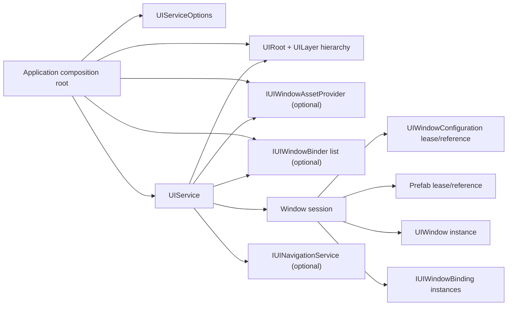
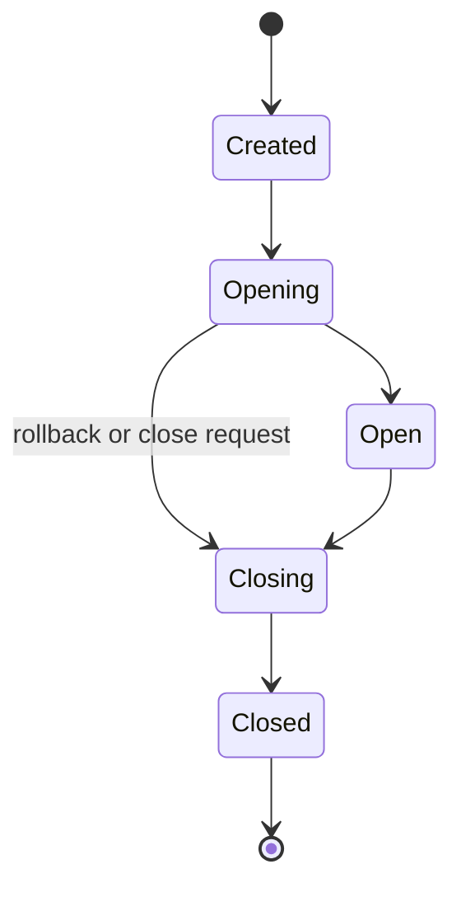

# CycloneGames.UIFramework

[English](README.md) | 简体中文

CycloneGames.UIFramework 负责 Unity 中 UGUI 窗口的生命周期管理。它执行配置校验、通过异步取消支持打开与关闭窗口、绑定可选表现层与依赖注入策略、追踪因果导航历史，并通过单一主线程 Service 释放每个会话持有的全部资源。

## 目录

- [概述](#概述)
- [架构](#架构)
- [快速上手](#快速上手)
- [核心概念](#核心概念)
- [使用指南](#使用指南)
- [进阶主题](#进阶主题)
- [常见场景](#常见场景)
- [性能与内存](#性能与内存)
- [故障排查](#故障排查)

## 概述

`UIService` 是窗口会话的中心 owner。它校验配置资产、解析 Layer、绑定可选扩展、执行过渡，并在关闭、回滚或 Shutdown 时释放每个会话持有的全部资源。

窗口通过稳定的字符串 ID 和 Asset Provider 加载，或通过直接的 `UIWindowConfiguration` 打开。Layer 内部按配置 Priority 确定窗口顺序。导航形成活动窗口的因果图，并支持双窗口协调过渡。Scene-bound 窗口在所属场景切换时自动关闭。

可选能力保持在独立程序集边界。MVP 与导航类型位于核心 `Runtime` 程序集。Asset 加载、Localization、DI 与 Motion Driver 分别在各自的 Integration Assembly 中编译，仅在对应包存在时启用。

### 主要特性

- **`UIService`** 作为单一主线程受限的窗口会话 owner，提供支持取消的 `UniTask` 操作。
- **显式 Binder 组合**：面向 MVP、DI、分析、无障碍或项目 policy 的事务型单窗口扩展。
- **Provider 加载**：直接 Prefab 或 `IUIWindowAssetProvider`，附带 AssetManagement adapter 与会话持有的 Lease。
- **因果导航**：活动窗口图，支持协调进入/离开过渡和调用方缓冲查询。
- **生命周期状态机**：`UIWindowState` 仅由 `UIService` 持有；回滚、清理与聚合失败上报。
- **有界动态图集**：运行时 Sprite Packing，具有显式 Lease；详见[动态图集指南](Documents~/DynamicAtlas.SCH.md)。
- **本地化布局**：按语言区分的几何与排版覆盖；详见[本地化布局指南](Documents~/LocalizedLayouts.SCH.md)。

## 架构


```mermaid
flowchart LR
    App["Application composition root"] --> Root["UIRoot + UILayer hierarchy"]
    App --> Options["UIServiceOptions"]
    App --> Provider["IUIWindowAssetProvider (optional)"]
    App --> Binders["IUIWindowBinder list (optional)"]
    App --> Service["UIService"]
    Service --> Root
    Service --> Provider
    Service --> Binders
    Service --> Session["Window session"]
    Session --> Config["UIWindowConfiguration lease/reference"]
    Session --> Prefab["Prefab lease/reference"]
    Session --> Window["UIWindow instance"]
    Session --> Bindings["IUIWindowBinding instances"]
    Service --> Navigation["IUINavigationService (optional)"]
```

`UIService` 是受管窗口唯一的运行时 authority。`OpenAsync` 预留窗口 ID 时会话开始；窗口关闭、打开失败回滚、场景清理、立即 Dispose 或 Shutdown 后会话结束。

| 对象 | 创建方 | 运行时 owner | 生命周期结束 |
| --- | --- | --- | --- |
| `UIRoot`、Layer、配置资产 | Scene 或内容 authoring | Scene/应用 | Scene 或应用 policy 决定 |
| `UIService` | Composition root 或可选 `UIManager` | Composition root/host | `ShutdownAsync` 或 `Dispose` |
| `IUIWindowAssetProvider` | Composition root | Composition root | 应用 policy；`UIService` 不 Dispose 它 |
| `IUIWindowBinder` 实例 | Composition root | Composition root | 应用 policy；有活动会话时不可修改 Binder 集合 |
| `IUIWindowBinding` | Binder 在打开事务中创建 | 窗口会话 | 清理时逆序 Dispose |
| 窗口 GameObject | `UIService` | 窗口会话 | 关闭、回滚或 Shutdown |
| Asset lease | Provider 创建，`UIService` 获取 | 窗口会话 | 关闭、回滚或 Shutdown |
| Presenter | `UIPresenterBinder` 的注册 policy | 注册的 release delegate | Binding Dispose |

`UIManager` 是可选的 `MonoBehaviour` 生命周期 host。它根据序列化容量与显式 `UIRoot` 创建 `UIService`。已有 composition root 的项目可直接构造 `UIService`。

### 程序集布局

| 程序集 | 用途 | 启用条件 |
| --- | --- | --- |
| `CycloneGames.UIFramework.Runtime` | 核心 Runtime | 始终 |
| `CycloneGames.UIFramework.Editor` | Authoring 工具 | 仅 Editor |
| `CycloneGames.UIFramework.Runtime.Integrations.AssetManagement` | Asset handle/lease adapter | Active；companion package dependency |
| `CycloneGames.UIFramework.Runtime.Integrations.Localization` | 语言布局 Runtime | Active；companion package dependency |
| `CycloneGames.UIFramework.Editor.Integrations.Localization` | 语言布局 Authoring | 仅 Editor；companion package dependency |
| `CycloneGames.UIFramework.Runtime.Integrations.VContainer` | 窗口注入 | 存在 `jp.hadashikick.vcontainer` 包 |
| `...Integrations.LitMotion` | 窗口过渡 driver | 存在 `com.annulusgames.lit-motion` 包 |
| `...Integrations.DOTween` | 窗口过渡 driver | 存在 `com.demigiant.dotween` 包 |
| `...Integrations.PrimeTween` | 窗口过渡 driver | 存在 `com.kyrylokuzyk.primetween` 包 |
| `CycloneGames.UIFramework.Samples` | 选择性示例 | `autoReferenced: false` |

核心 Runtime 引用 `UniTask`、`CycloneGames.Logger` 与 Unity UGUI API。可选 DI 与 Motion Integration 通过 asmdef 的 `versionDefines` 与 `defineConstraints` 启用；不要在 PlayerSettings 中手工添加 `CYCLONEGAMES_HAS_*` 符号。AssetManagement 与 Localization Integration 通过显式 asmdef reference 引用各自的本地 Assembly。

## 快速上手

直接引用窗口需要一个 `UIRoot`、一个 `UIWindowConfiguration`，以及构造 `UIService` 的 composition root。

```csharp
using System;
using System.Threading;
using Cysharp.Threading.Tasks;
using CycloneGames.UIFramework.Runtime;
using UnityEngine;

public sealed class GameUiBootstrap : MonoBehaviour
{
    [SerializeField] private UIRoot uiRoot;
    [SerializeField] private UIWindowConfiguration startupWindow;

    private IUIService _ui;

    private void Start()
    {
        RunAsync(this.GetCancellationTokenOnDestroy()).Forget();
    }

    private async UniTask RunAsync(CancellationToken lifetimeToken)
    {
        try
        {
            var options = new UIServiceOptions
            {
                InitialWindowCapacity = 8,
                MaxActiveWindows = 32,
                MaxInstantiatesPerFrame = 2,
            };

            _ui = new UIService(uiRoot, options: options);
            await _ui.OpenAsync(startupWindow, cancellationToken: lifetimeToken);
            await UniTask.WaitUntilCanceled(lifetimeToken);
        }
        catch (OperationCanceledException) when (lifetimeToken.IsCancellationRequested)
        {
        }
        catch (Exception exception)
        {
            Debug.LogException(exception, this);
        }
        finally
        {
            IUIService service = _ui;
            _ui = null;
            if (service != null)
            {
                try
                {
                    await service.ShutdownAsync(
                        UIShutdownMode.Immediate,
                        CancellationToken.None);
                }
                catch (Exception exception)
                {
                    Debug.LogException(exception, this);
                }
                finally
                {
                    if (!service.IsDisposed)
                    {
                        service.Dispose();
                    }
                }
            }
        }
    }
}
```

当配置的 `Source` 为 `PrefabReference` 时，通过显式配置打开窗口不需要 Asset Provider。按稳定窗口 ID 通过 Provider 加载时，需提供 `IUIWindowAssetProvider`；包内 adapter 接收由应用持有的 `IAssetPackage` 与 `IAssetPathBuilder`。

## 核心概念

### 生命周期状态机


```mermaid
stateDiagram-v2
    [*] --> Created
    Created --> Opening
    Opening --> Open
    Opening --> Closing: rollback or close request
    Open --> Closing
    Closing --> Closed
    Closed --> [*]
```

`UIWindowState` 是受管窗口的单一权威状态。`UIWindow` 校验每次局部迁移；`UIService` 则拥有生命周期工作流、取消、回滚与清理。Binder、Presenter、Transition Driver 与 DI Container 都不能持有竞争状态机。

打开管线按以下顺序执行：创建 Binding、通知 `OnStartOpen`、执行 `UIWindow.OnOpening()`、配置 Driver 时等待 `IUIWindowTransitionDriver.PlayOpenAsync`、提交 `Open`、执行 `UIWindow.OnOpened()`、再通知 `OnFinishedOpen`。关闭采用对称顺序；关闭 hook 或过渡失败时，Service 会先把权威状态强制收敛到 `Closed`，再发布 `OnFinishedClose`，继续清理，并报告聚合后的失败。

### 扩展点

选择能够拥有该工作的最小扩展点：

- 对局部、同步 View 行为重写 `UIWindow` 的 protected hook。
- 对窗口作用域的 Presenter、DI Scope、分析订阅或其他可 Dispose Integration 实现 `IUIWindowBinding`。
- 对 Pre-commit 与 Post-commit 生命周期边界上的有序、可取消工作实现 `IAsyncUIWindowBinding`。
- 对单窗口动画实现 `IUIWindowTransitionDriver`；对双窗口导航动画实现 `IUITransitionCoordinator`。

`UIWindowBindingContext` 在创建 Binding 时提供 `OpenerId`、`OpenContext` 与会话 `LifetimeToken`。Lifetime Token 贯穿关闭阶段回调，在 Dispose Binding 前立即取消。异步生命周期阶段通过 `IAsyncUIWindowBinding` 接收各阶段自己的 Token。

```csharp
public sealed class InventoryWindow : UIWindow
{
    protected override void OnOpening() => SetInteraction(false);
    protected override void OnOpened() => SetInteraction(true);
    protected override void OnClosing() => SetInteraction(false);

    private void SetInteraction(bool enabled)
    {
        if (CanvasGroup == null) return;
        CanvasGroup.interactable = enabled;
        CanvasGroup.blocksRaycasts = enabled;
    }
}

await ui.OpenAsync(
    inventoryConfiguration,
    new UIOpenOptions(transitionDriver: inventoryTransition),
    cancellationToken);
```

### 打开与关闭行为

- `OpenAsync(windowId)` 在加载前预留 ID，并要求 Provider。
- `OpenAsync(configuration)` 使用给定配置；非直接 Prefab Source 仍要求 Provider。
- 同一 ID 的并发打开只有在 Configuration 引用与全部 `UIOpenOptions` 值都和现有会话严格一致时，才会加入同一 Completion。
- 达到 `MaxActiveWindows` 时，会在创建新会话前失败。
- 配置、Layer、Prefab、Binder、过渡与导航注册属于同一个回滚边界。
- 在 `UIService` 所有权外 Destroy 受管窗口会触发清理。

`CloseAsync` 对正在关闭的窗口重复调用会加入同一关闭操作；空或未知 ID 返回 `false`。启用导航时，`ChildClosePolicy` 决定后代处理：`Reparent` 把子窗口重新连接到被移除窗口的活动 Opener，`Cascade` 关闭完整子树，`Detach` 让子窗口保持活动并成为 Root Node。调用方取消只停止等待；权威关闭仍会继续。

### Shutdown 行为

- `ShutdownAsync(Immediate)` 取消操作、销毁受管窗口、Dispose Binding 与 Lease、清空导航、Dispose Service，并排空已经在途的 Provider Acquisition。
- `ShutdownAsync(Animated)` 先按逆序通过 Transition Driver 关闭会话，再 Dispose。
- `Dispose()` 是同步、non-draining 的紧急路径，必须在 owner Unity 主线程调用。Composition root 必须使用在 teardown 期间仍有效的 Token 等待 Shutdown；生命周期 Token 已触发时通常使用 `CancellationToken.None`。

`IsSceneBound` 在发起打开请求时捕获活动 Scene Handle。后续活动场景切换不再匹配该 Handle 时，已提交窗口会关闭。

## 使用指南

### UIRoot 与 Layer

`UIRoot` 需要显式 Root `Canvas` 与序列化的 `UILayer` 列表。每个 Layer 都需要 `Canvas` 和 `GraphicRaycaster`。初始化时，`UIRoot` 校验 Root Canvas 存在且使用 `RectTransform`、每个 Layer 项均非空、每个 Layer 都有非空且唯一的 ordinal 名称。`UILayerConfiguration.LayerName` 必须与某个已注册 `UILayer.LayerName` 完全一致。同一 Layer 内的窗口先按配置 Priority 排序；Priority 相同时保持插入顺序。

### UIWindowConfiguration

| 字段 | 含义 |
| --- | --- |
| `WindowId` | 稳定且非空的 ID；活动会话范围内唯一 |
| `Source` | `PrefabReference`、`PathLocation` 或 `AssetReference` |
| `WindowPrefab` | `PrefabReference` 使用的直接 Prefab |
| `PrefabLocation` | `PathLocation` 使用的 Provider 地址 |
| `PrefabAssetReference` | Provider-neutral Runtime 地址和 Editor 跟踪 GUID |
| `Layer` | 名称可在 `UIRoot` 中解析的 Layer 配置 |
| `Priority` | 同一 Layer 内的排序优先级 |
| `IsSceneBound` | Owner 活动场景切换时关闭 |
| `CanvasIsolationPolicy` | 继承 Layer Canvas，或添加隔离的子 Canvas |

Prefab 根对象必须包含 `UIWindow` 派生组件。`UIAssetReference.Location` 是 Runtime 契约；`EditorGuid` 只是 authoring metadata，不能作为 Player 地址。

### 使用 AssetManagement 加载窗口

```csharp
using CycloneGames.AssetManagement.Runtime;
using CycloneGames.UIFramework.Runtime;
using CycloneGames.UIFramework.Runtime.Integrations;

public sealed class UiComposition
{
    private readonly IUIService _ui;

    public UiComposition(
        UIRoot root,
        IAssetPackage package,
        IAssetPathBuilder configurationPathBuilder)
    {
        var provider = new AssetManagementUIWindowAssetProvider(
            package,
            configurationPathBuilder);

        var options = new UIServiceOptions
        {
            DefaultAssetLoadContext = new UIAssetLoadContext(
                sharedBucket: "ui",
                sharedTag: "frontend",
                sharedOwner: "game-client"),
        };

        _ui = new UIService(root, provider, options);
    }
}
```

有效 `UIAssetLoadContext` 中每个非 `null` 字段按以下优先级选择：本次打开的 `UIOpenOptions.AssetLoadContext`、`UIRoot` 上的 `UIAssetContextProvider`、`UIServiceOptions.DefaultAssetLoadContext`。空字符串是显式值；希望继承 fallback 字段时应使用 `null`。Adapter 在关闭、回滚或 Shutdown 时 Dispose 配置与 Prefab Handle。

### Window + MVP

MVP 是可选组合。`UIPresenterBinder` 将注册保存在单个 Binder 实例中，不做反射发现。

```csharp
public interface ILoginView
{
    void SetListener(ILoginViewListener listener);
    void ShowValidationError(string message);
}

public interface ILoginViewListener : IUIViewListener
{
    void OnSubmit();
}

public sealed class LoginWindow : UIWindow, ILoginView
{
    private ILoginViewListener _listener;
    public void SetListener(ILoginViewListener listener) => _listener = listener;
    public void ShowValidationError(string message) { }
    public void UICmd_Submit() => _listener?.OnSubmit();
}

public sealed class LoginPresenter :
    UIPresenter<ILoginView>,
    ILoginViewListener
{
    protected override void OnViewBound() => View.SetListener(this);
    public void OnSubmit() { /* 校验输入并调用应用服务。*/ }
    public override void Dispose()
    {
        View?.SetListener(null);
        base.Dispose();
    }
}
```

在打开任何窗口前注册。每次成功绑定的回调顺序为：`SetUIService`、`SetView` 与 `OnViewBound`、`OnViewOpening`、`OnViewOpened`、`OnViewClosing`、`OnViewClosed`、注册的 release delegate。绑定失败时，release delegate 会在回滚中执行。

```csharp
var presenterBinder = new UIPresenterBinder(initialCapacity: 8);
presenterBinder.Register<LoginPresenter>("Login");

IUIWindowBinder[] binders = { presenterBinder };
var ui = new UIService(root, assetProvider: provider, options: options, binders: binders);
```

当 Presenter 必须在 `OnViewOpening` 期间使用调用方数据时，可使用 Contextual Factory。`OpenContext` 是调用方拥有的内存数据；应在功能边界校验其类型与内容。

```csharp
presenterBinder.RegisterContextual<LoginPresenter>(
    "Login",
    context =>
    {
        if (!context.TryGetOpenContext<LoginOpenRequest>(out var request))
        {
            throw new InvalidOperationException("LoginOpenRequest is required.");
        }
        return loginPresenterFactory.Create(request, context.LifetimeToken);
    });
```

### Window + DI

DI 是 composition 选择。项目可以用自定义 `IUIWindowBinder` 通过任意容器注入窗口。可选 VContainer adapter 只在对应 UPM 包存在时启用。

```csharp
using CycloneGames.UIFramework.Runtime;
using CycloneGames.UIFramework.Runtime.Integrations;
using VContainer;

IUIWindowBinder[] binders =
{
    new VContainerWindowBinder(resolver),
};

var ui = new UIService(root, provider, options, binders);
```

按窗口需要的顺序组合独立 Binder。首个失败的 Binder 会中止打开事务；已创建的 Binding 按逆序 Dispose。每个 Binder 只承担一种职责。

```csharp
var presenterBinder = new UIPresenterBinder(initialCapacity: 8);
presenterBinder.Register<LoginPresenter>(
    "Login",
    factory: () => resolver.Resolve<LoginPresenter>(),
    release: presenter => presenter.Dispose());

IUIWindowBinder[] binders =
{
    new VContainerWindowBinder(resolver), // 先注入窗口
    presenterBinder,                      // 再绑定 Presenter
};
```

### 导航

通过 Options 注入 `UINavigationService`。导航图只包含活动窗口。`OpenerId` 必须已经活动，不能与子窗口 ID 相同，并决定返回目标。Context 是内存对象引用，其 Node 移除或 Graph 清空时释放。

```csharp
var navigation = new UINavigationService(initialCapacity: 16);
var options = new UIServiceOptions { NavigationService = navigation };
var ui = new UIService(root, provider, options);

await ui.OpenAsync("MainMenu", cancellationToken: token);
await ui.OpenAsync(
    "Settings",
    new UIOpenOptions(openerId: "MainMenu", context: settingsContext),
    token);
```

查询使用调用方缓冲区。缓冲区预热且容量足够后，`CopyHistory`、`CopyAncestors` 与 `CopyChildren` 不需要为查询结果新建集合。

```csharp
var history = new List<UINavigationEntry>(16);
ui.NavigationService.CopyHistory(history);
```

`NavigateAsync` 打开或解析进入窗口，由一个 Coordinator 同时驱动两个活动窗口，再关闭离开窗口。每个 `UIService` 同时只能执行一个协调导航；重叠调用 fail-fast。协调操作会抑制进入窗口自己的 Open Transition。提交点位于开始不可逆地关闭 leaving window 之前。

```csharp
var coordinator = new SlideTransitionCoordinator(duration: 0.3f);

UIWindow inventory = await ui.NavigateAsync(
    leavingWindowId: "MainMenu",
    enteringWindowId: "Inventory",
    coordinator: coordinator,
    direction: NavigationDirection.Forward,
    enteringOptions: new UIOpenOptions(context: inventoryContext),
    cancellationToken: token);
```

`CrossFadeTransitionCoordinator` 与 `SlideTransitionCoordinator` 使用 unscaled time。`SlideTransitionCoordinator` 在 `NavigationDirection.Replace` 时使用 cross-fade。

### 窗口过渡

`IUIWindowTransitionDriver` 控制单个窗口的打开与关闭动画；`IUITransitionCoordinator` 控制导航时的双窗口动画。通过 `UIServiceOptions` 设置默认 Driver，或对单次打开覆盖。只有另一个 authority 负责完整动画操作时，才使用 `suppressWindowTransition: true`。可选 Motion 程序集为 `FadeConfig`、`ScaleConfig`、`SlideConfig` 与 `CompositeConfig` 提供 Driver，并只在相应包已安装时编译。

### Canvas、输入与分辨率

- 在 Root Canvas 上配置适合产品参考分辨率的 `CanvasScaler` 与 Match Policy。
- 大多数窗口使用 `InheritLayerCanvas`，以保留批处理并避免额外 Canvas 与 Raycaster。只有实测有收益时才使用 `IsolatedCanvas`。
- 需要显隐控制或内置协调过渡的窗口应添加 `CanvasGroup`。
- Layer Canvas 持有 Sorting Range；配置 Priority 只控制同一 Layer 内的 Sibling 顺序。

`GetRootCanvasSize()` 返回当前 Root `RectTransform` 尺寸。Overlay 配置下 `GetUICamera()` 可以返回 `null`。

## 进阶主题

### Binder 事务语义

`UIService` 从 Owner Thread 按创建顺序调用 Binding，并在每次异步等待后切回 Unity 主线程，再访问权威状态或 Unity Object。Binding 自己拥有内部 Continuation；接触 Unity API 前必须自行切回主线程。打开阶段失败会回滚完整会话；关闭阶段失败会聚合，同时继续执行剩余回调与清理。打开回调派发期间收到的关闭请求会延迟到当前派发退出；Async Callback 必须响应其 Token，也不得在自身生命周期阶段内等待同一会话的 `CloseAsync`。

### Presenter 导航

`UIPresenter<TView>.NavigateToAsync` 会把当前窗口记录为目标窗口的 opener。`NavigateBackAsync` 只按指定的 `ChildClosePolicy` 关闭当前窗口。存在活跃 opener 时，该 opener 保持为同一个运行中会话；其原始 `UIOpenOptions`、context、资产 Lease 与窗口实例都会保留，不会再次调用 `OpenAsync`。不存在活跃 opener 时，当前窗口仍会关闭，并且不会创建或加载替代窗口。

### Editor Authoring

通过 `Tools > CycloneGames > UI Framework > UIWindow Creator` 生成 Window Script、Prefab、Configuration 与可选 MVP 文件。生成前，选择项目拥有的输出目录、Template Prefab 与 Layer Configuration，设置稳定 Window ID 与 Source Mode，并确认每个生成 Script 目录都能通过最近的 asmdef/asmref 解析到可引用 `CycloneGames.UIFramework.Runtime` 的 Player-capable Assembly。Creator 在写入前会再次校验 Template、规范化 `Assets/` 路径、Assembly Graph 与冲突。Script 使用同目录临时文件和 create-new move 提交；Prefab 与 Configuration 先在最终目录的唯一临时路径创建，再通过 `AssetDatabase.MoveAsset` 提交。Pending Binding 使用有界、带 Schema Version 的 Journal，可跨 Reload 恢复。

手工 Authoring 菜单：

- `Assets > Create > CycloneGames > UIFramework > Window Configuration`
- `Assets > Create > CycloneGames > UIFramework > Layer Configuration`
- `Assets > Create > CycloneGames > UIFramework > UI Asset Context Asset`

### 诊断与可观测性

`GetPerformanceStats()` 返回 Session、生命周期阶段、Scene-bound Window、Binder、Isolated Canvas、Layer 与配置最大值等计数。`CopyLayerRuntimeStats` 和 `CopyActiveWindows` 写入调用方缓冲区。`DynamicAtlasService.GetStats()` 报告 Page、Entry、引用、估算 Texture Bytes、利用率、Copy Path、Cache Hit 与失败。`Tools > CycloneGames > UI Framework > Runtime Monitor` 从显式选择的 `UIManager` 读取这些有界 Snapshot。`Performance Auditor` 只在按下 `Scan Project` 后启动；它为 Layout Authority、Raycast、Material、Texture、Mask 与 Canvas Boundary 提供待复核项，不修改 Asset。

`UIPresenterBinder.LogMissingPresenterMappings` 可以在开发阶段报告未映射窗口。若未映射是常态或日志量会产生负担，应保持关闭。

## 常见场景

### 启动窗口与干净 Shutdown

快速上手示例展示了完整生命周期：构造 `UIService`、打开配置、等待取消，然后在 `finally` 中以 `UIShutdownMode.Immediate` 关闭并 Dispose。该模式让 composition root 拥有能在异常和取消下都成立的确定性 teardown 路径。

### 通过 AssetManagement 按 ID 打开

```csharp
public UniTask<UIWindow> OpenAsync(string windowId, CancellationToken token)
{
    return _ui.OpenAsync(windowId, cancellationToken: token);
}
```

配置路径 Builder 将 `WindowId` 解析为配置资产地址。使用 `PathLocation` 或 `AssetReference` 的配置再提供 Prefab 地址。Adapter 通过会话 Lease 持有已获取 Handle，并在关闭、回滚或 Shutdown 时 Dispose。

### 菜单到背包的协调过渡

```csharp
var coordinator = new SlideTransitionCoordinator(duration: 0.3f);

UIWindow inventory = await ui.NavigateAsync(
    leavingWindowId: "MainMenu",
    enteringWindowId: "Inventory",
    coordinator: coordinator,
    direction: NavigationDirection.Forward,
    enteringOptions: new UIOpenOptions(context: inventoryContext),
    cancellationToken: token);
```

Coordinator 在传播提交前取消之前，必须恢复自己修改的视觉与输入状态。在提交前发生打开、协调、取消或 ownership 校验失败时，本次新打开的进入窗口会被回滚。

### Scene-bound 弹窗清理

在配置上设置 `IsSceneBound`，已提交窗口会在后续活动场景切换不再匹配发起打开请求时捕获的 Handle 时自动关闭。这样弹窗会绑定到所属场景，无需在每个过渡路径中手动调用关闭。

## 性能与内存

### 容量控制

| Option | 默认值 | 行为 |
| --- | ---: | --- |
| `InitialWindowCapacity` | 16 | 会话 Dictionary/List 的初始容量 |
| `MaxActiveWindows` | 64 | 对已预留、Opening、Open 和 Closing 会话的硬上限 |
| `MaxInstantiatesPerFrame` | 2 | 单 Service 每帧实例化预算；超出请求 Yield 到后续 Update |

应根据实测并发 UI 需求选择数值。更大的初始容量用更多常驻托管内存换取更少扩容；最大值是稳定性边界，不是目标占用量。

### 分配特征

Open 与 Close 是生命周期操作，不是零分配热循环。一个会话可能分配 Session 对象、Cancellation Source、Completion Source、Asset Lease、窗口实例与 Binding Array。Provider-backed Open 还会为每次 Configuration 或 Prefab Acquisition 分配一个短生命周期的 drain Completion Source，使等待 Shutdown 后能够确认没有 Provider Call 仍在途。

重复诊断与导航查询时，保留并复用 `List<T>` 缓冲区，预设为实测最大容量，使用 `CopyActiveWindows`、`CopyLayerRuntimeStats` 与导航 `Copy*` 方法。Service 没有逐帧轮询循环；工作只发生在显式操作、活动过渡、Provider 等待和场景切换清理期间。

### 缓存与 Lease policy

窗口会话 Service 不池化窗口 GameObject，也不保留已关闭窗口缓存。Provider 可以共享底层资产，但每次成功获取都会返回由会话持有的 Lease。Binding 清理和窗口销毁后会 Dispose Lease。动态图集 Retention 是独立且显式有界的 Cache，具有自己的 Sprite Lease 与 Trim Policy。只有 Profiling 证明实例 churn 是主要成本，并且产品可以定义容量、Reset、耗尽、陈旧引用、Scene 与 Shutdown policy 时，才应增加池。

### 线程、AOT 与 Stripping

`UIService` 与 `DynamicAtlasService` 捕获 Unity Owner Thread，并拒绝其他线程调用。Binder、Presenter、生命周期回调、过渡、Hierarchy 修改、Locale Layout 应用、Texture Copy 与 Lease 消费也在该线程运行。Asset Provider 可以按自身 policy 执行后端 I/O 或解压；完成的 Unity Object 会在校验与实例化前切回主线程。不要用 Lock 包围 Unity Object 访问；应把工作调度到 Owner Thread。

核心不使用反射发现、运行时代码生成或仅 JIT 可用的 Delegate。Presenter Mapping 与 Binder 均显式连接，适合 IL2CPP/AOT Composition。第三方容器或内容后端仍可能需要自己的生成注册或 `link.xml`。必须用代表性 Player Build 验证 Stripping；Editor 编译不能作为证据。WebGL 不能假定存在通用托管 Worker Thread；主线程受限 API 与异步 Yield 不依赖后台线程。

### 内存安全清单

- 会话结束后不得持有 `UIWindow`、Presenter View、Binding Context 或 Navigation Context。
- Binding 与 Presenter Dispose 必须幂等。
- 不要直接 Destroy 受管窗口；调用 `CloseAsync`。
- 不要在 Lease Owner 之外 Dispose Provider Handle。
- `Image` 使用动态图集 Sprite 的完整期间都要持有对应 Lease，随后只 Dispose 一次。
- 独立限制 `MaxActiveWindows` 与内容系统缓存预算。
- 重复 Open/Close 和场景切换后检查 Retained Unity Object。

## 故障排查

| 现象 | 可能原因 | 解决方法 |
| --- | --- | --- |
| `Window configuration requires a stable WindowId` | `WindowId` 为空 | 设置 `WindowId`，不要依赖 Asset 或 GameObject 名称 |
| `Opening by id requires an IUIWindowAssetProvider` | 未提供 Provider | 提供 Provider，或通过直接 Prefab 配置调用 `OpenAsync(configuration)` |
| Configuration 不完整 | 缺少 Source 对应引用/地址或 Layer | 检查 Source 对应引用/地址、Layer 与 Layer Name |
| Layer 未注册 | 名称不匹配 | 让 `UILayerConfiguration.LayerName` 与 `UILayer.LayerName` 完全一致 |
| Prefab 不包含 `UIWindow` | 缺少派生组件 | 在 Prefab Root 添加派生组件 |
| 达到 Window Capacity | 触及 `MaxActiveWindows` | 关闭不用的 Session，或提高经过测量的预算 |
| 无法修改 Binder 注册 | 存在活动会话 | 关闭全部窗口后再 Register/Unregister Binder |
| Navigation 注册被拒绝 | Opener 无效或 Self-reference | 使用活动 Opener、唯一 Child ID，并避免 Self-reference |
| 已有协调导航运行 | 重叠调用 | 在应用流程中序列化 Navigation Command |
| Worker Thread 调用失败 | 脱离主线程 | 使用 `IUIService` 前切回 Unity 主线程 |
| Close 后 Asset 仍被持有 | Provider Sharing/Cache Policy | 检查 Provider Sharing/Cache Policy，并确认 Lease Dispose |
| 取消后输入仍被阻塞 | Transition 未恢复状态 | 确保自定义 Transition 在 `finally` 恢复 `CanvasGroup` 与焦点 |

## 验证

通过 Unity Test Runner 运行聚焦测试：

```text
<UnityEditor> -batchmode -nographics -projectPath <repo-root>/UnityStarter \
  -runTests -testPlatform EditMode \
  -testFilter CycloneGames.UIFramework \
  -testResults <result-path> -quit
```

打开 `Samples/SampleScene.unity`，在 Play Mode 中观察打开、过渡与干净 Shutdown。Sample Assembly 不 Auto Reference。具体 Scene 设置与运行步骤见 [Samples/README.SCH.md](Samples/README.SCH.md)。不得把 EditMode 通过扩大为 Player、IL2CPP、WebGL、移动端、主机、长期稳定或全局零 GC 结论。

## API Reference

| 类型/成员 | 用途 |
| --- | --- |
| `UIService(UIRoot, IUIWindowAssetProvider, UIServiceOptions, IReadOnlyList<IUIWindowBinder>)` | 构造一个显式 Service Authority |
| `OpenAsync(string, UIOpenOptions, CancellationToken)` | 按稳定 ID 通过 Provider 打开 |
| `OpenAsync(UIWindowConfiguration, UIOpenOptions, CancellationToken)` | 通过显式配置打开 |
| `CloseAsync(string, ChildClosePolicy, CancellationToken)` | 关闭会话并应用导航子节点 Policy |
| `NavigateAsync(string, string, IUITransitionCoordinator, NavigationDirection, UIOpenOptions, CancellationToken)` | 协调进入/离开事务 |
| `ShutdownAsync(UIShutdownMode, CancellationToken)` | 有序 Service Teardown |
| `Dispose()` | 同步立即 Teardown |
| `UIServiceOptions` | 初始/最大容量、实例化预算、默认 Load Context/Transition、Navigation Service |
| `UIOpenOptions` | Opener、Context、Scene-bound Override、单次 Load Context/Transition、Transition Suppression |
| `IUIWindowAssetProvider` | 获取配置与 Prefab Lease |
| `IAssetLease<T>` | 由会话持有且只 Dispose 一次的 Asset Acquisition |
| `UIAssetReference` | Provider-neutral Runtime Location 与 Editor GUID Metadata |
| `UIAssetLoadContext` | 配置与 Prefab 的不可变 Bucket/Tag/Owner Metadata |
| `IUIWindowBinder` / `IUIWindowBinding` | 事务型单窗口扩展与生命周期 Handle |
| `UIWindowBindingContext` | Window/Service、Opener、调用方 Context 与会话 Lifetime Token |
| `IAsyncUIWindowBinding` | Pre-commit 与 Post-commit 生命周期边界上的有序、可取消工作 |
| `UIPresenterBinder` | 实例级显式或 Contextual Presenter 注册 |
| `UIPresenter<TView>` | 可选强类型 Presenter 生命周期 |
| `IUINavigationService` | 活动因果图与调用方缓冲查询 |
| `IUIWindowTransitionDriver` | 单窗口 Open/Close 过渡 |
| `IUITransitionCoordinator` | 双窗口导航过渡 |
| `TryGetWindow`、`CopyActiveWindows` | 活动窗口查找/快照 |
| `GetPerformanceStats`、`CopyLayerRuntimeStats` | 有界 Runtime 诊断 |
| `DynamicAtlasService`、`DynamicAtlasSpriteLease` | 具有显式 Ownership 的有界 Runtime Sprite Packing |
| `UILocaleLayout`、`LocalizationWindowBinder` | Locale Layout Snapshot 与事务化窗口作用域 Localization Binding |
