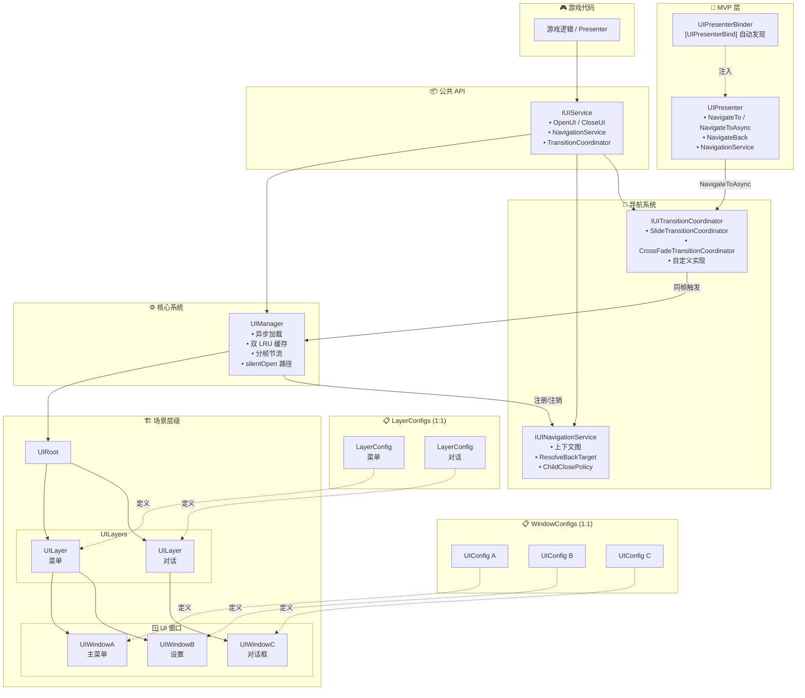
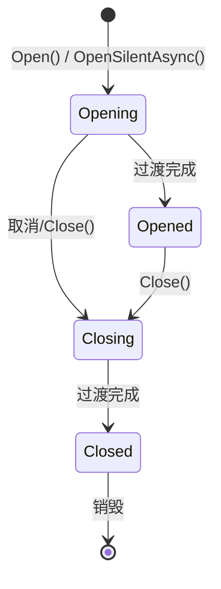

# CycloneGames.UIFramework

<div align="left"><a href="./README.md">English</a> | 简体中文</div>

一个面向**Unity**的生产级 UI 框架。除基础窗口管理外，还提供完整的导航上下文图、协调多窗口过渡动画、MVP 自动绑定、LRU 资产缓存、动态图集纹理合批，以及控制反转 DI/IoC 支持，所有功能均建立在零 GC、线程安全的运行时核心之上。

## 特性

### 🏗️ 架构与可扩展性

| 特性             | 说明                                                                                                                                      |
| ---------------- | ----------------------------------------------------------------------------------------------------------------------------------------- |
| **MVP 自动绑定** | 用 `[UIPresenterBind("窗口名")]` 装饰 Presenter，绑定、生命周期转发和注入自动完成，零样板代码                                             |
| **DI / IoC**     | 所有公共契约均为接口（`IUIService`、`IUINavigationService`、`IUITransitionCoordinator` 等），原生兼容 VContainer、Zenject 及任何 IoC 容器 |
| **数据驱动配置** | 每个窗口和层级通过 `ScriptableObject` 配置，设计师无需碰代码即可完全控制                                                                  |
| **服务门面模式** | `IUIService` 是唯一的公共 API，内部 `UIManager` 复杂性完全封装                                                                            |

### 🧭 导航上下文图（非线性堆栈）

| 特性                     | 说明                                                                                                                  |
| ------------------------ | --------------------------------------------------------------------------------------------------------------------- |
| **有向图（而非线性栈）** | 窗口可有多个打开者，支持非线性关闭；"返回"始终解析到最近存活的祖先                                                    |
| **上下文 Payload**       | 打开窗口时传入任意类型对象，目标窗口随时通过 `NavigationService.GetContext()` 读取                                    |
| **子节点关闭策略**       | `Reparent`（过继给祖父节点）、`Cascade`（级联强制关闭）、`Detach`（成为根节点）                                       |
| **零 GC 查询**           | 导航图读取（`GetAncestors`、`ResolveBackTarget`、`GetHistory`）通过 `ReaderWriterLockSlim` 线程安全；写操作限定主线程 |
| **不可变条目结构体**     | `UINavigationEntry` 是 `readonly struct`，每条记录零堆分配                                                            |

### 🎬 过渡协调器（同步与堆叠动画）

| 特性                | 说明                                                                                                  |
| ------------------- | ----------------------------------------------------------------------------------------------------- |
| **双窗口协调过渡**  | `NavigateToAsync()` 在**同一帧**同时触发退出和进入动画，窗口间零视觉间隙                              |
| **堆叠 / 级联打开** | 在 `OnViewOpening()` 中调用 `NavigateTo()` 可在 B 动画播放时就启动 C，形成流畅的分层入场感            |
| **内置协调器**      | 开箱即用：`SlideTransitionCoordinator`（方向性翻页）和 `CrossFadeTransitionCoordinator`（透明度溶解） |
| **自定义协调器**    | 实现 `IUITransitionCoordinator` 即可支持任意效果：缩放、弹性、模糊——动画库无关                        |
| **自动降级**        | 未注册协调器时，`NavigateToAsync()` 静默退化为串行 `NavigateTo()`，零 breaking change                 |
| **独立弹窗动画**    | 非协调窗口（弹窗、提示）使用自身 `IUIWindowTransitionDriver`，完全不受影响                            |

### ⚡ 性能

| 特性               | 说明                                                                                     |
| ------------------ | ---------------------------------------------------------------------------------------- |
| **资产生命周期委托** | `UIManager` 每个资产持有一个 `IAssetHandle<T>`，生命周期（RefCount、驱逐）完全由 `AssetCacheService`（W-TinyLFU）管理 |
| **逐帧实例化节流** | 将密集实例化分散到多帧，避免帧峰值                                                       |
| **动态图集系统**   | 运行时在窗口打开时将精灵打包到单张 GPU 纹理，大幅减少图标密集型 UI 的 DrawCall           |
| **压缩图集变体**   | `CompressedDynamicAtlasService` 使用 ASTC/DXT/ETC 压缩格式降低 VRAM 占用，针对移动端优化 |
| **原生异步设计**   | 所有加载、实例化、打开操作均基于 `UniTask`，永不阻塞主线程                               |

### 🔒 可靠性与安全性

| 特性                       | 说明                                                                                    |
| -------------------------- | --------------------------------------------------------------------------------------- |
| **正式窗口状态机**         | `Opening → Opened → Closing → Closed` 防止重复打开、重复关闭和竞态条件                  |
| **内存安全生命周期**       | `OnReleaseAssetReference` 回调确保 Addressable 句柄精确释放一次，即使在取消操作下也如此 |
| **CancellationToken 传播** | 所有异步路径接受 `CancellationToken`，取消时干净退出，无泄漏或孤立 GameObject           |
| **线程安全导航**           | 导航图读操作可从任意线程安全调用；写操作受主线程保护                                    |

## 核心架构


```mermaid
flowchart TB
    subgraph GameCode["🎮 游戏代码"]
        GameLogic["游戏逻辑 / Presenter"]
    end

    subgraph Facade["📦 公共 API"]
        UIService["IUIService<br/>• OpenUI / CloseUI<br/>• NavigationService<br/>• TransitionCoordinator"]
    end

    subgraph NavSystem["🧭 导航系统"]
        NavService["IUINavigationService<br/>• 上下文图<br/>• ResolveBackTarget<br/>• ChildClosePolicy"]
        Coordinator["IUITransitionCoordinator<br/>• SlideTransitionCoordinator<br/>• CrossFadeTransitionCoordinator<br/>• 自定义实现"]
    end

    subgraph Core["⚙️ 核心系统"]
        UIManager["UIManager<br/>• 异步加载<br/>• 双 LRU 缓存<br/>• 分帧节流<br/>• silentOpen 路径"]
    end

    subgraph MVP["🔌 MVP 层"]
        Binder["UIPresenterBinder<br/>[UIPresenterBind] 自动发现"]
        Presenter["UIPresenter<TView><br/>• NavigateTo / NavigateToAsync<br/>• NavigateBack<br/>• NavigationService"]
    end

    subgraph LayerConfigs["📋 LayerConfigs (1:1)"]
        LayerConfigMenu["LayerConfig<br/>菜单"]
        LayerConfigDialogue["LayerConfig<br/>对话"]
    end

    subgraph WindowConfigs["📋 WindowConfigs (1:1)"]
        ConfigA["UIConfig A"]
        ConfigB["UIConfig B"]
        ConfigC["UIConfig C"]
    end

    subgraph Scene["🏗️ 场景层级"]
        UIRoot["UIRoot"]
        subgraph Layers["UILayers"]
            UILayerMenu["UILayer<br/>菜单"]
            UILayerDialogue["UILayer<br/>对话"]
        end
        subgraph Windows["🪟 UI 窗口"]
            WindowA["UIWindowA<br/>主菜单"]
            WindowB["UIWindowB<br/>设置"]
            WindowC["UIWindowC<br/>对话框"]
        end
    end

    GameLogic --> UIService
    UIService --> UIManager
    UIService --> NavService
    UIService --> Coordinator

    UIManager --> UIRoot
    UIRoot --> UILayerMenu
    UIRoot --> UILayerDialogue
    UILayerMenu --> WindowA
    UILayerMenu --> WindowB
    UILayerDialogue --> WindowC

    LayerConfigMenu -.->|定义| UILayerMenu
    LayerConfigDialogue -.->|定义| UILayerDialogue
    ConfigA -.->|定义| WindowA
    ConfigB -.->|定义| WindowB
    ConfigC -.->|定义| WindowC

    Binder -.->|注入| Presenter
    Presenter -->|NavigateToAsync| Coordinator
    Coordinator -->|同帧触发| UIManager
    UIManager -->|注册/注销| NavService
```

### 1. `UIService`（门面）

唯一公共 API 入口。所有游戏逻辑和 Presenter 只通过 `IUIService` 交互，内部 `UIManager` 的复杂性完全封装。DI 环境中将 `IUIService` 注册为单例即可从任何地方注入，同时获得 `NavigationService` 和 `TransitionCoordinator` 的访问权限。

### 2. `UIManager`（核心）

协调完整的窗口生命周期：

- **异步加载**：通过 `CycloneGames.AssetManagement` 加载配置和预制体。
- **句柄直接持有**：直接的 `IAssetHandle<T>` 字典取代了原来的 LRU 缓存。每个唯一资产路径持有一个句柄；调用 `Dispose()` 通知 `AssetCacheService`（W-TinyLFU）递减 RefCount，让闲置资产从 Active → Trial → Main 池流转直至被驱逐。
- **实例化节流**：限制每帧实例化次数，避免帧峰值。
- **silentOpen 路径**：`OpenSilentAsync()` 将窗口加载到就绪状态但不播放动画，由 `CoordinatedNavigateAsync` 调用，让协调器在同一帧驱动双窗口动画。

### 3. `UIRoot` & `UILayer`（场景层级）

- **`UIRoot`**：所有 UI 的根锚点，管理 UI 相机和所有层级。
- **`UILayer`**：命名排序层（如 `Menu`、`Dialogue`、`HUD`、`Overlay`），每个窗口属于唯一一层，控制渲染顺序和输入优先级。

### 4. `UIWindow`（UI 单元）

所有面板、页面和弹窗的基类：


```mermaid
stateDiagram-v2
    [*] --> Opening: Open() / OpenSilentAsync()

    Opening --> Opened: 过渡完成
    Opening --> Closing: 取消/Close()

    Opened --> Closing: Close()

    Closing --> Closed: 过渡完成

    Closed --> [*]: 销毁
```

`OpenSilentAsync()` 推进状态机并通知 Binder，但**不播放**过渡动画——专供过渡协调器同步双窗口动画使用。

### 5. `UIWindowConfiguration`（数据驱动配置）

定义预制体来源、目标层级及可选覆盖参数的 `ScriptableObject`。设计师无需修改代码即可配置窗口行为。

### 6. `IUIWindowTransitionDriver`（单窗口动画）

控制**单个**窗口的开关动画。适用于弹窗、提示、Toast 等各自独立的效果，与过渡协调器并行工作互不干扰。

### 7. `IUITransitionCoordinator`（双窗口协调动画）

同时驱动**两个**窗口的动画。注册到 `IUIService` 后，所有 `NavigateToAsync()` 调用都将使用它实现无缝翻页、交叉淡入或任何自定义效果。实现这个接口只需约 10 行代码，可接入 DOTween、LitMotion 或任何动画库。

## 依赖项

- `com.cysharp.unitask`
- `com.cyclone-games.assetmanagement`
- `com.cyclone-games.factory`
- `com.cyclone-games.logger`
- `com.cyclone-games.service`

## 资产管理与内存管理策略

UIFramework 对 `CycloneGames.AssetManagement` 有**一级依赖**，自身**不维护独立的驱逐缓存**——所有资产生命周期决策完全委托给 `AssetCacheService`。

### 运作原理

```
OpenUI("MyWindow")
  └─ assetPackage.LoadAssetAsync<UIWindowConfiguration>(path, bucket: "UIFramework")
       └─ AssetCacheService: 缓存命中 → Retain()（RefCount ↑）
            OR 缓存未命中 → 加载，注册节点，RefCount = 1
       └─ UIManager 存储 IAssetHandle<T> 引用

CloseUI("MyWindow")
  └─ UIManager: configHandle.Dispose()   → AssetCacheService: RefCount ↓
  └─ UIManager: prefabHandle.Dispose()   → 若无其他窗口使用同一预制体
       └─ RefCount → 0 → 资产进入闲置池（Trial/Main，由 W-TinyLFU 管理）
       └─ W-TinyLFU 根据访问频率决定是驱逐还是晋升
```

### 设计关键属性

| 属性 | 说明 |
|---|---|
| **唯一 RefCount 体系** | UIManager 内部无私有计数器，`AssetCacheService` 是唯一权威 |
| **`"UIFramework"` Bucket** | 所有 UI 资产统一打标签，可在 Cache Debugger 的 Buckets 标签页中隔离查看 |
| **预制体共享** | 使用同一预制体路径的多个窗口共享同一句柄，最后一个窗口关闭时才释放 |
| **Config 句柄** | 每个窗口名对应一个句柄（windowName → config 路径），`CloseUI` 时释放 |
| **场景卸载零泄漏** | `CleanupAllWindows()` 批量 `Dispose()` 全部持有句柄，正确排空 AssetCacheService RefCount |

## 快速上手指南

本指南将逐步引导您设置和使用 UIFramework。跟随步骤创建您的第一个 UI 窗口！

### 步骤 1: 场景设置

1. **定位 UIFramework 预制体**: 在包中找到 `UIFramework.prefab`，路径为 `Runtime/Prefabs/UI/UIFramework.prefab`。
2. **添加到场景**: 您可以：
   - 直接将预制体拖入场景，或
   - 使用资源管理系统在运行时加载它
3. **验证设置**: 预制体包含：
   - 带有 UI 相机的 `UIRoot` 组件
   - 默认的 `UILayer` 配置（菜单、对话、通知等）

`UIFramework.prefab` 已预配置了必要的组件，因此您可以立即开始使用。

### 步骤 2: 创建 `UILayer` 配置

`UILayer` 配置定义了 UI 窗口的渲染和输入层级。框架提供了几个默认层级，但您可以创建自定义的。

1. **创建新的层级配置**:
   - 在项目窗口中，右键单击并选择 **Create > CycloneGames > UIFramework > UILayer Configuration**
   - 为其指定一个描述性的名称，例如 `UILayer_Menu`、`UILayer_Dialogue`、`UILayer_Notification`

2. **配置层级**:
   - 在 Inspector 中打开 `UILayerConfiguration` 资产
   - 设置 `Layer Name`（例如 "Menu"、"Dialogue"）
   - 如果需要，调整 `Sorting Order`（数值越大，渲染越靠前）

3. **分配给 UIRoot**:
   - 在场景中选择 `UIRoot` GameObject
   - 在 Inspector 中，找到 `Layer Configurations` 列表
   - 将您新创建的 `UILayerConfiguration` 资产添加到列表中

**层级设置示例:**

```
UILayer_Menu (Sorting Order: 100)
UILayer_Dialogue (Sorting Order: 200)
UILayer_Notification (Sorting Order: 300)
```

### 步骤 3: 创建您的第一个 `UIWindow`

有两种创建 `UIWindow` 的方法：使用快速创建工具或手动创建。我们将介绍两种方法。

#### 方法 1: 快速创建（推荐新手使用）

框架提供了一个便捷的编辑器工具，可以一次性创建所有必要的文件。

1. **打开 UIWindow Creator**:
   - 在 Unity 菜单栏中，转到 **Tools > CycloneGames > UIWindow Creator**
   - 将打开一个包含所有创建选项的窗口

2. **填写所需信息**:
   - **Window Name**: 输入描述性名称（例如 `MainMenuWindow`、`HUDWindow`）
   - **Namespace**（可选）: 如果您使用命名空间，请在此输入（例如 `MyGame.UI`）
   - **Script Save Path**: 拖入一个文件夹，C# 脚本将保存在此
   - **Prefab Save Path**: 拖入一个文件夹，预制体将保存在此
   - **Configuration Save Path**: 拖入一个文件夹，`UIWindowConfiguration` 资产将保存在此
   - **UILayer Configuration**: 选择您在步骤 2 中创建的 `UILayerConfiguration` 资产
   - **Template Prefab**（可选）: 您可以拖入一个模板预制体作为基础

3. **创建 UIWindow**:
   - 点击 **"Create UIWindow"** 按钮
   - 工具将自动创建：
     - 继承自 `UIWindow` 的 C# 脚本
     - 附加了脚本的预制体
     - 将所有内容链接在一起的 `UIWindowConfiguration` 资产

**可视化指南:**

- 
- 

#### 方法 2: 手动创建

如果您更喜欢手动创建文件或需要更多控制：

1. **创建脚本**:

   ```csharp
   using CycloneGames.UIFramework.Runtime;
   using UnityEngine;
   using UnityEngine.UI;

   public class MainMenuWindow : UIWindow
   {
       [SerializeField] private Button playButton;
       [SerializeField] private Button settingsButton;
       [SerializeField] private Button quitButton;

       protected override void Awake()
       {
           base.Awake();

           // 初始化按钮监听器
           if (playButton != null)
               playButton.onClick.AddListener(OnPlayClicked);
           if (settingsButton != null)
               settingsButton.onClick.AddListener(OnSettingsClicked);
           if (quitButton != null)
               quitButton.onClick.AddListener(OnQuitClicked);
       }

       private void OnPlayClicked()
       {
           Debug.Log("点击了开始按钮！");
           // 在此处添加您的游戏开始逻辑
       }

       private void OnSettingsClicked()
       {
           Debug.Log("点击了设置按钮！");
           // 在此处添加您的设置逻辑
       }

       private void OnQuitClicked()
       {
           Debug.Log("点击了退出按钮！");
           Application.Quit();
       }
   }
   ```

2. **创建预制体**:
   - 在场景中创建一个新的 UI `Canvas` 或 `Panel`
   - 将您的 `MainMenuWindow` 组件添加到根 `GameObject`
   - 设计您的 UI（添加按钮、文本、图像等）
   - 在 Inspector 中将 UI 元素引用分配给序列化字段
   - 将其保存为预制体（从 Hierarchy 拖到 Project 窗口）

3. **创建配置**:
   - 在项目窗口中右键单击，选择 **Create > CycloneGames > UIFramework > UIWindow Configuration**
   - 将其命名为 `UIWindow_MainMenu`（这是您用来打开窗口的名称）
   - 在 Inspector 中：
     - 将您的 `MainMenuWindow` 预制体分配给 `Window Prefab` 字段
     - 将适当的 `UILayer`（例如 `UILayer_Menu`）分配给 `Layer` 字段

### 步骤 4: 初始化并使用 `UIService`

`UIService` 是您打开和关闭 UI 窗口的主要接口。您需要在游戏启动时初始化一次。

#### 基本初始化（使用 Resources）

如果您使用 Unity 内置的 `Resources.Load`：

```csharp
using CycloneGames.UIFramework.Runtime;
using CycloneGames.Factory.Runtime;
using CycloneGames.Service.Runtime;
using CycloneGames.AssetManagement.Runtime;
using Cysharp.Threading.Tasks;
using UnityEngine;

public class GameInitializer : MonoBehaviour
{
    private IUIService uiService;

    async void Start()
    {
        // 初始化资源管理（使用 Resources）
        IAssetModule module = new ResourcesModule();
        await module.InitializeAsync(new AssetManagementOptions());
        var package = module.CreatePackage("DefaultResources");
        await package.InitializeAsync(default);
        AssetManagementLocator.DefaultPackage = package;

        // 创建所需的服务
        var assetPathBuilderFactory = new TemplateAssetPathBuilderFactory();
        var objectSpawner = new DefaultUnityObjectSpawner();
        var mainCameraService = new MainCameraService();

        // 初始化 UIService
        uiService = new UIService();
        uiService.Initialize(assetPathBuilderFactory, objectSpawner, mainCameraService);

        // 现在您可以打开 UI 窗口了！
        await OpenMainMenu();
    }

    public async UniTask OpenMainMenu()
    {
        // "UIWindow_MainMenu" 是您的 UIWindowConfiguration 资产的文件名
        UIWindow window = await uiService.OpenUIAsync("UIWindow_MainMenu");

        if (window != null && window is MainMenuWindow mainMenu)
        {
            Debug.Log("主菜单打开成功！");
            // 您现在可以与窗口实例交互
        }
        else
        {
            Debug.LogError("打开主菜单窗口失败！");
        }
    }

    public void CloseMainMenu()
    {
        uiService.CloseUI("UIWindow_MainMenu");
    }
}
```

#### 高级初始化（使用资源包）

如果您使用 Addressables、YooAsset 或其他资源管理系统：

```csharp
using CycloneGames.UIFramework.Runtime;
using CycloneGames.AssetManagement.Runtime;
// ... 其他 using 语句

public class GameInitializer : MonoBehaviour
{
    private IUIService uiService;
    private IAssetPackage uiPackage;

    async void Start()
    {
        // 初始化您的资源管理系统
        // 此示例假设您有一个 IAssetPackage 实例
        uiPackage = await InitializeYourAssetPackageAsync();

        // 创建所需的服务
        var assetPathBuilderFactory = new YourAssetPathBuilderFactory();
        var objectSpawner = new DefaultUnityObjectSpawner();
        var mainCameraService = new MainCameraService();

        // 使用包初始化 UIService
        uiService = new UIService();
        uiService.Initialize(assetPathBuilderFactory, objectSpawner, mainCameraService, uiPackage);

        // 打开 UI 窗口
        await OpenMainMenu();
    }

    // ... 其余代码
}
```

### 步骤 5: 打开和关闭窗口

一旦 `UIService` 初始化完成，打开和关闭窗口就很简单了：

```csharp
// 异步打开窗口（推荐）
UIWindow window = await uiService.OpenUIAsync("UIWindow_MainMenu");

// 使用回调打开窗口（即发即弃）
uiService.OpenUI("UIWindow_MainMenu", (window) => {
    if (window != null)
        Debug.Log("窗口已打开！");
});

// 关闭窗口
uiService.CloseUI("UIWindow_MainMenu");

// 异步关闭窗口
await uiService.CloseUIAsync("UIWindow_MainMenu");

// 检查窗口是否打开
bool isOpen = uiService.IsUIWindowValid("UIWindow_MainMenu");

// 获取打开的窗口引用
UIWindow window = uiService.GetUIWindow("UIWindow_MainMenu");
if (window is MainMenuWindow mainMenu)
{
    // 与窗口交互
}
```

### 步骤 6: 处理窗口生命周期

每个 `UIWindow` 都有一个由状态机管理的生命周期。您可以重写方法来挂钩不同的状态：

```csharp
public class MyWindow : UIWindow
{
    protected override void Awake()
    {
        base.Awake();
        Debug.Log("窗口正在创建");
    }

    // 窗口开始打开时调用（动画之前）
    protected override void OnStartOpen()
    {
        base.OnStartOpen();
        Debug.Log("窗口正在打开");
    }

    // 窗口完成打开时调用（动画之后）
    protected override void OnFinishedOpen()
    {
        base.OnFinishedOpen();
        Debug.Log("窗口完全打开并可交互");
    }

    // 窗口开始关闭时调用（动画之前）
    protected override void OnStartClose()
    {
        base.OnStartClose();
        Debug.Log("窗口正在关闭");
    }

    // 窗口完成关闭时调用（动画之后，销毁之前）
    protected override void OnFinishedClose()
    {
        base.OnFinishedClose();
        Debug.Log("窗口已关闭并将被销毁");
    }
}
```

## UI 导航上下文系统教程

当你的窗口系统运转起来之后，你可能希望框架能够**记录用户的来源路径**——这样不管玩家是从哪个入口进来的，按"返回"时都能正确跳回上一个界面。

**UI 导航上下文系统**维护着一张实时有向图，记录每个窗口的"打开者"关系。不同于简单的线性堆栈，它支持**非线性流程**：比如关掉中间的窗口 B，窗口 C 仍然存活，按返回时 C 也能正确跳回 A。

### 核心概念

| 术语                                  | 含义                                                   |
| ------------------------------------- | ------------------------------------------------------ |
| **节点 (Node)**                       | 一条窗口记录：谁打开的我、传了什么数据、什么时候注册的 |
| **打开者 (Opener)**                   | 触发本窗口打开的那个窗口                               |
| **祖先链 (Ancestor chain)**           | 完整来源路径，如 `主界面 → 商店 → 详情 → 结算`         |
| **子节点关闭策略 (ChildClosePolicy)** | 父窗口关闭时，其子窗口的处理方式                       |

**ChildClosePolicy 可选项：**

| 策略               | 效果                                                 |
| ------------------ | ---------------------------------------------------- |
| `Reparent`（默认） | 子窗口存活，并被自动"过继"给被关闭窗口的上一级       |
| `Cascade`          | 所有子窗口（及其后代）一并强制关闭                   |
| `Detach`           | 子窗口存活，但与来源关系断开，成为无返回目标的根节点 |

### 第一步：初始化导航服务

在启动逻辑中创建一次 `UINavigationService` 并挂载到 `IUIService`：

```csharp
// 非 DI 启动时
var navService = new UINavigationService();
uiService.SetNavigationService(navService);

// 让 PresenterBinder 知道 IUIService，从而让各 Presenter 都能调用导航
presenterBinder.SetUIService(uiService);
```

DI 方式（VContainer 示例）：

```csharp
// 在 LifetimeScope 中
builder.Register<UINavigationService>(Lifetime.Singleton).AsImplementedInterfaces();
// 然后通过 IUIService.SetNavigationService(nav) 注入
```

### 第二步：从 Presenter 发起导航

`UIPresenter<TView>` 基类内置了两个导航辅助方法：

```csharp
[UIPresenterBind("UIWindow_Shop")]
public class ShopPresenter : UIPresenter<IShopView>
{
    public void OnClickItemDetail(int itemId)
    {
        // 打开详情窗口，并将商店窗口记为其 Opener
        // itemId 可在目标 Presenter 中通过 NavigationService.GetContext() 取回
        NavigateTo("UIWindow_ItemDetail", new ItemContext { ItemId = itemId });
    }

    public void OnClickBack()
    {
        // 关闭当前窗口，并自动跳转到最近还活着的祖先窗口
        NavigateBack();
    }
}
```

### 第三步：在目标窗口中读取上下文

```csharp
[UIPresenterBind("UIWindow_ItemDetail")]
public class ItemDetailPresenter : UIPresenter<IItemDetailView>
{
    public override void OnViewOpened()
    {
        // 取出 Shop 传来的 context 数据
        var ctx = NavigationService?.GetContext("UIWindow_ItemDetail") as ItemContext;
        if (ctx != null)
            View.SetItem(ctx.ItemId);
    }
}
```

### 第四步：非线性流程——关掉中间窗口

默认的 `Reparent` 策略会自动处理这个场景。假设路径为 `A → B → C`：

```csharp
// 关掉 B，C 仍然存活
uiService.CloseUI("UIWindow_B");
// 框架自动将 C 的 Opener 改为 A
// C 按返回键时，NavigateBack() 会正确跳到 A
```

如果 B 关闭时需要连带关闭 C（比如模态向导流程），使用 `Cascade`：

```csharp
uiService.NavigationService?.Unregister("UIWindow_B", ChildClosePolicy.Cascade);
uiService.CloseUI("UIWindow_B");
```

### 第五步：查询导航图

```csharp
IUINavigationService nav = uiService.NavigationService;

// 当前最顶层的活跃窗口
string current = nav.CurrentWindow;

// 当前窗口的完整来源路径（从最早的打开者到最新的）
List<string> path = nav.GetAncestors("UIWindow_Checkout");
// → ["UIWindow_MainMenu", "UIWindow_Shop", "UIWindow_ItemDetail"]

// Shop 窗口打开了哪些子窗口？
List<string> children = nav.GetChildren("UIWindow_Shop");

// 完整历史记录（按注册时间从旧到新）
List<UINavigationEntry> history = nav.GetHistory();

// 按"返回"会去哪？
string backTarget = nav.ResolveBackTarget("UIWindow_ItemDetail");
```

### API 速查

| 方法 / 属性                   | 说明                                         |
| ----------------------------- | -------------------------------------------- |
| `CurrentWindow`               | 最近注册且仍存活的窗口名                     |
| `CanNavigateBack`             | 当前窗口是否有可用的返回目标                 |
| `Register(name, opener, ctx)` | 注册一个窗口节点（UIManager 开窗时自动调用） |
| `Unregister(name, policy)`    | 注销一个窗口节点（UIManager 关窗时自动调用） |
| `Clear()`                     | 清空整张图（如重启游戏时）                   |
| `GetOpener(name)`             | 谁打开了这个窗口                             |
| `GetContext(name)`            | 该窗口被打开时携带的 payload 数据            |
| `GetAncestors(name)`          | 完整来源链，从最旧的打开者开始               |
| `GetChildren(name)`           | 该窗口直接打开的所有还活着的子窗口           |
| `ResolveBackTarget(name)`     | 最近还活着的祖先窗口名                       |
| `GetHistory()`                | 按注册顺序的快照列表                         |

> **线程安全**：`Register`、`Unregister`、`Clear` 必须在主线程调用。所有查询方法（`GetAncestors`、`GetHistory` 等）支持从任意线程安全调用。

## UI 过渡协调器教程

默认情况下，调用 `NavigateTo()` 时，每个窗口各自播放自己的开关动画——一个结束后另一个才开始。**过渡协调器（Transition Coordinator）** 系统让两个窗口**在同一时刻同步播放动画**，实现无缝的页面切换效果。

### 什么时候用哪种方式

| 场景                                          | 选择                                                    |
| --------------------------------------------- | ------------------------------------------------------- |
| 弹窗从中心淡入叠加在背景上（各自独立）        | `NavigateTo()` + 弹窗自身的 `IUIWindowTransitionDriver` |
| 页面 A 向左滑出 + 页面 B 从右滑入（同步协调） | `NavigateToAsync()` + `IUITransitionCoordinator`        |
| 两个全屏界面之间交叉淡入淡出                  | `NavigateToAsync()` + `CrossFadeTransitionCoordinator`  |

### 第一步：在启动时注册协调器

```csharp
// 不注册 = 默认串行模式，各窗口独立动画（无需配置）

// 滑动过渡（翻页感）
var slideCoordinator = new SlideTransitionCoordinator(duration: 0.35f);
uiService.SetTransitionCoordinator(slideCoordinator);

// 交叉淡入淡出
var fadeCoordinator = new CrossFadeTransitionCoordinator(duration: 0.25f);
uiService.SetTransitionCoordinator(fadeCoordinator);
```

### 第二步：在 Presenter 中发起协调导航

```csharp
[UIPresenterBind("UIWindow_Shop")]
public class ShopPresenter : UIPresenter<IShopView>
{
    // 同步动画：A 退出的同时 B 进入
    public async void OnClickDetail(int itemId)
    {
        await NavigateToAsync(
            "UIWindow_ItemDetail",
            context: new ItemContext { ItemId = itemId },
            direction: NavigationDirection.Forward);
    }

    // 返回时方向相反
    public async void OnClickBack()
    {
        await NavigateToAsync(
            NavigationService?.ResolveBackTarget(/* myWindowName */) ?? "",
            direction: NavigationDirection.Backward);
        NavigateBack();
    }

    // 没有注册协调器时，NavigateToAsync() 自动退化为 NavigateTo() 的串行行为
}
```

### 第三步：实现自定义协调器

只需实现 `IUITransitionCoordinator` 接口，动画方式完全自由：

```csharp
// 示例：缩放 + 淡入组合，适合模态弹窗
public class ZoomFadeCoordinator : IUITransitionCoordinator
{
    public async UniTask TransitionAsync(UIWindow leaving, UIWindow entering,
        NavigationDirection direction, CancellationToken ct)
    {
        var leavingCg  = leaving.GetComponent<CanvasGroup>();
        var enteringCg = entering.GetComponent<CanvasGroup>();
        var enteringRt = entering.GetComponent<RectTransform>();

        float elapsed = 0f;
        const float duration = 0.3f;
        while (elapsed < duration && !ct.IsCancellationRequested)
        {
            elapsed += Time.unscaledDeltaTime;
            float t = Mathf.Clamp01(elapsed / duration);
            if (leavingCg  != null) leavingCg.alpha  = 1f - t;
            if (enteringCg != null) enteringCg.alpha = t;
            if (enteringRt != null) enteringRt.localScale = Vector3.LerpUnclamped(Vector3.one * 0.85f, Vector3.one, t);
            await UniTask.Yield(PlayerLoopTiming.Update, ct);
        }
    }
}

// 注册
uiService.SetTransitionCoordinator(new ZoomFadeCoordinator());
```

### NavigationDirection（导航方向）

| 值         | 使用时机                                               |
| ---------- | ------------------------------------------------------ |
| `Forward`  | 进入子界面（Push）。滑动：当前左移退出，新窗口从右进入 |
| `Backward` | 返回上级（Pop）。滑动：当前右移退出，新窗口从左进入    |
| `Replace`  | 无方向感的替换（如交叉淡入淡出）                       |

> **注意**：如果没有注册协调器，`NavigateToAsync` 会自动退化为与 `NavigateTo` 相同的串行行为，不会影响任何现有代码。

## 动态图集系统教程

在掌握了创建和打开 UI 窗口的基础知识后，您可以使用**动态图集系统**来优化 UI 性能。该系统通过在运行时将多个 UI 纹理合并到单个图集中来减少 Draw Call。

### 什么是动态图集？

在 Unity UI 中，每个精灵纹理通常需要单独的 Draw Call。如果您在屏幕上有 50 个不同的图标，那可能就需要 50 个 Draw Call。动态图集系统将这些纹理打包到单个大纹理（图集）中，允许 Unity 将它们批处理在一起，从而显著减少 Draw Call。

**优势:**

- **减少 Draw Call**: 将多个纹理合并为一个，减少 CPU 开销
- **更好的性能**: 在移动设备上尤其重要
- **运行时打包**: 无需预创建图集 - 纹理按需打包
- **自动管理**: 引用计数确保纹理在不再需要时被释放

### 何时使用动态图集？

在以下情况下使用动态图集：

- 您有许多经常变化的小 UI 图标/精灵
- 您想减少 Draw Call，但不想预创建静态图集
- 您的 UI 使用许多不同的纹理，它们并不总是同时可见
- 您需要运行时灵活性（例如，从服务器加载图标）

在以下情况下不要使用动态图集：

- 您有少量静态 UI 元素（预创建的图集更好）
- 您的纹理非常大（它们会被缩放，失去质量）
- 您需要像素完美渲染（图集打包可能会引入轻微偏移）

### 步骤 1: 理解三种使用模式

动态图集系统提供了三种使用方式，每种都适用于不同的场景：

#### 模式 1: DynamicAtlasManager（最简单 - 推荐新手使用）

这是最简单的入门方式。它使用单例模式，开箱即用。

```csharp
using CycloneGames.UIFramework.DynamicAtlas;
using UnityEngine;
using UnityEngine.UI;

public class MyUIWindow : UIWindow
{
    [SerializeField] private Image iconImage;
    private string currentIconPath;

    protected override void Awake()
    {
        base.Awake();

        // 配置动态图集（只需要一次，通常在初始化时）
        // 这是可选的 - 如果不调用，将使用默认值
        DynamicAtlasManager.Instance.Configure(
            load: path => Resources.Load<Texture2D>(path),
            unload: (path, tex) => Resources.UnloadAsset(tex),
            size: 2048,  // 图集页面大小（像素）
            autoScaleLargeTextures: true
        );
    }

    public void SetIcon(string iconPath)
    {
        // 释放之前的图标（如果有）
        if (!string.IsNullOrEmpty(currentIconPath))
        {
            DynamicAtlasManager.Instance.ReleaseSprite(currentIconPath);
        }

        // 从图集获取精灵（如果需要，会自动加载和打包）
        Sprite sprite = DynamicAtlasManager.Instance.GetSprite(iconPath);

        if (sprite != null && iconImage != null)
        {
            iconImage.sprite = sprite;
            currentIconPath = iconPath;
        }
    }

    protected override void OnDestroy()
    {
        // 窗口销毁时始终释放精灵
        if (!string.IsNullOrEmpty(currentIconPath))
        {
            DynamicAtlasManager.Instance.ReleaseSprite(currentIconPath);
            currentIconPath = null;
        }
        base.OnDestroy();
    }
}
```

#### 模式 2: 工厂模式（推荐用于依赖注入）

如果您使用 DI 框架或想要更多控制图集生命周期：

```csharp
using CycloneGames.UIFramework.DynamicAtlas;
using UnityEngine;
using UnityEngine.UI;

public class MyUIWindow : UIWindow
{
    [SerializeField] private Image iconImage;
    private IDynamicAtlas atlas;
    private string currentIconPath;

    // 通过构造函数或 setter 注入图集
    public void SetAtlas(IDynamicAtlas atlasService)
    {
        atlas = atlasService;
    }

    public void SetIcon(string iconPath)
    {
        if (atlas == null)
        {
            Debug.LogError("图集未初始化！");
            return;
        }

        // 释放之前的图标
        if (!string.IsNullOrEmpty(currentIconPath))
        {
            atlas.ReleaseSprite(currentIconPath);
        }

        // 从图集获取精灵
        Sprite sprite = atlas.GetSprite(iconPath);

        if (sprite != null && iconImage != null)
        {
            iconImage.sprite = sprite;
            currentIconPath = iconPath;
        }
    }

    protected override void OnDestroy()
    {
        if (atlas != null && !string.IsNullOrEmpty(currentIconPath))
        {
            atlas.ReleaseSprite(currentIconPath);
            currentIconPath = null;
        }
        base.OnDestroy();
    }
}

// 在您的初始化代码中：
public class GameInitializer : MonoBehaviour
{
    private IDynamicAtlasFactory atlasFactory;

    void Start()
    {
        // 创建工厂
        atlasFactory = new DynamicAtlasFactory();

        // 使用自定义配置创建图集
        var config = new DynamicAtlasConfig(
            pageSize: 2048,
            autoScaleLargeTextures: true
        );
        IDynamicAtlas atlas = atlasFactory.Create(config);

        // 注入到您的 UI 窗口中
        // （这取决于您的 DI 框架）
    }
}
```

#### 模式 3: 直接使用服务（高级）

为了最大控制，直接创建服务：

```csharp
using CycloneGames.UIFramework.DynamicAtlas;
using UnityEngine;
using UnityEngine.UI;

public class MyUIWindow : UIWindow
{
    [SerializeField] private Image iconImage;
    private IDynamicAtlas atlas;
    private string currentIconPath;

    protected override void Awake()
    {
        base.Awake();

        // 直接创建图集服务
        atlas = new DynamicAtlasService(
            forceSize: 2048,
            loadFunc: path => Resources.Load<Texture2D>(path),
            unloadFunc: (path, tex) => Resources.UnloadAsset(tex),
            autoScaleLargeTextures: true
        );
    }

    public void SetIcon(string iconPath)
    {
        if (atlas == null) return;

        // 释放之前的图标
        if (!string.IsNullOrEmpty(currentIconPath))
        {
            atlas.ReleaseSprite(currentIconPath);
        }

        // 从图集获取精灵
        Sprite sprite = atlas.GetSprite(iconPath);

        if (sprite != null && iconImage != null)
        {
            iconImage.sprite = sprite;
            currentIconPath = iconPath;
        }
    }

    protected override void OnDestroy()
    {
        if (atlas != null)
        {
            // 释放精灵
            if (!string.IsNullOrEmpty(currentIconPath))
            {
                atlas.ReleaseSprite(currentIconPath);
            }

            // 释放图集（仅在直接创建时）
            atlas.Dispose();
        }
        base.OnDestroy();
    }
}
```

### 步骤 2: 完整示例 - 使用动态图集的图标列表

这是一个完整的示例，展示如何在实际场景中使用动态图集 - 一个动态加载图标的图标列表：

```csharp
using CycloneGames.UIFramework.Runtime;
using CycloneGames.UIFramework.DynamicAtlas;
using UnityEngine;
using UnityEngine.UI;
using System.Collections.Generic;

public class IconListWindow : UIWindow
{
    [SerializeField] private Transform iconContainer;
    [SerializeField] private GameObject iconPrefab; // 带有 Image 组件的预制体

    private List<IconItem> iconItems = new List<IconItem>();

    private class IconItem
    {
        public GameObject gameObject;
        public Image image;
        public string iconPath;
    }

    protected override void Awake()
    {
        base.Awake();

        // 配置动态图集（只需要一次）
        if (DynamicAtlasManager.Instance != null)
        {
            DynamicAtlasManager.Instance.Configure(
                load: path => Resources.Load<Texture2D>(path),
                unload: (path, tex) => Resources.UnloadAsset(tex),
                size: 2048,
                autoScaleLargeTextures: true
            );
        }
    }

    public void LoadIcons(List<string> iconPaths)
    {
        // 清除现有图标
        ClearIcons();

        // 加载每个图标
        foreach (string iconPath in iconPaths)
        {
            CreateIconItem(iconPath);
        }
    }

    private void CreateIconItem(string iconPath)
    {
        if (iconPrefab == null || iconContainer == null)
            return;

        // 实例化图标预制体
        GameObject iconObj = Instantiate(iconPrefab, iconContainer);
        Image iconImage = iconObj.GetComponent<Image>();

        if (iconImage == null)
        {
            Debug.LogError("图标预制体必须有一个 Image 组件！");
            Destroy(iconObj);
            return;
        }

        // 从动态图集获取精灵
        Sprite sprite = DynamicAtlasManager.Instance.GetSprite(iconPath);

        if (sprite != null)
        {
            iconImage.sprite = sprite;

            // 跟踪此图标项
            iconItems.Add(new IconItem
            {
                gameObject = iconObj,
                image = iconImage,
                iconPath = iconPath
            });
        }
        else
        {
            Debug.LogWarning($"加载图标失败: {iconPath}");
            Destroy(iconObj);
        }
    }

    private void ClearIcons()
    {
        // 从图集中释放所有精灵
        foreach (var item in iconItems)
        {
            if (!string.IsNullOrEmpty(item.iconPath))
            {
                DynamicAtlasManager.Instance.ReleaseSprite(item.iconPath);
            }
            if (item.gameObject != null)
            {
                Destroy(item.gameObject);
            }
        }
        iconItems.Clear();
    }

    protected override void OnDestroy()
    {
        // 清理所有图标
        ClearIcons();
        base.OnDestroy();
    }
}
```

### 步骤 3: 与资源管理系统集成

如果您使用 Addressables、YooAsset 或其他资源管理系统，可以将它们与动态图集集成：

```csharp
using CycloneGames.UIFramework.DynamicAtlas;
using CycloneGames.AssetManagement.Runtime;
using UnityEngine;

public class GameInitializer : MonoBehaviour
{
    private IAssetPackage assetPackage;

    async void Start()
    {
        // 初始化您的资源管理系统
        assetPackage = await InitializeYourAssetPackageAsync();

        // 使用自定义加载/卸载函数配置动态图集
        DynamicAtlasManager.Instance.Configure(
            load: async (path) =>
            {
                // 使用您的资源管理系统加载纹理
                var handle = await assetPackage.LoadAssetAsync<Texture2D>(path);
                return handle.Asset;
            },
            unload: (path, tex) =>
            {
                // 使用您的资源管理系统卸载
                assetPackage.ReleaseAsset(path);
            },
            size: 2048,
            autoScaleLargeTextures: true
        );
    }
}
```

### 步骤 4: 最佳实践和技巧

1. **始终释放精灵**: 当精灵不再需要时，调用 `ReleaseSprite()` 来减少引用计数。这允许图集在计数达到零时释放空间。

2. **在 OnDestroy 或 OnDisable 中释放**: 当您的 UI 组件被销毁或禁用时，始终释放精灵：

```csharp
protected override void OnDestroy()
{
    if (!string.IsNullOrEmpty(currentIconPath))
    {
        DynamicAtlasManager.Instance.ReleaseSprite(currentIconPath);
        currentIconPath = null;
    }
    base.OnDestroy();
}
```

3. **使用适当的页面大小**:
   - **1024x1024**: 适用于低端设备或内存受限的情况
   - **2048x2048**: 推荐用于大多数情况（默认值）
   - **4096x4096**: 适用于内存充足的高端设备

4. **启用自动缩放**: 设置 `autoScaleLargeTextures: true` 以自动缩放对于图集来说太大的纹理。这可以防止错误并确保所有纹理都可以被打包。

5. **监控图集使用情况**: 在开发中，您可以检查使用了多少页面：

```csharp
// 这需要访问内部状态，因此主要用于调试
// 系统在需要时会自动创建新页面
```

6. **纹理要求**:
   - 纹理必须是可读的（在纹理导入设置中启用 "Read/Write Enabled"）
   - 纹理应该是支持运行时修改的格式（RGBA32、ARGB32 等）
   - 压缩格式（DXT、ETC）可能需要转换

7. **性能考虑**:
   - 打包发生在主线程上，因此避免在单帧中打包许多大纹理
   - 考虑在加载屏幕期间预加载常用图标
   - 将图集用于中小型纹理（图标、按钮）而不是大型背景图像

### 步骤 5: 故障排除

**问题: 精灵显示为黑色或缺失**

- 检查纹理是否可读（纹理导入设置 > Read/Write Enabled）
- 验证纹理路径是否正确
- 确保在调用 `GetSprite()` 之前成功加载纹理

**问题: 纹理模糊**

- 大纹理被缩放以适合图集
- 考虑使用较小的源纹理或增加图集页面大小
- 检查是否启用了 `autoScaleLargeTextures`

**问题: 内存使用率高**

- 确保在精灵不再需要时调用 `ReleaseSprite()`
- 如果内存受限，减少图集页面大小
- 限制同时打包的纹理数量

**问题: Draw Call 未减少**

- 确保来自图集的精灵在同一 Canvas 上
- 检查精灵是否使用相同的材质/着色器
- 验证 Unity 的批处理是否已启用

### 步骤 6: 从 SpriteAtlas 加载精灵

动态图集支持从现有的 Unity SpriteAtlas 资源复制精灵。这在您想要将静态图集与运行时批处理结合使用时非常有用。

```csharp
using CycloneGames.UIFramework.DynamicAtlas;
using UnityEngine;
using UnityEngine.U2D;

public class SpriteAtlasExample : MonoBehaviour
{
    [SerializeField] private SpriteAtlas sourceAtlas;

    void LoadFromAtlas()
    {
        // 从 SpriteAtlas 获取精灵
        Sprite sourceSprite = sourceAtlas.GetSprite("icon_sword");

        // 复制到动态图集（可用时使用 GPU CopyTexture）
        Sprite dynamicSprite = DynamicAtlasManager.Instance.GetSpriteFromSprite(sourceSprite);

        // 使用精灵...

        // 使用完毕后释放
        DynamicAtlasManager.Instance.ReleaseSprite(sourceSprite.name);
    }

    void LoadFromRegion()
    {
        // 从任意纹理复制特定区域
        Texture2D texture = Resources.Load<Texture2D>("LargeTexture");
        Rect region = new Rect(100, 100, 64, 64);

        Sprite regionSprite = DynamicAtlasManager.Instance.GetSpriteFromRegion(
            texture, region, "my_region_key"
        );

        // 使用完毕后释放
        DynamicAtlasManager.Instance.ReleaseSprite("my_region_key");
    }
}
```

> **内存警告**: 从 SpriteAtlas 加载会将整个源图集保留在内存中，直到显式卸载。建议使用 Addressables 配合独立纹理以获得更好的内存控制。

### 步骤 7: 压缩动态图集（高级）

为了获得最高的内存效率，使用 `CompressedDynamicAtlasService`，它可以直接在 GPU 纹理之间复制压缩纹理块，无需解压缩。

**关键要求：**

- 源 SpriteAtlas 和动态图集必须使用**完全相同**的 TextureFormat
- GPU CopyTexture 必须受支持（除 WebGL 外的所有平台）

```csharp
using CycloneGames.UIFramework.DynamicAtlas;
using UnityEngine;
using UnityEngine.U2D;

public class CompressedAtlasExample : MonoBehaviour
{
    [SerializeField] private SpriteAtlas sourceAtlas; // 必须是 ASTC_4x4 格式
    private CompressedDynamicAtlasService _atlas;

    void Start()
    {
        // 使用与源相同的格式创建压缩图集
        _atlas = new CompressedDynamicAtlasService(
            format: TextureFormat.ASTC_4x4,  // 必须与源匹配！
            pageSize: 2048
        );
    }

    void LoadSprite()
    {
        Sprite source = sourceAtlas.GetSprite("icon");

        // GPU 直接块复制 - 零 CPU，零 GC
        Sprite compressed = _atlas.GetSpriteFromSprite(source);
    }

    void OnDestroy()
    {
        _atlas?.Dispose();
    }
}
```

**平台格式推荐：**

| 平台              | 推荐格式                              |
| ----------------- | ------------------------------------- |
| iOS               | ASTC 4×4 或 ASTC 6×6                  |
| Android           | ASTC 4×4（现代设备）或 ETC2（旧设备） |
| Windows/Mac/Linux | BC7（高质量）或 DXT5（兼容性）        |
| WebGL             | 不支持（使用未压缩格式）              |

### 步骤 8: 编辑器工具

框架包含一个编辑器工具来验证 SpriteAtlas 格式兼容性：

**菜单**: `Tools > CycloneGames > Dynamic Atlas > Atlas Format Validator`

此工具扫描您的 SpriteAtlas 资源并显示：

- 每个平台的当前纹理格式
- 与 CompressedDynamicAtlasService 的兼容性
- 最佳格式设置建议

### 进阶架构与内存管理 (Advanced Architecture)

#### 内存策略与 GC 表现

- **零 GC 内存拷贝 (Zero-GC):** 系统彻底移除了传统的基于 CPU 的像素级拷贝操作（如 `GetRawTextureData`）。目前所有的图集重排、合并，均 100% 依赖底层的 GPU-To-GPU 通道 (`Graphics.CopyTexture` 或 `Graphics.Blit`)。这意味着在图集运行和动态合并的过程中，**产生 0 字节的 GC 分配**，彻底杜绝了因 UI 加载引发的卡顿。
- **Draw Call 极小化:** 通过将散碎的各类图标集中打包进 2048x2048 的大图集页中，Unity 底层可以实现完美的动态批处理 (Dynamic Batching)。这能将动辄几百个散图的 Draw Call 压缩至个位数。
- **引用计数自动回收:** 每当一个图标被提取，系统会精确记录其引用计数与真实占用的像素面积 (`UsedPixelArea`)。当界面销毁释放图标时，若某张 Page 的活跃引用归零，该整张 16MB 的纹理会被立刻 `Destroy` 回收给系统。

#### 压缩纹理的矩阵块对齐 (Block Alignment)

当我们使用 `CompressedDynamicAtlasService` 时，系统将直接操作硬件压缩格式（如 ASTC、ETC2、BC7），这种模式极大地节省了显存。但压缩纹理是以“像素块 (Block)”而非“像素点”为单位物理存储的。

- **严格的格式匹配:** 源图片的压缩格式必须与图集格式 100% 一致。
- **智能块对齐算法:** 框架内部实现了专门的边缘对齐逻辑。如果你试图将一张宽为 13 像素的图标塞入一个 `ASTC_4x4` 的压缩图集中，打包算法会自动将边界向上取整扩展至 16x16 (4的倍数)。这种物理级别的块隔离，可以 100% 杜绝因 GPU 采样插值导致的“相邻图标边缘像素污染/马赛克”问题，做到极限压缩下依然能保持画质清晰。

#### 内存碎片整理与无缝热重排 (Defragmentation)

随着游戏长时间运行，散碎 UI 这边释放几个，那边加载几个，整块图集往往会变成“瑞士奶酪”——充满空洞且碎片化严重。为了解决此类 VRAM 浪费，框架实现了一套**双缓冲无缝倒库 (Double-Buffering Repack)** 策略：

1. **触发扫描:** 业务层调用 `DynamicAtlasManager.Instance.Defragment(0.5f)`，引擎会挑出那些碎片空洞率 `>=50%` 的脏页。
2. **后台双缓冲:** 悄悄在显存中开辟一张全新的干净 Page 图纸。
3. **活体数据转移:** 利用 `CopyTexture` 极速将旧图纸上还活着的 UI 像素，紧凑地转移到新图纸上。
4. **触发全服更新事件:** 在 C# 层重设图集引用，并向全框架广播 `OnSpriteRepacked` 全局事件。
5. **UI 无缝替换:** 只需你的 UI 组件监听该事件并在收到时热更 `.sprite` 属性，玩家眼中不会看到任何一帧的屏幕闪烁或白块。

## 高级特性

### 自定义过渡驱动器

您可以使用 `IUIWindowTransitionDriver` 覆盖默认的打开/关闭动画。这允许您使用 **DOTween**、**LitMotion** 或 Unity 的 **Animator**。

```csharp
using CycloneGames.UIFramework.Runtime;
using Cysharp.Threading.Tasks;
using System.Threading;
using UnityEngine;

public class FadeTransitionDriver : IUIWindowTransitionDriver
{
    public async UniTask PlayOpenAsync(UIWindow window, CancellationToken ct)
    {
        CanvasGroup canvasGroup = window.GetComponent<CanvasGroup>();
        if (canvasGroup == null) return;

        float duration = 0.3f;
        float elapsed = 0f;

        while (elapsed < duration && !ct.IsCancellationRequested)
        {
            elapsed += Time.deltaTime;
            canvasGroup.alpha = Mathf.Clamp01(elapsed / duration);
            await UniTask.Yield();
        }

        canvasGroup.alpha = 1f;
    }

    public async UniTask PlayCloseAsync(UIWindow window, CancellationToken ct)
    {
        CanvasGroup canvasGroup = window.GetComponent<CanvasGroup>();
        if (canvasGroup == null) return;

        float duration = 0.3f;
        float elapsed = 0f;
        float startAlpha = canvasGroup.alpha;

        while (elapsed < duration && !ct.IsCancellationRequested)
        {
            elapsed += Time.deltaTime;
            canvasGroup.alpha = Mathf.Lerp(startAlpha, 0f, elapsed / duration);
            await UniTask.Yield();
        }

        canvasGroup.alpha = 0f;
    }
}

// 分配给窗口：
public class MyWindow : UIWindow
{
    protected override void Awake()
    {
        base.Awake();
        SetTransitionDriver(new FadeTransitionDriver());
    }
}
```

---

## 过渡动画系统

UIFramework 提供灵活、可扩展的过渡动画系统，支持 **LitMotion** 和 **DOTween**。您可以使用内置预设或创建自定义动画。

### 内置配置

| 配置                                | 效果            | 用途           |
| ----------------------------------- | --------------- | -------------- |
| `FadeConfig.Default`                | 淡入淡出        | 对话框、弹窗   |
| `ScaleConfig.Default`               | 从 80% 缩放     | 模态窗口       |
| `SlideConfig.Left/Right/Top/Bottom` | 从方向滑入      | 侧边栏、抽屉   |
| `CompositeConfig.FadeScale`         | 淡入 + 缩放     | 高级弹窗       |
| `CompositeConfig.FadeSlideBottom`   | 淡入 + 向上滑动 | 移动端样式底板 |

### 快速使用

```csharp
// 使用 LitMotion（需要 LIT_MOTION_PRESENT 宏）
var driver = new LitMotionTransitionDriver(FadeConfig.Default);
window.SetTransitionDriver(driver);

// 使用 DOTween（需要 DO_TWEEN_PRESENT 宏）
var driver = new DOTweenTransitionDriver(CompositeConfig.FadeScale);
window.SetTransitionDriver(driver);
```

### 自定义配置

```csharp
// 自定义缩放动画
var config = new ScaleConfig(scaleFrom: 0.5f, duration: 0.4f);
window.SetTransitionDriver(new LitMotionTransitionDriver(config));

// 自定义从底部滑入
var slideConfig = new SlideConfig(
    direction: SlideDirection.Bottom,
    offset: 0.3f,
    duration: 0.35f
);
window.SetTransitionDriver(new DOTweenTransitionDriver(slideConfig));

// 组合效果：淡入 + 缩放 + 滑动
var compositeConfig = new CompositeConfig(
    fade: true,
    scale: new ScaleConfig(0.9f),
    slide: new SlideConfig(SlideDirection.Bottom, 0.2f),
    duration: 0.3f
);
window.SetTransitionDriver(new LitMotionTransitionDriver(compositeConfig));
```

### 不同的打开/关闭动画

```csharp
var openConfig = CompositeConfig.FadeScale;
var closeConfig = FadeConfig.Default;

window.SetTransitionDriver(new LitMotionTransitionDriver(
    openConfig: openConfig,
    closeConfig: closeConfig,
    easeIn: LitMotion.Ease.OutBack,
    easeOut: LitMotion.Ease.InQuad
));
```

### 配置要求

#### LitMotion

1.  **安装 LitMotion**:
    - 打开 **Window > Package Manager**
    - 点击 **+ > Add package from git URL...**
    - 输入 `https://github.com/annulusgames/LitMotion.git`
2.  **完成**
    - `CycloneGames.UIFramework.Runtime.asmdef` 会自动处理宏定义 (`LIT_MOTION_PRESENT`)。
    - 您现在可以使用 `LitMotionTransitionDriver` 了。

#### DOTween

1.  **安装 DOTween**: 从 Asset Store 或 Package Manager 导入。
2.  **设置**: 运行 **Tools > Demigiant > DOTween Utility Panel** 并点击 **Create ASMDEF**。
3.  **完成**
    - `CycloneGames.UIFramework.Runtime.asmdef` 会自动处理宏定义 (`DO_TWEEN_PRESENT`)。
    - 您现在可以使用 `DOTweenTransitionDriver` 了。

### 扩展动画系统

外部项目可以通过继承基础驱动来创建自定义过渡：

```csharp
// 1. 创建自定义配置类
public class RotateConfig : TransitionConfigBase
{
    public float Angle { get; }
    public RotateConfig(float angle = 180f, float duration = 0.3f) : base(duration)
    {
        Angle = angle;
    }
}

// 2. 扩展驱动以处理您的配置
public class MyTransitionDriver : LitMotionTransitionDriver
{
    public MyTransitionDriver(TransitionConfigBase config) : base(config) { }

    protected override async UniTask AnimateConfigAsync(
        TransitionContext ctx, TransitionConfigBase config, bool isOpen, Ease ease, CancellationToken ct)
    {
        if (config is RotateConfig rotate)
        {
            // 自定义旋转动画
            float from = isOpen ? rotate.Angle : 0f;
            float to = isOpen ? 0f : rotate.Angle;
            var handle = LMotion.Create(from, to, rotate.Duration)
                .WithEase(ease)
                .Bind(v => ctx.Transform.rotation = Quaternion.Euler(0, 0, v));
            await handle.ToUniTask(cancellationToken: ct);
        }
        else
        {
            await base.AnimateConfigAsync(ctx, config, isOpen, ease, ct);
        }
    }
}
```

### 性能说明

- **预热后零 GC**：两个驱动都使用结构体上下文和缓存动画
- **正确清理**：取消时会终止 Tween 以防止内存泄漏
- **非缩放时间**：动画使用非缩放时间，在 Time.timeScale = 0 时正常工作

---

## 性能优化工具

### `OptimizeHierarchy`

在 Inspector 中右键单击您的 `UIWindow` 组件，选择 **Optimize Hierarchy**。此工具会扫描您的 UI 层级结构，并禁用非交互元素（如装饰性图像或文本）上的 `RaycastTarget`，从而显著降低 Unity 事件系统射线检测的开销。

### `SetVisible` API

使用 `window.SetVisible(bool)` 而不是 `gameObject.SetActive(bool)`。

- **SetVisible**: 切换 `CanvasGroup.alpha`、`interactable` 和 `blocksRaycasts`。这避免了启用/禁用 GameObject 时发生的昂贵的 UI 布局和网格重建。

```csharp
// 而不是：
gameObject.SetActive(false);

// 使用：
SetVisible(false);
```

---

## 架构模式 (MVP 自动绑定)

CycloneGames.UIFramework 提供**可选的** MVP (Model-View-Presenter) 支持，具有自动 Presenter 生命周期管理。您可以使用传统方式（所有逻辑写在 UIWindow 中）或使用新的 MVP 模式自动绑定。

### 使用级别

| 级别   | 模式                                                       | 使用场景        |
| ------ | ---------------------------------------------------------- | --------------- |
| **L0** | `class MyUI : UIWindow`                                    | 简单窗口、新手  |
| **L1** | `class MyUI : UIWindow` + 手动 Presenter                   | 手动控制        |
| **L2** | `class MyUI : UIWindow` + `[UIPresenterBind]`              | 自动绑定、无 DI |
| **L3** | `class MyUI : UIWindow` + `[UIPresenterBind]` + VContainer | 完整 DI 集成    |

---

### Level 0: 传统方式（无 Presenter）

直接在 UIWindow 中编写所有逻辑 - 简单直接。

```csharp
public class UIWindowSimple : UIWindow
{
    [SerializeField] private Button closeBtn;

    protected override void Awake()
    {
        base.Awake();
        closeBtn.onClick.AddListener(() => Close());
    }
}
```

---

### Level 2: 自动绑定（无需 DI 框架）

使用 `[UIPresenterBind]` 来全自动且无耦合地创建和管理 Presenter。

#### 步骤 1: 定义 View 接口

```csharp
public interface IInventoryView
{
    void SetGold(int amount);
    void SetItemCount(int count);
}
```

#### 步骤 2: 创建 View (UIWindow)

```csharp
using CycloneGames.UIFramework.Runtime;
using UnityEngine;
using UnityEngine.UI;

public class UIWindowInventory : UIWindow, IInventoryView
{
    [SerializeField] private Text goldText;
    [SerializeField] private Text itemCountText;

    public void SetGold(int amount) => goldText.text = amount.ToString("N0");
    public void SetItemCount(int count) => itemCountText.text = count.ToString();
}
```

#### 步骤 3: 创建 Presenter

```csharp
using CycloneGames.UIFramework.Runtime;

[UIPresenterBind("UIWindow_Inventory")]
// 也可以使用强类型绑定：[UIPresenterBind(typeof(UIWindowInventory))]
public class InventoryPresenter : UIPresenter<IInventoryView>
{
    // 从 UIServiceLocator 自动注入（无需 DI 框架）
    [UIInject] private IInventoryService InventoryService { get; set; }

    public override void OnViewOpened()
    {
        View.SetGold(InventoryService.Gold);
        View.SetItemCount(InventoryService.ItemCount);
    }

    public override void OnViewClosing()
    {
        // 保存或清理逻辑
    }

    public override void Dispose()
    {
        // 清理逻辑
    }
}
```

> [!NOTE]
>
> `[UIInject]` 是**完全可选的**。如果您的 Presenter 没有外部依赖，或者您使用的是完整的 DI 框架（Level 3，它会接管注入逻辑），则无需使用此属性。

#### 步骤 4: 注册服务（无 DI 框架）

```csharp
using CycloneGames.UIFramework.Runtime;

public class GameBootstrap : MonoBehaviour
{
    void Awake()
    {
        // 注册服务使 [UIInject] 生效
        UIServiceLocator.Register<IInventoryService>(new InventoryService());
        UIServiceLocator.Register<IAudioService>(new AudioService());
    }

    void OnDestroy()
    {
        UIServiceLocator.Clear();
    }
}
```

#### 生命周期

Presenter 生命周期完全自动，与 UIWindow 1:1 映射：

| UIWindow 事件       | Presenter 调用    | 说明       |
| ------------------- | ----------------- | ---------- |
| `Awake()`           | `SetView()`       | 视图绑定   |
| `OnStartOpen()`     | `OnViewOpening()` | 打开动画前 |
| `OnFinishedOpen()`  | `OnViewOpened()`  | 完全可交互 |
| `OnStartClose()`    | `OnViewClosing()` | 关闭动画前 |
| `OnFinishedClose()` | `OnViewClosed()`  | 关闭动画后 |
| `OnDestroy()`       | `Dispose()`       | 清理       |

---

### Level 3: VContainer 集成

当项目安装了 VContainer 包（`jp.hadashikick.vcontainer`）时，UIFramework 会自动启用 VContainer 集成。

> [!NOTE]
>
> `VCONTAINER_PRESENT` 定义符号已在 `CycloneGames.UIFramework.Runtime.asmdef` 的 `versionDefines` 中配置。
> 当 Unity 检测到 VContainer 包时，会自动添加此符号，**无需手动配置 Project Settings**。

#### 步骤 1: 理解架构

UIFramework 设计为 **DI 框架无关**，VContainer 集成通过适配器模式实现：

```
VContainer
├── IUIService (UIService) ← 主入口，通过 RegisterBuildCallback 初始化
│   ├── 依赖: IAssetPathBuilderFactory
│   ├── 依赖: IUnityObjectSpawner
│   ├── 依赖: IMainCameraService (可选)
│   └── 依赖: IAssetPackage (可选)
│
├── VContainerWindowBinder ← 适配器，连接 VContainer 与 Presenter 工厂
│
├── UISystemInitializer ← 初始化绑定器
│
└── Presenter 类型（可选注册）
    ├── 已注册 → 使用 VContainer 构造函数注入
    └── 未注册 → 自动回退到 Activator + [UIInject]
```

#### 步骤 2: 完整配置示例

```csharp
using VContainer;
using VContainer.Unity;
using CycloneGames.UIFramework.Runtime;
using CycloneGames.UIFramework.Runtime.Integrations;
using CycloneGames.Factory.Runtime;
using CycloneGames.Service.Runtime;
using CycloneGames.AssetManagement.Runtime;

public class GameLifetimeScope : LifetimeScope
{
    protected override void Configure(IContainerBuilder builder)
    {
        // ========================================
        // 1. UIService 的依赖项
        // ========================================
        builder.Register<IAssetPathBuilderFactory, TemplateAssetPathBuilderFactory>(Lifetime.Singleton);
        builder.Register<IUnityObjectSpawner, DefaultUnityObjectSpawner>(Lifetime.Singleton);
        builder.Register<IMainCameraService, MainCameraService>(Lifetime.Singleton);

        // 热更新项目：注册 IAssetPackage
        // builder.RegisterInstance(yourAssetPackage).As<IAssetPackage>();

        // ========================================
        // 2. UIService - 使用 RegisterBuildCallback 初始化
        // ========================================
        // UIService 保持 DI 无关设计，通过回调手动初始化
        builder.Register<IUIService, UIService>(Lifetime.Singleton);
        builder.RegisterBuildCallback(resolver =>
        {
            var uiService = resolver.Resolve<IUIService>();
            var factory = resolver.Resolve<IAssetPathBuilderFactory>();
            var spawner = resolver.Resolve<IUnityObjectSpawner>();
            var cameraService = resolver.Resolve<IMainCameraService>();

            // 如果有 IAssetPackage，使用带 package 的重载
            // var package = resolver.Resolve<IAssetPackage>();
            // uiService.Initialize(factory, spawner, cameraService, package);

            // 否则使用默认重载
            uiService.Initialize(factory, spawner, cameraService);
        });

        // ========================================
        // 3. UIFramework Presenter 支持
        // ========================================
        builder.Register<VContainerWindowBinder>(Lifetime.Singleton);
        builder.RegisterEntryPoint<UISystemInitializer>();

        // ========================================
        // 4. 业务服务（Presenter 使用的服务）
        // ========================================
        builder.Register<IInventoryService, InventoryService>(Lifetime.Singleton);
        builder.Register<IAudioService, AudioService>(Lifetime.Singleton);

        // ========================================
        // 5. Presenter 注册 - 可选！
        // ========================================
        // 如果不注册，UIPresenterFactory 会自动回退到 Activator 创建
        // 热更新程序集中的 Presenter 使用 [UIInject] 属性注入

        // 如果需要构造函数注入，显式注册：
        // builder.Register<InventoryPresenter>(Lifetime.Transient);
    }
}
```

> [!NOTE]
>
> **关于 `[UIInject]` 与 VContainer 的集成**
>
> `VContainerWindowBinder` 创建时会自动将 VContainer 的解析器注册到 `UIServiceLocator`。
> 这意味着 `[UIInject]` 可以**自动注入 VContainer 中注册的服务**：
>
> ```csharp
> // 在 VContainer 中注册
> builder.Register<IAudioService, AudioService>(Lifetime.Singleton);
>
> // 在 Presenter 中使用 [UIInject]（无需在 VContainer 注册 Presenter）
> public class HotUpdatePresenter : UIPresenter<IView>
> {
>     [UIInject] private IAudioService AudioService { get; set; } // ✅ 自动从 VContainer 解析
> }
> ```
>
> 场景作用域服务也受支持：每个 `VContainerWindowBinder` 维护独立的解析器栈，销毁时自动清理。

#### 步骤 3: 创建 UI 系统初始化器

```csharp
using VContainer;
using VContainer.Unity;
using CycloneGames.UIFramework.Runtime.Integrations;

public class UISystemInitializer : IStartable
{
    private readonly VContainerWindowBinder _binder;

    [Inject]
    public UISystemInitializer(IObjectResolver resolver)
    {
        _binder = new VContainerWindowBinder(resolver);
    }

    public void Start()
    {
        CycloneGames.Logger.CLogger.Log("[UISystemInitializer] VContainer integration initialized");
    }
}
```

#### 步骤 4: Presenter 编写方式

**方式 A: 使用 `[UIInject]`（无需注册，热更新友好）**

```csharp
using CycloneGames.UIFramework.Runtime;

// 无需在 VContainer 中注册，自动回退到 Activator 创建
public class InventoryPresenter : UIPresenter<IInventoryView>
{
    [UIInject] private IInventoryService InventoryService { get; set; }
    [UIInject] private IAudioService AudioService { get; set; }

    public override void OnViewOpened()
    {
        View.SetGold(InventoryService.Gold);
        AudioService.PlaySFX("ui_open");
    }
}
```

**方式 B: 使用构造函数注入（需要在 VContainer 注册）**

```csharp
using VContainer;
using CycloneGames.UIFramework.Runtime;

// 需要注册: builder.Register<InventoryPresenter>(Lifetime.Transient);
public class InventoryPresenter : UIPresenter<IInventoryView>
{
    private readonly IInventoryService _inventoryService;

    [Inject]
    public InventoryPresenter(IInventoryService inventoryService)
    {
        _inventoryService = inventoryService;
    }

    public override void OnViewOpened()
    {
        View.SetGold(_inventoryService.Gold);
    }
}
```

#### 步骤 5: 场景作用域服务（可选）

如果场景有专属服务需要在 UI 中使用，只需注册 `UIServiceLocatorBridge`：

```csharp
using VContainer;
using VContainer.Unity;
using CycloneGames.UIFramework.Runtime.Integrations;

public class BattleSceneLifetimeScope : LifetimeScope
{
    protected override void Configure(IContainerBuilder builder)
    {
        // 场景专属服务
        builder.Register<IBattleService, BattleService>(Lifetime.Scoped);
        builder.Register<IEnemySpawner, EnemySpawner>(Lifetime.Scoped);

        // 一行代码：构建时立即将场景 resolver 推入 UIServiceLocator，销毁时自动弹出
        builder.Register<UIServiceLocatorBridge>(Lifetime.Scoped);
    }
}
```

> [!IMPORTANT]
>
> **何时需要注册 `UIServiceLocatorBridge`？**
>
> | 场景                                | 是否需要                                     |
> | ----------------------------------- | -------------------------------------------- |
> | 只使用 Root 全局服务                | ❌ 不需要（`VContainerWindowBinder` 已处理） |
> | 有场景专属服务需要 `[UIInject]`     | ✅ 需要在该场景的 LifetimeScope 注册         |
> | 使用构造函数注入（非 `[UIInject]`） | ❌ 不需要（VContainer 自动处理父子作用域）   |
>
> **如果忘记注册**：`[UIInject]` 注入场景服务时会返回 `null`，但不会抛出异常。

现在场景 UI 可以通过 `[UIInject]` 访问场景服务：

```csharp
public class BattleHUDPresenter : UIPresenter<IBattleHUDView>
{
    [UIInject] private IBattleService BattleService { get; set; }  // 场景服务 ✅
    [UIInject] private IAudioService AudioService { get; set; }    // 全局服务 ✅

    public override void OnViewOpened()
    {
        View.SetEnemyCount(BattleService.EnemyCount);
    }
}
```

> [!TIP]
>
> **解析器栈的工作原理**
>
> ```
> 全局 Root Scope 启动 → VContainerWindowBinder Push(rootResolver)
> 进入战斗场景 → UIServiceLocatorBridge Push(battleResolver)
>
> [UIInject] 解析 IBattleService:
>   1. 查 battleResolver → 找到！
>
> [UIInject] 解析 IAudioService:
>   1. 查 battleResolver → 未找到
>   2. 查 rootResolver → 找到！
>
> 离开战斗场景 → UIServiceLocatorBridge.Dispose() Pop(battleResolver)
> ```

#### 使用 UIService 打开 UI

```csharp
public class GameController
{
    private readonly IUIService _uiService;

    [Inject]
    public GameController(IUIService uiService)
    {
        _uiService = uiService;
    }

    public void OpenInventory()
    {
        _uiService.OpenUI("UIWindow_Inventory");
        // 业务逻辑交由 InventoryPresenter 自动接手完成！
    }

    public void CloseInventory()
    {
        _uiService.CloseUI("UIWindow_Inventory");
    }
}
```

> [!IMPORTANT]
>
> **工作原理**
>
> ```
> VContainer 构建容器
>     │
>     ▼
> RegisterBuildCallback 执行
>     │  - 解析 UIService 及其依赖
>     │  - 调用 uiService.Initialize(...)
>     ▼
> UISystemInitializer.Start() 被调用
>     │  - 创建 VContainerWindowBinder
>     │  - 设置 UIPresenterFactory.CustomFactory
>     ▼
> 运行时：uiService.OpenUIAsync("UIWindow_Inventory")
>     │  - UIManager 加载预制体
>     │  - 实例化 UIWindow
>     │  - UIManager 触发 OnWindowCreated
>     │  - VContainerWindowBinder 匹配 [UIPresenterBind("UIWindow_Inventory")]
>     │  - UIPresenterFactory.Create() 创建 InventoryPresenter
>     ├─ VContainer 已注册 → 构造函数注入
>     └─ VContainer 未注册 → Activator + [UIInject] 注入
> ```

---

### 设计理念：彻底解耦的 Binder 架构

您可能会问：_“为什么框架选择了 `[UIPresenterBind]` 而不是传统的 Presenter 创建 View 流程？”_

我们针对 Unity 引擎特性专门选择了 **Binder 驱动**模式：

1.  **符合 Unity 原生工作流**: 在 Unity 中，UI 始于 Prefab。`UIWindow` 组件是天然的界面入口，完全符合日常开发中拖拽预制体的直觉。
2.  **生命周期安全**: Presenter 的创建与销毁完全被底层的 Binder 同步管理（`OnWindowCreated` 到 `OnWindowDestroying`）。永远不会出现“View 销毁了但 Presenter 还在跑”的僵尸状态，避免了空引用与内存泄漏。
3.  **兼容依赖注入**: 虽然是窗口生命周期触发了装配，但通过 `UIPresenterBinder` 作为中介隔离，真正的对象组装和依赖注入依然可以由 DI 框架（如 VContainer）接管。这实现了 **Unity 驱动生命周期 + DI 驱动业务逻辑** 的完美平衡。

---

### API 参考

#### `UIPresenter<TView>`

| 方法              | 描述                             |
| ----------------- | -------------------------------- |
| `View`            | 绑定的视图实例（protected 属性） |
| `OnViewBound()`   | SetView 后、窗口打开前调用       |
| `OnViewOpening()` | 窗口开始打开时调用               |
| `OnViewOpened()`  | 窗口完全打开时调用               |
| `OnViewClosing()` | 窗口开始关闭时调用               |
| `OnViewClosed()`  | 关闭动画结束后调用               |
| `Dispose()`       | 窗口销毁时调用                   |

#### `UIServiceLocator`

| 方法                          | 描述             |
| ----------------------------- | ---------------- |
| `Register<T>(T instance)`     | 注册单例服务     |
| `RegisterFactory<T>(Func<T>)` | 注册延迟工厂     |
| `Get<T>()`                    | 获取已注册的服务 |
| `Unregister<T>()`             | 移除服务         |
| `Clear()`                     | 清除所有服务     |

#### `UIPresenterFactory`

| 属性/方法       | 描述                |
| --------------- | ------------------- |
| `CustomFactory` | 设置以集成 DI 框架  |
| `Create<T>()`   | 创建 Presenter 实例 |
| `ClearCache()`  | 清除反射缓存        |

---

### 性能说明

- **预热后零 GC**：反射结果被缓存
- **线程安全**：UIServiceLocator 使用锁保证并发访问
- **内存安全**：Presenter 随窗口一起销毁
- **无强制 DI**：无需任何 DI 框架即可工作
