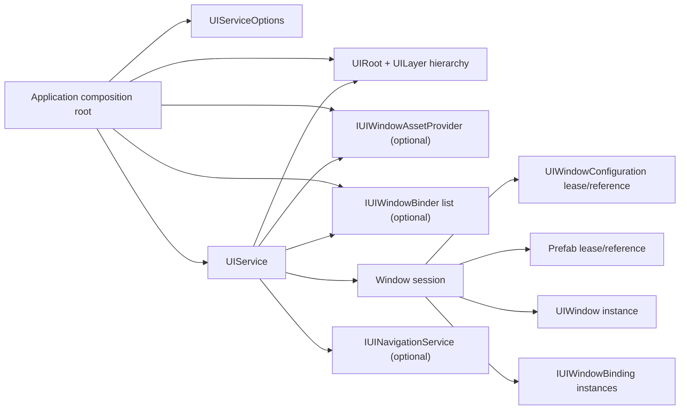
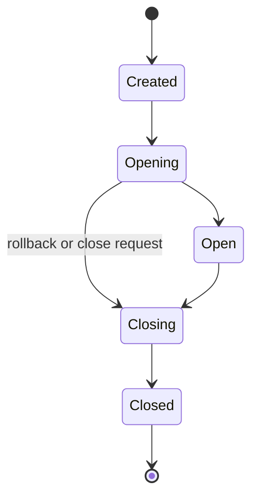

# CycloneGames.UIFramework

[English | 简体中文](README.SCH.md)

CycloneGames.UIFramework owns and coordinates UGUI windows in Unity. It validates configuration, opens and closes windows with async cancellation, binds optional presentation and dependency-injection policies, tracks causal navigation history, and releases every session-owned resource through one main-thread-confined service.

## Table of Contents

- [Overview](#overview)
- [Architecture](#architecture)
- [Quick Start](#quick-start)
- [Core Concepts](#core-concepts)
- [Usage Guide](#usage-guide)
- [Advanced Topics](#advanced-topics)
- [Common Scenarios](#common-scenarios)
- [Performance and Memory](#performance-and-memory)
- [Troubleshooting](#troubleshooting)

## Overview

`UIService` is the central window session owner. It validates configuration assets, resolves layers, binds optional extensions, executes transitions, and disposes every session-owned resource during close, rollback, or shutdown.

Windows open by stable string ID through an asset provider or by direct `UIWindowConfiguration`. Layers order windows by configuration priority. Navigation forms a causal graph of active windows and supports coordinated two-window transitions. Scene-bound windows close automatically when their owner scene changes.

Optional capabilities stay at assembly boundaries. MVP and navigation types live in the core `Runtime` assembly. Asset loading, localization, DI, and motion drivers compile in separate integration assemblies only when their packages are present.

Screen flow, business rules, save data, input handling, and platform SDK integration belong to the composition root or optional binders.

### Key Features

- **`UIService`** as the single main-thread-confined window-session owner with cancellation-aware `UniTask` operations.
- **Explicit binder composition**: transactional per-window extension for MVP, DI, analytics, accessibility, or project policies.
- **Provider-backed loading**: direct-prefab or `IUIWindowAssetProvider` with AssetManagement adapter and session-owned leases.
- **Causal navigation**: active-window graph with coordinated enter/leave transitions and caller-buffered queries.
- **Lifecycle state machine**: `UIWindowState` owned solely by `UIService`; rollback, cleanup, and aggregated failure reporting.
- **Bounded dynamic atlas**: runtime sprite packing with explicit leases; see [Dynamic Atlas Guide](Documents~/DynamicAtlas.md).
- **Localized layouts**: locale-specific geometry and typography overrides; see [Localized Layouts Guide](Documents~/LocalizedLayouts.md).

## Architecture



`UIService` is the sole runtime authority for managed windows. A session begins when `OpenAsync` reserves a window ID and ends after close, failed-open rollback, scene cleanup, immediate disposal, or shutdown.

| Object | Created by | Runtime owner | End of lifetime |
| --- | --- | --- | --- |
| `UIRoot`, layers, configuration assets | Scene or content authoring | Scene/application | Scene or application policy |
| `UIService` | Composition root or optional `UIManager` | Composition root/host | `ShutdownAsync` or `Dispose` |
| `IUIWindowAssetProvider` | Composition root | Composition root | Application policy; `UIService` does not dispose it |
| `IUIWindowBinder` instances | Composition root | Composition root | Application policy; binder set may change only with no active sessions |
| `IUIWindowBinding` | Binder during open | Window session | Reverse-order disposal during cleanup |
| Window GameObject | `UIService` | Window session | Close, rollback, or shutdown |
| Asset leases | Provider, acquired by `UIService` | Window session | Close, rollback, or shutdown |
| Presenter | `UIPresenterBinder` registration policy | Registered release delegate | Binding disposal |

`UIManager` is an optional `MonoBehaviour` lifetime host. It creates a `UIService` from serialized capacities and an explicit `UIRoot`; it is not a global access point. Code that already has a composition root can construct `UIService` directly.

### Assembly layout

| Assembly | Purpose | Activation |
| --- | --- | --- |
| `CycloneGames.UIFramework.Runtime` | Core runtime | Always |
| `CycloneGames.UIFramework.Editor` | Authoring tools | Editor only |
| `CycloneGames.UIFramework.Runtime.Integrations.AssetManagement` | Asset handle/lease adapter | Active; companion package dependency |
| `CycloneGames.UIFramework.Runtime.Integrations.Localization` | Locale layout runtime | Active; companion package dependency |
| `CycloneGames.UIFramework.Editor.Integrations.Localization` | Locale layout authoring | Editor only; companion package dependency |
| `CycloneGames.UIFramework.Runtime.Integrations.VContainer` | Window injection | `jp.hadashikick.vcontainer` package present |
| `...Integrations.LitMotion` | Window transition driver | `com.annulusgames.lit-motion` package present |
| `...Integrations.DOTween` | Window transition driver | `com.demigiant.dotween` package present |
| `...Integrations.PrimeTween` | Window transition driver | `com.kyrylokuzyk.primetween` package present |
| `CycloneGames.UIFramework.Samples` | Opt-in examples | `autoReferenced: false` |

The core runtime references `UniTask`, `CycloneGames.Logger`, and Unity UGUI APIs. Optional DI and motion integrations use asmdef `versionDefines` and `defineConstraints`; do not add their `CYCLONEGAMES_HAS_*` symbols manually to PlayerSettings. AssetManagement and Localization integrations use explicit asmdef references to their local assemblies.

## Quick Start

A direct-reference window needs a `UIRoot`, a `UIWindowConfiguration`, and a composition root that constructs `UIService`.

```csharp
using System;
using System.Threading;
using Cysharp.Threading.Tasks;
using CycloneGames.UIFramework.Runtime;
using UnityEngine;

public sealed class GameUiBootstrap : MonoBehaviour
{
    [SerializeField] private UIRoot uiRoot;
    [SerializeField] private UIWindowConfiguration startupWindow;

    private IUIService _ui;

    private void Start()
    {
        RunAsync(this.GetCancellationTokenOnDestroy()).Forget();
    }

    private async UniTask RunAsync(CancellationToken lifetimeToken)
    {
        try
        {
            var options = new UIServiceOptions
            {
                InitialWindowCapacity = 8,
                MaxActiveWindows = 32,
                MaxInstantiatesPerFrame = 2,
            };

            _ui = new UIService(uiRoot, options: options);
            await _ui.OpenAsync(startupWindow, cancellationToken: lifetimeToken);
            await UniTask.WaitUntilCanceled(lifetimeToken);
        }
        catch (OperationCanceledException) when (lifetimeToken.IsCancellationRequested)
        {
        }
        catch (Exception exception)
        {
            Debug.LogException(exception, this);
        }
        finally
        {
            IUIService service = _ui;
            _ui = null;
            if (service != null)
            {
                try
                {
                    await service.ShutdownAsync(
                        UIShutdownMode.Immediate,
                        CancellationToken.None);
                }
                catch (Exception exception)
                {
                    Debug.LogException(exception, this);
                }
                finally
                {
                    if (!service.IsDisposed)
                    {
                        service.Dispose();
                    }
                }
            }
        }
    }
}
```

Opening with a direct configuration does not require an asset provider when `Source` is `PrefabReference`. For provider-backed loading by stable window ID, supply an `IUIWindowAssetProvider`; the included adapter accepts an application-owned `IAssetPackage` and `IAssetPathBuilder`.

## Core Concepts

### Lifecycle state machine



`UIWindowState` is the single authoritative state for a managed window. `UIWindow` validates each local transition; `UIService` owns the lifecycle workflow, cancellation, rollback, and cleanup. No binder, presenter, transition driver, or DI container owns a competing state machine.

The opening pipeline runs in order: create bindings, notify `OnStartOpen`, run `UIWindow.OnOpening()`, await `IUIWindowTransitionDriver.PlayOpenAsync` when configured, then commit `Open`, run `UIWindow.OnOpened()`, and notify `OnFinishedOpen`. Close uses the symmetric order; if a close hook or transition fails, the service forces the authoritative state to `Closed`, publishes `OnFinishedClose`, continues cleanup, and reports the aggregated failure.

### Extension points

Choose the smallest extension point that owns the work:

- Override protected `UIWindow` hooks for local, synchronous view behavior.
- Implement `IUIWindowBinding` for window-scoped presenters, DI scopes, analytics subscriptions, or other disposable integrations.
- Implement `IAsyncUIWindowBinding` for ordered, cancelable work at pre-commit and post-commit lifecycle boundaries.
- Implement `IUIWindowTransitionDriver` for one-window animation; implement `IUITransitionCoordinator` for two-window navigation animation.

`UIWindowBindingContext` exposes `OpenerId`, `OpenContext`, and the session `LifetimeToken` when a binding is created. The lifetime token is valid through close-stage callbacks and is canceled immediately before binding disposal. Async lifecycle stages receive their own stage token through `IAsyncUIWindowBinding`.

```csharp
public sealed class InventoryWindow : UIWindow
{
    protected override void OnOpening() => SetInteraction(false);
    protected override void OnOpened() => SetInteraction(true);
    protected override void OnClosing() => SetInteraction(false);

    private void SetInteraction(bool enabled)
    {
        if (CanvasGroup == null) return;
        CanvasGroup.interactable = enabled;
        CanvasGroup.blocksRaycasts = enabled;
    }
}

await ui.OpenAsync(
    inventoryConfiguration,
    new UIOpenOptions(transitionDriver: inventoryTransition),
    cancellationToken);
```

### Open and close behavior

- `OpenAsync(windowId)` reserves the ID before loading and requires a provider.
- `OpenAsync(configuration)` uses the supplied configuration; non-direct prefab sources still require a provider.
- Concurrent opens for the same ID join the same session completion only when the configuration reference and every `UIOpenOptions` value match exactly.
- Reaching `MaxActiveWindows` fails before creating another session.
- Configuration, layer, prefab, binders, transition, and navigation registration are one rollback boundary.
- Destroying a managed window outside `UIService` ownership triggers cleanup.

`CloseAsync` is idempotent for an in-progress close and returns `false` for an unknown or empty ID. When navigation is enabled, `ChildClosePolicy` controls descendants: `Reparent` reconnects children to the removed window's active opener, `Cascade` closes the complete subtree, and `Detach` leaves children active as root nodes. Caller cancellation stops waiting; the authoritative close continues.

### Shutdown behavior

- `ShutdownAsync(Immediate)` cancels operations, destroys managed windows, disposes bindings and leases, clears navigation, disposes the service, and drains provider acquisitions already in flight.
- `ShutdownAsync(Animated)` closes sessions in reverse order through their transition drivers before disposal.
- `Dispose()` is the synchronous, non-draining emergency path; it must run on the owning Unity main thread. A composition root must await shutdown with a token that remains valid during teardown, commonly `CancellationToken.None` after its lifetime token has fired.

`IsSceneBound` captures the active scene handle at open request time. A committed window closes when a later active-scene change no longer matches that handle.

## Usage Guide

### UIRoot and layers

A `UIRoot` requires an explicit root `Canvas` and a serialized list of `UILayer` components. Each layer requires a `Canvas` and `GraphicRaycaster`. At initialization, `UIRoot` validates that the root Canvas exists and uses a `RectTransform`, every layer entry is non-null, and every layer has a non-empty, unique ordinal name. `UILayerConfiguration.LayerName` must exactly match one registered `UILayer.LayerName`. Windows within a layer are ordered by configuration priority, then by insertion order for equal priorities.

### UIWindowConfiguration

| Field | Meaning |
| --- | --- |
| `WindowId` | Stable, non-empty ID; unique among active sessions |
| `Source` | `PrefabReference`, `PathLocation`, or `AssetReference` |
| `WindowPrefab` | Direct prefab for `PrefabReference` |
| `PrefabLocation` | Provider location for `PathLocation` |
| `PrefabAssetReference` | Provider-neutral runtime location plus Editor tracking GUID |
| `Layer` | Layer configuration whose name resolves in `UIRoot` |
| `Priority` | Ordering within that layer |
| `IsSceneBound` | Close when the owning active scene changes |
| `CanvasIsolationPolicy` | Inherit the layer Canvas or add an isolated child Canvas |

The prefab root must contain a `UIWindow`-derived component. `UIAssetReference.Location` is the runtime contract; `EditorGuid` is authoring metadata and must not be treated as a Player address.

### AssetManagement-backed windows

```csharp
using CycloneGames.AssetManagement.Runtime;
using CycloneGames.UIFramework.Runtime;
using CycloneGames.UIFramework.Runtime.Integrations;

public sealed class UiComposition
{
    private readonly IUIService _ui;

    public UiComposition(
        UIRoot root,
        IAssetPackage package,
        IAssetPathBuilder configurationPathBuilder)
    {
        var provider = new AssetManagementUIWindowAssetProvider(
            package,
            configurationPathBuilder);

        var options = new UIServiceOptions
        {
            DefaultAssetLoadContext = new UIAssetLoadContext(
                sharedBucket: "ui",
                sharedTag: "frontend",
                sharedOwner: "game-client"),
        };

        _ui = new UIService(root, provider, options);
    }
}
```

Effective `UIAssetLoadContext` metadata uses this precedence for every non-null field: per-open `UIOpenOptions.AssetLoadContext`, then `UIAssetContextProvider` on the `UIRoot`, then `UIServiceOptions.DefaultAssetLoadContext`. An empty string is an explicit value; use `null` to inherit a fallback field. The adapter disposes configuration and prefab handles on close, rollback, or shutdown.

### Window with MVP

MVP is opt-in. `UIPresenterBinder` stores registrations on one binder instance and performs no reflection discovery.

```csharp
public interface ILoginView
{
    void SetListener(ILoginViewListener listener);
    void ShowValidationError(string message);
}

public interface ILoginViewListener : IUIViewListener
{
    void OnSubmit();
}

public sealed class LoginWindow : UIWindow, ILoginView
{
    private ILoginViewListener _listener;
    public void SetListener(ILoginViewListener listener) => _listener = listener;
    public void ShowValidationError(string message) { }
    public void UICmd_Submit() => _listener?.OnSubmit();
}

public sealed class LoginPresenter :
    UIPresenter<ILoginView>,
    ILoginViewListener
{
    protected override void OnViewBound() => View.SetListener(this);
    public void OnSubmit() { /* Validate and invoke application services. */ }
    public override void Dispose()
    {
        View?.SetListener(null);
        base.Dispose();
    }
}
```

Register before opening any window. For each successful binding, callbacks occur in order: `SetUIService`, `SetView` and `OnViewBound`, `OnViewOpening`, `OnViewOpened`, `OnViewClosing`, `OnViewClosed`, then the registered release delegate. A failed binding runs the release delegate during rollback.

```csharp
var presenterBinder = new UIPresenterBinder(initialCapacity: 8);
presenterBinder.Register<LoginPresenter>("Login");

IUIWindowBinder[] binders = { presenterBinder };
var ui = new UIService(root, assetProvider: provider, options: options, binders: binders);
```

When a presenter must consume caller data during `OnViewOpening`, use the contextual factory. `OpenContext` is caller-owned in-memory data, not a serialized or trusted contract; validate its type and contents at the feature boundary.

```csharp
presenterBinder.RegisterContextual<LoginPresenter>(
    "Login",
    context =>
    {
        if (!context.TryGetOpenContext<LoginOpenRequest>(out var request))
        {
            throw new InvalidOperationException("LoginOpenRequest is required.");
        }
        return loginPresenterFactory.Create(request, context.LifetimeToken);
    });
```

### Window with DI

DI is a composition choice. A project-specific `IUIWindowBinder` can inject a window through any container. The optional VContainer adapter is enabled only when its UPM package is present.

```csharp
using CycloneGames.UIFramework.Runtime;
using CycloneGames.UIFramework.Runtime.Integrations;
using VContainer;

IUIWindowBinder[] binders =
{
    new VContainerWindowBinder(resolver),
};

var ui = new UIService(root, provider, options, binders);
```

Compose independent binders in the order required by the window. The first failing binder aborts the open transaction; already-created bindings are disposed in reverse order. Each binder has one responsibility.

```csharp
var presenterBinder = new UIPresenterBinder(initialCapacity: 8);
presenterBinder.Register<LoginPresenter>(
    "Login",
    factory: () => resolver.Resolve<LoginPresenter>(),
    release: presenter => presenter.Dispose());

IUIWindowBinder[] binders =
{
    new VContainerWindowBinder(resolver), // inject the window first
    presenterBinder,                      // then bind the presenter
};
```

### Navigation

Add a `UINavigationService` through options. The graph contains active windows only. `OpenerId` must already be active, cannot equal the child ID, and determines back navigation. Context is an in-memory object reference released when its node is removed or the graph is cleared.

```csharp
var navigation = new UINavigationService(initialCapacity: 16);
var options = new UIServiceOptions { NavigationService = navigation };
var ui = new UIService(root, provider, options);

await ui.OpenAsync("MainMenu", cancellationToken: token);
await ui.OpenAsync(
    "Settings",
    new UIOpenOptions(openerId: "MainMenu", context: settingsContext),
    token);
```

Use caller-owned buffers for inspection. After warm-up, `CopyHistory`, `CopyAncestors`, and `CopyChildren` avoid query-result collection allocation when capacity is sufficient.

```csharp
var history = new List<UINavigationEntry>(16);
ui.NavigationService.CopyHistory(history);
```

`NavigateAsync` opens or resolves the entering window, lets one coordinator animate both live windows, then closes the leaving window. Only one coordinated navigation may run per `UIService`; overlap fails fast. The entering window's individual open transition is suppressed. The commit point is immediately before the irreversible close of the leaving window.

```csharp
var coordinator = new SlideTransitionCoordinator(duration: 0.3f);

UIWindow inventory = await ui.NavigateAsync(
    leavingWindowId: "MainMenu",
    enteringWindowId: "Inventory",
    coordinator: coordinator,
    direction: NavigationDirection.Forward,
    enteringOptions: new UIOpenOptions(context: inventoryContext),
    cancellationToken: token);
```

`CrossFadeTransitionCoordinator` and `SlideTransitionCoordinator` use unscaled time. `SlideTransitionCoordinator` uses cross-fade for `NavigationDirection.Replace`.

### Window transitions

`IUIWindowTransitionDriver` controls one window's open and close animation; `IUITransitionCoordinator` controls a pair during navigation. Set a default driver through `UIServiceOptions`, or override per open. Use `suppressWindowTransition: true` only when another authority animates the complete operation. Optional motion assemblies provide drivers for `FadeConfig`, `ScaleConfig`, `SlideConfig`, and `CompositeConfig`; they compile only when the corresponding package is installed.

### Canvas, input, and resolution

- Configure `CanvasScaler` on the root Canvas for the product's reference resolution and match policy.
- Keep most windows on `InheritLayerCanvas`; it preserves batching and avoids an extra Canvas and raycaster. Use `IsolatedCanvas` only when measured to help.
- Add `CanvasGroup` to windows that need visibility control or built-in coordinated transitions.
- Layer Canvases own sorting ranges; configuration priority controls sibling order only within one layer.
- The application owns EventSystem selection, keyboard/gamepad focus, touch gestures, back-button mapping, local-multiplayer input routing, and safe-area adaptation.

`GetRootCanvasSize()` returns the current root `RectTransform` size. `GetUICamera()` may return `null` for overlay configurations.

## Advanced Topics

### Binder transaction semantics

`UIService` invokes bindings in creation order from its owner thread and switches back to the Unity main thread after each asynchronous wait before touching authoritative state or Unity objects. A binding controls its own internal continuations and must marshal them before using Unity APIs. An opening-stage failure rolls back the complete session. Close-stage failures are aggregated while remaining callbacks and cleanup still run. A close requested during opening callback dispatch is deferred until that dispatch unwinds; an async callback must honor its token and must not await the same session's `CloseAsync` from inside its own lifecycle stage.

### Presenter navigation

`UIPresenter<TView>.NavigateToAsync` records the current window as the opener of the entering window. `NavigateBackAsync` closes only the current window using the selected `ChildClosePolicy`. When an active opener exists, that opener remains the same live session; its original `UIOpenOptions`, context, asset leases, and window instance are preserved without another `OpenAsync` call. When no active opener exists, the current window is still closed and no replacement window is created or loaded.

### Editor authoring

Open `Tools > CycloneGames > UI Framework > UIWindow Creator` to generate a window script, prefab, configuration, and optional MVP files. Before generation, choose project-owned output folders, select the template prefab and layer configuration, assign a stable window ID and source mode, and confirm every generated script folder resolves through its nearest asmdef/asmref to a Player-capable assembly that can reference `CycloneGames.UIFramework.Runtime`. The creator revalidates template, canonical `Assets/` paths, assembly graph, and collisions before writing. Script files use a same-directory temporary file and a create-new move; prefab and configuration assets are first created at unique temporary paths, then committed with `AssetDatabase.MoveAsset`. Pending binding uses a bounded, schema-versioned journal that survives reloads.

For manual authoring, use:

- `Assets > Create > CycloneGames > UIFramework > Window Configuration`
- `Assets > Create > CycloneGames > UIFramework > Layer Configuration`
- `Assets > Create > CycloneGames > UIFramework > UI Asset Context Asset`

### Diagnostics and observability

`GetPerformanceStats()` returns counts for sessions, lifecycle phases, scene-bound windows, binders, isolated Canvases, layers, and the configured maximum. `CopyLayerRuntimeStats` and `CopyActiveWindows` write into caller-owned buffers. `DynamicAtlasService.GetStats()` reports pages, entries, references, estimated texture bytes, utilization, copy paths, cache hits, and failures. `Tools > CycloneGames > UI Framework > Runtime Monitor` reads these bounded snapshots from an explicitly selected `UIManager`. `Performance Auditor` starts only when `Scan Project` is pressed; it reports review candidates for layout authority, raycasts, materials, textures, masks, and canvas boundaries without modifying assets.

`UIPresenterBinder.LogMissingPresenterMappings` reports unmapped windows during development. Keep it disabled when missing mappings are intentionally common or when logging volume would be harmful.

## Common Scenarios

### Bootstrap a startup window with clean shutdown

The Quick Start example shows the full lifetime: construct `UIService`, open a configuration, await cancellation, then shut down with `UIShutdownMode.Immediate` and dispose in `finally`. This pattern gives the composition root a deterministic teardown path that survives exceptions and cancellation.

### Open by ID with AssetManagement

```csharp
public UniTask<UIWindow> OpenAsync(string windowId, CancellationToken token)
{
    return _ui.OpenAsync(windowId, cancellationToken: token);
}
```

The configuration path builder resolves `WindowId` to the configuration asset location. A configuration using `PathLocation` or `AssetReference` then provides the prefab location. The adapter holds acquired handles through session leases and disposes them on close, rollback, or shutdown.

### Coordinated menu-to-inventory transition

```csharp
var coordinator = new SlideTransitionCoordinator(duration: 0.3f);

UIWindow inventory = await ui.NavigateAsync(
    leavingWindowId: "MainMenu",
    enteringWindowId: "Inventory",
    coordinator: coordinator,
    direction: NavigationDirection.Forward,
    enteringOptions: new UIOpenOptions(context: inventoryContext),
    cancellationToken: token);
```

Coordinators must restore modified visual and input state before propagating pre-commit cancellation. A newly opened entering window is rolled back if opening, coordination, cancellation, or ownership validation fails before commit.

### Scene-bound popup cleanup

Set `IsSceneBound` on a configuration so a committed window closes automatically when a later active-scene change no longer matches the handle captured at open request time. This keeps popups tied to the scene that owns them without manual close calls in every transition path.

## Performance and Memory

### Capacity controls

| Option | Default | Behavior |
| --- | ---: | --- |
| `InitialWindowCapacity` | 16 | Initial session dictionary/list capacity |
| `MaxActiveWindows` | 64 | Hard bound for reserved, opening, open, and closing sessions |
| `MaxInstantiatesPerFrame` | 2 | Per-service instantiation budget; excess requests yield to later Update frames |

Choose values from measured concurrent UI demand. A larger initial capacity trades retained managed memory for fewer growth reallocations. The maximum is a stability boundary, not a target occupancy.

### Allocation profile

Open and close are lifecycle operations, not zero-allocation hot loops. A session can allocate a session object, cancellation source, completion sources, asset leases, a window instance, and a binding array. A provider-backed open also allocates one short-lived drain completion source for each configuration or prefab acquisition so awaited shutdown can prove no provider call remains in flight.

For recurring diagnostics and navigation queries, retain and reuse `List<T>` buffers, pre-size them to the observed maximum, and use `CopyActiveWindows`, `CopyLayerRuntimeStats`, and navigation `Copy*` methods. The service has no per-frame polling loop; work occurs during explicit operations, active transitions, provider waits, and scene-change cleanup.

### Cache and lease policy

The window-session service does not pool window GameObjects and does not keep a closed-window cache. The provider may share underlying assets, but every successful acquisition returns a session-owned lease. Leases are disposed after binding cleanup and window destruction. Dynamic atlas retention is an independent, explicitly bounded cache with its own sprite leases and trimming policy. Do not add pooling until profiling shows instance churn is a material cost and the product can define capacity, reset, exhaustion, stale-reference, scene, and shutdown policies.

### Threading, AOT, and stripping

`UIService` and `DynamicAtlasService` capture their Unity owner thread and reject use from another thread. Binders, presenters, lifecycle callbacks, transitions, hierarchy changes, locale layout application, texture copies, and lease consumption also run on that thread. An asset provider may perform backend I/O or decompression under its own policy; completed Unity objects are switched back to the main thread before validation and instantiation. Do not add locks around Unity object access; marshal work to the owner thread instead.

The core does not use reflection discovery, runtime code generation, or JIT-only delegates. Presenter mappings and binders are explicit, suitable for IL2CPP/AOT composition. A third-party container or content backend may still require its own generated registrations or `link.xml`. Validate stripping in a representative Player build; Editor compilation is insufficient evidence. WebGL has no general managed worker-thread assumption; the main-thread-confined API and asynchronous yielding work without requiring background threads.

### Memory safety checklist

- Never retain a `UIWindow`, presenter view, binding context, or navigation context after its session ends.
- Make binding and presenter disposal idempotent.
- Do not destroy managed windows directly; call `CloseAsync`.
- Do not dispose provider handles outside their lease owner.
- Keep each dynamic-atlas lease alive while any `Image` uses its sprite, then dispose it exactly once.
- Bound `MaxActiveWindows` and content-system cache budgets independently.
- Profile retained Unity objects after repeated open/close and scene changes.

## Troubleshooting

| Symptom | Likely cause | Resolution |
| --- | --- | --- |
| `Window configuration requires a stable WindowId` | `WindowId` empty | Populate `WindowId`; do not rely on asset or GameObject name |
| `Opening by id requires an IUIWindowAssetProvider` | No provider supplied | Supply a provider or call `OpenAsync(configuration)` with a direct prefab |
| Configuration incomplete | Missing source-specific reference/location or layer | Verify source-specific reference/location, layer, and layer name |
| Layer not registered | Name mismatch | Match `UILayerConfiguration.LayerName` to `UILayer.LayerName` exactly |
| Prefab does not contain `UIWindow` | Derived component missing | Put the derived component on the prefab root |
| Window capacity reached | `MaxActiveWindows` hit | Close unused sessions or raise the measured budget |
| Binder registration cannot change | Active sessions exist | Close all windows before registering/unregistering binders |
| Navigation registration rejected | Invalid opener or self-reference | Use an active opener, a unique child ID, and no self-reference |
| Coordinated navigation already in progress | Overlap call | Serialize navigation commands in the application flow |
| Calls fail from a worker thread | Off-main-thread use | Marshal to the Unity main thread before using `IUIService` |
| Asset retained after close | Provider sharing/cache policy | Inspect provider sharing/cache policy and confirm lease disposal |
| Input blocked after cancellation | Transition did not restore state | Ensure the custom transition restores `CanvasGroup` and focus in `finally` |

## Validation

Run focused tests from Unity Test Runner:

```text
<UnityEditor> -batchmode -nographics -projectPath <repo-root>/UnityStarter \
  -runTests -testPlatform EditMode \
  -testFilter CycloneGames.UIFramework \
  -testResults <result-path> -quit
```

Open `Samples/SampleScene.unity` to observe open, transition, and clean shutdown in Play Mode. The sample assembly is not auto-referenced. See [Samples/README.md](Samples/README.md) for the exact scene setup and run steps. Do not generalize an EditMode pass to Player, IL2CPP, WebGL, mobile, console, long-session stability, or global zero-GC behavior.

## API Reference

| Type/member | Purpose |
| --- | --- |
| `UIService(UIRoot, IUIWindowAssetProvider, UIServiceOptions, IReadOnlyList<IUIWindowBinder>)` | Construct one explicit service authority |
| `OpenAsync(string, UIOpenOptions, CancellationToken)` | Provider-backed open by stable ID |
| `OpenAsync(UIWindowConfiguration, UIOpenOptions, CancellationToken)` | Open with an explicit configuration |
| `CloseAsync(string, ChildClosePolicy, CancellationToken)` | Close one session and apply navigation child policy |
| `NavigateAsync(string, string, IUITransitionCoordinator, NavigationDirection, UIOpenOptions, CancellationToken)` | Coordinated enter/leave transaction |
| `ShutdownAsync(UIShutdownMode, CancellationToken)` | Ordered service teardown |
| `Dispose()` | Immediate synchronous teardown |
| `UIServiceOptions` | Initial/max capacity, instantiation budget, default load context/transition, navigation service |
| `UIOpenOptions` | Opener, context, scene-bound override, per-open load context/transition, transition suppression |
| `IUIWindowAssetProvider` | Acquire configuration and prefab leases |
| `IAssetLease<T>` | Exactly-once session-owned asset acquisition |
| `UIAssetReference` | Provider-neutral runtime location and Editor GUID metadata |
| `UIAssetLoadContext` | Immutable bucket/tag/owner metadata for configuration and prefab |
| `IUIWindowBinder` / `IUIWindowBinding` | Transactional per-window extension and lifetime handle |
| `UIWindowBindingContext` | Window/service, opener, caller context, and session lifetime token |
| `IAsyncUIWindowBinding` | Ordered, cancelable work at pre-commit and post-commit lifecycle boundaries |
| `UIPresenterBinder` | Instance-owned explicit or contextual presenter registration |
| `UIPresenter<TView>` | Optional strongly typed presenter lifecycle |
| `IUINavigationService` | Active causal graph and caller-buffered queries |
| `IUIWindowTransitionDriver` | One-window open/close transition |
| `IUITransitionCoordinator` | Two-window navigation transition |
| `TryGetWindow`, `CopyActiveWindows` | Active window lookup/snapshot |
| `GetPerformanceStats`, `CopyLayerRuntimeStats` | Bounded runtime diagnostics |
| `DynamicAtlasService`, `DynamicAtlasSpriteLease` | Bounded runtime sprite packing with explicit ownership |
| `UILocaleLayout`, `LocalizationWindowBinder` | Locale layout snapshots and transactional window-scoped localization binding |
