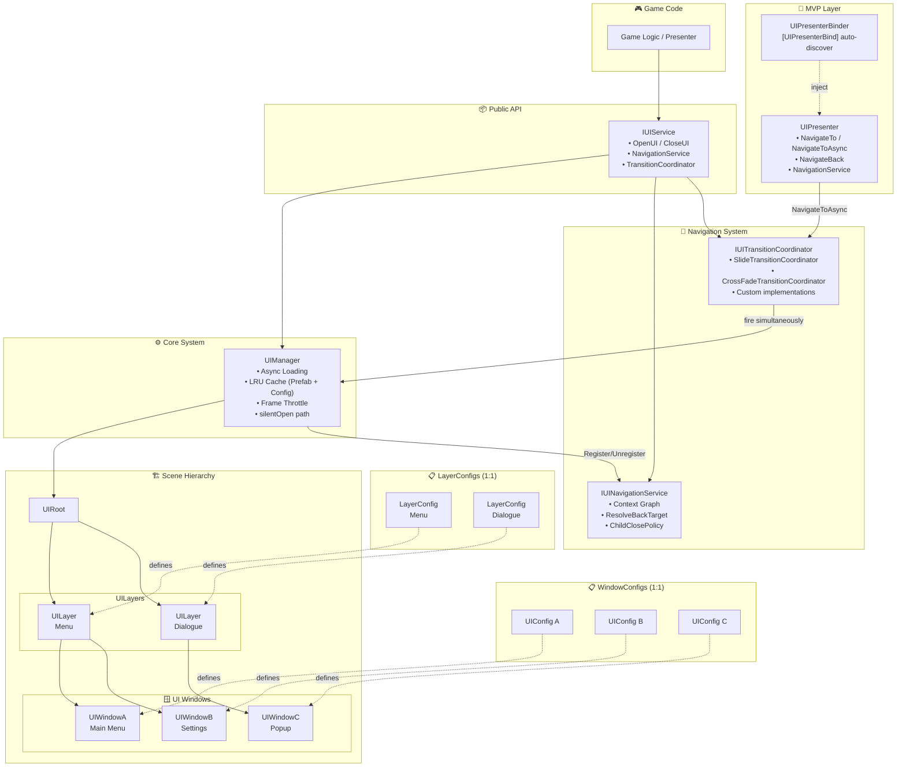
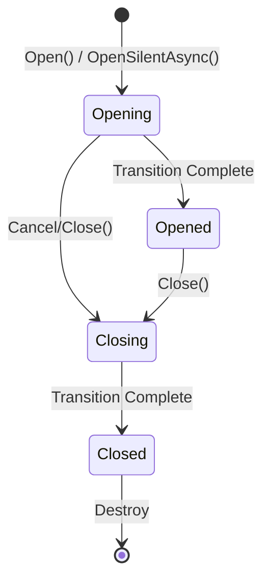
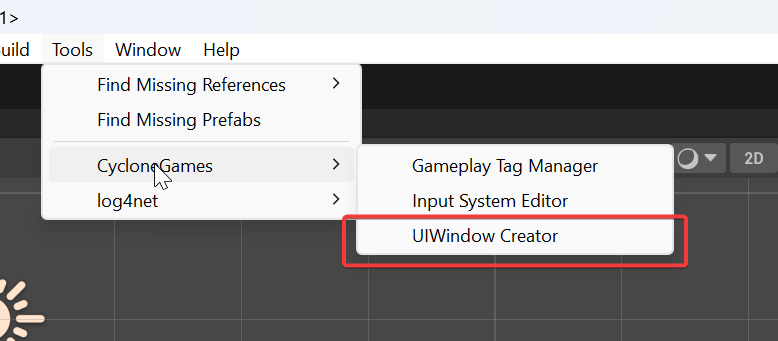
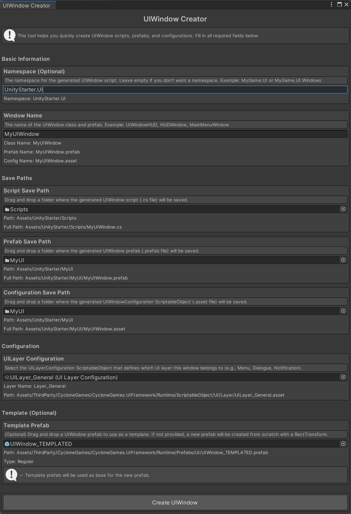

# CycloneGames.UIFramework

<div align="left">English | <a href="./README.SCH.md">简体中文</a></div>

**UI framework** for Unity designed for large-scale commercial projects. Beyond basic window management, it offers a complete navigation context graph, coordinated multi-window transitions, an MVP auto-binding system, LRU asset caching, Dynamic Atlas texture batching, and first-class DI/IoC support, all built around a zero-GC, thread-safe runtime core.

## Features

### 🏗️ Architecture & Scalability

| Feature                     | Detail                                                                                                                                                                   |
| --------------------------- | ------------------------------------------------------------------------------------------------------------------------------------------------------------------------ |
| **MVP Auto-Binding**        | Decorate a Presenter with `[UIPresenterBind("WindowName")]` — binding, lifecycle forwarding, and injection happen automatically with zero boilerplate                    |
| **DI / IoC**                | All contracts are interfaces (`IUIService`, `IUINavigationService`, `IUITransitionCoordinator`, etc.). Drop-in compatible with VContainer, Zenject, or any IoC container |
| **Data-Driven Config**      | Every window and layer is configured via `ScriptableObject`, giving designers full control without touching code                                                         |
| **Service-Oriented Facade** | `IUIService` is the single public API; internal `UIManager` complexity stays hidden                                                                                      |

### 🧭 Navigation Context Graph

| Feature                          | Detail                                                                                                                                       |
| -------------------------------- | -------------------------------------------------------------------------------------------------------------------------------------------- |
| **Directed Graph (not a stack)** | Windows can have multiple openers and survive non-linear closures; "Back" always resolves the nearest alive ancestor                         |
| **Context Payload**              | Pass any typed object when opening; the target retrieves it any time via `NavigationService.GetContext()`                                    |
| **Child-Close Policies**         | `Reparent` (re-attach to grandparent), `Cascade` (force-close descendants), or `Detach` (become a root)                                      |
| **Zero-GC Queries**              | Navigation reads (`GetAncestors`, `ResolveBackTarget`, `GetHistory`) are thread-safe via `ReaderWriterLockSlim`; writes are main-thread only |
| **Immutable Entry Structs**      | `UINavigationEntry` is a `readonly struct` — no heap allocation per record                                                                   |

### 🎬 Transition Coordinator (Simultaneous & Stacked Animations)

| Feature                               | Detail                                                                                                                        |
| ------------------------------------- | ----------------------------------------------------------------------------------------------------------------------------- |
| **Coordinated Two-Window Transition** | `NavigateToAsync()` fires both exit and entry animations on the **same frame** — no visible gap between windows               |
| **Stacked / Cascading Opens**         | Call `NavigateTo()` from `OnViewOpening()` to start window C while B is still animating — creates cascading layered entrances |
| **Built-in Coordinators**             | `SlideTransitionCoordinator` (directional page-flip) and `CrossFadeTransitionCoordinator` (alpha dissolve) included           |
| **Custom Coordinators**               | Implement `IUITransitionCoordinator` for any effect: zoom, elastic, blur — animation-library agnostic                         |
| **Automatic Fallback**                | No coordinator? `NavigateToAsync()` silently degrades to sequential `NavigateTo()` — zero breaking changes                    |
| **Independent Popup Animations**      | Non-coordinated windows use their own `IUIWindowTransitionDriver` and are completely unaffected                               |

### ⚡ Performance

| Feature                              | Detail                                                                                                            |
| ------------------------------------ | ----------------------------------------------------------------------------------------------------------------- |
| **Asset Lifecycle Delegation** | `UIManager` holds one `IAssetHandle<T>` per asset; lifecycle (RefCount, eviction) is fully owned by `AssetCacheService` (W-TinyLFU) | 
| **Per-Frame Instantiation Throttle** | Spread heavy instantiation across frames to avoid spikes                                                          |
| **Dynamic Atlas System**             | Packs runtime sprites into a single GPU texture at open-time, dramatically reducing draw-calls for icon-heavy UIs |
| **Compressed Atlas Variant**         | `CompressedDynamicAtlasService` uses ASTC/DXT/ETC to reduce VRAM footprint for mobile targets                     |
| **Async by Design**                  | Every load, instantiate, and open operation is `UniTask`-based — never blocks the main thread                     |

### 🔒 Reliability & Safety

| Feature                           | Detail                                                                                                   |
| --------------------------------- | -------------------------------------------------------------------------------------------------------- |
| **Formal Window State Machine**   | `Opening → Opened → Closing → Closed` prevents duplicate opens, double-closes, and race conditions       |
| **Memory-Safe Lifecycle**         | `OnReleaseAssetReference` ensures Addressable handles are released exactly once, even under cancellation |
| **CancellationToken Propagation** | All async paths accept `CancellationToken`; cancel cleanly without leaks or orphaned GameObjects         |
| **Thread-Safe Navigation**        | Navigation graph reads are safe from any thread; mutations are guarded to the main thread                |

## Core Architecture



### 1. `UIService` (The Facade)

The primary public API. All game code and presenters interact exclusively through `IUIService`, keeping the internal `UIManager` fully encapsulated. In DI environments, bind `IUIService` as a singleton and inject it anywhere. It also owns `NavigationService` and `TransitionCoordinator` references, making the full advanced feature set accessible from a single injection point.

### 2. `UIManager` (The Core)

Orchestrates the full window lifecycle:

- **Async Loading**: Loads configs and prefabs via `CycloneGames.AssetManagement`.
- **Handle Ownership**: Direct `IAssetHandle<T>` dictionaries replace the former LRU cache. Each unique asset path owns exactly one handle; `Dispose()` signals `AssetCacheService` (W-TinyLFU) to decrement the RefCount, allowing idle assets to flow from Active → Trial → Main pools and eventually be evicted.
- **Instantiation Throttling**: Caps per-frame instantiations to smooth out spikes.
- **silentOpen path**: `OpenSilentAsync()` loads a window into the ready state without animation — used by `CoordinatedNavigateAsync` so the coordinator drives both windows simultaneously from the same frame.

### 3. `UIRoot` & `UILayer` (Scene Hierarchy)

- **`UIRoot`**: Root anchor for all UI, owns the UI Camera and all layers.
- **`UILayer`**: A named sorting layer (e.g. `Menu`, `Dialogue`, `HUD`, `Overlay`). Each window belongs to exactly one layer, controlling render order and input priority.

### 4. `UIWindow` (The UI Unit)

Base class for every panel, page, or popup:



`OpenSilentAsync()` advances the state machine and notifies binders **without** playing the transition animation — enabling the Transition Coordinator to synchronise two-window animations.

### 5. `UIWindowConfiguration` (Data-Driven Configuration)

A `ScriptableObject` defining the prefab source, target layer, and optional per-window overrides. Designers configure windows without touching code.

### 6. `IUIWindowTransitionDriver` (Per-Window Animation)

Controls a **single** window's open/close animation. Use this for per-window effects: popups, tooltips, toast notifications. Works independently of and alongside the Transition Coordinator.

### 7. `IUITransitionCoordinator` (Two-Window Coordinated Animation)

Drives **two** windows simultaneously. When registered on `IUIService`, all `NavigateToAsync()` calls use it to create seamless page-flip, cross-fade, or any custom effect. Implement the 3-line interface to bring in DOTween, LitMotion, or any animation system.

## Dependencies

- `com.cysharp.unitask`
- `com.cyclone-games.assetmanagement`
- `com.cyclone-games.factory`
- `com.cyclone-games.logger`
- `com.cyclone-games.service`

## Asset Management & Memory Strategy

UIFramework has a **first-class dependency** on `CycloneGames.AssetManagement`. It does **not** manage its own eviction cache — all asset lifecycle decisions are delegated entirely to `AssetCacheService`.

### How it works

```
OpenUI("MyWindow")
  └─ assetPackage.LoadAssetAsync<UIWindowConfiguration>(path, bucket: "UIFramework")
       └─ AssetCacheService: cache hit → Retain() (RefCount ↑)
            OR cache miss → load, register node, RefCount = 1
       └─ UIManager stores the IAssetHandle<T> reference

CloseUI("MyWindow")
  └─ UIManager: configHandle.Dispose()   → AssetCacheService: RefCount ↓
  └─ UIManager: prefabHandle.Dispose()   → if no other window uses same prefab
       └─ RefCount → 0 → asset enters idle pool (Trial/Main via W-TinyLFU)
       └─ W-TinyLFU decides eviction vs. promotion based on access frequency
```

### Key design properties

| Property | Detail |
|---|---|
| **Single RefCount system** | No private counter in UIManager — AssetCacheService is the sole authority |
| **`"UIFramework"` bucket** | All UI assets are tagged; visible in Cache Debugger under Buckets tab |
| **Prefab sharing** | Multiple windows using the same prefab path share one handle; disposed only when the last window closes |
| **Config handles** | One handle per window name (windowName → config path), released on `CloseUI` |
| **Zero leak on scene unload** | `CleanupAllWindows()` `Dispose()`s every held handle, correctly draining AssetCacheService RefCounts |

## Quick Start Guide

This guide will walk you through setting up and using the UIFramework step by step. Follow along to create your first UI window!

### Step 1: Scene Setup

1. **Locate the UIFramework Prefab**: Find the `UIFramework.prefab` in the package at `Runtime/Prefabs/UI/UIFramework.prefab`.
2. **Add to Scene**: Either:
   - Drag the prefab directly into your scene, or
   - Load it at runtime using your asset management system
3. **Verify Setup**: The prefab contains:
   - `UIRoot` component with UI Camera
   - Default `UILayer` configurations (Menu, Dialogue, Notification, etc.)

The `UIFramework.prefab` is pre-configured with essential components, so you can start using it immediately.

### Step 2: Create `UILayer` Configurations

`UILayer` configurations define the rendering and input layers for your UI windows. The framework comes with several default layers, but you can create custom ones.

1. **Create a New Layer Configuration**:
   - In the Project window, right-click and select **Create > CycloneGames > UIFramework > UILayer Configuration**
   - Name it descriptively, e.g., `UILayer_Menu`, `UILayer_Dialogue`, `UILayer_Notification`

2. **Configure the Layer**:
   - Open the `UILayerConfiguration` asset in the Inspector
   - Set the `Layer Name` (e.g., "Menu", "Dialogue")
   - Adjust the `Sorting Order` if needed (higher values render on top)

3. **Assign to UIRoot**:
   - Select the `UIRoot` GameObject in your scene
   - In the Inspector, find the `Layer Configurations` list
   - Add your newly created `UILayerConfiguration` assets to the list

**Example Layer Setup:**

```
UILayer_Menu (Sorting Order: 100)
UILayer_Dialogue (Sorting Order: 200)
UILayer_Notification (Sorting Order: 300)
```

### Step 3: Create Your First `UIWindow`

There are two ways to create a `UIWindow`: using the quick creation tool or manually. We'll cover both methods.

#### Method 1: Quick Creation (Recommended for Beginners)

The framework provides a convenient editor tool to create all necessary files at once.

1. **Open the UIWindow Creator**:
   - Go to **Tools > CycloneGames > UIWindow Creator** in the Unity menu bar
   - A window will open with all the creation options

2. **Fill in the Required Information**:
   - **Window Name**: Enter a descriptive name (e.g., `MainMenuWindow`, `HUDWindow`)
   - **Namespace** (Optional): If you use namespaces, enter it here (e.g., `MyGame.UI`)
   - **Script Save Path**: Drag a folder where the C# script will be saved
   - **Prefab Save Path**: Drag a folder where the prefab will be saved
   - **Configuration Save Path**: Drag a folder where the `UIWindowConfiguration` asset will be saved
   - **UILayer Configuration**: Select the `UILayerConfiguration` asset you created in Step 2
   - **Template Prefab** (Optional): You can drag a template prefab to use as a base

3. **Create the UIWindow**:
   - Click the **"Create UIWindow"** button
   - The tool will automatically create:
     - A C# script inheriting from `UIWindow`
     - A prefab with the script attached
     - A `UIWindowConfiguration` asset linking everything together

**Visual Guide:**

- 
- 

#### Method 2: Manual Creation

If you prefer to create files manually or need more control:

1. **Create the Script**:

   ```csharp
   using CycloneGames.UIFramework.Runtime;
   using UnityEngine;
   using UnityEngine.UI;

   public class MainMenuWindow : UIWindow
   {
       [SerializeField] private Button playButton;
       [SerializeField] private Button settingsButton;
       [SerializeField] private Button quitButton;

       protected override void Awake()
       {
           base.Awake();

           // Initialize button listeners
           if (playButton != null)
               playButton.onClick.AddListener(OnPlayClicked);
           if (settingsButton != null)
               settingsButton.onClick.AddListener(OnSettingsClicked);
           if (quitButton != null)
               quitButton.onClick.AddListener(OnQuitClicked);
       }

       private void OnPlayClicked()
       {
           Debug.Log("Play button clicked!");
           // Add your game start logic here
       }

       private void OnSettingsClicked()
       {
           Debug.Log("Settings button clicked!");
           // Add your settings logic here
       }

       private void OnQuitClicked()
       {
           Debug.Log("Quit button clicked!");
           Application.Quit();
       }
   }
   ```

2. **Create the Prefab**:
   - Create a new UI `Canvas` or `Panel` in your scene
   - Add your `MainMenuWindow` component to the root `GameObject`
   - Design your UI (add buttons, text, images, etc.)
   - Assign UI element references to the serialized fields in the Inspector
   - Save it as a prefab (drag from Hierarchy to Project window)

3. **Create the Configuration**:
   - Right-click in the Project window and select **Create > CycloneGames > UIFramework > UIWindow Configuration**
   - Name it `UIWindow_MainMenu` (the name you'll use to open the window)
   - In the Inspector:
     - Assign your `MainMenuWindow` prefab to the `Window Prefab` field
     - Assign the appropriate `UILayer` (e.g., `UILayer_Menu`) to the `Layer` field

### Step 4: Initialize and Use the `UIService`

The `UIService` is your main interface for opening and closing UI windows. You need to initialize it once at game startup.

#### Basic Initialization (Using Resources)

If you're using Unity's built-in `Resources.Load`:

```csharp
using CycloneGames.UIFramework.Runtime;
using CycloneGames.Factory.Runtime;
using CycloneGames.Service.Runtime;
using CycloneGames.AssetManagement.Runtime;
using Cysharp.Threading.Tasks;
using UnityEngine;

public class GameInitializer : MonoBehaviour
{
    private IUIService uiService;

    async void Start()
    {
        // Initialize asset management (using Resources)
        IAssetModule module = new ResourcesModule();
        await module.InitializeAsync(new AssetManagementOptions());
        var package = module.CreatePackage("DefaultResources");
        await package.InitializeAsync(default);
        AssetManagementLocator.DefaultPackage = package;

        // Create required services
        var assetPathBuilderFactory = new TemplateAssetPathBuilderFactory();
        var objectSpawner = new DefaultUnityObjectSpawner();
        var mainCameraService = new MainCameraService();

        // Initialize UIService
        uiService = new UIService();
        uiService.Initialize(assetPathBuilderFactory, objectSpawner, mainCameraService);

        // Now you can open UI windows!
        await OpenMainMenu();
    }

    public async UniTask OpenMainMenu()
    {
        // "UIWindow_MainMenu" is the filename of your UIWindowConfiguration asset
        UIWindow window = await uiService.OpenUIAsync("UIWindow_MainMenu");

        if (window != null && window is MainMenuWindow mainMenu)
        {
            Debug.Log("Main menu opened successfully!");
            // You can now interact with the window instance
        }
        else
        {
            Debug.LogError("Failed to open main menu window!");
        }
    }

    public void CloseMainMenu()
    {
        uiService.CloseUI("UIWindow_MainMenu");
    }
}
```

#### Advanced Initialization (Using Asset Packages)

If you're using Addressables, YooAsset, or other asset management systems:

```csharp
using CycloneGames.UIFramework.Runtime;
using CycloneGames.AssetManagement.Runtime;
// ... other using statements

public class GameInitializer : MonoBehaviour
{
    private IUIService uiService;
    private IAssetPackage uiPackage;

    async void Start()
    {
        // Initialize your asset management system
        // This example assumes you have an IAssetPackage instance
        uiPackage = await InitializeYourAssetPackageAsync();

        // Create required services
        var assetPathBuilderFactory = new YourAssetPathBuilderFactory();
        var objectSpawner = new DefaultUnityObjectSpawner();
        var mainCameraService = new MainCameraService();

        // Initialize UIService with package
        uiService = new UIService();
        uiService.Initialize(assetPathBuilderFactory, objectSpawner, mainCameraService, uiPackage);

        // Open UI windows
        await OpenMainMenu();
    }

    // ... rest of your code
}
```

### Step 5: Opening and Closing Windows

Once `UIService` is initialized, opening and closing windows is straightforward:

```csharp
// Open a window asynchronously (recommended)
UIWindow window = await uiService.OpenUIAsync("UIWindow_MainMenu");

// Open a window with callback (fire-and-forget)
uiService.OpenUI("UIWindow_MainMenu", (window) => {
    if (window != null)
        Debug.Log("Window opened!");
});

// Close a window
uiService.CloseUI("UIWindow_MainMenu");

// Close a window asynchronously
await uiService.CloseUIAsync("UIWindow_MainMenu");

// Check if a window is open
bool isOpen = uiService.IsUIWindowValid("UIWindow_MainMenu");

// Get a reference to an open window
UIWindow window = uiService.GetUIWindow("UIWindow_MainMenu");
if (window is MainMenuWindow mainMenu)
{
    // Interact with the window
}
```

### Step 6: Working with Window Lifecycle

Each `UIWindow` has a lifecycle managed by a state machine. You can override methods to hook into different states:

```csharp
public class MyWindow : UIWindow
{
    protected override void Awake()
    {
        base.Awake();
        Debug.Log("Window is being created");
    }

    // Called when window starts opening (before animation)
    protected override void OnStartOpen()
    {
        base.OnStartOpen();
        Debug.Log("Window is opening");
    }

    // Called when window finishes opening (after animation)
    protected override void OnFinishedOpen()
    {
        base.OnFinishedOpen();
        Debug.Log("Window is fully open and interactive");
    }

    // Called when window starts closing (before animation)
    protected override void OnStartClose()
    {
        base.OnStartClose();
        Debug.Log("Window is closing");
    }

    // Called when window finishes closing (after animation, before destruction)
    protected override void OnFinishedClose()
    {
        base.OnFinishedClose();
        Debug.Log("Window is closed and will be destroyed");
    }
}
```

## UI Navigation System Tutorial

After your windows are running, you may want the framework to remember **how the user got here** — so that pressing "Back" always returns to the right screen regardless of the entry path.

The **UI Navigation System** records a live directed graph of window-opener relationships. Unlike a simple stack, it supports non-linear flows: e.g. you can close a middle window while its children remain alive, and "Back" will still resolve correctly.

### Core Concepts

| Term                 | Meaning                                                                                 |
| -------------------- | --------------------------------------------------------------------------------------- |
| **Node**             | A record for one window: who opened it, what payload it carried, when it was registered |
| **Opener**           | The window that triggered this window to open                                           |
| **Ancestor chain**   | The full causal path: `MainMenu → Shop → Detail → Checkout`                             |
| **ChildClosePolicy** | What happens to children when their parent window closes                                |

**ChildClosePolicy options:**

| Policy                 | Effect                                                                |
| ---------------------- | --------------------------------------------------------------------- |
| `Reparent` _(default)_ | Surviving children are re-attached to the closing window's own opener |
| `Cascade`              | All children (and their descendants) are force-closed                 |
| `Detach`               | Children survive but lose their "back" target (become roots)          |

### Step 1: Setting Up the Navigation Service

Create a `UINavigationService` instance and attach it to your `IUIService` **once** during app startup:

```csharp
// Non-DI setup (e.g., in a bootstrap MonoBehaviour)
var navService = new UINavigationService();
uiService.SetNavigationService(navService);

// Tell your PresenterBinder about the UIService so Presenters can navigate
presenterBinder.SetUIService(uiService);
```

With DI (VContainer example):

```csharp
// In your VContainer LifetimeScope
builder.Register<UINavigationService>(Lifetime.Singleton).AsImplementedInterfaces();
// UIService accepts it via IUIService.SetNavigationService
```

### Step 2: Navigating Between Windows (from a Presenter)

`UIPresenter<TView>` exposes two built-in helpers:

```csharp
[UIPresenterBind("UIWindow_Shop")]
public class ShopPresenter : UIPresenter<IShopView>
{
    public void OnClickItemDetail(int itemId)
    {
        // Opens UIWindow_ItemDetail and registers ShopPresenter's window as its opener.
        // The itemId context can be read by ItemDetailPresenter.
        NavigateTo("UIWindow_ItemDetail", new ItemContext { ItemId = itemId });
    }

    public void OnClickBack()
    {
        // Closes this window and opens the nearest still-alive ancestor.
        NavigateBack();
    }
}
```

### Step 3: Reading the Context in the Target Window

```csharp
[UIPresenterBind("UIWindow_ItemDetail")]
public class ItemDetailPresenter : UIPresenter<IItemDetailView>
{
    public override void OnViewOpened()
    {
        // Retrieve the payload passed by the opener
        var ctx = NavigationService?.GetContext("UIWindow_ItemDetail") as ItemContext;
        if (ctx != null)
            View.SetItem(ctx.ItemId);
    }
}
```

### Step 4: Non-Linear Flow — Closing a Middle Window

The default `Reparent` policy handles this automatically. Given the path `A → B → C`:

```csharp
// Close B while C is still open
uiService.CloseUI("UIWindow_B");
// C's opener is now automatically re-parented to A.
// NavigateBack() in C will correctly open A.
```

If B should drag C down with it (e.g., a modal wizard), use `Cascade`:

```csharp
uiService.NavigationService?.Unregister("UIWindow_B", ChildClosePolicy.Cascade);
uiService.CloseUI("UIWindow_B");
```

### Step 5: Querying the Navigation Graph

```csharp
IUINavigationService nav = uiService.NavigationService;

// Who is currently on top?
string current = nav.CurrentWindow;

// What is the full path that led here?
List<string> path = nav.GetAncestors("UIWindow_Checkout");
// → ["UIWindow_MainMenu", "UIWindow_Shop", "UIWindow_ItemDetail"]

// Which windows did Shop open?
List<string> children = nav.GetChildren("UIWindow_Shop");

// Full ordered history (oldest first)
List<UINavigationEntry> history = nav.GetHistory();

// Where would Back go?
string backTarget = nav.ResolveBackTarget("UIWindow_ItemDetail");
```

### API Reference

| Method / Property             | Description                                                         |
| ----------------------------- | ------------------------------------------------------------------- |
| `CurrentWindow`               | Topmost registered window (most recently opened that's still alive) |
| `CanNavigateBack`             | Whether a back-navigation target exists for the current window      |
| `Register(name, opener, ctx)` | Record a new window node (called automatically by UIManager)        |
| `Unregister(name, policy)`    | Remove a window node (called automatically by UIManager on close)   |
| `Clear()`                     | Wipe the entire graph (e.g., on game restart)                       |
| `GetOpener(name)`             | Who opened this window                                              |
| `GetContext(name)`            | Payload object passed when this window was opened                   |
| `GetAncestors(name)`          | Full causal chain, oldest opener first                              |
| `GetChildren(name)`           | Immediate live children                                             |
| `ResolveBackTarget(name)`     | Nearest alive ancestor                                              |
| `GetHistory()`                | Snapshot of all registered windows in insertion order               |

> **Thread Safety**: `Register`, `Unregister`, `Clear` must be called on the main thread. All query methods (`GetAncestors`, `GetHistory`, etc.) are safe from any thread.

## UI Transition Coordinator Tutorial

By default, when you call `NavigateTo()`, each window plays its own open/close animation independently — one finishes before the other starts. The **Transition Coordinator** system lets two windows animate _simultaneously_, creating seamless page-turn effects.

### When to Use Which Approach

| Scenario                                                | Use                                                       |
| ------------------------------------------------------- | --------------------------------------------------------- |
| Popup fades in over background (independent)            | `NavigateTo()` + `IUIWindowTransitionDriver` on the popup |
| Page A slides out while Page B slides in (synchronised) | `NavigateToAsync()` + `IUITransitionCoordinator`          |
| Cross-fade between two full-screen scenes               | `NavigateToAsync()` + `CrossFadeTransitionCoordinator`    |

### Step 1: Register a Coordinator at Startup

```csharp
// Sequential: no coordinator, windows animate independently
// (this is the default, no setup needed)

// Coordinated slide (page-flip feel):
var slideCoordinator = new SlideTransitionCoordinator(duration: 0.35f);
uiService.SetTransitionCoordinator(slideCoordinator);

// Coordinated cross-fade:
var fadeCoordinator = new CrossFadeTransitionCoordinator(duration: 0.25f);
uiService.SetTransitionCoordinator(fadeCoordinator);
```

### Step 2: Navigate With Coordinated Animation (from a Presenter)

```csharp
[UIPresenterBind("UIWindow_Shop")]
public class ShopPresenter : UIPresenter<IShopView>
{
    // Simultaneous animation — A exits while B enters
    public async void OnClickDetail(int itemId)
    {
        await NavigateToAsync(
            "UIWindow_ItemDetail",
            context: new ItemContext { ItemId = itemId },
            direction: NavigationDirection.Forward);
    }

    // Going back
    public async void OnClickBack()
    {
        await NavigateToAsync(
            NavigationService?.ResolveBackTarget(/* myWindowName */) ?? "",
            direction: NavigationDirection.Backward);
        NavigateBack();
    }

    // No coordinator set? NavigateToAsync() silently falls back to NavigateTo()
}
```

### Step 3: Implement a Custom Coordinator

Any animation style is possible by implementing `IUITransitionCoordinator`:

```csharp
// Example: zoom + fade combo for modal dialogs
public class ZoomFadeCoordinator : IUITransitionCoordinator
{
    public async UniTask TransitionAsync(UIWindow leaving, UIWindow entering,
        NavigationDirection direction, CancellationToken ct)
    {
        // leaving: quick alpha fade out
        // entering: scale 0.8 → 1.0 + alpha 0 → 1
        var leavingCg  = leaving.GetComponent<CanvasGroup>();
        var enteringCg = entering.GetComponent<CanvasGroup>();
        var enteringRt = entering.GetComponent<RectTransform>();

        float elapsed = 0f;
        const float duration = 0.3f;
        while (elapsed < duration && !ct.IsCancellationRequested)
        {
            elapsed += Time.unscaledDeltaTime;
            float t = Mathf.Clamp01(elapsed / duration);
            if (leavingCg  != null) leavingCg.alpha  = 1f - t;
            if (enteringCg != null) enteringCg.alpha = t;
            if (enteringRt != null) enteringRt.localScale = Vector3.LerpUnclamped(Vector3.one * 0.85f, Vector3.one, t);
            await UniTask.Yield(PlayerLoopTiming.Update, ct);
        }
    }
}

// Register:
uiService.SetTransitionCoordinator(new ZoomFadeCoordinator());
```

### NavigationDirection

| Value      | When to Use                                                            |
| ---------- | ---------------------------------------------------------------------- |
| `Forward`  | Navigating to a new sub-screen (push). Slide: left exit / right entry. |
| `Backward` | Going back (pop). Slide: right exit / left entry.                      |
| `Replace`  | Replacing current without directional bias (cross-fade).               |

> **Note**: If no coordinator is registered, `NavigateToAsync` automatically falls back to the same behaviour as `NavigateTo` (fire-and-forget, sequential). Existing code never breaks.

## Dynamic Atlas System Tutorial

After mastering the basics of creating and opening UI windows, you can optimize your UI performance using the **Dynamic Atlas System**. This system reduces draw calls by combining multiple UI textures into a single atlas at runtime.

### What is Dynamic Atlas?

In Unity UI, each sprite texture typically requires a separate draw call. If you have 50 different icons on screen, that's potentially 50 draw calls. The Dynamic Atlas System packs these textures into a single large texture (atlas), allowing Unity to batch them together and reduce draw calls significantly.

**Benefits:**

- **Reduced Draw Calls**: Combine multiple textures into one, reducing CPU overhead
- **Better Performance**: Especially important on mobile devices
- **Runtime Packing**: No need to pre-create atlases - textures are packed on demand
- **Automatic Management**: Reference counting ensures textures are freed when no longer needed

### When to Use Dynamic Atlas?

Use Dynamic Atlas when:

- You have many small UI icons/sprites that change frequently
- You want to reduce draw calls without pre-creating static atlases
- Your UI uses many different textures that aren't always visible together
- You need runtime flexibility (e.g., loading icons from server)

Don't use Dynamic Atlas when:

- You have a small number of static UI elements (pre-created atlases are better)
- Your textures are very large (they'll be scaled down, losing quality)
- You need pixel-perfect rendering (atlas packing may introduce slight offsets)

### Step 1: Understanding the Three Usage Patterns

The Dynamic Atlas System provides three ways to use it, each suited for different scenarios:

#### Pattern 1: DynamicAtlasManager (Simplest - Recommended for Beginners)

This is the easiest way to get started. It uses a singleton pattern and works out of the box.

```csharp
using CycloneGames.UIFramework.DynamicAtlas;
using UnityEngine;
using UnityEngine.UI;

public class MyUIWindow : UIWindow
{
    [SerializeField] private Image iconImage;
    private string currentIconPath;

    protected override void Awake()
    {
        base.Awake();

        // Configure Dynamic Atlas (only needed once, typically in initialization)
        // This is optional - it will use defaults if not called
        DynamicAtlasManager.Instance.Configure(
            load: path => Resources.Load<Texture2D>(path),
            unload: (path, tex) => Resources.UnloadAsset(tex),
            size: 2048,  // Atlas page size in pixels
            autoScaleLargeTextures: true
        );
    }

    public void SetIcon(string iconPath)
    {
        // Release previous icon if any
        if (!string.IsNullOrEmpty(currentIconPath))
        {
            DynamicAtlasManager.Instance.ReleaseSprite(currentIconPath);
        }

        // Get sprite from atlas (automatically loads and packs if needed)
        Sprite sprite = DynamicAtlasManager.Instance.GetSprite(iconPath);

        if (sprite != null && iconImage != null)
        {
            iconImage.sprite = sprite;
            currentIconPath = iconPath;
        }
    }

    protected override void OnDestroy()
    {
        // Always release sprites when window is destroyed
        if (!string.IsNullOrEmpty(currentIconPath))
        {
            DynamicAtlasManager.Instance.ReleaseSprite(currentIconPath);
            currentIconPath = null;
        }
        base.OnDestroy();
    }
}
```

#### Pattern 2: Factory Pattern (Recommended for Dependency Injection)

If you're using a DI framework or want more control over the atlas lifecycle:

```csharp
using CycloneGames.UIFramework.DynamicAtlas;
using UnityEngine;
using UnityEngine.UI;

public class MyUIWindow : UIWindow
{
    [SerializeField] private Image iconImage;
    private IDynamicAtlas atlas;
    private string currentIconPath;

    // Inject atlas through constructor or setter
    public void SetAtlas(IDynamicAtlas atlasService)
    {
        atlas = atlasService;
    }

    public void SetIcon(string iconPath)
    {
        if (atlas == null)
        {
            Debug.LogError("Atlas not initialized!");
            return;
        }

        // Release previous icon
        if (!string.IsNullOrEmpty(currentIconPath))
        {
            atlas.ReleaseSprite(currentIconPath);
        }

        // Get sprite from atlas
        Sprite sprite = atlas.GetSprite(iconPath);

        if (sprite != null && iconImage != null)
        {
            iconImage.sprite = sprite;
            currentIconPath = iconPath;
        }
    }

    protected override void OnDestroy()
    {
        if (atlas != null && !string.IsNullOrEmpty(currentIconPath))
        {
            atlas.ReleaseSprite(currentIconPath);
            currentIconPath = null;
        }
        base.OnDestroy();
    }
}

// In your initialization code:
public class GameInitializer : MonoBehaviour
{
    private IDynamicAtlasFactory atlasFactory;

    void Start()
    {
        // Create factory
        atlasFactory = new DynamicAtlasFactory();

        // Create atlas with custom configuration
        var config = new DynamicAtlasConfig(
            pageSize: 2048,
            autoScaleLargeTextures: true
        );
        IDynamicAtlas atlas = atlasFactory.Create(config);

        // Inject into your UI windows
        // (This depends on your DI framework)
    }
}
```

#### Pattern 3: Direct Service (Advanced)

For maximum control, create the service directly:

```csharp
using CycloneGames.UIFramework.DynamicAtlas;
using UnityEngine;
using UnityEngine.UI;

public class MyUIWindow : UIWindow
{
    [SerializeField] private Image iconImage;
    private IDynamicAtlas atlas;
    private string currentIconPath;

    protected override void Awake()
    {
        base.Awake();

        // Create atlas service directly
        atlas = new DynamicAtlasService(
            forceSize: 2048,
            loadFunc: path => Resources.Load<Texture2D>(path),
            unloadFunc: (path, tex) => Resources.UnloadAsset(tex),
            autoScaleLargeTextures: true
        );
    }

    public void SetIcon(string iconPath)
    {
        if (atlas == null) return;

        // Release previous icon
        if (!string.IsNullOrEmpty(currentIconPath))
        {
            atlas.ReleaseSprite(currentIconPath);
        }

        // Get sprite from atlas
        Sprite sprite = atlas.GetSprite(iconPath);

        if (sprite != null && iconImage != null)
        {
            iconImage.sprite = sprite;
            currentIconPath = iconPath;
        }
    }

    protected override void OnDestroy()
    {
        if (atlas != null)
        {
            // Release sprite
            if (!string.IsNullOrEmpty(currentIconPath))
            {
                atlas.ReleaseSprite(currentIconPath);
            }

            // Dispose atlas (only if you created it directly)
            atlas.Dispose();
        }
        base.OnDestroy();
    }
}
```

### Step 2: Complete Example - Icon List with Dynamic Atlas

Here's a complete example showing how to use Dynamic Atlas in a real scenario - an icon list that loads icons dynamically:

```csharp
using CycloneGames.UIFramework.Runtime;
using CycloneGames.UIFramework.DynamicAtlas;
using UnityEngine;
using UnityEngine.UI;
using System.Collections.Generic;

public class IconListWindow : UIWindow
{
    [SerializeField] private Transform iconContainer;
    [SerializeField] private GameObject iconPrefab; // Prefab with Image component

    private List<IconItem> iconItems = new List<IconItem>();

    private class IconItem
    {
        public GameObject gameObject;
        public Image image;
        public string iconPath;
    }

    protected override void Awake()
    {
        base.Awake();

        // Configure Dynamic Atlas (only once)
        if (DynamicAtlasManager.Instance != null)
        {
            DynamicAtlasManager.Instance.Configure(
                load: path => Resources.Load<Texture2D>(path),
                unload: (path, tex) => Resources.UnloadAsset(tex),
                size: 2048,
                autoScaleLargeTextures: true
            );
        }
    }

    public void LoadIcons(List<string> iconPaths)
    {
        // Clear existing icons
        ClearIcons();

        // Load each icon
        foreach (string iconPath in iconPaths)
        {
            CreateIconItem(iconPath);
        }
    }

    private void CreateIconItem(string iconPath)
    {
        if (iconPrefab == null || iconContainer == null)
            return;

        // Instantiate icon prefab
        GameObject iconObj = Instantiate(iconPrefab, iconContainer);
        Image iconImage = iconObj.GetComponent<Image>();

        if (iconImage == null)
        {
            Debug.LogError("Icon prefab must have an Image component!");
            Destroy(iconObj);
            return;
        }

        // Get sprite from Dynamic Atlas
        Sprite sprite = DynamicAtlasManager.Instance.GetSprite(iconPath);

        if (sprite != null)
        {
            iconImage.sprite = sprite;

            // Track this icon item
            iconItems.Add(new IconItem
            {
                gameObject = iconObj,
                image = iconImage,
                iconPath = iconPath
            });
        }
        else
        {
            Debug.LogWarning($"Failed to load icon: {iconPath}");
            Destroy(iconObj);
        }
    }

    private void ClearIcons()
    {
        // Release all sprites from atlas
        foreach (var item in iconItems)
        {
            if (!string.IsNullOrEmpty(item.iconPath))
            {
                DynamicAtlasManager.Instance.ReleaseSprite(item.iconPath);
            }
            if (item.gameObject != null)
            {
                Destroy(item.gameObject);
            }
        }
        iconItems.Clear();
    }

    protected override void OnDestroy()
    {
        // Clean up all icons
        ClearIcons();
        base.OnDestroy();
    }
}
```

### Step 3: Integrating with Asset Management Systems

If you're using Addressables, YooAsset, or other asset management systems, you can integrate them with Dynamic Atlas:

```csharp
using CycloneGames.UIFramework.DynamicAtlas;
using CycloneGames.AssetManagement.Runtime;
using UnityEngine;

public class GameInitializer : MonoBehaviour
{
    private IAssetPackage assetPackage;

    async void Start()
    {
        // Initialize your asset management system
        assetPackage = await InitializeYourAssetPackageAsync();

        // Configure Dynamic Atlas with custom load/unload functions
        DynamicAtlasManager.Instance.Configure(
            load: async (path) =>
            {
                // Load texture using your asset management system
                var handle = await assetPackage.LoadAssetAsync<Texture2D>(path);
                return handle.Asset;
            },
            unload: (path, tex) =>
            {
                // Unload using your asset management system
                assetPackage.ReleaseAsset(path);
            },
            size: 2048,
            autoScaleLargeTextures: true
        );
    }
}
```

### Step 4: Best Practices and Tips

1. **Always Release Sprites**: When a sprite is no longer needed, call `ReleaseSprite()` to decrement the reference count. This allows the atlas to free space when the count reaches zero.

2. **Release in OnDestroy or OnDisable**: Always release sprites when your UI component is destroyed or disabled:

```csharp
protected override void OnDestroy()
{
    if (!string.IsNullOrEmpty(currentIconPath))
    {
        DynamicAtlasManager.Instance.ReleaseSprite(currentIconPath);
        currentIconPath = null;
    }
    base.OnDestroy();
}
```

3. **Use Appropriate Page Size**:
   - **1024x1024**: For low-end devices or when memory is constrained
   - **2048x2048**: Recommended for most cases (default)
   - **4096x4096**: For high-end devices with plenty of memory

4. **Enable Auto-Scaling**: Set `autoScaleLargeTextures: true` to automatically scale textures that are too large for the atlas. This prevents errors and ensures all textures can be packed.

5. **Monitor Atlas Usage**: In development, you can check how many pages are in use:

```csharp
// This requires accessing internal state, so it's mainly for debugging
// The system automatically creates new pages when needed
```

6. **Texture Requirements**:
   - Textures must be readable (enable "Read/Write Enabled" in texture import settings)
   - Textures should be in a format that supports runtime modification (RGBA32, ARGB32, etc.)
   - Compressed formats (DXT, ETC) may need to be converted

7. **Performance Considerations**:
   - Packing happens on the main thread, so avoid packing many large textures in a single frame
   - Consider pre-loading commonly used icons during loading screens
   - Use the atlas for small-to-medium textures (icons, buttons) rather than large background images

### Step 5: Troubleshooting

**Problem: Sprites appear black or missing**

- Check that textures are readable (Texture Import Settings > Read/Write Enabled)
- Verify the texture path is correct
- Ensure textures are loaded successfully before calling `GetSprite()`

**Problem: Textures are blurry**

- Large textures are being scaled down to fit in the atlas
- Consider using smaller source textures or increasing atlas page size
- Check that `autoScaleLargeTextures` is enabled

**Problem: Memory usage is high**

- Make sure you're calling `ReleaseSprite()` when sprites are no longer needed
- Reduce atlas page size if memory is constrained
- Limit the number of textures packed simultaneously

**Problem: Draw calls not reduced**

- Ensure sprites from the atlas are on the same Canvas
- Check that sprites use the same material/shader
- Verify that Unity's batching is enabled

### Step 6: Loading Sprites from SpriteAtlas

The Dynamic Atlas supports copying sprites from existing Unity SpriteAtlas assets. This is useful when you want to combine static atlases with runtime batching.

```csharp
using CycloneGames.UIFramework.DynamicAtlas;
using UnityEngine;
using UnityEngine.U2D;

public class SpriteAtlasExample : MonoBehaviour
{
    [SerializeField] private SpriteAtlas sourceAtlas;

    void LoadFromAtlas()
    {
        // Get a sprite from SpriteAtlas
        Sprite sourceSprite = sourceAtlas.GetSprite("icon_sword");

        // Copy to Dynamic Atlas (uses GPU CopyTexture when available)
        Sprite dynamicSprite = DynamicAtlasManager.Instance.GetSpriteFromSprite(sourceSprite);

        // Use the sprite...

        // Release when done
        DynamicAtlasManager.Instance.ReleaseSprite(sourceSprite.name);
    }

    void LoadFromRegion()
    {
        // Copy a specific region from any texture
        Texture2D texture = Resources.Load<Texture2D>("LargeTexture");
        Rect region = new Rect(100, 100, 64, 64);

        Sprite regionSprite = DynamicAtlasManager.Instance.GetSpriteFromRegion(
            texture, region, "my_region_key"
        );

        // Release when done
        DynamicAtlasManager.Instance.ReleaseSprite("my_region_key");
    }
}
```

> **Memory Warning**: Loading from SpriteAtlas keeps the entire source atlas in memory until explicitly unloaded. Consider using individual textures with Addressables for better memory control.

### Step 7: Compressed Dynamic Atlas (Advanced)

For maximum memory efficiency, use `CompressedDynamicAtlasService` which copies compressed texture blocks directly between GPU textures without decompression.

**Key Requirements:**

- Source SpriteAtlas and Dynamic Atlas must use **exactly the same** TextureFormat
- GPU CopyTexture must be supported (all platforms except WebGL)

```csharp
using CycloneGames.UIFramework.DynamicAtlas;
using UnityEngine;
using UnityEngine.U2D;

public class CompressedAtlasExample : MonoBehaviour
{
    [SerializeField] private SpriteAtlas sourceAtlas; // Must be ASTC_4x4 format
    private CompressedDynamicAtlasService _atlas;

    void Start()
    {
        // Create compressed atlas with same format as source
        _atlas = new CompressedDynamicAtlasService(
            format: TextureFormat.ASTC_4x4,  // Must match source!
            pageSize: 2048
        );
    }

    void LoadSprite()
    {
        Sprite source = sourceAtlas.GetSprite("icon");

        // GPU direct block copy - zero CPU, zero GC
        Sprite compressed = _atlas.GetSpriteFromSprite(source);
    }

    void OnDestroy()
    {
        _atlas?.Dispose();
    }
}
```

**Platform Format Recommendations:**

| Platform          | Recommended Format                    |
| ----------------- | ------------------------------------- |
| iOS               | ASTC 4×4 or ASTC 6×6                  |
| Android           | ASTC 4×4 (modern) or ETC2 (legacy)    |
| Windows/Mac/Linux | BC7 (quality) or DXT5 (compatibility) |
| WebGL             | Not supported (use uncompressed)      |

### Step 8: Editor Tools

The framework includes an editor tool to validate SpriteAtlas format compatibility:

**Menu**: `Tools > CycloneGames > Dynamic Atlas > Atlas Format Validator`

This tool scans your SpriteAtlas assets and shows:

- Current texture format per platform
- Compatibility with CompressedDynamicAtlasService
- Recommendations for optimal format settings

### Advanced Architecture & Memory Management

#### Memory & GC Strategy

- **Zero-GC Copying:** The system exclusively relies on GPU-to-GPU copying (`Graphics.CopyTexture` and `Graphics.Blit`) to transfer texture data. Legacy CPU-bound methods (`Texture2D.SetPixels`, `GetRawTextureData`) that cause heavy GC spikes have been completely eliminated. Once the system is initialized, loading and packing sprites generates **0 Bytes of Garbage Collection**.
- **Draw Call Reduction:** By packing discrete icons into large 2048x2048 or 4096x4096 pages, Unity can batch hundreds of different UI elements into a single Draw Call, significantly alleviating CPU pipeline pressure.
- **Reference Counting:** Every sprite generated increments an `ActiveSpriteCount` and a `UsedPixelArea` tracker. When an icon is no longer rendered and released, the system automatically decrements its reference count. Once a page's `ActiveSpriteCount` drops to 0, the entire page (`Texture2D`) is immediately destroyed, returning the VRAM back to the system.

#### Block Alignment for Compressed Formats

When using `CompressedDynamicAtlasService`, hardware texture compression (ASTC, ETC2, BC7) is employed. However, compressed textures are not stored pixel-by-pixel, but in discrete blocks (e.g., 4x4, 6x6, 8x8 pixels per block).

- **Format Parity Requirement:** The source sprites and the atlas page MUST share the exact same compression format.
- **Block Padding & Alignment:** To prevent block artifacts from bleeding across sprite boundaries, the system automatically queries `TextureFormatHelper.GetBlockSize()`. If you push an 11x11 pixel icon into an ASTC 4x4 atlas, the internal shelf-packing algorithm will automatically allocate a 12x12 (aligned to 4) footprint in the VRAM. This guarantees that GPU block samplers will not accidentally read neighbor pixels, ensuring crisp visuals even with high compression.

#### Memory Defragmentation (Seamless Repacking)

Over time, as UI windows open and close, atlas pages can become "Swiss cheese"—fragmented with empty gaps holding unreleased, scattered sprites. To reclaim VRAM without causing frame stutters, the framework implements a **Double-Buffering Defragmentation Strategy**:

1. **Trigger:** Call `DynamicAtlasManager.Instance.Defragment(0.5f)`. This targets pages that are at least 50% empty (`FragmentationRatio > 0.5f`).
2. **Double Buffering:** The system silently allocates a new pristine Page in the background.
3. **GPU Blit:** Using zero-GC `CopyTexture`, it tightly repacks all currently active sprites from the fragmented old page into the new page.
4. **Seamless Pointer Swapping:** Existing C# `Sprite` wrapper objects in the cache are remapped.
5. **Event Notification:** The system broadcasts `DynamicAtlasManager.Instance.OnSpriteRepacked` with the new Sprite reference. Subscribed UI Image components can catch this event to instantly swap their `.sprite` property gracefully.

## Advanced Features

### Custom Transition Drivers

You can override the default open/close animations using `IUIWindowTransitionDriver`. This allows you to use **DOTween**, **LitMotion**, or Unity's **Animator**.

```csharp
using CycloneGames.UIFramework.Runtime;
using Cysharp.Threading.Tasks;
using System.Threading;
using UnityEngine;

public class FadeTransitionDriver : IUIWindowTransitionDriver
{
    public async UniTask PlayOpenAsync(UIWindow window, CancellationToken ct)
    {
        CanvasGroup canvasGroup = window.GetComponent<CanvasGroup>();
        if (canvasGroup == null) return;

        float duration = 0.3f;
        float elapsed = 0f;

        while (elapsed < duration && !ct.IsCancellationRequested)
        {
            elapsed += Time.deltaTime;
            canvasGroup.alpha = Mathf.Clamp01(elapsed / duration);
            await UniTask.Yield();
        }

        canvasGroup.alpha = 1f;
    }

    public async UniTask PlayCloseAsync(UIWindow window, CancellationToken ct)
    {
        CanvasGroup canvasGroup = window.GetComponent<CanvasGroup>();
        if (canvasGroup == null) return;

        float duration = 0.3f;
        float elapsed = 0f;
        float startAlpha = canvasGroup.alpha;

        while (elapsed < duration && !ct.IsCancellationRequested)
        {
            elapsed += Time.deltaTime;
            canvasGroup.alpha = Mathf.Lerp(startAlpha, 0f, elapsed / duration);
            await UniTask.Yield();
        }

        canvasGroup.alpha = 0f;
    }
}

// Assign to a window:
public class MyWindow : UIWindow
{
    protected override void Awake()
    {
        base.Awake();
        SetTransitionDriver(new FadeTransitionDriver());
    }
}
```

---

## Transition Animation System

The UIFramework provides a flexible, extensible transition animation system supporting **LitMotion** and **DOTween**. You can use built-in presets or create custom animations.

### Built-in Configurations

| Config                              | Effect               | Usage                |
| ----------------------------------- | -------------------- | -------------------- |
| `FadeConfig.Default`                | Fade in/out          | Dialogs, popups      |
| `ScaleConfig.Default`               | Scale from 80%       | Modal windows        |
| `SlideConfig.Left/Right/Top/Bottom` | Slide from direction | Side panels, drawers |
| `CompositeConfig.FadeScale`         | Fade + Scale         | Premium popups       |
| `CompositeConfig.FadeSlideBottom`   | Fade + Slide up      | Mobile-style sheets  |

### Quick Usage

```csharp
// Using LitMotion (requires LIT_MOTION_PRESENT define)
var driver = new LitMotionTransitionDriver(FadeConfig.Default);
window.SetTransitionDriver(driver);

// Using DOTween (requires DO_TWEEN_PRESENT define)
var driver = new DOTweenTransitionDriver(CompositeConfig.FadeScale);
window.SetTransitionDriver(driver);
```

### Custom Configuration

```csharp
// Custom scale animation
var config = new ScaleConfig(scaleFrom: 0.5f, duration: 0.4f);
window.SetTransitionDriver(new LitMotionTransitionDriver(config));

// Custom slide from bottom
var slideConfig = new SlideConfig(
    direction: SlideDirection.Bottom,
    offset: 0.3f,
    duration: 0.35f
);
window.SetTransitionDriver(new DOTweenTransitionDriver(slideConfig));

// Composite: Fade + Scale + Slide
var compositeConfig = new CompositeConfig(
    fade: true,
    scale: new ScaleConfig(0.9f),
    slide: new SlideConfig(SlideDirection.Bottom, 0.2f),
    duration: 0.3f
);
window.SetTransitionDriver(new LitMotionTransitionDriver(compositeConfig));
```

### Different Open/Close Animations

```csharp
var openConfig = CompositeConfig.FadeScale;
var closeConfig = FadeConfig.Default;

window.SetTransitionDriver(new LitMotionTransitionDriver(
    openConfig: openConfig,
    closeConfig: closeConfig,
    easeIn: LitMotion.Ease.OutBack,
    easeOut: LitMotion.Ease.InQuad
));
```

### Setup Requirements

#### LitMotion

1.  **Install LitMotion**:
    - Open **Window > Package Manager**
    - Click **+ > Add package from git URL...**
    - Enter `https://github.com/annulusgames/LitMotion.git`
2.  **Done!**
    - The `CycloneGames.UIFramework.Runtime.asmdef` handles definitions automatically (`LIT_MOTION_PRESENT`).
    - You can now use `LitMotionTransitionDriver`.

#### DOTween

1.  **Install DOTween**: Import from Asset Store or Package Manager.
2.  **Setup**: Run **Tools > Demigiant > DOTween Utility Panel** and click **Create ASMDEF**.
3.  **Done!**
    - The `CycloneGames.UIFramework.Runtime.asmdef` handles definitions automatically (`DO_TWEEN_PRESENT`).
    - You can now use `DOTweenTransitionDriver`.

### Extending the Animation System

External projects can create custom transitions by inheriting from the base drivers:

```csharp
// 1. Create a custom config class
public class RotateConfig : TransitionConfigBase
{
    public float Angle { get; }
    public RotateConfig(float angle = 180f, float duration = 0.3f) : base(duration)
    {
        Angle = angle;
    }
}

// 2. Extend the driver to handle your config
public class MyTransitionDriver : LitMotionTransitionDriver
{
    public MyTransitionDriver(TransitionConfigBase config) : base(config) { }

    protected override async UniTask AnimateConfigAsync(
        TransitionContext ctx, TransitionConfigBase config, bool isOpen, Ease ease, CancellationToken ct)
    {
        if (config is RotateConfig rotate)
        {
            // Custom rotation animation
            float from = isOpen ? rotate.Angle : 0f;
            float to = isOpen ? 0f : rotate.Angle;
            var handle = LMotion.Create(from, to, rotate.Duration)
                .WithEase(ease)
                .Bind(v => ctx.Transform.rotation = Quaternion.Euler(0, 0, v));
            await handle.ToUniTask(cancellationToken: ct);
        }
        else
        {
            await base.AnimateConfigAsync(ctx, config, isOpen, ease, ct);
        }
    }
}
```

### Performance Notes

- **Zero GC after warmup**: Both drivers use struct-based context and cached animations
- **Proper cleanup**: Tweens are killed on cancellation to prevent memory leaks
- **Unscaled time**: Animations use unscaled time, working correctly during Time.timeScale = 0

---

## Performance Optimization Tools

### `OptimizeHierarchy`

Right-click your `UIWindow` component in the Inspector and select **Optimize Hierarchy**. This tool scans your UI hierarchy and disables `RaycastTarget` on non-interactive elements (like decorative Images or Texts), significantly reducing the cost of Unity's event system raycasts.

### `SetVisible` API

Use `window.SetVisible(bool)` instead of `gameObject.SetActive(bool)`.

- **SetVisible**: Toggles `CanvasGroup.alpha`, `interactable`, and `blocksRaycasts`. This avoids the expensive rebuilding of the UI layout and mesh that happens when enabling/disabling GameObjects.

```csharp
// Instead of:
gameObject.SetActive(false);

// Use:
SetVisible(false);
```

---

## Architecture Patterns (MVP with Auto-Binding)

CycloneGames.UIFramework provides **optional** MVP (Model-View-Presenter) support with automatic Presenter lifecycle management. You can use the traditional approach (all logic in UIWindow) or the new MVP pattern with automatic binding.

### Usage Levels

| Level  | Pattern                                                    | Use Case                  |
| ------ | ---------------------------------------------------------- | ------------------------- |
| **L0** | `class MyUI : UIWindow`                                    | Simple windows, beginners |
| **L1** | `class MyUI : UIWindow` + manual Presenter                 | Manual control            |
| **L2** | `class MyUI : UIWindow` + `[UIPresenterBind]`              | Auto-binding, no DI       |
| **L3** | `class MyUI : UIWindow` + `[UIPresenterBind]` + VContainer | Full DI integration       |

---

### Level 0: Traditional (No Presenter)

Write all logic directly in the UIWindow - simple and straightforward.

```csharp
public class UIWindowSimple : UIWindow
{
    [SerializeField] private Button closeBtn;

    protected override void Awake()
    {
        base.Awake();
        closeBtn.onClick.AddListener(() => Close());
    }
}
```

---

### Level 2: Auto-Binding (No DI Framework Required)

Use `[UIPresenterBind]` to automatically create and manage Presenters entirely decoupled from Views.

#### Step 1: Define View Interface

```csharp
public interface IInventoryView
{
    void SetGold(int amount);
    void SetItemCount(int count);
}
```

#### Step 2: Create the View (UIWindow)

```csharp
using CycloneGames.UIFramework.Runtime;
using UnityEngine;
using UnityEngine.UI;

public class UIWindowInventory : UIWindow, IInventoryView
{
    [SerializeField] private Text goldText;
    [SerializeField] private Text itemCountText;

    public void SetGold(int amount) => goldText.text = amount.ToString("N0");
    public void SetItemCount(int count) => itemCountText.text = count.ToString();
}
```

#### Step 3: Create the Presenter

```csharp
using CycloneGames.UIFramework.Runtime;

[UIPresenterBind("UIWindow_Inventory")]
// Or use strongly typed binding: [UIPresenterBind(typeof(UIWindowInventory))]
public class InventoryPresenter : UIPresenter<IInventoryView>
{
    // Auto-injected from UIServiceLocator (no DI framework needed)
    [UIInject] private IInventoryService InventoryService { get; set; }

    public override void OnViewOpened()
    {
        View.SetGold(InventoryService.Gold);
        View.SetItemCount(InventoryService.ItemCount);
    }

    public override void OnViewClosing()
    {
        // Save or cleanup logic
    }

    public override void Dispose()
    {
        // Cleanup if needed
    }
}
```

> [!NOTE]
>
> `[UIInject]` is **optional**. If your Presenter works without external dependencies, or if you use a full DI framework (Level 3) that handles injection differently, you do not need to use this attribute.

#### Step 4: Register Services (No DI Framework)

```csharp
using CycloneGames.UIFramework.Runtime;

public class GameBootstrap : MonoBehaviour
{
    void Awake()
    {
        // Register services for [UIInject] to work
        UIServiceLocator.Register<IInventoryService>(new InventoryService());
        UIServiceLocator.Register<IAudioService>(new AudioService());
    }

    void OnDestroy()
    {
        UIServiceLocator.Clear();
    }
}
```

#### Lifecycle

The Presenter lifecycle is fully automatic and maps 1:1 to UIWindow:

| UIWindow Event      | Presenter Call    | Description            |
| ------------------- | ----------------- | ---------------------- |
| `Awake()`           | `SetView()`       | View binding           |
| `OnStartOpen()`     | `OnViewOpening()` | Before open animation  |
| `OnFinishedOpen()`  | `OnViewOpened()`  | Fully interactive      |
| `OnStartClose()`    | `OnViewClosing()` | Before close animation |
| `OnFinishedClose()` | `OnViewClosed()`  | After close animation  |
| `OnDestroy()`       | `Dispose()`       | Cleanup                |

---

### Level 3: VContainer Integration

When your project has VContainer package (`jp.hadashikick.vcontainer`) installed, UIFramework automatically enables VContainer integration.

> [!NOTE]
>
> The `VCONTAINER_PRESENT` define symbol is configured in `CycloneGames.UIFramework.Runtime.asmdef` via `versionDefines`.
> When Unity detects the VContainer package, it automatically adds this symbol. **No manual Project Settings configuration required**.

#### Step 1: Understand Architecture

UIFramework is designed to be **DI-agnostic**, VContainer integration is implemented via adapter pattern:

```
VContainer
├── IUIService (UIService) ← Main entry point, initialized via RegisterBuildCallback
│   ├── Dependency: IAssetPathBuilderFactory
│   ├── Dependency: IUnityObjectSpawner
│   ├── Dependency: IMainCameraService (optional)
│   └── Dependency: IAssetPackage (optional)
│
├── VContainerWindowBinder ← Adapter connecting VContainer with Presenter factory
│
├── UISystemInitializer ← Initializes the binder
│
└── Presenter types (optional registration)
    ├── Registered → Uses VContainer constructor injection
    └── Not registered → Auto-fallback to Activator + [UIInject]
```

#### Step 2: Complete Configuration Example

```csharp
using VContainer;
using VContainer.Unity;
using CycloneGames.UIFramework.Runtime;
using CycloneGames.UIFramework.Runtime.Integrations;
using CycloneGames.Factory.Runtime;
using CycloneGames.Service.Runtime;
using CycloneGames.AssetManagement.Runtime;

public class GameLifetimeScope : LifetimeScope
{
    protected override void Configure(IContainerBuilder builder)
    {
        // ========================================
        // 1. UIService Dependencies
        // ========================================
        builder.Register<IAssetPathBuilderFactory, TemplateAssetPathBuilderFactory>(Lifetime.Singleton);
        builder.Register<IUnityObjectSpawner, DefaultUnityObjectSpawner>(Lifetime.Singleton);
        builder.Register<IMainCameraService, MainCameraService>(Lifetime.Singleton);

        // Hot-update projects: register IAssetPackage
        // builder.RegisterInstance(yourAssetPackage).As<IAssetPackage>();

        // ========================================
        // 2. UIService - Use RegisterBuildCallback to Initialize
        // ========================================
        // UIService maintains DI-agnostic design, initialized via callback
        builder.Register<IUIService, UIService>(Lifetime.Singleton);
        builder.RegisterBuildCallback(resolver =>
        {
            var uiService = resolver.Resolve<IUIService>();
            var factory = resolver.Resolve<IAssetPathBuilderFactory>();
            var spawner = resolver.Resolve<IUnityObjectSpawner>();
            var cameraService = resolver.Resolve<IMainCameraService>();

            // If IAssetPackage is registered, use the overload with package
            // var package = resolver.Resolve<IAssetPackage>();
            // uiService.Initialize(factory, spawner, cameraService, package);

            // Otherwise use default overload
            uiService.Initialize(factory, spawner, cameraService);
        });

        // ========================================
        // 3. UIFramework Presenter Support
        // ========================================
        builder.Register<VContainerWindowBinder>(Lifetime.Singleton);
        builder.RegisterEntryPoint<UISystemInitializer>();

        // ========================================
        // 4. Business Services (used by Presenters)
        // ========================================
        builder.Register<IInventoryService, InventoryService>(Lifetime.Singleton);
        builder.Register<IAudioService, AudioService>(Lifetime.Singleton);

        // ========================================
        // 5. Presenter Registration - OPTIONAL!
        // ========================================
        // If not registered, UIPresenterFactory auto-falls back to Activator
        // Presenters in hot-update assemblies use [UIInject] for injection

        // For constructor injection, register explicitly:
        // builder.Register<InventoryPresenter>(Lifetime.Transient);
    }
}
```

> [!NOTE]
>
> **About `[UIInject]` and VContainer Integration**
>
> `VContainerWindowBinder` automatically registers VContainer's resolver with `UIServiceLocator` on creation.
> This means `[UIInject]` can **automatically inject services registered in VContainer**:
>
> ```csharp
> // Register in VContainer
> builder.Register<IAudioService, AudioService>(Lifetime.Singleton);
>
> // Use [UIInject] in Presenter (no need to register Presenter in VContainer)
> public class HotUpdatePresenter : UIPresenter<IView>
> {
>     [UIInject] private IAudioService AudioService { get; set; } // ✅ Auto-resolved from VContainer
> }
> ```
>
> Scene-scoped services are also supported: each `VContainerWindowBinder` maintains its own resolver in the stack, auto-cleaned on dispose.

#### Step 3: Create UI System Initializer

```csharp
using VContainer;
using VContainer.Unity;
using CycloneGames.UIFramework.Runtime.Integrations;

public class UISystemInitializer : IStartable
{
    private readonly VContainerWindowBinder _binder;

    [Inject]
    public UISystemInitializer(IObjectResolver resolver)
    {
        _binder = new VContainerWindowBinder(resolver);
    }

    public void Start()
    {
        CycloneGames.Logger.CLogger.Log("[UISystemInitializer] VContainer integration initialized");
    }
}
```

#### Step 4: Writing Presenters

**Approach A: Using `[UIInject]` (No registration needed, hot-update friendly)**

```csharp
using CycloneGames.UIFramework.Runtime;

// No VContainer registration needed, auto-falls back to Activator
public class InventoryPresenter : UIPresenter<IInventoryView>
{
    [UIInject] private IInventoryService InventoryService { get; set; }
    [UIInject] private IAudioService AudioService { get; set; }

    public override void OnViewOpened()
    {
        View.SetGold(InventoryService.Gold);
        AudioService.PlaySFX("ui_open");
    }
}
```

**Approach B: Using Constructor Injection (Requires VContainer registration)**

```csharp
using VContainer;
using CycloneGames.UIFramework.Runtime;

// Requires registration: builder.Register<InventoryPresenter>(Lifetime.Transient);
public class InventoryPresenter : UIPresenter<IInventoryView>
{
    private readonly IInventoryService _inventoryService;

    [Inject]
    public InventoryPresenter(IInventoryService inventoryService)
    {
        _inventoryService = inventoryService;
    }

    public override void OnViewOpened()
    {
        View.SetGold(_inventoryService.Gold);
    }
}
```

#### Step 5: Scene-Scoped Services (Optional)

If your scene has exclusive services that need to be used in UI, simply register `UIServiceLocatorBridge`:

```csharp
using VContainer;
using VContainer.Unity;
using CycloneGames.UIFramework.Runtime.Integrations;

public class BattleSceneLifetimeScope : LifetimeScope
{
    protected override void Configure(IContainerBuilder builder)
    {
        // Scene-exclusive services
        builder.Register<IBattleService, BattleService>(Lifetime.Scoped);
        builder.Register<IEnemySpawner, EnemySpawner>(Lifetime.Scoped);

        // One line: pushes scene resolver immediately on construction, auto-pops on dispose
        builder.Register<UIServiceLocatorBridge>(Lifetime.Scoped);
    }
}
```

> [!IMPORTANT]
>
> **When is `UIServiceLocatorBridge` needed?**
>
> | Scenario                                       | Required?                                      |
> | ---------------------------------------------- | ---------------------------------------------- |
> | Only using Root global services                | ❌ No (`VContainerWindowBinder` handles it)    |
> | Scene-exclusive services via `[UIInject]`      | ✅ Yes, register in that scene's LifetimeScope |
> | Using constructor injection (not `[UIInject]`) | ❌ No (VContainer handles parent-child scopes) |
>
> **If you forget to register**: `[UIInject]` will return `null` for scene services, but won't throw.

Now scene UI can access scene services via `[UIInject]`:

```csharp
public class BattleHUDPresenter : UIPresenter<IBattleHUDView>
{
    [UIInject] private IBattleService BattleService { get; set; }  // Scene service ✅
    [UIInject] private IAudioService AudioService { get; set; }    // Global service ✅

    public override void OnViewOpened()
    {
        View.SetEnemyCount(BattleService.EnemyCount);
    }
}
```

> [!TIP]
>
> **How the Resolver Stack Works**
>
> ```
> Global Root Scope starts → VContainerWindowBinder Push(rootResolver)
> Enter Battle Scene → UIServiceLocatorBridge Push(battleResolver)
>
> [UIInject] resolves IBattleService:
>   1. Check battleResolver → Found!
>
> [UIInject] resolves IAudioService:
>   1. Check battleResolver → Not found
>   2. Check rootResolver → Found!
>
> Leave Battle Scene → UIServiceLocatorBridge.Dispose() Pop(battleResolver)
> ```

#### Using UIService to Open UI

```csharp
public class GameController
{
    private readonly IUIService _uiService;

    [Inject]
    public GameController(IUIService uiService)
    {
        _uiService = uiService;
    }

    public void OpenInventory()
    {
        _uiService.OpenUI("UIWindow_Inventory");
        // Business logic is handled purely by the InventoryPresenter automatically!
    }

    public void CloseInventory()
    {
        _uiService.CloseUI("UIWindow_Inventory");
    }
}
```

> [!IMPORTANT]
>
> **How It Works**
>
> ```
> VContainer builds container
>     │
>     ▼
> RegisterBuildCallback executes
>     │  - Resolves UIService and dependencies
>     │  - Calls uiService.Initialize(...)
>     ▼
> UISystemInitializer.Start() called
>     │  - Creates VContainerWindowBinder
>     │  - Sets UIPresenterFactory.CustomFactory
>     ▼
> Runtime: uiService.OpenUIAsync("UIWindow_Inventory")
>     │  - UIManager loads prefab
>     │  - Instantiates UIWindow
>     │  - UIManager triggers OnWindowCreated on binders
>     │  - VContainerWindowBinder matches [UIPresenterBind("UIWindow_Inventory")]
>     │  - UIPresenterFactory.Create() instantiates InventoryPresenter
>     ├─ VContainer registered → Constructor injection
>     └─ VContainer not registered → Activator + [UIInject] injection
> ```

---

### Design Philosophy: Decoupled Binder Architecture

You might ask: _"Why does the framework use `[UIPresenterBind]` instead of the Presenter creating the View?"_

We chose the **Binder-Driven** approach specifically for the Unity engine environment:

1.  **Unity-Native Workflow**: In Unity, UI starts with Prefabs. The "Entry Point" is naturally the `UIWindow` component on a GameObject.
2.  **Lifecycle Safety**: The Presenter's lifecycle is perfectly bound to the View (`OnWindowCreated` to `OnWindowDestroying`). You never have "Zombie Presenters" running without a View, which avoids many common memory leak errors.
3.  **DI Compatible**: Even though the Window lifecycle initiates creation, the `UIPresenterBinder` serves as an indirection layer. This allows full DI frameworks (like VContainer) to intervene and inject dependencies, giving you the best of both worlds: **Unity-driven lifecycle + pure DI-driven logic**.

---

### API Reference

#### `UIPresenter<TView>`

| Method            | Description                                  |
| ----------------- | -------------------------------------------- |
| `View`            | The bound view instance (protected property) |
| `OnViewBound()`   | Called after SetView, before window opens    |
| `OnViewOpening()` | Called when window starts opening            |
| `OnViewOpened()`  | Called when window is fully open             |
| `OnViewClosing()` | Called when window starts closing            |
| `OnViewClosed()`  | Called after close animation                 |
| `Dispose()`       | Called when window is destroyed              |

#### `UIServiceLocator`

| Method                        | Description                  |
| ----------------------------- | ---------------------------- |
| `Register<T>(T instance)`     | Register a singleton service |
| `RegisterFactory<T>(Func<T>)` | Register a lazy factory      |
| `Get<T>()`                    | Get a registered service     |
| `Unregister<T>()`             | Remove a service             |
| `Clear()`                     | Clear all services           |

#### `UIPresenterFactory`

| Property/Method | Description                         |
| --------------- | ----------------------------------- |
| `CustomFactory` | Set to integrate with DI frameworks |
| `Create<T>()`   | Create a Presenter instance         |
| `ClearCache()`  | Clear reflection cache              |

---

### Performance Notes

- **Zero GC after warmup**: Reflection results are cached
- **Thread-safe**: UIServiceLocator uses locking for concurrent access
- **Memory-safe**: Presenters are disposed with their windows
- **No forced DI**: Works without any DI framework
