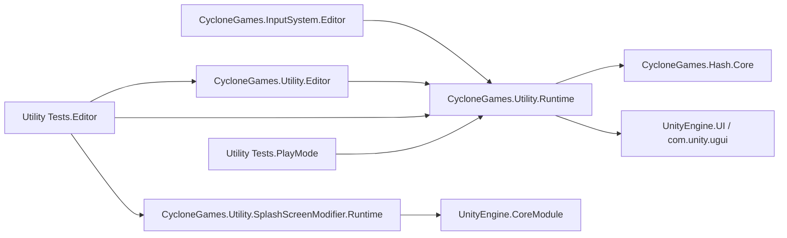

# CycloneGames.Utility

[English | 简体中文](README.md)

CycloneGames.Utility 是一组紧凑、具体的 Unity 工具，覆盖集合操作、固定区域格式化、颜色与向量运算、安全区域计算、经 authoring 的 Transform 查找、窄范围 singleton 便利能力、诊断和 Editor authoring。每个 helper 暴露的是聚焦契约而非通用 framework，Unity 专属行为被隔离到 Runtime 或 Editor 程序集，使本包可以按需逐项使用。

## 目录

- [概述](#概述)
- [架构](#架构)
- [快速上手](#快速上手)
- [核心概念](#核心概念)
- [使用指南](#使用指南)
- [进阶主题](#进阶主题)
- [常见场景](#常见场景)
- [性能与内存](#性能与内存)
- [故障排查](#故障排查)

## 概述

本包覆盖几乎每个 Unity 项目都会出现的小型重复任务：带边界检查的集合工具、固定区域 string 与 span 格式化、带 WCAG contrast 的命名颜色、向量工具、安全区域 fitting、FPS 诊断、经 authoring 的 Transform 查找，以及窄范围 singleton 便利能力。Runtime 程序集引用 `CycloneGames.Hash.Core` 与 `UnityEngine.UI`；一个物理隔离的 `SplashScreenModifier` 子模块负责自动停止 Player splash screen。

`Singleton<T>` 与 `MonoSingleton<T>` 是面向小型无参对象或 main-thread Unity 组件的窄范围便利类型，不能替代显式构造、dependency injection、domain-owned shutdown 或 scene/world-scoped ownership。Service Locator、DI 容器、持久化、网络、安全、确定性模拟和 Inspector 框架由各自的模块负责。

本包中的 Unity 对象和 Unity API 具有 main-thread affinity。纯格式化和集合工具不接触 Unity 状态，但可变集合跨线程时仍必须由调用方 owner 负责同步。

### 主要特性

- **集合**：`CollectionUtils` —— 带边界检查的访问、swap-remove、调用方持有 RNG 的 shuffle。
- **格式化**：`FormatUtil`、`MemoryFormatExtensions` —— 固定区域 string、`StringBuilder` 与目标 `Span<char>` 路径。
- **颜色**：`Colors` —— 命名颜色、hex 解析/格式化、稳定 `0xRRGGBBAA`、WCAG luminance/contrast。
- **向量**：`Vector3Extensions` —— 面向有限输入的 helper，非法范围行为明确。
- **安全区域**：`SafeAreaPolicy`、`SafeAreaUtility`、`AdaptiveSafeAreaFitter` —— 纯 pixel/anchor 数学加 driven-RectTransform 组件。
- **诊断**：`FPSCounter` —— 有界帧率采样，可选 IMGUI 展示。
- **Transform 查找**：`TransformKeyRegistry` —— 冷路径 index build、经过 collision 检查的 string lookup。
- **Singleton**：`Singleton<T>`（CLR lazy）与 `MonoSingleton<T>`（main-thread Unity 组件）。
- **Splash 停止**：`SkipUnitySplashScreen` —— 隔离程序集中的自动 `BeforeSplashScreen` hook。
- **Authoring**：`StringAsConstSelectorAttribute`、`PropertyGroupAttribute`、custom Inspector、Colors Preview。

## 架构



| 程序集 | 平台 | `autoReferenced` | 直接引用 |
| --- | --- | ---: | --- |
| `CycloneGames.Utility.Runtime` | 所有 Unity target | `true` | `CycloneGames.Hash.Core`、`UnityEngine.UI` |
| `CycloneGames.Utility.SplashScreenModifier.Runtime` | 所有 Unity target | `true` | 无 |
| `CycloneGames.Utility.Editor` | 仅 Editor | `true` | `CycloneGames.Utility.Runtime` |
| `CycloneGames.Utility.Tests.Editor` | 仅 Editor | `false` | Runtime、Splash Runtime、Editor、Test Framework |
| `CycloneGames.Utility.Tests.PlayMode` | Test build | `false` | Runtime、Test Framework |
| `CycloneGames.Utility.Tests.Performance` | Editor，条件启用 | `false` | Runtime、Performance Testing |

本包位于 `Assets/ThirdParty/CycloneGames/`。其中的 `package.json` 记录发布元数据和预期依赖，但 Unity 不会依据该文件激活同级 asset package——当前 asmdef 图、已安装 package、源码和项目配置才是编译事实。

## 快速上手

在 asmdef 中添加对 `CycloneGames.Utility.Runtime` 的引用，然后导入命名空间：

```csharp
using CycloneGames.Utility.Runtime;
```

### 无分配地格式化字节计数

```csharp
Span<char> buffer = stackalloc char[64];
if (FormatUtil.TryFormatBytes(1_572_864, buffer, out int written, decimalPlaces: 1))
{
    ConsumeText(buffer.Slice(0, written)); // "1.5 MB"
}
```

### 按 key 查找经 authoring 的 Transform

```csharp
registry.BuildIndex(); // 冷路径：在初始化阶段执行

if (registry.TryGetTransform("Weapon.Muzzle", out Transform muzzle))
{
    SpawnAt(muzzle);
}
```

### 让 RectTransform 适配设备安全区域

把 `AdaptiveSafeAreaFitter` 挂到场景中的 `RectTransform`。它持有 `DrivenRectTransformTracker`，缓存上一次 screen state，只在 screen state、配置、hierarchy dimension 或 driven value 改变时重算。

### 访问 lazy singleton

```csharp
TelemetryNames names = Singleton<TelemetryNames>.Instance;
```

CLR 保证每个 closed generic type 只进行一次 lazy 构造并安全 publication；该对象随 AppDomain 存活，不提供 reset、取消、`Dispose` 或 shutdown ordering。

## 核心概念

### 固定区域格式化

所有格式化 API 使用 `CultureInfo.InvariantCulture`。String API（`FormatBytes`、`FormatNumber`、`FormatDuration`、`FormatPercent`）会分配返回的 string；`Try*` overload 写入调用方持有的 `Span<char>`，输入非法或容量不足时返回 `false`。`AppendFormatted*` 扩展避免中间 string，但 `StringBuilder` 扩容仍可能分配。

格式化规则：

- 小数位数必须在 `[0, 5]`；
- byte count 必须非负；
- percent ratio 必须有限且位于 `[0, 1]`；
- duration 必须有限且能以 Int64 整秒表示；
- 输入非法或目标容量不足时，`Try*` API 返回 `false`；
- 会抛异常的 string API 对非法契约使用 `ArgumentOutOfRangeException`。

Byte 值使用 base-1024 单位，标记为 `B`、`KB`、`MB`、`GB`、`TB`。Number 值使用 base-1000 并带后缀 `K`、`M`、`B`、`T`。这些标签属于当前格式化契约。

### 集合工具

`CollectionUtils` 提供带边界检查的访问（`TryGetElementAtIndex`、`TryFirst`、`TryLast`、`TryPop`）、面向 `List<T>`、array、`Dictionary` 与 `HashSet` 的 `IsNullOrEmpty` 检查、dictionary 的 `GetOrDefault`，以及 `LinkedList` 节点 helper。两个操作需要特别注意：

**Swap-remove** 复杂度为 O(1) 且不保持顺序，适合 entity list 或 projectile pool 这类顺序无关场景：

```csharp
if (!activeProjectiles.TrySwapRemoveAt(index))
{
    // The index was outside the current logical collection.
}
```

Array swap-remove 需要调用方持有 logical count，并会清空释放的 slot，避免继续持有引用。

**Shuffle** 是原位 Fisher-Yates。默认 RNG 按线程惰性分配；传入 seeded `System.Random` 可获得确定性输出：

```csharp
var random = new System.Random(seed);
items.Shuffle(random);
```

`System.Random` 不是网络协议或跨 runtime 的确定性保证。Replay 或 lockstep simulation 应使用产品自身版本化的 simulation RNG。可变操作不保证线程安全；数据跨线程时，owner 必须围绕全部访问定义唯一同步 policy。

### 颜色解析与对比度

```csharp
if (Colors.TryParseHex("#4A90E2FF".AsSpan(), out Color color))
{
    float contrast = color.GetContrastRatio(Color.black);
}
```

`GetLuminance` 计算 BT.601 加权 luma。无障碍设计应使用 `GetRelativeLuminance` 与 `GetContrastRatio`。Contrast API 忽略 alpha；测试半透明颜色前应先完成颜色合成。`Colors.RandomColor(System.Random)` 使用调用方持有的 RNG state；无参数 overload 会消耗 Unity 全局 random state，只应放在 main-thread、非确定性的表现路径。

### 安全区域计算

纯计算器无需 Scene 即可测试：

```csharp
var policy = new SafeAreaPolicy(
    extendIntoBottomSafeArea: false,
    enforceVerticalSymmetry: true,
    enforceHorizontalSymmetry: true,
    paddingPixels: new Vector4(x: 8, y: 8, z: 8, w: 8));

Rect usablePixels = SafeAreaUtility.CalculatePixelRect(
    Screen.safeArea,
    Screen.width,
    Screen.height,
    in policy);
```

`Vector4` padding 顺序为 left、bottom、right、top。非有限或负 padding 会转为零；过度约束的 padding 会按比例适配，保证 anchor 不会反转。Bottom extension 先执行；top-inset balancing 随后执行，并可能重新加入 bottom inset 以平衡顶部 cutout。当 bottom 已经更大时，它不会扩大 top inset。

### Singleton 语义

`Singleton<T>` 是 CLR lazy 构造 helper。构造与 publication 是线程安全的；`T` 内部的可变状态不具备线程安全。该对象随 AppDomain 存活，不提供 reset、取消、`Dispose` 或 shutdown ordering。它只适用于不持有 Unity object、subscription、thread、native handle 或 session state 的小型无参对象。带依赖或资源所有权的 service 应使用显式构造和 domain composition root。

`MonoSingleton<T>` 是独立的、仅 main thread 使用的 Unity 便利能力。`Instance` 会先解析 scene 中 active 或 inactive 的既有 component，仅在 Play Mode 且没有候选时创建专用 GameObject。`TryGetInstance` 只返回已注册 cache，既不搜索也不创建。存在多个预置候选时会失败，而不是任意选择 authority。duplicate component 会被禁用并销毁，但不会删除其 GameObject 或 sibling component。static registration 在 `SubsystemRegistration` 清理，包括关闭 Domain Reload 的配置。派生类覆盖 lifecycle method 时必须调用 base 实现。

## 使用指南

### Transform key registry

```csharp
registry.BuildIndex(); // 在初始化或显式冷阶段执行

if (registry.TryGetTransform("Weapon.Muzzle", out Transform muzzle))
{
    SpawnAt(muzzle);
}
```

Runtime 行为：

- 空 key 和缺失 Transform 引用会被忽略；
- 第一个有效、经 authoring 的 duplicate key 胜出，后续 duplicate 会被计数并忽略；
- 最多 16 个索引项使用 linear lookup，更大集合使用按 hash 排序的 array 与 binary search；
- string lookup 在 hash 后还会以 ordinal key 验证；
- 检测到 distinct-key hash collision 时，仅 hash lookup 返回 `false`；
- active 且 enabled 的 nested registry 会在 build 时通过迭代式 depth-first hierarchy traversal 展平；disabled 或 inactive registry 不参与；
- 若关闭 `Build On Awake`，首次 lookup 可以触发 build，并可能分配和扫描 hierarchy；
- 可选 `Transform.Find` fallback 是冷路径，不是 frame-loop 路径。

Registry 存储 authoring string key，不是 network ID、save ID、Unity instance ID 或 raw ECS entity identity。`Collect Direct Children` Editor 操作会通过 `SerializedObject` 添加缺失的 direct-child entry，并保留 Unity 标准 Undo 与 Prefab Override 语义。

### FPS 诊断

把 `FPSCounter` 挂到 owner 明确的诊断 GameObject。它不会发现、创建或暴露全局 instance。通过直接引用调用 `SetVisible`，或设置 `IsVisible`。

Moving average 使用固定、有界 sample ring。仅 instant 或仅 average 模式会惰性缓存观察到的数字 string；combined 模式在显示更新时可能分配组合 string。IMGUI 自身也有 engine-owned 成本，因此该组件不是生产 HUD，也不构成 universal zero-allocation 声明。`Persist Across Scenes` 会对整个 GameObject 调用 `DontDestroyOnLoad`——应使用不含无关组件的专用 owner。

### 字符串常量 selector

```csharp
public static class ControlPaths
{
    public const string Keyboard = "<Keyboard>";
    public const string Gamepad = "<Gamepad>";
}

[StringAsConstSelector(typeof(ControlPaths), UseMenu = true, AllowCustom = true)]
[SerializeField] private string controlPath;
```

Drawer 会在每个 constants type 与 domain reload 范围内反射一次 public `const string` 字段，以 ordinal 顺序排序，忽略 null/empty constant，并在 duplicate value 中确定性保留第一个字段。`AllowCustom` 会保留开放外部契约中的值。多对象编辑使用 `SerializedObject`/`SerializedProperty`，并保留 Undo 和 Prefab Override 语义。

### 成对 Inspector property group

Runtime attribute 描述一个顶层 serialized-field segment：

```csharp
[PropertyGroup("Timing", groupAllFieldsUntilNextGroupAttribute: true, groupColorIndex: 24)]
[SerializeField] private float delay;
[SerializeField] private float duration;

[EndPropertyGroup]
[SerializeField] private bool playOnEnable;
```

通过 target-specific Editor adapter 显式启用 renderer：

```csharp
[CustomEditor(typeof(MyComponent), true)]
[CanEditMultipleObjects]
internal sealed class MyComponentEditor : PropertyGroupInspectorDrawer
{
}
```

Renderer 以 Unity 顶层 `SerializedProperty` 顺序为权威。continuous group 在标记 `EndPropertyGroup` 的字段之前、下一个 `PropertyGroup` 或对象末尾结束；非 continuous group 只包含带 attribute 的字段。重复 group name 会形成互不合并的独立 segment。Array、List、嵌套 serializable object 与 managed reference 可以作为完整顶层 property 放入组内，并继续使用它们自己的 property drawer；嵌套 serialized type 内部的这些 attribute 有意不递归解释。非法或有歧义的 metadata 会 fail open，正常绘制受影响 property，绝不会隐藏 serialized data。

本包不提供全局 fallback Editor——避免拦截无关 Unity 或第三方 Inspector。Foldout state 由当前 Editor instance 持有，初值来自 `ClosedByDefault`，并且有意不持久化。所有值编辑均通过 `SerializedObject`/`SerializedProperty`，保留 Unity Undo、Prefab Override 与多对象编辑行为。

### Player splash 自动停止

物理隔离的 `Runtime/Scripts/SplashScreenModifier/` 子模块通过“存在即启用”工作，无需调用点。Unity 会在 `BeforeSplashScreen` 调用 registration type `SkipUnitySplashScreen`；Player target 在 Unity-owned callback thread 同步请求 `SplashScreen.Stop(StopImmediate)`。Editor 与 Dedicated Server build 执行 no-op。

该子模块不使用 `Task.Run`、XR 初始化、focus-event heuristic、GameObject 或 Editor `PlayerSettings` policy。正常路径无状态，每次 callback invocation 只执行一次 native API 调用。

## 进阶主题

### Custom Editor 体验

`FPSCounter`、`AdaptiveSafeAreaFitter` 和 `TransformKeyRegistry` 使用显式 custom Inspector，提供缓存的内部 style、分组 section、多对象支持、validation 和 serialized editing。通用成对字段 renderer 只通过 `PropertyGroupInspectorDrawer` 暴露；其 traversal、metadata cache 与视觉 helper 保持 internal，避免把 Utility 扩展为通用 Editor framework。

Colors Preview 在 Editor-only 冷反射阶段从 Runtime public color field 推导 color name。Player build 不携带重复的 Editor color-name table。`Tools/CycloneGames/Open Persistent Data Path` 使用 `EditorUtility.RevealInFinder`；目录不存在时会创建目录，失败时会通过可操作的 Editor dialog 和 log 报告。

### MonoSingleton 生命周期与 reload

Global authored `MonoSingleton<T>` 组件必须位于 root GameObject；否则实现会记录 error 并保留 Scene lifetime，不会移动无关 hierarchy。duplicate component 会被禁用并销毁，但不会删除其 GameObject 或 sibling component。static registration 在 `SubsystemRegistration` 清理，包括关闭 Domain Reload 的配置。不得从 worker thread 访问，也不得用于 scene/world-scoped 多实例系统、需要 constructor injection 的 service 或具有有序 shutdown 的 service。

### Splash 子模块与 IL2CPP

无调用方的 Splash assembly 使用 `AlwaysLinkAssembly`，让 Unity linker 处理其 runtime-init root。IL2CPP 与 stripping 仍需目标 Player 验证。实际视觉行为、license 资格、原生启动画面、WebGL loader 与平台一致性必须由目标 Player 证据确认。

## 常见场景

### 为 HUD 格式化下载进度

下载 HUD 需要紧凑、固定区域的文本，且不希望逐帧分配 string：

```csharp
Span<char> buffer = stackalloc char[64];
if (FormatUtil.TryFormatBytes(bytesDownloaded, buffer, out int bytesWritten, decimalPlaces: 1))
{
    // "1.5 MB" —— 写入调用方持有的 span，无中间 string。
    hud.SetBytesText(buffer.Slice(0, bytesWritten));
}

float ratio = totalBytes > 0 ? bytesDownloaded / (float)totalBytes : 0f;
string percent = FormatUtil.FormatPercent(ratio, decimalPlaces: 0); // "73%"
```

目标 span API 避免中间 string。`FormatPercent` 调用每帧分配一个 string；更高频率场景应写入可复用的 `Span<char>`，并在显示值真正改变时才调用 `ToString()`。

### 投射物池使用 swap-remove

投射物池把活动投射物存放在 `List<Projectile>` 中，命中或过期时按 index 移除。顺序无关，因此 swap-remove 提供 O(1) 移除且无需移动：

```csharp
public void DespawnAt(int index)
{
    if (!active.TrySwapRemoveAt(index))
    {
        return; // index was already invalidated this frame
    }

    // The projectile at `index` has been replaced by the former last element.
    // Update any per-frame indices that referenced the moved element.
}
```

Array swap-remove 需要调用方持有 logical count，并会清空释放的 slot，避免继续持有引用。

### 适配 notch 的 UI 布局

把 `AdaptiveSafeAreaFitter` 挂到 root canvas 的 `RectTransform`。开启 `enforceVerticalSymmetry: true` 时，竖屏手机顶部 notch 会加入匹配的 bottom inset，使布局保持垂直居中。横屏设备有侧边 notch 时，`enforceHorizontalSymmetry` 会在对侧边缘镜像 inset。组件缓存上次应用的状态，screen 与 configuration 都未变化时跳过重算。

### 构建期 telemetry 名称

用小型 `Singleton<T>` 暴露构建期 telemetry label，无需接入完整 DI 容器：

```csharp
public sealed class TelemetryNames : Singleton<TelemetryNames>
{
    public string BuildFlavor { get; } = "production";
}

string flavor = TelemetryNames.Instance.BuildFlavor;
```

此模式仅适用于只读、无参、随 AppDomain 存活的数据。任何持有 subscription、thread、native handle 或 session state 的对象都应使用显式构造的 service。

## 性能与内存

| 路径 | 所有权与分配行为 |
| --- | --- |
| `TryFormat*` 目标写入 API | 调用方持有 span；无结果 string。容量不足时返回 `false`。 |
| String 格式化 API | 受 runtime 实现影响，分配返回的 managed string。 |
| 集合工具 | 不加入隐藏 lock。`ClearAndResize` 扩容时可能分配。默认 shuffle 会为每个 thread 惰性创建一个 RNG。 |
| 安全区域数学 | 仅 struct 计算；无全局 cache。 |
| Transform registry build | 组件持有 array、可复用 key set 和迭代式 traversal buffer；capacity 或 hierarchy 改变可能分配。Key set 与 traversal buffer 的峰值容量保留到组件生命周期结束，但 build 后会清除其中引用。 |
| Transform registry lookup | 有效显式 build 后 lookup 不发生 rebuild 分配；`n <= 16` 时复杂度为 O(n)，否则为 O(log n + collisions)。 |
| FPS counter | 组件持有有界 sample array 与 GUI cache；combined text 和 IMGUI 可能分配。 |
| `Singleton<T>.Instance` | CLR 对每个 closed type 只初始化一次；warm access 是不产生结果分配的 static read。Instance 由 AppDomain 持有。 |
| `MonoSingleton<T>.Instance` | 已注册 instance 的 warm access 不产生结果分配。首次解析可能分配 search result array、缓存名称、GameObject 与 component。 |
| Splash startup hook | 每次有界 callback invocation 执行一次 native stop request；无持久状态、cache、subscription、worker 或显式正常路径分配。 |
| Editor drawer | Reflection/menu data 缓存到 domain reload；打开 menu 是冷分配路径。 |
| Property group | Type/field metadata 在每个 Editor domain 反射一次；每个 Inspector 只持有 fold state。每次绘制流式读取 property，不会跨 Undo 或结构变更保留 property。 |

本包不使用 pool。这些工具都不能修复不清晰的对象所有权。选择它们进入热路径前，必须在真实 target backend 和 hardware 上测量。

### 线程与平台说明

- 本包中的 Unity object、`Screen`、IMGUI、UGUI、`Transform` 和 Editor API 仅在 main thread 使用。
- `Singleton<T>` 的构造/publication 遵循 CLR static initialization 语义，包括 WebGL 单线程 runtime；它不会使可变对象自动线程安全。
- `MonoSingleton<T>` 仅限 main thread。其 guard 阻止 worker-thread Unity API 访问，并且只在 Play Mode 创建对象。
- 集合工具不声明线程安全。可变数据跨线程时，owner 必须围绕全部访问、取消、shutdown 和 capacity 定义唯一同步 policy。
- Runtime assembly 不包含 background task、native plugin、unsafe block、runtime reflection discovery 或 dynamic code generation。
- Splash 子模块在 startup callback thread 同步调用 Unity。WebGL 不使用依赖线程或 focus event 的 fallback path。
- Dedicated Server build 不应挂载 UGUI、安全区域或 IMGUI 诊断组件；Splash callback 在 `UNITY_SERVER` 下是编译期 no-op。
- 静态检查覆盖 Windows、Linux、macOS、iOS、Android、WebGL 和主机约束；兼容性仍需目标 Player build、平台 SDK 与代表性硬件证据。
- 这些 float helper 不是确定性 simulation boundary。需要确定性 replay 时，应使用版本化 fixed-point 或其他经过证明的 simulation layer。

### 持久化与数据安全

本模块不会自动创建或写入 preference、setting、cache index、save data、registry key、plist value 或独立 project configuration asset，也不使用 `EditorPrefs`、`PlayerPrefs` 或 `SessionState`。Property-group fold state 是 transient 状态，由当前 Editor instance 持有。

显式 Inspector 和 property drawer 会通过 `SerializedObject`/`SerializedProperty`，把用户授权的 Unity serialized authoring 变更写入所选 Scene、Prefab 或 asset target。Inspector 编辑保留正常 Undo 与 Prefab Override 行为。Persistent-data menu command 可以创建 `Application.persistentDataPath`，但不会写入文件内容。该目录中已有文件归 application 所有，不是本 Utility package 的 cache；不得把它们作为 Utility cache 删除。`TransformKeyRegistry`、`FPSCounter` 和 `AdaptiveSafeAreaFitter` 包含 Unity serialized field。已声明重命名的字段使用 `FormerlySerializedAs`。

## 故障排查

| 现象 | 可能原因 | 解决方法 |
| --- | --- | --- |
| `TryFormat*` 返回 `false` | 输入非法或目标 span 太小 | 校验小数位数在 `[0, 5]`、byte count 非负、ratio 在 `[0, 1]`；增大目标 span |
| `Singleton<T>` 跨 session 保留旧状态 | AppDomain 未重新加载 | 带 session 生命周期的数据应使用显式构造；不要把可变 session state 存入 singleton |
| `MonoSingleton<T>` 报告 root GameObject 错误 | Authored global 组件位于非 root GameObject | 把组件移到 root GameObject，或设置 `IsGlobal` 为 `false` 用于 scene-scoped 用法 |
| `TransformKeyRegistry.TryGetTransform` 对已知 key 返回 `false` | 未 build index，或 distinct-key hash collision | 初始化时调用 `BuildIndex()`；检查 key 是否 authoring 在 active 且 enabled 的 registry 上 |
| `TransformKeyRegistry` 首次 lookup 慢 | 关闭 `Build On Awake`，首次 lookup 触发 build | 加载时显式 build，或接受一次性的代价 |
| `AdaptiveSafeAreaFitter` 旋转后不更新 | 组件被禁用，或 hierarchy dimension 未变化 | 确认组件已启用；通过改变 screen state 或 configuration 强制重算 |
| `FPSCounter` 每帧分配 | Combined display 模式加 IMGUI rendering | 切到仅 instant 或仅 average 模式；单独 profile IMGUI 成本 |
| Property group 不渲染 | 目标 Editor 未继承 `PropertyGroupInspectorDrawer` | 为目标类型添加继承自 `PropertyGroupInspectorDrawer` 的 custom Editor |
| 设备上 splash screen 未停止 | License 不允许 `SplashScreen.Stop`，或 IL2CPP strip 了 registration type | 验证 license 资格；确认 `AlwaysLinkAssembly` 保留；检查目标 Player 日志 |
| `StringAsConstSelector` 丢失 custom value | `AllowCustom` 为 `false` | 设置 `AllowCustom = true` 以保留开放外部契约的值 |
| Colors Preview 在 Player build 中为空 | Colors Preview 仅 Editor 可用；Player build 不携带 color-name table | 符合预期；直接通过 Runtime `Colors` 类访问颜色 |

## 验证

从 Unity Test Runner 运行聚焦测试：

- EditMode assembly：`CycloneGames.Utility.Tests.Editor`
- PlayMode assembly：`CycloneGames.Utility.Tests.PlayMode`
- Performance assembly：安装 `com.unity.test-framework.performance >= 3.0.0` 时使用 `CycloneGames.Utility.Tests.Performance`

等价 batchmode 命令形态：

```text
<UnityEditor> -batchmode -projectPath <repo-root>/UnityStarter -runTests -testPlatform EditMode -assemblyNames CycloneGames.Utility.Tests.Editor -testResults <result-path> -quit
```

最小手工 Editor 检查：

1. 同时选择每种 custom-inspected component 的两个实例并编辑 mixed value。
2. 添加、删除、收集 Transform registry entry，然后验证 Undo/Redo 和 Prefab Override。
3. 用 `StringAsConstSelector(AllowCustom = true)` 编辑 `List<string>`，确认未知 control path 被保留。
4. 调整 Colors Preview 大小并搜索，再复制一个 named color reference。
5. 进入 Play Mode，旋转或调整 Game view 大小，确认 safe-area anchor 始终有序。
6. 打开已 opt-in 的 property-group Inspector，验证折叠/展开、多对象 mixed value、Undo/Redo 与 Prefab Override。
7. 在关闭 Domain Reload 和 Scene Reload 时进入 Play Mode，确认 `MonoSingleton<T>` 只解析一次、拒绝 duplicate 但不删除 sibling，并在下一次 session 重置 registration。

发布前，在每个选定 target 上运行 disposable Player 启动 smoke。确认在 license 允许时 Unity splash stop request 生效、首个 Scene 仍能启动、`UNITY_SERVER` 不受影响，并且没有把原生 OS/browser/平台启动 UI 错认成 Unity managed splash。使用产品的 IL2CPP、stripping、XR 与 license 配置重复验证。不得把 Editor 测试结果扩大为 Player、IL2CPP、移动端、WebGL、server、主机、长时间运行或全局 zero-allocation 证据。
