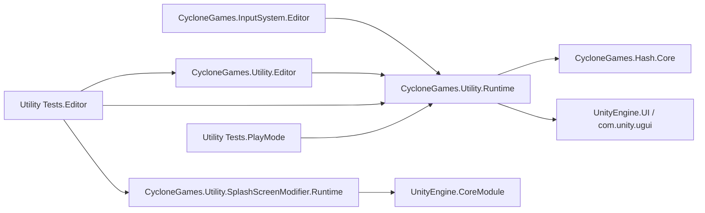

# CycloneGames.Utility

[English | 简体中文](README.SCH.md)

CycloneGames.Utility is a compact set of concrete Unity helpers for collection operations, invariant formatting, color and vector math, safe-area calculation, authored Transform lookup, narrow singleton conveniences, diagnostics, and Editor authoring. Each helper exposes a focused contract rather than a general framework, and Unity-specific behavior is isolated to Runtime or Editor assemblies so the package can be consumed piece by piece.

## Table of Contents

- [Overview](#overview)
- [Architecture](#architecture)
- [Quick Start](#quick-start)
- [Core Concepts](#core-concepts)
- [Usage Guide](#usage-guide)
- [Advanced Topics](#advanced-topics)
- [Common Scenarios](#common-scenarios)
- [Performance and Memory](#performance-and-memory)
- [Troubleshooting](#troubleshooting)

## Overview

The package covers the small recurring jobs that show up in nearly every Unity project: bounds-checked collection helpers, invariant string and span formatting, named colors with WCAG contrast, vector helpers, safe-area fitting, FPS diagnostics, authored Transform lookup, and narrow singleton conveniences. The Runtime assembly references `CycloneGames.Hash.Core` and `UnityEngine.UI`; a physically isolated `SplashScreenModifier` submodule stops the Player splash screen automatically.

`Singleton<T>` and `MonoSingleton<T>` are narrow convenience types for small parameterless objects or main-thread Unity components. They do not replace explicit construction, dependency injection, domain-owned shutdown, or scene/world-scoped ownership. Service location, DI containers, persistence, networking, security, deterministic simulation, and Inspector frameworks live in their own modules.

Unity objects and Unity APIs in this package have main-thread affinity. Pure formatting and collection helpers do not touch Unity state, but mutable collections still require caller-owned synchronization if they cross threads.

### Key Features

- **Collections**: `CollectionUtils` — bounds-checked access, swap-remove, caller-owned RNG shuffle.
- **Formatting**: `FormatUtil`, `MemoryFormatExtensions` — invariant string, `StringBuilder`, and destination-`Span<char>` paths.
- **Colors**: `Colors` — named colors, hex parsing/formatting, stable `0xRRGGBBAA`, WCAG luminance/contrast.
- **Vectors**: `Vector3Extensions` — finite-input helpers with explicit invalid-range behavior.
- **Safe area**: `SafeAreaPolicy`, `SafeAreaUtility`, `AdaptiveSafeAreaFitter` — pure pixel/anchor math plus a driven-RectTransform component.
- **Diagnostics**: `FPSCounter` — bounded frame-rate sampling with optional IMGUI display.
- **Transform lookup**: `TransformKeyRegistry` — cold-path index build, collision-checked string lookup.
- **Singletons**: `Singleton<T>` (CLR lazy) and `MonoSingleton<T>` (main-thread Unity component).
- **Splash stop**: `SkipUnitySplashScreen` — automatic `BeforeSplashScreen` hook in an isolated assembly.
- **Authoring**: `StringAsConstSelectorAttribute`, `PropertyGroupAttribute`, custom inspectors, Colors Preview.

## Architecture



| Assembly | Platform | `autoReferenced` | Direct references |
| --- | --- | ---: | --- |
| `CycloneGames.Utility.Runtime` | All Unity targets | `true` | `CycloneGames.Hash.Core`, `UnityEngine.UI` |
| `CycloneGames.Utility.SplashScreenModifier.Runtime` | All Unity targets | `true` | None |
| `CycloneGames.Utility.Editor` | Editor only | `true` | `CycloneGames.Utility.Runtime` |
| `CycloneGames.Utility.Tests.Editor` | Editor only | `false` | Runtime, Splash Runtime, Editor, Test Framework |
| `CycloneGames.Utility.Tests.PlayMode` | Test builds | `false` | Runtime, Test Framework |
| `CycloneGames.Utility.Tests.Performance` | Editor, conditional | `false` | Runtime, Performance Testing |

The package lives under `Assets/ThirdParty/CycloneGames/`. Its `package.json` records release metadata and intended dependencies, but Unity does not activate sibling asset packages from that file — the current asmdef graph, installed packages, source, and project configuration remain the compilation facts.

## Quick Start

Add an asmdef reference to `CycloneGames.Utility.Runtime`, then import the namespace:

```csharp
using CycloneGames.Utility.Runtime;
```

### Format a byte count without allocation

```csharp
Span<char> buffer = stackalloc char[64];
if (FormatUtil.TryFormatBytes(1_572_864, buffer, out int written, decimalPlaces: 1))
{
    ConsumeText(buffer.Slice(0, written)); // "1.5 MB"
}
```

### Look up an authored Transform by key

```csharp
registry.BuildIndex(); // cold path: during initialization

if (registry.TryGetTransform("Weapon.Muzzle", out Transform muzzle))
{
    SpawnAt(muzzle);
}
```

### Fit a RectTransform to the device safe area

Attach `AdaptiveSafeAreaFitter` to a `RectTransform` in the scene. It owns a `DrivenRectTransformTracker`, caches the last screen state, and recalculates only when screen state, configuration, hierarchy dimensions, or driven values change.

### Access a lazy singleton

```csharp
TelemetryNames names = Singleton<TelemetryNames>.Instance;
```

The CLR guarantees one lazy construction and safe publication per closed generic type; the instance lives for the AppDomain and has no reset, cancellation, `Dispose`, or shutdown ordering.

## Core Concepts

### Invariant formatting

All formatting APIs use `CultureInfo.InvariantCulture`. String APIs (`FormatBytes`, `FormatNumber`, `FormatDuration`, `FormatPercent`) allocate the returned string; `Try*` overloads write into a caller-owned `Span<char>` and return `false` for invalid input or insufficient capacity. `AppendFormatted*` extensions avoid an intermediate string, but `StringBuilder` growth can still allocate.

Formatting rules:

- decimal places must be in `[0, 5]`;
- byte counts must be non-negative;
- percentage ratios must be finite and in `[0, 1]`;
- durations must be finite and fit in an Int64 number of whole seconds;
- `Try*` APIs return `false` for invalid input or insufficient destination capacity;
- throwing string APIs use `ArgumentOutOfRangeException` for invalid contracts.

Byte values use base-1024 units labelled `B`, `KB`, `MB`, `GB`, and `TB`. Number values use base-1000 with suffixes `K`, `M`, `B`, `T`. These labels are part of the current formatting contract.

### Collection helpers

`CollectionUtils` provides bounds-checked access (`TryGetElementAtIndex`, `TryFirst`, `TryLast`, `TryPop`), `IsNullOrEmpty` checks for `List<T>`, arrays, `Dictionary`, and `HashSet`, dictionary `GetOrDefault`, and `LinkedList` node helpers. Two operations warrant attention:

**Swap-remove** is O(1) and does not preserve order — ideal for entity lists or projectile pools where order does not matter:

```csharp
if (!activeProjectiles.TrySwapRemoveAt(index))
{
    // The index was outside the current logical collection.
}
```

Array swap-remove requires a caller-owned logical count and clears the released slot so references are not retained.

**Shuffle** is an in-place Fisher-Yates. The default RNG is lazily allocated per thread; pass a seeded `System.Random` for deterministic output:

```csharp
var random = new System.Random(seed);
items.Shuffle(random);
```

`System.Random` is not a network protocol or cross-runtime deterministic guarantee. For replay or lockstep simulation, use the product's versioned simulation RNG. Mutable operations are not thread-safe; if data crosses threads, the owner must define one synchronization policy around all access.

### Color parsing and contrast

```csharp
if (Colors.TryParseHex("#4A90E2FF".AsSpan(), out Color color))
{
    float contrast = color.GetContrastRatio(Color.black);
}
```

`GetLuminance` computes BT.601 weighted luma. Accessibility decisions should use `GetRelativeLuminance` and `GetContrastRatio`. Alpha is ignored by the contrast API; composite translucent colors before testing contrast. `Colors.RandomColor(System.Random)` uses caller-owned RNG state; parameterless overloads consume Unity's global random state and belong only on main-thread, non-deterministic presentation paths.

### Safe-area calculation

The pure calculator can be tested without a scene:

```csharp
var policy = new SafeAreaPolicy(
    extendIntoBottomSafeArea: false,
    enforceVerticalSymmetry: true,
    enforceHorizontalSymmetry: true,
    paddingPixels: new Vector4(x: 8, y: 8, z: 8, w: 8));

Rect usablePixels = SafeAreaUtility.CalculatePixelRect(
    Screen.safeArea,
    Screen.width,
    Screen.height,
    in policy);
```

`Vector4` padding order is left, bottom, right, top. Non-finite or negative padding becomes zero, and over-constrained padding is proportionally fitted so anchors cannot invert. Bottom extension is applied first; top-inset balancing runs afterward and can add bottom inset back to balance a top cutout. It does not enlarge the top inset when the bottom is already larger.

### Singleton semantics

`Singleton<T>` is a CLR lazy construction helper. Construction and publication are thread-safe; mutable state inside `T` is not. The instance lives for the AppDomain and has no reset, cancellation, `Dispose`, or shutdown ordering. Use it only for small parameterless objects that do not own Unity objects, subscriptions, threads, native handles, or session state. Services with dependencies or owned resources should use explicit construction and a domain composition root.

`MonoSingleton<T>` is a separate main-thread-only Unity convenience. `Instance` first resolves an existing active or inactive scene component and otherwise creates a dedicated GameObject during Play Mode. `TryGetInstance` only returns the already registered cache; it neither searches nor creates. Multiple pre-existing candidates fail instead of selecting arbitrary authority. A duplicate component is disabled and destroyed without deleting its GameObject or sibling components. Static registration is cleared at `SubsystemRegistration`, including when Domain Reload is disabled. Derived lifecycle overrides must call their base implementation.

## Usage Guide

### Transform key registry

```csharp
registry.BuildIndex(); // perform during initialization or an explicit cold phase

if (registry.TryGetTransform("Weapon.Muzzle", out Transform muzzle))
{
    SpawnAt(muzzle);
}
```

Runtime behavior:

- empty keys and missing Transform references are ignored;
- the first valid authored duplicate key wins; later duplicates are counted and ignored;
- up to 16 indexed entries use linear lookup; larger sets use a hash-sorted array and binary search;
- string lookup verifies the ordinal key after hashing;
- hash-only lookup returns `false` when a distinct-key collision is detected;
- active and enabled nested registries are flattened with an iterative depth-first hierarchy traversal during build; disabled or inactive registries do not participate;
- the first lookup can build if `Build On Awake` was disabled, which can allocate and scan the hierarchy;
- optional `Transform.Find` fallback is a cold path, not a frame-loop path.

The registry stores authored string keys, not network IDs, save IDs, Unity instance IDs, or raw ECS entity identities. The `Collect Direct Children` Editor action adds missing direct-child entries through `SerializedObject`, retaining Unity's standard Undo and Prefab Override semantics.

### FPS diagnostics

Attach `FPSCounter` to an explicitly owned diagnostic GameObject. It does not discover, create, or expose a global instance. Call `SetVisible` or assign `IsVisible` through a direct reference.

The moving average uses a fixed, bounded sample ring. Instant-only and average-only modes lazily cache observed numeric strings; combined mode can allocate a composed string on display updates. IMGUI itself has engine-owned costs, so this component is not a production HUD or a universal zero-allocation claim. `Persist Across Scenes` applies `DontDestroyOnLoad` to the entire GameObject — use a dedicated owner with no unrelated components.

### String constant selector

```csharp
public static class ControlPaths
{
    public const string Keyboard = "<Keyboard>";
    public const string Gamepad = "<Gamepad>";
}

[StringAsConstSelector(typeof(ControlPaths), UseMenu = true, AllowCustom = true)]
[SerializeField] private string controlPath;
```

The drawer reflects public `const string` fields once per constants type and domain reload, sorts names ordinally, ignores null/empty constants, and deterministically keeps the first field for duplicate values. `AllowCustom` preserves values from open external contracts. Multi-object edits use `SerializedObject`/`SerializedProperty` and retain Undo and Prefab Override semantics.

### Paired Inspector property groups

The Runtime attributes describe a top-level serialized-field segment:

```csharp
[PropertyGroup("Timing", groupAllFieldsUntilNextGroupAttribute: true, groupColorIndex: 24)]
[SerializeField] private float delay;
[SerializeField] private float duration;

[EndPropertyGroup]
[SerializeField] private bool playOnEnable;
```

Opt the target into rendering with a target-specific Editor adapter:

```csharp
[CustomEditor(typeof(MyComponent), true)]
[CanEditMultipleObjects]
internal sealed class MyComponentEditor : PropertyGroupInspectorDrawer
{
}
```

The renderer follows Unity's top-level `SerializedProperty` order. A continuous group ends before the field marked with `EndPropertyGroup`, at the next `PropertyGroup`, or at the end of the object. A non-continuous group contains only its attributed field. Repeated names form independent segments. Arrays, lists, nested serializable objects, and managed references can be grouped as whole top-level properties and continue through their own property drawers; attributes inside nested serialized types are intentionally not recursively interpreted. Invalid or ambiguous metadata fails open by drawing the affected property normally, never by hiding serialized data.

There is no global fallback Editor — this avoids intercepting unrelated Unity and third-party Inspectors. Foldout state belongs to the current Editor instance, is initialized from `ClosedByDefault`, and is intentionally not persisted. All value edits flow through `SerializedObject`/`SerializedProperty`, retaining Unity Undo, Prefab Override, and multi-object behavior.

### Automatic Player splash stop

The physically isolated `Runtime/Scripts/SplashScreenModifier/` submodule is enabled by presence and requires no call site. Unity invokes its registration type `SkipUnitySplashScreen` at `BeforeSplashScreen`; Player targets synchronously request `SplashScreen.Stop(StopImmediate)` on the Unity-owned callback thread. Editor and Dedicated Server builds execute a no-op.

The submodule does not use `Task.Run`, XR initialization, focus-event heuristics, a GameObject, or an Editor `PlayerSettings` policy. Its normal path is stateless and performs one native API call per callback invocation.

## Advanced Topics

### Custom Editor experience

`FPSCounter`, `AdaptiveSafeAreaFitter`, and `TransformKeyRegistry` use explicit custom inspectors with cached internal styles, grouped sections, multi-object support, validation, and serialized editing. The generic paired-field renderer is exposed only through `PropertyGroupInspectorDrawer`; its traversal, metadata cache, and visual helpers stay internal so Utility does not become a general Editor framework.

The Colors Preview derives color names from Runtime public color fields during an Editor-only cold reflection pass. Player builds do not carry a duplicated Editor color-name table. `Tools/CycloneGames/Open Persistent Data Path` uses `EditorUtility.RevealInFinder`; it creates the directory if it does not exist and reports failures with an actionable Editor dialog and log.

### MonoSingleton lifecycle and reload

A global authored `MonoSingleton<T>` component must be on a root GameObject; otherwise the implementation logs an error and retains Scene lifetime instead of moving an unrelated hierarchy. A duplicate component is disabled and destroyed without deleting its GameObject or sibling components. Static registration is cleared at `SubsystemRegistration`, including when Domain Reload is disabled. Do not access this API from worker threads or use it for scene/world-scoped multi-instance systems, constructor-injected services, or services with ordered shutdown.

### Splash submodule and IL2CPP

The unreferenced Splash assembly uses `AlwaysLinkAssembly` so Unity's linker processes its runtime-init root. IL2CPP and stripping still require target Player validation. Actual visual behavior, license eligibility, native launch screens, WebGL loaders, and platform consistency require target-specific Player evidence.

## Common Scenarios

### Format download progress for a HUD

A download HUD needs compact, invariant text without per-frame string allocation:

```csharp
Span<char> buffer = stackalloc char[64];
if (FormatUtil.TryFormatBytes(bytesDownloaded, buffer, out int bytesWritten, decimalPlaces: 1))
{
    // "1.5 MB" — written into the caller-owned span, no intermediate string.
    hud.SetBytesText(buffer.Slice(0, bytesWritten));
}

float ratio = totalBytes > 0 ? bytesDownloaded / (float)totalBytes : 0f;
string percent = FormatUtil.FormatPercent(ratio, decimalPlaces: 0); // "73%"
```

The destination span API avoids the intermediate string. The `FormatPercent` call allocates one string per frame; for higher frequency, write into a reusable `Span<char>` and only call `ToString()` when the displayed value actually changes.

### Projectile pool with swap-remove

A projectile pool stores active projectiles in a `List<Projectile>` and removes them by index when they hit or expire. Order does not matter, so swap-remove gives O(1) removal without shifting:

```csharp
public void DespawnAt(int index)
{
    if (!active.TrySwapRemoveAt(index))
    {
        return; // index was already invalidated this frame
    }

    // The projectile at `index` has been replaced by the former last element.
    // Update any per-frame indices that referenced the moved element.
}
```

Array swap-remove requires a caller-owned logical count and clears the released slot so references are not retained.

### Notch-aware UI layout

An `AdaptiveSafeAreaFitter` is attached to the root canvas `RectTransform`. With `enforceVerticalSymmetry: true`, a top notch on a phone in portrait adds matching bottom inset so the layout remains vertically centered. On landscape devices with a side notch, `enforceHorizontalSymmetry` mirrors the inset on the opposite edge. The component caches the last applied state and skips recalculation when neither the screen nor the configuration changes.

### Build-time telemetry names

A small `Singleton<T>` provides access to build-time telemetry labels without wiring a full DI container:

```csharp
public sealed class TelemetryNames : Singleton<TelemetryNames>
{
    public string BuildFlavor { get; } = "production";
}

string flavor = TelemetryNames.Instance.BuildFlavor;
```

Use this pattern only for read-only, parameterless, AppDomain-lifetime data. Anything that owns subscriptions, threads, native handles, or session state belongs in an explicitly constructed service.

## Performance and Memory

| Path | Ownership and allocation behavior |
| --- | --- |
| `TryFormat*` destination APIs | Caller owns the span; no result string. Insufficient capacity returns `false`. |
| String formatting APIs | Allocate exactly the returned managed string, subject to runtime implementation. |
| Collection helpers | Do not add hidden locks. `ClearAndResize` can allocate when capacity grows. Default shuffle lazily creates one RNG per thread. |
| Safe-area math | Struct-only calculation; no global cache. |
| Transform registry build | Component owns arrays, a reusable key set, and iterative traversal buffers; capacity or hierarchy changes can allocate. Key-set and traversal-buffer peak capacity is retained for the component lifetime, while references are cleared after build. |
| Transform registry lookup | No rebuild allocation after a valid explicit build; complexity is O(n) for `n <= 16`, otherwise O(log n + collisions). |
| FPS counter | Component owns bounded sample arrays and GUI caches; combined text and IMGUI can allocate. |
| `Singleton<T>.Instance` | CLR initializes once per closed type; warm access is a static read with no result allocation. The instance remains AppDomain-owned. |
| `MonoSingleton<T>.Instance` | Warm registered access has no result allocation. First resolution can allocate a search result array, cached name, GameObject, and component. |
| Splash startup hook | One native stop request per bounded callback invocation; no persistent state, cache, subscription, worker, or explicit normal-path allocation. |
| Editor drawers | Reflection/menu data is cached until domain reload; menu opening is a cold allocation path. |
| Property groups | Type/field metadata is reflected once per Editor domain; each Inspector owns only fold state. Properties are streamed each draw and are not retained across Undo or structural changes. |

No pool is used. None of these helpers repairs unclear object ownership. Measure the actual target backend and hardware before choosing them for a hot path.

### Threading and platform notes

- Unity objects, `Screen`, IMGUI, UGUI, `Transform`, and Editor APIs are main-thread only here.
- `Singleton<T>` construction/publication follows CLR static initialization semantics, including WebGL's single-threaded runtime; the mutable object is not made thread-safe.
- `MonoSingleton<T>` is main-thread confined. Its guard prevents worker-thread Unity API access and it only creates during Play Mode.
- Collection helpers do not claim thread safety. If mutable data crosses threads, the owner must define one synchronization policy around all access, cancellation, shutdown, and capacity.
- The Runtime assemblies contain no background tasks, native plugins, unsafe blocks, runtime reflection discovery, or dynamic code generation.
- The Splash submodule calls Unity synchronously on its startup callback thread. WebGL receives no thread-dependent or focus-event fallback path.
- Dedicated Server builds should not attach UGUI, safe-area, or IMGUI diagnostic components. The Splash callback is a compile-time no-op under `UNITY_SERVER`.
- Static review covers Windows, Linux, macOS, iOS, Android, WebGL, and console constraints. Compatibility still requires target Player builds, platform SDKs, and representative hardware evidence.
- These float helpers are not a deterministic simulation boundary. Use a versioned fixed-point or otherwise proven simulation layer when deterministic replay is required.

### Persistence and data safety

The module does not automatically create or write preferences, settings, cache indexes, save data, registry keys, plist values, or standalone project configuration assets. It does not use `EditorPrefs`, `PlayerPrefs`, or `SessionState`. Property-group fold state is transient and owned by the current Editor instance.

The explicit inspectors and property drawer do write user-authorized Unity-serialized authoring changes to their selected Scene, Prefab, or asset targets through `SerializedObject`/`SerializedProperty`. Inspector edits retain normal Undo and Prefab Override behavior. The persistent-data menu command can create `Application.persistentDataPath`, but it writes no file content. Files already present there belong to the application, not this Utility package; do not delete them as a Utility cache. `TransformKeyRegistry`, `FPSCounter`, and `AdaptiveSafeAreaFitter` contain Unity-serialized fields. Renamed serialized fields use `FormerlySerializedAs` where declared.

## Troubleshooting

| Symptom | Likely cause | Resolution |
| --- | --- | --- |
| `TryFormat*` returns `false` | Invalid input or destination span too small | Validate decimal places in `[0, 5]`, byte count non-negative, ratio in `[0, 1]`; grow the destination span |
| `Singleton<T>` holds stale state across sessions | AppDomain has not been reloaded | Use explicit construction for data with session lifetime; do not store mutable session state in a singleton |
| `MonoSingleton<T>` logs an error about root GameObject | Authored global component is on a non-root GameObject | Move the component to a root GameObject, or set `IsGlobal` to `false` for scene-scoped usage |
| `TransformKeyRegistry.TryGetTransform` returns `false` for a known key | Index not built, or distinct-key hash collision | Call `BuildIndex()` during initialization; check that the key is authored on an active, enabled registry |
| `TransformKeyRegistry` lookup is slow on first call | `Build On Awake` disabled; first lookup triggers build | Build explicitly during load, or accept the one-time cost |
| `AdaptiveSafeAreaFitter` does not update after rotation | Component disabled, or hierarchy dimensions unchanged | Verify the component is enabled; force a recalculation by changing screen state or configuration |
| `FPSCounter` allocates every frame | Combined display mode with IMGUI rendering | Switch to instant-only or average-only mode; profile the IMGUI cost separately |
| Property group does not render | Target Editor does not derive from `PropertyGroupInspectorDrawer` | Add a custom Editor for the target type that inherits `PropertyGroupInspectorDrawer` |
| Splash screen is not stopped on device | License does not permit `SplashScreen.Stop`, or IL2CPP stripped the registration type | Verify license eligibility; confirm `AlwaysLinkAssembly` is preserved; check target Player logs |
| `StringAsConstSelector` loses a custom value | `AllowCustom` is `false` | Set `AllowCustom = true` to preserve values from open external contracts |
| Colors Preview is empty in Player build | Colors Preview is Editor-only; Player builds do not carry the color-name table | Expected; access colors through the Runtime `Colors` class directly |

## Validation

Run focused tests from Unity Test Runner:

- EditMode assembly: `CycloneGames.Utility.Tests.Editor`
- PlayMode assembly: `CycloneGames.Utility.Tests.PlayMode`
- Performance assembly: `CycloneGames.Utility.Tests.Performance` when `com.unity.test-framework.performance >= 3.0.0` is installed

Equivalent batchmode shape:

```text
<UnityEditor> -batchmode -projectPath <repo-root>/UnityStarter -runTests -testPlatform EditMode -assemblyNames CycloneGames.Utility.Tests.Editor -testResults <result-path> -quit
```

Minimum manual Editor checks:

1. Multi-select two instances of each custom-inspected component and edit mixed values.
2. Add/remove/collect Transform registry entries, then verify Undo/Redo and Prefab Overrides.
3. Edit a `List<string>` using `StringAsConstSelector(AllowCustom = true)` and preserve an unknown control path.
4. Resize and search the Colors Preview, then copy a named color reference.
5. Enter Play Mode, rotate or resize the Game view, and verify safe-area anchors remain ordered.
6. Open an opted-in property-group Inspector, verify collapsed/expanded rendering, multi-object mixed values, Undo/Redo, and Prefab Overrides.
7. Enter Play Mode with Domain Reload and Scene Reload disabled; verify a `MonoSingleton<T>` resolves once, rejects duplicates without deleting siblings, and resets registration on the next session.

Before shipping, run a disposable Player startup smoke on every selected target. Confirm that the Unity splash request is stopped where licensing permits, the first Scene still starts, `UNITY_SERVER` remains unaffected, and native OS/browser/platform launch UI is not mistaken for Unity's managed splash. Repeat with the product's IL2CPP, stripping, XR, and license configuration. Do not promote an Editor test result to Player, IL2CPP, mobile, WebGL, server, console, long-duration, or global zero-allocation evidence.
